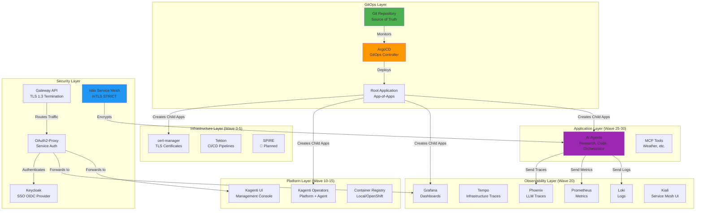
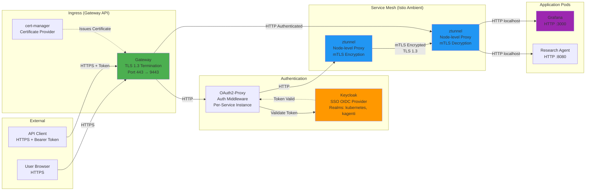
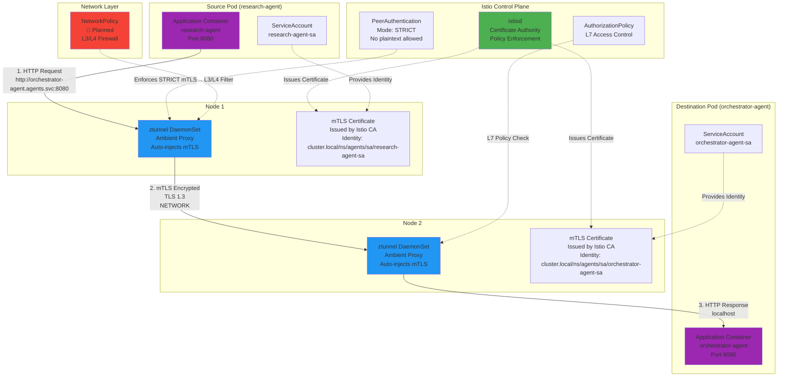
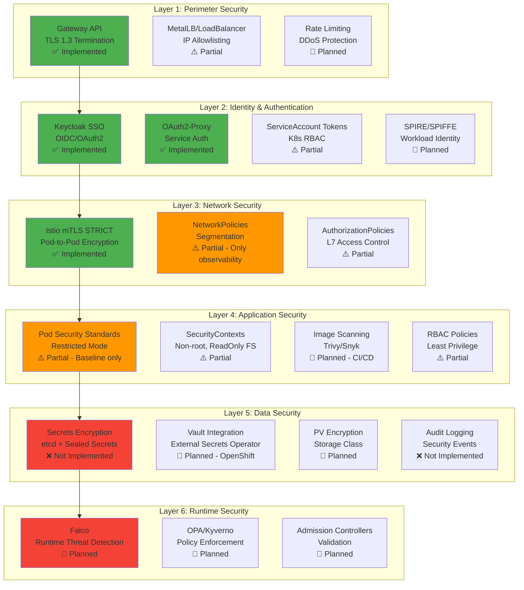
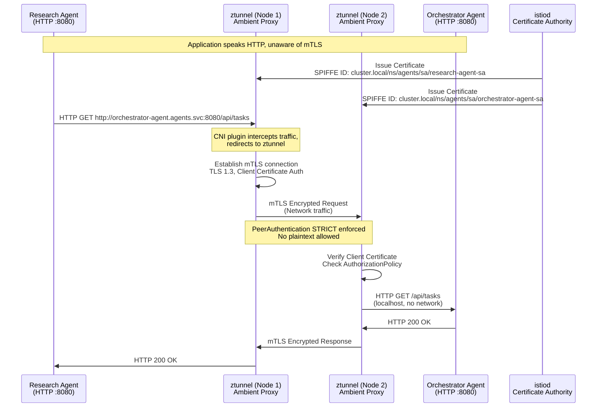
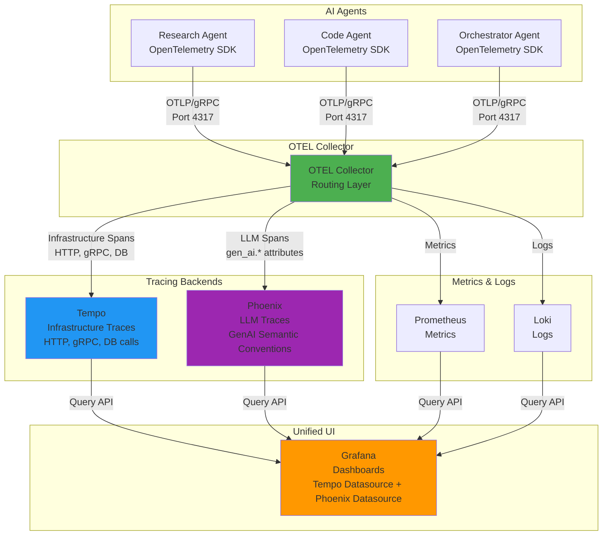

# Kagenti Platform Architecture

**Last Updated**: 2025-11-16
**Version**: 1.0
**Status**: Production-Ready (Local Development), OpenShift Preparation Phase

---

## 📋 Table of Contents

- [Architecture Overview](#architecture-overview)
- [High-Level System Architecture](#high-level-system-architecture)
- [ArgoCD GitOps Deployment Flow](#argocd-gitops-deployment-flow)
- [Component Layers](#component-layers)
- [Network Architecture](#network-architecture)
- [Security Architecture](#security-architecture)
- [Encryption and mTLS](#encryption-and-mtls)
- [Service Communication Patterns](#service-communication-patterns)
- [Observability Architecture](#observability-architecture)
- [Deployment Comparison](#deployment-comparison)
- [Implementation Status](#implementation-status)

---

## Architecture Overview

**Kagenti is a production-ready AI agent orchestration platform** deployed on Kubernetes using GitOps principles via ArgoCD. The platform follows a **layered architecture** with defense-in-depth security, dual-backend observability, and GitOps-driven deployment.

### Core Principles

1. **GitOps-First**: All changes tracked in Git, deployed via ArgoCD
2. **Defense-in-Depth**: 6 security layers (Perimeter → Runtime)
3. **Zero-Trust Networking**: mTLS STRICT for all pod-to-pod communication
4. **Components + Overlays**: Reusable base manifests with environment-specific patches
5. **Test-Driven Development**: Pytest integration tests after every deployment
6. **Dual-Backend Observability**: Tempo (infrastructure) + Phoenix (AI/LLM traces)

---

## High-Level System Architecture



**Status Legend**:
- ✅ **Implemented** - Fully deployed and tested
- ⚠️ **Partial** - Implemented but incomplete
- 🚧 **Planned** - Documented, not yet implemented

---

## ArgoCD GitOps Deployment Flow

### App-of-Apps Pattern

```mermaid
graph TB
    subgraph "Git Repository"
        GIT_ROOT[argocd/bootstrap/kind/<br/>root-app.yaml]
        GIT_APPS[argocd/applications/<br/>base/* + kind-local/*]
        GIT_COMP[components/<br/>00-03 layers]
    end

    subgraph "ArgoCD"
        ROOT[Root Application<br/>kagenti-platform-kind]

        subgraph "Infrastructure Apps (Wave 0-5)"
            APP_CERT[cert-manager<br/>Wave 0]
            APP_GW[Gateway API<br/>Wave 1]
            APP_ISTIO[Istio<br/>Wave 2]
            APP_KC[Keycloak<br/>Wave 3]
            APP_OAUTH[OAuth2-Proxy<br/>Wave 4]
            APP_TEKTON[Tekton<br/>Wave 5]
        end

        subgraph "Platform Apps (Wave 10-15)"
            APP_OP[Kagenti Operator<br/>Wave 10]
            APP_POP[Platform Operator<br/>Wave 11]
            APP_GW_CFG[Gateway Config<br/>Wave 12]
            APP_UI[Kagenti UI<br/>Wave 15]
        end

        subgraph "Observability Apps (Wave 20)"
            APP_PROM[Prometheus<br/>Wave 20]
            APP_TEMPO[Tempo<br/>Wave 20]
            APP_LOKI[Loki<br/>Wave 20]
            APP_GRAF[Grafana<br/>Wave 20]
            APP_PHOE[Phoenix<br/>Wave 20]
            APP_KIALI[Kiali<br/>Wave 20]
        end

        subgraph "Application Apps (Wave 25-30)"
            APP_AGENTS[AI Agents<br/>Wave 25]
        end
    end

    subgraph "Kubernetes Cluster"
        K8S_INFRA[Infrastructure Resources<br/>Namespaces, CRDs, Operators]
        K8S_PLATFORM[Platform Resources<br/>Gateway, UI, Secrets]
        K8S_OBS[Observability Resources<br/>Dashboards, Datasources]
        K8S_APPS[Application Resources<br/>Agent Deployments]
    end

    GIT_ROOT -->|Syncs| ROOT
    ROOT -->|Creates| APP_CERT
    ROOT -->|Creates| APP_GW
    ROOT -->|Creates| APP_ISTIO
    ROOT -->|Creates| APP_OP
    ROOT -->|Creates| APP_GRAF
    ROOT -->|Creates| APP_AGENTS

    GIT_APPS -->|References| APP_CERT
    GIT_COMP -->|Kustomize Build| APP_CERT

    APP_CERT -->|Wave 0: Deploys| K8S_INFRA
    APP_GW -->|Wave 1: Deploys| K8S_INFRA
    APP_ISTIO -->|Wave 2: Deploys| K8S_INFRA
    APP_KC -->|Wave 3: Deploys| K8S_INFRA
    APP_OAUTH -->|Wave 4: Deploys| K8S_INFRA
    APP_TEKTON -->|Wave 5: Deploys| K8S_INFRA

    APP_OP -->|Wave 10: Deploys| K8S_PLATFORM
    APP_POP -->|Wave 11: Deploys| K8S_PLATFORM
    APP_GW_CFG -->|Wave 12: Deploys| K8S_PLATFORM
    APP_UI -->|Wave 15: Deploys| K8S_PLATFORM

    APP_PROM -->|Wave 20: Deploys| K8S_OBS
    APP_TEMPO -->|Wave 20: Deploys| K8S_OBS
    APP_LOKI -->|Wave 20: Deploys| K8S_OBS
    APP_GRAF -->|Wave 20: Deploys| K8S_OBS
    APP_PHOE -->|Wave 20: Deploys| K8S_OBS
    APP_KIALI -->|Wave 20: Deploys| K8S_OBS

    APP_AGENTS -->|Wave 25: Deploys| K8S_APPS

    style ROOT fill:#ff9800
    style K8S_INFRA fill:#4caf50
    style K8S_APPS fill:#9c27b0
```



### Sync Wave Ordering

| Wave | Layer | Components | Dependencies | Status |
|------|-------|------------|--------------|--------|
| **-5** | Pre-Infrastructure | Namespaces | None | ✅ Implemented |
| **0** | Foundation | cert-manager | Namespaces | ✅ Implemented |
| **1** | Ingress | Gateway API, MetalLB | cert-manager | ✅ Implemented |
| **2** | Service Mesh | Istio (Ambient Mode) | Gateway API | ✅ Implemented |
| **3** | Identity | Keycloak | Istio | ✅ Implemented |
| **4** | Authentication | OAuth2-Proxy | Keycloak | ✅ Implemented |
| **5** | CI/CD | Tekton | Istio | ✅ Implemented |
| **10** | Operators | Kagenti Operator | Tekton | ✅ Implemented |
| **11** | Platform Operator | Platform Operator | Kagenti Operator | ✅ Implemented |
| **12** | Gateway Config | Gateway Routes, Certs | Keycloak, OAuth2-Proxy | ✅ Implemented |
| **15** | Platform UI | Kagenti UI | Platform Operator | ✅ Implemented |
| **20** | Observability | Grafana, Tempo, Phoenix, Prometheus, Loki, Kiali | OAuth2-Proxy | ✅ Implemented |
| **25** | Applications | AI Agents | All infrastructure | ✅ Implemented |
| **30** | Utilities | Kiali, K8s Dashboard | Observability | ✅ Implemented |

---

## Component Layers

### Layer 0: Infrastructure (Wave 0-5)

**Purpose**: Foundation for the platform (networking, certificates, service mesh, identity)

```
components/00-infrastructure/
├── cert-manager.yaml              ✅ TLS certificate management
├── gateway-api-chart/             ✅ Gateway API + MetalLB (Kind) / Routes (OpenShift)
├── istio/
│   ├── base/                      ✅ Istio Ambient Mesh
│   ├── operator.yaml              ✅ Istio Operator
│   └── istio-config/
│       └── strict-mtls.yaml       ✅ PeerAuthentication STRICT mode
├── keycloak/                      ✅ SSO Identity Provider (dual-realm)
├── oauth2-proxy/                  ✅ Service-level authentication
├── spire/                         🚧 Planned (SPIFFE/SPIRE for workload identity)
└── tekton/                        ✅ CI/CD pipelines
```

**Key Features**:
- ✅ **TLS 1.3** at Gateway (external traffic encrypted)
- ✅ **Istio Ambient Mesh** for agents (ztunnel, no sidecars)
- ✅ **mTLS STRICT** for all pod-to-pod communication
- ✅ **Keycloak SSO** with dual-realm architecture (kubernetes + kagenti)
- ✅ **OAuth2-Proxy** for services without native auth (Grafana, Kiali, Phoenix)
- 🚧 **SPIRE** integration planned for enhanced workload identity

### Layer 1: Platform (Wave 10-15)

**Purpose**: Platform-level services (operators, UI, gateway configuration)

```
components/01-platform/
├── gateway/
│   ├── gateway.yaml               ✅ Gateway resource
│   ├── httproutes/                ✅ HTTPRoute definitions (per service)
│   └── certificates/              ✅ TLS certificates (self-signed for Kind)
├── kagenti-ui/                    ✅ Platform management UI
├── kagenti-operator/              ✅ Agent lifecycle operator
└── platform-operator/             ✅ Platform infrastructure operator
```

**Key Features**:
- ✅ **Gateway API** (Kubernetes-native ingress)
- ✅ **Kagenti Operators** (agent lifecycle, platform infrastructure)
- ✅ **Kagenti UI** (platform management console)
- ✅ **HTTPRoute per service** (Grafana, Keycloak, ArgoCD, Phoenix, Kiali, UI)

### Layer 2: Observability (Wave 20)

**Purpose**: Monitoring, logging, tracing, and alerting

```
components/02-observability/
├── grafana/                       ✅ Metrics dashboards + unified UI
├── tempo/                         ✅ Distributed tracing (infrastructure)
├── phoenix/                       ✅ LLM observability (AI agents)
├── prometheus/                    ✅ Metrics collection
├── loki/                          ✅ Log aggregation
├── kiali/                         ⚠️ Service mesh visualization (optional)
├── alertmanager/                  🚧 Planned (alert routing)
└── mtls-policy.yaml               ✅ PERMISSIVE mTLS for OAuth2-Proxy backends
```

**Key Features**:
- ✅ **Dual-Backend Tracing**: Tempo (infrastructure traces) + Phoenix (LLM traces)
- ✅ **Grafana** as unified UI (dashboards for metrics, traces, logs)
- ✅ **Prometheus** for metrics (pods, services, Istio)
- ✅ **Loki** for log aggregation
- ✅ **Phoenix** for LLM observability (GenAI semantic conventions)
- ✅ **Kiali** for service mesh visualization
- ✅ **Grafana Alerting** (configured alerts for platform health)
- 🚧 **AlertManager** integration planned (advanced alert routing)

### Layer 3: Applications (Wave 25-30)

**Purpose**: AI agents and tools

```
components/03-applications/
├── agents/
│   ├── research-agent/            ✅ Research AI agent
│   ├── code-agent/                ✅ Code generation agent
│   ├── orchestrator-agent/        ✅ Agent orchestration
│   └── agent-builds/              ✅ Tekton pipeline for agent builds
└── tools/
    └── weather-service/           ✅ Example MCP tool
```

**Key Features**:
- ✅ **AI Agents** (research, code, orchestrator)
- ✅ **Istio Ambient Mesh** for agents (transparent mTLS, no sidecar overhead)
- ✅ **Tekton-based builds** (operator-driven CI/CD)
- ✅ **MCP tools** (weather service example)
- ✅ **OpenTelemetry instrumentation** (traces to Tempo and Phoenix)

---

## Network Architecture

### External to Internal Traffic Flow



**Traffic Flow**:
1. **User → Gateway**: HTTPS (TLS 1.3) → Gateway terminates TLS
2. **Gateway → OAuth2-Proxy**: HTTP (no encryption needed, same cluster)
3. **OAuth2-Proxy → Keycloak**: HTTP → validates token/session
4. **OAuth2-Proxy → Service**: HTTP → intercepted by ztunnel
5. **ztunnel → ztunnel**: mTLS (TLS 1.3, automatic encryption)
6. **ztunnel → Application**: HTTP on localhost (no network exposure)

### Pod-to-Pod Communication (Istio Ambient Mesh)



**Key Points**:
- ✅ **No sidecar injection** - Agents use Istio Ambient Mesh (ztunnel DaemonSet)
- ✅ **Transparent mTLS** - Applications speak HTTP, ztunnel handles encryption
- ✅ **Certificate-based identity** - ServiceAccount → SPIFFE ID → mTLS certificate
- ✅ **PeerAuthentication STRICT** - No plaintext traffic allowed
- 🚧 **NetworkPolicies planned** - Additional L3/L4 firewall (default-deny)

---

## Security Architecture

### Defense-in-Depth (6 Layers)



**Implementation Status**:

| Layer | Control | Kind (Local Dev) | OpenShift (Planned) | Status |
|-------|---------|------------------|---------------------|--------|
| **1. Perimeter** | TLS 1.3 at Gateway | ✅ Self-signed certs | ✅ Let's Encrypt | Implemented |
| **1. Perimeter** | Rate limiting | 🚧 Planned | 🚧 Planned | Not Implemented |
| **2. Identity** | Keycloak SSO | ✅ Dual-realm | ✅ Same | Implemented |
| **2. Identity** | OAuth2-Proxy | ✅ Per-service | ✅ Same | Implemented |
| **2. Identity** | SPIRE | 🚧 Planned | 🚧 Planned | Not Implemented |
| **3. Network** | mTLS STRICT | ✅ Ambient Mesh | ✅ Same | Implemented |
| **3. Network** | NetworkPolicies | ⚠️ Only observability | ✅ Default-deny | Partial |
| **3. Network** | AuthorizationPolicies | ⚠️ Basic | ✅ Comprehensive | Partial |
| **4. Application** | Pod Security Standards | ⚠️ Baseline mode | ✅ Restricted mode | Partial |
| **4. Application** | Image Scanning | 🚧 Planned (Trivy CI) | ✅ Trivy + admission | Not Implemented |
| **5. Data** | etcd Encryption | ❌ Not Implemented | ✅ FIPS-validated | Not Implemented |
| **5. Data** | Sealed Secrets | 🚧 Planned | N/A (use Vault) | Not Implemented |
| **5. Data** | Vault + ESO | N/A | 🚧 Planned | Not Implemented |
| **6. Runtime** | Falco | 🚧 Planned | 🚧 Planned | Not Implemented |
| **6. Runtime** | OPA/Kyverno | 🚧 Planned | 🚧 Planned | Not Implemented |

**See**: [TODO_SECURITY.md](./TODO_SECURITY.md) for comprehensive security roadmap.

---

## Encryption and mTLS

### Sidecar vs. Ambient Mesh

**Traditional Istio (Sidecar Mode)**:
```
Pod: [App Container] + [Envoy Sidecar Container]
     └─ Resource overhead per pod
     └─ Slower rollouts (sidecar startup)
```

**Istio Ambient Mesh (Used by Kagenti)**:
```
Pod: [App Container only]
     └─ No sidecar injection needed
     └─ Faster rollouts, lower resource usage

Node: [ztunnel DaemonSet]
      └─ Shared proxy per node
      └─ Transparent L4 mTLS for all pods
```

### mTLS Architecture



**Key Benefits**:
- ✅ **Transparent Security**: Apps unaware of mTLS, speak HTTP
- ✅ **Certificate Rotation**: Automatic, handled by Istio (24h default TTL)
- ✅ **Zero Trust**: Every service authenticates with certificate
- ✅ **Performance**: Node-level ztunnel vs. per-pod sidecar
- ✅ **Compliance**: mTLS STRICT ensures no plaintext traffic

---

## Service Communication Patterns

### Pattern 1: External User → Protected Service (Grafana)

```
User Browser
  └─> HTTPS (TLS 1.3) → Gateway API
       └─> HTTP → OAuth2-Proxy (grafana instance)
            └─> HTTP → Keycloak (token validation)
            └─> HTTP → ztunnel
                 └─> mTLS → ztunnel
                      └─> HTTP (localhost) → Grafana Pod
```

### Pattern 2: Agent-to-Agent Communication

```
Research Agent Pod
  └─> HTTP → ztunnel (Node 1)
       └─> mTLS (STRICT) → ztunnel (Node 2)
            └─> HTTP (localhost) → Orchestrator Agent Pod
```

### Pattern 3: Agent → Observability (Tracing)

```
Research Agent
  └─> HTTP → ztunnel
       └─> mTLS → ztunnel
            └─> HTTP (localhost) → Phoenix Pod (LLM traces)
                                   → Tempo Pod (infrastructure traces)
                                   → Prometheus Pod (metrics)
```

### Pattern 4: Operator → Kubernetes API

```
Kagenti Operator
  └─> HTTPS (ServiceAccount Token) → Kubernetes API Server
       └─> Create/Update/Delete AgentDeployment CRDs
```

---

## Observability Architecture

### Dual-Backend Tracing



**Why Dual Backend?**
- **Tempo**: General-purpose tracing (HTTP requests, gRPC, database calls, Istio spans)
- **Phoenix**: LLM-specific observability (prompt/completion, token usage, latency, costs)
- **Separation of Concerns**: AI traces have different analysis requirements vs. infrastructure traces

**GenAI Semantic Conventions**: Phoenix implements OpenTelemetry GenAI semantic conventions:
- `gen_ai.system` (e.g., "openai")
- `gen_ai.request.model` (e.g., "gpt-4")
- `gen_ai.usage.input_tokens`, `gen_ai.usage.output_tokens`
- `gen_ai.prompt`, `gen_ai.completion`

**See**: [docs/04-observability/distributed-tracing.md](./docs/04-observability/distributed-tracing.md)

---

## Deployment Comparison: Kind vs. OpenShift

| Component | Kind (Local Dev) | OpenShift (Production) | Status |
|-----------|------------------|------------------------|--------|
| **Kubernetes Version** | 1.28+ | 4.14+ | ✅ Compatible |
| **Ingress** | Gateway API + MetalLB | OpenShift Routes | ✅ Implemented (Kind), 🚧 Planned (OpenShift) |
| **Certificates** | Self-signed (cert-manager) | Let's Encrypt | ✅ Implemented (Kind), 🚧 Planned (OpenShift) |
| **Secrets** | Plain Kubernetes Secrets | Sealed Secrets → Vault + ESO | ❌ Not Implemented → 🚧 Planned |
| **Pod Security** | Baseline mode | Restricted mode (SCC) | ⚠️ Baseline (Kind), 🚧 SCC (OpenShift) |
| **NetworkPolicies** | Permissive (dev-friendly) | Strict (default-deny) | ⚠️ Partial (Kind), 🚧 Planned (OpenShift) |
| **RBAC** | Relaxed | Strict (least privilege) | ⚠️ Partial |
| **Image Registry** | Local registry (in-cluster) | OpenShift internal registry | ✅ Implemented (Kind), 🚧 Planned (OpenShift) |
| **Observability** | In-cluster (Grafana, Tempo) | Hybrid (in-cluster + Grafana Cloud) | ✅ Implemented (Kind), 🚧 Planned (OpenShift) |
| **Service Mesh** | Istio Ambient (manual install) | OpenShift Service Mesh | ✅ Implemented (Kind), 🚧 Planned (OpenShift) |
| **Storage** | Local PVs (no encryption) | OCS/ODF (encrypted) | ✅ Implemented (Kind), 🚧 Planned (OpenShift) |
| **CI/CD** | Tekton (in-cluster) | Tekton + Jenkins | ✅ Implemented (Kind), 🚧 Planned (OpenShift) |
| **etcd Encryption** | None (base64 only) | FIPS-validated AES | ❌ Not Implemented → 🚧 Planned |

---

## Implementation Status

### ✅ Fully Implemented (Production-Ready for Local Dev)

1. **GitOps Deployment**
   - ArgoCD with App-of-Apps pattern
   - Sync waves (proper ordering)
   - Components + Overlays structure
   - Branch-based development (auto-detects PR branches)

2. **Encryption**
   - TLS 1.3 at Gateway (external traffic)
   - Istio mTLS STRICT (pod-to-pod)
   - Self-signed certificates via cert-manager

3. **Authentication**
   - Keycloak SSO (dual-realm: kubernetes + kagenti)
   - OAuth2-Proxy (per-service instances for Grafana, Kiali, Phoenix)
   - ServiceAccount-based identity for pods

4. **Service Mesh**
   - Istio Ambient Mesh (ztunnel for agents)
   - PeerAuthentication STRICT mode
   - Automatic certificate rotation

5. **Observability**
   - Dual-backend tracing (Tempo + Phoenix)
   - Grafana dashboards (metrics, traces, logs)
   - Prometheus metrics collection
   - Loki log aggregation
   - Kiali service mesh visualization
   - Grafana Alerting (platform health checks)

6. **CI/CD**
   - Tekton pipelines (agent builds)
   - Kagenti Operator (agent lifecycle)
   - Platform Operator (infrastructure automation)
   - GitHub Actions workflows (platform validation, E2E tests)

7. **Testing**
   - Pytest integration tests (observability, platform health)
   - App state validation tests (ArgoCD, pods, services)
   - E2E platform tests
   - CI/CD integration (60-minute comprehensive tests)

### ⚠️ Partially Implemented

1. **NetworkPolicies**
   - ✅ Observability namespace has policies
   - ❌ Other namespaces lack policies
   - 🚧 Planned: Default-deny + allow-specific for all namespaces

2. **Pod Security Standards**
   - ✅ Some pods have SecurityContext
   - ❌ Not all pods run as non-root
   - ❌ No enforcement at namespace level
   - 🚧 Planned: Baseline mode (Kind), Restricted mode (OpenShift)

3. **RBAC**
   - ✅ ServiceAccounts created for operators, OAuth2-Proxy, Reflector
   - ❌ Not all follow least-privilege principle
   - 🚧 Planned: Comprehensive RBAC audit and hardening

4. **SecurityContexts**
   - ✅ Some deployments have proper SecurityContext
   - ❌ Not all deployments restrict capabilities
   - 🚧 Planned: Enforce across all workloads

### 🚧 Planned (Not Yet Implemented)

1. **CI/CD Security Scanning** (Priority: P0)
   - Trivy (container image scanning)
   - Snyk (dependency scanning)
   - Checkov (IaC security)
   - Kubescape (Kubernetes security)
   - Semgrep (SAST)
   - Pre-commit hooks (local dev)

2. **Secrets Management** (Priority: P0)
   - etcd encryption at rest
   - Sealed Secrets (Kind)
   - External Secrets Operator + Vault (OpenShift)
   - Automated secret rotation (90-day policy)

3. **NetworkPolicies** (Priority: P0)
   - Default-deny base policies
   - Service-specific allow rules
   - Kustomize overlays (Kind vs. OpenShift)

4. **Runtime Security** (Priority: P1)
   - Falco (runtime threat detection)
   - OPA/Kyverno (policy enforcement)
   - Admission controllers (image validation)

5. **OpenShift SCCs** (Priority: P0 for OpenShift)
   - SecurityContextConstraints for all components
   - restricted-v2 compliance
   - OpenShift Routes (replace Gateway API)

6. **Enhanced Observability** (Priority: P2)
   - AlertManager (advanced alert routing)
   - Security dashboards (Falco events, audit logs)
   - Compliance reporting

7. **SPIRE Integration** (Priority: P2)
   - SPIFFE workload identity
   - Enhanced certificate management
   - Integration with Istio

**See**: [TODO_SECURITY.md](./TODO_SECURITY.md) for ultra-detailed implementation tasks with code examples, validation steps, and timelines.

---

## Repository Structure

```
kagenti-demo-deployment/
├── argocd/
│   ├── bootstrap/kind/
│   │   └── root-app.yaml               # Root Application (App-of-Apps)
│   └── applications/
│       ├── base/                       # Reusable ArgoCD Application templates
│       ├── kind-local/                 # Kind-specific Application patches
│       └── helm/                       # Helm-based applications
│
├── components/                         # Kubernetes manifests (layered)
│   ├── 00-infrastructure/              # Wave 0-5: Foundation
│   │   ├── cert-manager.yaml
│   │   ├── gateway-api-chart/
│   │   ├── istio/
│   │   ├── keycloak/
│   │   ├── oauth2-proxy/
│   │   ├── spire/                      # 🚧 Planned
│   │   └── tekton/
│   ├── 01-platform/                    # Wave 10-15: Platform services
│   │   ├── gateway/
│   │   ├── kagenti-ui/
│   │   ├── kagenti-operator/
│   │   └── platform-operator/
│   ├── 02-observability/               # Wave 20: Monitoring
│   │   ├── grafana/
│   │   ├── tempo/
│   │   ├── phoenix/
│   │   ├── prometheus/
│   │   ├── loki/
│   │   └── kiali/
│   ├── 03-applications/                # Wave 25-30: AI Agents
│   │   └── agents/
│   └── 08-security/                    # 🚧 Planned
│       ├── network-policies/
│       ├── pod-security/
│       ├── rbac/
│       └── sealed-secrets/
│
├── environments/                       # 🚧 Legacy (use argocd/applications overlays)
│   └── openshift-stage/
│
├── scripts/
│   ├── quick-redeploy.sh               # One-command cluster redeploy
│   ├── platform-status.sh              # Health check + pytest
│   ├── monitor-argocd-apps.sh          # Monitor sync progress
│   ├── show-access-info.sh             # Service URLs + credentials
│   └── kind/
│       ├── 00-cleanup.sh
│       ├── 01-create-cluster.sh
│       ├── 02-install-argocd.sh
│       ├── 03-bootstrap-apps.sh
│       └── 04-load-agent-images.sh     # Legacy (use operator builds)
│
├── tests/
│   ├── integration/                    # Integration tests (observability, etc.)
│   ├── validation/                     # Platform validation (app state, health)
│   └── e2e/                            # End-to-end platform tests
│
└── docs/                              # Comprehensive documentation
    ├── 00-getting-started/
    ├── 01-infrastructure/
    ├── 02-service-mesh/
    ├── 03-authentication/
    ├── 04-observability/
    ├── 05-ci-cd/
    ├── 07-platform/
    ├── 08-security/
    ├── 09-deployment/
    ├── 10-operations/
    └── runbooks/alerts/
```

---

## Further Reading

### Core Documentation

- [README.md](./README.md) - Platform overview, quick start, deployment options
- [CLAUDE.md](./CLAUDE.md) - GitOps workflow, TDD approach, development iteration
- [TODO_SECURITY.md](./TODO_SECURITY.md) - Comprehensive security roadmap (Kind → OpenShift)

### Architecture & Design

- [argocd_architecture.md](./argocd_architecture.md) - ArgoCD architecture, sync waves
- [docs/08-security/encryption.md](./docs/08-security/encryption.md) - TLS 1.3 + mTLS STRICT
- [docs/OBSERVABILITY_ARCHITECTURE.md](./docs/OBSERVABILITY_ARCHITECTURE.md) - Dual-backend tracing

### Component Documentation

- [docs/01-infrastructure/argocd.md](./docs/01-infrastructure/argocd.md) - ArgoCD deployment
- [docs/01-infrastructure/gateway-api.md](./docs/01-infrastructure/gateway-api.md) - Gateway API configuration
- [docs/02-service-mesh/istio.md](./docs/02-service-mesh/istio.md) - Istio Ambient Mesh
- [docs/03-authentication/keycloak.md](./docs/03-authentication/keycloak.md) - Keycloak SSO
- [docs/04-observability/distributed-tracing.md](./docs/04-observability/distributed-tracing.md) - Tempo + Phoenix
- [docs/04-observability/grafana.md](./docs/04-observability/grafana.md) - Grafana dashboards
- [docs/04-observability/phoenix.md](./docs/04-observability/phoenix.md) - LLM observability
- [docs/08-security/encryption.md](./docs/08-security/encryption.md) - Encryption architecture
- [docs/08-security/network-policies.md](./docs/08-security/network-policies.md) - Network segmentation
- [docs/08-security/security-roadmap.md](./docs/08-security/security-roadmap.md) - Security maturity model

### Operations

- [docs/10-operations/troubleshooting.md](./docs/10-operations/troubleshooting.md) - Common issues
- [docs/runbooks/alerts/README.md](./docs/runbooks/alerts/README.md) - Alert troubleshooting

---

**Last Updated**: 2025-11-16
**Maintained By**: Kagenti Platform Team
**License**: Apache 2.0

---

**Status Legend**:
- ✅ **Implemented** - Fully deployed and tested
- ⚠️ **Partial** - Implemented but incomplete
- 🚧 **Planned** - Documented in roadmap, not yet implemented
- ❌ **Not Implemented** - Not started
