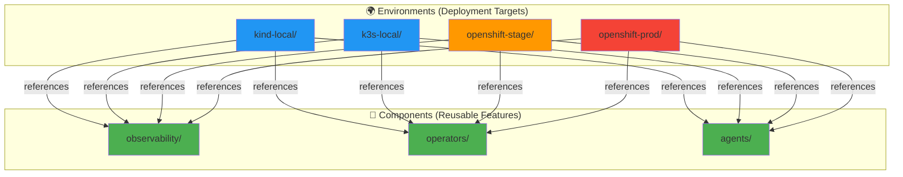
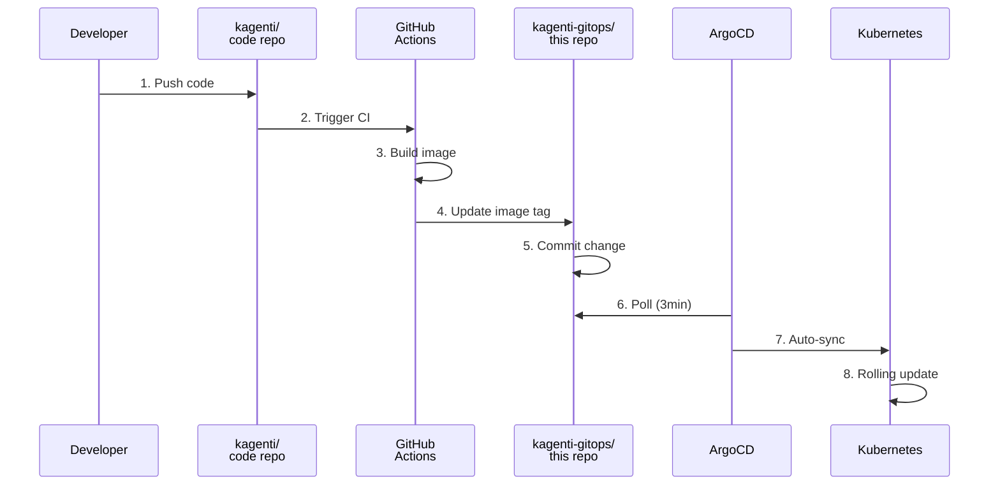
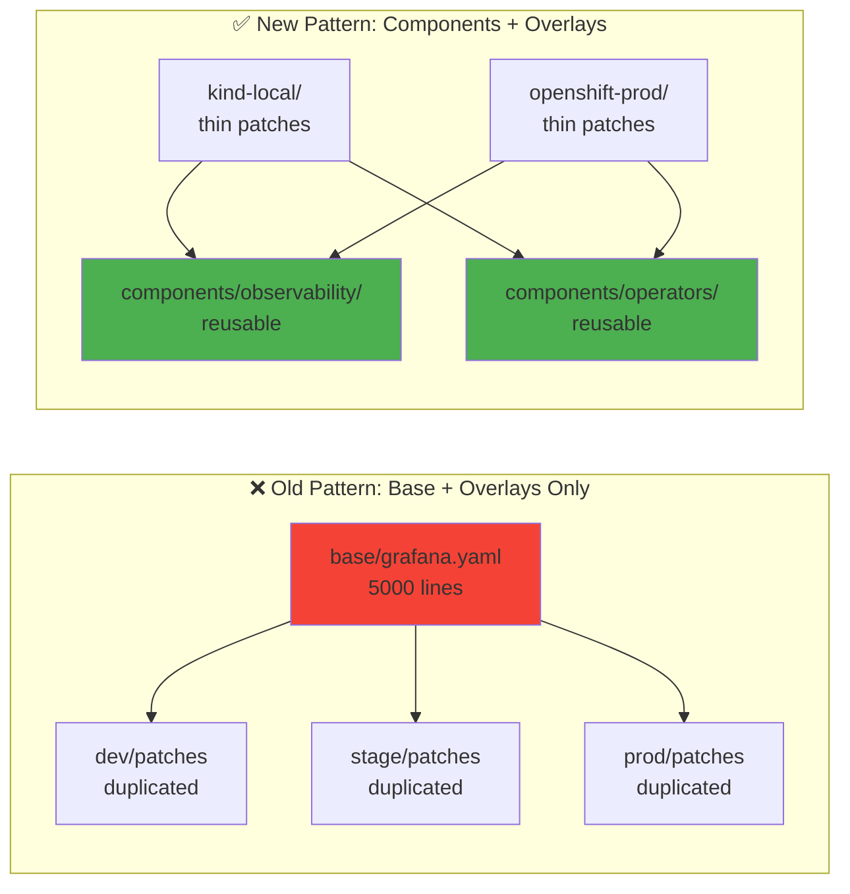

# Kagenti Demo Deployment

GitOps repository for deploying Kagenti AI Agent platform across multiple environments using **Components + Overlays** pattern (2025 best practice).

> 👉 **New to this repo?** Start with [QUICKSTART.md](QUICKSTART.md) for a 5-minute deployment guide.

## 🎯 Quick Start

### Kind (Local Development) - ArgoCD GitOps

```bash
# 1. Create Kind cluster and install ArgoCD
./scripts/kind/00-cleanup.sh          # Clean slate (if needed)
./scripts/kind/01-create-cluster.sh   # Create Kind cluster with MetalLB
./scripts/kind/02-install-argocd.sh   # Install ArgoCD v2.9.3

# 2. Bootstrap ArgoCD Applications (App-of-Apps pattern)
./scripts/kind/03-bootstrap-apps.sh

# 3. Sync all layers from Git
argocd app sync infrastructure        # Deploy infrastructure (Keycloak, OTEL, etc.)
argocd app sync platform               # Deploy platform (Kagenti UI, Operators)
argocd app sync observability          # Deploy observability (Grafana, Phoenix)
argocd app sync agents                 # Deploy AI agents

# 4. Access services
open https://localhost:8080            # ArgoCD UI (admin / <see output>)
open https://grafana.localtest.me:9443  # Grafana
open https://kagenti.localtest.me:9443  # Kagenti UI
```

### Other Environments

| Environment | Status | Deployment Method |
|-------------|--------|-------------------|
| **K3s (Rancher Desktop)** | 🚧 Work in Progress | `kubectl apply -k environments/k3s-local` |
| **OpenShift Stage** | 🚧 Work in Progress | ArgoCD ApplicationSet (planned) |
| **OpenShift Prod** | 🚧 Work in Progress | ArgoCD ApplicationSet (planned) |

> 🔒 **All services use HTTPS-only**. See [HTTPS_ACCESS_GUIDE.md](HTTPS_ACCESS_GUIDE.md) for service URLs and access details.

## 📐 Architecture

**See [ARCHITECTURE.md](ARCHITECTURE.md)** for:
- Component layers and deployment structure
- Single source of truth (no duplications)
- Deployment methods per service (Operator/Helm/Kustomize)
- Encryption architecture (Istio mTLS STRICT)
- ArgoCD sync waves and ordering

## 🚀 ArgoCD GitOps Workflow

This repository uses **ArgoCD for GitOps-based deployment**. All changes go through Git, ensuring:
- ✅ Full audit trail of every change
- ✅ Easy rollback to any previous state
- ✅ Consistent deployments across environments
- ✅ No manual `kubectl apply` commands

### Development Workflow

```bash
# 1. Set up Kind cluster with ArgoCD
./scripts/kind/00-cleanup.sh          # Clean slate
./scripts/kind/01-create-cluster.sh   # Create cluster
./scripts/kind/02-install-argocd.sh   # Install ArgoCD
./scripts/kind/03-bootstrap-apps.sh   # Bootstrap Applications

# 2. Sync from Git (after pushing changes to your fork)
argocd app sync infrastructure        # Sync infrastructure layer
argocd app sync platform               # Sync platform layer
argocd app sync observability          # Sync observability layer
argocd app sync agents                 # Sync agents layer
```

### Switching Branches/Forks

You can easily switch which Git branch or fork ArgoCD syncs from:

```bash
# Switch to a different branch
argocd app set infrastructure --revision feature-branch

# Switch to a different fork
argocd app set infrastructure \
  --repo https://github.com/youruser/kagenti-demo-deployment.git \
  --revision main

# Switch all apps at once (update root app)
argocd app set kagenti-platform-kind \
  --repo https://github.com/youruser/kagenti-demo-deployment.git \
  --revision dev-branch
argocd app sync kagenti-platform-kind  # Recreate child apps
```

> 📖 **For detailed ArgoCD usage**, see [CLAUDE.md](CLAUDE.md)

## Supported Environments

- ✅ **Kind (Local)** - Local development on Kind cluster
- ✅ **K3s (Rancher Desktop)** - Local development on K3s/Rancher Desktop
- ✅ **OpenShift Stage** - External OpenShift staging environment
- ✅ **OpenShift Prod** - External OpenShift production environment

## 📐 Architecture

### Components + Overlays Pattern



### GitOps Workflow



## Repository Structure

```
kagenti-demo-deployment/
├── argocd/                        # 🔄 ArgoCD GitOps Definitions
│   ├── bootstrap/kind/           #   ├─ Root Application (App-of-Apps)
│   └── applications/             #   └─ Application definitions (base + overlays)
│       ├── base/                #       ├─ Reusable Application templates
│       └── kind-local/          #       └─ Kind-specific patches
│
├── components/                    # 🧩 Reusable Kubernetes Manifests
│   ├── infrastructure/           #   ├─ Foundation (Keycloak, OTEL, Tekton)
│   ├── platform/                #   ├─ Kagenti platform (UI, Operators)
│   ├── observability/           #   ├─ Monitoring (Grafana, Phoenix, Jaeger)
│   └── agents/                  #   └─ AI agents (research, code, orchestrator)
│
├── scripts/                      # 🔧 Automation Scripts
│   ├── kind/                    #   ├─ Kind cluster setup + ArgoCD install
│   ├── argocd/                  #   ├─ ArgoCD helper scripts
│   └── cleanup/                 #   └─ Cleanup & rollback
│
├── environments/                 # 🌍 Legacy environment overlays (K3s, OpenShift)
└── docs/                        # 📚 Documentation
```

## ArgoCD Application Hierarchy

```
kagenti-platform-kind (Root App)
├── infrastructure → components/infrastructure/
├── platform → components/platform/
├── observability → components/observability/
└── agents → components/agents/
```

## 📚 Documentation

### 🚀 Getting Started

- **[Quick Start Guide](docs/00-getting-started/quick-start.md)** - 15-minute local deployment
- **[Architecture Overview](docs/00-getting-started/architecture-overview.md)** - Platform architecture and components
- **[Documentation Index](docs/README.md)** - Complete documentation navigation

### 📖 Core Guides

**Infrastructure & GitOps:**
- **[Kubernetes & Kind](docs/01-infrastructure/kubernetes.md)** - Local Kubernetes development with Kind
- **[Gateway API](docs/01-infrastructure/gateway-api.md)** - HTTPRoute, TLS termination, and Istio integration
- **[cert-manager](docs/01-infrastructure/cert-manager.md)** - Automated TLS certificate management and renewal
- **[ArgoCD GitOps](docs/01-infrastructure/argocd.md)** - GitOps deployment with ApplicationSets
- **[Istio Service Mesh](docs/02-service-mesh/istio.md)** - Ambient mode, Gateway API, and mTLS security

**Authentication & Security:**
- **[Keycloak SSO](docs/03-authentication/keycloak.md)** - Single Sign-On and identity management
- **[OAuth2-Proxy](docs/03-authentication/oauth2-proxy.md)** - OAuth2 authentication proxy for services

**Observability:**
- **[Distributed Tracing](docs/04-observability/distributed-tracing.md)** - Tempo + Phoenix dual-backend architecture
- **[Phoenix](docs/04-observability/phoenix.md)** - LLM and AI agent observability with OpenInference
- **[Kiali](docs/04-observability/kiali.md)** - Service mesh visualization and traffic analysis
- **[Grafana Dashboards](docs/04-observability/grafana.md)** - Metrics visualization and Keycloak OIDC
- **[Prometheus Metrics](docs/04-observability/prometheus.md)** - ServiceMonitor, PromQL queries, and alerting
- **[Loki Logs](docs/04-observability/loki.md)** - Log aggregation and LogQL (planned deployment)
- **[Korrel8r](docs/04-observability/korrel8r.md)** - Signal correlation engine (planned deployment)
- **[GenAI Semantic Conventions](docs/04-observability/genai-semantic-conventions.md)** - **MANDATORY compliance for all AI agents**

### 📑 Reference Documentation

**Planning & Progress:**
- [Documentation Progress](DOCS_PROGRESS_2025-11-11.md) - Current documentation status
- [Deployment Issues](DEPLOYMENT_ISSUES_2025-11-11.md) - Known deployment issues and fixes
- [ArgoCD Cleanup Plan](TODO_ARGO_CLEANUP.md) - ArgoCD App-of-Apps migration
- [ApplicationSets Migration](TODO_ARGO_NEXT.md) - ApplicationSets adoption plan

**Legacy Documentation** (reference only):
- [Old Documentation](old_docs/) - Previous documentation (preserved for reference)
- [Legacy Deployment Guide](old_docs/DEPLOYMENT.md)
- [Legacy Tracing Architecture](old_docs/TRACING_ARCHITECTURE.md)
- [Legacy Keycloak GitOps](old_docs/KEYCLOAK_GITOPS_ARCHITECTURE.md)

## 🧩 Why Components + Overlays?

This repository uses the **2025 recommended pattern**: Hybrid Components + Overlays.



**Benefits:**
- ✅ **DRY (Don't Repeat Yourself)** - No code duplication
- ✅ **Modular** - Enable/disable features per environment
- ✅ **Maintainable** - Update once, apply everywhere
- ✅ **Scalable** - Easy to add new environments or components

## 🔭 Observability Stack

Kagenti includes a comprehensive observability stack with **dual-backend tracing** and **HTTPS-only access**:

| Component | Purpose | Access (Kind) | Production Auth |
|-----------|---------|---------------|-----------------|
| **Jaeger** | Infrastructure traces (Istio, Redis, PostgreSQL) | https://jaeger.localtest.me:9443 | Keycloak `kubernetes` realm |
| **Phoenix** | Agent/LLM traces (OpenInference) | https://phoenix.localtest.me:9443 | Keycloak `kagenti` realm |
| **OTEL Collector** | Routes traces to Jaeger or Phoenix | Internal service | N/A |
| **Grafana** | Metrics dashboards | https://grafana.localtest.me:9443 | Keycloak `kubernetes` realm |
| **Kubernetes Dashboard** | Cluster management UI | https://kubernetes-dashboard.localtest.me:9443 | Keycloak `kubernetes` realm |
| **Keycloak** | Authentication & SSO | https://keycloak.localtest.me:9443 | Admin: `admin` / `admin` |

**Security Features**:
- 🔒 **HTTPS-only** - All external services use TLS with automatic HTTP→HTTPS redirect
- 🔒 **Istio mTLS** - Service-to-service communication encrypted
- 🔒 **NetworkPolicies** - Defense-in-depth network security
- 🔒 **Keycloak SSO** - Dual-realm authentication (`kubernetes` + `kagenti`)

**Two-Tier Tracing Architecture**:
- **Jaeger** handles high-volume infrastructure traces (short retention: 7-14 days)
- **Phoenix** handles valuable agent/LLM traces (long retention: 30-90 days)
- **OTEL Collector** automatically routes based on `openinference.span.kind` attribute

**Documentation**:
- 🔐 [HTTPS_ACCESS_GUIDE.md](HTTPS_ACCESS_GUIDE.md) - Service URLs and HTTPS access
- 🔒 [HTTPS_ENFORCEMENT_SUMMARY.md](HTTPS_ENFORCEMENT_SUMMARY.md) - HTTPS implementation details
- 🔑 **[Keycloak SSO Guide](docs/03-authentication/keycloak.md)** - Authentication architecture
- 📊 **[Distributed Tracing Guide](docs/04-observability/distributed-tracing.md)** - Dual-backend tracing (Tempo + Phoenix)

## Environment Configuration

### Resource Requirements

| Environment | Total CPU | Total Memory | Pods | Notes |
|-------------|-----------|--------------|------|-------|
| **Kind (Local)** | ~3-4 cores | ~8-12 GB | 35+ | Full platform with observability |
| **K3s (Rancher)** | ~4-6 cores | ~12-16 GB | 35+ | Full platform with observability |
| **OpenShift Stage** | ~8-12 cores | ~24-32 GB | 40+ | HA mode, persistent storage |
| **OpenShift Prod** | ~16-24 cores | ~48-64 GB | 50+ | HA mode, multiple replicas |

### Per-Component Resource Requests (Kind)

| Component | Replicas | CPU Request | Memory Request | Purpose |
|-----------|----------|-------------|----------------|---------|
| **Platform Operator** | 1 | 100m | 128Mi | Manages Component CRs |
| **Agent Operator** | 0 | 100m | 128Mi | Manages Agent CRs (optional) |
| **Kagenti UI** | 1 | 100m | 256Mi | Web interface |
| **Keycloak** | 1 | 500m | 512Mi | SSO/Authentication |
| **PostgreSQL** | 1 | 250m | 256Mi | Keycloak database |
| **Grafana** | 1 | 100m | 256Mi | Dashboards |
| **Tempo** | 1 | 200m | 512Mi | Distributed tracing |
| **Phoenix** | 1 | 100m | 256Mi | LLM observability |
| **Jaeger** | 1 | 200m | 512Mi | Tracing UI |
| **Kiali** | 1 | 100m | 256Mi | Service mesh UI |
| **OTEL Collector** | 2 | 200m | 512Mi | Telemetry collection |
| **Istio (istiod)** | 1 | 500m | 2Gi | Service mesh control plane |
| **ArgoCD** | 7 pods | ~1000m | ~2Gi | GitOps deployment |
| **Tekton** | 3 pods | ~300m | ~768Mi | CI/CD pipelines |

**Total for Kind**: ~3.5 CPU cores, ~9 GB memory

### Environment-Specific Features

| Feature | Kind | K3s | OpenShift Stage | OpenShift Prod |
|---------|------|-----|-----------------|----------------|
| **Replicas (per service)** | 1 | 1 | 2 | 3 (HA) |
| **Ingress** | HTTPRoute (Gateway API) | Traefik | OpenShift Route | OpenShift Route + TLS |
| **Service Mesh** | Istio (upstream) | Istio (upstream) | OpenShift Service Mesh 3.0 | OpenShift Service Mesh 3.0 |
| **Operators** | Upstream (Helm) | Upstream (Helm) | Red Hat Certified (OLM) | Red Hat Certified (OLM) |
| **Security** | Istio mTLS STRICT | Istio mTLS STRICT | SCC restricted-v2 + mTLS | SCC restricted-v2 + mTLS |
| **Authentication** | Keycloak SSO | Keycloak SSO | Keycloak SSO | Keycloak SSO |
| **Sync Policy** | Manual (first deploy), Auto (updates) | Auto | Auto | Manual |
| **PodDisruptionBudget** | No | No | Yes | Yes |
| **Tracing Storage** | In-memory (Tempo) | In-memory | Persistent (Tempo) | Persistent (Tempo + Elasticsearch) |
| **Monitoring Retention** | 1 day | 7 days | 30 days | 90 days |
