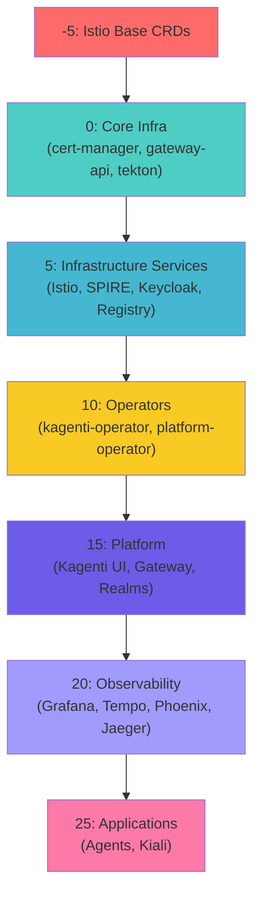
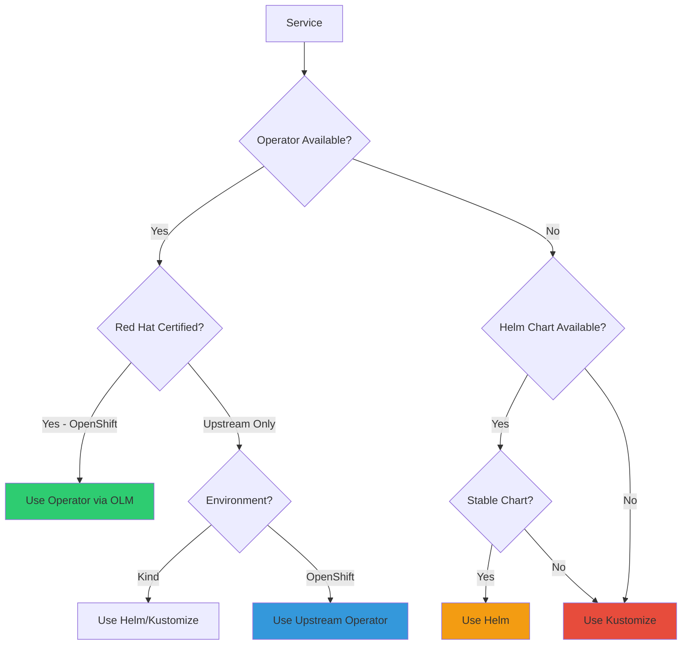

# ArgoCD Structure Cleanup Plan

**Version**: 1.0
**Date**: 2025-11-10
**Status**: Planning Phase - DO NOT START CLEANUP YET

---

## Executive Summary

This repository currently has **duplicate deployment methods** for the same services and an incomplete migration to operator-based deployments. The `components/` directory contains 240 YAML files with mixed deployment approaches, while `components-new/` (11 files) demonstrates the future operator-based pattern but is not integrated.

**Critical Issues**:
- Keycloak deployed 3 different ways (Helm + Kustomize + Operator-ready)
- Container Registry deployed 2 ways (Helm + Kustomize)
- Two similar Kagenti operators causing resource conflicts
- No clear Kind vs OpenShift deployment strategy

**Goal**: Consolidate to a single, production-ready deployment method per service with clear environment-specific overlays.

---

## Current ArgoCD Structure Overview

### Application Count: 18 Active Applications

```
Root: kagenti-platform-kind (App-of-Apps)
├── 11 Kustomize-based Applications
├── 7 Helm-based Applications
└── 0 Operator-based Applications (but 1 ready in components-new/)
```

### Deployment Method Breakdown

| Method | Count | Purpose |
|--------|-------|---------|
| **Kustomize** | 11 apps | Infrastructure, Platform, Observability, Agents |
| **Helm** | 7 apps | Istio, SPIRE, Kiali, Operators, Keycloak, Registry |
| **Operator** | 0 apps | (Keycloak Operator ready but not deployed) |

### Sync Wave Flow



### Directory Structure

```
kagenti-demo-deployment/
├── argocd/
│   ├── applications/
│   │   ├── base/                      # Kustomize-based Apps (11)
│   │   │   ├── 00-infrastructure/     # 5 infra apps
│   │   │   ├── keycloak.yaml         # 🔴 DUPLICATE
│   │   │   ├── container-registry.yaml # 🔴 DUPLICATE
│   │   │   ├── platform.yaml
│   │   │   ├── observability.yaml
│   │   │   └── agents.yaml
│   │   ├── helm/                      # Helm-based Apps (7)
│   │   │   ├── istio-base.yaml
│   │   │   ├── istiod.yaml
│   │   │   ├── keycloak.yaml         # 🔴 DUPLICATE
│   │   │   ├── container-registry.yaml # 🔴 DUPLICATE
│   │   │   ├── kagenti-operator.yaml
│   │   │   ├── platform-operator.yaml # ⚠️ Similar to kagenti-operator
│   │   │   ├── spire.yaml
│   │   │   └── kiali.yaml
│   │   └── kind-local/                # Environment overlays
│   └── bootstrap/kind/root-app.yaml
│
├── components/                         # 240 files - ACTIVE
│   ├── 00-infrastructure/             # 16 subdirectories
│   ├── 01-platform/                   # 9 subdirectories
│   ├── 02-observability/              # 8 subdirectories
│   └── 03-applications/               # 2 subdirectories
│
└── components-new/                     # 11 files - READY BUT NOT INTEGRATED
    ├── base/keycloak-operator/        # Operator-based Keycloak
    └── overlays/
        ├── kind-local/keycloak/
        └── openshift/keycloak/
```

---

## Critical Duplications Found

### 🔴 DUPLICATION 1: Keycloak (3 Deployment Methods!)

| Method | Location | Status | Issues |
|--------|----------|--------|--------|
| **Helm** | `argocd/applications/helm/keycloak.yaml` | Active | Embedded PostgreSQL, not production-ready |
| **Kustomize** | `argocd/applications/base/keycloak.yaml` → `components/00-infrastructure/keycloak-infra/` | Active | Manual StatefulSet deployment |
| **Operator** | `components-new/base/keycloak-operator/` | Ready, not deployed | Production-ready, declarative realm imports |

**Current Behavior**: Likely only ONE is actually deployed based on which kustomization is referenced.

**Recommendation**:
- **Kind**: Use Keycloak Operator (from components-new/)
- **OpenShift**: Use Red Hat Keycloak Operator via OLM
- **Remove**: Both Helm and Kustomize variants

**Why Operator?**
- Declarative realm management via `KeycloakRealmImport` CRs
- Automated upgrades and lifecycle management
- Better high availability configuration
- Red Hat support for OpenShift production

**Documentation**:
- Upstream: https://www.keycloak.org/operator/installation
- Red Hat: https://access.redhat.com/documentation/en-us/red_hat_build_of_keycloak/22.0

---

### 🔴 DUPLICATION 2: Container Registry (2 Deployment Methods)

| Method | Location | Status |
|--------|----------|--------|
| **Helm** | `argocd/applications/helm/container-registry.yaml` | Active - Chart: `stable/docker-registry:1.9.4` |
| **Kustomize** | `argocd/applications/base/container-registry.yaml` → `components/00-infrastructure/container-registry/` | Active |

**Recommendation**:
- **Kind**: Keep Helm (simpler, well-maintained chart)
- **OpenShift**: Use integrated OpenShift Image Registry
- **Remove**: Kustomize variant

**Why Helm for Kind?**
- Easier configuration via values.yaml
- Well-tested chart with PVC management
- Not critical infrastructure (dev-only)

**Why OpenShift Registry for Production?**
- Integrated with OpenShift authentication
- Automatic imagestream management
- No additional components needed

---

### ⚠️ DUPLICATION 3: Kagenti Operators (2 Similar Operators)

| Operator | Location | Purpose | Image |
|----------|----------|---------|-------|
| **kagenti-operator** | `argocd/applications/helm/kagenti-operator.yaml` | Platform operator | `localhost:5001/kagenti-operator:dev` |
| **platform-operator** | `argocd/applications/helm/platform-operator.yaml` | Platform operator | `localhost:5001/kagenti-platform-operator:dev` |

**Current Issue**: Both deploy identical Tekton pipeline ConfigMaps causing `SharedResourceWarnings` in ArgoCD.

**Investigation Needed**:
- [ ] Clarify the difference between these two operators
- [ ] Determine if both are actually needed
- [ ] Check upstream kagenti-operator repository for clarification
- [ ] Review CRDs managed by each operator

**Temporary Status**: Keep both until upstream clarification, resolve SharedResource warnings via ServerSideApply (already configured).

---

## Deployment Method Strategy

### Decision Framework



### Services That SHOULD Use Operators

| Service | Operator Available | Kind Strategy | OpenShift Strategy | Reason |
|---------|-------------------|---------------|-------------------|---------|
| **Keycloak** | ✅ Yes (Upstream + Red Hat) | Keycloak Operator | Red Hat Keycloak Operator (OLM) | Declarative realm management, HA, lifecycle |
| **Istio** | ✅ Sail Operator (SM 3.0) | Helm (upstream) | Sail Operator (OLM) | OpenShift Service Mesh 3.0 integration |
| **Tekton** | ✅ OpenShift Pipelines | Kustomize YAML | OpenShift Pipelines Operator (OLM) | Console integration, enterprise support |
| **Cert-Manager** | ✅ cert-manager for OpenShift | Kustomize YAML | cert-manager Operator (OLM) | GA since April 2025, Red Hat support |
| **Kiali** | ✅ Kiali Operator | Helm | Kiali Operator (bundled with SM) | Service mesh visualization |

**Documentation**:
- Sail Operator: https://docs.openshift.com/container-platform/4.17/service_mesh/v3x/ossm-about.html
- OpenShift Pipelines: https://docs.openshift.com/pipelines/latest/about/understanding-openshift-pipelines.html
- cert-manager for OpenShift: https://docs.redhat.com/en/documentation/cert-manager_operator_for_red_hat_openshift

---

### Services That SHOULD Use Helm

| Service | Kind Strategy | OpenShift Strategy | Reason |
|---------|---------------|-------------------|---------|
| **SPIRE** | Helm | Helm | No operator, well-maintained chart |
| **Container Registry** | Helm | OpenShift Integrated | Simple chart, dev-only for Kind |
| **Kagenti Operators** | Helm | Helm | These ARE operators, no wrapper needed |

**Why Helm?**
- Mature, well-tested charts
- Easy configuration via values
- No operator overhead for stateless services
- Better for rapid development iteration

---

### Services That SHOULD Use Kustomize

| Service | Reason | Production Readiness |
|---------|--------|---------------------|
| **Gateway API** | CRD-only, no chart exists | ✅ Production-ready |
| **Grafana** | Custom dashboards, simple deployment | ✅ Production-ready |
| **Phoenix** | No Helm chart available | ✅ Production-ready |
| **Tempo** | Simple deployment, custom config | ✅ Production-ready |
| **OTEL Collector** | Custom pipeline configuration | ✅ Production-ready |
| **Jaeger** | Being replaced by Tempo | ⚠️ Deprecated |
| **OAuth2-Proxy** | Multiple instances with different configs | ✅ Production-ready |

**Why Kustomize?**
- Full control over manifests
- Easy patching per environment
- No Helm dependency
- GitOps-native approach

**When NOT to use Kustomize**:
- Complex stateful services (use Operators)
- Services with many configuration options (use Helm)
- When a certified operator exists (use Operator)

---

## Cleanup Plan - Phased Approach

### Phase 1: Analysis & Documentation (THIS PHASE)

**Status**: ✅ COMPLETE

- [x] Inventory all ArgoCD Applications
- [x] Identify duplications
- [x] Research operator availability
- [x] Document current architecture
- [x] Create cleanup plan (this document)

---

### Phase 2: Resolve Critical Duplications (NEXT STEPS)

**Priority**: HIGH
**Estimated Time**: 2-4 hours
**Risk**: Medium (requires ArgoCD sync)

#### Step 2.1: Consolidate Keycloak to Operator-Based Deployment

**Goal**: Replace 3 Keycloak deployments with 1 operator-based deployment.

**Prerequisites**:
- [ ] Install Keycloak Operator in cluster
  ```bash
  # For Kind (upstream operator)
  kubectl apply -f https://raw.githubusercontent.com/keycloak/keycloak-k8s-resources/26.0.7/kubernetes/keycloaks.k8s.keycloak.org-v1.yml
  kubectl apply -f https://raw.githubusercontent.com/keycloak/keycloak-k8s-resources/26.0.7/kubernetes/keycloakrealmimports.k8s.keycloak.org-v1.yml
  kubectl apply -f https://raw.githubusercontent.com/keycloak/keycloak-k8s-resources/26.0.7/kubernetes/kubernetes.yml
  ```

**Tasks**:
1. **Create Keycloak Operator ArgoCD Application**
   - [ ] Create `argocd/applications/base/keycloak-operator.yaml`
   - [ ] Point to `components-new/base/keycloak-operator/`
   - [ ] Set sync-wave: 5 (after cert-manager)
   - [ ] Test in Kind environment

2. **Migrate Realm Configurations**
   - [ ] Verify `components-new/base/keycloak-operator/realm-import-kubernetes.yaml` matches current realms
   - [ ] Verify `components-new/base/keycloak-operator/realm-import-kagenti.yaml` matches current realms
   - [ ] Test realm import via operator

3. **Remove Old Deployments**
   - [ ] Delete `argocd/applications/helm/keycloak.yaml`
   - [ ] Delete `argocd/applications/base/keycloak.yaml`
   - [ ] Remove `components/00-infrastructure/keycloak-infra/`
   - [ ] Remove `components/01-platform/keycloak/` (realm config jobs)

4. **Update Platform Application**
   - [ ] Remove Keycloak realm jobs from `components/01-platform/kustomization.yaml`
   - [ ] Remove OAuth config jobs (now handled by operator)

5. **Verification**
   - [ ] `kubectl get keycloak -n keycloak` shows healthy status
   - [ ] `kubectl get keycloakrealmimport -n keycloak` shows imported realms
   - [ ] Test login to Keycloak admin console
   - [ ] Test OAuth2 flow with Grafana/Phoenix/Kiali

**Rollback Plan**:
```bash
# If operator deployment fails
argocd app sync platform  # Re-enable old Keycloak from platform app
kubectl delete keycloak -n keycloak --all
```

**Documentation to Create**:
- [ ] `docs/keycloak-operator-migration.md` - Migration guide
- [ ] Update `README.md` - Keycloak deployment method
- [ ] Update `HTTPS_ACCESS_GUIDE.md` - If access patterns change

---

#### Step 2.2: Consolidate Container Registry

**Goal**: Choose ONE deployment method for container registry.

**Decision**: Keep Helm for Kind, remove Kustomize variant.

**Tasks**:
1. **Verify Helm Deployment is Active**
   - [ ] `kubectl get deployment -n container-registry`
   - [ ] Check which deployment is running
   - [ ] Verify PVC is attached to Helm deployment

2. **Remove Kustomize Variant**
   - [ ] Delete `argocd/applications/base/container-registry.yaml`
   - [ ] Remove `components/00-infrastructure/container-registry/`
   - [ ] Update `argocd/applications/base/kustomization.yaml`

3. **Document OpenShift Approach**
   - [ ] Add to `docs/OPENSHIFT.md`:
     - Use integrated OpenShift Image Registry
     - No external registry needed
     - ImageStream integration

**Verification**:
```bash
# Verify only Helm deployment exists
kubectl get deployment -n container-registry
argocd app list | grep container-registry  # Should show only 1
```

---

#### Step 2.3: Clarify Kagenti Operators

**Goal**: Document purpose of each operator, resolve SharedResource warnings.

**Investigation Tasks**:
1. **Review Operator Source Code**
   - [ ] Clone `github.com/Ladas/kagenti-operator`
   - [ ] Compare `charts/kagenti-operator` vs `charts/platform-operator`
   - [ ] Identify CRDs managed by each
   - [ ] Check if one is deprecated

2. **Document Findings**
   - [ ] Create `docs/kagenti-operators.md` explaining:
     - What each operator manages
     - When to use which operator
     - CRD ownership model

3. **Resolve SharedResource Warnings** (if both needed)
   - Option A: Use different namespaces for Tekton resources
   - Option B: Make one operator own the ConfigMaps exclusively
   - Option C: Remove duplicate ConfigMap definitions

**Temporary Action**:
- [ ] Add annotation to both Applications:
  ```yaml
  argocd.argoproj.io/compare-options: IgnoreExtraneous
  ```

---

### Phase 3: Merge components-new/ into components/ (AFTER Phase 2)

**Priority**: MEDIUM
**Estimated Time**: 4-6 hours
**Risk**: Low (mostly file moves)

**Goal**: Consolidate all component manifests into a single `components/` directory with clear layering.

#### Proposed New Structure

```
components/
├── 00-infrastructure/
│   ├── cert-manager/
│   ├── gateway-api/
│   ├── istio-config/
│   ├── tekton/
│   ├── oauth2-proxy/
│   ├── keycloak/                    # 🆕 MOVED FROM components-new/
│   │   ├── base/                   # Operator-based deployment
│   │   └── overlays/
│   │       ├── kind-local/
│   │       └── openshift-prod/
│   ├── container-registry/          # Helm-based (keep chart values)
│   └── mcp-inspector/
│
├── 01-platform/
│   ├── kagenti-ui/
│   ├── gateway/
│   ├── tls/
│   └── spire/                       # Config only (operator via Helm)
│
├── 02-observability/
│   ├── grafana/
│   ├── tempo/
│   ├── phoenix/
│   ├── jaeger/                      # ⚠️ TO BE DEPRECATED
│   ├── otel-collector/
│   ├── kube-state-metrics/
│   └── kubernetes-dashboard/
│
└── 03-applications/
    ├── agents/
    └── tools/
```

**Migration Tasks**:

1. **Move Keycloak Operator**
   - [ ] Copy `components-new/base/keycloak-operator/` → `components/00-infrastructure/keycloak/base/`
   - [ ] Copy `components-new/overlays/` → `components/00-infrastructure/keycloak/overlays/`
   - [ ] Update ArgoCD Application path
   - [ ] Test deployment
   - [ ] Delete `components-new/` directory

2. **Remove Deprecated Components**
   - [ ] Archive `components/00-infrastructure/kagenti-deps-chart/` (replaced by individual apps)
   - [ ] Archive `components/01-platform/kagenti-chart/` (if unused)
   - [ ] Archive `components/02-observability/jaeger/` (replaced by Tempo)

3. **Clean Up Duplicate Directories**
   - [ ] Remove `components/01-platform/operator/` (duplicate of kagenti-operator?)
   - [ ] Consolidate `components/01-platform/kagenti-operator/` if it's just config

---

### Phase 4: Implement Environment-Specific Overlays (AFTER Phase 3)

**Priority**: MEDIUM
**Estimated Time**: 6-8 hours
**Risk**: Medium (multi-environment testing)

**Goal**: Clear separation between Kind (dev) and OpenShift (prod) deployments.

#### Environment Strategy

| Environment | Use Case | Deployment Method | Data Persistence | HA |
|-------------|----------|-------------------|------------------|-----|
| **Kind (Local)** | Development, Testing | Upstream Helm/Kustomize | In-cluster (emptyDir/hostPath) | No |
| **OpenShift Stage** | Pre-production | Red Hat Operators where available | Persistent (RWO/RWX PVCs) | Yes (2 replicas) |
| **OpenShift Prod** | Production | Red Hat Operators required | Persistent (enterprise storage) | Yes (3 replicas) |

#### Overlay Pattern

**For Each Service with Environment Differences**:

```
components/XX-layer/service-name/
├── base/                          # Shared configuration
│   ├── deployment.yaml
│   ├── service.yaml
│   └── kustomization.yaml
└── overlays/
    ├── kind-local/
    │   ├── kustomization.yaml
    │   ├── patches/
    │   │   ├── replicas-1.yaml
    │   │   ├── storage-emptydir.yaml
    │   │   └── resources-small.yaml
    │   └── dev-specific-config.yaml
    │
    ├── openshift-stage/
    │   ├── kustomization.yaml
    │   ├── patches/
    │   │   ├── replicas-2.yaml
    │   │   ├── storage-pvc.yaml
    │   │   ├── resources-medium.yaml
    │   │   └── use-operator.yaml      # Use operator instead of Helm
    │   └── stage-specific-config.yaml
    │
    └── openshift-prod/
        ├── kustomization.yaml
        ├── patches/
        │   ├── replicas-3.yaml
        │   ├── storage-enterprise.yaml
        │   ├── resources-large.yaml
        │   ├── use-operator.yaml
        │   └── enable-monitoring.yaml
        └── prod-specific-config.yaml
```

**Example: Keycloak Overlays**

`components/00-infrastructure/keycloak/overlays/kind-local/kustomization.yaml`:
```yaml
apiVersion: kustomize.config.k8s.io/v1beta1
kind: Kustomization

namespace: keycloak

resources:
  - ../../base

patches:
  # Use embedded PostgreSQL for dev
  - path: postgres-embedded.yaml
    target:
      kind: Keycloak
      name: keycloak

  # Single replica
  - path: replicas-1.yaml
    target:
      kind: Keycloak
      name: keycloak

  # Dev admin credentials (INSECURE)
  - path: admin-credentials-dev.yaml
    target:
      kind: Secret
      name: keycloak-admin

configMapGenerator:
  - name: keycloak-dev-config
    literals:
      - KC_HOSTNAME=keycloak.localtest.me
      - KC_PROXY_HEADERS=forwarded
```

`components/00-infrastructure/keycloak/overlays/openshift-prod/kustomization.yaml`:
```yaml
apiVersion: kustomize.config.k8s.io/v1beta1
kind: Kustomization

namespace: keycloak-prod

resources:
  - ../../base

patches:
  # Use external managed PostgreSQL
  - path: postgres-external.yaml
    target:
      kind: Keycloak
      name: keycloak

  # High availability (3 replicas)
  - path: replicas-3.yaml
    target:
      kind: Keycloak
      name: keycloak

  # Production resource limits
  - path: resources-prod.yaml
    target:
      kind: Keycloak
      name: keycloak

  # PodDisruptionBudget
  - path: pdb.yaml
    target:
      kind: Keycloak
      name: keycloak

secretGenerator:
  # Admin credentials from external secret (Vault/SOPS)
  - name: keycloak-admin
    envs:
      - secrets/keycloak-admin.env
```

**Tasks**:

1. **Define Services Needing Overlays**
   - [ ] Keycloak (✅ already done in components-new/)
   - [ ] Grafana (persistence, authentication)
   - [ ] Tempo (storage backend)
   - [ ] PostgreSQL (embedded vs managed)
   - [ ] Container Registry (dev vs prod)

2. **Create Overlay Structure**
   - [ ] For each service, create base/ + overlays/
   - [ ] Define patches for: replicas, resources, storage, monitoring
   - [ ] Test each overlay independently

3. **Update ArgoCD Applications**
   - [ ] Point to overlay paths instead of base
   - [ ] Use ApplicationSets for multi-environment automation:

```yaml
apiVersion: argoproj.io/v1alpha1
kind: ApplicationSet
metadata:
  name: keycloak
  namespace: argocd
spec:
  generators:
    - list:
        elements:
          - env: kind-local
            cluster: in-cluster
            syncWave: "5"
          - env: openshift-stage
            cluster: https://api.stage.openshift.com:6443
            syncWave: "5"
          - env: openshift-prod
            cluster: https://api.prod.openshift.com:6443
            syncWave: "5"
  template:
    metadata:
      name: 'keycloak-{{env}}'
      annotations:
        argocd.argoproj.io/sync-wave: '{{syncWave}}'
    spec:
      project: infrastructure
      source:
        repoURL: https://github.com/Ladas/kagenti-demo-deployment.git
        targetRevision: main
        path: 'components/00-infrastructure/keycloak/overlays/{{env}}'
      destination:
        server: '{{cluster}}'
        namespace: keycloak
      syncPolicy:
        automated:
          prune: true
          selfHeal: true
```

---

### Phase 5: Adopt Operator-First Strategy for OpenShift (FUTURE)

**Priority**: LOW (Post-MVP)
**Estimated Time**: 2-3 weeks
**Risk**: High (multi-environment coordination)

**Goal**: Migrate OpenShift production to Red Hat certified operators.

#### Operator Migration Roadmap

| Quarter | Service | Migration | Testing |
|---------|---------|-----------|---------|
| **Q1 2025** | Keycloak | Keycloak Operator | Stage → Prod |
| **Q1 2025** | cert-manager | cert-manager Operator for OpenShift | Stage → Prod |
| **Q2 2025** | Istio | Sail Operator (Service Mesh 3.0) | Stage → Prod |
| **Q2 2025** | Tekton | OpenShift Pipelines Operator | Stage → Prod |
| **Q3 2025** | Prometheus | kube-prometheus-stack (community) | Stage only |
| **Q3 2025** | Grafana | grafana-operator (community) | Evaluation |

**Per-Service Migration Tasks**:

For each service:
1. Install operator in OpenShift stage cluster
2. Deploy service via operator CR
3. Validate functionality matches Helm/Kustomize deployment
4. Create runbook for migration
5. Schedule production migration window
6. Execute blue/green migration
7. Monitor for 1 week before removing old deployment

---

## File Renaming & Reorganization

### ArgoCD Applications Directory

**Current Issues**:
- Flat structure in `base/` and `helm/`
- No clear grouping by deployment wave
- Overlays (kind-local, openshift-prod) are minimal

**Proposed Structure**:

```
argocd/
├── applications/
│   ├── infrastructure/              # 🆕 Grouped by layer
│   │   ├── kustomize/
│   │   │   ├── cert-manager.yaml
│   │   │   ├── gateway-api.yaml
│   │   │   ├── istio-config.yaml
│   │   │   ├── tekton.yaml
│   │   │   ├── oauth2-proxy.yaml
│   │   │   └── keycloak.yaml
│   │   ├── helm/
│   │   │   ├── istio-base.yaml
│   │   │   ├── istiod.yaml
│   │   │   └── spire.yaml
│   │   └── kustomization.yaml
│   │
│   ├── platform/
│   │   ├── kustomize/
│   │   │   └── platform.yaml
│   │   ├── helm/
│   │   │   ├── kagenti-operator.yaml
│   │   │   └── platform-operator.yaml
│   │   └── kustomization.yaml
│   │
│   ├── observability/
│   │   ├── kustomize/
│   │   │   └── observability.yaml
│   │   ├── helm/
│   │   │   └── kiali.yaml
│   │   └── kustomization.yaml
│   │
│   ├── applications/
│   │   ├── kustomize/
│   │   │   └── agents.yaml
│   │   └── kustomization.yaml
│   │
│   └── overlays/                    # Environment-specific patches
│       ├── kind-local/
│       ├── k3s-local/
│       ├── openshift-stage/
│       └── openshift-prod/
│
├── appsets/                         # 🆕 ApplicationSets for multi-env
│   ├── infrastructure.yaml
│   ├── platform.yaml
│   └── observability.yaml
│
├── projects/                        # 🆕 AppProjects for RBAC
│   ├── infrastructure.yaml
│   ├── platform.yaml
│   ├── observability.yaml
│   └── applications.yaml
│
└── bootstrap/
    ├── kind/root-app.yaml
    ├── k3s/root-app.yaml
    ├── openshift-stage/root-app.yaml
    └── openshift-prod/root-app.yaml
```

**Migration Tasks**:

1. **Create Layered Application Directories**
   - [ ] `mkdir -p argocd/applications/{infrastructure,platform,observability,applications}/{kustomize,helm}`
   - [ ] Move applications to new structure
   - [ ] Update kustomization.yaml in each directory
   - [ ] Test with `kubectl kustomize argocd/applications/infrastructure/`

2. **Create AppProjects**
   - [ ] `argocd/projects/infrastructure.yaml`
   - [ ] `argocd/projects/platform.yaml`
   - [ ] `argocd/projects/observability.yaml`
   - [ ] Assign proper RBAC and source restrictions

3. **Create ApplicationSets**
   - [ ] One ApplicationSet per layer
   - [ ] Multi-cluster generation (Kind, OpenShift Stage, OpenShift Prod)
   - [ ] Environment-specific value overrides

---

## Deployment Method Decision Matrix

### Decision Tree

```
┌─────────────────────────────────────────────────────────────┐
│                   Service Deployment Decision                │
└─────────────────────────────────────────────────────────────┘
                              │
                              ▼
        ┌─────────────────────────────────────┐
        │ Is there a Red Hat Certified        │
        │ Operator for OpenShift?             │
        └─────────────────────────────────────┘
                 │                    │
               YES                   NO
                 │                    │
                 ▼                    ▼
    ┌────────────────────┐  ┌─────────────────────┐
    │ Use Operator       │  │ Is there an         │
    │ (OpenShift)        │  │ upstream operator?  │
    │                    │  └─────────────────────┘
    │ Kind: Upstream or  │           │        │
    │ Helm/Kustomize     │         YES       NO
    └────────────────────┘           │        │
                                     ▼        ▼
                          ┌──────────────┐  ┌─────────────────┐
                          │ Evaluate:    │  │ Is there a      │
                          │ - Maturity   │  │ stable Helm     │
                          │ - Complexity │  │ chart?          │
                          │ - Benefits   │  └─────────────────┘
                          └──────────────┘        │        │
                                │               YES       NO
                              ┌─┴─┐               │        │
                             YES  NO              ▼        ▼
                              │    │     ┌─────────────┐  ┌────────────┐
                              ▼    ▼     │ Use Helm    │  │ Use        │
                    ┌─────────────────┐  │             │  │ Kustomize  │
                    │ Use Operator    │  │ Kind: Helm  │  │            │
                    │ (Kind + OpenShift)│ │ OpenShift:  │  │ All envs   │
                    │                 │  │ Helm or     │  │            │
                    │ OR              │  │ migrate to  │  │            │
                    │                 │  │ operator    │  │            │
                    │ Keep Helm/      │  └─────────────┘  └────────────┘
                    │ Kustomize       │
                    │ for Kind        │
                    └─────────────────┘
```

### Detailed Reasoning Per Service

#### Infrastructure Layer

**Keycloak**
- ✅ **Operator**: Red Hat Keycloak Operator (certified)
- **Reason**:
  - Declarative realm management via `KeycloakRealmImport` CRDs
  - Automated backup/restore
  - High availability configuration
  - Database initialization handled by operator
- **Kind**: Upstream Keycloak Operator
- **OpenShift**: Red Hat Keycloak Operator via OLM
- **Migration**: Already prepared in `components-new/`

**Istio**
- ✅ **Operator (OpenShift)**: Sail Operator (Service Mesh 3.0)
- 🎯 **Helm (Kind)**: Upstream Helm charts
- **Reason**:
  - OpenShift Service Mesh 3.0 uses Sail Operator (Istio operator)
  - Kind: Upstream Helm is simpler for dev
  - Operator provides lifecycle management for control plane upgrades
- **Kind**: Helm charts (current)
- **OpenShift**: Sail Operator via OLM
- **Migration**: Phase 5 (Q2 2025)

**Tekton**
- ✅ **Operator (OpenShift)**: OpenShift Pipelines Operator
- 🎯 **Kustomize (Kind)**: Raw YAML manifests
- **Reason**:
  - OpenShift Console integration via operator
  - Operator manages webhooks and certificates automatically
  - Kind: Raw YAML is sufficient for dev
- **Kind**: Kustomize (current)
- **OpenShift**: OpenShift Pipelines Operator via OLM
- **Migration**: Phase 5 (Q2 2025)

**cert-manager**
- ✅ **Operator (OpenShift)**: cert-manager Operator for Red Hat OpenShift
- 🎯 **Kustomize (Kind)**: Raw YAML manifests
- **Reason**:
  - GA since April 2025 for OpenShift
  - Operator manages CRD upgrades safely
  - Kind: Raw YAML is sufficient
- **Kind**: Kustomize (current)
- **OpenShift**: cert-manager Operator via OLM
- **Migration**: Phase 5 (Q1 2025)

**Gateway API**
- 🎯 **Kustomize**: Only CRDs, no operator needed
- **Reason**: Just CRD definitions, no runtime controller
- **All Environments**: Kustomize

**OAuth2-Proxy**
- 🎯 **Kustomize**: Multiple instances with different configs
- **Reason**:
  - No operator exists
  - Need separate instances for each service (Kiali, Phoenix, Tempo, Prometheus)
  - Configuration is simple (deployment + service + HTTPRoute)
- **All Environments**: Kustomize

**Container Registry**
- 🎯 **Helm (Kind)**: Docker Registry chart
- 🎯 **Integrated (OpenShift)**: OpenShift Image Registry
- **Reason**:
  - Kind: Helm chart is well-maintained and simple
  - OpenShift: Built-in registry with imagestream integration
- **Kind**: Helm (current)
- **OpenShift**: Integrated (no deployment needed)

**SPIRE**
- 🎯 **Helm**: SPIFFE hardened Helm charts
- **Reason**:
  - No operator available
  - Complex configuration best handled by Helm values
  - Official charts from SPIFFE project
- **All Environments**: Helm

**MCP Inspector**
- 🎯 **Kustomize**: Simple debugging tool
- **Reason**: Simple deployment, dev-only tool
- **Kind Only**: Kustomize

---

#### Platform Layer

**Kagenti UI**
- 🎯 **Kustomize**: Simple web application
- **Reason**:
  - Stateless React app
  - No complex lifecycle management
  - Direct control over deployment
- **All Environments**: Kustomize

**Kagenti Operators**
- 🎯 **Helm**: Official charts from kagenti-operator repo
- **Reason**:
  - These ARE operators themselves
  - Helm provides version management
  - Configured via values.yaml
- **All Environments**: Helm

**Gateway**
- 🎯 **Kustomize**: Gateway API Gateway resource
- **Reason**: Just a Gateway CR, no deployment
- **All Environments**: Kustomize

**TLS Certificates**
- 🎯 **Kustomize**: Certificate CRs
- **Reason**: Just Certificate resources for cert-manager
- **All Environments**: Kustomize

**SPIRE Config**
- 🎯 **Kustomize**: SPIRE CRs
- **Reason**: Configuration for SPIRE operator
- **All Environments**: Kustomize

---

#### Observability Layer

**Grafana**
- 🎯 **Kustomize**: Custom dashboards and datasources
- ⚠️ **Operator (Optional)**: grafana-operator (community)
- **Reason**:
  - Kustomize: Full control over dashboard ConfigMaps
  - Operator: Lifecycle management, but community-maintained
  - Decision: Kustomize for now, evaluate operator in Phase 5
- **Current**: Kustomize
- **Future Evaluation**: grafana-operator (Q3 2025)

**Tempo**
- 🎯 **Kustomize**: Distributed tracing backend
- **Reason**:
  - No official operator
  - Simple deployment (StatefulSet + Service)
  - Configuration via ConfigMap
- **All Environments**: Kustomize

**Phoenix**
- 🎯 **Kustomize**: LLM observability
- **Reason**:
  - No Helm chart available
  - Simple container deployment
- **All Environments**: Kustomize

**OTEL Collector**
- 🎯 **Kustomize**: OpenTelemetry collector
- **Reason**:
  - Custom pipeline configuration
  - No need for operator complexity
  - Direct control over collector config
- **All Environments**: Kustomize

**Jaeger**
- ⚠️ **Deprecated**: Being replaced by Tempo
- **Current**: Kustomize
- **Migration**: Remove in Phase 3

**Kiali**
- 🎯 **Helm (Kind)**: Kiali Server Helm chart
- ✅ **Operator (OpenShift)**: Kiali Operator
- **Reason**:
  - OpenShift Service Mesh bundles Kiali Operator
  - Kind: Helm chart is simpler
- **Kind**: Helm (current)
- **OpenShift**: Kiali Operator via Service Mesh
- **Migration**: Phase 5 (Q2 2025)

**Kubernetes Dashboard**
- 🎯 **Kustomize**: Official YAML manifests
- **Reason**:
  - Official deployment is Kustomize-based
  - Simple deployment
- **All Environments**: Kustomize

**kube-state-metrics**
- 🎯 **Kustomize**: Metrics exporter
- **Reason**: Simple deployment, part of monitoring stack
- **All Environments**: Kustomize

---

#### Applications Layer

**AI Agents (Research, Code, Orchestrator)**
- 🎯 **Kustomize**: Example applications
- **Reason**: Custom Kagenti Component CRs
- **All Environments**: Kustomize

---

## Production Readiness Checklist

### Per-Service Production Requirements

For each service going to production, verify:

**Infrastructure**
- [ ] High Availability (multiple replicas)
- [ ] PodDisruptionBudget configured
- [ ] Resource requests/limits defined
- [ ] Persistent storage for stateful services
- [ ] Backup/restore procedures documented

**Security**
- [ ] RBAC properly configured
- [ ] Secrets management (Vault, SOPS, or Sealed Secrets)
- [ ] Network Policies defined
- [ ] Istio mTLS STRICT mode
- [ ] Pod Security Standards (restricted)
- [ ] No hardcoded credentials

**Monitoring**
- [ ] Prometheus metrics exposed
- [ ] ServiceMonitor created
- [ ] Grafana dashboards deployed
- [ ] Alerts configured
- [ ] Distributed tracing enabled

**Networking**
- [ ] HTTPRoute with HTTPS only
- [ ] Certificate management via cert-manager
- [ ] OAuth2 authentication (if needed)
- [ ] Rate limiting configured

**GitOps**
- [ ] All configuration in Git
- [ ] Environment-specific overlays
- [ ] ArgoCD Application with sync-wave
- [ ] Automated sync enabled
- [ ] Prune enabled for cleanup

**Documentation**
- [ ] Architecture diagram
- [ ] Deployment runbook
- [ ] Troubleshooting guide
- [ ] Rollback procedures
- [ ] Contact information

---

## Testing Strategy

### Phase-by-Phase Testing

#### Phase 2 Testing: Duplication Removal

**Test Plan**:
1. **Keycloak Operator Migration**
   ```bash
   # Deploy operator-based Keycloak
   argocd app sync keycloak-operator

   # Wait for readiness
   kubectl wait --for=condition=Ready keycloak/keycloak -n keycloak --timeout=300s

   # Verify realms imported
   kubectl get keycloakrealmimport -n keycloak

   # Test admin login
   open https://keycloak.localtest.me:9443

   # Test OAuth2 flow
   open https://grafana.localtest.me:9443  # Should redirect to Keycloak

   # Verify OAuth2-Proxy pods healthy
   kubectl get pods -n oauth2-proxy
   ```

2. **Container Registry Consolidation**
   ```bash
   # Verify Helm deployment exists
   helm list -n container-registry

   # Test image push/pull
   docker tag test-image localhost:5001/test:latest
   docker push localhost:5001/test:latest
   docker pull localhost:5001/test:latest

   # Remove Kustomize deployment
   kubectl delete -k components/00-infrastructure/container-registry/

   # Verify Helm deployment still works
   docker push localhost:5001/test:v2
   ```

**Acceptance Criteria**:
- [ ] All ArgoCD Applications show Healthy status
- [ ] No duplicate Pods running
- [ ] All services accessible via HTTPS
- [ ] OAuth2 authentication working
- [ ] Zero downtime during migration

---

#### Phase 3 Testing: Components Merge

**Test Plan**:
1. **Verify No Breaking Changes**
   ```bash
   # Kustomize build before
   kubectl kustomize components/00-infrastructure/ > /tmp/before.yaml

   # Kustomize build after merge
   kubectl kustomize components/00-infrastructure/ > /tmp/after.yaml

   # Diff (should be minimal)
   diff /tmp/before.yaml /tmp/after.yaml
   ```

2. **Deploy from Merged Structure**
   ```bash
   # Sync all applications
   argocd app sync -l kagenti.dev/layer=infrastructure
   argocd app sync -l kagenti.dev/layer=platform
   argocd app sync -l kagenti.dev/layer=observability

   # Verify health
   argocd app list --output wide
   ```

**Acceptance Criteria**:
- [ ] All Applications deploy successfully
- [ ] No new OutOfSync status
- [ ] No increase in errors/warnings
- [ ] `components-new/` directory deleted

---

#### Phase 4 Testing: Environment Overlays

**Test Plan**:
1. **Test Each Environment Independently**
   ```bash
   # Kind overlay
   kubectl kustomize components/00-infrastructure/keycloak/overlays/kind-local/

   # OpenShift stage overlay
   kubectl kustomize components/00-infrastructure/keycloak/overlays/openshift-stage/

   # OpenShift prod overlay
   kubectl kustomize components/00-infrastructure/keycloak/overlays/openshift-prod/
   ```

2. **Deploy to Each Cluster**
   ```bash
   # Kind
   argocd app sync keycloak-kind-local

   # OpenShift Stage (requires cluster access)
   argocd app sync keycloak-openshift-stage --cluster https://api.stage.openshift.com

   # OpenShift Prod (requires cluster access)
   argocd app sync keycloak-openshift-prod --cluster https://api.prod.openshift.com
   ```

**Acceptance Criteria**:
- [ ] Each environment has correct configuration (replicas, storage, resources)
- [ ] Kind uses dev credentials
- [ ] OpenShift uses production secrets
- [ ] ApplicationSets create all environments

---

## Documentation Updates Required

### New Documents to Create

1. **`docs/deployment-methods.md`**
   - Explains when to use Operator vs Helm vs Kustomize
   - Decision matrix with examples
   - Link to this TODO

2. **`docs/environment-strategy.md`**
   - Kind vs OpenShift differences
   - Overlay pattern explanation
   - Environment-specific configuration guide

3. **`docs/keycloak-operator-migration.md`**
   - Step-by-step migration from Helm to Operator
   - Rollback procedures
   - Troubleshooting guide

4. **`docs/argocd-structure.md`**
   - Complete ArgoCD architecture
   - Application hierarchy
   - AppProject and ApplicationSet usage

### Documents to Update

1. **`README.md`**
   - [ ] Update deployment method references
   - [ ] Update resource requirements
   - [ ] Add operator usage section
   - [ ] Update architecture diagrams

2. **`docs/DEPLOYMENT.md`**
   - [ ] Update deployment procedures
   - [ ] Add environment-specific instructions
   - [ ] Reference new overlay structure

3. **`docs/OPENSHIFT.md`**
   - [ ] Add operator installation procedures
   - [ ] Update for Service Mesh 3.0
   - [ ] Add cert-manager operator section

4. **`QUICKSTART.md`**
   - [ ] Update for new ArgoCD structure
   - [ ] Simplify based on ApplicationSets
   - [ ] Add environment selection

5. **`docs/TRACING_ARCHITECTURE.md`**
   - [ ] Remove Jaeger references (deprecated)
   - [ ] Update for Tempo-only architecture

---

## Risk Assessment

### High Risk Items

| Risk | Impact | Mitigation |
|------|--------|------------|
| **Keycloak Migration Breaks OAuth2** | 🔴 CRITICAL - All authenticated services inaccessible | Thorough testing in dev, blue/green migration, quick rollback procedure |
| **Lost Realm Configuration** | 🔴 CRITICAL - Re-import all users/clients | Export realms before migration, backup in Git, test import in dev |
| **ArgoCD Application Conflicts** | 🟡 HIGH - Applications fail to sync | Use sync-waves correctly, test in dev cluster first |
| **Multi-Environment Complexity** | 🟡 HIGH - Wrong config deployed to wrong env | Clear naming, separate AppProjects, review before merge |

### Medium Risk Items

| Risk | Impact | Mitigation |
|------|--------|------------|
| **Component Path Changes Break Apps** | 🟠 MEDIUM - Applications OutOfSync | Update all Application manifests before merge, verify with kustomize build |
| **Overlay Inheritance Issues** | 🟠 MEDIUM - Wrong patches applied | Test each overlay independently, use strategic merge patches |
| **Documentation Drift** | 🟠 MEDIUM - Confusion during migration | Update docs alongside code changes, review before each phase |

### Low Risk Items

| Risk | Impact | Mitigation |
|------|--------|------------|
| **Deprecated Chart Usage** | 🟢 LOW - Update available | Pin chart versions, update when stable |
| **Missing Operator Features** | 🟢 LOW - Fallback to current method | Evaluate operators thoroughly before migration |

---

## Success Criteria

### Phase 2 Complete When:
- [ ] Only ONE Keycloak deployment exists (operator-based)
- [ ] Only ONE Container Registry deployment exists (Helm or integrated)
- [ ] All OAuth2 services accessible and authenticated
- [ ] Zero ArgoCD SharedResource warnings (or documented as expected)
- [ ] All tests passing

### Phase 3 Complete When:
- [ ] `components-new/` directory deleted
- [ ] All components in `components/` with consistent structure
- [ ] No change in deployed resources (verified via diff)
- [ ] All ArgoCD Applications healthy

### Phase 4 Complete When:
- [ ] All services have overlays for: kind-local, openshift-stage, openshift-prod
- [ ] ApplicationSets deployed and creating applications
- [ ] Each environment deploys with correct configuration
- [ ] Documentation updated with overlay usage

### Phase 5 Complete When:
- [ ] OpenShift production using certified operators for all available services
- [ ] Kind development using upstream Helm/Kustomize
- [ ] Clear operator strategy documented
- [ ] Migration runbooks for each service

---

## Timeline Estimate

### Phase 2: Resolve Duplications
- **Duration**: 1-2 days
- **Complexity**: Medium
- **Blockers**: Requires cluster access, ArgoCD sync permissions

### Phase 3: Merge Components
- **Duration**: 1 day
- **Complexity**: Low
- **Blockers**: None (mostly file moves)

### Phase 4: Environment Overlays
- **Duration**: 2-3 days
- **Complexity**: Medium
- **Blockers**: Requires multi-cluster setup, OpenShift access

### Phase 5: Operator Migration
- **Duration**: 2-3 weeks
- **Complexity**: High
- **Blockers**: Requires OpenShift production access, change windows, stakeholder approval

**Total Estimated Time**:
- Phases 2-3: 2-3 days (immediate cleanup)
- Phase 4: 2-3 days (overlay implementation)
- Phase 5: 2-3 weeks (production operator migration)

---

## References

### Operator Documentation

**Red Hat Certified Operators**:
- Keycloak Operator: https://access.redhat.com/documentation/en-us/red_hat_build_of_keycloak/22.0
- Service Mesh 3.0 (Sail): https://docs.openshift.com/container-platform/4.17/service_mesh/v3x/ossm-about.html
- OpenShift Pipelines: https://docs.openshift.com/pipelines/latest/about/understanding-openshift-pipelines.html
- cert-manager for OpenShift: https://docs.redhat.com/en/documentation/cert-manager_operator_for_red_hat_openshift

**Upstream Operators**:
- Keycloak Operator: https://www.keycloak.org/operator/installation
- Kiali Operator: https://kiali.io/docs/installation/installation-guide/installing-with-operator/

### ArgoCD Best Practices

- App-of-Apps Pattern: https://argo-cd.readthedocs.io/en/stable/operator-manual/cluster-bootstrapping/
- ApplicationSets: https://argo-cd.readthedocs.io/en/stable/user-guide/application-set/
- Sync Waves: https://argo-cd.readthedocs.io/en/stable/user-guide/sync-waves/
- AppProjects: https://argo-cd.readthedocs.io/en/stable/user-guide/projects/

### Kustomize Patterns

- Component Pattern: https://kubectl.docs.kubernetes.io/references/kustomize/kustomization/components/
- Overlays: https://kubectl.docs.kubernetes.io/references/kustomize/glossary/#overlay
- Strategic Merge Patch: https://kubectl.docs.kubernetes.io/references/kustomize/kustomization/patches/

---

## Appendix: Current vs Proposed Structure Comparison

### Current Structure (Problematic)

```
├── components/                      # 240 files - Mix of everything
│   ├── 00-infrastructure/
│   │   ├── keycloak-infra/         # ❌ DUPLICATE (Kustomize)
│   │   └── container-registry/      # ❌ DUPLICATE (Kustomize)
│   ├── 01-platform/
│   │   ├── keycloak/               # Realm import jobs
│   │   └── ...
│   └── ...
├── components-new/                  # 11 files - Not integrated
│   └── base/keycloak-operator/     # ✅ GOOD but unused
├── argocd/applications/
│   ├── base/
│   │   ├── keycloak.yaml           # ❌ DUPLICATE
│   │   ├── container-registry.yaml # ❌ DUPLICATE
│   │   └── ...
│   └── helm/
│       ├── keycloak.yaml           # ❌ DUPLICATE
│       ├── container-registry.yaml # ❌ DUPLICATE
│       └── ...
```

### Proposed Structure (Clean)

```
├── components/                      # Consolidated
│   ├── 00-infrastructure/
│   │   ├── keycloak/               # ✅ SINGLE SOURCE
│   │   │   ├── base/               # Operator-based
│   │   │   └── overlays/
│   │   │       ├── kind-local/
│   │   │       └── openshift-prod/
│   │   └── container-registry/     # ✅ Helm-based (or OpenShift integrated)
│   └── ...
├── argocd/
│   ├── applications/
│   │   ├── infrastructure/kustomize/
│   │   │   └── keycloak.yaml      # ✅ SINGLE APP
│   │   └── infrastructure/helm/
│   │       └── (no keycloak)
│   ├── appsets/                    # ✅ Multi-environment automation
│   │   └── keycloak.yaml
│   └── projects/                   # ✅ RBAC isolation
│       └── infrastructure.yaml
```

---

## Status Tracking

### Completion Checklist

- [ ] Phase 1: Analysis & Documentation - ✅ COMPLETE (this document)
- [ ] Phase 2: Resolve Critical Duplications - 🔲 NOT STARTED
  - [ ] 2.1: Keycloak Operator Migration
  - [ ] 2.2: Container Registry Consolidation
  - [ ] 2.3: Clarify Kagenti Operators
- [ ] Phase 3: Merge components-new/ into components/ - 🔲 NOT STARTED
- [ ] Phase 4: Implement Environment Overlays - 🔲 NOT STARTED
- [ ] Phase 5: Operator-First for OpenShift - 🔲 NOT STARTED

### Decision Log

| Date | Decision | Rationale | Approved By |
|------|----------|-----------|-------------|
| 2025-11-10 | Use Keycloak Operator for all environments | Better lifecycle management, declarative realms | TBD |
| 2025-11-10 | Keep Helm for SPIRE, remove Container Registry Kustomize variant | No operator available, Helm is simpler | TBD |
| 2025-11-10 | Defer Istio Sail Operator to Phase 5 | Current Helm deployment stable, need OpenShift cluster access | TBD |

---

**IMPORTANT**: Do NOT start any cleanup tasks until this plan is reviewed and approved. This document is for planning and analysis only.

**Next Steps**:
1. Review this plan with team
2. Prioritize phases based on business needs
3. Schedule Phase 2 work
4. Set up test clusters for validation
5. Begin Phase 2.1: Keycloak Operator Migration
