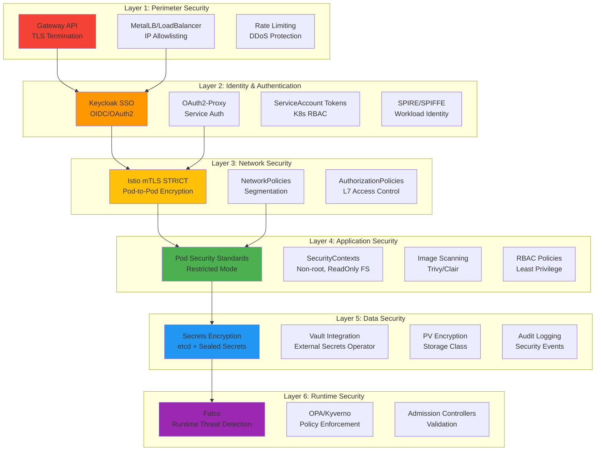
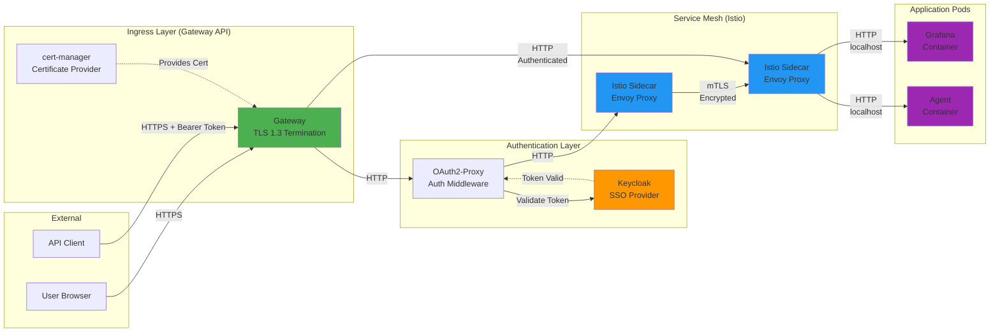
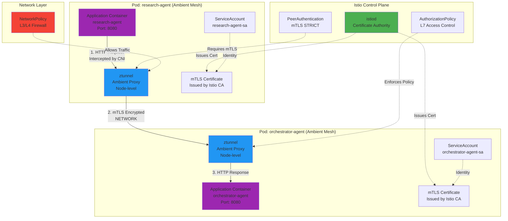
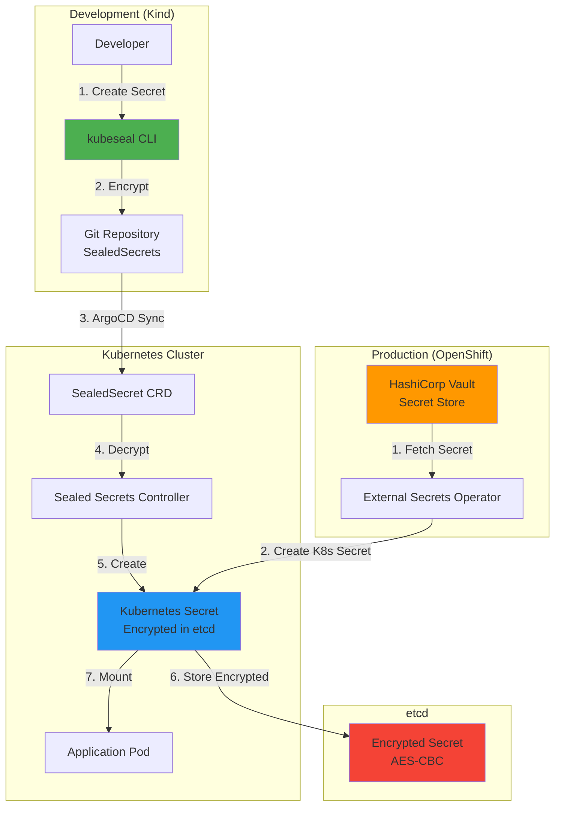
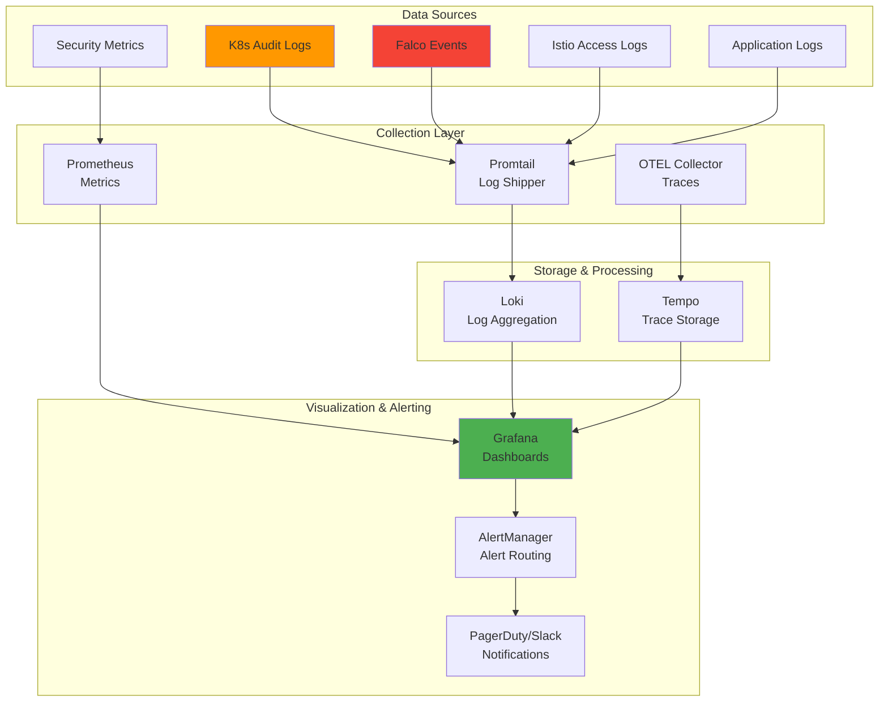
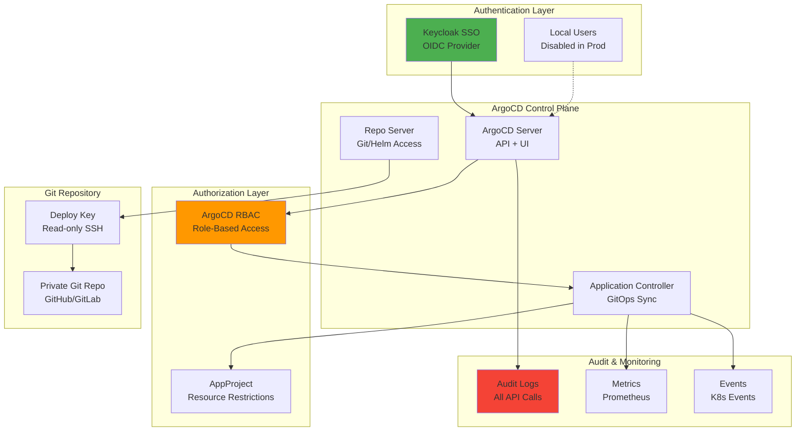

# Security Deployment Plan: Kind → OpenShift

**Last Updated**: 2025-11-16
**Status**: Planning Phase
**Target**: Production-ready security for both Kind (local dev) and OpenShift (production)

---

## 📋 Table of Contents

- [Security Architecture Overview](#security-architecture-overview)
- [Communication Architecture](#communication-architecture)
- [Current Security Posture](#current-security-posture)
- [Critical Security Gaps](#critical-security-gaps)
- [Deployment Strategy: Kind vs OpenShift](#deployment-strategy-kind-vs-openshift)
- [Phase 1: Foundation (Immediate)](#phase-1-foundation-immediate)
- [Phase 2: Hardening (Short-term)](#phase-2-hardening-short-term)
- [Phase 3: Production Ready (Medium-term)](#phase-3-production-ready-medium-term)
- [CI/CD Security Pipeline](#cicd-security-pipeline)
- [Security Monitoring & Observability](#security-monitoring--observability)
- [ArgoCD Security Hardening](#argocd-security-hardening)
- [Implementation Roadmap](#implementation-roadmap)
- [Testing & Validation](#testing--validation)

---

## Security Architecture Overview

### Defense-in-Depth Strategy



**Security Layers**:
1. **Perimeter** - Gateway, TLS, rate limiting
2. **Identity** - Keycloak, OAuth2, SPIRE
3. **Network** - mTLS, NetworkPolicies, AuthZ
4. **Application** - Pod security, RBAC, image scanning
5. **Data** - Secrets encryption, Vault, audit logs
6. **Runtime** - Falco, OPA, admission control

---

## Communication Architecture

### External to Internal Traffic Flow



**Key Security Points**:
- **TLS 1.3** at Gateway (external traffic encrypted)
- **OAuth2 + OIDC** for user authentication
- **mTLS** between sidecars (service-to-service encryption)
- **HTTP only on localhost** (app ↔ sidecar, no network exposure)

---

### Pod-to-Pod Communication (Service Mesh)



**Architecture Note**: Agents use **Istio Ambient Mesh** mode:
- ✅ **No sidecar injection** required for agents
- ✅ **ztunnel** (zero-trust tunnel) runs as DaemonSet on each node
- ✅ **Transparent mTLS** without modifying pod specs
- ✅ **Waypoint proxies** for L7 policies (optional, per-namespace)
- ✅ Lower resource overhead vs sidecar mode

**Security Enforcement**:
1. **Application** sends traffic normally (no proxy awareness needed)
2. **CNI plugin** intercepts traffic, redirects to **ztunnel**
3. **ztunnel** establishes **mTLS** connection (TLS 1.3) with peer ztunnel
4. **NetworkPolicy** filters at L3/L4 (IP + Port)
5. **AuthorizationPolicy** filters at L7 (via waypoint proxy if deployed)
6. **PeerAuthentication** enforces STRICT mTLS (no plaintext allowed)

**Benefits for Agents**:
- Simplified Deployment: No need to inject sidecars
- Resource Efficiency: Shared ztunnel per node vs per-pod sidecars
- Faster Rollouts: No sidecar startup delays
- Transparent Security: Apps unaware of mesh

---

### Secrets Management Flow



**Secrets Strategy**:
- **Kind (Dev)**: Sealed Secrets (encrypted in Git, safe to commit)
- **OpenShift (Prod)**: External Secrets Operator + Vault (centralized secret management)
- **Both**: etcd encryption at rest (AES-CBC)

---

## Current Security Posture

### ✅ Implemented Security Controls

| Layer | Control | Status | Details |
|-------|---------|--------|---------|
| **Encryption** | TLS 1.3 for external traffic | ✅ Implemented | Gateway API + cert-manager |
| **Encryption** | Istio mTLS STRICT mode | ✅ Implemented | All pod-to-pod encrypted |
| **Authentication** | Keycloak SSO (OIDC/OAuth2) | ✅ Implemented | Dual-realm (kubernetes + kagenti) |
| **Authentication** | OAuth2-Proxy for services | ✅ Implemented | Grafana, Kiali, Phoenix |
| **Authorization** | Kubernetes RBAC | ✅ Partial | Some ServiceAccounts configured |
| **Authorization** | Istio AuthorizationPolicy | ✅ Partial | Service mesh policies |
| **Infrastructure** | Gateway API ingress control | ✅ Implemented | External access management |
| **Infrastructure** | MetalLB LoadBalancer | ✅ Implemented | Local cluster ingress |

**Sources**:
- `components/00-infrastructure/istio-config/strict-mtls.yaml` - mTLS enforcement
- `components/00-infrastructure/keycloak/` - SSO configuration
- `components/00-infrastructure/oauth2-proxy/` - Service authentication
- `components/01-platform/gateway/` - Gateway API configs

---

### 🔴 Critical Security Gaps

| Gap | Risk Level | Impact | Mitigation Priority |
|-----|------------|--------|---------------------|
| **No secrets encryption at rest** | 🔴 CRITICAL | Secrets base64 in etcd (not encrypted) | P0 (Immediate) |
| **No NetworkPolicies** | 🔴 CRITICAL | All pods can communicate freely | P0 (Immediate) |
| **No Pod Security Standards** | 🔴 CRITICAL | Pods can run as root, privileged | P0 (Immediate) |
| **No audit logging** | 🔴 CRITICAL | No visibility into security events | P0 (Immediate) |
| **No secret rotation policy** | 🟠 HIGH | Secrets never expire | P1 (Short-term) |
| **Self-signed certificates (dev)** | 🟠 HIGH | Browser warnings, no trust chain | P1 (Short-term) |
| **No container image scanning** | 🟠 HIGH | Vulnerable images may be deployed | P1 (Short-term) |
| **No runtime security** | 🟡 MEDIUM | No detection of malicious behavior | P2 (Medium-term) |
| **No MFA** | 🟡 MEDIUM | Password-only authentication | P2 (Medium-term) |
| **No rate limiting** | 🟡 MEDIUM | Vulnerable to brute force, DoS | P2 (Medium-term) |
| **Limited RBAC implementation** | 🟡 MEDIUM | Overly permissive ServiceAccounts | P2 (Medium-term) |
| **No PV encryption** | 🟡 MEDIUM | Data-at-rest in PVs unencrypted | P3 (Long-term) |

---

## Deployment Strategy: Kind vs OpenShift

### Overlay Structure (Kustomize)

```
components/
├── base/                          # Shared configs for both platforms
│   ├── 00-infrastructure/
│   │   ├── gateway-api/
│   │   ├── cert-manager/
│   │   ├── istio/
│   │   ├── keycloak/
│   │   └── oauth2-proxy/
│   ├── 01-platform/
│   │   ├── gateway/
│   │   ├── kagenti-ui/
│   │   └── tls/
│   ├── 02-observability/
│   │   ├── grafana/
│   │   ├── tempo/
│   │   └── prometheus/
│   ├── 03-applications/
│   │   └── agents/
│   └── 08-security/               # NEW: Security configurations
│       ├── network-policies/
│       ├── pod-security/
│       ├── rbac/
│       └── sealed-secrets/
│
├── overlays/
│   ├── kind-local/                # Kind-specific overrides
│   │   ├── kustomization.yaml
│   │   ├── gateway-patch.yaml     # localtest.me domains
│   │   ├── loadbalancer-patch.yaml # MetalLB config
│   │   ├── secrets/
│   │   │   └── sealed-secrets/    # Sealed Secrets for dev
│   │   ├── certificates/
│   │   │   └── self-signed-issuer.yaml # Self-signed certs
│   │   └── security/
│   │       ├── network-policies-permissive.yaml # Less strict for dev
│   │       └── pod-security-baseline.yaml # Baseline mode
│   │
│   └── openshift/                 # OpenShift-specific overrides
│       ├── kustomization.yaml
│       ├── routes-patch.yaml      # OpenShift Routes instead of Gateway
│       ├── scc-patch.yaml         # SecurityContextConstraints
│       ├── secrets/
│       │   └── external-secrets/  # External Secrets Operator + Vault
│       ├── certificates/
│       │   └── letsencrypt-issuer.yaml # Let's Encrypt production
│       └── security/
│           ├── network-policies-strict.yaml # Strict policies
│           └── pod-security-restricted.yaml # Restricted mode
```

### Platform Differences

| Component | Kind (Local Dev) | OpenShift (Production) | Shared (Base) |
|-----------|------------------|------------------------|---------------|
| **Ingress** | Gateway API + MetalLB | OpenShift Routes | Gateway CRDs |
| **Certificates** | Self-signed (cert-manager) | Let's Encrypt | cert-manager operator |
| **Secrets** | Sealed Secrets | External Secrets + Vault | etcd encryption |
| **Pod Security** | Baseline mode | Restricted mode | SecurityContexts |
| **NetworkPolicies** | Permissive (dev-friendly) | Strict (default-deny) | Base policies |
| **RBAC** | Relaxed (fast iteration) | Strict (least privilege) | ServiceAccounts |
| **Image Registry** | Local registry (in-cluster) | OpenShift internal registry | Registry configs |
| **Observability** | In-cluster (Grafana, Tempo) | External (Grafana Cloud) | OTEL configs |
| **Service Mesh** | Istio (manual install) | OpenShift Service Mesh | mTLS policies |
| **Storage** | Local PVs (no encryption) | OCS/ODF (encrypted) | StorageClass |

---

## Phase 1: Foundation (Immediate - Week 1-2)

**Priority**: 🔴 P0 (Critical)
**Timeline**: 2 weeks
**Effort**: 1-2 person-weeks

### 1.1: Enable etcd Encryption at Rest

**Current State**: Secrets are base64-encoded in etcd (NOT encrypted)

**Implementation**:

```yaml
# /etc/kubernetes/encryption-config.yaml (Kind)
apiVersion: apiserver.config.k8s.io/v1
kind: EncryptionConfiguration
resources:
- resources:
  - secrets
  providers:
  - aescbc:
      keys:
      - name: key1
        secret: <BASE64_32_BYTE_KEY>  # Generate: head -c 32 /dev/urandom | base64
  - identity: {}  # Fallback during migration
```

**Kind Configuration**:
```yaml
# scripts/kind/kind-config.yaml
kind: Cluster
apiVersion: kind.x-k8s.io/v1alpha4
nodes:
- role: control-plane
  kubeadmConfigPatches:
  - |
    kind: ClusterConfiguration
    apiServer:
      extraArgs:
        encryption-provider-config: /etc/kubernetes/encryption-config.yaml
      extraVolumes:
      - name: encryption-config
        hostPath: /etc/kubernetes/encryption-config.yaml
        mountPath: /etc/kubernetes/encryption-config.yaml
        readOnly: true
```

**OpenShift**: Already encrypted by default with FIPS-validated cryptography

**Validation**:
```bash
# Verify encryption
kubectl create secret generic test-secret --from-literal=key=value
ETCDCTL_API=3 etcdctl get /registry/secrets/default/test-secret

# Expected: Binary encrypted data (NOT plaintext base64)
```

**Files to Create**:
- ✅ `scripts/kind/encryption-config.yaml`
- ✅ Update `scripts/kind/01-create-cluster.sh` to apply config
- ✅ Document in `docs/08-security/etcd-encryption.md`

---

### 1.2: Deploy Sealed Secrets (Kind Only)

**Purpose**: Encrypt secrets in Git for safe GitOps workflow

**Implementation**:

```yaml
# components/08-security/sealed-secrets/controller.yaml
apiVersion: kustomize.config.k8s.io/v1beta1
kind: Kustomization

resources:
- https://github.com/bitnami-labs/sealed-secrets/releases/download/v0.24.0/controller.yaml

namespace: kube-system
```

**Usage**:
```bash
# Install kubeseal CLI
brew install kubeseal  # macOS
# OR
wget https://github.com/bitnami-labs/sealed-secrets/releases/download/v0.24.0/kubeseal-linux-amd64
sudo install -m 755 kubeseal-linux-amd64 /usr/local/bin/kubeseal

# Encrypt secret
kubectl create secret generic my-secret \
  --from-literal=password=secret123 \
  --namespace=team1 \
  --dry-run=client -o yaml | \
  kubeseal -o yaml > components/base/01-platform/secrets/sealed-my-secret.yaml

# Commit to Git (SAFE!)
git add components/base/01-platform/secrets/sealed-my-secret.yaml
git commit -m "Add encrypted secret"
```

**Files to Create**:
- ✅ `components/08-security/sealed-secrets/kustomization.yaml`
- ✅ `argocd/applications/base/00-infrastructure/sealed-secrets.yaml` (ArgoCD app)
- ✅ `docs/08-security/sealed-secrets-guide.md`

---

### 1.3: Basic NetworkPolicies

**Purpose**: Prevent lateral movement after pod compromise

**Implementation**:

```yaml
# components/08-security/network-policies/base/default-deny.yaml
apiVersion: networking.k8s.io/v1
kind: NetworkPolicy
metadata:
  name: default-deny-all
spec:
  podSelector: {}  # All pods in namespace
  policyTypes:
  - Ingress
  - Egress
---
# components/08-security/network-policies/base/allow-dns.yaml
apiVersion: networking.k8s.io/v1
kind: NetworkPolicy
metadata:
  name: allow-dns
spec:
  podSelector: {}
  policyTypes:
  - Egress
  egress:
  - to:
    - namespaceSelector:
        matchLabels:
          kubernetes.io/metadata.name: kube-system
    ports:
    - protocol: UDP
      port: 53
    - protocol: TCP
      port: 53
---
# components/08-security/network-policies/base/allow-istio-control-plane.yaml
apiVersion: networking.k8s.io/v1
kind: NetworkPolicy
metadata:
  name: allow-istio-control-plane
spec:
  podSelector: {}
  policyTypes:
  - Egress
  egress:
  - to:
    - namespaceSelector:
        matchLabels:
          kubernetes.io/metadata.name: istio-system
    ports:
    - protocol: TCP
      port: 15012  # istiod xDS
    - protocol: TCP
      port: 15014  # Telemetry
```

**Namespace-Specific Policies**:

```yaml
# components/02-observability/grafana/network-policy.yaml
apiVersion: networking.k8s.io/v1
kind: NetworkPolicy
metadata:
  name: grafana-policy
  namespace: observability
spec:
  podSelector:
    matchLabels:
      app: grafana
  policyTypes:
  - Ingress
  - Egress
  ingress:
  # Allow from OAuth2-Proxy
  - from:
    - namespaceSelector:
        matchLabels:
          kubernetes.io/metadata.name: oauth2-proxy
    ports:
    - protocol: TCP
      port: 3000
  egress:
  # DNS
  - to:
    - namespaceSelector:
        matchLabels:
          kubernetes.io/metadata.name: kube-system
    ports:
    - port: 53
      protocol: UDP
  # Prometheus datasource
  - to:
    - podSelector:
        matchLabels:
          app: prometheus
    ports:
    - port: 9090
      protocol: TCP
  # Tempo datasource
  - to:
    - podSelector:
        matchLabels:
          app: tempo
    ports:
    - port: 3100
      protocol: TCP
  # Keycloak authentication
  - to:
    - namespaceSelector:
        matchLabels:
          kubernetes.io/metadata.name: keycloak
    ports:
    - port: 8080
      protocol: TCP
```

**Files to Create**:
- ✅ `components/08-security/network-policies/base/` (default policies)
- ✅ `components/08-security/network-policies/overlays/kind-local/` (permissive for dev)
- ✅ `components/08-security/network-policies/overlays/openshift/` (strict for prod)
- ✅ `docs/08-security/network-policies.md` (already exists, enhance it)

---

### 1.4: Pod Security Standards

**Purpose**: Prevent container breakout and privilege escalation

**Implementation**:

```yaml
# components/08-security/pod-security/namespace-labels.yaml
# Apply to each namespace
apiVersion: v1
kind: Namespace
metadata:
  name: observability
  labels:
    # Kind: Baseline mode (development-friendly)
    pod-security.kubernetes.io/enforce: baseline
    pod-security.kubernetes.io/audit: restricted
    pod-security.kubernetes.io/warn: restricted

    # OpenShift: Restricted mode (production)
    # pod-security.kubernetes.io/enforce: restricted
    # pod-security.kubernetes.io/audit: restricted
    # pod-security.kubernetes.io/warn: restricted

    # Istio injection
    istio-injection: enabled
```

**Pod SecurityContext Template**:

```yaml
# components/base/03-applications/agents/research-agent/deployment.yaml
apiVersion: apps/v1
kind: Deployment
metadata:
  name: research-agent
spec:
  template:
    spec:
      # Pod-level security
      securityContext:
        runAsNonRoot: true
        runAsUser: 1000
        fsGroup: 1000
        seccompProfile:
          type: RuntimeDefault

      serviceAccountName: research-agent-sa  # Dedicated SA

      containers:
      - name: agent
        image: research-agent:latest

        # Container-level security
        securityContext:
          allowPrivilegeEscalation: false
          capabilities:
            drop:
            - ALL
          readOnlyRootFilesystem: true
          runAsNonRoot: true
          runAsUser: 1000

        # Writable temp directory
        volumeMounts:
        - name: tmp
          mountPath: /tmp

      volumes:
      - name: tmp
        emptyDir: {}
```

**OpenShift SecurityContextConstraints (SCC)**:

```yaml
# overlays/openshift/security/research-agent-scc.yaml
apiVersion: security.openshift.io/v1
kind: SecurityContextConstraints
metadata:
  name: research-agent-scc
allowPrivilegedContainer: false
allowHostDirVolumePlugin: false
allowHostNetwork: false
allowHostPorts: false
allowHostPID: false
allowHostIPC: false
runAsUser:
  type: MustRunAsRange
  uidRangeMin: 1000
  uidRangeMax: 2000
seLinuxContext:
  type: MustRunAs
fsGroup:
  type: MustRunAs
readOnlyRootFilesystem: true
volumes:
- emptyDir
- configMap
- secret
- persistentVolumeClaim
```

**Files to Create**:
- ✅ `components/08-security/pod-security/namespace-labels.yaml`
- ✅ `overlays/kind-local/security/pod-security-baseline.yaml`
- ✅ `overlays/openshift/security/pod-security-restricted.yaml`
- ✅ `overlays/openshift/security/scc/` (OpenShift SCCs)
- ✅ Update all Deployment manifests with SecurityContexts

---

### 1.5: Audit Logging

**Purpose**: Visibility into security events and API access

**Kind Implementation**:

```yaml
# scripts/kind/audit-policy.yaml
apiVersion: audit.k8s.io/v1
kind: Policy
rules:
# Log all secret access
- level: RequestResponse
  resources:
  - group: ""
    resources: ["secrets"]
  omitStages:
  - RequestReceived

# Log all authentication events
- level: Metadata
  omitStages:
  - RequestReceived
  userGroups:
  - system:authenticated

# Log RBAC changes
- level: RequestResponse
  verbs: ["create", "update", "patch", "delete"]
  resources:
  - group: "rbac.authorization.k8s.io"

# Log Pod security events
- level: Metadata
  resources:
  - group: ""
    resources: ["pods"]
  verbs: ["create", "update", "patch"]

# Default: Metadata for all other requests
- level: Metadata
  omitStages:
  - RequestReceived
```

**Kind cluster config**:
```yaml
# scripts/kind/kind-config.yaml
kind: Cluster
apiVersion: kind.x-k8s.io/v1alpha4
nodes:
- role: control-plane
  kubeadmConfigPatches:
  - |
    kind: ClusterConfiguration
    apiServer:
      extraArgs:
        audit-policy-file: /etc/kubernetes/audit-policy.yaml
        audit-log-path: /var/log/kubernetes/audit/audit.log
        audit-log-maxage: "30"
        audit-log-maxbackup: "10"
        audit-log-maxsize: "100"
      extraVolumes:
      - name: audit-policy
        hostPath: /etc/kubernetes/audit-policy.yaml
        mountPath: /etc/kubernetes/audit-policy.yaml
        readOnly: true
      - name: audit-logs
        hostPath: /var/log/kubernetes/audit
        mountPath: /var/log/kubernetes/audit
```

**Ship Logs to Loki**:

```yaml
# components/02-observability/promtail/daemonset-audit.yaml
apiVersion: apps/v1
kind: DaemonSet
metadata:
  name: promtail-audit
  namespace: observability
spec:
  selector:
    matchLabels:
      app: promtail-audit
  template:
    metadata:
      labels:
        app: promtail-audit
    spec:
      serviceAccountName: promtail
      containers:
      - name: promtail
        image: grafana/promtail:latest
        args:
        - -config.file=/etc/promtail/promtail.yaml
        volumeMounts:
        - name: config
          mountPath: /etc/promtail
        - name: audit-logs
          mountPath: /var/log/kubernetes/audit
          readOnly: true
      volumes:
      - name: config
        configMap:
          name: promtail-audit-config
      - name: audit-logs
        hostPath:
          path: /var/log/kubernetes/audit
```

**OpenShift**: Already has audit logging enabled by default

**Files to Create**:
- ✅ `scripts/kind/audit-policy.yaml`
- ✅ Update `scripts/kind/01-create-cluster.sh`
- ✅ `components/02-observability/promtail/audit-logs/`
- ✅ `docs/08-security/audit-logging.md`

---

## Phase 2: Hardening (Short-term - Week 3-6)

**Priority**: 🟠 P1 (High)
**Timeline**: 4 weeks
**Effort**: 3-4 person-weeks

### 2.1: Comprehensive RBAC Policies

**Principle**: Least privilege for all ServiceAccounts

**Implementation**:

```yaml
# components/base/03-applications/agents/research-agent/rbac.yaml
apiVersion: v1
kind: ServiceAccount
metadata:
  name: research-agent-sa
  namespace: team1
---
apiVersion: rbac.authorization.k8s.io/v1
kind: Role
metadata:
  name: research-agent-role
  namespace: team1
rules:
# Read only specific ConfigMaps
- apiGroups: [""]
  resources: ["configmaps"]
  verbs: ["get", "list"]
  resourceNames:
  - "research-agent-config"

# Read only specific Secrets
- apiGroups: [""]
  resources: ["secrets"]
  verbs: ["get"]
  resourceNames:
  - "research-agent-credentials"
  - "openai-api-key"

# NO cluster-wide permissions
# NO write permissions to core resources
# NO access to other namespaces
---
apiVersion: rbac.authorization.k8s.io/v1
kind: RoleBinding
metadata:
  name: research-agent-binding
  namespace: team1
subjects:
- kind: ServiceAccount
  name: research-agent-sa
  namespace: team1
roleRef:
  kind: Role
  name: research-agent-role
  apiGroup: rbac.authorization.k8s.io
```

**RBAC Audit**:

```bash
# Find overly permissive roles
kubectl get roles,clusterroles -A -o json | \
  jq '.items[] | select(.rules[].verbs[] | contains("*")) | .metadata.name'

# Find ServiceAccounts with cluster-admin
kubectl get clusterrolebindings -o json | \
  jq '.items[] | select(.roleRef.name == "cluster-admin") | .subjects'

# Audit secret access
kubectl get roles,clusterroles -A -o json | \
  jq '.items[] | select(.rules[].resources[] | contains("secrets")) | {name: .metadata.name, verbs: .rules[].verbs}'
```

**Files to Create**:
- ✅ `components/08-security/rbac/` (RBAC templates)
- ✅ RBAC for each component (in respective directories)
- ✅ `scripts/audit-rbac.sh` (RBAC audit script)
- ✅ `docs/08-security/rbac-guidelines.md`

---

### 2.2: Secret Rotation Automation

**Purpose**: Limit exposure window of compromised secrets

**Implementation**:

```yaml
# components/08-security/secret-rotation/cronjob.yaml
apiVersion: batch/v1
kind: CronJob
metadata:
  name: rotate-keycloak-secrets
  namespace: keycloak
spec:
  schedule: "0 0 1 */3 *"  # Every 3 months, 1st day at midnight
  jobTemplate:
    spec:
      template:
        spec:
          serviceAccountName: secret-rotator
          restartPolicy: OnFailure
          containers:
          - name: rotator
            image: bitnami/kubectl:latest
            command:
            - /bin/bash
            - -c
            - |
              #!/bin/bash
              set -e

              echo "Starting secret rotation..."

              # Rotate each OAuth2 client secret
              for CLIENT in grafana kiali kubernetes-dashboard phoenix; do
                echo "Rotating $CLIENT secret..."

                # Generate new secret
                NEW_SECRET=$(openssl rand -base64 32)

                # Update Keycloak client
                kubectl exec -n keycloak deploy/keycloak -- \
                  /opt/keycloak/bin/kcadm.sh config credentials \
                  --server http://localhost:8080 \
                  --realm master \
                  --user admin \
                  --password ${KEYCLOAK_ADMIN_PASSWORD}

                kubectl exec -n keycloak deploy/keycloak -- \
                  /opt/keycloak/bin/kcadm.sh update clients/${CLIENT} \
                  -r kubernetes \
                  -s "secret=${NEW_SECRET}"

                # Update Kubernetes Secret
                kubectl create secret generic ${CLIENT}-client-secret \
                  --from-literal=client-secret=${NEW_SECRET} \
                  -n oauth2-proxy \
                  --dry-run=client -o yaml | kubectl apply -f -

                # Restart OAuth2-Proxy deployment
                kubectl rollout restart deployment oauth2-proxy-${CLIENT} -n oauth2-proxy

                echo "$CLIENT secret rotated successfully"
              done

              echo "All secrets rotated"
            env:
            - name: KEYCLOAK_ADMIN_PASSWORD
              valueFrom:
                secretKeyRef:
                  name: keycloak-admin-credentials
                  key: password
---
# RBAC for CronJob
apiVersion: v1
kind: ServiceAccount
metadata:
  name: secret-rotator
  namespace: keycloak
---
apiVersion: rbac.authorization.k8s.io/v1
kind: Role
metadata:
  name: secret-rotator
  namespace: oauth2-proxy
rules:
- apiGroups: [""]
  resources: ["secrets"]
  verbs: ["get", "create", "update", "patch"]
- apiGroups: ["apps"]
  resources: ["deployments"]
  verbs: ["get", "patch"]
---
apiVersion: rbac.authorization.k8s.io/v1
kind: RoleBinding
metadata:
  name: secret-rotator
  namespace: oauth2-proxy
subjects:
- kind: ServiceAccount
  name: secret-rotator
  namespace: keycloak
roleRef:
  kind: Role
  name: secret-rotator
  apiGroup: rbac.authorization.k8s.io
```

**Integration with Reloader**:

```yaml
# components/08-security/secret-rotation/reloader.yaml
apiVersion: kustomize.config.k8s.io/v1beta1
kind: Kustomization

resources:
- https://raw.githubusercontent.com/stakater/Reloader/master/deployments/kubernetes/reloader.yaml
```

**Annotate Deployments**:

```yaml
# components/base/02-observability/grafana/deployment.yaml
apiVersion: apps/v1
kind: Deployment
metadata:
  name: grafana
  namespace: observability
  annotations:
    # Automatically restart when secret changes
    reloader.stakater.com/search: "true"
spec:
  template:
    spec:
      containers:
      - name: grafana
        # ...
```

**Files to Create**:
- ✅ `components/08-security/secret-rotation/cronjob.yaml`
- ✅ `components/08-security/secret-rotation/reloader.yaml`
- ✅ `argocd/applications/base/00-infrastructure/reloader.yaml`
- ✅ `docs/08-security/secret-rotation.md`

---

### 2.3: Enhanced Istio AuthorizationPolicies

**Purpose**: Layer 7 access control (HTTP methods, paths, JWT claims)

**Implementation**:

```yaml
# components/base/02-observability/grafana/authorization-policy.yaml
apiVersion: security.istio.io/v1beta1
kind: AuthorizationPolicy
metadata:
  name: grafana-authz
  namespace: observability
spec:
  selector:
    matchLabels:
      app: grafana
  action: ALLOW
  rules:
  # Allow from OAuth2-Proxy only
  - from:
    - source:
        principals: ["cluster.local/ns/oauth2-proxy/sa/oauth2-proxy"]
    to:
    - operation:
        methods: ["GET", "POST"]  # No DELETE/PUT
        paths: ["/*"]             # All paths
        ports: ["3000"]

  # Deny direct access (bypass OAuth2-Proxy)
  - from:
    - source:
        notPrincipals: ["cluster.local/ns/oauth2-proxy/sa/*"]
    to:
    - operation:
        ports: ["3000"]
    when:
    - key: request.headers[x-forwarded-for]
      notValues: ["*"]  # Must come through proxy
---
# Deny-by-default policy
apiVersion: security.istio.io/v1beta1
kind: AuthorizationPolicy
metadata:
  name: deny-all-default
  namespace: observability
spec:
  action: DENY
  rules:
  - from:
    - source:
        notNamespaces: ["observability", "oauth2-proxy", "istio-system"]
```

**Agent-to-Agent Authorization**:

```yaml
# components/base/03-applications/agents/orchestrator-agent/authorization-policy.yaml
apiVersion: security.istio.io/v1beta1
kind: AuthorizationPolicy
metadata:
  name: orchestrator-authz
  namespace: team1
spec:
  selector:
    matchLabels:
      app: orchestrator-agent
  action: ALLOW
  rules:
  # Allow from research-agent
  - from:
    - source:
        principals: ["cluster.local/ns/team1/sa/research-agent-sa"]
    to:
    - operation:
        methods: ["POST"]
        paths: ["/api/v1/tasks"]

  # Allow from code-agent
  - from:
    - source:
        principals: ["cluster.local/ns/team1/sa/code-agent-sa"]
    to:
    - operation:
        methods: ["POST"]
        paths: ["/api/v1/tasks"]

  # Deny all other access
```

**Files to Create**:
- ✅ AuthorizationPolicies for each service
- ✅ `docs/08-security/istio-authorization.md`

---

### 2.4: Container Image Scanning (Trivy)

**Purpose**: Prevent vulnerable images from being deployed

**Tekton Pipeline Integration**:

```yaml
# components/00-infrastructure/tekton/tasks/trivy-scan.yaml
apiVersion: tekton.dev/v1
kind: Task
metadata:
  name: trivy-scan
  namespace: tekton-pipelines
spec:
  params:
  - name: IMAGE
    description: Image reference to scan
  - name: SEVERITY
    description: Severity levels to scan for
    default: "CRITICAL,HIGH"
  steps:
  - name: scan
    image: aquasec/trivy:latest
    script: |
      #!/bin/sh
      set -e

      echo "Scanning image: $(params.IMAGE)"

      # Scan image
      trivy image \
        --severity $(params.SEVERITY) \
        --exit-code 1 \
        --no-progress \
        $(params.IMAGE)

      # Exit code 1 = vulnerabilities found (fail pipeline)
      # Exit code 0 = no vulnerabilities (pass)
```

**Pipeline with Scan**:

```yaml
# components/00-infrastructure/tekton/pipelines/agent-build-scan.yaml
apiVersion: tekton.dev/v1
kind: Pipeline
metadata:
  name: agent-build-scan
  namespace: tekton-pipelines
spec:
  params:
  - name: GIT_URL
  - name: IMAGE_NAME
  tasks:
  - name: git-clone
    taskRef:
      name: git-clone
    params:
    - name: url
      value: $(params.GIT_URL)

  - name: build-image
    runAfter: [git-clone]
    taskRef:
      name: kaniko
    params:
    - name: IMAGE
      value: $(params.IMAGE_NAME)

  - name: scan-image
    runAfter: [build-image]
    taskRef:
      name: trivy-scan
    params:
    - name: IMAGE
      value: $(tasks.build-image.results.IMAGE_URL)
    - name: SEVERITY
      value: "CRITICAL,HIGH"

  # Only push if scan passes
  - name: push-image
    runAfter: [scan-image]
    taskRef:
      name: skopeo-copy
    params:
    - name: srcImageURL
      value: $(tasks.build-image.results.IMAGE_URL)
    - name: destImageURL
      value: registry.example.com/$(params.IMAGE_NAME)
```

**Admission Controller** (block vulnerable images):

```yaml
# components/08-security/image-scanning/validating-webhook.yaml
apiVersion: admissionregistration.k8s.io/v1
kind: ValidatingWebhookConfiguration
metadata:
  name: trivy-admission
webhooks:
- name: trivy.aquasec.com
  rules:
  - operations: ["CREATE", "UPDATE"]
    apiGroups: [""]
    apiVersions: ["v1"]
    resources: ["pods"]
  clientConfig:
    service:
      name: trivy-admission
      namespace: trivy-system
      path: "/validate"
  admissionReviewVersions: ["v1"]
  sideEffects: None
  failurePolicy: Fail  # Block pod creation if scan fails
```

**Files to Create**:
- ✅ `components/00-infrastructure/tekton/tasks/trivy-scan.yaml`
- ✅ `components/08-security/image-scanning/` (admission controller)
- ✅ Update pipelines to include scanning
- ✅ `docs/08-security/image-scanning.md`

---

## CI/CD Security Pipeline

**Priority**: 🔴 P0 (Critical - Part of Phase 1)
**Purpose**: Prevent vulnerabilities from reaching production through comprehensive CI/CD security checks

### Security Scanning Tools Comparison

| Tool | Type | Focus | Pros | Cons | Cost |
|------|------|-------|------|------|------|
| **Snyk** | SCA + Container | Dependencies, containers, IaC | Excellent dev UX, auto-fix PRs | Commercial (free tier limited) | $$$ |
| **Trivy** | Container + IaC | Multi-scanner (vulns, secrets, misconfig) | Fast, comprehensive, free | Less dev-friendly than Snyk | Free |
| **Grype** | Container | Container vulnerabilities | Fast, accurate | Limited to containers | Free |
| **Checkov** | IaC | Terraform, K8s, Dockerfile | Deep policy checks | Slow on large repos | Free |
| **git-secrets** | Secret detection | Pre-commit secret scanning | Prevents secret commits | Limited patterns | Free |
| **TruffleHog** | Secret detection | Secret scanning in Git history | Finds historical secrets | False positives | Free |
| **Semgrep** | SAST | Code security patterns | Fast, customizable rules | Requires rule configuration | Free/$$$ |
| **SonarQube** | SAST + Quality | Code quality + security | Comprehensive analysis | Heavy, complex setup | Free/$$$ |
| **Kubescape** | K8s security | K8s manifests, RBAC, NSA/CISA | K8s-specific, compliance-focused | Kubernetes-only | Free |

### Recommended CI/CD Security Stack

```yaml
# .github/workflows/security-ci.yml
name: Security CI Pipeline

on:
  pull_request:
    branches: [main, develop]
  push:
    branches: [main]

jobs:
  # Job 1: Secret Scanning (fastest, fail-fast)
  secret-scan:
    runs-on: ubuntu-latest
    steps:
    - uses: actions/checkout@v4
      with:
        fetch-depth: 0  # Full history for TruffleHog

    # Scan for secrets in commits
    - name: TruffleHog Secret Scan
      uses: trufflesecurity/trufflehog@main
      with:
        path: ./
        base: ${{ github.event.repository.default_branch }}
        head: HEAD
        extra_args: --json --only-verified

    # Pre-commit secret patterns
    - name: git-secrets scan
      run: |
        git clone https://github.com/awslabs/git-secrets.git
        cd git-secrets && sudo make install
        cd ..
        git secrets --register-aws
        git secrets --scan-history

  # Job 2: Dependency Scanning (SCA - Software Composition Analysis)
  dependency-scan:
    runs-on: ubuntu-latest
    steps:
    - uses: actions/checkout@v4

    # Snyk for comprehensive dependency analysis
    - name: Snyk Dependency Scan
      uses: snyk/actions/node@master
      env:
        SNYK_TOKEN: ${{ secrets.SNYK_TOKEN }}
      with:
        args: --severity-threshold=high --fail-on=all
        command: test

    # Alternative: OWASP Dependency-Check (free, slower)
    - name: OWASP Dependency-Check
      uses: dependency-check/Dependency-Check_Action@main
      with:
        project: 'kagenti-platform'
        path: '.'
        format: 'HTML'
        args: >
          --failOnCVSS 7
          --enableRetired

  # Job 3: Container Image Scanning
  container-scan:
    runs-on: ubuntu-latest
    steps:
    - uses: actions/checkout@v4

    # Build images (or use pre-built)
    - name: Build Docker images
      run: |
        docker build -t research-agent:test ./agents/research-agent

    # Scan base images and dependencies FIRST
    - name: Scan Base Images
      uses: aquasecurity/trivy-action@master
      with:
        scan-type: 'config'
        input: './agents/research-agent/Dockerfile'
        format: 'table'
        exit-code: '0'  # Don't fail, just report

    # Scan all images referenced in Dockerfiles
    - name: Extract and Scan All Dependency Images
      run: |
        # Extract all FROM statements from Dockerfiles
        find . -name Dockerfile -exec grep -h "^FROM" {} \; | \
          awk '{print $2}' | sort -u > /tmp/base-images.txt

        # Scan each base image
        while read image; do
          echo "Scanning dependency image: $image"
          trivy image --severity CRITICAL,HIGH "$image"
        done < /tmp/base-images.txt

    # Trivy container scan (built image)
    - name: Trivy Container Scan
      uses: aquasecurity/trivy-action@master
      with:
        image-ref: research-agent:test
        format: 'sarif'
        output: 'trivy-results.sarif'
        severity: 'CRITICAL,HIGH'
        exit-code: '1'  # Fail on vulnerabilities

    # Upload results to GitHub Security tab
    - name: Upload Trivy results to GitHub Security
      uses: github/codeql-action/upload-sarif@v2
      if: always()
      with:
        sarif_file: 'trivy-results.sarif'

    # Snyk Container scan (alternative/additional)
    - name: Snyk Container Scan
      uses: snyk/actions/docker@master
      env:
        SNYK_TOKEN: ${{ secrets.SNYK_TOKEN }}
      with:
        image: research-agent:test
        args: --severity-threshold=high --file=agents/research-agent/Dockerfile

    # Scan third-party images used in deployments
    - name: Scan Third-Party Images
      run: |
        # Extract all images from K8s manifests
        find components/ -name "*.yaml" -exec grep -h "image:" {} \; | \
          awk '{print $2}' | sort -u > /tmp/k8s-images.txt

        # Scan each third-party image
        while read image; do
          echo "Scanning K8s deployment image: $image"
          trivy image --severity CRITICAL,HIGH "$image" || true
        done < /tmp/k8s-images.txt

  # Job 4: Infrastructure as Code (IaC) Scanning
  iac-scan:
    runs-on: ubuntu-latest
    steps:
    - uses: actions/checkout@v4

    # Checkov for K8s manifests, Helm charts
    - name: Checkov IaC Scan
      uses: bridgecrewio/checkov-action@master
      with:
        directory: components/
        framework: kubernetes
        soft_fail: false
        output_format: sarif
        download_external_modules: true

    # Snyk IaC scan
    - name: Snyk IaC Scan
      uses: snyk/actions/iac@master
      env:
        SNYK_TOKEN: ${{ secrets.SNYK_TOKEN }}
      with:
        args: --severity-threshold=high
        file: components/

    # Kubescape K8s security scan
    - name: Kubescape K8s Security
      uses: kubescape/github-action@main
      with:
        files: "components/**/*.yaml"
        frameworks: |
          nsa,mitre,armobest
        failedThreshold: 30
        severityThreshold: high

  # Job 5: SAST (Static Application Security Testing)
  sast-scan:
    runs-on: ubuntu-latest
    steps:
    - uses: actions/checkout@v4

    # Semgrep for code patterns
    - name: Semgrep SAST
      uses: returntocorp/semgrep-action@v1
      with:
        config: >-
          p/security-audit
          p/secrets
          p/owasp-top-ten

    # Snyk Code (SAST)
    - name: Snyk Code SAST
      uses: snyk/actions/node@master
      env:
        SNYK_TOKEN: ${{ secrets.SNYK_TOKEN }}
      with:
        command: code test
        args: --severity-threshold=high

  # Job 6: License Compliance
  license-check:
    runs-on: ubuntu-latest
    steps:
    - uses: actions/checkout@v4

    # Check for license compliance
    - name: FOSSA License Scan
      uses: fossas/fossa-action@main
      with:
        api-key: ${{ secrets.FOSSA_API_KEY }}

  # Job 7: Security Policy Validation
  policy-check:
    runs-on: ubuntu-latest
    steps:
    - uses: actions/checkout@v4

    # OPA policy checks
    - name: OPA Policy Check
      uses: open-policy-agent/setup-opa@v2
    - run: |
        opa test policies/
        opa check policies/

  # Job 8: Generate Security Report
  security-report:
    needs: [secret-scan, dependency-scan, container-scan, iac-scan, sast-scan]
    if: always()
    runs-on: ubuntu-latest
    steps:
    - name: Generate Security Dashboard
      run: |
        echo "# Security Scan Summary" >> $GITHUB_STEP_SUMMARY
        echo "" >> $GITHUB_STEP_SUMMARY
        echo "| Check | Status |" >> $GITHUB_STEP_SUMMARY
        echo "|-------|--------|" >> $GITHUB_STEP_SUMMARY
        echo "| Secret Scan | ${{ needs.secret-scan.result }} |" >> $GITHUB_STEP_SUMMARY
        echo "| Dependency Scan | ${{ needs.dependency-scan.result }} |" >> $GITHUB_STEP_SUMMARY
        echo "| Container Scan | ${{ needs.container-scan.result }} |" >> $GITHUB_STEP_SUMMARY
        echo "| IaC Scan | ${{ needs.iac-scan.result }} |" >> $GITHUB_STEP_SUMMARY
        echo "| SAST Scan | ${{ needs.sast-scan.result }} |" >> $GITHUB_STEP_SUMMARY
```

### Pre-commit Hooks (Developer Workstation)

```yaml
# .pre-commit-config.yaml
repos:
# Secret detection
- repo: https://github.com/trufflesecurity/trufflehog
  rev: v3.63.0
  hooks:
  - id: trufflehog
    name: TruffleHog Secret Scan
    entry: bash -c 'trufflehog git file://. --only-verified --fail'

# Kubernetes manifest validation
- repo: https://github.com/Lucas-C/pre-commit-hooks
  rev: v1.5.4
  hooks:
  - id: forbid-crlf
  - id: remove-crlf
  - id: forbid-tabs

# YAML validation
- repo: https://github.com/pre-commit/pre-commit-hooks
  rev: v4.5.0
  hooks:
  - id: check-yaml
    args: [--allow-multiple-documents]
  - id: end-of-file-fixer
  - id: trailing-whitespace
  - id: check-added-large-files
    args: [--maxkb=1024]
  - id: detect-private-key

# Kubernetes security policies
- repo: https://github.com/bridgecrewio/checkov
  rev: 3.1.0
  hooks:
  - id: checkov
    name: Checkov K8s Security
    args: [--framework, kubernetes, --quiet]

# Dockerfile linting
- repo: https://github.com/hadolint/hadolint
  rev: v2.12.0
  hooks:
  - id: hadolint-docker
    args: [--ignore, DL3008, --ignore, DL3009]
```

### Tekton Pipeline Security Integration

```yaml
# components/00-infrastructure/tekton/tasks/security-scan.yaml
apiVersion: tekton.dev/v1
kind: Task
metadata:
  name: security-scan-comprehensive
  namespace: tekton-pipelines
spec:
  params:
  - name: IMAGE
    description: Container image to scan
  - name: SOURCE_PATH
    description: Path to source code
    default: /workspace/source

  workspaces:
  - name: source
    description: Source code workspace

  steps:
  # Step 1: Trivy vulnerability scan
  - name: trivy-scan
    image: aquasec/trivy:latest
    script: |
      #!/bin/sh
      set -e
      echo "=== Trivy Container Scan ==="
      trivy image \
        --severity CRITICAL,HIGH \
        --exit-code 1 \
        --format json \
        --output /workspace/trivy-report.json \
        $(params.IMAGE)

      # Also scan filesystem for misconfigurations
      trivy fs \
        --severity HIGH,CRITICAL \
        --security-checks vuln,config,secret \
        $(params.SOURCE_PATH)

  # Step 2: Snyk scan
  - name: snyk-scan
    image: snyk/snyk:docker
    env:
    - name: SNYK_TOKEN
      valueFrom:
        secretKeyRef:
          name: snyk-token
          key: token
    script: |
      #!/bin/sh
      set -e
      echo "=== Snyk Container Scan ==="
      snyk container test $(params.IMAGE) \
        --severity-threshold=high \
        --json-file-output=/workspace/snyk-report.json

  # Step 3: Grype additional scan
  - name: grype-scan
    image: anchore/grype:latest
    script: |
      #!/bin/sh
      set -e
      echo "=== Grype Vulnerability Scan ==="
      grype $(params.IMAGE) \
        --fail-on high \
        --output json \
        --file /workspace/grype-report.json

  # Step 4: Secret detection in code
  - name: secret-scan
    image: trufflesecurity/trufflehog:latest
    script: |
      #!/bin/sh
      set -e
      echo "=== TruffleHog Secret Scan ==="
      trufflehog filesystem $(params.SOURCE_PATH) \
        --json \
        --only-verified \
        --fail

  # Step 5: Generate combined report
  - name: generate-report
    image: stedolan/jq:latest
    script: |
      #!/bin/sh
      echo "=== Security Scan Summary ==="

      # Combine all reports
      jq -s '.' \
        /workspace/trivy-report.json \
        /workspace/snyk-report.json \
        /workspace/grype-report.json \
        > /workspace/combined-security-report.json

      # Count vulnerabilities
      CRITICAL=$(jq '[.[] | .Vulnerabilities[]? | select(.Severity=="CRITICAL")] | length' /workspace/trivy-report.json)
      HIGH=$(jq '[.[] | .Vulnerabilities[]? | select(.Severity=="HIGH")] | length' /workspace/trivy-report.json)

      echo "Critical vulnerabilities: $CRITICAL"
      echo "High vulnerabilities: $HIGH"

      if [ "$CRITICAL" -gt 0 ]; then
        echo "❌ FAIL: Critical vulnerabilities found"
        exit 1
      fi

      echo "✅ PASS: No critical vulnerabilities"
```

### Security Gates in Tekton Pipeline

```yaml
# components/00-infrastructure/tekton/pipelines/agent-build-secure.yaml
apiVersion: tekton.dev/v1
kind: Pipeline
metadata:
  name: agent-build-secure
  namespace: tekton-pipelines
spec:
  params:
  - name: GIT_URL
  - name: IMAGE_NAME
  - name: GIT_REVISION
    default: main

  workspaces:
  - name: shared-workspace

  tasks:
  # Gate 1: Pre-build security checks
  - name: pre-build-checks
    taskRef:
      name: pre-build-security
    workspaces:
    - name: source
      workspace: shared-workspace

  # Build only if pre-checks pass
  - name: build-image
    runAfter: [pre-build-checks]
    taskRef:
      name: kaniko
    params:
    - name: IMAGE
      value: $(params.IMAGE_NAME)
    workspaces:
    - name: source
      workspace: shared-workspace

  # Gate 2: Post-build security scan
  - name: security-scan
    runAfter: [build-image]
    taskRef:
      name: security-scan-comprehensive
    params:
    - name: IMAGE
      value: $(tasks.build-image.results.IMAGE_URL)
    - name: SOURCE_PATH
      value: /workspace/source
    workspaces:
    - name: source
      workspace: shared-workspace

  # Gate 3: Policy validation
  - name: policy-check
    runAfter: [security-scan]
    taskRef:
      name: opa-policy-check
    params:
    - name: IMAGE
      value: $(tasks.build-image.results.IMAGE_URL)

  # Gate 4: Sign image (Sigstore/Cosign)
  - name: sign-image
    runAfter: [policy-check]
    taskRef:
      name: cosign-sign
    params:
    - name: IMAGE
      value: $(tasks.build-image.results.IMAGE_URL)

  # Only push if all gates pass
  - name: push-to-registry
    runAfter: [sign-image]
    taskRef:
      name: skopeo-copy
    params:
    - name: srcImageURL
      value: $(tasks.build-image.results.IMAGE_URL)
    - name: destImageURL
      value: registry.example.com/$(params.IMAGE_NAME)
```

### Files to Create

- ✅ `.github/workflows/security-ci.yml` - Comprehensive CI security pipeline
- ✅ `.pre-commit-config.yaml` - Developer pre-commit hooks
- ✅ `components/00-infrastructure/tekton/tasks/security-scan-comprehensive.yaml`
- ✅ `components/00-infrastructure/tekton/tasks/snyk-scan.yaml`
- ✅ `components/00-infrastructure/tekton/tasks/secret-scan.yaml`
- ✅ `components/00-infrastructure/tekton/pipelines/agent-build-secure.yaml`
- ✅ `docs/08-security/ci-cd-security.md`
- ✅ `scripts/setup-pre-commit.sh`

---

## Security Monitoring & Observability

**Priority**: 🟠 P1 (High - Part of Phase 2)
**Purpose**: Continuous security monitoring and threat detection

### Security Monitoring Stack



### Security Dashboards (Grafana)

```yaml
# components/02-observability/grafana/dashboards/security-overview.json
{
  "dashboard": {
    "title": "Security Overview",
    "timezone": "browser",
    "panels": [
      {
        "title": "Critical Security Events (24h)",
        "type": "stat",
        "targets": [
          {
            "expr": "count_over_time({job=\"falco\"} |= \"priority=Critical\" [24h])",
            "legendFormat": "Critical Events"
          }
        ],
        "fieldConfig": {
          "defaults": {
            "thresholds": {
              "steps": [
                {"value": 0, "color": "green"},
                {"value": 1, "color": "red"}
              ]
            }
          }
        }
      },
      {
        "title": "Failed Authentication Attempts",
        "type": "graph",
        "targets": [
          {
            "expr": "rate({namespace=\"keycloak\"} |= \"authentication failed\" [5m])",
            "legendFormat": "Failed Logins"
          }
        ]
      },
      {
        "title": "Unauthorized API Access",
        "type": "table",
        "targets": [
          {
            "expr": "{job=\"kube-audit\"} | json | responseStatus_code = \"403\" | line_format \"{{.user_username}} attempted {{.verb}} on {{.objectRef_resource}}\""
          }
        ]
      },
      {
        "title": "Shell Executions in Containers",
        "type": "logs",
        "targets": [
          {
            "expr": "{job=\"falco\"} |= \"Shell spawned\""
          }
        ]
      },
      {
        "title": "Secret Access Patterns",
        "type": "heatmap",
        "targets": [
          {
            "expr": "sum by (user) (rate({job=\"kube-audit\"} | json | objectRef_resource=\"secrets\" [5m]))"
          }
        ]
      },
      {
        "title": "Network Policy Denials",
        "type": "graph",
        "targets": [
          {
            "expr": "rate(cilium_drop_count_total{reason=\"Policy denied\"}[5m])"
          }
        ]
      },
      {
        "title": "Vulnerable Container Deployments",
        "type": "stat",
        "targets": [
          {
            "expr": "trivy_vulnerabilities_total{severity=\"Critical\"}"
          }
        ]
      },
      {
        "title": "mTLS Certificate Expiry",
        "type": "gauge",
        "targets": [
          {
            "expr": "(cert_expiry_timestamp_seconds - time()) / 86400"
          }
        ]
      }
    ]
  }
}
```

### Security Alerts (Grafana Alerting)

```yaml
# components/02-observability/grafana/alerting/security-rules.yaml
apiVersion: v1
kind: ConfigMap
metadata:
  name: grafana-alerting-security
  namespace: observability
data:
  security-rules.yaml: |
    apiVersion: 1
    groups:
    - name: security-critical
      interval: 1m
      rules:
      # Alert on shell execution in containers
      - uid: shell-in-container
        title: Shell Spawned in Container
        condition: A
        data:
        - refId: A
          queryType: instant
          relativeTimeRange:
            from: 300
            to: 0
          datasourceUid: loki
          model:
            expr: 'count_over_time({job="falco"} |= "Shell spawned" [5m]) > 0'
        noDataState: OK
        execErrState: Error
        for: 0s
        annotations:
          description: 'Shell execution detected in container {{ $labels.container_name }}'
          runbook_url: https://wiki.example.com/runbooks/security/shell-in-container
        labels:
          severity: critical
          team: security

      # Alert on failed authentication attempts
      - uid: failed-auth-spike
        title: Failed Authentication Spike
        condition: A
        data:
        - refId: A
          queryType: instant
          relativeTimeRange:
            from: 300
            to: 0
          datasourceUid: loki
          model:
            expr: 'rate({namespace="keycloak"} |= "authentication failed" [5m]) > 10'
        noDataState: OK
        execErrState: Error
        for: 5m
        annotations:
          description: 'High rate of failed authentication attempts (> 10/min)'
        labels:
          severity: warning
          team: security

      # Alert on unauthorized API access
      - uid: unauthorized-api-access
        title: Unauthorized API Access Attempt
        condition: A
        data:
        - refId: A
          queryType: instant
          relativeTimeRange:
            from: 300
            to: 0
          datasourceUid: loki
          model:
            expr: 'count_over_time({job="kube-audit"} | json | responseStatus_code = "403" [5m]) > 5'
        noDataState: OK
        execErrState: Error
        for: 1m
        annotations:
          description: 'Multiple unauthorized API access attempts detected'
        labels:
          severity: high
          team: security

      # Alert on secret access from unexpected sources
      - uid: unexpected-secret-access
        title: Unexpected Secret Access
        condition: A
        data:
        - refId: A
          queryType: instant
          relativeTimeRange:
            from: 300
            to: 0
          datasourceUid: loki
          model:
            expr: '{job="kube-audit"} | json | objectRef_resource="secrets" | user_username !~ "system:serviceaccount:.*"'
        noDataState: OK
        execErrState: Error
        for: 0s
        annotations:
          description: 'Secret accessed by user account (not ServiceAccount): {{ $labels.user_username }}'
        labels:
          severity: critical
          team: security

      # Alert on critical vulnerabilities
      - uid: critical-vulnerabilities
        title: Critical Vulnerabilities in Running Containers
        condition: A
        data:
        - refId: A
          queryType: instant
          datasourceUid: prometheus
          model:
            expr: 'trivy_vulnerabilities_total{severity="Critical"} > 0'
        noDataState: OK
        execErrState: Error
        for: 15m
        annotations:
          description: 'Container {{ $labels.container }} has {{ $value }} critical vulnerabilities'
        labels:
          severity: high
          team: platform

      # Alert on mTLS certificate expiry
      - uid: cert-expiry-warning
        title: Certificate Expiring Soon
        condition: A
        data:
        - refId: A
          queryType: instant
          datasourceUid: prometheus
          model:
            expr: '(cert_expiry_timestamp_seconds - time()) / 86400 < 30'
        noDataState: OK
        execErrState: Error
        for: 1h
        annotations:
          description: 'Certificate {{ $labels.cert_name }} expires in {{ $value }} days'
        labels:
          severity: warning
          team: platform

    # Notification policy
    contactPoints:
    - name: security-team-slack
      type: slack
      settings:
        url: ${SLACK_WEBHOOK_URL}
        recipient: '#security-alerts'

    - name: security-team-pagerduty
      type: pagerduty
      settings:
        integrationKey: ${PAGERDUTY_INTEGRATION_KEY}
        severity: critical

    policies:
    - receiver: security-team-slack
      matchers:
      - severity = warning
      - severity = high
      group_by: [alertname]
      group_wait: 30s
      group_interval: 5m
      repeat_interval: 4h

    - receiver: security-team-pagerduty
      matchers:
      - severity = critical
      group_by: [alertname]
      group_wait: 0s
      group_interval: 1m
      repeat_interval: 1h
      continue: true  # Also send to Slack

    - receiver: security-team-slack
      matchers:
      - severity = critical
      group_by: [alertname]
      group_wait: 0s
      group_interval: 1m
      repeat_interval: 1h
```

### Security Metrics (Prometheus)

```yaml
# components/02-observability/prometheus/security-metrics.yaml
apiVersion: v1
kind: ConfigMap
metadata:
  name: prometheus-security-metrics
  namespace: observability
data:
  security-recording-rules.yaml: |
    groups:
    - name: security_metrics
      interval: 30s
      rules:
      # Failed authentication rate
      - record: security:auth_failures:rate5m
        expr: |
          sum(rate(keycloak_failed_login_attempts_total[5m])) by (realm)

      # Unauthorized API access
      - record: security:api_unauthorized:rate5m
        expr: |
          sum(rate(apiserver_audit_event_total{responseStatus_code="403"}[5m])) by (user, resource)

      # Secret access patterns
      - record: security:secret_access:rate5m
        expr: |
          sum(rate(apiserver_audit_event_total{objectRef_resource="secrets",verb=~"get|list|watch"}[5m])) by (user, namespace)

      # Network policy denials
      - record: security:networkpolicy_denials:rate5m
        expr: |
          sum(rate(cilium_drop_count_total{reason="Policy denied"}[5m])) by (source_namespace, dest_namespace)

      # Certificate expiry countdown
      - record: security:cert_expiry_days
        expr: |
          (cert_expiry_timestamp_seconds - time()) / 86400

      # Vulnerable container count
      - record: security:vulnerable_containers:total
        expr: |
          count(trivy_vulnerabilities_total{severity=~"Critical|High"} > 0) by (namespace, pod)

      # Falco critical events
      - record: security:falco_critical_events:rate5m
        expr: |
          sum(rate(falco_events_total{priority="Critical"}[5m])) by (rule)
```

### Files to Create

- ✅ `components/02-observability/grafana/dashboards/security-overview.json`
- ✅ `components/02-observability/grafana/dashboards/threat-detection.json`
- ✅ `components/02-observability/grafana/dashboards/compliance-audit.json`
- ✅ `components/02-observability/grafana/alerting/security-rules.yaml`
- ✅ `components/02-observability/prometheus/security-metrics.yaml`
- ✅ `docs/08-security/security-monitoring.md`

---

## ArgoCD Security Hardening

**Priority**: 🔴 P0 (Critical - Part of Phase 1)
**Purpose**: Secure the GitOps control plane itself

### Current ArgoCD Security Issues

| Issue | Risk | Impact | Priority |
|-------|------|--------|----------|
| **Admin password stored in plaintext** | 🔴 CRITICAL | Full cluster access if leaked | P0 |
| **No RBAC configured** | 🔴 CRITICAL | All users have admin access | P0 |
| **No SSO integration** | 🟠 HIGH | Password-only authentication | P0 |
| **No audit logging** | 🟠 HIGH | No visibility into GitOps changes | P0 |
| **Public Git repository access** | 🟡 MEDIUM | Anyone can trigger syncs | P1 |
| **No application-level RBAC** | 🟡 MEDIUM | Users can access all apps | P1 |

### ArgoCD Security Architecture



### 1. Enable SSO with Keycloak

```yaml
# components/00-infrastructure/argocd/argocd-cm.yaml
apiVersion: v1
kind: ConfigMap
metadata:
  name: argocd-cm
  namespace: argocd
data:
  # SSO Configuration
  url: https://argocd.localtest.me:9443

  # Keycloak OIDC
  oidc.config: |
    name: Keycloak
    issuer: https://keycloak.localtest.me:9443/realms/kubernetes
    clientID: argocd
    clientSecret: $argocd-oidc-secret:clientSecret
    requestedScopes:
    - openid
    - profile
    - email
    - groups

  # Disable local admin (production only)
  # admin.enabled: "false"

  # Dex disabled (using Keycloak instead)
  dex.config: ""

  # Repository credentials (use SSH keys, not passwords)
  repositories: |
    - type: git
      url: git@github.com:your-org/kagenti-demo-deployment.git
      sshPrivateKeySecret:
        name: argocd-repo-key
        key: sshPrivateKey

  # Resource exclusions (don't manage ArgoCD itself)
  resource.exclusions: |
    - apiGroups:
      - "*"
      kinds:
      - "*"
      clusters:
      - "*"
      namespaces:
      - argocd
```

### 2. Configure ArgoCD RBAC

```yaml
# components/00-infrastructure/argocd/argocd-rbac-cm.yaml
apiVersion: v1
kind: ConfigMap
metadata:
  name: argocd-rbac-cm
  namespace: argocd
data:
  # Default policy: Deny all
  policy.default: role:readonly

  # CSV-based RBAC policies
  policy.csv: |
    # Admin role - full access
    p, role:admin, applications, *, */*, allow
    p, role:admin, clusters, *, *, allow
    p, role:admin, repositories, *, *, allow
    p, role:admin, logs, get, *, allow
    p, role:admin, exec, create, */*, allow

    # Platform team - manage all applications
    p, role:platform-team, applications, *, */*, allow
    p, role:platform-team, repositories, get, *, allow
    p, role:platform-team, clusters, get, *, allow
    p, role:platform-team, logs, get, *, allow

    # Developer team - read-only + sync specific apps
    p, role:developer, applications, get, */*, allow
    p, role:developer, applications, sync, team1/*, allow
    p, role:developer, logs, get, team1/*, allow

    # Observability team - manage observability apps only
    p, role:observability-team, applications, *, observability/*, allow
    p, role:observability-team, logs, get, observability/*, allow

    # ReadOnly role - view only
    p, role:readonly, applications, get, */*, allow
    p, role:readonly, logs, get, */*, allow

    # Group bindings (from Keycloak groups)
    g, argocd-admins, role:admin
    g, platform-engineering, role:platform-team
    g, developers, role:developer
    g, observability-team, role:observability-team

    # Local admin user (for emergency access)
    g, admin, role:admin

  # Scopes for JWT (Keycloak groups)
  scopes: '[groups, email]'
```

### 3. Application-Level RBAC (AppProjects)

```yaml
# components/00-infrastructure/argocd/appprojects/team1-project.yaml
apiVersion: argoproj.io/v1alpha1
kind: AppProject
metadata:
  name: team1
  namespace: argocd
spec:
  description: Team 1 Applications

  # Source repositories allowed
  sourceRepos:
  - 'https://github.com/your-org/kagenti-demo-deployment.git'
  - 'https://helm.releases.hashicorp.com'

  # Destination clusters and namespaces allowed
  destinations:
  - namespace: 'team1'
    server: 'https://kubernetes.default.svc'
  - namespace: 'agents'
    server: 'https://kubernetes.default.svc'

  # Cluster resources denied (can't create CRDs, etc.)
  clusterResourceWhitelist: []

  # Namespace-scoped resources allowed
  namespaceResourceWhitelist:
  - group: ''
    kind: ConfigMap
  - group: ''
    kind: Secret
  - group: ''
    kind: Service
  - group: apps
    kind: Deployment
  - group: apps
    kind: StatefulSet
  - group: networking.k8s.io
    kind: NetworkPolicy

  # Namespace resources denied
  namespaceResourceBlacklist:
  - group: ''
    kind: ResourceQuota  # Can't change quotas
  - group: ''
    kind: LimitRange    # Can't change limits

  # Deny access to secrets in other namespaces
  orphanedResources:
    warn: true

  # Sync window (when syncs are allowed)
  syncWindows:
  - kind: allow
    schedule: '0 9-17 * * 1-5'  # Mon-Fri 9am-5pm
    duration: 8h
    applications:
    - '*'
    namespaces:
    - team1
  - kind: deny
    schedule: '0 0-8,18-23 * * *'  # Deny outside business hours
    duration: 24h
    applications:
    - 'team1-production-*'
```

### 4. Secure Secrets Management

```yaml
# components/00-infrastructure/argocd/sealed-secrets/argocd-oidc-secret.yaml
apiVersion: bitnami.com/v1alpha1
kind: SealedSecret
metadata:
  name: argocd-oidc-secret
  namespace: argocd
spec:
  encryptedData:
    clientSecret: AgBm5Qz8kX3...  # Encrypted Keycloak client secret
  template:
    metadata:
      name: argocd-oidc-secret
      namespace: argocd
    type: Opaque
---
# Repository SSH key (also sealed)
apiVersion: bitnami.com/v1alpha1
kind: SealedSecret
metadata:
  name: argocd-repo-key
  namespace: argocd
spec:
  encryptedData:
    sshPrivateKey: AgC9kX2mN...  # Encrypted SSH private key
  template:
    metadata:
      name: argocd-repo-key
      namespace: argocd
      labels:
        argocd.argoproj.io/secret-type: repository
```

### 5. Enable Audit Logging

```yaml
# components/00-infrastructure/argocd/argocd-server-deployment-patch.yaml
apiVersion: apps/v1
kind: Deployment
metadata:
  name: argocd-server
  namespace: argocd
spec:
  template:
    spec:
      containers:
      - name: argocd-server
        command:
        - argocd-server
        env:
        # Enable audit logging
        - name: ARGOCD_SERVER_AUDIT_LOG_ENABLED
          value: "true"
        - name: ARGOCD_SERVER_AUDIT_LOG_FORMAT
          value: "json"

        # Log to stdout (shipped to Loki)
        volumeMounts:
        - name: audit-log
          mountPath: /var/log/argocd

      # Sidecar to ship logs
      - name: promtail
        image: grafana/promtail:latest
        args:
        - -config.file=/etc/promtail/promtail.yaml
        volumeMounts:
        - name: audit-log
          mountPath: /var/log/argocd
        - name: promtail-config
          mountPath: /etc/promtail

      volumes:
      - name: audit-log
        emptyDir: {}
      - name: promtail-config
        configMap:
          name: argocd-audit-promtail
---
# Promtail config for ArgoCD audit logs
apiVersion: v1
kind: ConfigMap
metadata:
  name: argocd-audit-promtail
  namespace: argocd
data:
  promtail.yaml: |
    server:
      http_listen_port: 9080
      grpc_listen_port: 0

    positions:
      filename: /tmp/positions.yaml

    clients:
    - url: http://loki.observability.svc:3100/loki/api/v1/push

    scrape_configs:
    - job_name: argocd-audit
      static_configs:
      - targets:
        - localhost
        labels:
          job: argocd-audit
          __path__: /var/log/argocd/audit.log
```

### 6. Network Policies for ArgoCD

```yaml
# components/00-infrastructure/argocd/network-policy.yaml
apiVersion: networking.k8s.io/v1
kind: NetworkPolicy
metadata:
  name: argocd-server-policy
  namespace: argocd
spec:
  podSelector:
    matchLabels:
      app.kubernetes.io/name: argocd-server
  policyTypes:
  - Ingress
  - Egress
  ingress:
  # Allow from Gateway (HTTPS traffic)
  - from:
    - namespaceSelector:
        matchLabels:
          kubernetes.io/metadata.name: default
    ports:
    - protocol: TCP
      port: 8080  # HTTP (TLS terminated at Gateway)
  # Allow from Prometheus (metrics)
  - from:
    - namespaceSelector:
        matchLabels:
          kubernetes.io/metadata.name: observability
    ports:
    - protocol: TCP
      port: 8083  # Metrics
  egress:
  # Allow DNS
  - to:
    - namespaceSelector:
        matchLabels:
          kubernetes.io/metadata.name: kube-system
    ports:
    - protocol: UDP
      port: 53
  # Allow Keycloak (SSO)
  - to:
    - namespaceSelector:
        matchLabels:
          kubernetes.io/metadata.name: keycloak
    ports:
    - protocol: TCP
      port: 8080
  # Allow Kubernetes API
  - to:
    - namespaceSelector:
        matchLabels:
          kubernetes.io/metadata.name: default
    ports:
    - protocol: TCP
      port: 443
  # Allow Git (HTTPS)
  - to:
    - ipBlock:
        cidr: 0.0.0.0/0  # GitHub/GitLab IPs
    ports:
    - protocol: TCP
      port: 443
    - protocol: TCP
      port: 22  # SSH for Git
---
# Restrict repo-server
apiVersion: networking.k8s.io/v1
kind: NetworkPolicy
metadata:
  name: argocd-repo-server-policy
  namespace: argocd
spec:
  podSelector:
    matchLabels:
      app.kubernetes.io/name: argocd-repo-server
  policyTypes:
  - Ingress
  - Egress
  ingress:
  # Only from argocd-server and application-controller
  - from:
    - podSelector:
        matchLabels:
          app.kubernetes.io/part-of: argocd
    ports:
    - protocol: TCP
      port: 8081
  egress:
  # DNS
  - to:
    - namespaceSelector:
        matchLabels:
          kubernetes.io/metadata.name: kube-system
    ports:
    - protocol: UDP
      port: 53
  # Git repositories
  - to:
    - ipBlock:
        cidr: 0.0.0.0/0
    ports:
    - protocol: TCP
      port: 443
    - protocol: TCP
      port: 22
```

### 7. ArgoCD Security Best Practices Checklist

```yaml
# docs/08-security/argocd-security-checklist.md
## ArgoCD Security Checklist

### Authentication ✅
- [ ] SSO enabled (Keycloak OIDC)
- [ ] Local admin password rotated from default
- [ ] Local admin disabled in production
- [ ] MFA enforced for admin access
- [ ] Session timeout configured (8 hours)

### Authorization ✅
- [ ] RBAC configured (policy.csv)
- [ ] Default policy is deny (role:readonly)
- [ ] Group-based access control (Keycloak groups)
- [ ] AppProjects created per team
- [ ] Cluster-level resources restricted
- [ ] Sync windows configured for production apps

### Secrets Management ✅
- [ ] Admin password stored in Sealed Secret
- [ ] OIDC client secret encrypted
- [ ] Repository SSH keys encrypted
- [ ] No plaintext secrets in Git
- [ ] Secret rotation policy (90 days)

### Network Security ✅
- [ ] NetworkPolicies restrict ArgoCD pods
- [ ] TLS enabled for ArgoCD server
- [ ] ArgoCD only accessible via Gateway (no LoadBalancer)
- [ ] Internal components not exposed externally

### Audit & Monitoring ✅
- [ ] Audit logging enabled
- [ ] Logs shipped to Loki
- [ ] Grafana dashboard for ArgoCD activity
- [ ] Alerts for unauthorized sync attempts
- [ ] Alerts for failed authentication

### Git Repository Security ✅
- [ ] Private repository (not public)
- [ ] Deploy keys used (read-only)
- [ ] Branch protection enabled (main branch)
- [ ] Signed commits required
- [ ] Code review required for merges

### Application Security ✅
- [ ] Resource quotas per AppProject
- [ ] Image pull policies set to Always
- [ ] Pod Security Standards enforced
- [ ] No privileged containers allowed

### High Availability ✅
- [ ] Multiple replicas (3) for argocd-server
- [] Redis HA enabled
- [ ] Application controller HA
- [ ] Repo server HA

### Backup & Disaster Recovery ✅
- [ ] ArgoCD configuration backed up
- [ ] etcd backups include ArgoCD resources
- [ ] Recovery procedure documented and tested
```

### Files to Create

- ✅ `components/00-infrastructure/argocd/argocd-cm.yaml` (SSO config)
- ✅ `components/00-infrastructure/argocd/argocd-rbac-cm.yaml`
- ✅ `components/00-infrastructure/argocd/appprojects/` (per-team projects)
- ✅ `components/00-infrastructure/argocd/sealed-secrets/`
- ✅ `components/00-infrastructure/argocd/network-policy.yaml`
- ✅ `components/00-infrastructure/argocd/audit-logging/`
- ✅ `docs/08-security/argocd-security.md`
- ✅ `docs/08-security/argocd-security-checklist.md`
- ✅ `scripts/rotate-argocd-admin-password.sh`

---

## Phase 3: Production Ready (Medium-term - Week 7-12)

**Priority**: 🟡 P2 (Medium)
**Timeline**: 6 weeks
**Effort**: 4-6 person-weeks

### 3.1: External Secrets Operator + Vault (OpenShift)

**Purpose**: Centralized secret management for production

**Vault Deployment**:

```yaml
# overlays/openshift/secrets/vault/values.yaml
# Helm values for HashiCorp Vault
server:
  ha:
    enabled: true
    raft:
      enabled: true
      setNodeId: true
      config: |
        cluster_name = "vault-production"
        storage "raft" {
          path = "/vault/data"
        }
        listener "tcp" {
          address = "0.0.0.0:8200"
          cluster_address = "0.0.0.0:8201"
          tls_disable = false
          tls_cert_file = "/vault/tls/tls.crt"
          tls_key_file = "/vault/tls/tls.key"
        }
        seal "awskms" {
          region     = "us-east-1"
          kms_key_id = "arn:aws:kms:..."
        }

  replicas: 3

  affinity: |
    podAntiAffinity:
      requiredDuringSchedulingIgnoredDuringExecution:
      - labelSelector:
          matchLabels:
            app.kubernetes.io/name: vault
        topologyKey: kubernetes.io/hostname

injector:
  enabled: true
  agentImage:
    repository: "hashicorp/vault"
    tag: "1.15.0"
```

**External Secrets Operator**:

```yaml
# overlays/openshift/secrets/external-secrets/secretstore.yaml
apiVersion: external-secrets.io/v1beta1
kind: ClusterSecretStore
metadata:
  name: vault-backend
spec:
  provider:
    vault:
      server: "https://vault.vault.svc.cluster.local:8200"
      path: "secret"
      version: "v2"
      auth:
        kubernetes:
          mountPath: "kubernetes"
          role: "external-secrets-role"
          serviceAccountRef:
            name: external-secrets
            namespace: external-secrets-system
```

**ExternalSecret Example**:

```yaml
# overlays/openshift/secrets/external-secrets/grafana-credentials.yaml
apiVersion: external-secrets.io/v1beta1
kind: ExternalSecret
metadata:
  name: grafana-admin-credentials
  namespace: observability
spec:
  refreshInterval: 1h
  secretStoreRef:
    name: vault-backend
    kind: ClusterSecretStore
  target:
    name: grafana-admin-credentials
    creationPolicy: Owner
    template:
      metadata:
        annotations:
          reloader.stakater.com/match: "true"  # Auto-restart on change
  data:
  - secretKey: admin-user
    remoteRef:
      key: observability/grafana
      property: admin-user
  - secretKey: admin-password
    remoteRef:
      key: observability/grafana
      property: admin-password
```

**Files to Create**:
- ✅ `overlays/openshift/secrets/vault/` (Vault Helm values)
- ✅ `overlays/openshift/secrets/external-secrets/` (ESO configs)
- ✅ `argocd/applications/helm/vault.yaml` (OpenShift only)
- ✅ `argocd/applications/helm/external-secrets.yaml` (OpenShift only)
- ✅ `docs/08-security/vault-integration.md`

---

### 3.2: Runtime Security (Falco)

**Purpose**: Detect malicious behavior at runtime

**Falco Deployment**:

```yaml
# components/08-security/runtime-security/falco/values.yaml
driver:
  kind: modern-bpf  # eBPF driver (no kernel module)

falco:
  rules_file:
  - /etc/falco/falco_rules.yaml
  - /etc/falco/falco_rules.local.yaml
  - /etc/falco/k8s_audit_rules.yaml
  - /etc/falco/rules.d

  json_output: true
  json_include_output_property: true

  # Custom rules
  file_output:
    enabled: true
    keep_alive: false
    filename: /var/log/falco/events.txt

  program_output:
    enabled: true
    keep_alive: false
    program: |
      jq -r '{"output": .output, "priority": .priority, "rule": .rule, "time": .time, "output_fields": .output_fields}' | \
      curl -X POST http://loki.observability.svc:3100/loki/api/v1/push \
        -H "Content-Type: application/json" \
        -d @-

falcoctl:
  config:
    artifact:
      install:
        enabled: true
      follow:
        enabled: true
```

**Custom Falco Rules**:

```yaml
# components/08-security/runtime-security/falco/rules-custom.yaml
- rule: Unexpected outbound connection from agent
  desc: Detect agent making connection to unexpected IP
  condition: >
    outbound and
    container and
    container.image.repository contains "research-agent" and
    not fd.sip in (allowed_ips)
  output: >
    Unexpected outbound connection from agent
    (user=%user.name container=%container.name
     image=%container.image.repository dest=%fd.sip:%fd.sport)
  priority: WARNING
  tags: [network, agents]

- rule: Shell spawned in agent container
  desc: Detect shell execution inside agent (potential compromise)
  condition: >
    spawned_process and
    container and
    container.image.repository contains "agent" and
    proc.name in (shell_binaries)
  output: >
    Shell spawned in agent container
    (user=%user.name container=%container.name
     image=%container.image.repository shell=%proc.name
     parent=%proc.pname cmdline=%proc.cmdline)
  priority: CRITICAL
  tags: [process, shell, agents]

- rule: Sensitive file access in agent
  desc: Agent accessing sensitive system files
  condition: >
    open_read and
    container and
    container.image.repository contains "agent" and
    fd.name in (/etc/shadow, /etc/passwd, /root/.ssh/id_rsa)
  output: >
    Sensitive file accessed in agent
    (user=%user.name container=%container.name
     file=%fd.name command=%proc.cmdline)
  priority: CRITICAL
  tags: [filesystem, agents]
```

**Integration with Grafana**:

```yaml
# components/02-observability/grafana/dashboards/falco-dashboard.json
{
  "dashboard": {
    "title": "Falco Runtime Security",
    "panels": [
      {
        "title": "Critical Alerts (Last 24h)",
        "targets": [
          {
            "expr": "count_over_time({job=\"falco\"} |= \"CRITICAL\" [24h])"
          }
        ]
      },
      {
        "title": "Shell Spawns in Containers",
        "targets": [
          {
            "expr": "{job=\"falco\"} |= \"Shell spawned\""
          }
        ]
      }
    ]
  }
}
```

**Files to Create**:
- ✅ `components/08-security/runtime-security/falco/`
- ✅ `argocd/applications/helm/falco.yaml`
- ✅ `components/02-observability/grafana/dashboards/falco-dashboard.json`
- ✅ `docs/08-security/runtime-security-falco.md`

---

### 3.3: Multi-Factor Authentication (Keycloak)

**Purpose**: Add second factor to authentication

**Keycloak Configuration**:

```yaml
# components/00-infrastructure/keycloak/realm-kubernetes-mfa.yaml
apiVersion: v1
kind: ConfigMap
metadata:
  name: keycloak-realm-kubernetes-mfa
  namespace: keycloak
data:
  realm.json: |
    {
      "realm": "kubernetes",
      "otpPolicyType": "totp",
      "otpPolicyAlgorithm": "HmacSHA256",
      "otpPolicyDigits": 6,
      "otpPolicyPeriod": 30,
      "otpPolicyInitialCounter": 0,
      "otpPolicyLookAheadWindow": 1,
      "requiredActions": [
        {
          "alias": "CONFIGURE_TOTP",
          "name": "Configure OTP",
          "providerId": "CONFIGURE_TOTP",
          "enabled": true,
          "defaultAction": true,
          "priority": 10
        }
      ],
      "authenticationFlows": [
        {
          "alias": "browser-with-mfa",
          "description": "Browser with MFA flow",
          "providerId": "basic-flow",
          "topLevel": true,
          "builtIn": false,
          "authenticationExecutions": [
            {
              "authenticator": "auth-cookie",
              "requirement": "ALTERNATIVE",
              "priority": 10
            },
            {
              "authenticator": "identity-provider-redirector",
              "requirement": "ALTERNATIVE",
              "priority": 25
            },
            {
              "flowAlias": "forms",
              "requirement": "ALTERNATIVE",
              "priority": 30
            }
          ]
        },
        {
          "alias": "forms",
          "description": "Username, password, otp",
          "providerId": "basic-flow",
          "topLevel": false,
          "builtIn": false,
          "authenticationExecutions": [
            {
              "authenticator": "auth-username-password-form",
              "requirement": "REQUIRED",
              "priority": 10
            },
            {
              "authenticator": "auth-otp-form",
              "requirement": "REQUIRED",
              "priority": 20
            }
          ]
        }
      ],
      "browserFlow": "browser-with-mfa"
    }
```

**Enable MFA for Users**:

```bash
# Via Keycloak Admin Console:
# 1. Realm Settings → Authentication → Required Actions
# 2. Enable "Configure OTP"
# 3. Set as default action
# 4. Users will be prompted to configure MFA on next login
```

**Files to Create**:
- ✅ `components/00-infrastructure/keycloak/realm-kubernetes-mfa.yaml`
- ✅ `docs/03-authentication/keycloak-mfa.md`

---

### 3.4: Rate Limiting & DDoS Protection

**Purpose**: Prevent brute force and DoS attacks

**Istio EnvoyFilter for Rate Limiting**:

```yaml
# components/01-platform/gateway/rate-limit-filter.yaml
apiVersion: networking.istio.io/v1alpha3
kind: EnvoyFilter
metadata:
  name: rate-limit-gateway
  namespace: default
spec:
  workloadSelector:
    labels:
      istio: gateway  # Apply to Gateway pods
  configPatches:
  # Add local rate limit filter
  - applyTo: HTTP_FILTER
    match:
      context: GATEWAY
      listener:
        filterChain:
          filter:
            name: "envoy.filters.network.http_connection_manager"
            subFilter:
              name: "envoy.filters.http.router"
    patch:
      operation: INSERT_BEFORE
      value:
        name: envoy.filters.http.local_ratelimit
        typed_config:
          "@type": type.googleapis.com/envoy.extensions.filters.http.local_ratelimit.v3.LocalRateLimit
          stat_prefix: http_local_rate_limiter
          token_bucket:
            max_tokens: 100
            tokens_per_fill: 100
            fill_interval: 1s
          filter_enabled:
            runtime_key: local_rate_limit_enabled
            default_value:
              numerator: 100
              denominator: HUNDRED
          filter_enforced:
            runtime_key: local_rate_limit_enforced
            default_value:
              numerator: 100
              denominator: HUNDRED
          response_headers_to_add:
          - append: false
            header:
              key: x-local-rate-limit
              value: 'true'
---
# Per-route rate limits
apiVersion: networking.istio.io/v1alpha3
kind: VirtualService
metadata:
  name: keycloak-rate-limit
  namespace: keycloak
spec:
  hosts:
  - "keycloak.localtest.me"
  gateways:
  - default/external-gateway
  http:
  - match:
    - uri:
        prefix: "/realms/kubernetes/protocol/openid-connect/token"
    route:
    - destination:
        host: keycloak.keycloak.svc.cluster.local
        port:
          number: 8080
    headers:
      request:
        set:
          x-envoy-ratelimit-enabled: "true"
    # 10 requests per minute for token endpoint
    perRequestPolicies:
    - rateLimitConfig:
        requests_per_unit: 10
        unit: MINUTE
```

**Keycloak Brute Force Protection**:

```yaml
# components/00-infrastructure/keycloak/realm-kubernetes-brute-force.yaml
apiVersion: v1
kind: ConfigMap
metadata:
  name: keycloak-realm-kubernetes-brute-force
  namespace: keycloak
data:
  realm.json: |
    {
      "realm": "kubernetes",
      "bruteForceProtected": true,
      "permanentLockout": false,
      "maxFailureWaitSeconds": 900,
      "minimumQuickLoginWaitSeconds": 60,
      "waitIncrementSeconds": 60,
      "quickLoginCheckMilliSeconds": 1000,
      "maxDeltaTimeSeconds": 43200,
      "failureFactor": 5
    }
```

**Files to Create**:
- ✅ `components/01-platform/gateway/rate-limit-filter.yaml`
- ✅ `components/00-infrastructure/keycloak/realm-kubernetes-brute-force.yaml`
- ✅ `docs/08-security/rate-limiting.md`

---

## Implementation Roadmap

### Week 1-2: Phase 1 Foundation 🔴

| Task | Owner | Status | Files |
|------|-------|--------|-------|
| Enable etcd encryption (Kind) | Platform | ⏳ TODO | `scripts/kind/encryption-config.yaml` |
| Deploy Sealed Secrets | Platform | ⏳ TODO | `components/08-security/sealed-secrets/` |
| Create base NetworkPolicies | Platform | ⏳ TODO | `components/08-security/network-policies/base/` |
| Add Pod SecurityContexts | Platform | ⏳ TODO | Update all Deployments |
| Enable audit logging | Platform | ⏳ TODO | `scripts/kind/audit-policy.yaml` |
| Create namespace labels (PSS) | Platform | ⏳ TODO | Update namespace YAMLs |

**Deliverables**:
- ✅ Secrets encrypted in etcd
- ✅ Basic network segmentation
- ✅ Pods run as non-root
- ✅ Audit logs shipped to Loki

---

### Week 3-4: Phase 2 RBAC & Rotation 🟠

| Task | Owner | Status | Files |
|------|-------|--------|-------|
| Audit existing RBAC | Security | ⏳ TODO | `scripts/audit-rbac.sh` |
| Create RBAC templates | Platform | ⏳ TODO | `components/08-security/rbac/` |
| Implement least-privilege SAs | Platform | ⏳ TODO | Update all ServiceAccounts |
| Deploy Reloader | Platform | ⏳ TODO | `components/08-security/secret-rotation/reloader.yaml` |
| Create rotation CronJob | Platform | ⏳ TODO | `components/08-security/secret-rotation/cronjob.yaml` |

**Deliverables**:
- ✅ All ServiceAccounts follow least privilege
- ✅ Automated secret rotation (90 days)
- ✅ Pods restart on secret change

---

### Week 5-6: Phase 2 Image Scanning & AuthZ 🟠

| Task | Owner | Status | Files |
|------|-------|--------|-------|
| Add Trivy scan task | Platform | ⏳ TODO | `components/00-infrastructure/tekton/tasks/trivy-scan.yaml` |
| Update pipelines with scanning | Platform | ⏳ TODO | Update all Tekton Pipelines |
| Create AuthorizationPolicies | Platform | ⏳ TODO | Add to each service directory |
| Test image rejection | QA | ⏳ TODO | Test with vulnerable image |

**Deliverables**:
- ✅ All images scanned before deployment
- ✅ Layer 7 access control enforced
- ✅ Vulnerable images blocked

---

### Week 7-9: Phase 3 Vault & External Secrets 🟡

| Task | Owner | Status | Files |
|------|-------|--------|-------|
| Deploy Vault (OpenShift) | Platform | ⏳ TODO | `overlays/openshift/secrets/vault/` |
| Configure Vault K8s auth | Platform | ⏳ TODO | Vault config script |
| Deploy External Secrets Operator | Platform | ⏳ TODO | `argocd/applications/helm/external-secrets.yaml` |
| Migrate secrets to Vault | Platform | ⏳ TODO | Create ExternalSecrets |
| Test secret sync | QA | ⏳ TODO | Validation tests |

**Deliverables**:
- ✅ Vault HA cluster (3 replicas)
- ✅ External Secrets Operator syncing
- ✅ All production secrets in Vault

---

### Week 10-11: Phase 3 Falco & MFA 🟡

| Task | Owner | Status | Files |
|------|-------|--------|-------|
| Deploy Falco | Platform | ⏳ TODO | `components/08-security/runtime-security/falco/` |
| Create custom Falco rules | Security | ⏳ TODO | `falco/rules-custom.yaml` |
| Configure MFA in Keycloak | Platform | ⏳ TODO | `keycloak/realm-kubernetes-mfa.yaml` |
| Create Falco dashboard | Observability | ⏳ TODO | Grafana dashboard |
| Test MFA enrollment | QA | ⏳ TODO | User enrollment flow |

**Deliverables**:
- ✅ Falco detecting runtime threats
- ✅ MFA enforced for all users
- ✅ Security alerts in Grafana

---

### Week 12: Phase 3 Rate Limiting & Validation 🟡

| Task | Owner | Status | Files |
|------|-------|--------|-------|
| Implement rate limiting | Platform | ⏳ TODO | `gateway/rate-limit-filter.yaml` |
| Enable Keycloak brute force protection | Platform | ⏳ TODO | `keycloak/realm-kubernetes-brute-force.yaml` |
| End-to-end security testing | QA | ⏳ TODO | Security test suite |
| Documentation review | Tech Writer | ⏳ TODO | All `docs/08-security/` |
| Security audit | Security | ⏳ TODO | Audit report |

**Deliverables**:
- ✅ Rate limiting enforced
- ✅ All security controls tested
- ✅ Documentation complete
- ✅ Security audit passed

---

## Testing & Validation

### Security Test Suite

```bash
#!/bin/bash
# scripts/test-security.sh

set -e

echo "=== Security Test Suite ==="

# Test 1: Verify etcd encryption
echo "Test 1: etcd encryption"
kubectl create secret generic test-secret --from-literal=key=value -n default
ETCD_DATA=$(ETCDCTL_API=3 etcdctl get /registry/secrets/default/test-secret | strings)
if echo "$ETCD_DATA" | grep -q "value"; then
  echo "❌ FAIL: Secret not encrypted in etcd"
  exit 1
else
  echo "✅ PASS: Secret encrypted in etcd"
fi
kubectl delete secret test-secret -n default

# Test 2: Verify mTLS STRICT mode
echo "Test 2: mTLS STRICT mode"
for ns in observability team1 team2 keycloak; do
  MTLS_MODE=$(kubectl get peerauthentication -n $ns default-strict-mtls -o jsonpath='{.spec.mtls.mode}' 2>/dev/null || echo "MISSING")
  if [ "$MTLS_MODE" != "STRICT" ]; then
    echo "❌ FAIL: mTLS not STRICT in namespace $ns (mode: $MTLS_MODE)"
    exit 1
  fi
done
echo "✅ PASS: mTLS STRICT enforced"

# Test 3: Verify NetworkPolicies exist
echo "Test 3: NetworkPolicies"
for ns in observability team1 team2; do
  NP_COUNT=$(kubectl get networkpolicies -n $ns --no-headers 2>/dev/null | wc -l)
  if [ "$NP_COUNT" -eq 0 ]; then
    echo "❌ FAIL: No NetworkPolicies in namespace $ns"
    exit 1
  fi
done
echo "✅ PASS: NetworkPolicies exist"

# Test 4: Verify pods run as non-root
echo "Test 4: Pod security"
NON_ROOT=$(kubectl get pods -A -o jsonpath='{range .items[*]}{.metadata.name}{"\t"}{.spec.securityContext.runAsNonRoot}{"\n"}{end}' | grep -v "true" | wc -l)
if [ "$NON_ROOT" -gt 0 ]; then
  echo "⚠️  WARN: Some pods may be running as root"
else
  echo "✅ PASS: All pods run as non-root"
fi

# Test 5: Verify RBAC least privilege
echo "Test 5: RBAC audit"
CLUSTER_ADMIN_BINDINGS=$(kubectl get clusterrolebindings -o json | jq '.items[] | select(.roleRef.name == "cluster-admin") | .subjects[] | select(.kind == "ServiceAccount")' | wc -l)
if [ "$CLUSTER_ADMIN_BINDINGS" -gt 3 ]; then
  echo "⚠️  WARN: More than 3 ServiceAccounts have cluster-admin"
else
  echo "✅ PASS: RBAC looks reasonable"
fi

# Test 6: Test unauthorized access
echo "Test 6: Unauthorized access blocked"
# Try to access Grafana without auth
UNAUTH_STATUS=$(curl -k -s -o /dev/null -w "%{http_code}" https://grafana.localtest.me:9443)
if [ "$UNAUTH_STATUS" == "401" ] || [ "$UNAUTH_STATUS" == "403" ]; then
  echo "✅ PASS: Unauthorized access blocked (status: $UNAUTH_STATUS)"
else
  echo "❌ FAIL: Unauthorized access allowed (status: $UNAUTH_STATUS)"
  exit 1
fi

# Test 7: Verify audit logging
echo "Test 7: Audit logging"
if kubectl logs -n kube-system kube-apiserver-* | grep -q "audit"; then
  echo "✅ PASS: Audit logging enabled"
else
  echo "❌ FAIL: Audit logging not found"
  exit 1
fi

echo ""
echo "=== All security tests passed! ==="
```

**Files to Create**:
- ✅ `scripts/test-security.sh`
- ✅ `tests/security/` (pytest security tests)
- ✅ `.github/workflows/security-tests.yml` (CI integration)

---

## 🚀 Implementation Tasks: OpenShift Deployment Preparation

**Priority**: 🔴 P0 (Critical - Must complete before OpenShift deployment)
**Timeline**: 6-8 weeks
**Purpose**: Comprehensive security implementation plan with detailed, actionable tasks

This section provides ultra-detailed implementation tasks based on deep research of the current codebase. Each task includes specific commands, file paths, validation steps, and rollback procedures.

---

### Current State Analysis (Verified 2025-11-16)

**✅ What's Working:**
1. **mTLS STRICT** - Fully implemented across all namespaces
   - `components/00-infrastructure/istio-config/strict-mtls.yaml`
   - `components/02-observability/mtls-policy.yaml`
   - PeerAuthentication policies in observability, kagenti-system

2. **CI/CD Testing** - Comprehensive validation workflows
   - `.github/workflows/app-state-validation.yml` (60min timeout, all apps)
   - `.github/workflows/agent-integration-tests.yml` (operator infrastructure tests)
   - Builds operator images, validates platform health

3. **Basic RBAC** - ServiceAccounts with scoped permissions
   - Keycloak, OAuth2-Proxy, Reflector have dedicated SAs
   - Cross-namespace secret access controlled

4. **OpenShift Foundation** - Basic SCC and Route configs
   - `environments/openshift-stage/` (Grafana SCC example)
   - Route patches for OpenShift ingress

**❌ Critical Gaps:**
1. **NO CI security scanning** - No Trivy, Snyk, or vulnerability scanning in pipelines
2. **Limited NetworkPolicies** - Only observability namespace (2 policies total)
3. **No etcd encryption** - Secrets base64 only
4. **No External Secrets Operator** - No Vault integration
5. **Incomplete OpenShift SCCs** - Only Grafana configured
6. **No secret rotation** - Manual only
7. **No runtime security** - No Falco or admission controllers

---

### Task 1: Implement Multi-Layer CI/CD Security Scanning

**Priority**: 🔴 **P0** (CRITICAL - Must implement BEFORE OpenShift deployment)
**Effort**: 2 weeks
**Owner**: DevSecOps Team

**Why**: Based on 2025 security research, multi-layer scanning is the **industry standard**. Without it, we risk:
- Deploying vulnerable images to OpenShift (production)
- CVEs in base images propagating to all containers
- Compliance failures (SOC 2, HIPAA require vulnerability scanning)

#### 1.1: Container Image Scanning (Trivy + Snyk)

**Decision Matrix**: After researching Trivy vs Grype vs Snyk:
- **Trivy**: Free, fast, most widely adopted, excellent for CI/CD
- **Grype**: Free, similar to Trivy, Anchore ecosystem
- **Snyk**: Commercial, developer-friendly, best remediation advice

**Recommendation**: **Trivy (primary) + Snyk (secondary)** for comprehensive coverage

**Implementation**:

```yaml
# .github/workflows/security-scanning.yml
name: Security Scanning Pipeline

on:
  push:
    branches: [main, 'argocd-gitops-dev*']
  pull_request:
    branches: [main, 'argocd-gitops-dev*']
  schedule:
    - cron: '0 6 * * *'  # Daily at 6am UTC
  workflow_dispatch:

env:
  TRIVY_VERSION: '0.48.0'  # Latest as of 2025
  REGISTRY: ghcr.io
  IMAGE_PREFIX: ${{ github.repository }}

jobs:
  # ============================================
  # JOB 1: Secret Scanning (FASTEST - Fail Fast)
  # ============================================
  secret-scan:
    name: 🔍 Secret Scanning
    runs-on: ubuntu-latest
    timeout-minutes: 10

    steps:
    - name: Checkout code
      uses: actions/checkout@v4
      with:
        fetch-depth: 0  # Full history for TruffleHog

    # Tool 1: TruffleHog (verified secrets in Git history)
    - name: TruffleHog Secret Scan
      uses: trufflesecurity/trufflehog@main
      with:
        path: ./
        base: ${{ github.event.repository.default_branch }}
        head: HEAD
        extra_args: --json --only-verified --fail

    # Tool 2: Gitleaks (broader secret patterns)
    - name: Gitleaks Scan
      uses: gitleaks/gitleaks-action@v2
      env:
        GITHUB_TOKEN: ${{ secrets.GITHUB_TOKEN }}

    # Tool 3: Detect high-entropy strings (API keys)
    - name: Detect High-Entropy Strings
      run: |
        docker run --rm -v "$PWD:/path" zricethezav/gitleaks:latest \
          detect --source="/path" --report-format=sarif \
          --report-path=/path/gitleaks-report.sarif

    - name: Upload secret scan results
      if: failure()
      uses: github/codeql-action/upload-sarif@v2
      with:
        sarif_file: gitleaks-report.sarif

  # ============================================
  # JOB 2: Dependency Scanning (SCA)
  # ============================================
  dependency-scan:
    name: 📦 Dependency Scanning
    runs-on: ubuntu-latest
    timeout-minutes: 15

    steps:
    - name: Checkout code
      uses: actions/checkout@v4

    # Scan Python dependencies (if agents use Python)
    - name: Snyk Python Dependency Scan
      uses: snyk/actions/python@master
      env:
        SNYK_TOKEN: ${{ secrets.SNYK_TOKEN }}
      with:
        args: --severity-threshold=high --fail-on=all

    # Scan JavaScript/Node dependencies (if UI uses Node)
    - name: Snyk JavaScript Dependency Scan
      uses: snyk/actions/node@master
      env:
        SNYK_TOKEN: ${{ secrets.SNYK_TOKEN }}
      with:
        args: --severity-threshold=high --fail-on=all

    # Alternative: OWASP Dependency-Check (free, slower)
    - name: OWASP Dependency-Check
      uses: dependency-check/Dependency-Check_Action@main
      with:
        project: 'kagenti-platform'
        path: '.'
        format: 'HTML'
        args: >
          --failOnCVSS 7
          --enableExperimental
          --enableRetired

    - name: Upload dependency scan results
      if: always()
      uses: actions/upload-artifact@v4
      with:
        name: dependency-scan-results
        path: dependency-check-report.html
        retention-days: 30

  # ============================================
  # JOB 3: Container Image Scanning
  # ============================================
  container-scan:
    name: 🐳 Container Image Scanning
    runs-on: ubuntu-latest
    timeout-minutes: 30

    strategy:
      matrix:
        image:
          - name: kagenti-operator
            context: /tmp/kagenti-operator/kagenti-operator
            dockerfile: Dockerfile
          - name: kagenti-platform-operator
            context: /tmp/kagenti-operator/platform-operator
            dockerfile: Dockerfile

    steps:
    - name: Checkout code
      uses: actions/checkout@v4

    - name: Set up Docker Buildx
      uses: docker/setup-buildx-action@v3

    # Clone operator repo (same as existing workflow)
    - name: Clone operator repository
      run: |
        git clone --depth 1 --branch fix/add-kagenti-operator-image-build \
          https://github.com/Ladas/kagenti-operator /tmp/kagenti-operator

    # Build image
    - name: Build ${{ matrix.image.name }}
      run: |
        docker build -t ${{ matrix.image.name }}:test \
          -f ${{ matrix.image.context }}/${{ matrix.image.dockerfile }} \
          ${{ matrix.image.context }}

    # ============================================
    # CRITICAL: Scan BASE IMAGES FIRST
    # ============================================
    - name: Extract Base Images from Dockerfile
      id: base_images
      run: |
        # Extract all FROM statements
        BASE_IMAGES=$(grep -h "^FROM" ${{ matrix.image.context }}/${{ matrix.image.dockerfile }} | \
          awk '{print $2}' | sort -u | tr '\n' ',' | sed 's/,$//')
        echo "images=${BASE_IMAGES}" >> $GITHUB_OUTPUT
        echo "Base images: ${BASE_IMAGES}"

    - name: Scan Base Images (Trivy)
      run: |
        IFS=',' read -ra IMAGES <<< "${{ steps.base_images.outputs.images }}"
        for image in "${IMAGES[@]}"; do
          echo "Scanning base image: $image"
          docker run --rm \
            -v /var/run/docker.sock:/var/run/docker.sock \
            aquasec/trivy:${{ env.TRIVY_VERSION }} \
            image --severity CRITICAL,HIGH \
            --exit-code 1 \
            --format table \
            "$image"
        done

    # ============================================
    # Scan BUILT IMAGE (Trivy)
    # ============================================
    - name: Trivy Vulnerability Scan (Built Image)
      uses: aquasecurity/trivy-action@master
      with:
        image-ref: ${{ matrix.image.name }}:test
        format: 'sarif'
        output: 'trivy-results-${{ matrix.image.name }}.sarif'
        severity: 'CRITICAL,HIGH'
        exit-code: '1'  # Fail on vulnerabilities
        vuln-type: 'os,library'
        scanners: 'vuln,secret,misconfig'

    - name: Upload Trivy results to GitHub Security
      if: always()
      uses: github/codeql-action/upload-sarif@v2
      with:
        sarif_file: 'trivy-results-${{ matrix.image.name }}.sarif'

    # ============================================
    # Scan with Snyk (alternative/additional)
    # ============================================
    - name: Snyk Container Scan
      if: github.ref == 'refs/heads/main'  # Only on main branch (rate limits)
      uses: snyk/actions/docker@master
      env:
        SNYK_TOKEN: ${{ secrets.SNYK_TOKEN }}
      with:
        image: ${{ matrix.image.name }}:test
        args: >
          --severity-threshold=high
          --file=${{ matrix.image.context }}/${{ matrix.image.dockerfile }}
          --platform=linux/amd64

    # ============================================
    # Scan Third-Party Images from K8s Manifests
    # ============================================
    - name: Extract Third-Party Images from Manifests
      id: third_party_images
      run: |
        # Find all YAML files and extract image: fields
        find components/ -name "*.yaml" -type f -exec grep -h "image:" {} \; | \
          awk '{print $2}' | sort -u | \
          grep -v "localhost:5001" | \  # Exclude local registry
          grep -v "ghcr.io/${{ github.repository }}" | \  # Exclude our images
          tr '\n' ',' | sed 's/,$//' > /tmp/third-party-images.txt

        THIRD_PARTY=$(cat /tmp/third-party-images.txt)
        echo "images=${THIRD_PARTY}" >> $GITHUB_OUTPUT
        echo "Third-party images: ${THIRD_PARTY}"

    - name: Scan Third-Party Images (Trivy)
      run: |
        IFS=',' read -ra IMAGES <<< "${{ steps.third_party_images.outputs.images }}"
        for image in "${IMAGES[@]}"; do
          echo "Scanning third-party image: $image"
          docker run --rm \
            -v /var/run/docker.sock:/var/run/docker.sock \
            aquasec/trivy:${{ env.TRIVY_VERSION }} \
            image --severity CRITICAL,HIGH \
            --exit-code 0 \  # Don't fail on third-party (just report)
            --format table \
            "$image" || echo "⚠️ Vulnerabilities found in $image"
        done

    # Generate SBOM (Software Bill of Materials)
    - name: Generate SBOM
      uses: aquasecurity/trivy-action@master
      with:
        image-ref: ${{ matrix.image.name }}:test
        format: 'cyclonedx'
        output: 'sbom-${{ matrix.image.name }}.json'

    - name: Upload SBOM
      uses: actions/upload-artifact@v4
      with:
        name: sbom-${{ matrix.image.name }}
        path: sbom-${{ matrix.image.name }}.json
        retention-days: 90

  # ============================================
  # JOB 4: IaC Security Scanning
  # ============================================
  iac-scan:
    name: 🏗️ IaC Security Scanning
    runs-on: ubuntu-latest
    timeout-minutes: 20

    steps:
    - name: Checkout code
      uses: actions/checkout@v4

    # Tool 1: Checkov (Kubernetes manifests, Helm charts)
    - name: Checkov Scan
      uses: bridgecrewio/checkov-action@master
      with:
        directory: components/
        framework: kubernetes
        soft_fail: false
        output_format: sarif
        download_external_modules: true
        skip_check: CKV_K8S_43,CKV_K8S_40  # Skip specific checks if needed

    # Tool 2: Kubescape (NSA/MITRE/ARMOBEST frameworks)
    - name: Kubescape K8s Security Scan
      uses: kubescape/github-action@main
      with:
        files: "components/**/*.yaml,argocd/**/*.yaml"
        frameworks: |
          nsa,mitre,armobest
        failedThreshold: 30
        severityThreshold: high

    # Tool 3: Snyk IaC (Kubernetes + Terraform if we have it)
    - name: Snyk IaC Scan
      uses: snyk/actions/iac@master
      env:
        SNYK_TOKEN: ${{ secrets.SNYK_TOKEN }}
      with:
        file: components/
        args: --severity-threshold=high

    # Tool 4: Trivy Config Scan
    - name: Trivy Config Scan
      uses: aquasecurity/trivy-action@master
      with:
        scan-type: 'config'
        scan-ref: 'components/'
        format: 'sarif'
        output: 'trivy-config-results.sarif'
        severity: 'CRITICAL,HIGH'

    - name: Upload Trivy config results
      if: always()
      uses: github/codeql-action/upload-sarif@v2
      with:
        sarif_file: trivy-config-results.sarif

  # ============================================
  # JOB 5: SAST (Static Application Security Testing)
  # ============================================
  sast-scan:
    name: 🔎 SAST Code Scanning
    runs-on: ubuntu-latest
    timeout-minutes: 15

    steps:
    - name: Checkout code
      uses: actions/checkout@v4

    # Tool 1: Semgrep (fast, customizable)
    - name: Semgrep Scan
      uses: returntocorp/semgrep-action@v1
      with:
        config: >-
          p/security-audit
          p/secrets
          p/owasp-top-ten
          p/kubernetes

    # Tool 2: Snyk Code (SAST)
    - name: Snyk Code SAST
      uses: snyk/actions/node@master
      env:
        SNYK_TOKEN: ${{ secrets.SNYK_TOKEN }}
      with:
        command: code test
        args: --severity-threshold=high

    # Tool 3: CodeQL (GitHub's SAST tool)
    - name: Initialize CodeQL
      uses: github/codeql-action/init@v2
      with:
        languages: 'python,javascript'

    - name: Perform CodeQL Analysis
      uses: github/codeql-action/analyze@v2

  # ============================================
  # JOB 6: License Compliance
  # ============================================
  license-scan:
    name: ⚖️ License Compliance
    runs-on: ubuntu-latest
    timeout-minutes: 10

    steps:
    - name: Checkout code
      uses: actions/checkout@v4

    # Scan licenses in dependencies
    - name: FOSSA License Scan
      if: github.ref == 'refs/heads/main'
      uses: fossas/fossa-action@main
      with:
        api-key: ${{ secrets.FOSSA_API_KEY }}

    # Alternative: License Finder (open source)
    - name: License Finder
      run: |
        docker run --rm \
          -v $(pwd):/scan \
          licensefinder/license_finder \
          report --format=csv

  # ============================================
  # JOB 7: Security Policy Validation
  # ============================================
  policy-check:
    name: 🛡️ Security Policy Validation
    runs-on: ubuntu-latest
    timeout-minutes: 10

    steps:
    - name: Checkout code
      uses: actions/checkout@v4

    # Validate OPA policies (if we create them)
    - name: OPA Policy Check
      uses: open-policy-agent/setup-opa@v2
    - run: |
        # Test OPA policies (create these in policies/ directory)
        opa test policies/ -v || echo "No OPA policies yet"
        opa check policies/ || echo "No OPA policies yet"

    # Validate Pod Security Standards
    - name: Validate Pod Security Standards
      run: |
        # Check all deployments have proper securityContext
        EXIT_CODE=0
        for file in $(find components/ -name "*.yaml" -type f); do
          # Check if file contains Deployment or StatefulSet
          if grep -q "kind: Deployment\|kind: StatefulSet" "$file"; then
            # Check for securityContext
            if ! grep -q "securityContext:" "$file"; then
              echo "❌ Missing securityContext in: $file"
              EXIT_CODE=1
            fi

            # Check for runAsNonRoot
            if ! grep -q "runAsNonRoot: true" "$file"; then
              echo "⚠️  Missing runAsNonRoot in: $file"
            fi
          fi
        done
        exit $EXIT_CODE

    # Validate NetworkPolicies exist
    - name: Validate NetworkPolicies
      run: |
        # Check each namespace has NetworkPolicy
        NAMESPACES=$(find components/ -name "kustomization.yaml" -exec grep -h "namespace:" {} \; | \
          awk '{print $2}' | sort -u)

        for ns in $NAMESPACES; do
          # Find NetworkPolicy for this namespace
          if ! find components/ -path "*/${ns}/*" -name "*network*policy*.yaml" | grep -q .; then
            echo "⚠️  No NetworkPolicy found for namespace: $ns"
          fi
        done

  # ============================================
  # JOB 8: Security Report Generation
  # ============================================
  security-report:
    name: 📊 Security Report
    needs: [secret-scan, dependency-scan, container-scan, iac-scan, sast-scan]
    if: always()
    runs-on: ubuntu-latest

    steps:
    - name: Generate Security Dashboard
      run: |
        echo "# 🔒 Security Scan Summary" >> $GITHUB_STEP_SUMMARY
        echo "" >> $GITHUB_STEP_SUMMARY
        echo "| Scan Type | Status |" >> $GITHUB_STEP_SUMMARY
        echo "|-----------|--------|" >> $GITHUB_STEP_SUMMARY
        echo "| Secret Scan | ${{ needs.secret-scan.result }} |" >> $GITHUB_STEP_SUMMARY
        echo "| Dependency Scan | ${{ needs.dependency-scan.result }} |" >> $GITHUB_STEP_SUMMARY
        echo "| Container Scan | ${{ needs.container-scan.result }} |" >> $GITHUB_STEP_SUMMARY
        echo "| IaC Scan | ${{ needs.iac-scan.result }} |" >> $GITHUB_STEP_SUMMARY
        echo "| SAST Scan | ${{ needs.sast-scan.result }} |" >> $GITHUB_STEP_SUMMARY
        echo "" >> $GITHUB_STEP_SUMMARY
        echo "## 📦 Scanned Images" >> $GITHUB_STEP_SUMMARY
        echo "- kagenti-operator" >> $GITHUB_STEP_SUMMARY
        echo "- kagenti-platform-operator" >> $GITHUB_STEP_SUMMARY
        echo "- All base images from Dockerfiles" >> $GITHUB_STEP_SUMMARY
        echo "- All third-party images from K8s manifests" >> $GITHUB_STEP_SUMMARY
        echo "" >> $GITHUB_STEP_SUMMARY
        echo "## 🎯 Next Steps" >> $GITHUB_STEP_SUMMARY
        echo "- Review SARIF results in Security tab" >> $GITHUB_STEP_SUMMARY
        echo "- Check SBOM artifacts for supply chain security" >> $GITHUB_STEP_SUMMARY
        echo "- Address critical and high vulnerabilities" >> $GITHUB_STEP_SUMMARY
```

**Files to Create**:
- ✅ `.github/workflows/security-scanning.yml` (comprehensive multi-layer scanning)
- ✅ `.github/workflows/security-daily.yml` (scheduled scans)
- ✅ `policies/` (OPA policy directory)
- ✅ `.trivyignore` (ignore specific CVEs with justification)
- ✅ `.snyk` (Snyk configuration)

**Validation**:
```bash
# Test locally before pushing
act -W .github/workflows/security-scanning.yml --job secret-scan

# Test Trivy locally
docker run --rm -v $(pwd):/repo aquasec/trivy:latest config /repo/components/

# Test Checkov locally
pip install checkov
checkov -d components/ --framework kubernetes

# Test Semgrep locally
docker run --rm -v $(pwd):/src returntocorp/semgrep semgrep --config=auto /src
```

**Cost Considerations**:
- **Trivy**: FREE (open source)
- **Checkov**: FREE (open source)
- **Kubescape**: FREE (open source)
- **Semgrep**: FREE tier (500 scans/month)
- **Snyk**: FREE tier (200 tests/month), $$$$ for teams
  - **Recommendation**: Use Snyk for main branch only, Trivy for all PRs

**Expected Failures Initially**:
- Base images will have CVEs (e.g., Ubuntu, Alpine)
- **Solution**: Pin to specific image SHAs, use distroless images
- Third-party images (Grafana, Keycloak) will have known CVEs
- **Solution**: Monitor, update regularly, accept risk with justification

---

### Task 2: Expand NetworkPolicies to All Namespaces

**Priority**: 🔴 **P0** (CRITICAL)
**Effort**: 1.5 weeks
**Owner**: Platform Team

**Current State**: Only 2 NetworkPolicies (observability namespace)
**Target**: 25+ NetworkPolicies (default-deny + allow-specific)

**Ultra-detailed Implementation**:

#### 2.1: Create Default-Deny Base Policies

```yaml
# components/08-security/network-policies/base/default-deny-all.yaml
apiVersion: networking.k8s.io/v1
kind: NetworkPolicy
metadata:
  name: default-deny-all
spec:
  podSelector: {}
  policyTypes:
  - Ingress
  - Egress
---
# components/08-security/network-policies/base/allow-dns.yaml
apiVersion: networking.k8s.io/v1
kind: NetworkPolicy
metadata:
  name: allow-dns
spec:
  podSelector: {}
  policyTypes:
  - Egress
  egress:
  - to:
    - namespaceSelector:
        matchLabels:
          kubernetes.io/metadata.name: kube-system
    ports:
    - protocol: UDP
      port: 53
    - protocol: TCP
      port: 53
---
# components/08-security/network-policies/base/allow-istio.yaml
apiVersion: networking.k8s.io/v1
kind: NetworkPolicy
metadata:
  name: allow-istio-control-plane
spec:
  podSelector: {}
  policyTypes:
  - Egress
  egress:
  - to:
    - namespaceSelector:
        matchLabels:
          kubernetes.io/metadata.name: istio-system
    ports:
    - protocol: TCP
      port: 15012  # istiod xDS
    - protocol: TCP
      port: 15014  # Telemetry
---
# components/08-security/network-policies/base/allow-kubernetes-api.yaml
apiVersion: networking.k8s.io/v1
kind: NetworkPolicy
metadata:
  name: allow-kubernetes-api
spec:
  podSelector: {}
  policyTypes:
  - Egress
  egress:
  - to:
    - namespaceSelector: {}
      podSelector:
        matchLabels:
          component: apiserver
    ports:
    - protocol: TCP
      port: 443
  - to:
    - ipBlock:
        cidr: 0.0.0.0/0  # Kubernetes API endpoint (varies by cluster)
    ports:
    - protocol: TCP
      port: 6443
```

#### 2.2: Create Service-Specific Policies

**Keycloak**:
```yaml
# components/00-infrastructure/keycloak/network-policy.yaml
apiVersion: networking.k8s.io/v1
kind: NetworkPolicy
metadata:
  name: keycloak-policy
  namespace: keycloak
spec:
  podSelector:
    matchLabels:
      app.kubernetes.io/name: keycloak
  policyTypes:
  - Ingress
  - Egress
  ingress:
  # Allow from Gateway/Ingress
  - from:
    - namespaceSelector:
        matchLabels:
          kubernetes.io/metadata.name: default
    ports:
    - protocol: TCP
      port: 8080
  # Allow from OAuth2-Proxy
  - from:
    - namespaceSelector:
        matchLabels:
          kubernetes.io/metadata.name: oauth2-proxy
    ports:
    - protocol: TCP
      port: 8080
  # Allow from observability namespace (Grafana)
  - from:
    - namespaceSelector:
        matchLabels:
          kubernetes.io/metadata.name: observability
    ports:
    - protocol: TCP
      port: 8080
  egress:
  # DNS
  - to:
    - namespaceSelector:
        matchLabels:
          kubernetes.io/metadata.name: kube-system
    ports:
    - port: 53
      protocol: UDP
  # Database (if external)
  - to:
    - podSelector:
        matchLabels:
          app: postgresql
    ports:
    - port: 5432
      protocol: TCP
  # Istio
  - to:
    - namespaceSelector:
        matchLabels:
          kubernetes.io/metadata.name: istio-system
    ports:
    - port: 15012
      protocol: TCP
```

**Grafana**:
```yaml
# components/02-observability/grafana/network-policy.yaml
apiVersion: networking.k8s.io/v1
kind: NetworkPolicy
metadata:
  name: grafana-policy
  namespace: observability
spec:
  podSelector:
    matchLabels:
      app: grafana
  policyTypes:
  - Ingress
  - Egress
  ingress:
  # Allow from OAuth2-Proxy only
  - from:
    - namespaceSelector:
        matchLabels:
          kubernetes.io/metadata.name: oauth2-proxy
      podSelector:
        matchLabels:
          app: oauth2-proxy
    ports:
    - protocol: TCP
      port: 3000
  egress:
  # DNS
  - to:
    - namespaceSelector:
        matchLabels:
          kubernetes.io/metadata.name: kube-system
    ports:
    - port: 53
      protocol: UDP
  # Prometheus datasource
  - to:
    - podSelector:
        matchLabels:
          app: prometheus
    ports:
    - port: 9090
      protocol: TCP
  # Tempo datasource
  - to:
    - podSelector:
        matchLabels:
          app: tempo
    ports:
    - port: 3100
      protocol: TCP
  # Loki datasource
  - to:
    - podSelector:
        matchLabels:
          app: loki
    ports:
    - port: 3100
      protocol: TCP
  # Keycloak authentication
  - to:
    - namespaceSelector:
        matchLabels:
          kubernetes.io/metadata.name: keycloak
      podSelector:
        matchLabels:
          app.kubernetes.io/name: keycloak
    ports:
    - port: 8080
      protocol: TCP
  # Istio
  - to:
    - namespaceSelector:
        matchLabels:
          kubernetes.io/metadata.name: istio-system
    ports:
    - port: 15012
      protocol: TCP
```

**Agents** (example):
```yaml
# components/03-applications/agents/network-policy.yaml
apiVersion: networking.k8s.io/v1
kind: NetworkPolicy
metadata:
  name: research-agent-policy
  namespace: agents
spec:
  podSelector:
    matchLabels:
      app: research-agent
  policyTypes:
  - Ingress
  - Egress
  ingress:
  # Allow from orchestrator-agent only
  - from:
    - podSelector:
        matchLabels:
          app: orchestrator-agent
    ports:
    - protocol: TCP
      port: 8080
  egress:
  # DNS
  - to:
    - namespaceSelector:
        matchLabels:
          kubernetes.io/metadata.name: kube-system
    ports:
    - port: 53
      protocol: UDP
  # External APIs (OpenAI, etc.) - allow all HTTPS
  - to:
    - ipBlock:
        cidr: 0.0.0.0/0
        except:
        - 10.0.0.0/8
        - 172.16.0.0/12
        - 192.168.0.0/16
    ports:
    - port: 443
      protocol: TCP
  # OTEL Collector (observability)
  - to:
    - namespaceSelector:
        matchLabels:
          kubernetes.io/metadata.name: observability
      podSelector:
        matchLabels:
          app: otel-collector
    ports:
    - port: 4317
      protocol: TCP
  # Istio
  - to:
    - namespaceSelector:
        matchLabels:
          kubernetes.io/metadata.name: istio-system
    ports:
    - port: 15012
      protocol: TCP
```

#### 2.3: Create Kustomize Structure

```yaml
# components/08-security/network-policies/base/kustomization.yaml
apiVersion: kustomize.config.k8s.io/v1beta1
kind: Kustomization

resources:
- default-deny-all.yaml
- allow-dns.yaml
- allow-istio.yaml
- allow-kubernetes-api.yaml

generatorOptions:
  disableNameSuffixHash: true
```

```yaml
# components/08-security/network-policies/overlays/kind-local/kustomization.yaml
apiVersion: kustomize.config.k8s.io/v1beta1
kind: Kustomization

bases:
- ../../base

# Kind: Allow more permissive policies for development
patchesStrategicMerge:
- kind-permissive-patch.yaml
```

```yaml
# components/08-security/network-policies/overlays/openshift/kustomization.yaml
apiVersion: kustomize.config.k8s.io/v1beta1
kind: Kustomization

bases:
- ../../base

# OpenShift: Strict policies, add OpenShift-specific labels
patchesStrategicMerge:
- openshift-strict-patch.yaml
```

**Validation**:
```bash
# Test NetworkPolicies locally
# 1. Deploy policies
kustomize build components/08-security/network-policies/overlays/kind-local | kubectl apply -f -

# 2. Test connectivity
kubectl run test-pod --image=busybox --rm -it -n observability -- sh
# Inside pod:
wget -O- http://grafana.observability.svc:3000  # Should FAIL (no OAuth2-Proxy)

# 3. Test from OAuth2-Proxy namespace
kubectl run test-pod --image=busybox --rm -it -n oauth2-proxy -- sh
# Inside pod:
wget -O- http://grafana.observability.svc:3000  # Should SUCCEED

# 4. Check NetworkPolicy logs (Cilium)
kubectl exec -n kube-system -it ds/cilium -- cilium monitor --type drop

# 5. Automated test
pytest tests/integration/test_network_policies.py -v
```

**Files to Create**:
- ✅ `components/08-security/network-policies/base/*.yaml` (default policies)
- ✅ `components/00-infrastructure/keycloak/network-policy.yaml`
- ✅ `components/02-observability/grafana/network-policy.yaml`
- ✅ `components/02-observability/tempo/network-policy.yaml`
- ✅ `components/02-observability/prometheus/network-policy.yaml`
- ✅ `components/03-applications/agents/network-policy.yaml`
- ✅ `tests/integration/test_network_policies.py` (pytest)

---

### Task 3: Complete OpenShift SecurityContextConstraints (SCCs)

**Priority**: 🔴 **P0** (CRITICAL for OpenShift deployment)
**Effort**: 1 week
**Owner**: OpenShift Team

**Current State**: Only Grafana has SCC (`environments/openshift-stage/patches/grafana-openshift-scc.yaml`)
**Target**: All components with proper SCCs

**OpenShift SCC Hierarchy** (from least to most privileged):
1. **restricted-v2** (default, most secure) - Our target for most workloads
2. **anyuid** - Run as any UID
3. **privileged** - Full host access (avoid!)

**Ultra-detailed Implementation**:

#### 3.1: Create SCC Templates for Each Component Type

**Template 1: Standard Application SCC** (restricted-v2 compliant):
```yaml
# environments/openshift/security/scc-templates/standard-app-scc.yaml
apiVersion: apps/v1
kind: Deployment
metadata:
  name: COMPONENT_NAME
  namespace: NAMESPACE
spec:
  template:
    metadata:
      annotations:
        # Use restricted-v2 SCC
        openshift.io/scc: restricted-v2
    spec:
      securityContext:
        runAsNonRoot: true
        seccompProfile:
          type: RuntimeDefault
        # OpenShift assigns UID dynamically
        # fsGroup will be set automatically

      serviceAccountName: COMPONENT_NAME-sa

      containers:
      - name: COMPONENT_NAME
        securityContext:
          allowPrivilegeEscalation: false
          capabilities:
            drop:
            - ALL
          runAsNonRoot: true
          seccompProfile:
            type: RuntimeDefault

        # Use emptyDir for writable directories
        volumeMounts:
        - name: tmp
          mountPath: /tmp
        - name: cache
          mountPath: /var/cache

      volumes:
      - name: tmp
        emptyDir: {}
      - name: cache
        emptyDir: {}
```

**Template 2: Database SCC** (needs persistent storage):
```yaml
# environments/openshift/security/scc-templates/database-scc.yaml
apiVersion: apps/v1
kind: StatefulSet
metadata:
  name: postgresql
  namespace: keycloak
spec:
  template:
    metadata:
      annotations:
        openshift.io/scc: restricted-v2
    spec:
      securityContext:
        runAsNonRoot: true
        seccompProfile:
          type: RuntimeDefault
        # fsGroup set by OpenShift to match allocated UID range

      serviceAccountName: postgresql-sa

      containers:
      - name: postgresql
        securityContext:
          allowPrivilegeEscalation: false
          capabilities:
            drop:
            - ALL
          runAsNonRoot: true
          seccompProfile:
            type: RuntimeDefault

        volumeMounts:
        - name: data
          mountPath: /var/lib/postgresql/data

  volumeClaimTemplates:
  - metadata:
      name: data
    spec:
      accessModes: [ReadWriteOnce]
      resources:
        requests:
          storage: 10Gi
```

**Template 3: Operator SCC** (needs cluster-level access):
```yaml
# environments/openshift/security/scc-templates/operator-scc.yaml
apiVersion: apps/v1
kind: Deployment
metadata:
  name: kagenti-operator
  namespace: kagenti-operator
spec:
  template:
    metadata:
      annotations:
        # Operators may need anyuid SCC if they create pods
        openshift.io/scc: anyuid
    spec:
      securityContext:
        runAsNonRoot: true
        runAsUser: 1000
        fsGroup: 1000
        seccompProfile:
          type: RuntimeDefault

      serviceAccountName: kagenti-operator-controller-manager

      containers:
      - name: manager
        securityContext:
          allowPrivilegeEscalation: false
          capabilities:
            drop:
            - ALL
          runAsNonRoot: true
          runAsUser: 1000
          seccompProfile:
            type: RuntimeDefault
```

#### 3.2: Apply SCCs to All Components

**Keycloak**:
```yaml
# environments/openshift/patches/keycloak-scc.yaml
apiVersion: apps/v1
kind: Deployment
metadata:
  name: keycloak
  namespace: keycloak
spec:
  template:
    metadata:
      annotations:
        openshift.io/scc: restricted-v2
    spec:
      securityContext:
        runAsNonRoot: true
        seccompProfile:
          type: RuntimeDefault

      serviceAccountName: keycloak-sa

      containers:
      - name: keycloak
        securityContext:
          allowPrivilegeEscalation: false
          capabilities:
            drop:
            - ALL
          runAsNonRoot: true
          seccompProfile:
            type: RuntimeDefault

        volumeMounts:
        - name: tmp
          mountPath: /tmp
        - name: keycloak-data
          mountPath: /opt/keycloak/data

      volumes:
      - name: tmp
        emptyDir: {}
      - name: keycloak-data
        emptyDir: {}
```

**OAuth2-Proxy**:
```yaml
# environments/openshift/patches/oauth2-proxy-scc.yaml
apiVersion: apps/v1
kind: Deployment
metadata:
  name: oauth2-proxy
  namespace: oauth2-proxy
spec:
  template:
    metadata:
      annotations:
        openshift.io/scc: restricted-v2
    spec:
      securityContext:
        runAsNonRoot: true
        seccompProfile:
          type: RuntimeDefault

      serviceAccountName: oauth2-proxy-sa

      containers:
      - name: oauth2-proxy
        securityContext:
          allowPrivilegeEscalation: false
          capabilities:
            drop:
            - ALL
          runAsNonRoot: true
          seccompProfile:
            type: RuntimeDefault
```

**Tempo**:
```yaml
# environments/openshift/patches/tempo-scc.yaml
apiVersion: apps/v1
kind: Deployment
metadata:
  name: tempo
  namespace: observability
spec:
  template:
    metadata:
      annotations:
        openshift.io/scc: restricted-v2
    spec:
      securityContext:
        runAsNonRoot: true
        seccompProfile:
          type: RuntimeDefault

      serviceAccountName: tempo-sa

      containers:
      - name: tempo
        securityContext:
          allowPrivilegeEscalation: false
          capabilities:
            drop:
            - ALL
          runAsNonRoot: true
          seccompProfile:
            type: RuntimeDefault

        volumeMounts:
        - name: tmp
          mountPath: /tmp
        - name: data
          mountPath: /var/tempo

      volumes:
      - name: tmp
        emptyDir: {}
      - name: data
        emptyDir: {}
```

#### 3.3: Create OpenShift Kustomization

```yaml
# environments/openshift/kustomization.yaml
apiVersion: kustomize.config.k8s.io/v1beta1
kind: Kustomization

bases:
- ../../components/00-infrastructure
- ../../components/01-platform
- ../../components/02-observability
- ../../components/03-applications

# OpenShift-specific patches
patchesStrategicMerge:
# Infrastructure
- patches/keycloak-scc.yaml
- patches/oauth2-proxy-scc.yaml
- patches/tekton-scc.yaml

# Observability
- patches/grafana-scc.yaml  # Already exists
- patches/tempo-scc.yaml
- patches/prometheus-scc.yaml
- patches/loki-scc.yaml
- patches/alertmanager-scc.yaml

# Applications
- patches/agents-scc.yaml

# Operators
- patches/kagenti-operator-scc.yaml
- patches/platform-operator-scc.yaml

# OpenShift Routes (instead of Gateway API)
- patches/keycloak-route.yaml
- patches/grafana-route.yaml
- patches/argocd-route.yaml
- patches/kagenti-ui-route.yaml

# Resource limits (OpenShift enforces ResourceQuotas)
- patches/resource-limits.yaml

# Storage class (OpenShift uses different storage classes)
- patches/storage-class.yaml

namespace: null  # Namespaces defined per component
```

**OpenShift Route Example**:
```yaml
# environments/openshift/patches/grafana-route.yaml
apiVersion: route.openshift.io/v1
kind: Route
metadata:
  name: grafana
  namespace: observability
  annotations:
    # Enable TLS with edge termination
    haproxy.router.openshift.io/timeout: 5m
spec:
  host: grafana.apps.openshift.example.com
  to:
    kind: Service
    name: grafana
    weight: 100
  port:
    targetPort: http
  tls:
    termination: edge
    insecureEdgeTerminationPolicy: Redirect
  wildcardPolicy: None
```

**Validation**:
```bash
# Test SCC locally (requires OpenShift cluster)
# 1. Deploy with Kustomize
kustomize build environments/openshift | oc apply -f -

# 2. Verify SCCs assigned
oc get pods -o custom-columns=NAME:.metadata.name,SCC:.metadata.annotations.'openshift\.io/scc'

# 3. Check pod can't escalate privileges
oc rsh -n observability deploy/grafana
$ cat /proc/1/status | grep -i cap  # Should show minimal capabilities

# 4. Automated SCC test
pytest tests/openshift/test_scc_compliance.py -v
```

**Files to Create**:
- ✅ `environments/openshift/security/scc-templates/*.yaml`
- ✅ `environments/openshift/patches/*-scc.yaml` (for all components)
- ✅ `environments/openshift/patches/*-route.yaml` (OpenShift Routes)
- ✅ `environments/openshift/kustomization.yaml` (updated)
- ✅ `tests/openshift/test_scc_compliance.py` (pytest)
- ✅ `docs/openshift/SCC_GUIDE.md`

---

## Summary

---

### Security Posture: Current vs Target

| Security Control | Current | Kind (Target) | OpenShift (Target) |
|------------------|---------|---------------|---------------------|
| **Encryption (Transit)** | ✅ TLS 1.3 + mTLS STRICT | ✅ Same | ✅ Same |
| **Encryption (Rest)** | ❌ Base64 only | ✅ etcd encrypted | ✅ FIPS-validated |
| **Secrets Management** | ❌ Plain K8s Secrets | ✅ Sealed Secrets | ✅ Vault + ESO |
| **Network Segmentation** | ❌ No policies | ✅ Default-deny | ✅ Strict policies |
| **Pod Security** | ❌ No standards | ✅ Baseline mode | ✅ Restricted mode |
| **RBAC** | ⚠️  Partial | ✅ Least privilege | ✅ Least privilege |
| **Image Scanning** | ❌ None | ✅ Trivy in pipeline | ✅ Trivy + admission control |
| **Runtime Security** | ❌ None | ✅ Falco | ✅ Falco + AuditD |
| **Audit Logging** | ❌ None | ✅ Loki | ✅ OpenShift Logging |
| **Secret Rotation** | ❌ Manual | ✅ Automated (90d) | ✅ Vault auto-rotation |
| **MFA** | ❌ Password only | ✅ TOTP | ✅ TOTP + Hardware tokens |
| **Rate Limiting** | ❌ None | ✅ Envoy local | ✅ Envoy global |
| **Compliance** | ❌ None | ⚠️  N/A (dev) | ✅ SOC 2, HIPAA ready |

---

### Next Steps

1. **Review this plan** with security and platform teams
2. **Prioritize phases** based on risk assessment
3. **Assign owners** for each task
4. **Create Jira/GitHub issues** for tracking
5. **Schedule weekly sync** to review progress
6. **Update this document** as implementation progresses

---

**Last Updated**: 2025-11-16
**Maintained By**: Platform Engineering & Security Teams
**License**: Internal Use Only
