# Architecture Overview

**Version**: 1.0
**Last Updated**: 2025-11-12
**Status**: Production Ready
**Audience**: Platform Engineers, Architects, Developers

Complete architectural overview of the Kagenti AI Agent Platform, including component layers, technology stack, deployment patterns, and security architecture.

---

## Table of Contents

- [Overview](#overview)
- [Platform Philosophy](#platform-philosophy)
- [Component Layers](#component-layers)
- [Technology Stack](#technology-stack)
- [Deployment Architecture](#deployment-architecture)
- [Security Architecture](#security-architecture)
- [Access Patterns](#access-patterns)
- [ArgoCD Sync Waves](#argocd-sync-waves)
- [Secret Management](#secret-management)
- [Network Architecture](#network-architecture)
- [Observability Architecture](#observability-architecture)
- [Development Workflow](#development-workflow)
- [Production Differences](#production-differences)
- [Next Steps](#next-steps)
- [References](#references)

---

## Overview

**Purpose**: Provide a comprehensive architectural overview of the Kagenti platform, explaining how all components work together to create a production-ready AI agent orchestration platform.

**What You Get**:
- ✅ GitOps-managed infrastructure with ArgoCD
- ✅ Service mesh security with Istio mTLS STRICT mode
- ✅ Comprehensive observability (Grafana, Tempo, Phoenix)
- ✅ Secure authentication with Keycloak SSO
- ✅ Workload identity with SPIRE
- ✅ CI/CD pipelines with Tekton
- ✅ Kubernetes-native ingress with Gateway API
- ✅ Single source of truth (no duplications)

**Key Principle**: **Everything is code**. All infrastructure, platform services, and applications are defined in Git and deployed via ArgoCD.

**Source**: Based on [Kagenti Platform Architecture](../../ARCHITECTURE.md)

---

## Platform Philosophy

### GitOps-First Approach

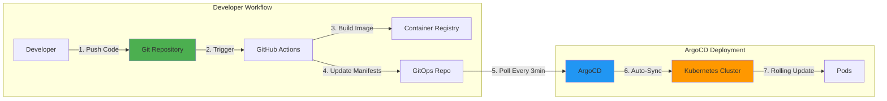

**Core Principles**:
1. **Single Source of Truth**: All configuration in Git
2. **Declarative**: Desired state, not imperative steps
3. **Auditable**: Full history of every change
4. **Reversible**: Easy rollback to any previous state
5. **Automated**: No manual `kubectl apply` commands

**Source**: [ArgoCD GitOps Pattern](https://argo-cd.readthedocs.io/en/stable/user-guide/best_practices/)

---

### Single Source of Truth

**No Duplications**: Each service is deployed via ONE method only:

| Service | Deployment Method | Rationale |
|---------|-------------------|-----------|
| **Keycloak** | Operator | Declarative realm management, SPIFFE support |
| **SPIRE** | Helm | Official SPIFFE charts |
| **Istio** | Helm | Upstream Istio charts with custom values |
| **Kiali** | Helm | Official Kiali charts |
| **Container Registry** | Helm | Simple chart for dev-only deployment |
| **Operators** | Helm | Official operator charts (kagenti-operator, platform-operator) |
| **Cert-Manager** | Kustomize | CRD-only deployment |
| **Gateway API** | Kustomize | CRD-only deployment |
| **Tekton** | Kustomize | Raw YAML sufficient |
| **OAuth2-Proxy** | Kustomize | Multiple instances per service |
| **Grafana** | Kustomize | Custom dashboards and datasources |
| **Tempo** | Kustomize | Custom configuration |
| **Phoenix** | Kustomize | Custom configuration |
| **OTEL Collector** | Kustomize | Custom pipeline configuration |
| **Kagenti UI** | Kustomize | Stateless application |

**Why This Matters**: Prevents conflicts, ensures consistency, simplifies troubleshooting.

**Source**: [Kagenti ARCHITECTURE.md](../../ARCHITECTURE.md#deployment-methods-by-service)

---

## Component Layers

The Kagenti platform is organized into four component layers, deployed in sequence via ArgoCD sync waves:

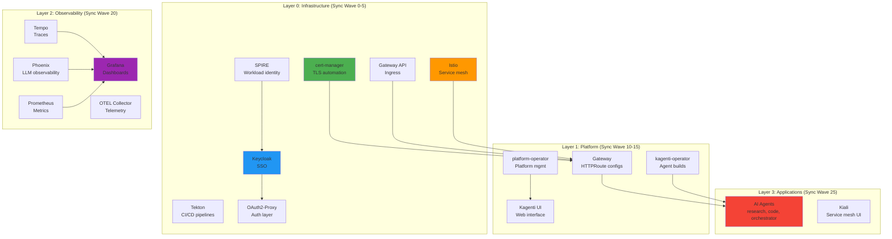

### Layer 0: Infrastructure (Sync Wave 0-5)

**Purpose**: Core platform infrastructure required by all other layers.

**Components**:
- **cert-manager**: Automatic TLS certificate management and renewal
- **Gateway API**: Kubernetes-native ingress (replaces Ingress)
- **Tekton**: CI/CD pipeline engine for agent builds
- **Istio**: Service mesh providing mTLS, traffic management, observability
- **SPIRE**: Workload identity (trust domain: `kagenti.dev`)
- **Keycloak**: SSO identity provider with OIDC/OAuth2
- **OAuth2-Proxy**: Authentication proxy for services without native auth

**Deployment**:
```bash
kubectl apply -k components/00-infrastructure/
```

**Source**: [Infrastructure Components](../../components/00-infrastructure/)

---

### Layer 1: Platform (Sync Wave 10-15)

**Purpose**: Kagenti platform services and operators.

**Components**:
- **Kagenti UI**: Web interface for platform management
- **kagenti-operator**: Manages Tekton pipelines for agent builds
- **platform-operator**: Manages platform-wide resources (UI, dashboards)
- **Gateway**: HTTPRoute configurations for service access

**Deployment**:
```bash
kubectl apply -k components/01-platform/
```

**Source**: [Platform Components](../../components/01-platform/)

---

### Layer 2: Observability (Sync Wave 20)

**Purpose**: Monitoring, metrics, logging, and tracing stack.

**Components**:
- **Grafana**: Dashboards and visualization with Keycloak OIDC
- **Tempo**: Distributed tracing backend (infrastructure traces)
- **Phoenix**: LLM observability (agent/LLM traces)
- **OTEL Collector**: Routes traces to Tempo or Phoenix based on `openinference.span.kind`
- **Prometheus**: Metrics collection and alerting
- **Kube State Metrics**: Kubernetes resource metrics

**Dual-Backend Tracing**:
- **Tempo**: High-volume infrastructure traces (short retention: 7-14 days)
- **Phoenix**: Valuable agent/LLM traces (long retention: 30-90 days)

**Deployment**:
```bash
kubectl apply -k components/02-observability/
```

**Source**: [Observability Components](../../components/02-observability/) | [Distributed Tracing Guide](../04-observability/distributed-tracing.md)

---

### Layer 3: Applications (Sync Wave 25)

**Purpose**: AI agents and supporting applications.

**Components**:
- **AI Agents**: research-agent, code-agent, orchestrator-agent
- **Kiali**: Service mesh visualization and debugging

**Deployment**:
```bash
kubectl apply -k components/03-applications/
```

**Source**: [Application Components](../../components/03-applications/)

---

## Technology Stack

### Complete Technology Map

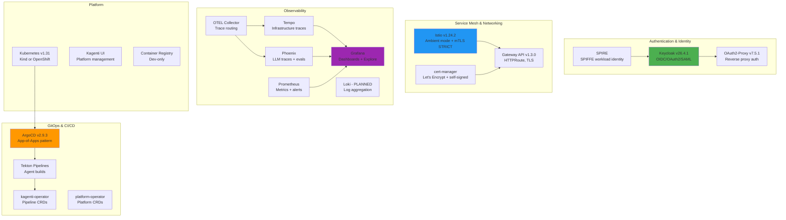

### Version Information

| Component | Version | Notes |
|-----------|---------|-------|
| **Kubernetes** | v1.31 | Kind (local), OpenShift (production) |
| **ArgoCD** | v2.9.3 | GitOps continuous delivery |
| **Istio** | v1.24.2 | Ambient mode (sidecar-less) |
| **Keycloak** | v26.4.1 | With SPIFFE preview features |
| **SPIRE** | Latest | Via official Helm charts |
| **Gateway API** | v1.3.0 | Kubernetes-native ingress |
| **Cert-Manager** | Latest stable | TLS automation |
| **OAuth2-Proxy** | v7.5.1 | OIDC authentication proxy |
| **Grafana** | Latest stable | Dashboards and visualization |
| **Tempo** | Latest stable | Distributed tracing backend |
| **Phoenix** | Latest stable | LLM observability |
| **Prometheus** | Latest stable | Metrics and alerting |

**Source**: [ARCHITECTURE.md Version Information](../../ARCHITECTURE.md#version-information)

---

## Deployment Architecture

### ArgoCD App-of-Apps Pattern

The Kagenti platform uses the **App-of-Apps pattern** for GitOps deployment:

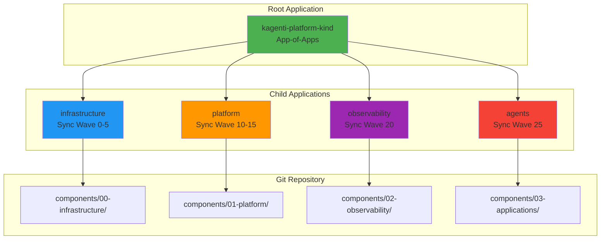

**Root Application**:
```yaml
# argocd/bootstrap/kind/kagenti-platform.yaml
apiVersion: argoproj.io/v1alpha1
kind: Application
metadata:
  name: kagenti-platform-kind
  namespace: argocd
spec:
  source:
    repoURL: https://github.com/Ladas/kagenti-demo-deployment
    targetRevision: main
    path: argocd/applications/kind-local
  destination:
    server: https://kubernetes.default.svc
    namespace: argocd
  syncPolicy:
    automated:
      prune: true
      selfHeal: true
```

**Benefits**:
- ✅ **Single source of truth**: One root app manages all child apps
- ✅ **Ordered deployment**: Sync waves ensure correct ordering
- ✅ **Easy rollback**: Rollback root app to rollback everything
- ✅ **Environment separation**: Different root apps for different environments

**Source**: [ArgoCD App-of-Apps Guide](../01-infrastructure/argocd.md) | [App-of-Apps Pattern](https://argo-cd.readthedocs.io/en/stable/operator-manual/cluster-bootstrapping/)

---

### Deployment Flow

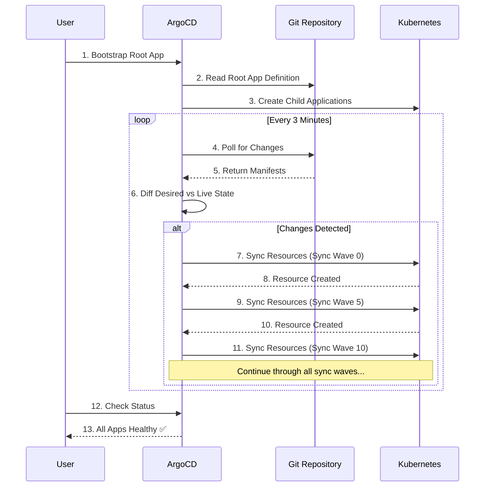

**Deployment Steps**:
1. **Create Kind Cluster**: `./scripts/kind/01-create-cluster.sh`
2. **Install ArgoCD**: `./scripts/kind/02-install-argocd.sh`
3. **Bootstrap Apps**: `./scripts/kind/03-bootstrap-apps.sh`
4. **ArgoCD Auto-Syncs**: Infrastructure → Platform → Observability → Agents

**Source**: [Quick Start Guide](./quick-start.md)

---

## Security Architecture

### Multi-Layer Security Model

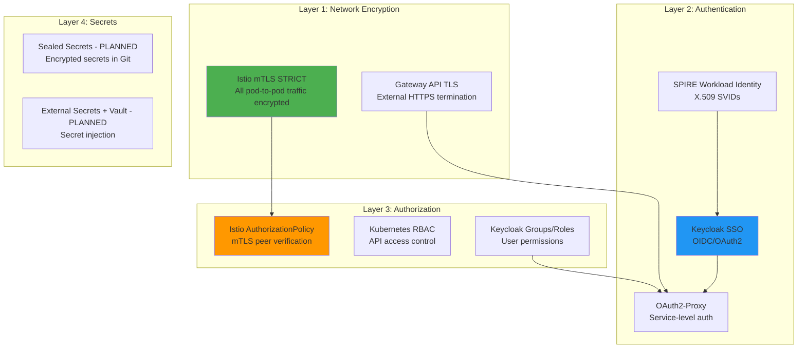

### Encryption Architecture

**All network traffic is encrypted**:

```
Application → Istio Sidecar → mTLS → Network → Istio Sidecar → Application
            (localhost HTTP)  (encrypted TLS 1.3)     (localhost HTTP)
```

**How it Works**:
1. Application speaks HTTP to local sidecar (same pod, localhost)
2. Istio sidecars transparently encrypt ALL network traffic (mTLS STRICT)
3. Automatic certificate rotation via Istio CA
4. No application TLS configuration needed

**External Access**:
- **HTTPS**: TLS termination at Gateway API level (cert-manager certificates)
- **HTTP→HTTPS Redirect**: Automatic redirect enforced by HTTPRoute

**Source**: [Istio Service Mesh Guide](../02-service-mesh/istio.md) | [cert-manager Guide](../01-infrastructure/cert-manager.md)

---

### Authentication Flow

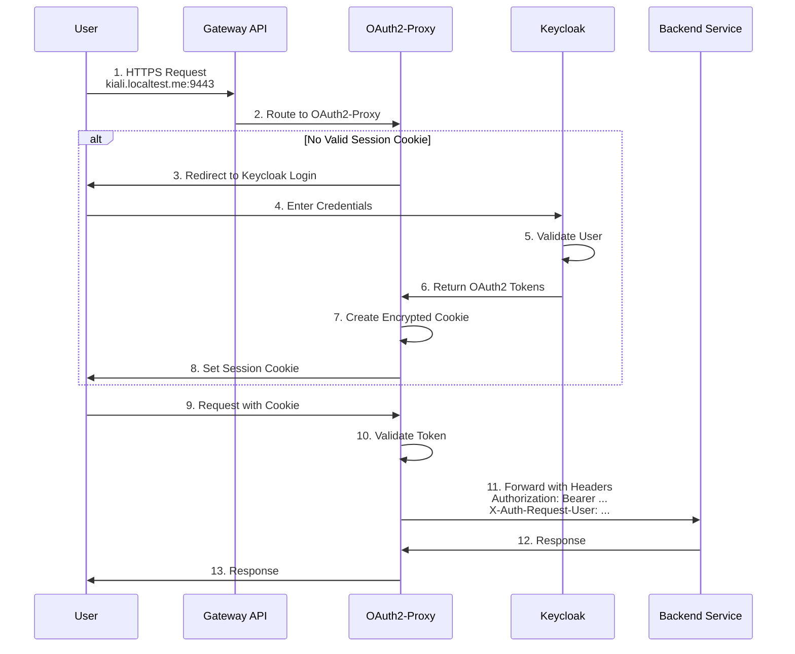

**Authentication Components**:
1. **Keycloak**: Central identity provider (OIDC/OAuth2)
2. **OAuth2-Proxy**: Per-service authentication proxy
3. **Session Cookies**: Encrypted, HTTP-only, secure, SameSite=lax
4. **Token Refresh**: Automatic refresh every hour (no re-login)

**Protected Services**:
- Kiali (service mesh UI)
- Phoenix (LLM observability)
- Tempo (distributed tracing)
- Prometheus (metrics)

**Source**: [Keycloak SSO Guide](../03-authentication/keycloak.md) | [OAuth2-Proxy Guide](../03-authentication/oauth2-proxy.md)

---

## Access Patterns

### Local Development (Kind)

All services accessible via `localtest.me` DNS wildcard (points to 127.0.0.1):

| Service | URL | Realm | Default Credentials |
|---------|-----|-------|---------------------|
| **Kagenti UI** | `https://kagenti.localtest.me:9443` | `kagenti` | Keycloak SSO |
| **Keycloak Admin** | `https://keycloak.localtest.me:9443` | N/A | `admin` / `admin` |
| **ArgoCD UI** | `https://argocd.localtest.me:9443` | N/A | `admin` / (see script output) |
| **Grafana** | `https://grafana.localtest.me:9443` | `kubernetes` | Keycloak SSO |
| **Phoenix** | `https://phoenix.localtest.me:9443` | `kagenti` | Keycloak SSO |
| **Kiali** | `https://kiali.localtest.me:9443` | `kubernetes` | Keycloak SSO |
| **Tempo (Jaeger UI)** | `https://tempo.localtest.me:9443` | `kubernetes` | Keycloak SSO |
| **Prometheus** | `https://prometheus.localtest.me:9443` | `kubernetes` | Keycloak SSO |
| **SPIRE Tornjak** | `https://spire-tornjak.localtest.me:9443` | N/A | No auth (dev) |

**Get Access Info**:
```bash
# Show all service URLs and credentials
./scripts/show-access-info.sh

# Check platform health
./scripts/platform-status.sh
```

**Source**: [HTTPS Access Guide](../../HTTPS_ACCESS_GUIDE.md) | [Quick Start Guide](./quick-start.md)

---

### Production (OpenShift)

Services use proper DNS names with Let's Encrypt certificates:

```
https://kagenti.apps.cluster.example.com
https://grafana.apps.cluster.example.com
https://keycloak.apps.cluster.example.com
```

**Differences from Kind**:
- Real DNS names (not localtest.me)
- Let's Encrypt certificates (not self-signed)
- OpenShift Routes (instead of Gateway API)
- Red Hat Certified Operators via OLM
- Persistent storage for stateful services
- Higher resource limits and replicas

**Source**: [OpenShift Deployment Guide](../09-deployment/openshift-prod.md) *(coming soon)*

---

## ArgoCD Sync Waves

Applications deploy in order using ArgoCD sync waves:

```mermaid
gantt
    title ArgoCD Deployment Order (Sync Waves)
    dateFormat X
    axisFormat %s

    section Wave -5
    Istio Base CRDs :wave-5, 0, 5

    section Wave 0
    cert-manager :wave0, 5, 10
    Gateway API :wave0-2, 5, 10
    Tekton :wave0-3, 5, 10

    section Wave 5
    Istio (istiod) :wave5, 10, 15
    SPIRE :wave5-2, 10, 15
    Keycloak :wave5-3, 10, 15

    section Wave 10
    kagenti-operator :wave10, 15, 20
    platform-operator :wave10-2, 15, 20

    section Wave 15
    Kagenti UI :wave15, 20, 25
    Gateway HTTPRoutes :wave15-2, 20, 25
    Keycloak Realms :wave15-3, 20, 25

    section Wave 20
    Grafana :wave20, 25, 30
    Tempo :wave20-2, 25, 30
    Phoenix :wave20-3, 25, 30
    OTEL Collector :wave20-4, 25, 30
    Prometheus :wave20-5, 25, 30

    section Wave 25
    AI Agents :wave25, 30, 35
    Kiali :wave25-2, 30, 35
```

**Sync Wave Annotations**:
```yaml
metadata:
  annotations:
    argocd.argoproj.io/sync-wave: "0"
```

**Why Sync Waves Matter**:
- ✅ **Dependency Management**: Ensure dependencies deploy first
- ✅ **Stability**: Avoid race conditions during deployment
- ✅ **Rollback Safety**: Reverse order for safe rollbacks
- ✅ **Clear Ordering**: Explicit deployment sequence

**Source**: [ArgoCD Sync Waves](https://argo-cd.readthedocs.io/en/stable/user-guide/sync-waves/)

---

## Secret Management

### Development (Kind)

**Secrets generated at deployment time**:
```yaml
# Example: Keycloak admin password generation
apiVersion: batch/v1
kind: Job
metadata:
  name: keycloak-init-admin
  namespace: keycloak
spec:
  template:
    spec:
      containers:
      - name: init
        command:
        - /bin/bash
        - -c
        - |
          # Generate random password
          ADMIN_PASSWORD=$(openssl rand -base64 32)

          # Create secret
          kubectl create secret generic keycloak-admin-credentials \
            --from-literal=username=admin \
            --from-literal=password=$ADMIN_PASSWORD \
            -n keycloak
```

**Secret Types**:
1. **Admin Credentials**: Random passwords via `/dev/urandom`
2. **Client Secrets**: Generated by Keycloak, distributed via jobs
3. **Cookie Secrets**: Random base64-encoded keys for OAuth2-Proxy
4. **TLS Certificates**: Generated by cert-manager

**No Hardcoded Credentials**: All secrets generated at runtime, never committed to Git.

---

### Production (OpenShift) - Planned

**External Secrets Operator + Vault**:
```yaml
apiVersion: external-secrets.io/v1beta1
kind: ExternalSecret
metadata:
  name: keycloak-admin-credentials
  namespace: keycloak
spec:
  secretStoreRef:
    name: vault-backend
    kind: SecretStore
  target:
    name: keycloak-admin-credentials
  data:
  - secretKey: password
    remoteRef:
      key: keycloak/admin
      property: password
```

**Sealed Secrets** for encrypted secrets in Git:
```bash
# Encrypt secret for Git storage
kubeseal --format yaml < secret.yaml > sealed-secret.yaml

# Commit sealed secret to Git
git add sealed-secret.yaml
```

**Source**: [TODO_ARGO_CLEANUP.md Secret Management](../../TODO_ARGO_CLEANUP.md)

---

## Network Architecture

### Service Communication Patterns

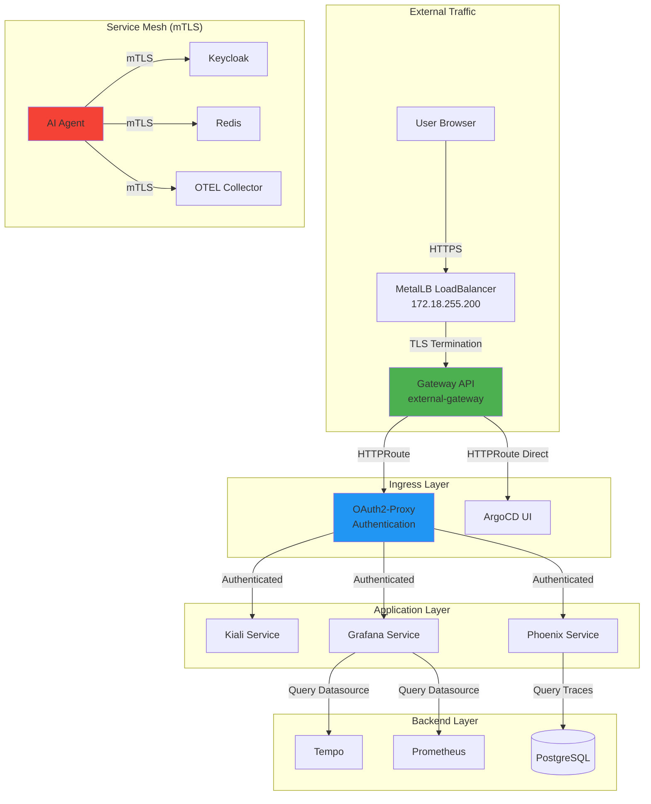

**Network Layers**:
1. **External Access**: MetalLB LoadBalancer → Gateway API (HTTPS)
2. **Ingress**: HTTPRoute → OAuth2-Proxy → Services
3. **Service Mesh**: mTLS encryption between all pods
4. **Internal**: Cluster DNS (service.namespace.svc.cluster.local)

**Port Mapping (Kind)**:
- **HTTPS**: `9443` (external) → `443` (gateway)
- **HTTP**: `8080` (external) → `80` (gateway) → redirects to HTTPS

**Source**: [Gateway API Guide](../01-infrastructure/gateway-api.md) | [Istio Service Mesh Guide](../02-service-mesh/istio.md)

---

## Observability Architecture

### Dual-Backend Tracing

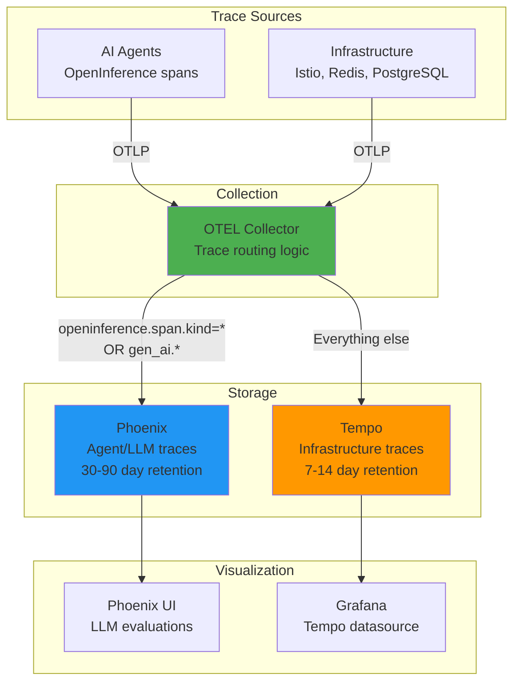

**Routing Logic**:
```yaml
# OTEL Collector configuration
processors:
  routing:
    from_attribute: openinference.span.kind
    table:
    - value: "agent"
      exporters: [otlp/phoenix]
    - value: "chain"
      exporters: [otlp/phoenix]
    - value: "llm"
      exporters: [otlp/phoenix]
    default_exporters: [otlp/tempo]
```

**Why Two Backends?**
- **Tempo**: High-volume infrastructure traces (cheap storage, short retention)
- **Phoenix**: Valuable agent/LLM traces (expensive storage, long retention, evaluations)

**Source**: [Distributed Tracing Guide](../04-observability/distributed-tracing.md) | [Phoenix Guide](../04-observability/phoenix.md)

---

### Metrics Architecture

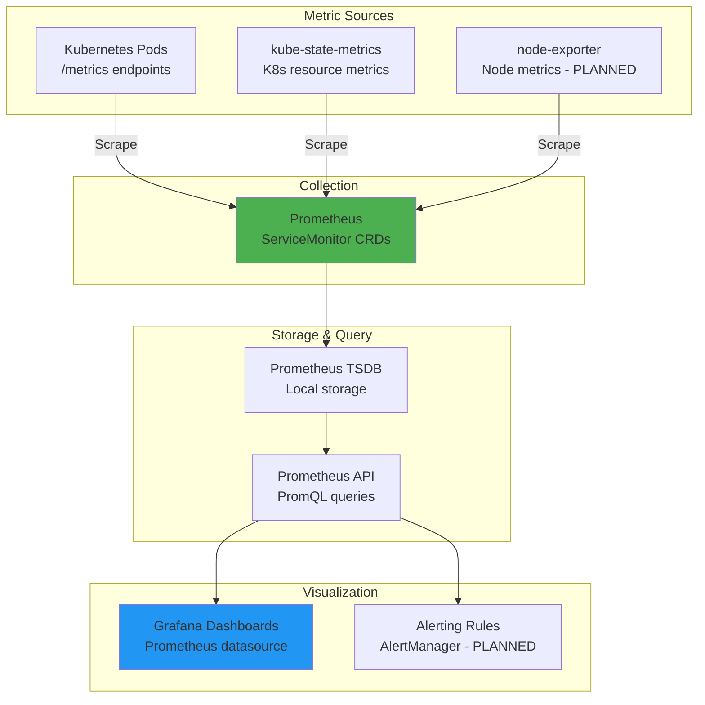

**ServiceMonitor Example**:
```yaml
apiVersion: monitoring.coreos.com/v1
kind: ServiceMonitor
metadata:
  name: grafana
  namespace: observability
spec:
  selector:
    matchLabels:
      app: grafana
  endpoints:
  - port: http
    path: /metrics
    interval: 30s
```

**Source**: [Prometheus Metrics Guide](../04-observability/prometheus.md) | [Grafana Dashboards Guide](../04-observability/grafana.md)

---

## Development Workflow

### Day 1: Initial Deployment

```bash
# 1. Create Kind cluster with MetalLB
./scripts/kind/01-create-cluster.sh

# 2. Install ArgoCD v2.9.3
./scripts/kind/02-install-argocd.sh

# 3. Bootstrap Applications (App-of-Apps)
./scripts/kind/03-bootstrap-apps.sh

# 4. Wait for all apps to sync (auto-sync enabled)
watch kubectl get applications -n argocd

# 5. Check platform health
./scripts/platform-status.sh

# 6. Get access info
./scripts/show-access-info.sh
```

**Total Time**: ~10-15 minutes for full deployment

---

### Day 2: Making Changes

```bash
# 1. Make changes to manifests
vim components/01-platform/kagenti-ui/deployment.yaml

# 2. Commit to Git
git add components/01-platform/kagenti-ui/deployment.yaml
git commit -m "Update Kagenti UI replicas to 2"
git push

# 3. ArgoCD auto-syncs within 3 minutes
# OR manually trigger sync
argocd app sync platform

# 4. Verify deployment
kubectl get pods -n kagenti-system -l app=kagenti-ui
```

**No `kubectl apply` needed** - all changes go through Git!

---

### Day 2: Troubleshooting

```bash
# 1. Check ArgoCD app status
argocd app get infrastructure

# 2. Check pod logs
kubectl logs -n observability deploy/grafana

# 3. Check Istio mTLS status
kubectl exec -n team1 deploy/research-agent -c istio-proxy -- \
  pilot-agent request GET config_dump | grep -A 5 tls

# 4. Check Keycloak realms
kubectl exec -n keycloak deploy/keycloak -- \
  /opt/keycloak/bin/kcadm.sh get realms

# 5. View traces in Phoenix
open https://phoenix.localtest.me:9443

# 6. View service mesh in Kiali
open https://kiali.localtest.me:9443
```

**Source**: [Quick Start Guide](./quick-start.md) | [Troubleshooting Guide](../10-operations/troubleshooting.md) *(coming soon)*

---

## Production Differences

### Kind (Local) vs OpenShift (Production)

| Feature | Kind (Local) | OpenShift (Production) |
|---------|--------------|------------------------|
| **Replicas** | 1 per service | 2-3 (HA) |
| **Ingress** | Gateway API (HTTPRoute) | OpenShift Route + TLS |
| **Service Mesh** | Istio (upstream) | OpenShift Service Mesh 3.0 |
| **Operators** | Upstream (Helm) | Red Hat Certified (OLM) |
| **Certificates** | Self-signed (cert-manager) | Let's Encrypt (cert-manager) |
| **Storage** | EmptyDir / hostPath | Persistent Volumes (Ceph, NFS) |
| **Security** | Istio mTLS STRICT | SCC restricted-v2 + mTLS |
| **Authentication** | Keycloak SSO (dev users) | Keycloak SSO (LDAP/AD integration) |
| **Sync Policy** | Auto (after first manual sync) | Manual (change approval) |
| **PodDisruptionBudget** | No | Yes (HA) |
| **Resource Limits** | Low (development) | Production-grade |
| **Monitoring Retention** | 1 day | 30-90 days |
| **Backup** | None | Automated (Velero) |

**Migration Path**: [Migration Guide](../09-deployment/migration-guide.md) *(coming soon)*

---

## Next Steps

### For New Users

1. **Deploy Locally**: Follow [Quick Start Guide](./quick-start.md)
2. **Explore Platform**: Use [HTTPS Access Guide](../../HTTPS_ACCESS_GUIDE.md)
3. **Learn GitOps**: Read [ArgoCD Guide](../01-infrastructure/argocd.md)

### For Platform Engineers

1. **Understand Component Layers**: Review [Component Documentation](../../components/)
2. **Configure Observability**: Read [Distributed Tracing](../04-observability/distributed-tracing.md)
3. **Set Up Authentication**: Read [Keycloak SSO](../03-authentication/keycloak.md)
4. **Plan Production**: Review [Deployment Guides](../09-deployment/)

### For Developers

1. **Build Agents**: Learn [Tekton Pipelines](../05-ci-cd/tekton.md) *(coming soon)*
2. **Add Instrumentation**: Read [GenAI Semantic Conventions](../04-observability/genai-semantic-conventions.md)
3. **Debug Issues**: Use [Kiali](../04-observability/kiali.md) and [Phoenix](../04-observability/phoenix.md)

### For Architects

1. **Review Security Model**: Read [Istio Security](../02-service-mesh/istio.md)
2. **Plan Scaling**: Review [Resource Requirements](../../README.md#resource-requirements)
3. **Design Production**: Read [Migration Guide](../09-deployment/migration-guide.md) *(coming soon)*

---

## References

### Official Documentation

- **ArgoCD**: [argo-cd.readthedocs.io](https://argo-cd.readthedocs.io/)
- **Kubernetes**: [kubernetes.io/docs](https://kubernetes.io/docs/)
- **Istio**: [istio.io/latest/docs](https://istio.io/latest/docs/)
- **Gateway API**: [gateway-api.sigs.k8s.io](https://gateway-api.sigs.k8s.io/)
- **Keycloak**: [www.keycloak.org/documentation](https://www.keycloak.org/documentation)
- **OpenTelemetry**: [opentelemetry.io/docs](https://opentelemetry.io/docs/)

### Internal Documentation

- **Main README**: [../../README.md](../../README.md)
- **Architecture Details**: [../../ARCHITECTURE.md](../../ARCHITECTURE.md)
- **Quick Start**: [./quick-start.md](./quick-start.md)
- **Prerequisites**: [./prerequisites.md](./prerequisites.md) *(coming soon)*
- **Component Guides**: [../README.md](../README.md)

### Repository

- **GitHub**: [Ladas/kagenti-demo-deployment](https://github.com/Ladas/kagenti-demo-deployment)
- **Components**: `components/`
- **ArgoCD Applications**: `argocd/applications/`
- **Deployment Scripts**: `scripts/`

---

**Last Updated**: 2025-11-12
**Document Version**: 1.0
**Maintained By**: Platform Engineering Team
**License**: Apache 2.0
