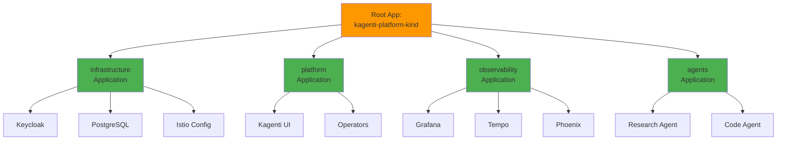
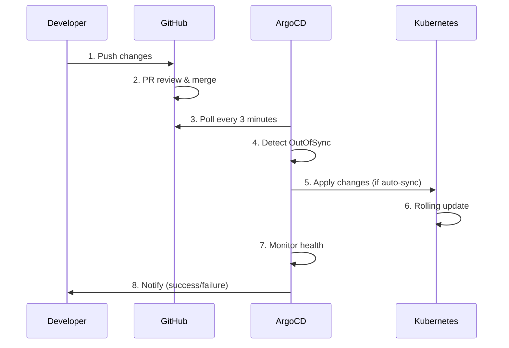

# ArgoCD: GitOps Continuous Deployment

**Version**: 2.0
**Last Updated**: 2025-11-11
**Status**: Production Ready
**Audience**: Platform Engineers, DevOps, SRE

Complete guide to ArgoCD GitOps deployment for the Kagenti platform with ApplicationSets for multi-environment automation.

---

## Table of Contents

- [Overview](#overview)
- [What is ArgoCD?](#what-is-argocd)
- [Architecture](#architecture)
- [Installation](#installation)
- [Configuration](#configuration)
- [Usage](#usage)
- [ApplicationSets Migration](#applicationsets-migration)
- [Troubleshooting](#troubleshooting)
- [Alternatives](#alternatives)
- [Next Steps](#next-steps)
- [References](#references)

---

## Overview

**Purpose**: Provide GitOps-based continuous deployment for Kubernetes applications with full audit trail and declarative configuration.

**What You Get**:
- ✅ Git as single source of truth
- ✅ Automated synchronization from Git to cluster
- ✅ Multi-environment deployment (Kind, OpenShift)
- ✅ Application health monitoring
- ✅ Declarative rollback capability
- ✅ App-of-Apps pattern for layered deployment
- ✅ ApplicationSets for scalable multi-environment management

**Key Benefit**: All changes go through Git (pull requests, reviews, approvals) before reaching the cluster, providing complete auditability and easy rollback.

**Source**: Based on [ArgoCD Documentation](https://argo-cd.readthedocs.io/)

---

## What is ArgoCD?

**ArgoCD** is a declarative, GitOps continuous delivery tool for Kubernetes.

### Core Concepts

| Concept | Description | Example |
|---------|-------------|---------|
| **GitOps** | Git as single source of truth | All cluster state defined in Git |
| **Sync** | Apply Git changes to cluster | `argocd app sync myapp` |
| **Health** | Monitor application status | Deployment, Pods, Services healthy |
| **Application** | ArgoCD CR representing deployed app | Keycloak app pointing to `components/keycloak/` |
| **ApplicationSet** | Generate multiple Applications | One ApplicationSet → Apps for all environments |
| **Sync Wave** | Control deployment order | Infrastructure (wave 0) before Platform (wave 10) |

**Source**: [ArgoCD Core Concepts](https://argo-cd.readthedocs.io/en/stable/core_concepts/)

### Why GitOps?

**Without GitOps**:
```bash
# Manual deployment (no audit trail)
kubectl apply -f manifests/
kubectl patch deployment myapp --patch '{"spec":{"replicas":3}}'

❌ No record of who changed what
❌ No easy rollback
❌ Configuration drift between environments
❌ No review process
```

**With GitOps (ArgoCD)**:
```bash
# 1. Make changes in Git
vim components/myapp/deployment.yaml  # Change replicas to 3
git commit -m "Scale myapp to 3 replicas"
git push

# 2. ArgoCD auto-syncs (or manual sync)
argocd app sync myapp

✅ Full audit trail in Git
✅ Easy rollback (git revert)
✅ Configuration always in sync
✅ Pull request review process
```

**Source**: [GitOps Principles](https://opengitops.dev/)

---

## Architecture

### App-of-Apps Pattern

Kagenti uses the **App-of-Apps pattern** where a root Application deploys child Applications:



**Source**: [App of Apps Pattern](https://argo-cd.readthedocs.io/en/stable/operator-manual/cluster-bootstrapping/)

---

### Application Lifecycle



**Source**: [ArgoCD Architecture](https://argo-cd.readthedocs.io/en/stable/operator-manual/architecture/)

---

### Current vs Future: ApplicationSets

**Current Approach** (Manual Patches):
```
argocd/applications/
├── base/
│   ├── keycloak.yaml          # Base Application
│   ├── grafana.yaml
│   └── ...                     # 18 Applications
├── kind-local/
│   └── kustomization.yaml      # Patches for ALL 18 apps
├── openshift-stage/
│   └── kustomization.yaml      # Patches for ALL 18 apps
└── openshift-prod/
    └── kustomization.yaml      # Patches for ALL 18 apps

Problem: Adding new environment = patching 18 Applications
```

**Future Approach** (ApplicationSets):
```
argocd/appsets/
├── keycloak.yaml               # ApplicationSet (generates apps for all envs)
├── grafana.yaml
└── ...                         # 18 ApplicationSets

Adding new environment = adding ONE line to each ApplicationSet
```

**Source**: [TODO_ARGO_NEXT.md](../../TODO_ARGO_NEXT.md) (internal migration plan)

---

## Installation

### Method 1: Quick Install (Kind)

**Prerequisites**:
- Kind cluster created
- kubectl configured

**Installation**:
```bash
# 1. Create ArgoCD namespace
kubectl create namespace argocd

# 2. Install ArgoCD
kubectl apply -n argocd -f https://raw.githubusercontent.com/argoproj/argo-cd/stable/manifests/install.yaml

# 3. Wait for ArgoCD to be ready
kubectl wait --for=condition=ready pod -l app.kubernetes.io/name=argocd-server -n argocd --timeout=300s

# Expected: All ArgoCD pods Running
```

**Access UI**:
```bash
# Port-forward to ArgoCD server
kubectl port-forward svc/argocd-server -n argocd 8080:443

# Get admin password
kubectl -n argocd get secret argocd-initial-admin-secret \
  -o jsonpath="{.data.password}" | base64 -d

# Access: https://localhost:8080
# Username: admin
# Password: (from command above)
```

**Source**: [ArgoCD Getting Started](https://argo-cd.readthedocs.io/en/stable/getting_started/)

---

### Method 2: Helm Install (Production)

**Prerequisites**:
- Helm 3.x installed
- Cluster with persistent storage

**Installation**:
```bash
# 1. Add ArgoCD Helm repository
helm repo add argo https://argoproj.github.io/argo-helm
helm repo update

# 2. Install ArgoCD with custom values
helm install argocd argo/argo-cd \
  --namespace argocd \
  --create-namespace \
  --values argocd-values.yaml

# argocd-values.yaml
server:
  replicas: 3  # HA mode
  ingress:
    enabled: true
    hosts:
      - argocd.example.com
    tls:
      - secretName: argocd-tls
        hosts:
          - argocd.example.com

# 3. Wait for deployment
kubectl wait --for=condition=available deployment/argocd-server -n argocd --timeout=600s
```

**Source**: [ArgoCD Helm Chart](https://github.com/argoproj/argo-helm/tree/main/charts/argo-cd)

---

### Verify Installation

```bash
# Check ArgoCD components
kubectl get pods -n argocd

# Expected output:
# NAME                                  READY   STATUS
# argocd-application-controller-0       1/1     Running
# argocd-dex-server-xxx                 1/1     Running
# argocd-redis-xxx                      1/1     Running
# argocd-repo-server-xxx                1/1     Running
# argocd-server-xxx                     1/1     Running

# Check ArgoCD version
kubectl exec -n argocd deploy/argocd-server -- argocd version

# Install ArgoCD CLI (optional but recommended)
# macOS
brew install argocd

# Linux
curl -sSL -o /usr/local/bin/argocd https://github.com/argoproj/argo-cd/releases/latest/download/argocd-linux-amd64
chmod +x /usr/local/bin/argocd
```

**Source**: [ArgoCD CLI Installation](https://argo-cd.readthedocs.io/en/stable/cli_installation/)

---

## Configuration

### Bootstrap Root Application (App-of-Apps)

**File**: `argocd/bootstrap/kind/root-app.yaml`

```yaml
apiVersion: argoproj.io/v1alpha1
kind: Application
metadata:
  name: kagenti-platform-kind
  namespace: argocd
spec:
  project: default

  source:
    repoURL: https://github.com/Ladas/kagenti-demo-deployment.git
    targetRevision: main
    path: argocd/applications/kind-local

  destination:
    server: https://kubernetes.default.svc
    namespace: argocd

  syncPolicy:
    automated:
      prune: false      # Don't auto-delete resources
      selfHeal: false   # Don't auto-fix manual changes
    syncOptions:
      - CreateNamespace=true
```

**Apply Root Application**:
```bash
kubectl apply -f argocd/bootstrap/kind/root-app.yaml

# Verify root app created
argocd app list
```

**Source**: [Declarative Setup](https://argo-cd.readthedocs.io/en/stable/operator-manual/declarative-setup/)

---

### Layer Applications

**Infrastructure Layer** (`argocd/applications/base/infrastructure.yaml`):
```yaml
apiVersion: argoproj.io/v1alpha1
kind: Application
metadata:
  name: infrastructure
  namespace: argocd
  annotations:
    argocd.argoproj.io/sync-wave: "0"  # Deploy first
spec:
  project: default

  source:
    repoURL: https://github.com/Ladas/kagenti-demo-deployment.git
    targetRevision: main
    path: components/00-infrastructure

  destination:
    server: https://kubernetes.default.svc

  syncPolicy:
    automated:
      prune: false
      selfHeal: false
    syncOptions:
      - CreateNamespace=true
```

**Sync Waves** control deployment order:

| Wave | Layer | Components | Why First |
|------|-------|------------|-----------|
| **0** | Infrastructure | Keycloak, PostgreSQL, Istio config | Foundation required by other layers |
| **10** | Platform | Operators, Kagenti UI | Depends on infrastructure |
| **20** | Observability | Grafana, Tempo, Phoenix | Monitors platform |
| **30** | Agents | Research, Code, Orchestrator | Uses platform services |

**Source**: [Sync Waves](https://argo-cd.readthedocs.io/en/stable/user-guide/sync-waves/)

---

### Environment-Specific Configuration

**Kind Local Override** (`argocd/applications/kind-local/kustomization.yaml`):
```yaml
apiVersion: kustomize.config.k8s.io/v1beta1
kind: Kustomization

resources:
  - ../base/infrastructure.yaml
  - ../base/platform.yaml
  - ../base/observability.yaml
  - ../base/agents.yaml

patches:
  # Point infrastructure to Kind overlay
  - target:
      name: infrastructure
    patch: |-
      - op: replace
        path: /spec/source/path
        value: components/00-infrastructure/overlays/kind-local
```

**Source**: [Kustomize Patches](https://kubectl.docs.kubernetes.io/references/kustomize/patches/)

---

## Usage

### Common ArgoCD Operations

#### Sync Application

```bash
# Sync single application
argocd app sync infrastructure

# Sync all applications
argocd app sync --all

# Sync with prune (delete resources not in Git)
argocd app sync infrastructure --prune

# Sync specific resource
argocd app sync infrastructure --resource deployment:keycloak
```

**Source**: [ArgoCD Sync Options](https://argo-cd.readthedocs.io/en/stable/user-guide/sync-options/)

---

#### Check Application Status

```bash
# List all applications
argocd app list

# Get application details
argocd app get infrastructure

# Check sync status
argocd app get infrastructure --output json | jq '.status.sync.status'

# Expected: "Synced"
```

---

#### View Application Diff

```bash
# See what will change
argocd app diff infrastructure

# Output shows Git vs cluster differences
```

---

#### Rollback Application

**Method 1: Git Revert (Recommended)**
```bash
# 1. Revert Git commit
git revert abc123
git push

# 2. Sync from Git
argocd app sync infrastructure
```

**Method 2: ArgoCD History**
```bash
# View deployment history
argocd app history infrastructure

# Rollback to specific revision
argocd app rollback infrastructure 5
```

**Source**: [ArgoCD Rollback](https://argo-cd.readthedocs.io/en/stable/user-guide/commands/argocd_app_rollback/)

---

#### Switch Git Branch/Fork

```bash
# Switch to different branch
argocd app set infrastructure --revision feature-branch

# Switch to different fork
argocd app set infrastructure \
  --repo https://github.com/youruser/kagenti-demo-deployment.git \
  --revision main

# Sync after switching
argocd app sync infrastructure
```

---

## ApplicationSets Migration

### Why ApplicationSets?

**Current Problem** (Manual Patches):
```
Adding new environment "openshift-prod":
1. Create argocd/applications/openshift-prod/kustomization.yaml
2. Patch infrastructure.yaml
3. Patch platform.yaml
4. Patch observability.yaml
5. Patch agents.yaml
6. ... (patch ALL 18 applications)

Time: 4-6 hours
Error-prone: Easy to miss an application
```

**ApplicationSets Solution**:
```
Adding new environment "openshift-prod":
1. Add one line to each ApplicationSet:
   - env: openshift-prod
     overlay: openshift-prod

Time: 1-2 hours (just adding lines)
Automatic: All applications generated consistently
```

**Source**: [ApplicationSet Specification](https://argo-cd.readthedocs.io/en/stable/operator-manual/applicationset/)

---

### ApplicationSet Example

**Before** (Manual Application):
```yaml
# argocd/applications/base/keycloak.yaml
apiVersion: argoproj.io/v1alpha1
kind: Application
metadata:
  name: keycloak
spec:
  source:
    path: components/00-infrastructure/keycloak/base

# PLUS patches in:
# - argocd/applications/kind-local/kustomization.yaml
# - argocd/applications/openshift-stage/kustomization.yaml
# - argocd/applications/openshift-prod/kustomization.yaml
```

**After** (ApplicationSet):
```yaml
# argocd/appsets/keycloak.yaml
apiVersion: argoproj.io/v1alpha1
kind: ApplicationSet
metadata:
  name: keycloak
  namespace: argocd
spec:
  generators:
    - list:
        elements:
          - env: kind-local
            overlay: kind-local
          - env: openshift-stage
            overlay: openshift-stage
          - env: openshift-prod
            overlay: openshift-prod

  template:
    metadata:
      name: 'keycloak-{{env}}'
      namespace: argocd
      annotations:
        argocd.argoproj.io/sync-wave: "0"

    spec:
      project: default

      source:
        repoURL: https://github.com/Ladas/kagenti-demo-deployment.git
        targetRevision: main
        path: 'components/00-infrastructure/keycloak/overlays/{{overlay}}'

      destination:
        server: https://kubernetes.default.svc
        namespace: keycloak

      syncPolicy:
        automated:
          prune: false
          selfHeal: false
        syncOptions:
          - CreateNamespace=true
```

**Result**: ApplicationSet automatically creates:
- `keycloak-kind-local` → `overlays/kind-local`
- `keycloak-openshift-stage` → `overlays/openshift-stage`
- `keycloak-openshift-prod` → `overlays/openshift-prod`

---

### Migration Strategy

**Phase 1**: Test with Keycloak only
1. Create `argocd/appsets/keycloak.yaml`
2. Delete manual `argocd/applications/*/keycloak` patches
3. Verify ApplicationSet generates Applications correctly
4. Test sync to all environments

**Phase 2**: Migrate all components
1. Create ApplicationSet for each component
2. Migrate infrastructure layer (18 components)
3. Migrate platform, observability, agents layers
4. Remove `argocd/applications/base/` directory
5. Remove environment-specific patch directories

**Source**: [TODO_ARGO_NEXT.md](../../TODO_ARGO_NEXT.md) (complete migration plan)

---

## Troubleshooting

### Issue: Application Stuck in OutOfSync

**Symptoms**: Application shows "OutOfSync" even after sync

**Diagnosis**:
```bash
# Check application status
argocd app get infrastructure

# View detailed diff
argocd app diff infrastructure

# Check for drift
kubectl get deployment keycloak -n keycloak -o yaml | grep -A5 spec.replicas
```

**Common Causes**:
1. Manual `kubectl` changes (cluster drift)
2. Sync policies prevent auto-sync
3. Resource hooks failed

**Solution**:
```bash
# Force sync with replace
argocd app sync infrastructure --replace

# Enable auto-sync to prevent future drift
argocd app set infrastructure --sync-policy automated
```

**Source**: [ArgoCD Troubleshooting](https://argo-cd.readthedocs.io/en/stable/user-guide/troubleshooting/)

---

### Issue: Application Health Degraded

**Symptoms**: Application shows "Degraded" status

**Diagnosis**:
```bash
# Check application health
argocd app get infrastructure

# Check resource health
kubectl get pods -n keycloak
kubectl describe pod keycloak-xxx -n keycloak
```

**Common Causes**:
1. Pods not ready (CrashLoopBackOff, ImagePullBackOff)
2. Services not healthy
3. Custom health checks failing

**Solution**:
```bash
# Check logs
kubectl logs -n keycloak deployment/keycloak

# Fix underlying issue (image, config, resources)
# Then sync again
argocd app sync infrastructure
```

---

### Issue: Sync Waves Not Respecting Order

**Symptoms**: Applications deploy in wrong order

**Diagnosis**:
```bash
# Check sync wave annotations
argocd app get infrastructure -o yaml | grep sync-wave
argocd app get platform -o yaml | grep sync-wave
```

**Solution**:
```yaml
# Ensure waves are set correctly
metadata:
  annotations:
    argocd.argoproj.io/sync-wave: "0"  # Infrastructure first
    argocd.argoproj.io/sync-wave: "10" # Platform second
```

**Source**: [Sync Wave Ordering](https://argo-cd.readthedocs.io/en/stable/user-guide/sync-waves/#how-do-i-configure-waves)

---

### Issue: ApplicationSet Not Generating Applications

**Symptoms**: ApplicationSet exists but no Applications created

**Diagnosis**:
```bash
# Check ApplicationSet
kubectl get applicationset -n argocd

# Check ApplicationSet controller logs
kubectl logs -n argocd -l app.kubernetes.io/name=argocd-applicationset-controller

# Verify ApplicationSet spec
argocd appset get keycloak
```

**Common Causes**:
1. ApplicationSet controller not running
2. Invalid generator configuration
3. Template errors

**Solution**:
```bash
# Restart ApplicationSet controller
kubectl rollout restart deployment/argocd-applicationset-controller -n argocd

# Validate ApplicationSet YAML
kubectl apply --dry-run=client -f argocd/appsets/keycloak.yaml
```

**Source**: [ApplicationSet Troubleshooting](https://argo-cd.readthedocs.io/en/stable/operator-manual/applicationset/Troubleshooting/)

---

## Alternatives

### Alternative 1: Flux

**Pros**:
- GitOps native (same principles as ArgoCD)
- Lightweight (fewer components)
- Pull-based reconciliation
- Good for simple use cases

**Cons**:
- No UI (CLI only)
- Less mature ApplicationSet equivalent (Kustomizations)
- Smaller ecosystem
- Steeper learning curve

**When to Use**: If you prefer CLI-only workflow and don't need UI.

**Source**: [Flux Documentation](https://fluxcd.io/flux/)

---

### Alternative 2: Jenkins X

**Pros**:
- Integrated CI/CD (not just CD)
- Preview environments
- Built-in best practices

**Cons**:
- Opinionated (prescriptive workflow)
- Heavy (many components)
- Complex setup
- Less flexible than ArgoCD

**When to Use**: If you want full CI/CD platform with opinions.

**Source**: [Jenkins X](https://jenkins-x.io/)

---

### Alternative 3: Spinnaker

**Pros**:
- Multi-cloud support
- Advanced deployment strategies (canary, blue/green)
- Enterprise features

**Cons**:
- Very complex
- Resource-heavy
- Steep learning curve
- Overkill for most use cases

**When to Use**: Large enterprises with complex multi-cloud deployments.

**Source**: [Spinnaker](https://spinnaker.io/)

---

### Alternative 4: Manual kubectl

**Pros**:
- Simple
- No additional tools
- Direct control

**Cons**:
- No audit trail
- No rollback mechanism
- Error-prone
- No consistency guarantees
- Manual drift management

**When to Use**: NEVER for production. Only for local testing.

---

## Next Steps

### For Development

1. **Explore ArgoCD UI**:
   - View application health
   - Inspect resource tree
   - Check sync status

2. **Practice GitOps Workflow**:
   - Make changes in Git
   - Create PR for review
   - Sync after merge
   - Verify deployment

3. **Test Rollback**:
   - Make intentional breaking change
   - Deploy via ArgoCD
   - Rollback using Git revert
   - Verify recovery

### For Production

1. **Migrate to ApplicationSets**:
   - Follow [TODO_ARGO_NEXT.md](../../TODO_ARGO_NEXT.md)
   - Test with one component
   - Migrate all components
   - Remove manual patches

2. **Enable High Availability**:
   - Deploy 3+ ArgoCD server replicas
   - Configure Redis HA
   - Set up ArgoCD notifications
   - Review [ArgoCD HA Guide](https://argo-cd.readthedocs.io/en/stable/operator-manual/high_availability/)

3. **Implement RBAC**:
   - Configure SSO with Keycloak
   - Define project-level permissions
   - Create application-specific roles
   - Review [ArgoCD RBAC](https://argo-cd.readthedocs.io/en/stable/operator-manual/rbac/)

---

## References

### Official Documentation

- **ArgoCD**: [argo-cd.readthedocs.io](https://argo-cd.readthedocs.io/)
- **ApplicationSets**: [ApplicationSet Documentation](https://argo-cd.readthedocs.io/en/stable/operator-manual/applicationset/)
- **Best Practices**: [ArgoCD Best Practices](https://argo-cd.readthedocs.io/en/stable/user-guide/best_practices/)
- **GitHub**: [github.com/argoproj/argo-cd](https://github.com/argoproj/argo-cd)

### GitOps Resources

- **OpenGitOps**: [opengitops.dev](https://opengitops.dev/) - GitOps principles
- **GitOps Working Group**: [github.com/open-gitops/project](https://github.com/open-gitops/project)
- **Weaveworks GitOps**: [weave.works/technologies/gitops](https://www.weave.works/technologies/gitops/) - Original GitOps concept

### Internal Documentation

- **Quick Start**: [../00-getting-started/quick-start.md](../00-getting-started/quick-start.md)
- **ApplicationSets Migration**: [../../TODO_ARGO_NEXT.md](../../TODO_ARGO_NEXT.md)
- **ArgoCD Cleanup Plan**: [../../TODO_ARGO_CLEANUP.md](../../TODO_ARGO_CLEANUP.md)
- **Keycloak SSO**: [../03-authentication/keycloak.md](../03-authentication/keycloak.md)

### Tutorials & Guides

- **Getting Started with ArgoCD**: [argo-cd.readthedocs.io/en/stable/getting_started/](https://argo-cd.readthedocs.io/en/stable/getting_started/)
- **App of Apps Pattern**: [argo-cd.readthedocs.io/en/stable/operator-manual/cluster-bootstrapping/](https://argo-cd.readthedocs.io/en/stable/operator-manual/cluster-bootstrapping/)
- **Sync Waves & Hooks**: [argo-cd.readthedocs.io/en/stable/user-guide/sync-waves/](https://argo-cd.readthedocs.io/en/stable/user-guide/sync-waves/)

### Repository

- **GitHub**: [Ladas/kagenti-demo-deployment](https://github.com/Ladas/kagenti-demo-deployment)
- **ArgoCD Applications**: [argocd/applications/](../../argocd/applications/)
- **ApplicationSets** (future): [argocd/appsets/](../../argocd/appsets/)

---

**Last Updated**: 2025-11-11
**Document Version**: 2.0
**Maintained By**: Platform Engineering Team
**License**: Apache 2.0
