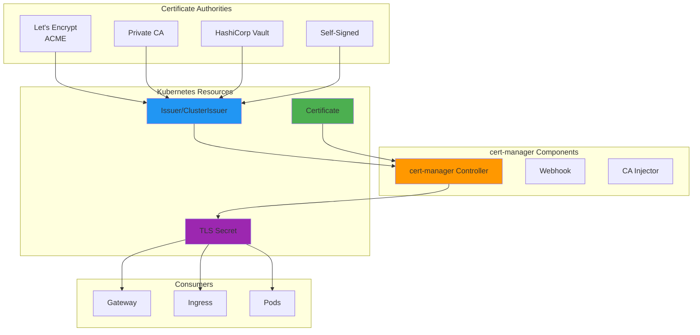
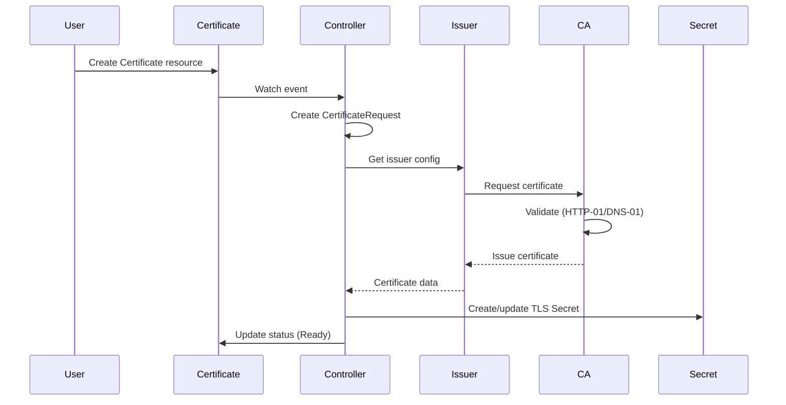

# cert-manager: Automated TLS Certificate Management

**Version**: 1.0
**Last Updated**: 2025-11-12
**Status**: Production Ready
**Audience**: Platform Engineers, SRE

Complete guide to cert-manager for automated TLS certificate provisioning, renewal, and management in Kubernetes.

---

## Table of Contents

- [Overview](#overview)
- [What is cert-manager?](#what-is-cert-manager)
- [Why Use cert-manager?](#why-use-cert-manager)
- [Core Concepts](#core-concepts)
- [Installation](#installation)
- [Issuer Types](#issuer-types)
- [Certificate Lifecycle](#certificate-lifecycle)
- [Kagenti Platform Configuration](#kag

enti-platform-configuration)
- [Certificate Examples](#certificate-examples)
- [Integration with Gateway API](#integration-with-gateway-api)
- [Certificate Renewal](#certificate-renewal)
- [Troubleshooting](#troubleshooting)
- [Alternatives](#alternatives)
- [Next Steps](#next-steps)
- [References](#references)

---

## Overview

**Purpose**: Automate the management and issuance of TLS certificates from various certificate authorities in Kubernetes clusters.

**What You Get**:
- ✅ Automatic certificate provisioning from multiple sources
- ✅ Automatic renewal before expiration (no downtime)
- ✅ Self-signed certificates for development
- ✅ Let's Encrypt integration for production
- ✅ Private CA support for internal services
- ✅ Integration with Gateway API and Ingress
- ✅ Certificate rotation with private key regeneration
- ✅ Multi-namespace certificate management

**Key Benefit**: Never manually manage TLS certificates again - cert-manager handles the entire lifecycle automatically.

**Source**: Based on [cert-manager Documentation](https://cert-manager.io/docs/)

---

## What is cert-manager?

**cert-manager** is a Kubernetes add-on that automates the management and issuance of TLS certificates from various certificate authorities.

### Architecture



**Key Features**:
- **Automated Issuance**: Request certificates via Kubernetes resources
- **Automated Renewal**: Renews certificates before expiration (default: 2/3 of lifetime)
- **Multiple Sources**: Supports ACME (Let's Encrypt), CA, Vault, self-signed
- **Kubernetes-Native**: CRDs for configuration, seamless integration

**Source**: [cert-manager Overview](https://cert-manager.io/docs/)

---

## Why Use cert-manager?

### Without cert-manager

**Manual certificate management**:
```bash
# 1. Generate private key
openssl genrsa -out tls.key 2048

# 2. Create CSR
openssl req -new -key tls.key -out tls.csr

# 3. Get certificate from CA (manual process)
# ... wait for approval ...

# 4. Create Kubernetes Secret
kubectl create secret tls my-tls-secret --cert=tls.crt --key=tls.key

# 5. Remember to renew in 90 days! ⏰
```

**Problems**:
- ❌ Manual process for each certificate
- ❌ Easy to forget renewal (downtime risk)
- ❌ No centralized management
- ❌ Difficult to rotate certificates
- ❌ No audit trail

---

### With cert-manager

**Automated certificate management**:
```yaml
apiVersion: cert-manager.io/v1
kind: Certificate
metadata:
  name: my-app-tls
spec:
  secretName: my-app-tls
  dnsNames:
  - app.example.com
  issuerRef:
    name: letsencrypt-prod
    kind: ClusterIssuer
```

**Benefits**:
- ✅ Declare certificate requirements, cert-manager handles the rest
- ✅ Automatic renewal (30 days before expiration)
- ✅ Centralized configuration via CRDs
- ✅ Automatic private key rotation
- ✅ Full audit trail in Kubernetes events
- ✅ Works with Gateway API, Ingress, and direct Secret consumers

**Source**: [Why cert-manager](https://cert-manager.io/docs/installation/)

---

## Core Concepts

### 1. Certificate

**What**: Kubernetes resource defining certificate requirements.

**Purpose**: Describes the certificate you want (DNS names, duration, issuer).

```yaml
apiVersion: cert-manager.io/v1
kind: Certificate
metadata:
  name: example-com
  namespace: default
spec:
  # Where to store the certificate
  secretName: example-com-tls

  # Certificate validity
  duration: 2160h # 90 days
  renewBefore: 360h # Renew 15 days before expiry

  # Subject information
  subject:
    organizations:
    - Example Inc
  commonName: example.com

  # DNS names covered by certificate
  dnsNames:
  - example.com
  - www.example.com

  # Which issuer to use
  issuerRef:
    name: letsencrypt-prod
    kind: ClusterIssuer

  # Private key configuration
  privateKey:
    algorithm: RSA
    size: 2048
    rotationPolicy: Always  # Rotate on renewal
```

**Key Fields**:
- **secretName**: Name of Kubernetes Secret to store certificate
- **dnsNames**: DNS names (SANs) for the certificate
- **issuerRef**: Reference to Issuer or ClusterIssuer
- **renewBefore**: When to start renewal (fraction of duration)

**Source**: [Certificate Resource](https://cert-manager.io/docs/usage/certificate/)

---

### 2. Issuer

**What**: Namespace-scoped resource defining certificate authority configuration.

**Purpose**: Configures how to obtain certificates (ACME, CA, Vault, self-signed).

```yaml
apiVersion: cert-manager.io/v1
kind: Issuer
metadata:
  name: letsencrypt-staging
  namespace: default
spec:
  acme:
    server: https://acme-staging-v02.api.letsencrypt.org/directory
    email: admin@example.com
    privateKeySecretRef:
      name: letsencrypt-staging-account
    solvers:
    - http01:
        ingress:
          class: nginx
```

**Scope**: Only certificates in the **same namespace** can use this Issuer.

**Source**: [Issuer Configuration](https://cert-manager.io/docs/configuration/)

---

### 3. ClusterIssuer

**What**: Cluster-scoped resource (same as Issuer but cluster-wide).

**Purpose**: Define certificate authority configuration usable from any namespace.

```yaml
apiVersion: cert-manager.io/v1
kind: ClusterIssuer
metadata:
  name: letsencrypt-prod
spec:
  acme:
    server: https://acme-v02.api.letsencrypt.org/directory
    email: admin@example.com
    privateKeySecretRef:
      name: letsencrypt-prod-account  # Stored in cert-manager namespace
    solvers:
    - http01:
        ingress:
          class: nginx
```

**Scope**: Certificates in **any namespace** can reference this ClusterIssuer.

**Best Practice**: Use ClusterIssuer for shared issuers (Let's Encrypt, corporate CA), Issuer for namespace-specific configuration.

**Source**: [ClusterIssuer](https://cert-manager.io/docs/concepts/issuer/)

---

### 4. CertificateRequest

**What**: Low-level resource representing a certificate signing request.

**Purpose**: Created automatically by cert-manager when Certificate is created.

**Lifecycle**:
```
Certificate → CertificateRequest → Issuer → CA → Certificate Issued → Secret Created
```

**Note**: Users typically don't create CertificateRequests directly - they're managed by cert-manager.

**Source**: [CertificateRequest](https://cert-manager.io/docs/concepts/certificaterequest/)

---

## Installation

### Install via Helm (Recommended)

```bash
# Add cert-manager Helm repository
helm repo add jetstack https://charts.jetstack.io
helm repo update

# Install cert-manager with CRDs
helm install cert-manager jetstack/cert-manager \
  --namespace cert-manager \
  --create-namespace \
  --version v1.13.2 \
  --set installCRDs=true

# Verify installation
kubectl get pods -n cert-manager

# Expected output:
# NAME                                       READY   STATUS    RESTARTS   AGE
# cert-manager-7d4b5d7d9c-xxxxx              1/1     Running   0          1m
# cert-manager-cainjector-6d465f8b7c-xxxxx   1/1     Running   0          1m
# cert-manager-webhook-7b8c77d8b8-xxxxx      1/1     Running   0          1m
```

**Components**:
- **cert-manager**: Main controller (handles Certificate, Issuer CRDs)
- **cert-manager-webhook**: Validates cert-manager resources
- **cert-manager-cainjector**: Injects CA bundles into webhooks/APIServices

**Source**: [cert-manager Installation](https://cert-manager.io/docs/installation/helm/)

---

### Install via kubectl (Alternative)

```bash
# Install CRDs and cert-manager
kubectl apply -f https://github.com/cert-manager/cert-manager/releases/download/v1.13.2/cert-manager.yaml

# Verify
kubectl get pods -n cert-manager
```

**Source**: [kubectl Installation](https://cert-manager.io/docs/installation/kubectl/)

---

### Verify Installation

```bash
# Check CRDs are installed
kubectl get crd | grep cert-manager

# Expected:
# certificaterequests.cert-manager.io
# certificates.cert-manager.io
# challenges.acme.cert-manager.io
# clusterissuers.cert-manager.io
# issuers.cert-manager.io
# orders.acme.cert-manager.io

# Test cert-manager with self-signed certificate
kubectl apply -f - <<EOF
apiVersion: cert-manager.io/v1
kind: ClusterIssuer
metadata:
  name: test-selfsigned
spec:
  selfSigned: {}
---
apiVersion: cert-manager.io/v1
kind: Certificate
metadata:
  name: test-cert
  namespace: default
spec:
  secretName: test-cert-tls
  dnsNames:
  - test.example.com
  issuerRef:
    name: test-selfsigned
    kind: ClusterIssuer
EOF

# Wait for certificate
kubectl wait --for=condition=ready certificate/test-cert -n default --timeout=60s

# Check secret was created
kubectl get secret test-cert-tls -n default

# Cleanup
kubectl delete certificate test-cert -n default
kubectl delete clusterissuer test-selfsigned
```

---

## Issuer Types

### 1. Self-Signed Issuer

**Purpose**: Generate self-signed certificates for development/testing.

**Configuration**:
```yaml
apiVersion: cert-manager.io/v1
kind: ClusterIssuer
metadata:
  name: selfsigned-issuer
spec:
  selfSigned: {}
```

**Pros**:
- ✅ No external dependencies
- ✅ Works offline
- ✅ Fast issuance
- ✅ Perfect for local development

**Cons**:
- ❌ Not trusted by browsers (certificate warning)
- ❌ Not suitable for production
- ❌ No chain of trust

**Use Cases**:
- Kind/Minikube local development
- Internal testing environments
- Development with `*.localtest.me` domains

**Source**: [Self-Signed Issuer](https://cert-manager.io/docs/configuration/selfsigned/)

---

### 2. CA Issuer

**Purpose**: Issue certificates from a private Certificate Authority.

**Configuration**:
```yaml
apiVersion: cert-manager.io/v1
kind: ClusterIssuer
metadata:
  name: ca-issuer
spec:
  ca:
    secretName: ca-key-pair  # Contains ca.crt and tls.key
```

**Secret Format**:
```yaml
apiVersion: v1
kind: Secret
metadata:
  name: ca-key-pair
  namespace: cert-manager
type: kubernetes.io/tls
data:
  tls.crt: <base64-encoded-ca-certificate>
  tls.key: <base64-encoded-ca-private-key>
```

**Pros**:
- ✅ Full control over CA
- ✅ Works for internal services
- ✅ No rate limits
- ✅ Custom certificate policies

**Cons**:
- ❌ Requires managing CA infrastructure
- ❌ Must distribute CA certificate to clients
- ❌ Not publicly trusted

**Use Cases**:
- Internal corporate certificates
- Service mesh mTLS
- Microservice-to-microservice communication

**Source**: [CA Issuer](https://cert-manager.io/docs/configuration/ca/)

---

### 3. ACME Issuer (Let's Encrypt)

**Purpose**: Obtain publicly trusted certificates from Let's Encrypt (free).

**Configuration**:
```yaml
apiVersion: cert-manager.io/v1
kind: ClusterIssuer
metadata:
  name: letsencrypt-prod
spec:
  acme:
    # Production ACME server
    server: https://acme-v02.api.letsencrypt.org/directory

    # Email for expiry notifications
    email: admin@example.com

    # Secret to store ACME account private key
    privateKeySecretRef:
      name: letsencrypt-prod-account

    # Challenge solvers
    solvers:
    # HTTP-01 challenge (requires HTTP accessible endpoint)
    - http01:
        ingress:
          class: nginx

    # DNS-01 challenge (requires DNS provider access)
    - dns01:
        cloudflare:
          email: admin@example.com
          apiTokenSecretRef:
            name: cloudflare-api-token
            key: api-token
```

**Challenge Types**:

**HTTP-01**:
- Requires HTTP access to `/.well-known/acme-challenge/`
- Works with Ingress or Gateway API
- Cannot issue wildcard certificates

**DNS-01**:
- Requires DNS provider API access
- Can issue wildcard certificates (e.g., `*.example.com`)
- Works behind firewalls

**Pros**:
- ✅ Publicly trusted certificates (free)
- ✅ Automatic renewal
- ✅ 90-day validity (forces good practices)
- ✅ Wildcard support (DNS-01)

**Cons**:
- ❌ Rate limits (50 certificates per domain per week)
- ❌ Requires public DNS/HTTP access
- ❌ DNS-01 requires provider-specific configuration

**Use Cases**:
- Production public-facing services
- HTTPS websites
- Public APIs

**Source**: [ACME Issuer](https://cert-manager.io/docs/configuration/acme/)

---

### 4. Vault Issuer

**Purpose**: Issue certificates from HashiCorp Vault PKI backend.

**Configuration**:
```yaml
apiVersion: cert-manager.io/v1
kind: ClusterIssuer
metadata:
  name: vault-issuer
spec:
  vault:
    server: https://vault.example.com
    path: pki/sign/example-dot-com
    auth:
      kubernetes:
        role: cert-manager
        mountPath: /v1/auth/kubernetes
        secretRef:
          name: vault-token
          key: token
```

**Pros**:
- ✅ Integrates with existing Vault infrastructure
- ✅ Centralized secrets management
- ✅ Advanced PKI features
- ✅ Audit logging

**Cons**:
- ❌ Requires Vault installation
- ❌ More complex setup
- ❌ Additional operational overhead

**Use Cases**:
- Organizations using HashiCorp Vault
- Advanced PKI requirements
- Compliance/audit requirements

**Source**: [Vault Issuer](https://cert-manager.io/docs/configuration/vault/)

---

## Certificate Lifecycle

### 1. Certificate Request



**Steps**:
1. User creates `Certificate` resource
2. cert-manager controller creates `CertificateRequest`
3. Issuer validates domain ownership (ACME challenges)
4. CA issues certificate
5. cert-manager stores certificate in Kubernetes `Secret`
6. Certificate status becomes `Ready`

**Source**: [Certificate Lifecycle](https://cert-manager.io/docs/concepts/certificate/)

---

### 2. Certificate Renewal

**When**: Automatically renews when `renewBefore` threshold is reached.

**Default Renewal**: 2/3 of certificate lifetime.

**Example**:
```yaml
spec:
  duration: 2160h      # 90 days
  renewBefore: 720h    # Renew 30 days before expiry
```

**Timeline**:
```
Day 0: Certificate issued (valid for 90 days)
Day 60: Renewal starts (30 days before expiry)
Day 60: New certificate issued
Day 60: Secret updated with new certificate
Day 90: Old certificate would expire (but already renewed)
```

**Manual Renewal**:
```bash
# Trigger immediate renewal
kubectl annotate certificate my-cert cert-manager.io/issue-temporary-certificate="true"

# Or use cmctl
cmctl renew my-cert -n default
```

**Source**: [Certificate Renewal](https://cert-manager.io/docs/usage/certificate/#renewal)

---

### 3. Private Key Rotation

**rotationPolicy**: Controls private key regeneration on renewal.

```yaml
spec:
  privateKey:
    rotationPolicy: Always  # Recommended for security
```

**Options**:
- **Never**: Reuse existing private key (default pre-v1.18.0)
- **Always**: Generate new private key on each renewal (recommended)

**Why Rotate**:
- ✅ Limits exposure if key is compromised
- ✅ Security best practice
- ✅ Compliance requirements (PCI DSS, HIPAA)

**Note**: Pod restart may be required to pick up new certificate.

**Source**: [Private Key Rotation](https://cert-manager.io/docs/usage/certificate/#private-key-rotation)

---

## Kagenti Platform Configuration

### Self-Signed Issuer for Development

Kagenti uses self-signed certificates for local development with `*.localtest.me` wildcard domain.

**File**: `components/01-platform/gateway/self-signed-cert.yaml`

```yaml
# Self-signed Issuer
apiVersion: cert-manager.io/v1
kind: Issuer
metadata:
  name: selfsigned-issuer
  namespace: kagenti-system
spec:
  selfSigned: {}

---
# Wildcard certificate for *.localtest.me
apiVersion: cert-manager.io/v1
kind: Certificate
metadata:
  name: localtest-me-wildcard
  namespace: kagenti-system
spec:
  secretName: localtest-me-tls
  duration: 8760h # 1 year
  renewBefore: 720h # 30 days before expiry
  subject:
    organizations:
    - kagenti
  commonName: "*.localtest.me"
  dnsNames:
  - "*.localtest.me"
  - "localtest.me"
  issuerRef:
    name: selfsigned-issuer
    kind: Issuer
```

**Why `*.localtest.me`**:
- `localtest.me` resolves to `127.0.0.1` (no DNS setup needed)
- Wildcard covers all subdomains (`grafana.localtest.me`, `kagenti.localtest.me`, etc.)
- Perfect for Kind/local development

**Deploy**:
```bash
kubectl apply -f components/01-platform/gateway/self-signed-cert.yaml

# Verify certificate is ready
kubectl get certificate -n kagenti-system localtest-me-wildcard

# Check secret was created
kubectl get secret -n kagenti-system localtest-me-tls
```

**Source**: [Kagenti Repository](https://github.com/Ladas/kagenti-demo-deployment)

---

## Certificate Examples

### Example 1: Single Domain (HTTP-01)

```yaml
apiVersion: cert-manager.io/v1
kind: Certificate
metadata:
  name: example-com
  namespace: default
spec:
  secretName: example-com-tls
  dnsNames:
  - example.com
  issuerRef:
    name: letsencrypt-prod
    kind: ClusterIssuer
```

**Use Case**: Simple website with single domain.

---

### Example 2: Multi-Domain (SAN)

```yaml
apiVersion: cert-manager.io/v1
kind: Certificate
metadata:
  name: multi-domain
  namespace: default
spec:
  secretName: multi-domain-tls
  dnsNames:
  - example.com
  - www.example.com
  - api.example.com
  - admin.example.com
  issuerRef:
    name: letsencrypt-prod
    kind: ClusterIssuer
```

**Use Case**: Multiple subdomains in single certificate (up to 100 SANs).

---

### Example 3: Wildcard Certificate (DNS-01)

```yaml
apiVersion: cert-manager.io/v1
kind: Certificate
metadata:
  name: wildcard-example
  namespace: default
spec:
  secretName: wildcard-example-tls
  dnsNames:
  - "*.example.com"
  - example.com
  issuerRef:
    name: letsencrypt-prod-dns
    kind: ClusterIssuer
```

**Note**: Requires DNS-01 challenge solver (cannot use HTTP-01 for wildcards).

---

### Example 4: Custom Duration and Renewal

```yaml
apiVersion: cert-manager.io/v1
kind: Certificate
metadata:
  name: custom-duration
  namespace: default
spec:
  secretName: custom-duration-tls
  duration: 8760h # 1 year
  renewBefore: 1440h # Renew 60 days before expiry
  dnsNames:
  - app.example.com
  privateKey:
    algorithm: ECDSA
    size: 256
    rotationPolicy: Always
  issuerRef:
    name: ca-issuer
    kind: ClusterIssuer
```

**Use Case**: Long-lived certificate with ECDSA key.

---

### Example 5: Certificate with Email and URI SANs

```yaml
apiVersion: cert-manager.io/v1
kind: Certificate
metadata:
  name: advanced-cert
  namespace: default
spec:
  secretName: advanced-cert-tls
  dnsNames:
  - api.example.com
  emailAddresses:
  - admin@example.com
  uris:
  - spiffe://cluster.local/ns/default/sa/myapp
  subject:
    organizations:
    - Example Inc
    countries:
    - US
    localities:
    - San Francisco
  issuerRef:
    name: ca-issuer
    kind: ClusterIssuer
```

**Use Case**: Service mesh (SPIFFE), email certificates.

---

## Integration with Gateway API

### Automatic Certificate for Gateway

**Gateway with TLS**:
```yaml
apiVersion: gateway.networking.k8s.io/v1
kind: Gateway
metadata:
  name: https-gateway
  namespace: default
spec:
  gatewayClassName: istio
  listeners:
  - name: https
    port: 443
    protocol: HTTPS
    hostname: app.example.com
    tls:
      mode: Terminate
      certificateRefs:
      - name: app-example-tls  # References Secret created by cert-manager
```

**Certificate for Gateway**:
```yaml
apiVersion: cert-manager.io/v1
kind: Certificate
metadata:
  name: app-example-com
  namespace: default
spec:
  secretName: app-example-tls  # Referenced by Gateway
  dnsNames:
  - app.example.com
  issuerRef:
    name: letsencrypt-prod
    kind: ClusterIssuer
```

**Workflow**:
1. Create Certificate resource
2. cert-manager creates Secret `app-example-tls`
3. Gateway references Secret in `certificateRefs`
4. Gateway uses certificate for TLS termination
5. cert-manager renews certificate automatically

**Source**: [Gateway API TLS](https://gateway-api.sigs.k8s.io/guides/tls/)

---

### Certificate Annotation for Ingress (Legacy)

**Automated certificate for Ingress**:
```yaml
apiVersion: networking.k8s.io/v1
kind: Ingress
metadata:
  name: example
  annotations:
    cert-manager.io/cluster-issuer: "letsencrypt-prod"
spec:
  tls:
  - hosts:
    - example.com
    secretName: example-tls  # cert-manager creates this
  rules:
  - host: example.com
    http:
      paths:
      - path: /
        pathType: Prefix
        backend:
          service:
            name: example
            port:
              number: 80
```

**How it works**:
1. Ingress annotation `cert-manager.io/cluster-issuer` triggers cert-manager
2. cert-manager creates Certificate resource automatically
3. Certificate uses specified ClusterIssuer
4. Secret is created and referenced by Ingress

**Source**: [Ingress Annotations](https://cert-manager.io/docs/usage/ingress/)

---

## Certificate Renewal

### Automatic Renewal

cert-manager automatically renews certificates based on `renewBefore` configuration.

**Check renewal status**:
```bash
# Check certificate status
kubectl describe certificate my-cert -n default

# Look for:
# Status:
#   Conditions:
#     Type:    Ready
#     Status:  True
#   Not After: 2025-02-10T12:00:00Z
#   Not Before: 2024-11-12T12:00:00Z
#   Renewal Time: 2025-01-21T12:00:00Z  # When renewal will occur
```

**Monitor renewal events**:
```bash
kubectl get events -n default --field-selector involvedObject.name=my-cert --sort-by='.lastTimestamp'

# Expected events:
# - Issuing: Certificate is being renewed
# - Issued: Certificate successfully renewed
```

---

### Manual Renewal

Force certificate renewal before automatic renewal time:

**Method 1: kubectl annotation**:
```bash
kubectl annotate certificate my-cert cert-manager.io/issue-temporary-certificate="true"
```

**Method 2: cmctl (cert-manager CLI)**:
```bash
# Install cmctl
OS=$(go env GOOS); ARCH=$(go env GOARCH); curl -sSL -o cmctl.tar.gz https://github.com/cert-manager/cert-manager/releases/download/v1.13.2/cmctl-$OS-$ARCH.tar.gz
tar xzf cmctl.tar.gz
sudo mv cmctl /usr/local/bin

# Renew certificate
cmctl renew my-cert -n default

# Expected output:
# Manually triggered issuance of Certificate default/my-cert
```

**Method 3: Delete Secret**:
```bash
# Delete secret (cert-manager will recreate it)
kubectl delete secret my-cert-tls -n default

# cert-manager detects missing secret and reissues certificate
```

**Source**: [Manual Renewal](https://cert-manager.io/docs/usage/certificate/#manual-renewal)

---

### Renewal Troubleshooting

**Certificate not renewing**:

1. **Check Certificate status**:
```bash
kubectl describe certificate my-cert -n default

# Look for error conditions:
# - Issuer not found
# - Challenge failed
# - Rate limit exceeded
```

2. **Check CertificateRequest**:
```bash
kubectl get certificaterequest -n default

# Check status of latest request
kubectl describe certificaterequest my-cert-xxxxx -n default
```

3. **Check cert-manager logs**:
```bash
kubectl logs -n cert-manager deploy/cert-manager -f

# Look for errors related to your certificate
```

**Common Issues**:
- **Rate Limit**: Let's Encrypt rate limits exceeded (50 certs/domain/week)
- **Challenge Failed**: HTTP-01/DNS-01 validation failed
- **Issuer Invalid**: Issuer configuration incorrect

---

## Troubleshooting

### Issue: Certificate Stuck in Pending

**Symptoms**: Certificate status shows `Ready: False`

**Diagnosis**:
```bash
# Check certificate status
kubectl describe certificate my-cert -n default

# Look for:
# Status:
#   Conditions:
#     Message: Waiting for CertificateRequest "my-cert-xxxxx" to complete
#     Reason:  InProgress

# Check CertificateRequest
kubectl get certificaterequest -n default
kubectl describe certificaterequest my-cert-xxxxx -n default
```

**Common Causes**:

1. **HTTP-01 Challenge Failed**:
```bash
# Check challenge status
kubectl get challenge -n default

# Describe challenge
kubectl describe challenge my-cert-xxxxx-xxxxx -n default

# Check if HTTP endpoint is accessible
curl http://example.com/.well-known/acme-challenge/test

# Fix: Ensure Ingress/Gateway routes /.well-known/acme-challenge/ to cert-manager solver
```

2. **DNS-01 Challenge Failed**:
```bash
# Check DNS TXT record was created
dig _acme-challenge.example.com TXT

# Fix: Verify DNS provider credentials in Secret
kubectl get secret cloudflare-api-token -n cert-manager -o yaml
```

3. **Issuer Not Found**:
```bash
# Check issuer exists
kubectl get clusterissuer letsencrypt-prod

# If missing, create it
kubectl apply -f letsencrypt-issuer.yaml
```

---

### Issue: Certificate Created but Secret Empty

**Symptoms**: Secret exists but has no data

**Diagnosis**:
```bash
# Check secret
kubectl get secret my-cert-tls -n default -o yaml

# Look for tls.crt and tls.key in data section
```

**Common Causes**:

1. **Certificate not ready yet**:
```bash
# Wait for certificate
kubectl wait --for=condition=ready certificate/my-cert -n default --timeout=300s
```

2. **cert-manager controller not running**:
```bash
# Check cert-manager pods
kubectl get pods -n cert-manager

# If not running, reinstall cert-manager
```

---

### Issue: Let's Encrypt Rate Limit

**Symptoms**: ACME error "too many certificates already issued"

**Diagnosis**:
```bash
kubectl describe certificaterequest my-cert-xxxxx -n default

# Error message:
# Error: acme: error: 429 :: POST https://acme-v02.api.letsencrypt.org/...
# too many certificates already issued for: example.com
```

**Fix**:
```bash
# Option 1: Use staging environment for testing
kubectl apply -f - <<EOF
apiVersion: cert-manager.io/v1
kind: ClusterIssuer
metadata:
  name: letsencrypt-staging
spec:
  acme:
    server: https://acme-staging-v02.api.letsencrypt.org/directory  # Staging
    email: admin@example.com
    privateKeySecretRef:
      name: letsencrypt-staging
    solvers:
    - http01:
        ingress:
          class: nginx
EOF

# Option 2: Wait (rate limit: 50 certs/domain/week)
# Option 3: Use different domain/subdomain
```

**Source**: [Let's Encrypt Rate Limits](https://letsencrypt.org/docs/rate-limits/)

---

### Issue: Wildcard Certificate Fails with HTTP-01

**Symptoms**: Wildcard certificate (`*.example.com`) validation fails

**Diagnosis**:
```bash
kubectl describe certificate wildcard-cert -n default

# Error:
# Challenge: http-01: cannot issue wildcard certificates
```

**Fix**: Use DNS-01 challenge for wildcard certificates:
```yaml
apiVersion: cert-manager.io/v1
kind: ClusterIssuer
metadata:
  name: letsencrypt-prod-dns
spec:
  acme:
    server: https://acme-v02.api.letsencrypt.org/directory
    email: admin@example.com
    privateKeySecretRef:
      name: letsencrypt-dns-account
    solvers:
    - dns01:
        cloudflare:  # Or your DNS provider
          email: admin@example.com
          apiTokenSecretRef:
            name: cloudflare-api-token
            key: api-token
```

**Source**: [DNS-01 Challenge](https://cert-manager.io/docs/configuration/acme/dns01/)

---

## Alternatives

### Alternative 1: Manual Certificate Management

**Process**:
- Generate certificates manually with OpenSSL
- Create Kubernetes Secrets manually
- Set calendar reminders for renewal

**Pros**:
- ✅ No additional dependencies
- ✅ Full control over certificate generation

**Cons**:
- ❌ Manual process (error-prone)
- ❌ Easy to forget renewal
- ❌ No automation
- ❌ Difficult to scale

**When to Use**: Very simple deployments with few certificates

---

### Alternative 2: External Cert bot (Certbot)

**Process**:
- Run Certbot on external server
- Obtain Let's Encrypt certificates
- Manually import to Kubernetes

**Pros**:
- ✅ Well-established tool
- ✅ Works outside Kubernetes

**Cons**:
- ❌ Not Kubernetes-native
- ❌ Manual import to Secrets
- ❌ No automatic renewal in cluster
- ❌ Additional infrastructure

**When to Use**: Certificates used outside Kubernetes

**Source**: [Certbot](https://certbot.eff.org/)

---

### Alternative 3: Cloud Provider Certificate Management

**AWS Certificate Manager (ACM)**:
- Integrated with ALB/ELB
- Automatic renewal
- Free for AWS services

**GCP Certificate Manager**:
- Integrated with Google Cloud Load Balancer
- Automatic provisioning and renewal

**Azure Key Vault Certificates**:
- Integrated with Azure services
- Automatic renewal

**Pros**:
- ✅ Fully managed
- ✅ Deep cloud integration
- ✅ No operational overhead

**Cons**:
- ❌ Vendor lock-in
- ❌ Only works for cloud load balancers
- ❌ Cannot use for pod-to-pod mTLS
- ❌ Limited to cloud provider's ecosystem

**When to Use**: Using cloud load balancers exclusively

---

### Alternative 4: HashiCorp Vault

**Process**:
- Deploy Vault with PKI backend
- Configure dynamic certificate generation
- Integrate with applications

**Pros**:
- ✅ Enterprise PKI features
- ✅ Dynamic secrets
- ✅ Audit logging
- ✅ Multi-cloud support

**Cons**:
- ❌ Complex setup and operation
- ❌ Requires Vault infrastructure
- ❌ Higher operational overhead
- ❌ Steeper learning curve

**When to Use**: Enterprise with existing Vault deployment

**Source**: [Vault PKI](https://www.vaultproject.io/docs/secrets/pki)

---

## Next Steps

### For Development

1. **Install cert-manager**:
   ```bash
   helm install cert-manager jetstack/cert-manager \
     --namespace cert-manager \
     --create-namespace \
     --set installCRDs=true
   ```

2. **Create self-signed issuer**:
   ```bash
   kubectl apply -f components/01-platform/gateway/self-signed-cert.yaml
   ```

3. **Verify certificate**:
   ```bash
   kubectl get certificate -n kagenti-system
   kubectl get secret -n kagenti-system localtest-me-tls
   ```

### For Production

1. **Review Production Considerations**:
   - Use Let's Encrypt for publicly trusted certificates
   - Configure DNS-01 for wildcard certificates
   - Set up monitoring for certificate expiry
   - Enable private key rotation (`rotationPolicy: Always`)

2. **Learn Advanced Topics**:
   - [Gateway API](./gateway-api.md) for HTTPS routing
   - [Keycloak SSO](../03-authentication/keycloak.md) for authentication
   - [Istio Service Mesh](../02-service-mesh/istio.md) for mTLS

---

## References

### Official Documentation

- **cert-manager**: [cert-manager.io](https://cert-manager.io/)
- **Certificate Resource**: [cert-manager.io/docs/usage/certificate](https://cert-manager.io/docs/usage/certificate/)
- **Issuer Configuration**: [cert-manager.io/docs/configuration](https://cert-manager.io/docs/configuration/)
- **ACME/Let's Encrypt**: [cert-manager.io/docs/configuration/acme](https://cert-manager.io/docs/configuration/acme/)
- **Installation**: [cert-manager.io/docs/installation](https://cert-manager.io/docs/installation/)

### Guides and Tutorials

- **Helm Installation**: [cert-manager.io/docs/installation/helm](https://cert-manager.io/docs/installation/helm/)
- **HTTP-01 Challenge**: [cert-manager.io/docs/configuration/acme/http01](https://cert-manager.io/docs/configuration/acme/http01/)
- **DNS-01 Challenge**: [cert-manager.io/docs/configuration/acme/dns01](https://cert-manager.io/docs/configuration/acme/dns01/)
- **Troubleshooting**: [cert-manager.io/docs/troubleshooting](https://cert-manager.io/docs/troubleshooting/)

### Certificate Authorities

- **Let's Encrypt**: [letsencrypt.org](https://letsencrypt.org/)
- **Let's Encrypt Rate Limits**: [letsencrypt.org/docs/rate-limits](https://letsencrypt.org/docs/rate-limits/)
- **ACME Protocol**: [datatracker.ietf.org/doc/html/rfc8555](https://datatracker.ietf.org/doc/html/rfc8555)

### Internal Documentation

- **Main README**: [../../README.md](../../README.md)
- **Quick Start Guide**: [../00-getting-started/quick-start.md](../00-getting-started/quick-start.md)
- **Kubernetes & Kind**: [./kubernetes.md](./kubernetes.md)
- **Gateway API**: [./gateway-api.md](./gateway-api.md)
- **Istio Service Mesh**: [../02-service-mesh/istio.md](../02-service-mesh/istio.md)

### Repository

- **GitHub**: [Ladas/kagenti-demo-deployment](https://github.com/Ladas/kagenti-demo-deployment)
- **cert-manager Configuration**: `components/00-infrastructure/cert-manager/`
- **Certificate Examples**: `components/01-platform/tls/`, `components/01-platform/gateway/`

---

**Last Updated**: 2025-11-12
**Document Version**: 1.0
**Maintained By**: Platform Engineering Team
**License**: Apache 2.0
