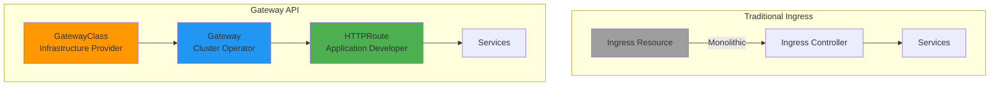
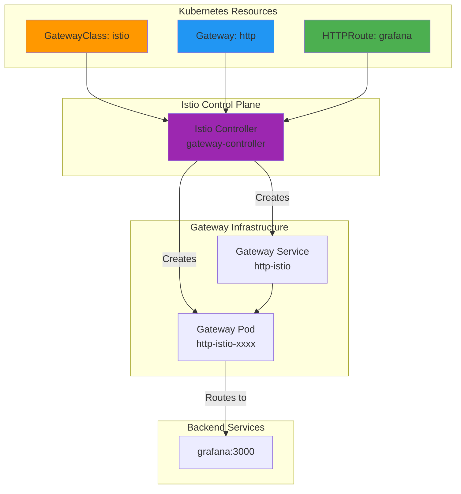

# Gateway API: Kubernetes Ingress Evolution

**Version**: 1.0
**Last Updated**: 2025-11-12
**Status**: Production Ready
**Audience**: Platform Engineers, Developers

Complete guide to Kubernetes Gateway API for routing external traffic to Kagenti platform services with Istio integration.

---

## Table of Contents

- [Overview](#overview)
- [What is Gateway API?](#what-is-gateway-api)
- [Gateway API vs Ingress](#gateway-api-vs-ingress)
- [Core Resources](#core-resources)
- [Istio Integration](#istio-integration)
- [Gateway Configuration](#gateway-configuration)
- [HTTPRoute Configuration](#httproute-configuration)
- [TLS and HTTPS](#tls-and-https)
- [Cross-Namespace Routing](#cross-namespace-routing)
- [Advanced Routing](#advanced-routing)
- [Troubleshooting](#troubleshooting)
- [Alternatives](#alternatives)
- [Next Steps](#next-steps)
- [References](#references)

---

## Overview

**Purpose**: Provide modern, expressive, and role-oriented API for routing external HTTP/HTTPS traffic to Kubernetes services.

**What You Get**:
- ✅ Type-safe routing for HTTP, HTTPS, gRPC, TCP, UDP
- ✅ Role-based resource management (Infrastructure Provider, Cluster Operator, Application Developer)
- ✅ Cross-namespace routing with explicit grants
- ✅ TLS termination with SNI-based routing
- ✅ HTTP to HTTPS automatic redirection
- ✅ Header-based routing and request/response manipulation
- ✅ Traffic splitting and canary deployments
- ✅ Vendor-neutral specification (Istio, Contour, NGINX, etc.)

**Key Benefit**: Gateway API is the **next generation** of Kubernetes Ingress, designed from the ground up to be expressive, extensible, and role-oriented.

**Source**: Based on [Gateway API Documentation](https://gateway-api.sigs.k8s.io/)

---

## What is Gateway API?

**Gateway API** is an official Kubernetes project for L4 and L7 routing, representing "the next generation of Kubernetes Ingress, Load Balancing, and Service Mesh APIs."

### Key Characteristics



**Design Principles**:
1. **Role-Oriented**: Separates concerns for Infrastructure Providers, Cluster Operators, and Application Developers
2. **Expressive**: Protocol-specific routing (HTTPRoute, GRPCRoute, TCPRoute, UDPRoute)
3. **Extensible**: Custom resources and extension points
4. **Portable**: Vendor-neutral specification supported by multiple implementations

**Source**: [Gateway API Concepts](https://gateway-api.sigs.k8s.io/concepts/api-overview/)

---

## Gateway API vs Ingress

| Feature | Ingress | Gateway API |
|---------|---------|-------------|
| **Resource Model** | Single resource | Multiple resources (GatewayClass, Gateway, Route) |
| **Role Separation** | ❌ Mixed concerns | ✅ Infrastructure, Cluster, Application |
| **Protocol Support** | HTTP/HTTPS only | HTTP, HTTPS, gRPC, TCP, UDP, TLS |
| **Header Routing** | Limited | ✅ Full support (match, modify) |
| **Traffic Splitting** | Implementation-specific | ✅ Native support |
| **Cross-Namespace** | ❌ Limited | ✅ ReferenceGrant for explicit control |
| **TLS Configuration** | Basic | ✅ Per-listener, SNI-based |
| **Maturity** | GA (Kubernetes 1.19+) | Standard Channel (v1.3.0) |
| **Backend Types** | Service only | ✅ Service, ServiceImport, custom |

**Recommendation**: Use **Gateway API** for new deployments. Ingress is in maintenance mode.

**Source**: [Gateway API FAQ](https://gateway-api.sigs.k8s.io/faq/)

---

## Core Resources

### 1. GatewayClass

**What**: Cluster-scoped resource defining a class of Gateways with common configuration.

**Who Manages**: Infrastructure Provider (cloud provider, cluster admin)

**Purpose**: Abstraction layer for gateway infrastructure (similar to StorageClass, IngressClass)

```yaml
apiVersion: gateway.networking.k8s.io/v1
kind: GatewayClass
metadata:
  name: istio
spec:
  controllerName: istio.io/gateway-controller
  description: "Istio-based Gateway"
```

**Example**: Kagenti uses `istio` GatewayClass provided by Istio.

**Source**: [GatewayClass Specification](https://gateway-api.sigs.k8s.io/api-types/gatewayclass/)

---

### 2. Gateway

**What**: Namespace-scoped resource describing how traffic can be translated to Services.

**Who Manages**: Cluster Operator

**Purpose**: Defines a load balancer configuration with listeners for different protocols/ports.

```yaml
apiVersion: gateway.networking.k8s.io/v1
kind: Gateway
metadata:
  name: http
  namespace: kagenti-system
spec:
  gatewayClassName: istio
  listeners:
  # HTTP listener (port 80)
  - name: http
    port: 80
    protocol: HTTP
    allowedRoutes:
      namespaces:
        from: Selector
        selector:
          matchLabels:
            shared-gateway-access: "true"

  # HTTPS listener (port 443)
  - name: https
    hostname: "*.localtest.me"
    port: 443
    protocol: HTTPS
    tls:
      mode: Terminate
      certificateRefs:
      - name: localtest-me-tls
        kind: Secret
    allowedRoutes:
      namespaces:
        from: Selector
        selector:
          matchLabels:
            shared-gateway-access: "true"
```

**Key Concepts**:
- **Listeners**: Define protocol, port, hostname, TLS configuration
- **allowedRoutes**: Controls which namespaces can attach routes
- **Automatic Infrastructure**: Istio automatically creates Deployment and Service for this Gateway

**Source**: [Gateway Specification](https://gateway-api.sigs.k8s.io/api-types/gateway/)

---

### 3. HTTPRoute

**What**: Namespace-scoped resource defining HTTP routing rules.

**Who Manages**: Application Developer

**Purpose**: Routes HTTP requests to backend services based on hostname, path, headers, etc.

```yaml
apiVersion: gateway.networking.k8s.io/v1
kind: HTTPRoute
metadata:
  name: grafana
  namespace: observability
spec:
  parentRefs:
  - name: http
    namespace: kagenti-system
    sectionName: https  # Attach to HTTPS listener
  hostnames:
  - "grafana.localtest.me"
  rules:
  - matches:
    - path:
        type: PathPrefix
        value: /
    backendRefs:
    - name: grafana
      port: 3000
```

**Key Concepts**:
- **parentRefs**: Attach route to Gateway listener(s)
- **hostnames**: DNS names for routing (SNI-based for HTTPS)
- **rules**: Matching logic and backend selection
- **Cross-Namespace**: Route in `observability` namespace can attach to Gateway in `kagenti-system`

**Source**: [HTTPRoute Specification](https://gateway-api.sigs.k8s.io/api-types/httproute/)

---

### 4. ReferenceGrant

**What**: Namespace-scoped resource granting cross-namespace references.

**Who Manages**: Namespace owner

**Purpose**: Explicit permission for resources in other namespaces to reference resources in this namespace.

```yaml
apiVersion: gateway.networking.k8s.io/v1beta1
kind: ReferenceGrant
metadata:
  name: allow-gateway-routes
  namespace: kagenti-system  # Where Gateway lives
spec:
  from:
  - group: gateway.networking.k8s.io
    kind: HTTPRoute
    namespace: observability  # Allow routes from this namespace
  to:
  - group: ""
    kind: Service
```

**Security Model**: Opt-in cross-namespace references prevent unauthorized access.

**Source**: [ReferenceGrant Specification](https://gateway-api.sigs.k8s.io/api-types/referencegrant/)

---

## Istio Integration

### How Istio Implements Gateway API

Istio provides native support for Gateway API as an alternative to its own Gateway/VirtualService resources.

**Architecture**:



**Key Features**:
1. **Automatic Infrastructure**: Istio creates Gateway Deployment and Service automatically
2. **Ambient Mesh Integration**: Gateway pods use ztunnel for L4 encryption
3. **Standard Compliance**: Uses Gateway API v1.3.0 (Standard Channel)
4. **Istio Features**: Circuit breaking, retries, timeouts via Istio CRDs

**Source**: [Istio Gateway API Documentation](https://istio.io/latest/docs/tasks/traffic-management/ingress/gateway-api/)

---

### GatewayClass Configuration

Kagenti uses Istio's default GatewayClass:

```yaml
apiVersion: gateway.networking.k8s.io/v1
kind: GatewayClass
metadata:
  name: istio
spec:
  controllerName: istio.io/gateway-controller
```

**Installed by**: Istio Helm chart

**Customization**: Can configure gateway defaults via ConfigMap with label `gateway.istio.io/defaults-for-class: istio`

**Source**: [Istio GatewayClass](https://istio.io/latest/docs/tasks/traffic-management/ingress/gateway-api/#automated-deployment)

---

## Gateway Configuration

### Kagenti Platform Gateway

Kagenti uses a shared Gateway in `kagenti-system` namespace for all platform services:

**File**: `components/01-platform/gateway/gateway-https.yaml`

```yaml
apiVersion: gateway.networking.k8s.io/v1
kind: Gateway
metadata:
  name: http
  namespace: kagenti-system
spec:
  gatewayClassName: istio
  listeners:
  # HTTP listener (port 80)
  - name: http
    port: 80
    protocol: HTTP
    allowedRoutes:
      namespaces:
        from: Selector
        selector:
          matchLabels:
            shared-gateway-access: "true"

  # HTTPS listener (port 443)
  - name: https
    hostname: "*.localtest.me"
    port: 443
    protocol: HTTPS
    tls:
      mode: Terminate
      certificateRefs:
      - name: localtest-me-tls
        kind: Secret
    allowedRoutes:
      namespaces:
        from: Selector
        selector:
          matchLabels:
            shared-gateway-access: "true"
```

**Design Decisions**:
- **Shared Gateway**: Single Gateway for all platform services (multi-tenant)
- **Wildcard Hostname**: `*.localtest.me` allows any subdomain
- **Namespace Selector**: Only namespaces with label `shared-gateway-access: "true"` can attach routes
- **TLS Termination**: Gateway terminates TLS, backend traffic uses Istio mTLS

**Verify Gateway**:
```bash
kubectl get gateway -n kagenti-system

# Expected output:
# NAME   CLASS   ADDRESS         PROGRAMMED   AGE
# http   istio   172.18.255.200  True         5m
```

**Source**: [Gateway Specification](https://gateway-api.sigs.k8s.io/api-types/gateway/)

---

### Listener Configuration

**HTTP Listener** (port 80):
```yaml
- name: http
  port: 80
  protocol: HTTP
  allowedRoutes:
    namespaces:
      from: Selector
      selector:
        matchLabels:
          shared-gateway-access: "true"
```

**Purpose**: Accept HTTP traffic on port 80 (typically for HTTP → HTTPS redirect)

---

**HTTPS Listener** (port 443):
```yaml
- name: https
  hostname: "*.localtest.me"
  port: 443
  protocol: HTTPS
  tls:
    mode: Terminate
    certificateRefs:
    - name: localtest-me-tls
      kind: Secret
  allowedRoutes:
    namespaces:
      from: Selector
      selector:
        matchLabels:
          shared-gateway-access: "true"
```

**Purpose**: Accept HTTPS traffic, terminate TLS with wildcard certificate

**Certificate**: `localtest-me-tls` Secret in same namespace (`kagenti-system`)

---

### Gateway Service Exposure

Istio automatically creates a LoadBalancer Service for the Gateway:

```bash
kubectl get svc -n kagenti-system http-istio

# Expected output:
# NAME        TYPE           CLUSTER-IP      EXTERNAL-IP      PORT(S)
# http-istio  LoadBalancer   10.96.100.50    172.18.255.200   80:30080/TCP,443:30443/TCP
```

**For Kind clusters**, we also create a NodePort service for host access:

```yaml
apiVersion: v1
kind: Service
metadata:
  name: https-istio-np
  namespace: kagenti-system
spec:
  type: NodePort
  ports:
  - port: 443
    targetPort: 443
    nodePort: 30443  # Mapped to host port 9443 via Kind config
    protocol: TCP
    name: https
  selector:
    gateway.networking.k8s.io/gateway-name: http
```

**Access from host**:
- HTTPS: `https://grafana.localtest.me:9443` (Kind port mapping: 9443 → NodePort 30443 → Gateway 443)
- HTTP: `http://grafana.localtest.me:8080` (Kind port mapping: 8080 → NodePort 30080 → Gateway 80)

**Source**: [Istio Gateway Deployment](https://istio.io/latest/docs/tasks/traffic-management/ingress/gateway-api/#automated-deployment)

---

## HTTPRoute Configuration

### Basic HTTPRoute

Route traffic to Grafana service:

**File**: `components/02-observability/grafana/httproute.yaml`

```yaml
apiVersion: gateway.networking.k8s.io/v1
kind: HTTPRoute
metadata:
  name: grafana
  namespace: observability
  labels:
    shared-gateway-access: "true"  # Required for cross-namespace attachment
spec:
  parentRefs:
  - name: http
    namespace: kagenti-system
    sectionName: https  # Attach to HTTPS listener
  hostnames:
  - "grafana.localtest.me"
  rules:
  - matches:
    - path:
        type: PathPrefix
        value: /
    backendRefs:
    - name: grafana
      port: 3000
```

**Key Concepts**:
- **parentRefs**: Attach to Gateway in different namespace
- **sectionName**: Target specific listener (`https` vs `http`)
- **hostnames**: SNI-based routing for HTTPS
- **matches**: Path prefix matching (all paths under `/`)
- **backendRefs**: Route to Service in same namespace

**Verify HTTPRoute**:
```bash
kubectl get httproute -n observability grafana

# Check status
kubectl describe httproute -n observability grafana

# Expected:
# Status:
#   Parents:
#     Conditions:
#       Status: True
#       Type:   Accepted
#       Status: True
#       Type:   ResolvedRefs
```

**Test access**:
```bash
curl -k https://grafana.localtest.me:9443/
# Expected: Grafana login page
```

**Source**: [HTTPRoute Specification](https://gateway-api.sigs.k8s.io/guides/http-routing/)

---

### HTTP to HTTPS Redirect

Automatically redirect HTTP requests to HTTPS:

```yaml
apiVersion: gateway.networking.k8s.io/v1
kind: HTTPRoute
metadata:
  name: grafana-http-redirect
  namespace: observability
spec:
  parentRefs:
  - name: http
    namespace: kagenti-system
    sectionName: http  # Attach to HTTP listener
  hostnames:
  - "grafana.localtest.me"
  rules:
  - filters:
    - type: RequestRedirect
      requestRedirect:
        scheme: https
        port: 9443  # Redirect to host HTTPS port
        statusCode: 301
```

**How it works**:
1. User visits `http://grafana.localtest.me:8080/`
2. Gateway returns `301 Moved Permanently` to `https://grafana.localtest.me:9443/`
3. Browser follows redirect to HTTPS

**Test redirect**:
```bash
curl -I http://grafana.localtest.me:8080/

# Expected:
# HTTP/1.1 301 Moved Permanently
# location: https://grafana.localtest.me:9443/
```

**Source**: [HTTPRoute Redirects](https://gateway-api.sigs.k8s.io/guides/http-redirect-rewrite/)

---

### Path-Based Routing

Route different paths to different services:

```yaml
apiVersion: gateway.networking.k8s.io/v1
kind: HTTPRoute
metadata:
  name: multi-service
  namespace: default
spec:
  parentRefs:
  - name: http
    namespace: kagenti-system
  hostnames:
  - "app.localtest.me"
  rules:
  # Route /api/* to API service
  - matches:
    - path:
        type: PathPrefix
        value: /api/
    backendRefs:
    - name: api-service
      port: 8080

  # Route /ui/* to UI service
  - matches:
    - path:
        type: PathPrefix
        value: /ui/
    backendRefs:
    - name: ui-service
      port: 3000

  # Default route (/) to landing page
  - matches:
    - path:
        type: PathPrefix
        value: /
    backendRefs:
    - name: landing-page
      port: 80
```

**Matching Order**: Most specific match wins (longest path prefix first)

**Source**: [HTTPRoute Path Matching](https://gateway-api.sigs.k8s.io/guides/http-routing/#path-matching)

---

### Header-Based Routing

Route based on HTTP headers (canary deployments):

```yaml
apiVersion: gateway.networking.k8s.io/v1
kind: HTTPRoute
metadata:
  name: canary-routing
  namespace: default
spec:
  parentRefs:
  - name: http
    namespace: kagenti-system
  hostnames:
  - "app.localtest.me"
  rules:
  # Route requests with header "env: canary" to canary version
  - matches:
    - headers:
      - type: Exact
        name: env
        value: canary
    backendRefs:
    - name: app-canary
      port: 8080

  # Default route to stable version
  - backendRefs:
    - name: app-stable
      port: 8080
```

**Test canary routing**:
```bash
# Regular request → stable
curl https://app.localtest.me:9443/

# With header → canary
curl -H "env: canary" https://app.localtest.me:9443/
```

**Source**: [HTTPRoute Header Matching](https://gateway-api.sigs.k8s.io/guides/http-routing/#header-matching)

---

### Traffic Splitting

Split traffic between multiple backends (blue/green, canary):

```yaml
apiVersion: gateway.networking.k8s.io/v1
kind: HTTPRoute
metadata:
  name: traffic-split
  namespace: default
spec:
  parentRefs:
  - name: http
    namespace: kagenti-system
  hostnames:
  - "app.localtest.me"
  rules:
  - backendRefs:
    # 90% traffic to stable
    - name: app-stable
      port: 8080
      weight: 90

    # 10% traffic to canary
    - name: app-canary
      port: 8080
      weight: 10
```

**Use Cases**:
- Canary deployments (5-10% to new version)
- A/B testing (50/50 split)
- Blue/green migration (gradual shift from 100/0 to 0/100)

**Source**: [HTTPRoute Traffic Splitting](https://gateway-api.sigs.k8s.io/guides/traffic-splitting/)

---

### Request Header Manipulation

Add, modify, or remove headers:

```yaml
apiVersion: gateway.networking.k8s.io/v1
kind: HTTPRoute
metadata:
  name: header-manipulation
  namespace: default
spec:
  parentRefs:
  - name: http
    namespace: kagenti-system
  hostnames:
  - "app.localtest.me"
  rules:
  - filters:
    # Add headers to request
    - type: RequestHeaderModifier
      requestHeaderModifier:
        add:
        - name: X-Environment
          value: production
        - name: X-Request-ID
          value: "{{.Request.ID}}"
        set:
        - name: X-Forwarded-Proto
          value: https
        remove:
        - X-Internal-Secret

    # Add headers to response
    - type: ResponseHeaderModifier
      responseHeaderModifier:
        add:
        - name: X-Cache-Status
          value: HIT
        - name: Strict-Transport-Security
          value: max-age=31536000
    backendRefs:
    - name: app-service
      port: 8080
```

**Common Use Cases**:
- Add trace IDs for observability
- Set security headers (HSTS, CSP)
- Remove internal headers before sending to client
- Add environment/region information

**Source**: [HTTPRoute Header Modifiers](https://gateway-api.sigs.k8s.io/guides/http-header-modifier/)

---

## TLS and HTTPS

### TLS Termination

Gateway terminates TLS using certificate from Kubernetes Secret:

```yaml
apiVersion: gateway.networking.k8s.io/v1
kind: Gateway
metadata:
  name: http
  namespace: kagenti-system
spec:
  listeners:
  - name: https
    hostname: "*.localtest.me"
    port: 443
    protocol: HTTPS
    tls:
      mode: Terminate  # Decrypt HTTPS at gateway
      certificateRefs:
      - name: localtest-me-tls
        kind: Secret  # Kubernetes TLS Secret
```

**Certificate Secret Format**:
```yaml
apiVersion: v1
kind: Secret
metadata:
  name: localtest-me-tls
  namespace: kagenti-system
type: kubernetes.io/tls
data:
  tls.crt: <base64-encoded-certificate>
  tls.key: <base64-encoded-private-key>
```

**Create certificate with cert-manager** (recommended):
```yaml
apiVersion: cert-manager.io/v1
kind: Certificate
metadata:
  name: localtest-me
  namespace: kagenti-system
spec:
  secretName: localtest-me-tls
  dnsNames:
  - "*.localtest.me"
  - localtest.me
  issuerRef:
    name: selfsigned-issuer
    kind: ClusterIssuer
```

**Source**: [Gateway API TLS](https://gateway-api.sigs.k8s.io/guides/tls/)

---

### SNI-Based Routing

Route HTTPS traffic based on Server Name Indication (SNI):

```yaml
apiVersion: gateway.networking.k8s.io/v1
kind: Gateway
metadata:
  name: multi-domain
  namespace: kagenti-system
spec:
  listeners:
  # Listener for *.example.com
  - name: example-com
    hostname: "*.example.com"
    port: 443
    protocol: HTTPS
    tls:
      mode: Terminate
      certificateRefs:
      - name: example-com-tls

  # Listener for *.company.com
  - name: company-com
    hostname: "*.company.com"
    port: 443
    protocol: HTTPS
    tls:
      mode: Terminate
      certificateRefs:
      - name: company-com-tls
```

**How it works**:
1. Client sends TLS ClientHello with SNI hostname (e.g., `grafana.example.com`)
2. Gateway selects listener matching hostname pattern
3. Gateway presents correct certificate from Secret
4. HTTPRoute matches hostname to route to backend

**Source**: [TLS Configuration](https://gateway-api.sigs.k8s.io/guides/tls/#tls-configuration)

---

### Backend TLS (Upstream Encryption)

**Default**: Kagenti uses Istio mTLS for backend encryption (automatic)

**Explicit Backend TLS** (if needed):
```yaml
apiVersion: gateway.networking.k8s.io/v1alpha2
kind: BackendTLSPolicy
metadata:
  name: backend-tls
  namespace: default
spec:
  targetRef:
    group: ""
    kind: Service
    name: secure-backend
  tls:
    mode: Terminate
    certificateRefs:
    - name: backend-ca-cert
      group: ""
      kind: ConfigMap
```

**Note**: Istio ambient mesh handles mTLS automatically via ztunnel - explicit BackendTLSPolicy rarely needed.

**Source**: [Backend TLS Policy](https://gateway-api.sigs.k8s.io/guides/tls/#backend-tls)

---

## Cross-Namespace Routing

### Namespace Selector (Kagenti Pattern)

**Gateway configuration** (`kagenti-system` namespace):
```yaml
apiVersion: gateway.networking.k8s.io/v1
kind: Gateway
metadata:
  name: http
  namespace: kagenti-system
spec:
  listeners:
  - name: https
    allowedRoutes:
      namespaces:
        from: Selector
        selector:
          matchLabels:
            shared-gateway-access: "true"
```

**Namespace labeling**:
```bash
kubectl label namespace observability shared-gateway-access=true
kubectl label namespace kagenti-system shared-gateway-access=true
```

**HTTPRoute in different namespace**:
```yaml
apiVersion: gateway.networking.k8s.io/v1
kind: HTTPRoute
metadata:
  name: grafana
  namespace: observability  # Different from Gateway namespace
spec:
  parentRefs:
  - name: http
    namespace: kagenti-system  # Cross-namespace reference
```

**Verify**:
```bash
kubectl get httproute -A

# NAMESPACE       NAME      HOSTNAMES                  AGE
# observability   grafana   ["grafana.localtest.me"]   5m
```

**Source**: [Cross-Namespace Routing](https://gateway-api.sigs.k8s.io/guides/multiple-ns/)

---

### ReferenceGrant (Explicit Permission)

For cross-namespace backend references, use ReferenceGrant:

```yaml
# In namespace where Service lives
apiVersion: gateway.networking.k8s.io/v1beta1
kind: ReferenceGrant
metadata:
  name: allow-routes-from-platform
  namespace: observability
spec:
  from:
  - group: gateway.networking.k8s.io
    kind: HTTPRoute
    namespace: kagenti-system
  to:
  - group: ""
    kind: Service
```

**Use Case**: HTTPRoute in `kagenti-system` needs to route to Service in `observability` namespace.

**Without ReferenceGrant**: Cross-namespace Service references are denied for security.

**Source**: [ReferenceGrant](https://gateway-api.sigs.k8s.io/api-types/referencegrant/)

---

## Advanced Routing

### URL Rewriting

Rewrite request paths before forwarding to backend:

```yaml
apiVersion: gateway.networking.k8s.io/v1
kind: HTTPRoute
metadata:
  name: url-rewrite
  namespace: default
spec:
  parentRefs:
  - name: http
    namespace: kagenti-system
  hostnames:
  - "api.localtest.me"
  rules:
  # /v1/* → /api/v1/*
  - matches:
    - path:
        type: PathPrefix
        value: /v1/
    filters:
    - type: URLRewrite
      urlRewrite:
        path:
          type: ReplacePrefixMatch
          replacePrefixMatch: /api/v1/
    backendRefs:
    - name: api-service
      port: 8080
```

**Example**:
- Client request: `GET https://api.localtest.me/v1/users`
- Backend receives: `GET /api/v1/users`

**Source**: [URL Rewrite](https://gateway-api.sigs.k8s.io/guides/http-redirect-rewrite/#rewrite)

---

### Request Mirroring

Send copy of traffic to secondary backend (testing, analytics):

```yaml
apiVersion: gateway.networking.k8s.io/v1
kind: HTTPRoute
metadata:
  name: traffic-mirror
  namespace: default
spec:
  parentRefs:
  - name: http
    namespace: kagenti-system
  hostnames:
  - "app.localtest.me"
  rules:
  - filters:
    - type: RequestMirror
      requestMirror:
        backendRef:
          name: analytics-service  # Mirror traffic here
          port: 8080
    backendRefs:
    - name: production-service  # Primary backend
      port: 8080
```

**Characteristics**:
- Mirrored requests are fire-and-forget (response ignored)
- Does not affect client response
- Useful for testing new versions with production traffic

**Source**: [Request Mirroring](https://gateway-api.sigs.k8s.io/guides/traffic-splitting/#request-mirroring)

---

### Timeouts and Retries

Configure timeouts and retries at HTTPRoute level:

```yaml
apiVersion: gateway.networking.k8s.io/v1
kind: HTTPRoute
metadata:
  name: resilient-route
  namespace: default
spec:
  parentRefs:
  - name: http
    namespace: kagenti-system
  rules:
  - timeouts:
      request: 10s  # Total request timeout
      backendRequest: 5s  # Backend connection timeout
    backendRefs:
    - name: api-service
      port: 8080
```

**Note**: Advanced retry configuration requires Istio-specific resources:

```yaml
apiVersion: networking.istio.io/v1beta1
kind: VirtualService
metadata:
  name: api-retries
spec:
  hosts:
  - api-service
  http:
  - retries:
      attempts: 3
      perTryTimeout: 2s
      retryOn: 5xx,reset,connect-failure
    route:
    - destination:
        host: api-service
```

**Source**: [Istio Retries](https://istio.io/latest/docs/reference/config/networking/virtual-service/#HTTPRetry)

---

## Troubleshooting

### Issue: HTTPRoute Not Accepting Traffic

**Symptoms**: HTTPRoute exists but traffic doesn't reach backend

**Diagnosis**:
```bash
# Check HTTPRoute status
kubectl describe httproute -n observability grafana

# Look for status conditions:
# - Accepted: Should be True
# - ResolvedRefs: Should be True
```

**Common Causes**:

1. **Namespace not labeled**:
   ```bash
   kubectl get namespace observability --show-labels
   # Should have: shared-gateway-access=true

   # Fix:
   kubectl label namespace observability shared-gateway-access=true
   ```

2. **Wrong sectionName**:
   ```yaml
   parentRefs:
   - name: http
     namespace: kagenti-system
     sectionName: https  # Must match listener name in Gateway
   ```

3. **Certificate missing**:
   ```bash
   kubectl get secret -n kagenti-system localtest-me-tls
   # If missing, check cert-manager Certificate resource
   ```

---

### Issue: TLS Certificate Not Working

**Symptoms**: Browser shows certificate error

**Diagnosis**:
```bash
# Check certificate Secret exists
kubectl get secret -n kagenti-system localtest-me-tls

# Inspect certificate
kubectl get secret -n kagenti-system localtest-me-tls -o jsonpath='{.data.tls\.crt}' | base64 -d | openssl x509 -text -noout

# Check cert-manager Certificate
kubectl get certificate -n kagenti-system
kubectl describe certificate -n kagenti-system localtest-me
```

**Fix**:
```bash
# Recreate certificate via cert-manager
kubectl delete certificate -n kagenti-system localtest-me
kubectl apply -f components/infrastructure/certificates/localtest-me.yaml

# Wait for issuance
kubectl wait --for=condition=ready certificate/localtest-me -n kagenti-system --timeout=60s
```

---

### Issue: Cross-Namespace Route Fails

**Symptoms**: HTTPRoute status shows `ResolvedRefs: False`

**Diagnosis**:
```bash
kubectl describe httproute -n observability grafana

# Error message:
# "Gateway does not allow routes from this namespace"
```

**Fix**:
```bash
# Option 1: Label namespace
kubectl label namespace observability shared-gateway-access=true

# Option 2: Create ReferenceGrant (if needed for Service refs)
kubectl apply -f - <<EOF
apiVersion: gateway.networking.k8s.io/v1beta1
kind: ReferenceGrant
metadata:
  name: allow-routes
  namespace: kagenti-system
spec:
  from:
  - group: gateway.networking.k8s.io
    kind: HTTPRoute
    namespace: observability
  to:
  - group: ""
    kind: Service
EOF
```

---

### Issue: Gateway Not Getting External IP

**Symptoms**: Gateway shows `ADDRESS: <pending>`

**Diagnosis**:
```bash
kubectl get gateway -n kagenti-system http

# NAME   CLASS   ADDRESS    PROGRAMMED   AGE
# http   istio   <pending>  Unknown      5m
```

**Common Causes**:

1. **MetalLB not configured** (Kind clusters):
   ```bash
   kubectl get ipaddresspool -n metallb-system
   # Should show IP pool

   # Fix: Deploy MetalLB
   kubectl apply -f https://raw.githubusercontent.com/metallb/metallb/v0.14.8/config/manifests/metallb-native.yaml
   ```

2. **Istio gateway pod not running**:
   ```bash
   kubectl get pods -n kagenti-system -l gateway.networking.k8s.io/gateway-name=http

   # If no pods, check Istio installation
   kubectl get pods -n istio-system
   ```

---

## Alternatives

### Alternative 1: Kubernetes Ingress

**Pros**:
- Mature and stable (GA since Kubernetes 1.19)
- Widely supported by many controllers
- Simple for basic HTTP routing

**Cons**:
- Limited expressiveness (HTTP/HTTPS only)
- No role separation (single resource)
- No native traffic splitting
- Limited header manipulation
- Cross-namespace routing complex

**When to Use**: Legacy applications, simple HTTP routing only

**Source**: [Kubernetes Ingress](https://kubernetes.io/docs/concepts/services-networking/ingress/)

---

### Alternative 2: Istio VirtualService + Gateway

**Pros**:
- More features than Gateway API (currently)
- Advanced traffic management (circuit breaking, fault injection)
- Native Istio integration

**Cons**:
- Istio-specific (vendor lock-in)
- More complex resource model
- Istio is moving towards Gateway API as default

**When to Use**: Need Istio-specific features not yet in Gateway API

**Istio Recommendation**: "Gateway API is the future of traffic management in Istio"

**Source**: [Istio Traffic Management](https://istio.io/latest/docs/tasks/traffic-management/)

---

### Alternative 3: Contour (Envoy-based)

**Pros**:
- Lightweight Envoy-based ingress controller
- Supports Gateway API + Ingress
- Good performance

**Cons**:
- Smaller community than Istio or NGINX
- Fewer features than full service mesh

**When to Use**: Need Envoy without full service mesh complexity

**Source**: [Project Contour](https://projectcontour.io/)

---

### Alternative 4: NGINX Ingress Controller

**Pros**:
- Very mature and battle-tested
- High performance
- Large community
- Supports Gateway API (experimental)

**Cons**:
- Gateway API support not yet GA
- Less Kubernetes-native than Istio

**When to Use**: Need proven stability, don't need service mesh

**Source**: [NGINX Ingress Controller](https://kubernetes.github.io/ingress-nginx/)

---

## Next Steps

### For Development

1. **Create HTTPRoute for your service**:
   ```yaml
   apiVersion: gateway.networking.k8s.io/v1
   kind: HTTPRoute
   metadata:
     name: my-service
     namespace: my-namespace
   spec:
     parentRefs:
     - name: http
       namespace: kagenti-system
       sectionName: https
     hostnames:
     - "myapp.localtest.me"
     rules:
     - backendRefs:
       - name: my-service
         port: 8080
   ```

2. **Label your namespace**:
   ```bash
   kubectl label namespace my-namespace shared-gateway-access=true
   ```

3. **Test access**:
   ```bash
   curl -k https://myapp.localtest.me:9443/
   ```

### For Production

1. **Review Production Considerations**:
   - Use real TLS certificates (Let's Encrypt via cert-manager)
   - Configure rate limiting (Istio EnvoyFilter)
   - Set up WAF (Web Application Firewall)
   - Monitor Gateway metrics (Prometheus + Grafana)

2. **Learn Advanced Topics**:
   - [cert-manager](./cert-manager.md) for automatic TLS certificates
   - [Istio Service Mesh](../02-service-mesh/istio.md) for mTLS and advanced traffic management
   - [Keycloak SSO](../03-authentication/keycloak.md) for authentication

---

## References

### Official Documentation

- **Gateway API**: [gateway-api.sigs.k8s.io](https://gateway-api.sigs.k8s.io/)
- **Gateway API Concepts**: [API Overview](https://gateway-api.sigs.k8s.io/concepts/api-overview/)
- **HTTPRoute Specification**: [HTTPRoute](https://gateway-api.sigs.k8s.io/api-types/httproute/)
- **GatewayClass Specification**: [GatewayClass](https://gateway-api.sigs.k8s.io/api-types/gatewayclass/)
- **Istio Gateway API**: [Istio Docs](https://istio.io/latest/docs/tasks/traffic-management/ingress/gateway-api/)

### Guides and Tutorials

- **HTTP Routing**: [gateway-api.sigs.k8s.io/guides/http-routing](https://gateway-api.sigs.k8s.io/guides/http-routing/)
- **TLS Configuration**: [gateway-api.sigs.k8s.io/guides/tls](https://gateway-api.sigs.k8s.io/guides/tls/)
- **Traffic Splitting**: [gateway-api.sigs.k8s.io/guides/traffic-splitting](https://gateway-api.sigs.k8s.io/guides/traffic-splitting/)
- **Cross-Namespace Routing**: [gateway-api.sigs.k8s.io/guides/multiple-ns](https://gateway-api.sigs.k8s.io/guides/multiple-ns/)

### Implementations

- **Istio**: [istio.io](https://istio.io/)
- **Contour**: [projectcontour.io](https://projectcontour.io/)
- **NGINX**: [kubernetes.github.io/ingress-nginx](https://kubernetes.github.io/ingress-nginx/)
- **Envoy Gateway**: [gateway.envoyproxy.io](https://gateway.envoyproxy.io/)

### Internal Documentation

- **Main README**: [../../README.md](../../README.md)
- **Quick Start Guide**: [../00-getting-started/quick-start.md](../00-getting-started/quick-start.md)
- **Kubernetes & Kind**: [./kubernetes.md](./kubernetes.md)
- **Istio Service Mesh**: [../02-service-mesh/istio.md](../02-service-mesh/istio.md)
- **Keycloak SSO**: [../03-authentication/keycloak.md](../03-authentication/keycloak.md)

### Repository

- **GitHub**: [Ladas/kagenti-demo-deployment](https://github.com/Ladas/kagenti-demo-deployment)
- **Gateway Configuration**: `components/01-platform/gateway/`
- **HTTPRoute Examples**: `components/*/httproute.yaml`

---

**Last Updated**: 2025-11-12
**Document Version**: 1.0
**Maintained By**: Platform Engineering Team
**License**: Apache 2.0
