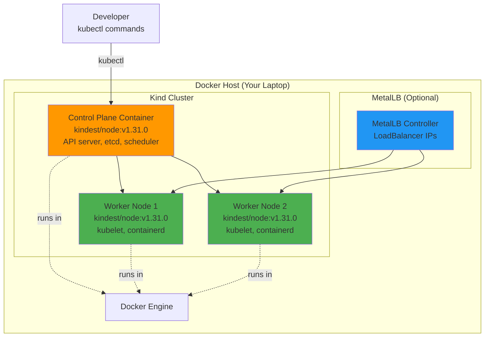

# Kubernetes & Kind: Local Development Setup

**Version**: 1.0
**Last Updated**: 2025-11-11
**Status**: Production Ready
**Audience**: Platform Engineers, Developers

Complete guide to Kubernetes fundamentals and Kind (Kubernetes in Docker) for local development of the Kagenti platform.

---

## Table of Contents

- [Overview](#overview)
- [What is Kubernetes?](#what-is-kubernetes)
- [What is Kind?](#what-is-kind)
- [Installation](#installation)
- [Kind Cluster Configuration](#kind-cluster-configuration)
- [Cluster Management](#cluster-management)
- [Networking](#networking)
- [Storage](#storage)
- [Troubleshooting](#troubleshooting)
- [Alternatives](#alternatives)
- [Next Steps](#next-steps)
- [References](#references)

---

## Overview

**Purpose**: Provide a local Kubernetes environment for developing and testing the Kagenti platform without requiring cloud infrastructure.

**What You Get**:
- ✅ Full Kubernetes cluster running in Docker containers
- ✅ Multi-node cluster support (control-plane + workers)
- ✅ LoadBalancer support via MetalLB
- ✅ Port mapping for accessing services locally
- ✅ Fast cluster creation and deletion (< 2 minutes)
- ✅ Identical API to production Kubernetes
- ✅ Support for all Kubernetes features (CRDs, Operators, etc.)

**Key Benefit**: Kind provides a production-like Kubernetes environment on your laptop, enabling rapid iteration without cloud costs.

**Source**: Based on [Kind Documentation](https://kind.sigs.k8s.io/)

---

## What is Kubernetes?

**Kubernetes** (K8s) is an open-source container orchestration platform originally developed by Google, now maintained by the Cloud Native Computing Foundation (CNCF).

### Core Concepts

| Concept | Description | Example |
|---------|-------------|---------|
| **Pod** | Smallest deployable unit (1+ containers) | Grafana container running |
| **Deployment** | Manages replicated pods with rolling updates | Grafana deployment with 2 replicas |
| **Service** | Stable network endpoint for pods | `grafana.observability:3000` |
| **Namespace** | Virtual cluster for resource isolation | `observability`, `team1` |
| **ConfigMap** | Configuration data (non-sensitive) | Grafana datasources config |
| **Secret** | Sensitive data (passwords, tokens) | Database credentials |
| **PersistentVolume** | Storage abstraction | PostgreSQL data volume |
| **Ingress/Gateway** | External access to services | HTTPS access to Grafana |

**Source**: [Kubernetes Concepts](https://kubernetes.io/docs/concepts/)

### Why Kubernetes?

**Without Kubernetes**:
```
Manual deployment:
- SSH to each server
- Docker run commands
- Manual load balancing
- Manual health checks
- No automatic recovery
❌ Operationally complex at scale
```

**With Kubernetes**:
```
Declarative deployment:
- kubectl apply -f deployment.yaml
- Automatic scheduling
- Built-in load balancing
- Self-healing (automatic restart)
- Rolling updates
✅ Scalable and reliable
```

**Source**: [Why Kubernetes](https://kubernetes.io/docs/concepts/overview/)

---

## What is Kind?

**Kind** (Kubernetes IN Docker) runs Kubernetes clusters using Docker containers as nodes.

### Architecture



**Source**: [Kind Architecture](https://kind.sigs.k8s.io/docs/design/initial/)

### Kind vs Other Options

| Feature | Kind | Minikube | k3d | Docker Desktop K8s |
|---------|------|----------|-----|--------------------|
| **Speed** | Fast (< 2 min) | Slow (5+ min) | Fast (< 2 min) | Medium (3 min) |
| **Multi-node** | Yes | No (default) | Yes | No |
| **LoadBalancer** | Via MetalLB | Via tunnel | Built-in | Built-in |
| **Resource Usage** | Low | High | Low | Medium |
| **CI/CD** | Excellent | Good | Excellent | Poor |
| **Prod-like** | Identical API | Identical API | Modified (k3s) | Identical API |

**Recommendation**: Use **Kind** for Kagenti development due to fast iteration, multi-node support, and CI/CD compatibility.

**Source**: [Kind vs Alternatives](https://kind.sigs.k8s.io/docs/user/quick-start/#alternatives)

---

## Installation

### Prerequisites

**Required tools**:
- **Docker** 20.10+ (or Podman)
- **kubectl** 1.28+
- **Kind** 0.20+

### Install Docker

**macOS**:
```bash
# Install Docker Desktop
brew install --cask docker

# Or use OrbStack (faster, lighter)
brew install orbstack

# Start Docker Desktop and verify
docker version
```

**Linux**:
```bash
# Install Docker Engine
curl -fsSL https://get.docker.com | sh

# Add user to docker group (logout/login required)
sudo usermod -aG docker $USER

# Verify
docker version
```

**Source**: [Docker Installation](https://docs.docker.com/engine/install/)

---

### Install kubectl

**macOS**:
```bash
# Install via Homebrew
brew install kubectl

# Verify
kubectl version --client
```

**Linux**:
```bash
# Download latest release
curl -LO "https://dl.k8s.io/release/$(curl -L -s https://dl.k8s.io/release/stable.txt)/bin/linux/amd64/kubectl"

# Install
sudo install -o root -g root -m 0755 kubectl /usr/local/bin/kubectl

# Verify
kubectl version --client
```

**Source**: [kubectl Installation](https://kubernetes.io/docs/tasks/tools/)

---

### Install Kind

**macOS**:
```bash
# Install via Homebrew
brew install kind

# Verify
kind version
```

**Linux**:
```bash
# Download and install
curl -Lo ./kind https://kind.sigs.k8s.io/dl/v0.24.0/kind-linux-amd64
chmod +x ./kind
sudo mv ./kind /usr/local/bin/kind

# Verify
kind version
```

**Source**: [Kind Installation](https://kind.sigs.k8s.io/docs/user/quick-start/#installation)

---

## Kind Cluster Configuration

### Basic Cluster

**Simple single-node cluster**:
```bash
# Create cluster
kind create cluster --name kagenti-dev

# Verify
kubectl cluster-info --context kind-kagenti-dev
kubectl get nodes
```

**Output**:
```
NAME                        STATUS   ROLES           AGE   VERSION
kagenti-dev-control-plane   Ready    control-plane   1m    v1.31.0
```

**Source**: [Kind Quick Start](https://kind.sigs.k8s.io/docs/user/quick-start/)

---

### Multi-Node Cluster with LoadBalancer

**Kagenti platform configuration** (`scripts/kind/cluster-config.yaml`):

```yaml
kind: Cluster
apiVersion: kind.x-k8s.io/v1alpha4
name: kagenti-local

# Kubernetes version
# Source: https://github.com/kubernetes-sigs/kind/releases
kubeadmConfigPatches:
- |
  kind: ClusterConfiguration
  apiVersion: kubeadm.k8s.io/v1beta3
  networking:
    serviceSubnet: 10.96.0.0/16
    podSubnet: 10.244.0.0/16

# Multi-node configuration
nodes:
# Control plane node
- role: control-plane
  kubeadmConfigPatches:
  - |
    kind: InitConfiguration
    nodeRegistration:
      kubeletExtraArgs:
        node-labels: "ingress-ready=true"

  # Port mappings for localhost access
  extraPortMappings:
  # HTTPS (443 → 9443 to avoid sudo)
  - containerPort: 443
    hostPort: 9443
    protocol: TCP
  # HTTP (80 → 8080)
  - containerPort: 80
    hostPort: 8080
    protocol: TCP
  # ArgoCD UI
  - containerPort: 30080
    hostPort: 30080
    protocol: TCP

# Worker node 1
- role: worker

# Worker node 2 (optional)
- role: worker

# MetalLB IP address range
# Source: https://kind.sigs.k8s.io/docs/user/loadbalancer/
networking:
  disableDefaultCNI: false
  kubeProxyMode: "iptables"
```

**Create cluster with config**:
```bash
kind create cluster --config scripts/kind/cluster-config.yaml

# Expected output:
# Creating cluster "kagenti-local" ...
#  ✓ Ensuring node image (kindest/node:v1.31.0)
#  ✓ Preparing nodes 📦 📦 📦
#  ✓ Writing configuration 📜
#  ✓ Starting control-plane 🕹️
#  ✓ Installing CNI 🔌
#  ✓ Installing StorageClass 💾
#  ✓ Joining worker nodes 🚜
# Set kubectl context to "kind-kagenti-local"
```

**Verify**:
```bash
kubectl get nodes

# Expected:
# NAME                          STATUS   ROLES           AGE   VERSION
# kagenti-local-control-plane   Ready    control-plane   2m    v1.31.0
# kagenti-local-worker          Ready    <none>          1m    v1.31.0
# kagenti-local-worker2         Ready    <none>          1m    v1.31.0
```

**Source**: [Kind Configuration](https://kind.sigs.k8s.io/docs/user/configuration/)

---

### Install MetalLB (LoadBalancer Support)

**Why MetalLB**: Kind doesn't have a built-in LoadBalancer implementation. MetalLB provides LoadBalancer IPs from a pool.

```bash
# Install MetalLB via manifest
kubectl apply -f https://raw.githubusercontent.com/metallb/metallb/v0.14.8/config/manifests/metallb-native.yaml

# Wait for MetalLB to be ready
kubectl wait --namespace metallb-system \
  --for=condition=ready pod \
  --selector=app=metallb \
  --timeout=90s

# Get Docker network subnet
docker network inspect -f '{{.IPAM.Config}}' kind

# Expected: [{172.18.0.0/16  172.18.0.1 map[]} {fc00:f853:ccd:e793::/64   map[]}]
# We'll use 172.18.255.200-172.18.255.250

# Configure IP address pool
cat <<EOF | kubectl apply -f -
apiVersion: metallb.io/v1beta1
kind: IPAddressPool
metadata:
  name: default
  namespace: metallb-system
spec:
  addresses:
  - 172.18.255.200-172.18.255.250
---
apiVersion: metallb.io/v1beta1
kind: L2Advertisement
metadata:
  name: default
  namespace: metallb-system
spec:
  ipAddressPools:
  - default
EOF
```

**Test LoadBalancer**:
```bash
# Create test service
kubectl create deployment nginx --image=nginx
kubectl expose deployment nginx --port=80 --type=LoadBalancer

# Check external IP
kubectl get svc nginx

# Expected:
# NAME    TYPE           CLUSTER-IP     EXTERNAL-IP      PORT(S)        AGE
# nginx   LoadBalancer   10.96.10.100   172.18.255.200   80:30123/TCP   10s

# Test access
curl http://172.18.255.200
# Expected: Nginx welcome page

# Cleanup
kubectl delete deployment,svc nginx
```

**Source**: [Kind LoadBalancer](https://kind.sigs.k8s.io/docs/user/loadbalancer/)

---

## Cluster Management

### Listing Clusters

```bash
# List all Kind clusters
kind get clusters

# Expected: kagenti-local
```

### Switching Context

```bash
# List contexts
kubectl config get-contexts

# Switch to Kind cluster
kubectl config use-context kind-kagenti-local

# Verify current context
kubectl config current-context
```

### Deleting Clusters

```bash
# Delete specific cluster
kind delete cluster --name kagenti-local

# Delete all clusters
kind delete clusters --all
```

**Source**: [Kind Cluster Management](https://kind.sigs.k8s.io/docs/user/quick-start/#deleting-a-cluster)

---

## Networking

### Pod Network (CNI)

Kind uses **kindnetd** as the default CNI (Container Network Interface).

```yaml
# Pod network: 10.244.0.0/16
# Each node gets a /24 subnet:
# - Control plane: 10.244.0.0/24
# - Worker 1: 10.244.1.0/24
# - Worker 2: 10.244.2.0/24
```

**Verify pod IPs**:
```bash
kubectl get pods -A -o wide
```

**Source**: [Kind Networking](https://kind.sigs.k8s.io/docs/user/configuration/#networking)

---

### Service Network

```yaml
# Service network: 10.96.0.0/16
# ClusterIP services get IPs from this range
```

**Example**:
```bash
kubectl get svc -A

# NAMESPACE     NAME         TYPE        CLUSTER-IP      EXTERNAL-IP   PORT(S)
# default       kubernetes   ClusterIP   10.96.0.1       <none>        443/TCP
# kube-system   kube-dns     ClusterIP   10.96.0.10      <none>        53/UDP,53/TCP
```

---

### Port Mapping (Access from Host)

**As configured in cluster config**:
- **HTTPS**: `localhost:9443` → Cluster port `443`
- **HTTP**: `localhost:8080` → Cluster port `80`
- **ArgoCD**: `localhost:30080` → Cluster port `30080`

**Access Grafana example**:
```bash
# 1. Create port-forward
kubectl port-forward -n observability svc/grafana 3000:3000

# 2. Access
open http://localhost:3000

# Or via Gateway (if HTTPRoute configured)
open https://grafana.localtest.me:9443
```

**Source**: [Kind Port Mapping](https://kind.sigs.k8s.io/docs/user/configuration/#extra-port-mappings)

---

## Storage

### Default StorageClass

Kind provides a default `standard` StorageClass using `rancher.io/local-path` provisioner.

```bash
# List storage classes
kubectl get storageclass

# Expected:
# NAME                 PROVISIONER             RECLAIMPOLICY   VOLUMEBINDINGMODE
# standard (default)   rancher.io/local-path   Delete          WaitForFirstConsumer
```

**Source**: [Kind Storage](https://kind.sigs.k8s.io/docs/user/configuration/#storage)

---

### Persistent Volumes

**Example PersistentVolumeClaim**:
```yaml
apiVersion: v1
kind: PersistentVolumeClaim
metadata:
  name: postgres-pvc
  namespace: database
spec:
  accessModes:
  - ReadWriteOnce
  resources:
    requests:
      storage: 10Gi
  storageClassName: standard
```

**Where data is stored**:
```bash
# Data stored in Kind node containers at:
# /var/local-path-provisioner/<pv-name>_<namespace>_<pvc-name>

# Access node container
docker exec -it kagenti-local-control-plane bash
ls -l /var/local-path-provisioner/
```

**Source**: [Local Path Provisioner](https://github.com/rancher/local-path-provisioner)

---

## Troubleshooting

### Issue: Cluster Creation Fails

**Symptoms**: `kind create cluster` hangs or fails

**Diagnosis**:
```bash
# Check Docker is running
docker ps

# Check Docker resources (need 4+ GB RAM, 2+ CPUs)
docker info | grep -E "CPUs|Total Memory"
```

**Common Causes**:
1. Docker not running
2. Insufficient Docker resources
3. Port already in use (9443, 8080)

**Fix**:
```bash
# Increase Docker resources (Docker Desktop → Settings → Resources)
# - CPUs: 4+
# - Memory: 8+ GB
# - Swap: 2+ GB

# Check for port conflicts
lsof -i :9443
lsof -i :8080

# Kill conflicting process or change ports in cluster config
```

**Source**: [Kind Troubleshooting](https://kind.sigs.k8s.io/docs/user/known-issues/)

---

### Issue: Pods Stuck in Pending

**Symptoms**: `kubectl get pods` shows pods in `Pending` state

**Diagnosis**:
```bash
# Describe pod to see events
kubectl describe pod <pod-name> -n <namespace>

# Check for:
# - "Insufficient cpu" or "Insufficient memory"
# - "No nodes available"
# - "PersistentVolumeClaim not found"
```

**Common Causes**:
1. Insufficient node resources
2. PVC not created
3. Node affinity/taints preventing scheduling

**Fix**:
```bash
# 1. Check node resources
kubectl top nodes

# 2. Reduce pod resource requests
kubectl edit deployment <deployment-name>

# 3. Describe node for taints
kubectl describe node kagenti-local-control-plane
```

---

### Issue: Cannot Access Services via LoadBalancer

**Symptoms**: `EXTERNAL-IP` shows `<pending>` for LoadBalancer services

**Diagnosis**:
```bash
# Check MetalLB is installed
kubectl get pods -n metallb-system

# Check IPAddressPool is configured
kubectl get ipaddresspool -n metallb-system
```

**Fix**:
```bash
# Reinstall MetalLB (see MetalLB section above)
kubectl apply -f https://raw.githubusercontent.com/metallb/metallb/v0.14.8/config/manifests/metallb-native.yaml

# Reconfigure IP pool
# (see MetalLB configuration above)
```

---

## Alternatives

### Alternative 1: Minikube

**Pros**:
- Supports multiple drivers (Docker, VirtualBox, KVM, etc.)
- Built-in addons (dashboard, ingress, metrics-server)
- Mature project (since 2016)

**Cons**:
- Slower cluster creation (5+ minutes)
- Default single-node (multi-node requires extra config)
- Higher resource usage

**When to Use**: Need specific driver support or built-in addons.

**Source**: [Minikube](https://minikube.sigs.k8s.io/)

---

### Alternative 2: k3d (k3s in Docker)

**Pros**:
- Very fast cluster creation (< 1 minute)
- Built-in LoadBalancer support
- Lighter weight than Kind

**Cons**:
- Uses k3s (modified Kubernetes distribution)
- Some Kubernetes features disabled by default
- Less prod-like than Kind

**When to Use**: Need fastest possible cluster creation and k3s limitations are acceptable.

**Source**: [k3d](https://k3d.io/)

---

### Alternative 3: Docker Desktop Kubernetes

**Pros**:
- Built-in (no separate installation)
- Easy to enable (checkbox in settings)
- Automatic updates

**Cons**:
- Single-node only
- No multi-cluster support
- Slower than Kind
- Limited configuration options

**When to Use**: Simple testing only, not for multi-node scenarios.

**Source**: [Docker Desktop Kubernetes](https://docs.docker.com/desktop/kubernetes/)

---

### Alternative 4: MicroK8s

**Pros**:
- Lightweight, runs natively (not in VM/container)
- Supports clustering across multiple machines
- Built-in addons

**Cons**:
- Linux-only (requires Multipass on macOS/Windows)
- Different CLI (microk8s kubectl instead of kubectl)
- Less isolation than container-based solutions

**When to Use**: Running on Linux and want native performance.

**Source**: [MicroK8s](https://microk8s.io/)

---

## Next Steps

### For Development

1. **Create Multi-Node Cluster**:
   ```bash
   kind create cluster --config scripts/kind/cluster-config.yaml
   ```

2. **Install MetalLB** (see MetalLB section above)

3. **Deploy Kagenti Platform**:
   - Follow [Quick Start Guide](../00-getting-started/quick-start.md)
   - Deploy via [ArgoCD GitOps](./argocd.md)

### For Production

1. **Review Production Considerations**:
   - Use managed Kubernetes (EKS, GKE, AKS, ARO)
   - Enable RBAC and Pod Security Standards
   - Configure persistent storage (EBS, GCE PD, Azure Disk)
   - Set up monitoring and alerting

2. **Learn Advanced Topics**:
   - [cert-manager](./cert-manager.md) for TLS certificates
   - [Gateway API](./gateway-api.md) for ingress
   - [Istio Service Mesh](../02-service-mesh/istio.md)

---

## References

### Official Documentation

- **Kubernetes**: [kubernetes.io/docs](https://kubernetes.io/docs/)
- **Kind**: [kind.sigs.k8s.io](https://kind.sigs.k8s.io/)
- **kubectl**: [kubernetes.io/docs/reference/kubectl](https://kubernetes.io/docs/reference/kubectl/)
- **MetalLB**: [metallb.universe.tf](https://metallb.universe.tf/)

### Guides and Tutorials

- **Kubernetes Basics Tutorial**: [kubernetes.io/docs/tutorials/kubernetes-basics](https://kubernetes.io/docs/tutorials/kubernetes-basics/)
- **Kind Quick Start**: [kind.sigs.k8s.io/docs/user/quick-start](https://kind.sigs.k8s.io/docs/user/quick-start/)
- **kubectl Cheat Sheet**: [kubernetes.io/docs/reference/kubectl/quick-reference](https://kubernetes.io/docs/reference/kubectl/quick-reference/)

### Books

- **Kubernetes: Up and Running** by Kelsey Hightower (O'Reilly)
- **Kubernetes Patterns** by Bilgin Ibryam (O'Reilly)

### Internal Documentation

- **Main README**: [../../README.md](../../README.md)
- **Quick Start Guide**: [../00-getting-started/quick-start.md](../00-getting-started/quick-start.md)
- **ArgoCD GitOps**: [./argocd.md](./argocd.md)
- **Istio Service Mesh**: [../02-service-mesh/istio.md](../02-service-mesh/istio.md)

### Repository

- **GitHub**: [Ladas/kagenti-demo-deployment](https://github.com/Ladas/kagenti-demo-deployment)
- **Kind Scripts**: `scripts/kind/`

---

**Last Updated**: 2025-11-11
**Document Version**: 1.0
**Maintained By**: Platform Engineering Team
**License**: Apache 2.0
