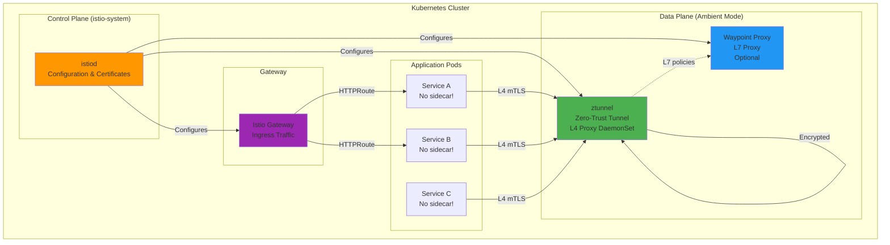
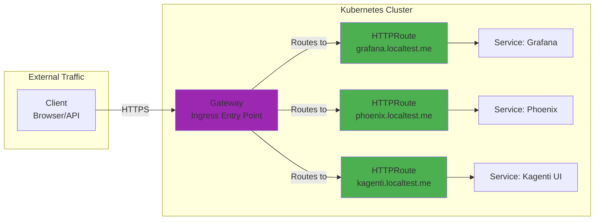
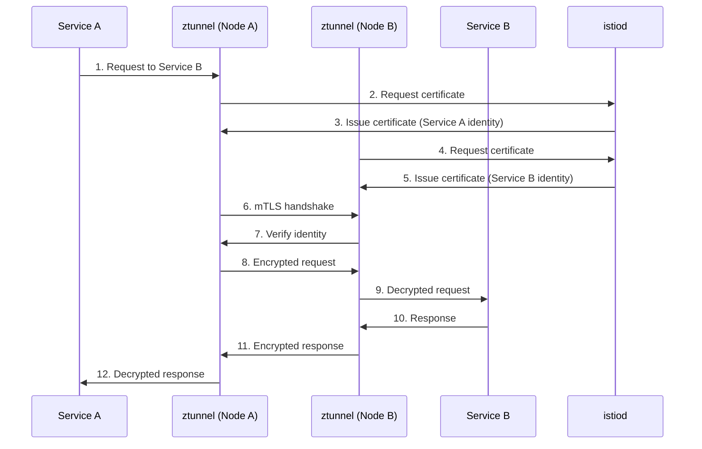

# Istio Service Mesh: Traffic Management & Security

**Version**: 2.0
**Last Updated**: 2025-11-11
**Status**: Production Ready
**Audience**: Platform Engineers, SREs, DevOps

Complete guide to Istio service mesh deployment with ambient mode, Gateway API integration, and mTLS security for the Kagenti platform.

---

## Table of Contents

- [Overview](#overview)
- [What is a Service Mesh?](#what-is-a-service-mesh)
- [Architecture](#architecture)
- [Ambient Mode](#ambient-mode)
- [Installation](#installation)
- [Configuration](#configuration)
- [Gateway API Integration](#gateway-api-integration)
- [mTLS Security](#mtls-security)
- [Traffic Management](#traffic-management)
- [Observability](#observability)
- [Troubleshooting](#troubleshooting)
- [Alternatives](#alternatives)
- [Next Steps](#next-steps)
- [References](#references)

---

## Overview

**Purpose**: Provide secure service-to-service communication, traffic management, and observability for Kubernetes workloads without modifying application code.

**What You Get**:
- ✅ Mutual TLS (mTLS) encryption for all service-to-service traffic
- ✅ Automatic distributed tracing for HTTP requests
- ✅ Traffic routing and load balancing
- ✅ Circuit breaking and fault injection
- ✅ Gateway API for ingress traffic
- ✅ Zero-trust security model
- ✅ Ambient mode (no sidecar containers required)

**Key Benefit**: Istio provides infrastructure-level security and observability without requiring code changes to your applications. All traffic is encrypted by default, and every request is traced.

**Source**: Based on [Istio Documentation](https://istio.io/latest/docs/)

---

## What is a Service Mesh?

**A service mesh** is a dedicated infrastructure layer that handles service-to-service communication in a microservices architecture.

### Core Concepts

| Concept | Description | Example |
|---------|-------------|---------|
| **Service Mesh** | Infrastructure layer for service communication | All pods communicate through mesh |
| **Data Plane** | Handles actual traffic between services | Envoy proxies, ztunnel |
| **Control Plane** | Manages and configures data plane | istiod (Istio daemon) |
| **mTLS** | Mutual TLS authentication | Service A verifies Service B's identity |
| **Traffic Policy** | Rules for routing, retries, timeouts | Route 10% of traffic to v2 |

**Source**: [Istio Concepts](https://istio.io/latest/docs/concepts/)

### Why a Service Mesh?

**Without Service Mesh**:
```
Service A → Service B (unencrypted HTTP)
❌ No encryption
❌ No automatic retries
❌ No distributed tracing
❌ No traffic splitting
❌ No circuit breaking
```

**With Service Mesh (Istio)**:
```
Service A → [Mesh Proxy] → [Mesh Proxy] → Service B
✅ mTLS encryption
✅ Automatic retries with exponential backoff
✅ Distributed tracing (every request)
✅ Canary deployments (10% traffic to v2)
✅ Circuit breaking (prevent cascading failures)
✅ Zero-trust security
```

**Source**: [Why Use Istio?](https://istio.io/latest/about/service-mesh/)

---

## Architecture

### Istio Components

Kagenti uses **Istio in ambient mode** with the following components:



**Source**: [Istio Ambient Architecture](https://istio.io/latest/docs/ambient/architecture/)

### Component Roles

| Component | Type | Purpose | Deployment |
|-----------|------|---------|------------|
| **istiod** | Control Plane | Certificate authority, configuration distribution | Deployment (1 replica) |
| **ztunnel** | Data Plane (L4) | Zero-trust tunnel, mTLS enforcement | DaemonSet (1 per node) |
| **Waypoint Proxy** | Data Plane (L7) | Advanced L7 policies (optional) | Deployment (per namespace) |
| **Istio Gateway** | Ingress | Entry point for external traffic | Deployment (Gateway API) |

**Sources**:
- [Istio Components](https://istio.io/latest/docs/ops/deployment/architecture/)
- [Ambient Mode Overview](https://istio.io/latest/blog/2022/introducing-ambient-mesh/)

---

## Ambient Mode

### What is Ambient Mode?

**Ambient mode** is Istio's sidecar-free service mesh architecture introduced in Istio 1.18.

**Traditional Sidecar Mode**:
```
Pod:
  - app: myapp (100m CPU, 256Mi RAM)
  - envoy-sidecar: (50m CPU, 128Mi RAM) ← 50% overhead!
```

**Ambient Mode**:
```
Pod:
  - app: myapp (100m CPU, 256Mi RAM)

ztunnel DaemonSet (shared across all pods on node):
  - ztunnel: (200m CPU, 512Mi RAM) ← Shared overhead!
```

**Source**: [Introducing Ambient Mesh](https://istio.io/latest/blog/2022/introducing-ambient-mesh/)

### Benefits of Ambient Mode

| Aspect | Sidecar Mode | Ambient Mode |
|--------|--------------|--------------|
| **Resource Overhead** | 50%+ per pod | ~10-15% cluster-wide |
| **Pod Restart Required** | Yes (inject sidecar) | No |
| **Upgrade Complexity** | Per-pod rolling restart | DaemonSet update only |
| **Startup Time** | +2-5 seconds | No overhead |
| **Security** | Same (mTLS) | Same (mTLS) |
| **Traffic Control** | L7 (always) | L4 (default), L7 (opt-in) |

**Source**: [Ambient vs Sidecar Comparison](https://istio.io/latest/docs/ambient/overview/#ambient-vs-sidecar)

### Two-Layer Architecture

Ambient mode has two layers:

1. **Layer 4 (ztunnel)** - Always enabled:
   - mTLS encryption
   - Identity-based authorization
   - L4 telemetry (connections, bytes)

2. **Layer 7 (waypoint)** - Optional:
   - HTTP routing rules
   - Request-level policies (rate limiting, circuit breaking)
   - L7 telemetry (requests, latencies, status codes)

**Example**: Kagenti uses L4 for most services, L7 waypoint only for advanced routing (canary deployments, A/B testing).

**Source**: [Ambient Data Plane Layers](https://istio.io/latest/docs/ambient/architecture/#data-plane)

---

## Installation

### Method 1: Quick Install (Kind)

This is how Kagenti deploys Istio in Kind clusters.

**Prerequisites**:
- Kind cluster created
- kubectl configured

**Installation**:
```bash
# 1. Download Istio
ISTIO_VERSION=1.24.2
curl -L https://istio.io/downloadIstio | ISTIO_VERSION=${ISTIO_VERSION} sh -

# 2. Install Istio with ambient profile
./istio-${ISTIO_VERSION}/bin/istioctl install --set profile=ambient -y

# Expected output:
# ✔ Istio core installed
# ✔ Istiod installed
# ✔ CNI installed
# ✔ Ztunnel installed
# ✔ Installation complete
```

**Verify Installation**:
```bash
# Check Istio pods
kubectl get pods -n istio-system

# Expected output:
# NAME                      READY   STATUS
# istiod-<hash>             1/1     Running
# istio-cni-node-<hash>     1/1     Running
# ztunnel-<hash>            1/1     Running

# Check Istio version
./istio-${ISTIO_VERSION}/bin/istioctl version

# Expected: Both client and control plane show 1.24.2
```

**Source**: [Istio Ambient Getting Started](https://istio.io/latest/docs/ambient/getting-started/)

---

### Method 2: Helm Install (Production)

**Prerequisites**:
- Helm 3.x installed
- Kubernetes cluster with CNI plugin support

**Installation**:
```bash
# 1. Add Istio Helm repository
helm repo add istio https://istio-release.storage.googleapis.com/charts
helm repo update

# 2. Install Istio base (CRDs)
helm install istio-base istio/base \
  --namespace istio-system \
  --create-namespace

# 3. Install istiod (control plane)
helm install istiod istio/istiod \
  --namespace istio-system \
  --set profile=ambient

# 4. Install CNI
helm install istio-cni istio/cni \
  --namespace istio-system

# 5. Install ztunnel
helm install ztunnel istio/ztunnel \
  --namespace istio-system
```

**Source**: [Istio Helm Installation](https://istio.io/latest/docs/setup/install/helm/)

---

### Verify Installation

```bash
# Check all Istio components
kubectl get all -n istio-system

# Verify ztunnel DaemonSet (should have 1 pod per node)
kubectl get daemonset -n istio-system ztunnel

# Check istiod health
kubectl get deployment -n istio-system istiod

# Verify CNI installation
kubectl get daemonset -n istio-system istio-cni-node
```

**Source**: [Istio Verify Installation](https://istio.io/latest/docs/setup/install/istioctl/#verify-a-successful-installation)

---

## Configuration

### Enable Ambient Mode for Namespace

To enable ambient mesh for a namespace, add a label:

```bash
# Enable ambient mode for observability namespace
kubectl label namespace observability istio.io/dataplane-mode=ambient

# Verify label
kubectl get namespace observability -o yaml | grep istio.io/dataplane-mode
```

**What Happens**:
1. All pods in the namespace are automatically added to the mesh
2. ztunnel intercepts traffic to/from these pods
3. mTLS is automatically applied
4. No pod restarts required!

**Source**: [Adding Workloads to Ambient](https://istio.io/latest/docs/ambient/usage/add-workloads/)

---

### Configure Strict mTLS

Kagenti enforces **STRICT mTLS** for all service-to-service communication.

**File**: `components/00-infrastructure/istio/strict-mtls.yaml`

```yaml
# Enforce mTLS for istio-system namespace
apiVersion: security.istio.io/v1beta1
kind: PeerAuthentication
metadata:
  name: default-strict-mtls
  namespace: istio-system
spec:
  mtls:
    mode: STRICT
---
# Enforce mTLS for application namespaces
apiVersion: security.istio.io/v1beta1
kind: PeerAuthentication
metadata:
  name: default-strict-mtls
  namespace: kagenti-system
spec:
  mtls:
    mode: STRICT
---
# DestinationRule to enforce TLS for all traffic
apiVersion: networking.istio.io/v1beta1
kind: DestinationRule
metadata:
  name: default-strict-mtls-cluster
  namespace: istio-system
spec:
  host: "*.svc.cluster.local"
  trafficPolicy:
    tls:
      mode: ISTIO_MUTUAL  # Use Istio-managed mTLS
```

**Apply Configuration**:
```bash
kubectl apply -f components/00-infrastructure/istio/strict-mtls.yaml

# Verify PeerAuthentication
kubectl get peerauthentication -A

# Expected: STRICT mode in istio-system and kagenti-system
```

**Source**: [Istio mTLS Configuration](https://istio.io/latest/docs/tasks/security/authentication/mtls-migration/)

---

## Gateway API Integration

Istio uses the **Kubernetes Gateway API** (v1.2+) for ingress traffic management instead of the legacy Istio Gateway and VirtualService resources.

### Gateway API Architecture



**Source**: [Gateway API Overview](https://gateway-api.sigs.k8s.io/)

---

### Create Gateway

**File**: `components/01-platform/gateway/gateway-https.yaml`

```yaml
apiVersion: gateway.networking.k8s.io/v1
kind: Gateway
metadata:
  name: http
  namespace: kagenti-system
spec:
  gatewayClassName: istio  # Use Istio implementation
  listeners:
  # HTTP listener (redirects to HTTPS)
  - name: http
    port: 80
    protocol: HTTP
    allowedRoutes:
      namespaces:
        from: Selector
        selector:
          matchLabels:
            shared-gateway-access: "true"

  # HTTPS listener with TLS termination
  - name: https
    hostname: "*.localtest.me"
    port: 443
    protocol: HTTPS
    tls:
      mode: Terminate  # Gateway terminates TLS
      certificateRefs:
      - name: localtest-me-tls  # Wildcard certificate
        kind: Secret
    allowedRoutes:
      namespaces:
        from: Selector
        selector:
          matchLabels:
            shared-gateway-access: "true"
```

**Apply Gateway**:
```bash
kubectl apply -f components/01-platform/gateway/gateway-https.yaml

# Wait for gateway to be ready
kubectl wait --for=condition=Programmed gateway/http -n kagenti-system --timeout=60s

# Check gateway status
kubectl get gateway -n kagenti-system
```

**Source**: [Gateway API Gateway Resource](https://gateway-api.sigs.k8s.io/api-types/gateway/)

---

### Create HTTPRoute

HTTPRoute defines how to route traffic from the Gateway to backend services.

**Example**: Route `grafana.localtest.me` to Grafana service

```yaml
apiVersion: gateway.networking.k8s.io/v1
kind: HTTPRoute
metadata:
  name: grafana
  namespace: observability
spec:
  parentRefs:
  - name: http  # Attach to Gateway named "http"
    namespace: kagenti-system

  hostnames:
  - "grafana.localtest.me"

  rules:
  - matches:
    - path:
        type: PathPrefix
        value: /
    backendRefs:
    - name: grafana
      port: 80
```

**Apply HTTPRoute**:
```bash
kubectl apply -f <httproute-file.yaml>

# Verify HTTPRoute
kubectl get httproute -n observability

# Check route status
kubectl describe httproute grafana -n observability
```

**Source**: [Gateway API HTTPRoute](https://gateway-api.sigs.k8s.io/api-types/httproute/)

---

### Gateway Access in Kind

**Challenge**: Gateway LoadBalancer IPs are not accessible from the host machine in Kind clusters.

**Solution**: Use NodePort with Kind extraPortMappings

**File**: `scripts/kind/kind-config.yaml`

```yaml
kind: Cluster
apiVersion: kind.x-k8s.io/v1alpha4
nodes:
- role: control-plane
  extraPortMappings:
  # Map host port 9443 to gateway HTTPS NodePort
  - containerPort: 30443
    hostPort: 9443
    protocol: TCP
```

**Gateway Service** (NodePort):
```yaml
apiVersion: v1
kind: Service
metadata:
  name: https-istio-np
  namespace: kagenti-system
spec:
  type: NodePort
  ports:
  - port: 443
    targetPort: 443
    nodePort: 30443  # Fixed NodePort
    protocol: TCP
    name: https
  selector:
    gateway.networking.k8s.io/gateway-name: http
```

**Access Services**:
```bash
# Access Grafana via gateway
open https://grafana.localtest.me:9443

# Access Phoenix via gateway
open https://phoenix.localtest.me:9443
```

**Source**: [Kind Ingress Documentation](https://kind.sigs.k8s.io/docs/user/ingress/)

---

## mTLS Security

### How mTLS Works

**Mutual TLS (mTLS)** provides both authentication and encryption:



**Source**: [Istio Security Architecture](https://istio.io/latest/docs/concepts/security/)

### Certificate Management

Istio automatically manages certificates:

**Certificate Lifecycle**:
1. **Issuance**: istiod acts as Certificate Authority (CA)
2. **Distribution**: Certificates pushed to ztunnel via xDS API
3. **Rotation**: Automatic rotation every 24 hours (default)
4. **Revocation**: Immediate revocation when pod is deleted

**Check Certificates**:
```bash
# View istiod CA certificate
kubectl get secret istio-ca-secret -n istio-system -o yaml

# Check certificate rotation policy
kubectl get configmap istio -n istio-system -o yaml | grep -A5 certificates
```

**Source**: [Istio Certificate Management](https://istio.io/latest/docs/tasks/security/cert-management/)

---

### Authorization Policies

Control which services can communicate using **AuthorizationPolicy**:

```yaml
# Allow only Grafana to access Tempo
apiVersion: security.istio.io/v1beta1
kind: AuthorizationPolicy
metadata:
  name: tempo-access
  namespace: observability
spec:
  selector:
    matchLabels:
      app: tempo
  action: ALLOW
  rules:
  - from:
    - source:
        principals:
        - "cluster.local/ns/observability/sa/grafana"
```

**Apply Policy**:
```bash
kubectl apply -f <authorization-policy.yaml>

# Verify policy
kubectl get authorizationpolicy -n observability
```

**Source**: [Istio Authorization Policies](https://istio.io/latest/docs/tasks/security/authorization/)

---

## Traffic Management

### Circuit Breaking

Prevent cascading failures with circuit breaking:

```yaml
apiVersion: networking.istio.io/v1beta1
kind: DestinationRule
metadata:
  name: tempo-circuit-breaker
  namespace: observability
spec:
  host: tempo.observability.svc.cluster.local
  trafficPolicy:
    connectionPool:
      tcp:
        maxConnections: 100
      http:
        http1MaxPendingRequests: 50
        http2MaxRequests: 100
    outlierDetection:
      consecutiveErrors: 5
      interval: 30s
      baseEjectionTime: 30s
      maxEjectionPercent: 50
```

**Source**: [Istio Circuit Breaking](https://istio.io/latest/docs/tasks/traffic-management/circuit-breaking/)

---

### Retries and Timeouts

Configure automatic retries:

```yaml
apiVersion: networking.istio.io/v1beta1
kind: VirtualService
metadata:
  name: grafana-retries
  namespace: observability
spec:
  hosts:
  - grafana.observability.svc.cluster.local
  http:
  - route:
    - destination:
        host: grafana.observability.svc.cluster.local
    timeout: 10s
    retries:
      attempts: 3
      perTryTimeout: 2s
      retryOn: 5xx,reset,connect-failure,refused-stream
```

**Source**: [Istio Retries](https://istio.io/latest/docs/concepts/traffic-management/#retries)

---

### Traffic Splitting (Canary)

Route percentage of traffic to new version:

```yaml
apiVersion: networking.istio.io/v1beta1
kind: VirtualService
metadata:
  name: kagenti-ui-canary
  namespace: kagenti-system
spec:
  hosts:
  - kagenti-ui.kagenti-system.svc.cluster.local
  http:
  - match:
    - headers:
        user-agent:
          regex: ".*Chrome.*"
    route:
    - destination:
        host: kagenti-ui.kagenti-system.svc.cluster.local
        subset: v2
      weight: 10  # 10% to v2
    - destination:
        host: kagenti-ui.kagenti-system.svc.cluster.local
        subset: v1
      weight: 90  # 90% to v1
```

**Source**: [Istio Traffic Shifting](https://istio.io/latest/docs/tasks/traffic-management/traffic-shifting/)

---

## Observability

### Distributed Tracing

Istio automatically sends traces to OpenTelemetry Collector.

**Configuration**: `components/00-infrastructure/istio/configmap.yaml`

```yaml
apiVersion: v1
kind: ConfigMap
metadata:
  name: istio
  namespace: istio-system
data:
  mesh: |
    defaultConfig:
      tracing:
        zipkin:
          address: otel-collector.observability.svc.cluster.local:9411
        sampling: 10.0  # Sample 10% of requests
```

**Verify Tracing**:
```bash
# Check traces in Grafana
kubectl port-forward svc/grafana -n observability 3000:80
# Open http://localhost:3000 → Explore → Tempo
```

**Source**: [Istio Distributed Tracing](https://istio.io/latest/docs/tasks/observability/distributed-tracing/)

---

### Metrics

Istio exposes Prometheus metrics for:
- Request rates, latencies, error rates
- TCP connection metrics
- mTLS certificate status

**Scrape Metrics**:
```yaml
# ServiceMonitor for istiod
apiVersion: monitoring.coreos.com/v1
kind: ServiceMonitor
metadata:
  name: istiod
  namespace: istio-system
spec:
  selector:
    matchLabels:
      app: istiod
  endpoints:
  - port: http-monitoring
    interval: 30s
```

**Source**: [Istio Metrics](https://istio.io/latest/docs/reference/config/metrics/)

---

## Troubleshooting

### Issue: Pods Not Joining Mesh

**Symptoms**: Traffic not encrypted, no traces generated

**Diagnosis**:
```bash
# Check namespace label
kubectl get namespace observability -o yaml | grep istio.io/dataplane-mode

# Expected: istio.io/dataplane-mode=ambient

# Check ztunnel logs
kubectl logs -n istio-system -l app=ztunnel | grep <pod-ip>
```

**Fix**:
```bash
# Add namespace label
kubectl label namespace observability istio.io/dataplane-mode=ambient

# Verify ztunnel picked up the pod
kubectl logs -n istio-system -l app=ztunnel | grep "added to mesh"
```

**Source**: [Ambient Troubleshooting - ztunnel](https://istio.io/latest/docs/ambient/usage/troubleshoot-ztunnel/)

---

### Issue: mTLS Connection Failures

**Symptoms**: `connection refused` or `certificate verify failed`

**Diagnosis**:
```bash
# Check PeerAuthentication mode
kubectl get peerauthentication -A

# Check if destination service is in the mesh
kubectl get pod <pod-name> -n <namespace> -o yaml | grep istio.io/dataplane-mode

# Check istiod logs for certificate errors
kubectl logs -n istio-system -l app=istiod | grep -i error
```

**Fix**:
```bash
# Ensure both source and destination are in ambient mode
kubectl label namespace <source-ns> istio.io/dataplane-mode=ambient
kubectl label namespace <dest-ns> istio.io/dataplane-mode=ambient

# Restart istiod if certificate issues persist
kubectl rollout restart deployment/istiod -n istio-system
```

**Source**: [Istio mTLS Troubleshooting](https://istio.io/latest/docs/ops/common-problems/security-issues/)

---

### Issue: Gateway Not Accessible

**Symptoms**: `curl` to gateway IP times out

**Diagnosis**:
```bash
# Check gateway status
kubectl get gateway -n kagenti-system

# Check gateway pod
kubectl get pods -n kagenti-system -l gateway.networking.k8s.io/gateway-name=http

# Check HTTPRoute
kubectl get httproute -A
```

**Common Causes**:
1. Gateway missing `tls.mode: Terminate` for HTTPS
2. HTTPRoute not attached to correct gateway
3. NodePort not mapped in Kind cluster config

**Fix**:
```bash
# For Kind: Ensure NodePort mapping exists
kind get clusters
docker inspect kagenti-demo-control-plane | grep -A10 PortBindings

# For HTTPS: Ensure TLS mode is set
kubectl get gateway http -n kagenti-system -o yaml | grep -A5 tls
```

**Source**: [Gateway API User Guides](https://gateway-api.sigs.k8s.io/guides/)

---

## Alternatives

### Alternative 1: Linkerd

**Pros**:
- Simpler than Istio (fewer components)
- Lower resource overhead
- Built-in zero-trust security

**Cons**:
- No ambient mode (sidecar only)
- Smaller ecosystem
- Less mature Gateway API support

**When to Use**: If simplicity is more important than features.

**Source**: [Linkerd Documentation](https://linkerd.io/2.15/overview/)

---

### Alternative 2: Consul Service Mesh

**Pros**:
- Multi-cloud and multi-runtime (VMs + Kubernetes)
- Service discovery built-in
- Native Vault integration for secrets

**Cons**:
- Complex setup (Consul cluster required)
- Not Kubernetes-native
- Higher operational complexity

**When to Use**: Multi-cloud or hybrid (VM + Kubernetes) deployments.

**Source**: [Consul Service Mesh](https://developer.hashicorp.com/consul/docs)

---

### Alternative 3: Cilium Service Mesh

**Pros**:
- eBPF-based (kernel-level, very fast)
- Lower overhead than proxy-based meshes
- NetworkPolicy integration

**Cons**:
- Requires Cilium CNI (can't use with other CNIs)
- Less mature (newer project)
- Limited L7 policy support

**When to Use**: eBPF-native clusters with advanced networking needs.

**Source**: [Cilium Service Mesh](https://cilium.io/use-cases/service-mesh/)

---

### Alternative 4: No Service Mesh

**Pros**:
- Simplest (no additional components)
- Zero resource overhead
- Easier to debug

**Cons**:
- No automatic mTLS
- No distributed tracing (must instrument manually)
- No traffic management (retries, circuit breaking)
- No zero-trust security

**When to Use**: Very simple deployments with few services.

---

## Next Steps

### For Development

1. **Enable Ambient for Your Namespace**:
   ```bash
   kubectl label namespace my-app istio.io/dataplane-mode=ambient
   ```

2. **Create HTTPRoute for Your Service**:
   ```bash
   kubectl apply -f my-httproute.yaml
   ```

3. **View Traces in Grafana**:
   - Access Grafana → Explore → Tempo datasource
   - Search for your service traces

### For Production

1. **Configure Authorization Policies**:
   - Define which services can communicate
   - Follow zero-trust principle (deny by default)
   - Review [Istio Authorization Best Practices](https://istio.io/latest/docs/ops/best-practices/security/)

2. **Set Up Circuit Breaking**:
   - Prevent cascading failures
   - Configure outlier detection
   - Review [Circuit Breaking Guide](https://istio.io/latest/docs/tasks/traffic-management/circuit-breaking/)

3. **Enable Waypoint Proxy for Advanced Routing**:
   - Deploy waypoint proxy for L7 policies
   - Configure canary deployments
   - Review [Waypoint Deployment](https://istio.io/latest/docs/ambient/usage/waypoint/)

4. **Monitor mTLS Certificate Rotation**:
   - Set up alerts for certificate expiration
   - Verify automatic rotation is working
   - Review [Certificate Monitoring](https://istio.io/latest/docs/ops/diagnostic-tools/proxy-cmd/#inspect-certificates)

---

## References

### Official Documentation

- **Istio**: [istio.io/latest/docs](https://istio.io/latest/docs/)
- **Ambient Mode**: [istio.io/latest/docs/ambient](https://istio.io/latest/docs/ambient/)
- **Gateway API**: [gateway-api.sigs.k8s.io](https://gateway-api.sigs.k8s.io/)
- **Istio Security**: [istio.io/latest/docs/concepts/security](https://istio.io/latest/docs/concepts/security/)
- **Istio Traffic Management**: [istio.io/latest/docs/concepts/traffic-management](https://istio.io/latest/docs/concepts/traffic-management/)

### Architecture & Concepts

- **Service Mesh Overview**: [istio.io/latest/about/service-mesh](https://istio.io/latest/about/service-mesh/)
- **Ambient Architecture**: [istio.io/latest/docs/ambient/architecture](https://istio.io/latest/docs/ambient/architecture/)
- **Introducing Ambient Mesh**: [istio.io/latest/blog/2022/introducing-ambient-mesh](https://istio.io/latest/blog/2022/introducing-ambient-mesh/)

### Internal Documentation

- **Main README**: [../../README.md](../../README.md)
- **Quick Start Guide**: [../00-getting-started/quick-start.md](../00-getting-started/quick-start.md)
- **Distributed Tracing**: [../04-observability/distributed-tracing.md](../04-observability/distributed-tracing.md)
- **Keycloak SSO**: [../03-authentication/keycloak.md](../03-authentication/keycloak.md)

### Old Documentation (Reference Only)

- **Gateway Access in Kind**: [../../old_docs/GATEWAY-ACCESS-KIND.md](../../old_docs/GATEWAY-ACCESS-KIND.md)
- **UI Access via Gateway**: [../../old_docs/UI-ACCESS-VIA-GATEWAY.md](../../old_docs/UI-ACCESS-VIA-GATEWAY.md)

### Repository

- **GitHub**: [Ladas/kagenti-demo-deployment](https://github.com/Ladas/kagenti-demo-deployment)
- **Istio Components**: [components/00-infrastructure/istio/](../../components/00-infrastructure/istio/)
- **Gateway Configuration**: [components/01-platform/gateway/](../../components/01-platform/gateway/)

---

**Last Updated**: 2025-11-11
**Document Version**: 2.0
**Maintained By**: Platform Engineering Team
**License**: Apache 2.0
