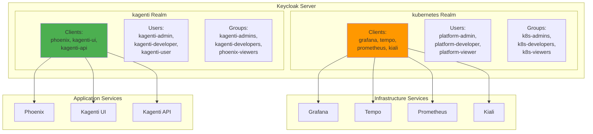

# Keycloak SSO: Authentication and Identity Management

**Version**: 2.0
**Last Updated**: 2025-11-10
**Status**: Production Ready
**Audience**: Platform Engineers, Security Engineers, Developers

Complete guide to Keycloak SSO configuration for the Kagenti platform with GitOps-based realm management.

---

## Table of Contents

- [Overview](#overview)
- [What is Keycloak?](#what-is-keycloak)
- [Architecture](#architecture)
- [Components](#components)
- [Installation](#installation)
- [Configuration](#configuration)
- [Usage](#usage)
- [GitOps Workflow](#gitops-workflow)
- [Troubleshooting](#troubleshooting)
- [Alternatives](#alternatives)
- [Next Steps](#next-steps)
- [References](#references)

---

## Overview

**Purpose**: Provide centralized authentication and Single Sign-On (SSO) for all Kagenti platform services.

**What You Get**:
- ✅ Single Sign-On (SSO) across all services
- ✅ Two realms: `kubernetes` (infrastructure) and `kagenti` (applications)
- ✅ OAuth2/OIDC protocol support
- ✅ GitOps-managed realm configuration
- ✅ Automatic client secret distribution
- ✅ Integration with Grafana, Phoenix, Kagenti UI, and other services
- ✅ PostgreSQL-backed for high availability

**Key Benefit**: Users log in once and access all platform services without re-authenticating.

**Source**: Based on [Keycloak Documentation](https://www.keycloak.org/documentation)

---

## What is Keycloak?

**Keycloak** is an open-source Identity and Access Management (IAM) solution that provides:

### Core Features

| Feature | Description | Use Case |
|---------|-------------|----------|
| **SSO** | Single Sign-On | Log in once, access all services |
| **OIDC** | OpenID Connect | Modern authentication protocol |
| **OAuth2** | OAuth 2.0 | Authorization for APIs |
| **SAML** | SAML 2.0 | Enterprise federation |
| **LDAP/AD** | Directory integration | Connect to existing user databases |
| **User Federation** | External identity providers | Google, GitHub, Facebook login |
| **RBAC** | Role-Based Access Control | Assign roles and permissions |
| **MFA** | Multi-Factor Authentication | OTP, WebAuthn support |

**Source**: [Keycloak Features Overview](https://www.keycloak.org/getting-started/getting-started-kube)

### Why Keycloak?

**Without Keycloak**:
```
Grafana → Local users + passwords
Phoenix → Separate auth
Kagenti UI → Another auth system
Kiali → Yet another auth

❌ Multiple credentials
❌ No SSO
❌ Password fatigue
❌ Audit nightmare
```

**With Keycloak**:
```
Grafana ──┐
Phoenix ──┼─→ Keycloak SSO ←─ User logs in ONCE
Kagenti UI┤
Kiali ────┘

✅ Single credential
✅ Centralized user management
✅ Unified audit logs
✅ Easy to add/remove access
```

**Source**: [Why Use an Identity Provider?](https://auth0.com/intro-to-iam/what-is-an-identity-provider)

---

## Architecture

### Dual-Realm Architecture

Kagenti uses **two separate realms** to isolate infrastructure and application concerns:



**Source**: [Keycloak Realms Concept](https://www.keycloak.org/docs/latest/server_admin/#realms)

### Realm Comparison

| Aspect | kubernetes Realm | kagenti Realm |
|--------|------------------|---------------|
| **Purpose** | Infrastructure observability | AI application access |
| **Audience** | Platform engineers, SREs | Data scientists, developers, users |
| **Services** | Grafana, Tempo, Prometheus, Kiali | Phoenix, Kagenti UI, Kagenti API |
| **Isolation** | Prevent app users from accessing infra | Prevent infra users from accessing app data |
| **SSO Scope** | Infrastructure tools only | Application tools only |

**Source**: [Multi-Realm Strategy Best Practices](https://www.keycloak.org/docs/latest/server_admin/#_per_realm_admin_permissions)

---

## Components

### 1. Keycloak Server

**Purpose**: Core authentication server providing OIDC/OAuth2 endpoints.

**Deployment**:
- **Type**: StatefulSet (for production stability)
- **Replicas**: 1 (local dev), 3+ (production HA)
- **Database**: PostgreSQL (persistent storage)
- **Operator**: Keycloak Operator (Kubernetes) or OLM (OpenShift)

**Deployment Files**:
```
components/00-infrastructure/keycloak/
├── keycloak-cr.yaml          # Keycloak custom resource
├── postgres-statefulset.yaml # Database backend
├── httproute.yaml            # Ingress via Istio Gateway
└── kustomization.yaml
```

**Source**: [Keycloak on Kubernetes](https://www.keycloak.org/operator/installation)

---

### 2. Realms Configuration

**Purpose**: Define authentication realms, clients, users, and groups.

**Realm Files**:
```
components/00-infrastructure/keycloak/
├── realm-import-kubernetes.yaml  # Infrastructure realm
└── realm-import-kagenti.yaml     # Application realm
```

**What's Defined in Realm JSON**:
- ✅ Realm settings (session timeouts, security policies)
- ✅ Client configurations (redirect URIs, scopes)
- ✅ User accounts (with temporary passwords)
- ✅ Groups and roles
- ✅ Authentication flows

**What's NOT in Realm JSON**:
- ❌ Client secrets (dynamically fetched)
- ❌ Production passwords (use temporary + force reset)

**Source**: [Keycloak Realm Export/Import](https://www.keycloak.org/server/importExport)

---

### 3. Client Secret Distribution

**Purpose**: Fetch OIDC client secrets from Keycloak and distribute as Kubernetes Secrets.

**Why Needed?**:
Clients need secrets to authenticate with Keycloak. These are:
1. Generated by Keycloak when realms are imported
2. Fetched via Keycloak Admin API
3. Stored in Kubernetes Secrets for services to consume

**Job Files**:
```
components/00-infrastructure/keycloak/
└── keycloak-config-job.yaml     # PostSync hook to fetch secrets
```

**Secrets Created**:
```bash
# Infrastructure clients (kubernetes realm)
observability/grafana-oidc-secret
oauth2-proxy/keycloak-tempo-client-secret
oauth2-proxy/keycloak-prometheus-client-secret
oauth2-proxy/keycloak-kiali-client-secret

# Application clients (kagenti realm)
oauth2-proxy/keycloak-phoenix-client-secret
kagenti-system/kagenti-ui-oauth-secret
kagenti-system/kagenti-api-oauth-secret

# OAuth2-Proxy shared secrets
oauth2-proxy/oauth2-proxy-secrets  # Cookie encryption
```

**Source**: [Keycloak Admin REST API](https://www.keycloak.org/docs-api/latest/rest-api/index.html)

---

### 4. PostgreSQL Database

**Purpose**: Persistent storage for Keycloak data (users, sessions, tokens).

**Why PostgreSQL?**:
- ✅ Production-ready persistence
- ✅ High availability support
- ✅ Better performance than H2 (default)
- ✅ Required for multi-replica deployments

**Deployment**:
```
components/00-infrastructure/keycloak/
├── postgres-statefulset.yaml  # PostgreSQL server
└── db-secret-generation-job.yaml  # Generate DB credentials
```

**Source**: [Keycloak Database Configuration](https://www.keycloak.org/server/db)

---

## Installation

### Prerequisites

Ensure the following are deployed:
- ✅ Kubernetes cluster (Kind or OpenShift)
- ✅ ArgoCD for GitOps
- ✅ Istio Gateway for ingress
- ✅ cert-manager for TLS (optional)

**Source**: [Quick Start Guide](../00-getting-started/quick-start.md)

### Deployment via ArgoCD

Keycloak is deployed as part of the `infrastructure` ArgoCD Application:

```bash
# Check ArgoCD application
kubectl get application -n argocd keycloak

# Expected: Healthy and Synced

# Verify Keycloak pods
kubectl get pods -n keycloak

# Expected:
# keycloak-0                    1/1  Running
# keycloak-postgresql-0         1/1  Running
```

**Source**: [ArgoCD Applications](https://argo-cd.readthedocs.io/en/stable/user-guide/application-specification/)

---

### Verify Installation

```bash
# Check Keycloak service
kubectl get svc -n keycloak

# Expected: keycloak (8080), keycloak-postgresql (5432)

# Check realm import job completed
kubectl get jobs -n keycloak

# Expected: keycloak-realm-import (Completed 1/1)

# Check secrets were created
kubectl get secrets -n observability grafana-oidc-secret
kubectl get secrets -n oauth2-proxy keycloak-tempo-client-secret

# Expected: Both secrets exist
```

**Source**: [Kubernetes Jobs](https://kubernetes.io/docs/concepts/workloads/controllers/job/)

---

## Configuration

### Accessing Keycloak Admin Console

```bash
# Port-forward Keycloak
kubectl port-forward svc/keycloak -n keycloak 8082:8080

# Access: http://localhost:8082
# Username: admin
# Password: admin (default for local dev)
```

**Production**: Change admin password immediately!

**Source**: [Keycloak Admin Console](https://www.keycloak.org/docs/latest/server_admin/#admin-console)

---

### Realm Configuration Overview

#### kubernetes Realm

**Purpose**: Infrastructure observability tools

**Clients**:

| Client ID | Service | Auth Method | Redirect URI |
|-----------|---------|-------------|--------------|
| `grafana` | Grafana | Native OIDC | `https://grafana.localtest.me:9443/login/generic_oauth` |
| `tempo` | Tempo | OAuth2-Proxy | `https://tempo.localtest.me:9443/oauth2/callback` |
| `prometheus` | Prometheus | OAuth2-Proxy | `https://prometheus.localtest.me:9443/oauth2/callback` |
| `kiali` | Kiali | OAuth2-Proxy | `https://kiali.localtest.me:9443/oauth2/callback` |

**Users**:
- `platform-admin` → Group: `k8s-admins`
- `platform-developer` → Group: `k8s-developers`
- `platform-viewer` → Group: `k8s-viewers`

**Source**: [realm-import-kubernetes.yaml](../../components/00-infrastructure/keycloak/realm-import-kubernetes.yaml)

---

#### kagenti Realm

**Purpose**: AI application access

**Clients**:

| Client ID | Service | Auth Method | Redirect URI |
|-----------|---------|-------------|--------------|
| `phoenix` | Phoenix | OAuth2-Proxy | `https://phoenix.localtest.me:9443/oauth2/callback` |
| `kagenti-ui` | Kagenti UI | Native OIDC | `https://kagenti.localtest.me:9443/_stcore/oidc/callback` |
| `kagenti-api` | Kagenti API | Native OIDC | `https://api.kagenti.localtest.me:9443/oauth/callback` |

**Users**:
- `kagenti-admin` → Group: `kagenti-admins`
- `kagenti-developer` → Group: `kagenti-developers`
- `kagenti-user` → Group: `kagenti-users`

**Source**: [realm-import-kagenti.yaml](../../components/00-infrastructure/keycloak/realm-import-kagenti.yaml)

---

### Authentication Flows

#### OAuth2-Proxy Flow (Tempo, Prometheus, Kiali, Phoenix)

Used for services without native OIDC support:

```
1. User → https://tempo.localtest.me:9443
2. OAuth2-Proxy checks cookie
3. If not authenticated → redirect to Keycloak
4. User logs in to Keycloak
5. Keycloak redirects back to OAuth2-Proxy with auth code
6. OAuth2-Proxy exchanges code for token
7. OAuth2-Proxy sets secure cookie
8. Request proxied to Tempo backend
```

**Source**: [OAuth2-Proxy Documentation](https://oauth2-proxy.github.io/oauth2-proxy/docs/configuration/overview)

---

#### Native OIDC Flow (Grafana, Kagenti UI)

Used for services with built-in OIDC support:

```
1. User → https://grafana.localtest.me:9443
2. Grafana login page
3. Click "Sign in with Keycloak"
4. Redirect to Keycloak
5. User logs in
6. Keycloak redirects back to Grafana with auth code
7. Grafana exchanges code for token
8. Grafana validates token and creates session
```

**Source**: [Grafana Generic OAuth](https://grafana.com/docs/grafana/latest/setup-grafana/configure-security/configure-authentication/generic-oauth/)

---

## Usage

### Creating New Users

**Via Admin Console**:

```bash
# Access admin console
kubectl port-forward svc/keycloak -n keycloak 8082:8080

# Navigate to: http://localhost:8082
# 1. Select realm (kubernetes or kagenti)
# 2. Users → Add User
# 3. Set username, email
# 4. Credentials → Set temporary password
# 5. Join to Groups → Assign group membership
```

**Via Realm JSON (GitOps)**:

Edit `realm-import-kubernetes.yaml` or `realm-import-kagenti.yaml`:

```json
{
  "users": [
    {
      "username": "new-user",
      "email": "user@example.com",
      "enabled": true,
      "groups": ["k8s-developers"],
      "credentials": [
        {
          "type": "password",
          "value": "temporary-password",
          "temporary": true
        }
      ]
    }
  ]
}
```

Commit, push, and re-sync ArgoCD application.

**Source**: [Keycloak User Management](https://www.keycloak.org/docs/latest/server_admin/#assembly-managing-users_server_administration_guide)

---

### Adding New Clients

**Example**: Add Prometheus to kagenti realm

1. **Edit realm JSON**:

```json
{
  "clients": [
    {
      "clientId": "prometheus",
      "name": "Prometheus Metrics",
      "enabled": true,
      "protocol": "openid-connect",
      "publicClient": false,
      "redirectUris": [
        "https://prometheus.localtest.me:9443/oauth2/callback"
      ],
      "webOrigins": ["+"],
      "standardFlowEnabled": true,
      "serviceAccountsEnabled": false
    }
  ]
}
```

2. **Update client secret job**:

Add to `keycloak-config-job.yaml`:

```bash
# Fetch prometheus client secret
PROMETHEUS_SECRET=$(get_client_secret "kagenti" "prometheus")

# Create Kubernetes secret
kubectl create secret generic keycloak-prometheus-client-secret \
  -n oauth2-proxy \
  --from-literal=client-id=prometheus \
  --from-literal=client-secret=$PROMETHEUS_SECRET \
  --dry-run=client -o yaml | kubectl apply -f -
```

3. **Create OAuth2-Proxy deployment** (see OAuth2-Proxy docs)

4. **Commit and sync**

**Source**: [Keycloak OIDC Clients](https://www.keycloak.org/docs/latest/server_admin/#assembly-managing-clients_server_administration_guide)

---

## GitOps Workflow

### Sync Wave Strategy

ArgoCD sync waves ensure proper deployment order:

| Wave | Component | Purpose |
|------|-----------|---------|
| **0** | Keycloak StatefulSet, PostgreSQL | Deploy servers |
| **0** | Realm ConfigMaps | Make realm JSON available |
| **10** | Realm Import Job | Import realms into Keycloak |
| **20** | PostSync Hook: keycloak-config | Fetch client secrets |
| **25** | Grafana, OAuth2-Proxy deployments | Use fetched secrets |

**Source**: [ArgoCD Sync Waves](https://argo-cd.readthedocs.io/en/stable/user-guide/sync-waves/)

---

### Making Configuration Changes

**Update Realm Settings**:

```bash
# 1. Edit realm JSON
vim components/00-infrastructure/keycloak/realm-import-kubernetes.yaml

# 2. Commit and push
git add components/00-infrastructure/keycloak/
git commit -m "Update kubernetes realm session timeout"
git push

# 3. Sync ArgoCD app
argocd app sync infrastructure

# 4. Re-run realm import (delete job to trigger recreation)
kubectl delete job -n keycloak keycloak-realm-import

# 5. Re-sync to create new job
argocd app sync infrastructure
```

**Source**: [GitOps Best Practices](https://argo-cd.readthedocs.io/en/stable/user-guide/best_practices/)

---

## Troubleshooting

### Issue: Realm Import Job Fails

**Symptoms**: `keycloak-realm-import` job shows Error or CrashLoopBackOff

**Diagnosis**:

```bash
# Check job logs
kubectl logs -n keycloak job/keycloak-realm-import

# Common errors:
# - "Connection refused" → Keycloak not ready
# - "Invalid JSON" → Syntax error in realm JSON
# - "Client already exists" → Realm already imported
```

**Fix**:

```bash
# If Keycloak not ready, wait and retry
kubectl wait --for=condition=ready pod/keycloak-0 -n keycloak --timeout=300s

# If JSON syntax error, validate JSON
jq . components/00-infrastructure/keycloak/realm-import-kubernetes.yaml

# If realm already exists, delete and re-import
# (WARNING: This deletes all users/clients in realm!)
# Access admin console and delete realm manually
```

**Source**: [Keycloak Troubleshooting](https://www.keycloak.org/docs/latest/server_admin/#troubleshooting)

---

### Issue: Client Secret Not Found

**Symptoms**: Grafana or OAuth2-Proxy fails with "invalid client secret"

**Diagnosis**:

```bash
# Check if secret exists
kubectl get secret -n observability grafana-oidc-secret

# If missing, check keycloak-config job
kubectl logs -n keycloak job/keycloak-config

# Common causes:
# - Job hasn't run (check ArgoCD PostSync hooks)
# - Client doesn't exist in realm
# - Admin credentials incorrect
```

**Fix**:

```bash
# Manually trigger keycloak-config job
kubectl delete job -n keycloak keycloak-config
argocd app sync infrastructure --prune

# Verify client exists in Keycloak admin console
# Navigate to: Clients → grafana → Credentials
```

**Source**: [Kubernetes Secrets](https://kubernetes.io/docs/concepts/configuration/secret/)

---

### Issue: SSO Login Fails

**Symptoms**: User redirected to Keycloak but login fails or redirects to error page

**Common Causes & Fixes**:

1. **Invalid redirect URI**:
   ```bash
   # Check client config in Keycloak admin console
   # Redirect URIs must EXACTLY match service URL
   # Example: https://grafana.localtest.me:9443/login/generic_oauth
   ```

2. **Client secret mismatch**:
   ```bash
   # Verify secret in Kubernetes matches Keycloak
   kubectl get secret -n observability grafana-oidc-secret -o yaml
   # Compare with Keycloak admin console → Clients → grafana → Credentials
   ```

3. **Realm misconfiguration**:
   ```bash
   # Check Grafana is pointing to correct realm
   # Keycloak URL should include realm name:
   # https://keycloak.localtest.me:9443/realms/kubernetes/...
   ```

**Source**: [OAuth2 Troubleshooting Guide](https://oauth.net/2/troubleshooting/)

---

### Issue: Session Expires Too Quickly

**Symptoms**: Users logged out frequently

**Fix**: Adjust session timeouts in realm JSON:

```json
{
  "realm": "kubernetes",
  "ssoSessionIdleTimeout": 28800,     // 8 hours (seconds)
  "ssoSessionMaxLifespan": 86400,     // 24 hours (seconds)
  "accessTokenLifespan": 3600         // 1 hour (seconds)
}
```

Re-import realm after committing changes.

**Source**: [Keycloak Session Timeouts](https://www.keycloak.org/docs/latest/server_admin/#_timeouts)

---

## Alternatives

### Alternative 1: Dex

**Pros**:
- Lightweight (single binary)
- Kubernetes-native
- Good for simple use cases

**Cons**:
- No admin UI
- Limited user management
- No built-in user database
- Requires external IDP (LDAP, SAML)

**When to Use**: If you already have LDAP/AD and just need OIDC proxy.

**Source**: [Dex Documentation](https://dexidp.io/docs/)

---

### Alternative 2: Auth0

**Pros**:
- Fully managed (no ops)
- Great developer experience
- Enterprise features

**Cons**:
- Expensive ($$$)
- Vendor lock-in
- Data privacy concerns
- Not self-hosted

**When to Use**: If you have budget and prefer SaaS.

**Source**: [Auth0 Pricing](https://auth0.com/pricing)

---

### Alternative 3: Okta

**Pros**:
- Enterprise-grade
- Comprehensive features
- Great support

**Cons**:
- Very expensive ($$$$)
- Complex setup
- Overkill for small deployments

**When to Use**: Large enterprise with compliance requirements.

**Source**: [Okta Documentation](https://developer.okta.com/)

---

### Alternative 4: Authentik

**Pros**:
- Modern UI
- Open source
- Good feature set

**Cons**:
- Smaller community than Keycloak
- Fewer integrations
- Less mature

**When to Use**: If you prefer modern UX over ecosystem maturity.

**Source**: [Authentik Documentation](https://goauthentik.io/docs/)

---

## Next Steps

### For Development

1. **Create Test Users**:
   - Add users to both realms
   - Test SSO with Grafana
   - Test SSO with Phoenix

2. **Configure Additional Clients**:
   - Add Kagenti API client
   - Configure MCP server authentication
   - Set up service accounts for automation

3. **Explore Admin Console**:
   - Review user sessions
   - Check audit logs
   - Configure authentication flows

### For Production

1. **Harden Security**:
   - Change default admin password
   - Enable MFA for admin accounts
   - Configure password policies
   - Review [Security Guide](../08-security/encryption.md) *(coming soon)*

2. **High Availability**:
   - Deploy 3+ Keycloak replicas
   - Configure PostgreSQL replication
   - Set up database backups
   - Review [Backup Guide](../10-operations/backup-restore.md) *(coming soon)*

3. **External Identity Integration**:
   - Connect to LDAP/Active Directory
   - Configure social logins (Google, GitHub)
   - Set up SAML federation
   - Review [Keycloak Identity Providers](https://www.keycloak.org/docs/latest/server_admin/#_identity_broker)

---

## References

### Official Documentation

- **Keycloak**: [keycloak.org/documentation](https://www.keycloak.org/documentation)
- **Keycloak on Kubernetes**: [keycloak.org/operator](https://www.keycloak.org/operator/installation)
- **Admin Console**: [Keycloak Admin Guide](https://www.keycloak.org/docs/latest/server_admin/)
- **OIDC Protocol**: [openid.net/connect](https://openid.net/connect/)
- **OAuth 2.0**: [oauth.net/2](https://oauth.net/2/)

### Integration Guides

- **OAuth2-Proxy**: [oauth2-proxy.github.io](https://oauth2-proxy.github.io/oauth2-proxy/)
- **Grafana OIDC**: [Grafana Generic OAuth](https://grafana.com/docs/grafana/latest/setup-grafana/configure-security/configure-authentication/generic-oauth/)
- **Streamlit OIDC**: [Streamlit Authentication](https://docs.streamlit.io/library/advanced-features/configuration#authentication)

### Internal Documentation

- **Main README**: [../README.md](../README.md)
- **Quick Start**: [../00-getting-started/quick-start.md](../00-getting-started/quick-start.md)
- **Security Guide**: [../08-security/encryption.md](../08-security/encryption.md) *(coming soon)*
- **OAuth2-Proxy Guide**: [./oauth2-proxy.md](./oauth2-proxy.md) *(coming soon)*

### Old Documentation (Reference Only)

- **Keycloak GitOps Architecture**: [../../old_docs/KEYCLOAK_GITOPS_ARCHITECTURE.md](../../old_docs/KEYCLOAK_GITOPS_ARCHITECTURE.md)

### Repository

- **GitHub**: [Ladas/kagenti-demo-deployment](https://github.com/Ladas/kagenti-demo-deployment)
- **Component Files**: [components/00-infrastructure/keycloak/](../../components/00-infrastructure/keycloak/)

---

**Last Updated**: 2025-11-10
**Document Version**: 2.0
**Maintained By**: Platform Engineering Team
**License**: Apache 2.0
