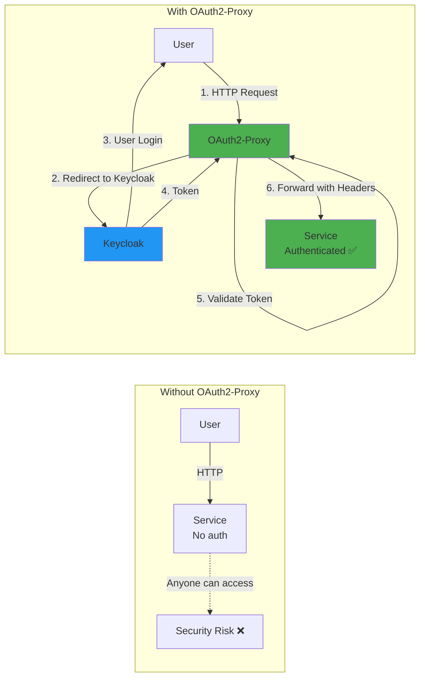
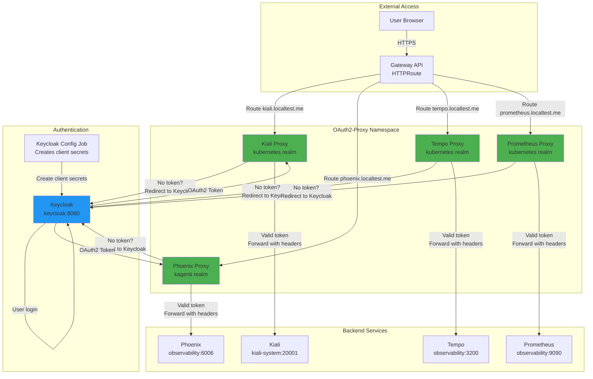

# OAuth2-Proxy: Authentication Layer for Services

**Version**: 1.0
**Last Updated**: 2025-11-12
**Status**: Production Ready
**Audience**: Platform Engineers, SRE, Developers

Complete guide to OAuth2-Proxy for adding Keycloak OIDC authentication to services that lack native authentication support in the Kagenti platform.

---

## Table of Contents

- [Overview](#overview)
- [What is OAuth2-Proxy?](#what-is-oauth2-proxy)
- [Why Use OAuth2-Proxy?](#why-use-oauth2-proxy)
- [Architecture](#architecture)
- [Installation](#installation)
- [Kagenti Integration](#kagenti-integration)
- [Configuration](#configuration)
- [Protected Services](#protected-services)
- [Security Features](#security-features)
- [Troubleshooting](#troubleshooting)
- [Alternatives](#alternatives)
- [Next Steps](#next-steps)
- [References](#references)

---

## Overview

**Purpose**: Provide a reverse proxy that adds Keycloak OIDC authentication to services that don't have native authentication support.

**What You Get**:
- ✅ Keycloak OIDC authentication for any HTTP service
- ✅ Cookie-based session management
- ✅ Email domain validation
- ✅ Group-based and role-based authorization
- ✅ HTTP header injection (user, groups, tokens)
- ✅ Automatic token refresh
- ✅ Health check endpoints (/ping, /ready)
- ✅ Works with Gateway API and HTTPRoute

**Key Benefit**: OAuth2-Proxy **decouples authentication from applications** - add SSO to any service (Prometheus, Tempo, Phoenix, Kiali) without modifying the service itself.

**Source**: Based on [OAuth2-Proxy Documentation](https://oauth2-proxy.github.io/oauth2-proxy/)

---

## What is OAuth2-Proxy?

**OAuth2-Proxy** is a reverse proxy and static file server that provides authentication using various OAuth 2.0 and OpenID Connect providers to validate user accounts by email, domain, or group membership.

### Core Concept



### Key Characteristics

1. **Reverse Proxy**: Sits in front of upstream services
2. **OIDC-Native**: Full OpenID Connect support with Keycloak
3. **Cookie-Based Sessions**: Stores session state in encrypted cookies
4. **Stateless**: No persistent storage required (sessions in cookies)
5. **Header Injection**: Adds authentication headers for upstream services

**Source**: [OAuth2-Proxy Overview](https://oauth2-proxy.github.io/oauth2-proxy/)

---

## Why Use OAuth2-Proxy?

### Without OAuth2-Proxy

**Security gap for services without authentication**:
```
Prometheus: http://prometheus:9090
❌ No authentication - anyone can query metrics
❌ No audit trail - can't track who accessed what
❌ Security risk - production data exposed

Phoenix: http://phoenix:6006
❌ No authentication - anyone can view LLM traces
❌ Potential data leak - prompts and responses exposed
❌ Compliance issue - no access control
```

**Manual solutions**:
- Configure each service separately (if supported)
- Maintain different auth mechanisms per service
- No centralized user management
- Difficult to enforce consistent policies

---

### With OAuth2-Proxy

**Centralized authentication for all services**:
```
Prometheus: https://prometheus.localtest.me:9443
✅ Keycloak SSO login
✅ Group-based access (kubernetes-admins only)
✅ Audit trail via Keycloak
✅ Automatic session refresh

Phoenix: https://phoenix.localtest.me:9443
✅ Keycloak SSO login (kagenti realm)
✅ Domain validation (*@company.com)
✅ Headers with user info
✅ Consistent auth across platform
```

**Benefits**:
- ✅ **No service modification** - works with any HTTP service
- ✅ **Centralized authentication** - Keycloak for all services
- ✅ **Consistent UX** - same login flow everywhere
- ✅ **Group/role authorization** - leverage Keycloak groups
- ✅ **Header injection** - pass user info to services
- ✅ **Cookie-based sessions** - stateless, no database
- ✅ **Automatic refresh** - tokens refreshed transparently

**Source**: [Why OAuth2-Proxy](https://oauth2-proxy.github.io/oauth2-proxy/)

---

## Architecture

### OAuth2-Proxy in Kagenti Platform

OAuth2-Proxy integrates with Keycloak and Gateway API to protect observability services:



**Authentication Flow**:

1. **User accesses protected service**: `https://kiali.localtest.me:9443`
2. **Gateway API routes to OAuth2-Proxy**: HTTPRoute forwards to proxy pod
3. **OAuth2-Proxy checks session cookie**: Valid? Forward. No? Redirect to Keycloak.
4. **Keycloak authentication**: User logs in with Keycloak credentials
5. **OAuth2-Proxy validates token**: Check groups/roles/email domain
6. **Create session cookie**: Encrypted cookie with token
7. **Forward to upstream**: Add authentication headers (X-Auth-Request-User, Authorization)

**Source**: [Kagenti OAuth2-Proxy Configuration](../../components/00-infrastructure/oauth2-proxy/)

---

## Installation

### Deploy OAuth2-Proxy in Kubernetes

OAuth2-Proxy is deployed per-service in the `oauth2-proxy` namespace:

**File**: `components/00-infrastructure/oauth2-proxy/`

**Deployment Structure**:
```
components/00-infrastructure/oauth2-proxy/
├── kustomization.yaml          # Main manifest
├── namespace.yaml              # oauth2-proxy namespace
├── kiali-proxy.yaml            # Kiali protection (kubernetes realm)
├── phoenix-proxy.yaml          # Phoenix protection (kagenti realm)
├── tempo-proxy.yaml            # Tempo protection (kubernetes realm)
├── prometheus-proxy.yaml       # Prometheus protection (kubernetes realm)
└── generate-secrets.sh         # Secret generation script
```

**Deploy**:
```bash
# Deploy OAuth2-Proxy (via ArgoCD or kubectl)
kubectl apply -k components/00-infrastructure/oauth2-proxy/

# Verify deployment
kubectl get pods -n oauth2-proxy

# Expected output:
# NAME                                   READY   STATUS    RESTARTS   AGE
# kiali-oauth2-proxy-xxx                 1/1     Running   0          1m
# phoenix-oauth2-proxy-xxx               1/1     Running   0          1m
# tempo-oauth2-proxy-xxx                 1/1     Running   0          1m
# prometheus-oauth2-proxy-xxx            1/1     Running   0          1m
```

**Source**: [OAuth2-Proxy Deployment Guide](https://oauth2-proxy.github.io/oauth2-proxy/deployment/)

---

### Prerequisites

Before deploying OAuth2-Proxy, ensure:

1. **Keycloak is deployed** and realms are configured:
   - `kubernetes` realm (for infrastructure services)
   - `kagenti` realm (for platform services)

2. **Keycloak clients are registered** for each service:
   - Client ID (e.g., `kiali`, `phoenix`)
   - Client secret (generated by Keycloak config job)
   - Redirect URIs configured

3. **Gateway API is configured** with HTTPS listener

4. **Client secrets are distributed** via Keycloak config job

**Source**: [Keycloak Integration Guide](./keycloak.md)

---

## Kagenti Integration

### Current OAuth2-Proxy Deployment

OAuth2-Proxy is deployed in Kagenti with the following configuration:

**Protected Services**:

| Service | Realm | Client ID | Redirect URL | Upstream |
|---------|-------|-----------|--------------|----------|
| **Kiali** | `kubernetes` | `kiali` | `https://kiali.localtest.me:9443/oauth2/callback` | `http://kiali.kiali-system:20001` |
| **Phoenix** | `kagenti` | `phoenix` | `https://phoenix.localtest.me:9443/oauth2/callback` | `http://phoenix.observability:6006` |
| **Tempo** | `kubernetes` | `tempo` | `https://tempo.localtest.me:9443/oauth2/callback` | `http://tempo.observability:3200` |
| **Prometheus** | `kubernetes` | `prometheus` | `https://prometheus.localtest.me:9443/oauth2/callback` | `http://prometheus.observability:9090` |

**Deployment Details**:
- **Namespace**: `oauth2-proxy`
- **Replicas**: 2 (per service, for HA)
- **Image**: `quay.io/oauth2-proxy/oauth2-proxy:v7.5.1`
- **Session Storage**: Cookie-based (no Redis/database required)
- **Access**: Via HTTPRoute (Gateway API)

---

### Secret Management

**Client secrets are created by Keycloak config job**:

```yaml
# components/00-infrastructure/keycloak/oauth2-secrets-job.yaml
apiVersion: batch/v1
kind: Job
metadata:
  name: keycloak-config
  namespace: keycloak
spec:
  template:
    spec:
      containers:
      - name: config
        command:
        - /bin/bash
        - -c
        - |
          # Create OAuth2-Proxy secrets for each service
          kubectl create secret generic keycloak-kiali-client-secret \
            --from-literal=client-secret=$KIALI_CLIENT_SECRET \
            -n oauth2-proxy --dry-run=client -o yaml | kubectl apply -f -

          kubectl create secret generic keycloak-phoenix-client-secret \
            --from-literal=client-secret=$PHOENIX_CLIENT_SECRET \
            -n oauth2-proxy --dry-run=client -o yaml | kubectl apply -f -

          # Cookie secret (shared across all proxies)
          kubectl create secret generic oauth2-proxy-secrets \
            --from-literal=cookie-secret=$(openssl rand -base64 32) \
            -n oauth2-proxy --dry-run=client -o yaml | kubectl apply -f -
```

**Secrets**:
1. **Client Secrets** (per service):
   - `keycloak-kiali-client-secret`
   - `keycloak-phoenix-client-secret`
   - `keycloak-tempo-client-secret`
   - `keycloak-prometheus-client-secret`

2. **Cookie Secret** (shared):
   - `oauth2-proxy-secrets` (cookie encryption key)

**Source**: [Kagenti Keycloak Config Job](../../components/00-infrastructure/keycloak/oauth2-secrets-job.yaml)

---

## Configuration

### Basic OAuth2-Proxy Configuration

**Example**: Kiali OAuth2-Proxy Deployment

**File**: `components/00-infrastructure/oauth2-proxy/kiali-proxy.yaml`

```yaml
apiVersion: apps/v1
kind: Deployment
metadata:
  name: kiali-oauth2-proxy
  namespace: oauth2-proxy
spec:
  replicas: 2
  selector:
    matchLabels:
      app: kiali-oauth2-proxy
  template:
    metadata:
      labels:
        app: kiali-oauth2-proxy
    spec:
      containers:
      - name: oauth2-proxy
        image: quay.io/oauth2-proxy/oauth2-proxy:v7.5.1
        args:
          # OIDC Provider (Keycloak)
          - --provider=oidc
          - --oidc-issuer-url=http://keycloak.keycloak.svc:8080/realms/kubernetes
          - --client-id=kiali
          - --client-secret=$(CLIENT_SECRET)
          - --redirect-url=https://kiali.localtest.me:9443/oauth2/callback

          # Skip issuer verification (internal cluster comms)
          - --insecure-oidc-skip-issuer-verification=true

          # Upstream service
          - --upstream=http://kiali.kiali-system.svc:20001

          # Cookie settings
          - --cookie-name=_oauth2_proxy_kiali
          - --cookie-secret=$(COOKIE_SECRET)
          - --cookie-secure=true
          - --cookie-httponly=true
          - --cookie-samesite=lax

          # Email validation
          - --email-domain=*

          # UX settings
          - --skip-provider-button=true

          # HTTP server
          - --http-address=0.0.0.0:4180

        env:
        - name: CLIENT_SECRET
          valueFrom:
            secretKeyRef:
              name: keycloak-kiali-client-secret
              key: client-secret
        - name: COOKIE_SECRET
          valueFrom:
            secretKeyRef:
              name: oauth2-proxy-secrets
              key: cookie-secret

        ports:
        - containerPort: 4180
          name: http

        livenessProbe:
          httpGet:
            path: /ping
            port: 4180
          initialDelaySeconds: 10

        readinessProbe:
          httpGet:
            path: /ping
            port: 4180
          initialDelaySeconds: 5
```

**Source**: [OAuth2-Proxy Configuration Reference](https://oauth2-proxy.github.io/oauth2-proxy/configuration/overview/)

---

### Configuration Options

#### Provider Settings

| Option | Value | Purpose |
|--------|-------|---------|
| `--provider` | `oidc` | Use generic OIDC provider (recommended over `keycloak`) |
| `--oidc-issuer-url` | `http://keycloak.keycloak.svc:8080/realms/kubernetes` | Keycloak realm OIDC endpoint |
| `--client-id` | `kiali` | Keycloak client ID |
| `--client-secret` | `$CLIENT_SECRET` | Client secret from Keycloak |
| `--redirect-url` | `https://kiali.localtest.me:9443/oauth2/callback` | OAuth2 callback URL |

**Note**: Use `provider=oidc` (generic OIDC) instead of `provider=keycloak` for better compatibility and automatic token refresh.

**Source**: [Keycloak OIDC Provider](https://oauth2-proxy.github.io/oauth2-proxy/configuration/providers/keycloak_oidc/)

---

#### Cookie Settings

| Option | Value | Purpose |
|--------|-------|---------|
| `--cookie-name` | `_oauth2_proxy_kiali` | Unique cookie name per service |
| `--cookie-secret` | `$COOKIE_SECRET` | Encryption key for cookie (base64, 32 bytes) |
| `--cookie-secure` | `true` | Only send cookie over HTTPS |
| `--cookie-httponly` | `true` | Prevent JavaScript access to cookie |
| `--cookie-samesite` | `lax` | CSRF protection |
| `--cookie-expire` | `168h` | Cookie lifetime (7 days default) |
| `--cookie-refresh` | `1h` | Refresh token every hour |

**Cookie Secret Generation**:
```bash
# Generate random 32-byte cookie secret
openssl rand -base64 32
```

**Source**: [Cookie Configuration](https://oauth2-proxy.github.io/oauth2-proxy/configuration/overview/#cookie-configuration)

---

#### Upstream Settings

| Option | Value | Purpose |
|--------|-------|---------|
| `--upstream` | `http://kiali.kiali-system.svc:20001` | Backend service URL |
| `--reverse-proxy` | `true` | Enable reverse proxy mode |
| `--pass-access-token` | `true` | Forward OAuth2 access token to upstream |
| `--pass-authorization-header` | `true` | Add Authorization header |
| `--set-authorization-header` | `true` | Set Authorization header with token |
| `--set-xauthrequest` | `true` | Add X-Auth-Request-* headers |

**Headers Injected**:
- `Authorization: Bearer <access_token>`
- `X-Auth-Request-User: user@example.com`
- `X-Auth-Request-Email: user@example.com`
- `X-Auth-Request-Groups: group1,group2`

**Source**: [Upstream Configuration](https://oauth2-proxy.github.io/oauth2-proxy/configuration/overview/#upstreams-configuration)

---

#### Security Settings

| Option | Value | Purpose |
|--------|-------|---------|
| `--email-domain` | `*` | Allow any email domain (or restrict to `yourcompany.com`) |
| `--skip-provider-button` | `true` | Auto-redirect to Keycloak (better UX) |
| `--insecure-oidc-skip-issuer-verification` | `true` | Skip issuer verification (internal cluster comms) |
| `--code-challenge-method` | `S256` | Enable PKCE for security |

**Production Recommendations**:
```yaml
# Restrict email domain
- --email-domain=yourcompany.com

# Enable PKCE (Proof Key for Code Exchange)
- --code-challenge-method=S256

# Skip issuer verification only for internal Keycloak
- --insecure-oidc-skip-issuer-verification=true  # OK for http://keycloak.keycloak.svc

# For external HTTPS Keycloak, remove this flag
```

**Source**: [Security Best Practices](https://oauth2-proxy.github.io/oauth2-proxy/configuration/overview/#security)

---

## Protected Services

OAuth2-Proxy protects platform services across two Keycloak realms:

### Kubernetes Realm (Infrastructure/Platform Services)

Services for platform operators and administrators:

#### Service 1: Kiali (Service Mesh Visualization)

**Configuration**: `kiali-proxy.yaml`

**Details**:
- **Realm**: `kubernetes` (infrastructure services)
- **Client ID**: `kiali`
- **Upstream**: `http://kiali.kiali-system.svc:20001`
- **Access URL**: `https://kiali.localtest.me:9443`

**HTTPRoute**:
```yaml
apiVersion: gateway.networking.k8s.io/v1
kind: HTTPRoute
metadata:
  name: kiali-authenticated
  namespace: oauth2-proxy
spec:
  parentRefs:
  - name: external-gateway
    namespace: default
    sectionName: https
  hostnames:
  - "kiali.localtest.me"
  rules:
  - matches:
    - path:
        type: PathPrefix
        value: /
    backendRefs:
    - name: kiali-oauth2-proxy
      port: 4180
```

**Access**:
```bash
# Open Kiali UI (protected by OAuth2-Proxy)
open https://kiali.localtest.me:9443

# You will be redirected to Keycloak kubernetes realm for login
# After login, you will be redirected back to Kiali
```

---

#### Service 2: Tempo (Distributed Tracing)

**Configuration**: `tempo-proxy.yaml`

**Details**:
- **Realm**: `kubernetes` (infrastructure services)
- **Client ID**: `tempo`
- **Upstream**: `http://tempo.observability.svc:3200`
- **Access URL**: `https://tempo.localtest.me:9443`

**Note**: Tempo's Jaeger query frontend is protected by OAuth2-Proxy, preventing unauthorized trace access.

---

#### Service 3: Prometheus (Metrics)

**Configuration**: `prometheus-proxy.yaml`

**Details**:
- **Realm**: `kubernetes` (infrastructure services)
- **Client ID**: `prometheus`
- **Upstream**: `http://prometheus.istio-system.svc:9090`
- **Access URL**: `https://prometheus.localtest.me:9443`

**Group-Based Authorization** (optional):
```yaml
# Restrict to kubernetes-admins group only
- --allowed-group=/kubernetes-admins
```

---

#### Service 4: Kubernetes Dashboard (Cluster Management)

**Configuration**: `k8s-dashboard-proxy.yaml`

**Details**:
- **Realm**: `kubernetes` (infrastructure services)
- **Client ID**: `k8s-dashboard`
- **Upstream**: `https://kubernetes-dashboard.kubernetes-dashboard.svc:443`
- **Access URL**: `https://kubernetes-dashboard.localtest.me:9443`

**Note**: Kubernetes Dashboard requires HTTPS upstream connection, so OAuth2-Proxy is configured with `--ssl-insecure-skip-verify=true` for self-signed certificates.

---

### Kagenti Realm (AI/Observability Services)

Services for AI developers and data scientists:

#### Service 5: Phoenix (LLM Observability)

**Configuration**: `phoenix-proxy.yaml`

**Details**:
- **Realm**: `kagenti` (AI platform services)
- **Client ID**: `phoenix`
- **Upstream**: `http://phoenix.observability.svc:6006`
- **Access URL**: `https://phoenix.localtest.me:9443`

**Key Differences**:
- Uses `kagenti` realm (different user set than infrastructure)
- Includes token forwarding headers for downstream services

**Additional Headers**:
```yaml
- --pass-access-token=true
- --pass-authorization-header=true
- --set-authorization-header=true
- --set-xauthrequest=true
```

**Use Case**: Phoenix may need user context to attribute LLM traces to specific users and teams.

---

### Not Protected (Native Keycloak OIDC)

These services implement their own Keycloak integration:

- **Grafana** - Uses native Keycloak Generic OAuth integration (see [Grafana Guide](../04-observability/grafana.md))
- **ArgoCD** - Uses native Keycloak OIDC integration
- **Keycloak** - Identity provider (no self-protection needed)

**Source**: [Kagenti OAuth2-Proxy Deployments](../../components/00-infrastructure/oauth2-proxy/)

---

## Security Features

### Cookie-Based Sessions

**How it Works**:
1. User logs in via Keycloak
2. OAuth2-Proxy receives OAuth2 tokens (access, refresh, ID tokens)
3. Tokens are encrypted and stored in HTTP cookie
4. Cookie is sent with every request
5. OAuth2-Proxy decrypts cookie to validate session

**Cookie Encryption**:
```yaml
# Cookie secret must be base64-encoded, 16/24/32 bytes
env:
- name: COOKIE_SECRET
  valueFrom:
    secretKeyRef:
      name: oauth2-proxy-secrets
      key: cookie-secret  # Generated: openssl rand -base64 32
```

**Cookie Security Flags**:
```yaml
- --cookie-secure=true      # HTTPS only
- --cookie-httponly=true    # No JavaScript access
- --cookie-samesite=lax     # CSRF protection
```

**Source**: [Cookie Configuration](https://oauth2-proxy.github.io/oauth2-proxy/configuration/overview/#cookie-configuration)

---

### Token Refresh

**Automatic Refresh**:
```yaml
# Refresh access token every hour (before expiry)
- --cookie-refresh=1h
```

**Workflow**:
1. User session cookie contains refresh token
2. Every hour, OAuth2-Proxy uses refresh token to get new access token
3. Updated tokens are re-encrypted in cookie
4. User session stays valid without re-login (up to `cookie-expire` duration)

**Benefit**: Users don't need to re-authenticate every time access token expires (typically 5-15 minutes).

**Source**: [Token Refresh](https://oauth2-proxy.github.io/oauth2-proxy/configuration/overview/#token-refresh)

---

### Group-Based Authorization

**Enable Group Authorization**:

1. **Create Client Scope in Keycloak** (`groups`):
   ```
   Keycloak Admin Console → Client Scopes → Create
   Name: groups
   Protocol: openid-connect
   Include in Token Scope: ON
   ```

2. **Add Group Membership Mapper**:
   ```
   Mapper Type: Group Membership
   Token Claim Name: groups
   Full Group Path: ON
   Add to ID Token: ON
   Add to Access Token: ON
   Add to Userinfo: ON
   ```

3. **Configure OAuth2-Proxy**:
   ```yaml
   # Allow only users in kubernetes-admins group
   - --allowed-group=/kubernetes-admins
   - --oidc-groups-claim=groups
   ```

**Example**:
```yaml
# Restrict Prometheus to admins only
apiVersion: apps/v1
kind: Deployment
metadata:
  name: prometheus-oauth2-proxy
spec:
  template:
    spec:
      containers:
      - name: oauth2-proxy
        args:
        - --provider=oidc
        - --oidc-issuer-url=http://keycloak.keycloak.svc:8080/realms/kubernetes
        - --allowed-group=/kubernetes-admins  # Only admins can access
        - --oidc-groups-claim=groups
```

**Source**: [Keycloak OIDC Groups](https://oauth2-proxy.github.io/oauth2-proxy/configuration/providers/keycloak_oidc/)

---

### Role-Based Authorization

**Enable Role Authorization**:

1. **Create Realm or Client Roles in Keycloak**:
   ```
   Keycloak Admin Console → Realm Roles → Add Role
   Name: prometheus-viewer
   Description: Can view Prometheus metrics
   ```

2. **Configure OAuth2-Proxy**:
   ```yaml
   # Realm role
   - --allowed-role=prometheus-viewer

   # Client role
   - --allowed-role=prometheus:admin
   ```

**Example**:
```yaml
# Allow users with prometheus-viewer realm role OR prometheus:admin client role
- --allowed-role=prometheus-viewer
- --allowed-role=prometheus:admin
```

**Source**: [Keycloak OIDC Roles](https://oauth2-proxy.github.io/oauth2-proxy/configuration/providers/keycloak_oidc/)

---

### Health Checks

**OAuth2-Proxy exposes health endpoints**:

| Endpoint | Purpose | HTTP Status |
|----------|---------|-------------|
| `/ping` | Liveness check | 200 OK |
| `/ready` | Readiness check | 200 OK (if OIDC provider reachable) |

**Kubernetes Probes**:
```yaml
livenessProbe:
  httpGet:
    path: /ping
    port: 4180
  initialDelaySeconds: 10
  periodSeconds: 10

readinessProbe:
  httpGet:
    path: /ping
    port: 4180
  initialDelaySeconds: 5
  periodSeconds: 5
```

**Source**: [Health Checks](https://oauth2-proxy.github.io/oauth2-proxy/)

---

## Troubleshooting

### Issue: Redirect Loop (Too Many Redirects)

**Symptoms**: Browser shows "This page isn't working - too many redirects" when accessing protected service.

**Diagnosis**:
```bash
# Check OAuth2-Proxy logs
kubectl logs -n oauth2-proxy -l app=kiali-oauth2-proxy

# Common errors:
# - "failed to verify id token: oidc: issuer did not match"
# - "failed to redeem code: ... 400 Bad Request"
```

**Fix 1: Incorrect Redirect URL**

**Problem**: Redirect URL in OAuth2-Proxy doesn't match Keycloak client configuration.

**Solution**:
```bash
# Check Keycloak client redirect URIs
kubectl exec -n keycloak deploy/keycloak -- \
  /opt/keycloak/bin/kcadm.sh get clients -r kubernetes --fields redirectUris,clientId

# Ensure redirect URI matches OAuth2-Proxy config
# OAuth2-Proxy: --redirect-url=https://kiali.localtest.me:9443/oauth2/callback
# Keycloak client: https://kiali.localtest.me:9443/oauth2/callback
```

**Fix 2: Cookie Domain Mismatch**

**Problem**: Cookie set for wrong domain.

**Solution**:
```yaml
# Explicitly set cookie domain
- --cookie-domain=.localtest.me
```

---

### Issue: 401 Unauthorized After Login

**Symptoms**: User logs in successfully but gets 401 when accessing service.

**Diagnosis**:
```bash
# Check OAuth2-Proxy logs for validation errors
kubectl logs -n oauth2-proxy -l app=kiali-oauth2-proxy | grep -i "unauthorized\|validation\|claim"

# Common errors:
# - "email not in allowed domains"
# - "user not in allowed group"
# - "user does not have required role"
```

**Fix 1: Email Domain Restriction**

**Problem**: User email domain not allowed.

**Solution**:
```yaml
# Allow all domains
- --email-domain=*

# Or specify allowed domains
- --email-domain=yourcompany.com
- --email-domain=contractor.com
```

**Fix 2: Missing Group Membership**

**Problem**: User not in required group.

**Solution**:
```bash
# Add user to group in Keycloak
kubectl exec -n keycloak deploy/keycloak -- \
  /opt/keycloak/bin/kcadm.sh add-group-member \
  -r kubernetes \
  --gname kubernetes-admins \
  --uusername user@example.com
```

---

### Issue: Session Expires Too Quickly

**Symptoms**: User has to re-login frequently (every 5-15 minutes).

**Diagnosis**:
```bash
# Check cookie expiration settings
kubectl get deployment -n oauth2-proxy kiali-oauth2-proxy -o yaml | grep cookie

# Check if cookie-refresh is enabled
```

**Fix**: Enable automatic token refresh:

```yaml
# Extend cookie lifetime and enable refresh
- --cookie-expire=168h       # 7 days
- --cookie-refresh=1h        # Refresh token every hour
```

**How it Works**:
- User session lasts 7 days (cookie-expire)
- Access token refreshed every hour (cookie-refresh)
- User doesn't need to re-login unless idle for 7 days

---

### Issue: OAuth2-Proxy Can't Reach Keycloak

**Symptoms**: OAuth2-Proxy logs show connection errors to Keycloak.

**Diagnosis**:
```bash
# Check OAuth2-Proxy can reach Keycloak
kubectl exec -n oauth2-proxy deploy/kiali-oauth2-proxy -- \
  curl -s http://keycloak.keycloak.svc:8080/realms/kubernetes/.well-known/openid-configuration

# Should return JSON with OIDC configuration
```

**Fix**:
```bash
# Check Keycloak service exists
kubectl get svc -n keycloak keycloak

# Check Keycloak pods are running
kubectl get pods -n keycloak

# Verify OIDC issuer URL is correct
# Should match: http://keycloak.keycloak.svc:8080/realms/<realm-name>
```

---

## Alternatives

### Alternative 1: Native Service Authentication

**Process**:
- Configure each service's built-in authentication (if available)
- Grafana has native Keycloak OIDC support
- Some services support OAuth2/OIDC natively

**Pros**:
- ✅ No additional proxy layer
- ✅ Native integration (may have better features)
- ✅ Simpler architecture

**Cons**:
- ❌ Not all services have authentication support
- ❌ Different configuration per service
- ❌ No consistent auth across platform
- ❌ Maintenance overhead (update each service separately)

**When to Use**: Service has robust native OAuth2/OIDC support (e.g., Grafana)

**Source**: [Grafana Keycloak OIDC](https://grafana.com/docs/grafana/latest/setup-grafana/configure-security/configure-authentication/keycloak/)

---

### Alternative 2: Istio AuthorizationPolicy + ext_authz

**Process**:
- Use Istio's external authorization (ext_authz) with OAuth2-Proxy or custom authz server
- Istio intercepts requests and calls authz service
- No per-service proxy needed

**Pros**:
- ✅ Service mesh integration
- ✅ Centralized policy enforcement
- ✅ No app-level changes

**Cons**:
- ❌ More complex setup
- ❌ Requires Istio service mesh
- ❌ Limited to services in mesh
- ❌ ext_authz performance overhead

**When to Use**: Already using Istio and need service mesh-level authorization

**Source**: [Istio External Authorization](https://istio.io/latest/docs/tasks/security/authorization/authz-custom/)

---

### Alternative 3: API Gateway (Kong, Ambassador)

**Process**:
- Use API gateway with OAuth2/OIDC plugin
- Gateway handles authentication before forwarding to services

**Pros**:
- ✅ Feature-rich (rate limiting, caching, etc.)
- ✅ Centralized management
- ✅ Plugin ecosystem

**Cons**:
- ❌ Additional infrastructure (gateway cluster)
- ❌ Vendor lock-in (Kong Enterprise, Ambassador)
- ❌ Higher resource usage
- ❌ Learning curve

**When to Use**: Need full API gateway features beyond authentication

**Source**: [Kong OIDC Plugin](https://docs.konghq.com/hub/kong-inc/openid-connect/)

---

### Alternative 4: Keycloak Gatekeeper (Deprecated)

**Process**:
- Use Keycloak's own proxy solution (now deprecated)

**Pros**:
- ✅ Official Keycloak solution

**Cons**:
- ❌ **DEPRECATED** - no longer maintained
- ❌ Use OAuth2-Proxy instead (actively maintained)

**When to Use**: Don't use - deprecated in favor of OAuth2-Proxy

**Source**: [Keycloak Gatekeeper Deprecation](https://www.keycloak.org/2022/02/adapter-deprecation)

---

## Next Steps

### For Development

1. **Add OAuth2-Proxy to a new service**:
   ```bash
   # Copy existing proxy configuration
   cp components/00-infrastructure/oauth2-proxy/kiali-proxy.yaml \
      components/00-infrastructure/oauth2-proxy/myservice-proxy.yaml

   # Edit configuration:
   # - Change service name
   # - Update upstream URL
   # - Update redirect URL
   # - Update HTTPRoute hostname
   ```

2. **Register Keycloak client**:
   ```bash
   # Add client to Keycloak realm import
   # components/00-infrastructure/keycloak/realms/kubernetes-realm.json
   ```

3. **Deploy and test**:
   ```bash
   kubectl apply -f components/00-infrastructure/oauth2-proxy/myservice-proxy.yaml
   open https://myservice.localtest.me:9443
   ```

### For Production

1. **Restrict email domains**:
   ```yaml
   - --email-domain=yourcompany.com
   ```

2. **Enable group/role authorization**:
   ```yaml
   - --allowed-group=/platform-admins
   - --allowed-role=service-viewer
   ```

3. **Enable PKCE**:
   ```yaml
   - --code-challenge-method=S256
   ```

4. **Configure session lifetime**:
   ```yaml
   - --cookie-expire=24h        # Daily login for production
   - --cookie-refresh=15m       # Refresh every 15 minutes
   ```

5. **Monitor OAuth2-Proxy**:
   ```bash
   # Add Prometheus ServiceMonitor
   # OAuth2-Proxy exposes metrics on /metrics
   ```

### Learn More

- [Keycloak SSO Guide](./keycloak.md) - Keycloak configuration and realms
- [Gateway API Guide](../01-infrastructure/gateway-api.md) - HTTPRoute configuration
- [Grafana OIDC](../04-observability/grafana.md) - Native Grafana Keycloak integration
- [Istio Security](../02-service-mesh/istio.md) - Service mesh authentication

---

## References

### Official Documentation

- **OAuth2-Proxy**: [oauth2-proxy.github.io](https://oauth2-proxy.github.io/oauth2-proxy/)
- **OAuth2-Proxy Configuration**: [Configuration Overview](https://oauth2-proxy.github.io/oauth2-proxy/configuration/overview/)
- **Keycloak OIDC Provider**: [Keycloak OIDC](https://oauth2-proxy.github.io/oauth2-proxy/configuration/providers/keycloak_oidc/)
- **OAuth2-Proxy GitHub**: [github.com/oauth2-proxy/oauth2-proxy](https://github.com/oauth2-proxy/oauth2-proxy)

### Integration Guides

- **Keycloak Integration**: [Pi Cluster SSO Guide](https://picluster.ricsanfre.com/docs/sso/)
- **Istio Integration**: [Keycloak with Istio](https://chrishaessig.medium.com/keycloak-with-istio-and-oauth2-proxy-65227a383c15)
- **RabbitMQ Example**: [RabbitMQ OAuth2-Proxy](https://www.rabbitmq.com/docs/oauth2-examples-proxy)

### Keycloak Documentation

- **Keycloak**: [www.keycloak.org](https://www.keycloak.org/documentation)
- **OIDC Protocol**: [OpenID Connect Spec](https://openid.net/specs/openid-connect-core-1_0.html)
- **OAuth 2.0**: [OAuth 2.0 Spec](https://oauth.net/2/)

### Internal Documentation

- **Main README**: [../../README.md](../../README.md)
- **Quick Start Guide**: [../00-getting-started/quick-start.md](../00-getting-started/quick-start.md)
- **Keycloak SSO**: [./keycloak.md](./keycloak.md)
- **Gateway API**: [../01-infrastructure/gateway-api.md](../01-infrastructure/gateway-api.md)

### Repository

- **GitHub**: [Ladas/kagenti-demo-deployment](https://github.com/Ladas/kagenti-demo-deployment)
- **OAuth2-Proxy Configuration**: `components/00-infrastructure/oauth2-proxy/`
- **Keycloak Configuration**: `components/00-infrastructure/keycloak/`

---

**Last Updated**: 2025-11-12
**Document Version**: 1.0
**Maintained By**: Platform Engineering Team
**License**: Apache 2.0
