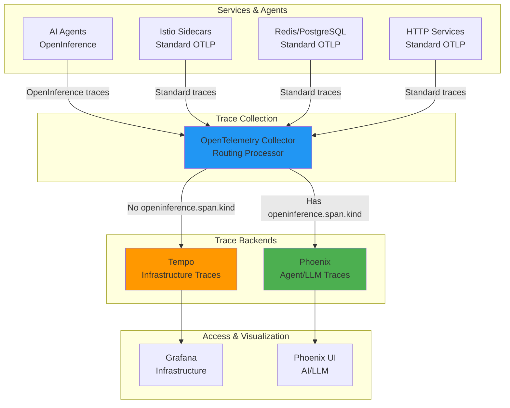

# Distributed Tracing: OpenTelemetry + Tempo + Phoenix

**Version**: 2.0
**Last Updated**: 2025-11-10
**Status**: Production Ready
**Audience**: Platform Engineers, SREs, Developers

Complete guide to the dual-backend distributed tracing architecture for infrastructure and application observability.

---

## Table of Contents

- [Overview](#overview)
- [What is Distributed Tracing?](#what-is-distributed-tracing)
- [Architecture](#architecture)
- [Components](#components)
- [Installation](#installation)
- [Configuration](#configuration)
- [Usage](#usage)
- [Instrumentation](#instrumentation)
- [Troubleshooting](#troubleshooting)
- [Alternatives](#alternatives)
- [Next Steps](#next-steps)
- [References](#references)

---

## Overview

**Purpose**: Provide end-to-end observability across infrastructure and AI agent execution with separate, specialized backends.

**What You Get**:
- ✅ Infrastructure tracing (Istio, Redis, PostgreSQL) via **Tempo**
- ✅ AI agent tracing (LLM calls, tool usage, reasoning) via **Phoenix**
- ✅ Automatic trace routing via **OpenTelemetry Collector**
- ✅ Unified instrumentation with OpenTelemetry standards
- ✅ Grafana integration for infrastructure traces
- ✅ Phoenix UI for AI-specific observability

**Key Benefit**: Separation of high-volume infrastructure traces from valuable AI agent traces enables:
- Better retention policies (short for infra, long for agents)
- Specialized UIs (Grafana for infra, Phoenix for LLM debugging)
- Reduced costs and improved query performance

**Source**: Based on [OpenTelemetry Specification](https://opentelemetry.io/docs/specs/otel/) and [W3C Trace Context](https://www.w3.org/TR/trace-context/)

---

## What is Distributed Tracing?

**Distributed tracing** tracks requests as they flow through multiple services in a distributed system, creating a complete picture of the request lifecycle.

### Core Concepts

| Concept | Description | Example |
|---------|-------------|---------|
| **Trace** | End-to-end journey of a request | User request → Agent → LLM → Database |
| **Span** | Single operation within a trace | LLM API call |
| **Context Propagation** | Passing trace ID across services | HTTP headers: `traceparent`, `tracestate` |
| **Sampling** | Selecting which traces to record | 10% of requests |

**Source**: [OpenTelemetry Tracing Concepts](https://opentelemetry.io/docs/concepts/signals/traces/)

### Why Distributed Tracing?

**Without Tracing**:
```
Agent failed!
❓ Which service caused the failure?
❓ How long did each step take?
❓ What was the LLM response?
```

**With Tracing**:
```
Agent Execution [trace_id: abc123]
├─ Agent Request (200ms)
├─ LLM Call (5s) ← Slow!
│  ├─ Prompt: "Analyze metrics..."
│  ├─ Tokens: 150 prompt, 75 completion
│  └─ Cost: $0.003
├─ Redis Query (10ms)
└─ PostgreSQL Query (50ms)

Total: 5.26s ✅ Root cause identified!
```

**Source**: [Why Distributed Tracing?](https://opentelemetry.io/docs/concepts/observability-primer/#distributed-tracing)

---

## Architecture

### Dual-Backend System

Kagenti uses **two specialized tracing backends** to optimize for different audiences and use cases:



**Source**: Architecture based on [OpenTelemetry Collector Routing](https://github.com/open-telemetry/opentelemetry-collector-contrib/tree/main/processor/routingprocessor)

### Backend Comparison

| Aspect | Tempo (Infrastructure) | Phoenix (AI Agents) |
|--------|------------------------|---------------------|
| **Audience** | SREs, Platform Engineers | Data Scientists, Developers |
| **Traces** | Istio, Redis, PostgreSQL, HTTP | Agent workflows, LLM calls, tool usage |
| **Volume** | Very high (every HTTP request) | Lower (agent executions) |
| **Retention** | 7-14 days | 30-90 days |
| **UI** | Grafana | Phoenix Web UI |
| **Specialization** | Service graphs, latency analysis | Prompts, tokens, costs, reasoning |
| **Query Language** | TraceQL | Phoenix Query API |

**Sources**:
- [Grafana Tempo Overview](https://grafana.com/docs/tempo/latest/)
- [Arize Phoenix Documentation](https://arize.com/docs/phoenix/)

### Trace Routing Logic

The OpenTelemetry Collector routes traces based on the presence of `openinference.span.kind` attribute:

```yaml
# Routing decision (pseudocode)
if span.attributes["openinference.span.kind"] exists:
  send_to: phoenix  # AI/Agent trace
else:
  send_to: tempo    # Infrastructure trace
```

**Source**: [OpenInference Specification](https://github.com/Arize-ai/openinference)

---

## Components

### 1. OpenTelemetry Collector

**Purpose**: Receive, process, and route traces to appropriate backends.

**Key Features**:
- Receives OTLP traces from all services
- Routing processor inspects `openinference.span.kind`
- Exports to Tempo and Phoenix simultaneously
- High availability with 2+ replicas

**Deployment**:
```
components/02-observability/otel-collector/
├── deployment.yaml       # Collector pods
├── service.yaml          # OTLP receivers (4317, 4318)
└── configmap.yaml        # Routing configuration
```

**Source**: [OpenTelemetry Collector Documentation](https://opentelemetry.io/docs/collector/)

---

### 2. Tempo (Infrastructure Backend)

**Purpose**: Store and query infrastructure-level traces (Istio, databases, HTTP).

**Key Features**:
- **Storage**: Parquet format (efficient compression)
- **Query**: TraceQL query language
- **Integration**: Native Grafana datasource
- **Cost**: Object storage support (S3, GCS, Azure)

**Why Tempo over Jaeger?**
- Better storage efficiency (50-70% reduction)
- Native Grafana integration (no separate UI)
- TraceQL is more powerful than Jaeger query language
- Cost-effective object storage backend

**Deployment**:
```
components/02-observability/tempo/
├── deployment.yaml       # Tempo monolithic mode
├── service.yaml          # Query endpoint
└── configmap.yaml        # Storage configuration
```

**Sources**:
- [Grafana Tempo Overview](https://grafana.com/docs/tempo/latest/)
- [TraceQL Query Language](https://grafana.com/docs/tempo/latest/traceql/)
- [Tempo vs Jaeger Comparison](https://grafana.com/blog/2020/10/27/why-we-created-tempo-a-massively-scalable-distributed-tracing-system/)

---

### 3. Phoenix (AI Backend)

**Purpose**: Store and analyze AI agent traces with LLM-specific observability.

**Key Features**:
- **LLM Metrics**: Token counts, costs, latency
- **Prompt Debugging**: View exact prompts and responses
- **Tool Tracing**: MCP server calls
- **Embedding Analysis**: Vector search debugging
- **Agent Reasoning**: Decision trees and workflows

**OpenInference Span Kinds**:

| Span Kind | Description | Example | Attributes |
|-----------|-------------|---------|------------|
| `CHAIN` | Multi-step workflow | Agent execution pipeline | `chain.name`, `chain.steps` |
| `LLM` | LLM request/response | GPT-4 API call | `llm.model_name`, `llm.token_count.*` |
| `TOOL` | Tool/function call | MCP server call | `tool.name`, `tool.parameters` |
| `AGENT` | Agent decision | Reasoning step | `agent.name`, `agent.decision` |
| `EMBEDDING` | Vector embedding | Text → vector | `embedding.model`, `embedding.dimensions` |
| `RETRIEVER` | RAG retrieval | Document search | `retriever.query`, `retriever.top_k` |

**Deployment**:
```
components/02-observability/phoenix/
├── deployment.yaml       # Phoenix server
├── service.yaml          # UI and API endpoints
└── configmap.yaml        # PostgreSQL backend
```

**Sources**:
- [Phoenix Documentation](https://arize.com/docs/phoenix/)
- [OpenInference Instrumentation](https://github.com/Arize-ai/openinference)
- [Phoenix Tracing Guide](https://arize.com/docs/phoenix/tracing/llm-traces)

---

## Installation

### Prerequisites

Ensure the following are deployed (via ArgoCD):
- ✅ OpenTelemetry Collector (`observability` namespace)
- ✅ Tempo (`observability` namespace)
- ✅ Phoenix (`observability` namespace)
- ✅ Grafana (`observability` namespace)
- ✅ Istio service mesh (`istio-system` namespace)

**Source**: [Quick Start Guide](../00-getting-started/quick-start.md)

### Verify Installation

```bash
# Check all observability components
kubectl get pods -n observability

# Expected output:
# NAME                               READY   STATUS
# otel-collector-<hash>              1/1     Running
# tempo-<hash>                       1/1     Running
# phoenix-<hash>                     1/1     Running
# grafana-<hash>                     1/1     Running

# Check services
kubectl get svc -n observability

# Expected: otel-collector (4317, 4318), tempo (3200), phoenix (6006)
```

**Source**: [Kubernetes Get Resources](https://kubernetes.io/docs/reference/kubectl/cheatsheet/#viewing-finding-resources)

---

## Configuration

### OpenTelemetry Collector Configuration

The routing configuration is in `components/02-observability/otel-collector/configmap.yaml`:

```yaml
receivers:
  otlp:
    protocols:
      grpc:
        endpoint: 0.0.0.0:4317  # Standard OTLP port
      http:
        endpoint: 0.0.0.0:4318  # HTTP OTLP port

processors:
  batch: {}  # Batch spans for efficiency

  routing:
    from_attribute: openinference.span.kind  # Route based on this attribute
    table:
      - value: ".*"          # Any openinference.span.kind value
        exporters: [otlp/phoenix]
    default_exporters: [otlp/tempo]  # No attribute → Tempo

exporters:
  otlp/tempo:
    endpoint: tempo.observability.svc.cluster.local:4317
    tls:
      insecure: true

  otlp/phoenix:
    endpoint: phoenix.observability.svc.cluster.local:6006
    tls:
      insecure: true

service:
  pipelines:
    traces:
      receivers: [otlp]
      processors: [batch, routing]
      exporters: [otlp/tempo, otlp/phoenix]  # Both backends
```

**Source**: [OTEL Collector Configuration](https://opentelemetry.io/docs/collector/configuration/)

---

### Istio Tracing Configuration

Istio automatically sends traces to OTEL Collector:

```yaml
# components/01-infrastructure/istio/configmap.yaml
apiVersion: v1
kind: ConfigMap
metadata:
  name: istio
  namespace: istio-system
data:
  mesh: |
    defaultConfig:
      tracing:
        zipkin:
          address: otel-collector.observability.svc.cluster.local:9411
        sampling: 10.0  # Sample 10% of requests
```

**Source**: [Istio Distributed Tracing](https://istio.io/latest/docs/tasks/observability/distributed-tracing/)

---

### Grafana Tempo Datasource

Add Tempo as a datasource in Grafana:

```yaml
# components/02-observability/grafana/datasources.yaml
apiVersion: 1
datasources:
  - name: Tempo
    type: tempo
    access: proxy
    url: http://tempo.observability.svc.cluster.local:3200
    jsonData:
      tracesToLogsV2:
        datasourceUid: loki  # Link traces to logs
      serviceMap:
        datasourceUid: prometheus  # Link to service graph
```

**Source**: [Grafana Tempo Datasource](https://grafana.com/docs/grafana/latest/datasources/tempo/)

---

## Usage

### Accessing Tempo Traces (Infrastructure)

#### Via Grafana UI

```bash
# Port-forward Grafana
kubectl port-forward svc/grafana -n observability 3000:80

# Access: http://localhost:3000
# Navigate to: Explore → Tempo datasource
```

**Query Examples**:

1. **Find slow requests**:
   ```traceql
   {duration > 5s}
   ```

2. **Find Redis errors**:
   ```traceql
   {resource.service.name = "redis" && status = error}
   ```

3. **Trace by ID**:
   ```traceql
   {trace.id = "abc123"}
   ```

**Source**: [TraceQL Examples](https://grafana.com/docs/tempo/latest/traceql/#example-traceql-queries)

---

### Accessing Phoenix Traces (AI Agents)

#### Via Phoenix UI

```bash
# Port-forward Phoenix
kubectl port-forward svc/phoenix -n observability 6006:6006

# Access: http://localhost:6006
```

**Phoenix UI Features**:
- **Projects**: Organize traces by application/agent
- **Traces**: View all agent executions
- **Spans**: Drill into individual LLM calls
- **Tokens**: Analyze token usage and costs
- **Prompts**: View exact prompts sent to LLMs
- **Evaluations**: Run evaluations on traces

**Source**: [Phoenix UI Guide](https://arize.com/docs/phoenix/quickstart#view-traces-in-the-ui)

---

## Instrumentation

### For Infrastructure Services (Standard OTLP)

Use standard OpenTelemetry SDKs. Traces automatically route to **Tempo**.

**Python Example**:

```python
from opentelemetry import trace
from opentelemetry.sdk.trace import TracerProvider
from opentelemetry.sdk.trace.export import BatchSpanProcessor
from opentelemetry.exporter.otlp.proto.grpc.trace_exporter import OTLPSpanExporter

# Setup tracer
trace.set_tracer_provider(TracerProvider())
tracer = trace.get_tracer(__name__)

# Configure OTLP exporter
otlp_exporter = OTLPSpanExporter(
    endpoint="otel-collector.observability.svc.cluster.local:4317",
    insecure=True
)
trace.get_tracer_provider().add_span_processor(
    BatchSpanProcessor(otlp_exporter)
)

# Instrument HTTP request (routes to Tempo)
with tracer.start_as_current_span("http_request") as span:
    span.set_attribute("http.method", "GET")
    span.set_attribute("http.url", "/api/users")
    # No openinference.span.kind → routes to Tempo
    response = requests.get("/api/users")
```

**Source**: [OpenTelemetry Python Instrumentation](https://opentelemetry.io/docs/instrumentation/python/)

---

### For AI Agents (OpenInference)

Use OpenInference SDK to ensure traces route to **Phoenix**.

**Python Example**:

```python
from openinference.instrumentation import using_attributes
from opentelemetry.exporter.otlp.proto.grpc.trace_exporter import OTLPSpanExporter
from opentelemetry.sdk.trace import TracerProvider
from opentelemetry.sdk.trace.export import BatchSpanProcessor
from opentelemetry import trace

# Setup tracer
trace.set_tracer_provider(TracerProvider())
otlp_exporter = OTLPSpanExporter(
    endpoint="otel-collector.observability.svc.cluster.local:4317",
    insecure=True
)
trace.get_tracer_provider().add_span_processor(
    BatchSpanProcessor(otlp_exporter)
)

# LLM call (routes to Phoenix)
with using_attributes(
    span_kind="LLM",
    llm={
        "model_name": "gpt-4",
        "provider": "openai",
    }
):
    response = openai.ChatCompletion.create(
        model="gpt-4",
        messages=[{"role": "user", "content": "Analyze metrics"}]
    )

# Tool call (routes to Phoenix)
with using_attributes(
    span_kind="TOOL",
    tool={
        "name": "prometheus-mcp",
        "description": "Query Prometheus metrics",
    }
):
    result = prometheus_mcp.query("up")
```

**Source**: [OpenInference Python Instrumentation](https://github.com/Arize-ai/openinference/tree/main/python/instrumentation)

---

### Auto-Instrumentation (Istio)

Istio service mesh automatically instruments HTTP requests. **No code changes needed!**

```yaml
# All services with Istio sidecar automatically send traces
apiVersion: v1
kind: Service
metadata:
  name: my-service
  labels:
    istio-injection: enabled  # Automatic tracing!
spec:
  selector:
    app: my-service
  ports:
    - port: 8080
```

**Source**: [Istio Automatic Tracing](https://istio.io/latest/docs/tasks/observability/distributed-tracing/overview/)

---

## Troubleshooting

### Issue: No Traces in Tempo

**Symptoms**: Grafana shows no traces in Tempo datasource

**Diagnosis**:

```bash
# Check OTEL Collector logs
kubectl logs -n observability -l app=otel-collector | grep tempo

# Expected: "Exporting traces to tempo"

# Check Tempo logs
kubectl logs -n observability -l app=tempo | grep "spans ingested"

# Expected: Span ingestion messages
```

**Common Causes**:
1. Istio not configured to send traces
2. OTEL Collector not receiving traces (port 4317/4318 blocked)
3. Tempo service unavailable

**Fix**:
```bash
# Verify Istio tracing config
kubectl get configmap istio -n istio-system -o yaml | grep tracing

# Restart OTEL Collector
kubectl rollout restart deployment/otel-collector -n observability
```

**Source**: [OTEL Collector Troubleshooting](https://opentelemetry.io/docs/collector/troubleshooting/)

---

### Issue: No Traces in Phoenix

**Symptoms**: Phoenix UI shows no traces

**Diagnosis**:

```bash
# Check OTEL Collector routing
kubectl logs -n observability -l app=otel-collector | grep phoenix

# Expected: "Routing to phoenix exporter"

# Check Phoenix logs
kubectl logs -n observability -l app=phoenix
```

**Common Causes**:
1. Missing `openinference.span.kind` attribute in agent code
2. Phoenix service unavailable
3. OTEL Collector routing misconfigured

**Fix**:

Ensure agent code uses OpenInference:

```python
# ❌ Wrong - goes to Tempo
with tracer.start_span("llm_call"):
    response = llm.call()

# ✅ Correct - goes to Phoenix
with using_attributes(span_kind="LLM"):
    response = llm.call()
```

**Source**: [Phoenix Tracing Setup](https://arize.com/docs/phoenix/tracing/how-to-tracing/setup-tracing)

---

### Issue: High Trace Volume / Cost

**Symptoms**: Too many traces, high storage costs

**Solution**: Implement sampling

```yaml
# OTEL Collector sampling (90% reduction)
processors:
  probabilistic_sampler:
    sampling_percentage: 10  # Keep 10% of traces

service:
  pipelines:
    traces:
      processors: [probabilistic_sampler, batch, routing]
```

**Alternative**: Tail-based sampling (keep only errors and slow traces):

```yaml
processors:
  tail_sampling:
    policies:
      - name: errors
        type: status_code
        status_code: {status_codes: [ERROR]}
      - name: slow
        type: latency
        latency: {threshold_ms: 5000}
```

**Sources**:
- [OTEL Probabilistic Sampling](https://github.com/open-telemetry/opentelemetry-collector-contrib/tree/main/processor/probabilisticsamplerprocessor)
- [OTEL Tail Sampling](https://github.com/open-telemetry/opentelemetry-collector-contrib/tree/main/processor/tailsamplingprocessor)

---

## Alternatives

### Alternative 1: Single Backend (Jaeger Only)

**Pros**:
- Simpler architecture (one backend)
- Well-established tool
- Native Kubernetes support

**Cons**:
- No LLM-specific features (prompts, tokens, costs)
- Higher storage costs (no Parquet compression)
- No separation of concerns (infra + agents mixed)

**When to Use**: If you don't need AI-specific observability.

**Source**: [Jaeger Documentation](https://www.jaegertracing.io/docs/)

---

### Alternative 2: Phoenix Only

**Pros**:
- Simplified if you only care about agents
- Great LLM observability

**Cons**:
- Not optimized for high-volume infrastructure traces
- No TraceQL support
- No service mesh integration

**When to Use**: Agent-only deployments without infrastructure tracing needs.

**Source**: [Phoenix Documentation](https://arize.com/docs/phoenix/)

---

### Alternative 3: Tempo + Jaeger (No Phoenix)

**Pros**:
- Both are infrastructure-focused
- Redundancy for failover

**Cons**:
- No AI-specific features
- Redundant backends (unnecessary)
- Higher operational complexity

**When to Use**: Not recommended. Use Tempo OR Jaeger, not both.

---

### Alternative 4: Commercial Solutions

**Options**:
- **Datadog APM**: Full-featured, expensive
- **New Relic**: Great UI, high cost
- **Honeycomb**: Excellent for complex queries
- **Lightstep**: Enterprise-grade tracing

**Pros**:
- Managed service (no ops burden)
- Advanced features and support

**Cons**:
- High cost ($$$)
- Vendor lock-in
- Data privacy concerns

**Source**: [Observability Tools Comparison](https://opentelemetry.io/ecosystem/vendors/)

---

## Next Steps

### For Development

1. **Instrument Your Agents**:
   - Add OpenInference to agent code
   - View traces in Phoenix UI
   - Analyze LLM costs and performance

2. **Explore Grafana**:
   - View infrastructure traces
   - Create service graphs
   - Link traces to logs and metrics

3. **Create Custom Dashboards**:
   - Review [Grafana Guide](./grafana.md) *(coming soon)*
   - Build dashboards with TraceQL queries
   - Set up alerts on trace metrics

### For Production

1. **Implement Sampling**:
   - Reduce trace volume (10-20% sampling)
   - Use tail-based sampling for critical traces
   - Review [OTEL Sampling Best Practices](https://opentelemetry.io/docs/specs/otel/trace/sdk/#sampling)

2. **Configure Retention**:
   - Tempo: 7-14 days (infrastructure)
   - Phoenix: 30-90 days (agents)
   - Archive important traces to object storage

3. **Set Up Alerts**:
   - Alert on high error rates in traces
   - Alert on slow traces (> 5s)
   - Review [Prometheus Integration](./prometheus.md) *(coming soon)*

---

## References

### Official Documentation

- **OpenTelemetry**: [opentelemetry.io/docs](https://opentelemetry.io/docs/)
- **W3C Trace Context**: [w3.org/TR/trace-context](https://www.w3.org/TR/trace-context/)
- **Grafana Tempo**: [grafana.com/docs/tempo](https://grafana.com/docs/tempo/latest/)
- **Arize Phoenix**: [arize.com/docs/phoenix](https://arize.com/docs/phoenix/)
- **TraceQL**: [grafana.com/docs/tempo/latest/traceql](https://grafana.com/docs/tempo/latest/traceql/)
- **OpenInference**: [github.com/Arize-ai/openinference](https://github.com/Arize-ai/openinference)

### Instrumentation Guides

- **Python OTEL**: [opentelemetry.io/docs/instrumentation/python](https://opentelemetry.io/docs/instrumentation/python/)
- **Python OpenInference**: [github.com/Arize-ai/openinference/tree/main/python](https://github.com/Arize-ai/openinference/tree/main/python/instrumentation)
- **Istio Tracing**: [istio.io/latest/docs/tasks/observability/distributed-tracing](https://istio.io/latest/docs/tasks/observability/distributed-tracing/)

### Internal Documentation

- **Main README**: [../README.md](../README.md)
- **Quick Start**: [../00-getting-started/quick-start.md](../00-getting-started/quick-start.md)
- **Grafana Guide**: [./grafana.md](./grafana.md) *(coming soon)*
- **Prometheus Guide**: [./prometheus.md](./prometheus.md) *(coming soon)*

### Old Documentation (Reference Only)

- **Tracing Architecture**: [../../old_docs/TRACING_ARCHITECTURE.md](../../old_docs/TRACING_ARCHITECTURE.md)

### Repository

- **GitHub**: [Ladas/kagenti-demo-deployment](https://github.com/Ladas/kagenti-demo-deployment)
- **Component Files**: [components/02-observability/](../../components/02-observability/)

---

**Last Updated**: 2025-11-10
**Document Version**: 2.0
**Maintained By**: Platform Engineering Team
**License**: Apache 2.0
