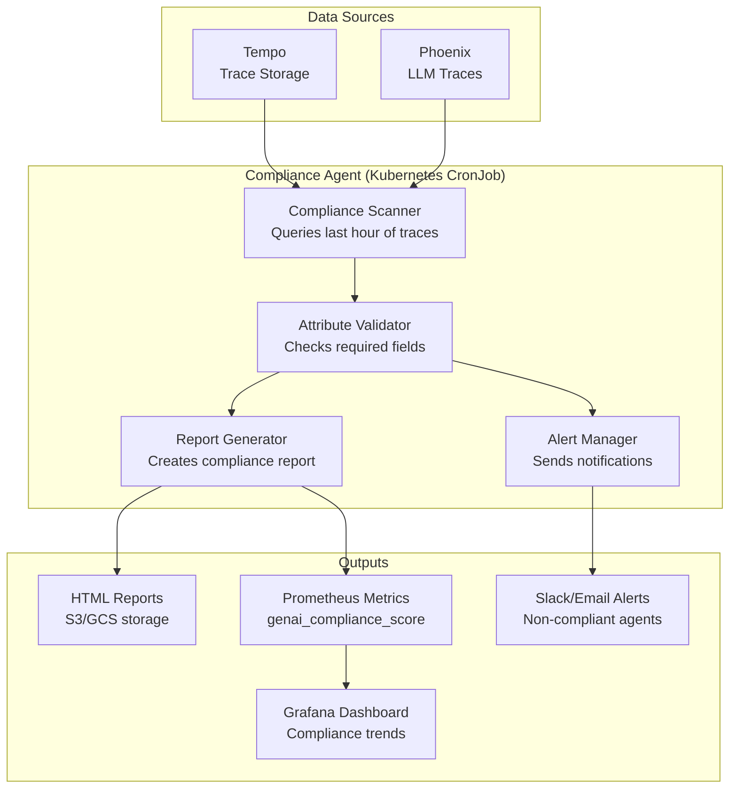

# OpenTelemetry GenAI Semantic Conventions

**Version**: 2.0
**Last Updated**: 2025-11-11
**Status**: Production Standard (REQUIRED for All Agents)
**Audience**: Agent Developers, Platform Engineers, SREs

Complete guide to OpenTelemetry Generative AI semantic conventions for the Kagenti platform. **All AI agents MUST comply 100% with these conventions.**

---

## Table of Contents

- [Overview](#overview)
- [Why GenAI Semantic Conventions Matter](#why-genai-semantic-conventions-matter)
- [Span Conventions](#span-conventions)
- [Metric Conventions](#metric-conventions)
- [Event Conventions](#event-conventions)
- [Agent-Specific Conventions](#agent-specific-conventions)
- [Compliance Requirements](#compliance-requirements)
- [Implementation Guide](#implementation-guide)
- [Validation & Monitoring](#validation--monitoring)
- [Compliance Agent Architecture](#compliance-agent-architecture)
- [Troubleshooting](#troubleshooting)
- [References](#references)

---

## Overview

**OpenTelemetry GenAI Semantic Conventions** provide standardized attributes, metrics, and events for observing Generative AI systems.

### What You Get

- ✅ **Standardized observability** across all LLM providers (OpenAI, Anthropic, Azure, Bedrock)
- ✅ **Consistent token tracking** (input/output tokens, costs)
- ✅ **Performance metrics** (latency, time-to-first-token, time-per-token)
- ✅ **Agent orchestration tracking** (multi-agent workflows, tool execution)
- ✅ **Automatic compliance validation** (via compliance agent)
- ✅ **Cross-platform correlation** (traces, logs, metrics)

**Source**: [OpenTelemetry GenAI Semantic Conventions](https://opentelemetry.io/docs/specs/semconv/gen-ai/)

### Stability Status

- **Current Version**: 1.38.0
- **Status**: Development (subject to change)
- **Opt-In**: Use `OTEL_SEMCONV_STABILITY_OPT_IN=genai` environment variable

**Source**: [OTEL SemConv Stability](https://opentelemetry.io/docs/specs/semconv/gen-ai/)

---

## Why GenAI Semantic Conventions Matter

### Without Conventions

```
Inconsistent observability:
- Agent A logs "tokens: 150"
- Agent B logs "token_count: 150"
- Agent C logs "input_tokens: 100, output_tokens: 50"
❌ Cannot aggregate token usage across agents
❌ Cannot compare latency across providers
❌ No standardized cost tracking
❌ Manual correlation required
```

### With Conventions

```
Standardized observability:
- All agents report gen_ai.usage.input_tokens
- All agents report gen_ai.usage.output_tokens
- All agents report gen_ai.operation.duration
✅ Aggregate token usage: SUM(gen_ai.usage.output_tokens)
✅ Compare latency: P95(gen_ai.client.operation.duration)
✅ Track costs: SUM(gen_ai.usage.output_tokens) * cost_per_token
✅ Automatic correlation via trace_id
```

---

## Span Conventions

### Span Naming Convention

**Format**: `{gen_ai.operation.name} {gen_ai.request.model}`

**Examples**:
```
chat gpt-4
chat claude-3-sonnet
embeddings text-embedding-ada-002
generate_content gemini-pro
```

**Source**: [GenAI Span Naming](https://opentelemetry.io/docs/specs/semconv/gen-ai/gen-ai-spans/)

---

### Required Span Attributes

| Attribute | Type | Description | Example |
|-----------|------|-------------|---------|
| `gen_ai.operation.name` | string | **REQUIRED**. Operation type | `chat`, `embeddings`, `text_completion` |
| `gen_ai.provider.name` | string | **REQUIRED**. AI service provider | `openai`, `anthropic`, `azure.ai.openai` |
| `gen_ai.request.model` | string | **REQUIRED**. Model identifier | `gpt-4`, `claude-3-sonnet-20240229` |

**Source**: [GenAI Span Attributes](https://opentelemetry.io/docs/specs/semconv/gen-ai/gen-ai-spans/)

---

### Optional but Recommended Span Attributes

#### Request Parameters

| Attribute | Type | Description | Example |
|-----------|------|-------------|---------|
| `gen_ai.request.temperature` | double | Sampling temperature | `0.7` |
| `gen_ai.request.max_tokens` | int | Max tokens to generate | `1024` |
| `gen_ai.request.top_p` | double | Nucleus sampling threshold | `0.9` |
| `gen_ai.request.frequency_penalty` | double | Repeat token reduction | `0.0` |
| `gen_ai.request.presence_penalty` | double | New topic encouragement | `0.6` |

#### Response Attributes

| Attribute | Type | Description | Example |
|-----------|------|-------------|---------|
| `gen_ai.response.finish_reasons` | string[] | Why generation stopped | `["stop"]`, `["length"]` |
| `gen_ai.usage.input_tokens` | int | **REQUIRED**. Prompt token count | `150` |
| `gen_ai.usage.output_tokens` | int | **REQUIRED**. Response token count | `87` |
| `gen_ai.response.model` | string | Actual model used | `gpt-4-0314` |

**Source**: [GenAI Response Attributes](https://opentelemetry.io/docs/specs/semconv/gen-ai/gen-ai-spans/)

---

### Prompt and Completion Capture

**Default**: Do NOT capture prompts/completions (privacy/cost)

**Optional Capture Methods**:

1. **Span Attributes** (for short prompts):
   ```python
   span.set_attribute("gen_ai.input.messages", json.dumps([
       {"role": "system", "content": "You are a helpful assistant"},
       {"role": "user", "content": "What is Kubernetes?"}
   ]))
   span.set_attribute("gen_ai.output.messages", json.dumps([
       {"role": "assistant", "content": "Kubernetes is..."}
   ]))
   ```

2. **Span Events** (for detailed capture):
   ```python
   span.add_event("gen_ai.client.inference.operation.details", {
       "gen_ai.input.messages": [...],
       "gen_ai.output.messages": [...]
   })
   ```

3. **External Storage** (for long prompts):
   ```python
   span.set_attribute("gen_ai.prompt.storage_url", "s3://prompts/abc123")
   ```

**Source**: [GenAI Content Capture](https://opentelemetry.io/docs/specs/semconv/gen-ai/gen-ai-spans/)

---

### Span Example (Complete)

```python
from opentelemetry import trace

tracer = trace.get_tracer(__name__)

with tracer.start_as_current_span(
    name="chat gpt-4",
    kind=trace.SpanKind.CLIENT
) as span:
    # Required attributes
    span.set_attribute("gen_ai.operation.name", "chat")
    span.set_attribute("gen_ai.provider.name", "openai")
    span.set_attribute("gen_ai.request.model", "gpt-4")

    # Request parameters
    span.set_attribute("gen_ai.request.temperature", 0.7)
    span.set_attribute("gen_ai.request.max_tokens", 1024)

    # Make LLM call
    response = openai.ChatCompletion.create(...)

    # Response attributes
    span.set_attribute("gen_ai.response.model", response.model)
    span.set_attribute("gen_ai.response.finish_reasons", [response.choices[0].finish_reason])
    span.set_attribute("gen_ai.usage.input_tokens", response.usage.prompt_tokens)
    span.set_attribute("gen_ai.usage.output_tokens", response.usage.completion_tokens)
```

---

## Metric Conventions

### Client Metrics

#### 1. Token Usage Histogram

```yaml
Name: gen_ai.client.token.usage
Type: Histogram
Unit: {token}
Description: Number of input and output tokens used
```

**Required Attributes**:
- `gen_ai.operation.name`
- `gen_ai.provider.name`
- `gen_ai.token.type` (values: `input`, `output`)

**Recommended Bucket Boundaries**: `[1, 4, 16, 64, 256, 1024, 4096, 16384, 65536, 262144, 1048576, 4194304, 16777216, 67108864]`

**Example**:
```python
token_histogram.record(
    response.usage.prompt_tokens,
    attributes={
        "gen_ai.operation.name": "chat",
        "gen_ai.provider.name": "openai",
        "gen_ai.token.type": "input"
    }
)
```

#### 2. Operation Duration Histogram

```yaml
Name: gen_ai.client.operation.duration
Type: Histogram
Unit: s (seconds)
Description: GenAI operation duration
```

**Required Attributes**:
- `gen_ai.operation.name`
- `gen_ai.provider.name`

**Recommended Bucket Boundaries**: `[0.01, 0.02, 0.04, 0.08, 0.16, 0.32, 0.64, 1.28, 2.56, 5.12, 10.24, 20.48, 40.96, 81.92]`

**Source**: [GenAI Metrics](https://opentelemetry.io/docs/specs/semconv/gen-ai/gen-ai-metrics/)

---

### Server Metrics (for LLM Serving)

#### 3. Request Duration

```yaml
Name: gen_ai.server.request.duration
Type: Histogram
Unit: s
Description: Generative AI server request duration
```

#### 4. Time to First Token

```yaml
Name: gen_ai.server.time_to_first_token
Type: Histogram
Unit: s
Description: Time to generate first token
```

**Recommended Bucket Boundaries**: `[0.001, 0.005, 0.01, 0.02, 0.04, 0.06, 0.08, 0.1, 0.25, 0.5, 0.75, 1.0, 2.5, 5.0, 7.5, 10.0]`

#### 5. Time Per Output Token

```yaml
Name: gen_ai.server.time_per_output_token
Type: Histogram
Unit: s
Description: Time per output token generated after the first token
```

**Recommended Bucket Boundaries**: `[0.01, 0.025, 0.05, 0.075, 0.1, 0.15, 0.2, 0.3, 0.4, 0.5, 0.75, 1.0, 2.5]`

**Source**: [GenAI Server Metrics](https://opentelemetry.io/docs/specs/semconv/gen-ai/gen-ai-metrics/)

---

## Event Conventions

### Event: Inference Operation Details

**Event Name**: `gen_ai.client.inference.operation.details`

**Purpose**: Capture detailed LLM request/response information

**Required Attributes**:
- `gen_ai.operation.name`

**Optional Attributes**:
- `gen_ai.input.messages` (array of message objects)
- `gen_ai.output.messages` (array of message objects)
- `gen_ai.system_instructions` (system prompt)
- `gen_ai.tool.definitions` (tool configurations)

**Example**:
```python
span.add_event("gen_ai.client.inference.operation.details", {
    "gen_ai.operation.name": "chat",
    "gen_ai.input.messages": json.dumps([
        {"role": "user", "content": "Explain Kubernetes"}
    ]),
    "gen_ai.output.messages": json.dumps([
        {"role": "assistant", "content": "Kubernetes is..."}
    ])
})
```

**Source**: [GenAI Events](https://opentelemetry.io/docs/specs/semconv/gen-ai/gen-ai-events/)

---

### Event: Evaluation Result

**Event Name**: `gen_ai.evaluation.result`

**Purpose**: Capture LLM output evaluation metrics

**Required Attributes**:
- `gen_ai.evaluation.name` (e.g., `"hallucination_score"`, `"toxicity"`)
- `gen_ai.evaluation.score` (numeric score)

**Example**:
```python
span.add_event("gen_ai.evaluation.result", {
    "gen_ai.evaluation.name": "hallucination_score",
    "gen_ai.evaluation.score": 0.15,
    "gen_ai.evaluation.threshold": 0.3,
    "gen_ai.evaluation.passed": True
})
```

**Source**: [GenAI Evaluation Events](https://opentelemetry.io/docs/specs/semconv/gen-ai/gen-ai-events/)

---

## Agent-Specific Conventions

### Agent Span Attributes

#### Required for Agent Spans

| Attribute | Type | Description | Example |
|-----------|------|-------------|---------|
| `gen_ai.operation.name` | string | **REQUIRED**. Agent operation | `invoke_agent`, `create_agent`, `execute_tool` |
| `gen_ai.provider.name` | string | **REQUIRED**. Framework/provider | `crewai`, `langchain`, `autogen` |

#### Conditionally Required

| Attribute | Type | Description | Example |
|-----------|------|-------------|---------|
| `gen_ai.agent.id` | string | Unique agent identifier | `research-agent-001` |
| `gen_ai.agent.name` | string | Agent name | `ResearchAgent` |
| `gen_ai.agent.description` | string | Agent purpose | `Performs web research and summarization` |
| `gen_ai.conversation.id` | string | Conversation/session ID | `conv-abc123` |

**Source**: [GenAI Agent Spans](https://opentelemetry.io/docs/specs/semconv/gen-ai/gen-ai-agent-spans/)

---

### Agent Operation Types

| Operation | Description | Span Kind |
|-----------|-------------|-----------|
| `create_agent` | Agent initialization | INTERNAL |
| `invoke_agent` | Agent execution | CLIENT or INTERNAL |
| `execute_tool` | Tool invocation within agent | CLIENT |

---

### Multi-Agent Coordination

**Track agent-to-agent communication**:

```python
with tracer.start_as_current_span(
    name="invoke_agent CodeAgent",
    kind=trace.SpanKind.CLIENT
) as span:
    span.set_attribute("gen_ai.operation.name", "invoke_agent")
    span.set_attribute("gen_ai.provider.name", "crewai")
    span.set_attribute("gen_ai.agent.id", "code-agent")
    span.set_attribute("gen_ai.agent.name", "CodeAgent")
    span.set_attribute("gen_ai.conversation.id", conversation_id)

    # Invoke agent
    result = code_agent.invoke(task)
```

**Source**: [GenAI Agent Coordination](https://opentelemetry.io/docs/specs/semconv/gen-ai/gen-ai-agent-spans/)

---

## Compliance Requirements

### Mandatory Requirements for Kagenti Agents

**All Kagenti agents MUST**:

1. ✅ **Use standardized span names**: `{gen_ai.operation.name} {gen_ai.request.model}`
2. ✅ **Include required attributes**:
   - `gen_ai.operation.name`
   - `gen_ai.provider.name`
   - `gen_ai.request.model`
   - `gen_ai.usage.input_tokens`
   - `gen_ai.usage.output_tokens`
3. ✅ **Record token usage metrics**: `gen_ai.client.token.usage`
4. ✅ **Record operation duration**: `gen_ai.client.operation.duration`
5. ✅ **Use predefined operation names**: `chat`, `embeddings`, `text_completion`, `invoke_agent`, `execute_tool`
6. ✅ **Use predefined provider names**: `openai`, `anthropic`, `azure.ai.openai`, `crewai`, `langchain`
7. ✅ **Include agent identification** (for agent operations):
   - `gen_ai.agent.id`
   - `gen_ai.agent.name`
8. ✅ **Propagate conversation context**: `gen_ai.conversation.id`
9. ✅ **Handle errors properly**: Include `error.type` when LLM call fails
10. ✅ **Respect privacy**: Do NOT capture prompts/completions by default

### Validation Frequency

- **Real-time**: OTEL Collector validates required attributes
- **Hourly**: Compliance agent scans last hour of traces
- **Daily**: Compliance report generated for all agents
- **CI/CD**: Pre-deployment compliance check

---

## Implementation Guide

### Python Implementation (OpenAI)

```python
# agent/llm_client.py
from opentelemetry import trace, metrics
from opentelemetry.semconv.gen_ai import GenAISemanticConventions as GenAI
import openai

tracer = trace.get_tracer(__name__)
meter = metrics.get_meter(__name__)

# Create metrics
token_histogram = meter.create_histogram(
    name="gen_ai.client.token.usage",
    description="Number of input and output tokens used",
    unit="{token}"
)

duration_histogram = meter.create_histogram(
    name="gen_ai.client.operation.duration",
    description="GenAI operation duration",
    unit="s"
)

def chat_completion(messages, model="gpt-4", temperature=0.7, max_tokens=1024):
    """
    Make OpenAI chat completion with full OTEL GenAI semantic conventions.
    """
    import time

    start_time = time.time()

    # Create span with proper naming
    with tracer.start_as_current_span(
        name=f"chat {model}",
        kind=trace.SpanKind.CLIENT
    ) as span:
        # REQUIRED attributes
        span.set_attribute("gen_ai.operation.name", "chat")
        span.set_attribute("gen_ai.provider.name", "openai")
        span.set_attribute("gen_ai.request.model", model)

        # Request parameters
        span.set_attribute("gen_ai.request.temperature", temperature)
        span.set_attribute("gen_ai.request.max_tokens", max_tokens)

        try:
            # Make API call
            response = openai.ChatCompletion.create(
                model=model,
                messages=messages,
                temperature=temperature,
                max_tokens=max_tokens
            )

            # REQUIRED response attributes
            span.set_attribute("gen_ai.response.model", response.model)
            span.set_attribute("gen_ai.response.finish_reasons",
                              [response.choices[0].finish_reason])
            span.set_attribute("gen_ai.usage.input_tokens",
                              response.usage.prompt_tokens)
            span.set_attribute("gen_ai.usage.output_tokens",
                              response.usage.completion_tokens)

            # Record metrics
            base_attributes = {
                "gen_ai.operation.name": "chat",
                "gen_ai.provider.name": "openai"
            }

            # Token usage metrics
            token_histogram.record(
                response.usage.prompt_tokens,
                attributes={**base_attributes, "gen_ai.token.type": "input"}
            )
            token_histogram.record(
                response.usage.completion_tokens,
                attributes={**base_attributes, "gen_ai.token.type": "output"}
            )

            # Duration metric
            duration = time.time() - start_time
            duration_histogram.record(duration, attributes=base_attributes)

            return response

        except Exception as e:
            # Error handling
            span.set_attribute("error.type", type(e).__name__)
            span.record_exception(e)
            raise

```

**Source**: Custom implementation following [GenAI Spans](https://opentelemetry.io/docs/specs/semconv/gen-ai/gen-ai-spans/)

---

### Python Implementation (CrewAI Agent)

```python
# agent/crew_agent.py
from opentelemetry import trace
from crewai import Agent, Task
import uuid

tracer = trace.get_tracer(__name__)

class InstrumentedAgent(Agent):
    """
    CrewAI Agent with full OTEL GenAI semantic conventions.
    """

    def __init__(self, *args, **kwargs):
        super().__init__(*args, **kwargs)
        self.agent_id = f"agent-{uuid.uuid4()}"

    def invoke(self, task: Task, conversation_id: str = None):
        """
        Invoke agent with full OTEL instrumentation.
        """
        conversation_id = conversation_id or f"conv-{uuid.uuid4()}"

        # Create agent invocation span
        with tracer.start_as_current_span(
            name=f"invoke_agent {self.name}",
            kind=trace.SpanKind.INTERNAL
        ) as span:
            # REQUIRED attributes
            span.set_attribute("gen_ai.operation.name", "invoke_agent")
            span.set_attribute("gen_ai.provider.name", "crewai")

            # REQUIRED for agent operations
            span.set_attribute("gen_ai.agent.id", self.agent_id)
            span.set_attribute("gen_ai.agent.name", self.name)
            span.set_attribute("gen_ai.agent.description", self.goal)
            span.set_attribute("gen_ai.conversation.id", conversation_id)

            # Execute task
            result = self.execute_task(task)

            return result

    def use_tool(self, tool_name: str, arguments: dict):
        """
        Execute tool with OTEL instrumentation.
        """
        with tracer.start_as_current_span(
            name=f"execute_tool {tool_name}",
            kind=trace.SpanKind.CLIENT
        ) as span:
            # REQUIRED attributes
            span.set_attribute("gen_ai.operation.name", "execute_tool")
            span.set_attribute("gen_ai.provider.name", "crewai")
            span.set_attribute("gen_ai.tool.name", tool_name)
            span.set_attribute("gen_ai.tool.call.arguments", str(arguments))

            # Execute tool
            result = super().use_tool(tool_name, arguments)

            return result
```

**Source**: Custom implementation following [GenAI Agent Spans](https://opentelemetry.io/docs/specs/semconv/gen-ai/gen-ai-agent-spans/)

---

## Validation & Monitoring

### Real-Time Validation (OTEL Collector)

**OTEL Collector Processor** to validate required attributes:

```yaml
# components/02-observability/otel-collector/config.yaml
processors:
  # GenAI Compliance Validator
  attributes/genai_validation:
    actions:
      # Validate required attributes exist
      - key: gen_ai.operation.name
        action: validate
        required: true

      - key: gen_ai.provider.name
        action: validate
        required: true

      # For chat/embeddings operations, require model
      - key: gen_ai.request.model
        action: validate
        required_if:
          - attribute: gen_ai.operation.name
            values: [chat, embeddings, text_completion]

      # For chat operations, require token usage
      - key: gen_ai.usage.input_tokens
        action: validate
        required_if:
          - attribute: gen_ai.operation.name
            values: [chat, text_completion]

      - key: gen_ai.usage.output_tokens
        action: validate
        required_if:
          - attribute: gen_ai.operation.name
            values: [chat, text_completion]

      # For agent operations, require agent.id
      - key: gen_ai.agent.id
        action: validate
        required_if:
          - attribute: gen_ai.operation.name
            values: [invoke_agent, create_agent]

  # Reject non-compliant spans
  filter/genai_compliance:
    spans:
      # Drop spans missing required attributes
      - 'attributes["gen_ai.operation.name"] == nil'
      - 'attributes["gen_ai.provider.name"] == nil'

service:
  pipelines:
    traces/genai:
      receivers: [otlp]
      processors: [attributes/genai_validation, filter/genai_compliance, batch]
      exporters: [otlp/tempo, otlp/phoenix, debug]
```

---

### Compliance Agent Architecture

**Purpose**: Automated compliance monitoring and reporting



---

### Compliance Agent Implementation

**File**: `components/03-compliance-agent/compliance-agent.py`

```python
#!/usr/bin/env python3
"""
GenAI Semantic Convention Compliance Agent

Scans traces from Tempo/Phoenix and validates compliance with
OpenTelemetry GenAI semantic conventions.

Runs as Kubernetes CronJob (hourly).
"""

from opentelemetry import trace
from opentelemetry.sdk.trace.export import ConsoleSpanExporter
import requests
import json
from datetime import datetime, timedelta
from collections import defaultdict
import structlog

logger = structlog.get_logger()

# Required attributes by operation type
REQUIRED_ATTRIBUTES = {
    "chat": [
        "gen_ai.operation.name",
        "gen_ai.provider.name",
        "gen_ai.request.model",
        "gen_ai.usage.input_tokens",
        "gen_ai.usage.output_tokens"
    ],
    "text_completion": [
        "gen_ai.operation.name",
        "gen_ai.provider.name",
        "gen_ai.request.model",
        "gen_ai.usage.input_tokens",
        "gen_ai.usage.output_tokens"
    ],
    "embeddings": [
        "gen_ai.operation.name",
        "gen_ai.provider.name",
        "gen_ai.request.model"
    ],
    "invoke_agent": [
        "gen_ai.operation.name",
        "gen_ai.provider.name",
        "gen_ai.agent.id",
        "gen_ai.agent.name"
    ],
    "execute_tool": [
        "gen_ai.operation.name",
        "gen_ai.provider.name",
        "gen_ai.tool.name"
    ]
}

class ComplianceAgent:
    def __init__(self, tempo_url="http://tempo.observability:3100"):
        self.tempo_url = tempo_url
        self.violations = defaultdict(list)
        self.compliant_spans = 0
        self.non_compliant_spans = 0

    def scan_traces(self, lookback_hours=1):
        """
        Scan traces from last N hours for compliance.
        """
        end_time = datetime.now()
        start_time = end_time - timedelta(hours=lookback_hours)

        logger.info("Starting compliance scan",
                   start_time=start_time.isoformat(),
                   end_time=end_time.isoformat())

        # Query Tempo for GenAI traces
        query = {
            "start": int(start_time.timestamp()),
            "end": int(end_time.timestamp()),
            "tags": {
                "gen_ai.operation.name": "*"  # All GenAI operations
            }
        }

        response = requests.get(
            f"{self.tempo_url}/api/search",
            params=query
        )

        traces = response.json().get("traces", [])
        logger.info(f"Found {len(traces)} GenAI traces to validate")

        for trace in traces:
            self.validate_trace(trace)

        return self.generate_report()

    def validate_trace(self, trace):
        """
        Validate a single trace for compliance.
        """
        trace_id = trace.get("traceID")

        for span in trace.get("spans", []):
            self.validate_span(span, trace_id)

    def validate_span(self, span, trace_id):
        """
        Validate a single span for compliance.
        """
        span_id = span.get("spanID")
        attributes = span.get("tags", {})

        # Get operation name
        operation = attributes.get("gen_ai.operation.name")

        if not operation:
            # Not a GenAI span, skip
            return

        # Get required attributes for this operation
        required = REQUIRED_ATTRIBUTES.get(operation, [])

        # Check for missing attributes
        missing_attributes = []
        for attr in required:
            if attr not in attributes:
                missing_attributes.append(attr)

        if missing_attributes:
            self.non_compliant_spans += 1
            violation = {
                "trace_id": trace_id,
                "span_id": span_id,
                "span_name": span.get("operationName"),
                "operation": operation,
                "service_name": span.get("process", {}).get("serviceName"),
                "missing_attributes": missing_attributes,
                "timestamp": span.get("startTime")
            }
            self.violations[operation].append(violation)

            logger.warn("Non-compliant span detected",
                       trace_id=trace_id,
                       span_id=span_id,
                       operation=operation,
                       missing_attributes=missing_attributes)
        else:
            self.compliant_spans += 1

            # Validate span naming convention
            expected_name_prefix = operation
            actual_name = span.get("operationName", "")

            if not actual_name.startswith(expected_name_prefix):
                violation = {
                    "trace_id": trace_id,
                    "span_id": span_id,
                    "violation_type": "incorrect_span_name",
                    "expected_prefix": expected_name_prefix,
                    "actual_name": actual_name
                }
                self.violations["naming"].append(violation)

    def generate_report(self):
        """
        Generate compliance report.
        """
        total_spans = self.compliant_spans + self.non_compliant_spans
        compliance_rate = (self.compliant_spans / total_spans * 100) if total_spans > 0 else 100.0

        report = {
            "timestamp": datetime.now().isoformat(),
            "summary": {
                "total_genai_spans": total_spans,
                "compliant_spans": self.compliant_spans,
                "non_compliant_spans": self.non_compliant_spans,
                "compliance_rate": compliance_rate
            },
            "violations_by_operation": {
                op: len(viols) for op, viols in self.violations.items()
            },
            "violations": dict(self.violations)
        }

        logger.info("Compliance scan complete",
                   compliance_rate=f"{compliance_rate:.2f}%",
                   total_spans=total_spans,
                   violations=self.non_compliant_spans)

        # Export Prometheus metrics
        self.export_metrics(report)

        # Send alerts if compliance < 95%
        if compliance_rate < 95.0:
            self.send_alerts(report)

        # Save report to file/S3
        self.save_report(report)

        return report

    def export_metrics(self, report):
        """
        Export compliance metrics to Prometheus.
        """
        # TODO: Push to Prometheus Pushgateway
        metrics = f"""
# HELP genai_compliance_rate GenAI semantic convention compliance rate
# TYPE genai_compliance_rate gauge
genai_compliance_rate {report['summary']['compliance_rate']}

# HELP genai_compliant_spans_total Total compliant GenAI spans
# TYPE genai_compliant_spans_total counter
genai_compliant_spans_total {report['summary']['compliant_spans']}

# HELP genai_non_compliant_spans_total Total non-compliant GenAI spans
# TYPE genai_non_compliant_spans_total counter
genai_non_compliant_spans_total {report['summary']['non_compliant_spans']}
"""

        # Push to Prometheus Pushgateway
        requests.post(
            "http://prometheus-pushgateway.observability:9091/metrics/job/compliance-agent",
            data=metrics
        )

    def send_alerts(self, report):
        """
        Send alerts for non-compliance.
        """
        compliance_rate = report['summary']['compliance_rate']

        # Slack webhook
        slack_payload = {
            "text": f"⚠️ GenAI Compliance Alert: {compliance_rate:.1f}%",
            "attachments": [{
                "color": "warning" if compliance_rate < 90 else "danger",
                "fields": [
                    {"title": "Compliant Spans", "value": str(report['summary']['compliant_spans']), "short": True},
                    {"title": "Non-Compliant Spans", "value": str(report['summary']['non_compliant_spans']), "short": True}
                ]
            }]
        }

        # Send to Slack
        # requests.post(SLACK_WEBHOOK_URL, json=slack_payload)

        logger.warn("Compliance alert sent", compliance_rate=compliance_rate)

    def save_report(self, report):
        """
        Save compliance report to file/S3.
        """
        filename = f"compliance-report-{datetime.now().strftime('%Y%m%d-%H%M%S')}.json"

        with open(f"/reports/{filename}", "w") as f:
            json.dump(report, f, indent=2)

        logger.info("Compliance report saved", filename=filename)


if __name__ == "__main__":
    agent = ComplianceAgent()
    report = agent.scan_traces(lookback_hours=1)

    print(json.dumps(report, indent=2))
```

---

### Compliance CronJob Deployment

**File**: `components/03-compliance-agent/cronjob.yaml`

```yaml
apiVersion: batch/v1
kind: CronJob
metadata:
  name: genai-compliance-agent
  namespace: observability
spec:
  # Run every hour
  schedule: "0 * * * *"
  concurrencyPolicy: Forbid
  successfulJobsHistoryLimit: 24
  failedJobsHistoryLimit: 3
  jobTemplate:
    spec:
      template:
        metadata:
          labels:
            app: compliance-agent
        spec:
          restartPolicy: OnFailure
          containers:
          - name: compliance-agent
            image: kagenti/compliance-agent:latest
            env:
            - name: TEMPO_URL
              value: "http://tempo-query-frontend.observability:3100"
            - name: LOOKBACK_HOURS
              value: "1"
            - name: SLACK_WEBHOOK_URL
              valueFrom:
                secretKeyRef:
                  name: compliance-agent-secrets
                  key: slack-webhook-url
            volumeMounts:
            - name: reports
              mountPath: /reports
          volumes:
          - name: reports
            persistentVolumeClaim:
              claimName: compliance-reports-pvc
```

---

### Grafana Dashboard for Compliance

**Dashboard**: GenAI Semantic Convention Compliance

**Panels**:

1. **Compliance Rate (Gauge)**:
   ```promql
   genai_compliance_rate
   ```

2. **Compliant vs Non-Compliant Spans (Time Series)**:
   ```promql
   rate(genai_compliant_spans_total[5m])
   rate(genai_non_compliant_spans_total[5m])
   ```

3. **Violations by Operation Type (Bar Chart)**:
   ```promql
   sum by (operation) (genai_non_compliant_spans_total)
   ```

4. **Recent Violations (Table)**:
   - Query Tempo directly for non-compliant spans
   - Show: trace_id, span_id, service_name, missing_attributes

---

## Troubleshooting

### Issue: Spans Missing Required Attributes

**Symptoms**: Compliance agent reports missing `gen_ai.usage.input_tokens`

**Diagnosis**:
```bash
# Query Tempo for non-compliant spans
curl -G "http://tempo.observability:3100/api/search" \
  --data-urlencode 'q={gen_ai.operation.name="chat"}' \
  | jq '.traces[].spans[] | select(.tags."gen_ai.usage.input_tokens" == null)'
```

**Common Causes**:
1. Agent not using OTEL GenAI instrumentation library
2. LLM provider doesn't return token counts
3. Exception thrown before setting attributes

**Fix**:
```python
# Always set token usage, even if API doesn't return it
if hasattr(response.usage, 'prompt_tokens'):
    span.set_attribute("gen_ai.usage.input_tokens", response.usage.prompt_tokens)
else:
    # Estimate tokens if not provided
    estimated_tokens = len(prompt.split()) * 1.3
    span.set_attribute("gen_ai.usage.input_tokens", int(estimated_tokens))
```

---

### Issue: Incorrect Span Names

**Symptoms**: Compliance report shows "incorrect_span_name" violations

**Diagnosis**:
```bash
# Check span names in Tempo
curl -G "http://tempo.observability:3100/api/search" \
  --data-urlencode 'q={gen_ai.operation.name="chat"}' \
  | jq '.traces[].spans[].operationName'
```

**Expected**: `chat gpt-4`, `chat claude-3-sonnet`
**Wrong**: `OpenAI Chat`, `llm_call`, `generate_response`

**Fix**:
```python
# Correct span naming
model = "gpt-4"
operation = "chat"

with tracer.start_as_current_span(
    name=f"{operation} {model}",  # CORRECT
    kind=trace.SpanKind.CLIENT
) as span:
    ...
```

---

## References

### Official Documentation

- **GenAI Semantic Conventions**: [opentelemetry.io/docs/specs/semconv/gen-ai](https://opentelemetry.io/docs/specs/semconv/gen-ai/)
- **GenAI Spans**: [opentelemetry.io/docs/specs/semconv/gen-ai/gen-ai-spans](https://opentelemetry.io/docs/specs/semconv/gen-ai/gen-ai-spans/)
- **GenAI Metrics**: [opentelemetry.io/docs/specs/semconv/gen-ai/gen-ai-metrics](https://opentelemetry.io/docs/specs/semconv/gen-ai/gen-ai-metrics/)
- **GenAI Events**: [opentelemetry.io/docs/specs/semconv/gen-ai/gen-ai-events](https://opentelemetry.io/docs/specs/semconv/gen-ai/gen-ai-events/)
- **GenAI Agent Spans**: [opentelemetry.io/docs/specs/semconv/gen-ai/gen-ai-agent-spans](https://opentelemetry.io/docs/specs/semconv/gen-ai/gen-ai-agent-spans/)

### Implementation Libraries

- **OpenTelemetry Python**: [github.com/open-telemetry/opentelemetry-python](https://github.com/open-telemetry/opentelemetry-python)
- **OpenTelemetry Python Contrib**: [github.com/open-telemetry/opentelemetry-python-contrib](https://github.com/open-telemetry/opentelemetry-python-contrib)
- **OpenInference**: [github.com/Arize-ai/openinference](https://github.com/Arize-ai/openinference)

### Internal Documentation

- **Main README**: [../../README.md](../../README.md)
- **Distributed Tracing Guide**: [./distributed-tracing.md](./distributed-tracing.md)
- **Grafana Dashboards**: [./grafana.md](./grafana.md)
- **Prometheus Metrics**: [./prometheus.md](./prometheus.md)
- **Loki Logs**: [./loki.md](./loki.md)
- **TODO Tracing**: [../../TODO_TRACING.md](../../TODO_TRACING.md)

### Repository

- **GitHub**: [Ladas/kagenti-demo-deployment](https://github.com/Ladas/kagenti-demo-deployment)
- **Compliance Agent**: `components/03-compliance-agent/`

---

**Last Updated**: 2025-11-11
**Document Version**: 2.0
**Maintained By**: Platform Engineering Team
**License**: Apache 2.0
