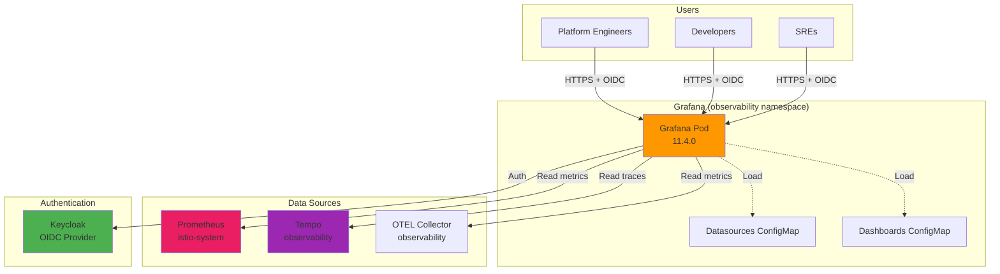
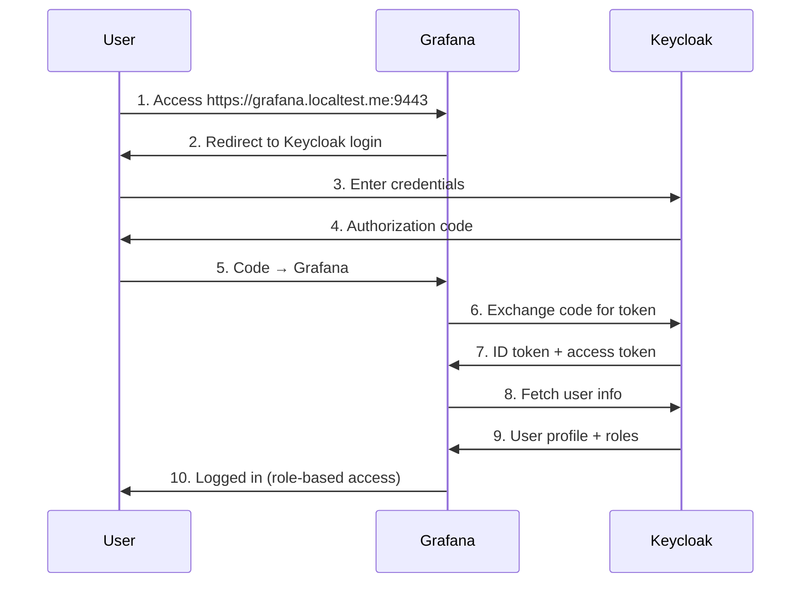

# Grafana: Metrics Visualization & Dashboards

**Version**: 2.0
**Last Updated**: 2025-11-11
**Status**: Production Ready
**Audience**: Platform Engineers, SREs, Developers

Complete guide to Grafana deployment, datasource configuration, dashboard management, and Keycloak OIDC integration for the Kagenti platform.

---

## Table of Contents

- [Overview](#overview)
- [What is Grafana?](#what-is-grafana)
- [Architecture](#architecture)
- [Installation](#installation)
- [Datasource Configuration](#datasource-configuration)
- [Dashboard Management](#dashboard-management)
- [Keycloak OIDC Integration](#keycloak-oidc-integration)
- [Custom Dashboards](#custom-dashboards)
- [Alerting](#alerting)
- [Troubleshooting](#troubleshooting)
- [Alternatives](#alternatives)
- [Next Steps](#next-steps)
- [References](#references)

---

## Overview

**Purpose**: Provide unified visualization and monitoring dashboards for metrics, traces, and logs across the Kagenti platform.

**What You Get**:
- ✅ Metrics visualization from Prometheus
- ✅ Distributed tracing via Tempo datasource
- ✅ Pre-configured dashboards (Kubernetes, agents, LLM metrics)
- ✅ Keycloak SSO integration (OIDC)
- ✅ Role-based access control (Admin/Editor/Viewer)
- ✅ Custom dashboard creation and import
- ✅ Alerting with notification channels

**Key Benefit**: Grafana provides a single pane of glass for all observability data—metrics, traces, and logs—with powerful querying capabilities and beautiful visualizations.

**Source**: Based on [Grafana Documentation](https://grafana.com/docs/grafana/latest/)

---

## What is Grafana?

**Grafana** is an open-source analytics and monitoring platform that visualizes metrics, logs, and traces from multiple data sources.

### Core Concepts

| Concept | Description | Example |
|---------|-------------|---------|
| **Dashboard** | Collection of panels showing visualizations | Kubernetes cluster overview |
| **Panel** | Single visualization (graph, gauge, table) | CPU usage graph |
| **Datasource** | Backend source of data | Prometheus, Tempo, Loki |
| **Query** | Request for specific data | `rate(http_requests_total[5m])` |
| **Variable** | Dynamic value in dashboards | Namespace selector |
| **Annotation** | Event marker on graphs | Deployment timestamp |

**Source**: [Grafana Fundamentals](https://grafana.com/docs/grafana/latest/fundamentals/)

### Why Grafana?

**Without Grafana**:
```
Metrics scattered across:
- Prometheus web UI (basic graphs)
- Tempo CLI (JSON traces)
- kubectl logs (raw text)
❌ No correlation between metrics and traces
❌ No historical comparison
❌ No alerting
❌ No role-based access
```

**With Grafana**:
```
Unified Platform:
- Metrics + Traces + Logs in one place
- Link from metric spike → trace → logs
- Compare current vs previous week
- Alert on SLO violations
- Role-based dashboards (Admin/Editor/Viewer)
✅ Single source of truth for observability
```

**Source**: [Why Use Grafana?](https://grafana.com/grafana/)

---

## Architecture

### Grafana in Kagenti Platform



**Source**: [Grafana Architecture](https://grafana.com/docs/grafana/latest/setup-grafana/set-up-grafana/)

### Component Roles

| Component | Type | Purpose | Location |
|-----------|------|---------|----------|
| **Grafana Pod** | Visualization | Dashboard rendering, query execution | `observability` namespace |
| **Datasources ConfigMap** | Configuration | Prometheus, Tempo, OTEL endpoints | Mounted to `/etc/grafana/provisioning/datasources` |
| **Dashboards ConfigMap** | Configuration | Pre-configured dashboard JSONs | Mounted to `/etc/grafana/dashboards` |
| **Keycloak OIDC** | Authentication | SSO and role mapping | `kubernetes` realm |

**Source**: [Grafana Provisioning](https://grafana.com/docs/grafana/latest/administration/provisioning/)

---

## Installation

### Prerequisites

Ensure the following are deployed:
- ✅ Prometheus (istio-system namespace)
- ✅ Tempo (observability namespace)
- ✅ OTEL Collector (observability namespace)
- ✅ Keycloak (keycloak namespace)
- ✅ Istio Gateway (for HTTPRoute)

**Source**: [Quick Start Guide](../00-getting-started/quick-start.md)

### Deployment via ArgoCD

Grafana is deployed via ArgoCD as part of the observability layer:

```bash
# Sync observability layer
argocd app sync observability

# Wait for Grafana to be ready
kubectl wait --for=condition=ready pod -l app=grafana -n observability --timeout=300s

# Check Grafana pod
kubectl get pods -n observability -l app=grafana

# Expected output:
# NAME                       READY   STATUS
# grafana-<hash>             1/1     Running
```

**Source**: [ArgoCD GitOps Guide](../01-infrastructure/argocd.md)

---

### Manual Deployment (Development)

For local development without ArgoCD:

```bash
# Deploy Grafana
kubectl apply -f components/02-observability/grafana/

# Wait for pod to be ready
kubectl wait --for=condition=ready pod -l app=grafana -n observability --timeout=300s

# Port-forward to access UI
kubectl port-forward svc/grafana -n observability 3000:3000

# Access: http://localhost:3000
# Default credentials: admin / admin
```

**Source**: [Kubernetes Deployments](https://kubernetes.io/docs/concepts/workloads/controllers/deployment/)

---

## Datasource Configuration

### Overview

Datasources define where Grafana fetches data from. Kagenti configures datasources via ConfigMap for GitOps management.

**File**: `components/02-observability/grafana/datasources-configmap.yaml`

```yaml
apiVersion: v1
kind: ConfigMap
metadata:
  name: grafana-datasources
  namespace: observability
data:
  datasources.yaml: |
    apiVersion: 1
    datasources:
      # Prometheus (metrics)
      - name: Prometheus
        type: prometheus
        access: proxy  # Grafana backend proxies requests
        url: http://prometheus.istio-system:9090
        isDefault: true
        editable: true
        jsonData:
          timeInterval: 30s

      # OTEL Collector (agent metrics)
      - name: OTEL
        type: prometheus
        access: proxy
        url: http://otel-collector.kagenti-system:8889
        editable: true

      # Tempo (distributed tracing)
      - name: Tempo
        type: tempo
        access: proxy
        url: http://tempo.observability:3200
        editable: true
        jsonData:
          tracesToLogsV2:
            datasourceUid: loki  # Link traces to logs
          serviceMap:
            datasourceUid: prometheus  # Link to service graph
```

**Source**: [Grafana Datasource Provisioning](https://grafana.com/docs/grafana/latest/administration/provisioning/#datasources)

---

### Prometheus Datasource

**Purpose**: Query Kubernetes and application metrics

**Query Examples**:

1. **CPU Usage**:
   ```promql
   rate(container_cpu_usage_seconds_total{namespace="observability"}[5m])
   ```

2. **HTTP Request Rate**:
   ```promql
   rate(http_requests_total[5m])
   ```

3. **Pod Memory**:
   ```promql
   container_memory_usage_bytes{namespace="kagenti-system"}
   ```

**Source**: [Prometheus Query Basics](https://prometheus.io/docs/prometheus/latest/querying/basics/)

---

### Tempo Datasource

**Purpose**: Query distributed traces

**Query Examples**:

1. **Find slow traces**:
   ```traceql
   {duration > 5s}
   ```

2. **Traces by service**:
   ```traceql
   {resource.service.name = "grafana"}
   ```

3. **Link trace to metrics**:
   - Click trace ID in metrics panel
   - Auto-navigate to trace details in Tempo

**Source**: [Tempo Datasource Configuration](https://grafana.com/docs/grafana/latest/datasources/tempo/)

---

### Add Datasource Manually (UI)

For testing or custom datasources:

```bash
# 1. Access Grafana UI
kubectl port-forward svc/grafana -n observability 3000:3000

# 2. Navigate to: Configuration → Datasources → Add datasource

# 3. Select datasource type (Prometheus, Tempo, etc.)

# 4. Configure URL:
# Prometheus: http://prometheus.istio-system:9090
# Tempo: http://tempo.observability:3200

# 5. Test connection → Save & Test
```

**Source**: [Add a Datasource](https://grafana.com/docs/grafana/latest/datasources/add-a-data-source/)

---

## Dashboard Management

### Pre-configured Dashboards

Kagenti includes 4 pre-configured dashboards:

| Dashboard | Purpose | Metrics Source | Panels |
|-----------|---------|----------------|--------|
| **Kubernetes Cluster** | Cluster health, node resources | Prometheus | CPU, Memory, Pods, Nodes |
| **Agent Metrics** | AI agent execution stats | OTEL Collector | Executions, latency, errors |
| **LLM Token Usage** | Token consumption and costs | OTEL Collector | Tokens, cost per model |
| **Tekton Pipelines** | CI/CD pipeline status | Prometheus | Pipeline runs, duration |

**Source**: Custom dashboards in `components/02-observability/grafana/dashboards/`

---

### Dashboard Provisioning

Dashboards are provisioned via ConfigMap for GitOps management.

**File**: `components/02-observability/grafana/dashboards-config-configmap.yaml`

```yaml
apiVersion: v1
kind: ConfigMap
metadata:
  name: grafana-dashboards-config
  namespace: observability
data:
  dashboards.yaml: |
    apiVersion: 1
    providers:
      - name: 'Kagenti Dashboards'
        orgId: 1
        folder: 'Kagenti'  # Dashboards appear in "Kagenti" folder
        type: file
        disableDeletion: false
        updateIntervalSeconds: 30  # Reload every 30s
        allowUiUpdates: true  # Allow editing in UI
        options:
          path: /etc/grafana/dashboards
```

**Source**: [Dashboard Provisioning](https://grafana.com/docs/grafana/latest/administration/provisioning/#dashboards)

---

### Import Dashboard from Grafana.com

Grafana.com hosts thousands of community dashboards:

```bash
# 1. Access Grafana UI
kubectl port-forward svc/grafana -n observability 3000:3000

# 2. Navigate to: Dashboards → New → Import

# 3. Enter dashboard ID or URL:
# Example: 15757 (Kubernetes cluster monitoring)

# 4. Select datasource: Prometheus

# 5. Import
```

**Popular Dashboards**:
- **15757**: Kubernetes Cluster Monitoring
- **13770**: Istio Control Plane
- **7636**: Istio Mesh
- **12006**: Kubernetes API Server

**Source**: [Grafana Dashboards Library](https://grafana.com/grafana/dashboards/)

---

### Create Custom Dashboard

**Example**: Create a dashboard for Kagenti UI metrics

```bash
# 1. Access Grafana UI

# 2. Navigate to: Dashboards → New Dashboard → Add visualization

# 3. Select datasource: Prometheus

# 4. Enter query:
rate(http_requests_total{service="kagenti-ui"}[5m])

# 5. Customize:
# - Panel title: "Kagenti UI Request Rate"
# - Visualization: Time series
# - Unit: requests/sec

# 6. Save dashboard → Name: "Kagenti UI Metrics"
```

**Source**: [Create a Dashboard](https://grafana.com/docs/grafana/latest/dashboards/build-dashboards/create-dashboard/)

---

## Keycloak OIDC Integration

### Overview

Grafana uses Keycloak's **Generic OAuth / OIDC** integration for Single Sign-On.

**Authentication Flow**:



**Source**: [OAuth2 / OIDC Flow](https://oauth.net/2/)

---

### Configuration

**File**: `components/02-observability/grafana/deployment.yaml`

```yaml
env:
# Generic OAuth / OIDC configuration (Keycloak)
- name: GF_AUTH_GENERIC_OAUTH_ENABLED
  value: "true"
- name: GF_AUTH_GENERIC_OAUTH_NAME
  value: "Keycloak"
- name: GF_AUTH_GENERIC_OAUTH_ALLOW_SIGN_UP
  value: "true"  # Auto-create users on first login
- name: GF_AUTH_GENERIC_OAUTH_CLIENT_ID
  value: "grafana"
- name: GF_AUTH_GENERIC_OAUTH_CLIENT_SECRET
  valueFrom:
    secretKeyRef:
      name: grafana-oidc-secret  # Managed by ArgoCD hook
      key: client-secret
- name: GF_AUTH_GENERIC_OAUTH_SCOPES
  value: "openid profile email"
- name: GF_AUTH_GENERIC_OAUTH_AUTH_URL
  value: "https://keycloak.localtest.me:9443/realms/kubernetes/protocol/openid-connect/auth"
- name: GF_AUTH_GENERIC_OAUTH_TOKEN_URL
  value: "http://keycloak.keycloak.svc:8080/realms/kubernetes/protocol/openid-connect/token"
- name: GF_AUTH_GENERIC_OAUTH_API_URL
  value: "http://keycloak.keycloak.svc:8080/realms/kubernetes/protocol/openid-connect/userinfo"
- name: GF_AUTH_GENERIC_OAUTH_ROLE_ATTRIBUTE_PATH
  value: "contains(roles[*], 'admin') && 'Admin' || contains(roles[*], 'editor') && 'Editor' || 'Viewer'"
- name: GF_AUTH_SIGNOUT_REDIRECT_URL
  value: "https://keycloak.localtest.me:9443/realms/kubernetes/protocol/openid-connect/logout?redirect_uri=https%3A%2F%2Fgrafana.localtest.me%3A9443"
```

**Source**: [Grafana Generic OAuth Configuration](https://grafana.com/docs/grafana/latest/setup-grafana/configure-security/configure-authentication/generic-oauth/)

---

### Role Mapping

Keycloak roles map to Grafana roles:

| Keycloak Role | Grafana Role | Permissions |
|---------------|--------------|-------------|
| `admin` | Admin | Full access (create/edit/delete dashboards, users, datasources) |
| `editor` | Editor | Create/edit dashboards, view all datasources |
| `viewer` | Viewer | View-only dashboards, no edit permissions |

**Role Mapping Expression**:
```javascript
contains(roles[*], 'admin') && 'Admin' ||
contains(roles[*], 'editor') && 'Editor' ||
'Viewer'
```

**Source**: [Grafana Role Mapping](https://grafana.com/docs/grafana/latest/setup-grafana/configure-security/configure-authentication/generic-oauth/#role-mapping)

---

### Keycloak Client Configuration

**Realm**: `kubernetes`
**Client ID**: `grafana`
**Client Type**: Confidential
**Valid Redirect URIs**: `https://grafana.localtest.me:9443/*`

**Client Secret**: Automatically fetched via ArgoCD PostSync hook

**Source**: [Keycloak SSO Guide](../03-authentication/keycloak.md)

---

## Custom Dashboards

### Dashboard Structure

Grafana dashboards are JSON files with the following structure:

```json
{
  "dashboard": {
    "title": "My Custom Dashboard",
    "panels": [
      {
        "title": "CPU Usage",
        "type": "graph",
        "datasource": "Prometheus",
        "targets": [
          {
            "expr": "rate(container_cpu_usage_seconds_total[5m])"
          }
        ]
      }
    ],
    "templating": {
      "list": [
        {
          "name": "namespace",
          "type": "query",
          "datasource": "Prometheus",
          "query": "label_values(kube_namespace_labels, namespace)"
        }
      ]
    }
  }
}
```

**Source**: [Dashboard JSON Model](https://grafana.com/docs/grafana/latest/dashboards/build-dashboards/view-dashboard-json-model/)

---

### Add Dashboard to GitOps

1. **Export dashboard from UI**:
   ```bash
   # Access Grafana → Dashboard → Share → Export → Save to file
   # Downloads: my-dashboard.json
   ```

2. **Add to repository**:
   ```bash
   cp my-dashboard.json components/02-observability/grafana/dashboards/
   ```

3. **Update dashboards ConfigMap**:
   ```bash
   # Edit kustomization.yaml to include new dashboard JSON
   # Kustomize will create ConfigMap with all JSONs
   ```

4. **Commit and sync**:
   ```bash
   git add components/02-observability/grafana/dashboards/my-dashboard.json
   git commit -m "Add custom dashboard"
   git push
   argocd app sync observability
   ```

**Source**: [GitOps Workflow](../01-infrastructure/argocd.md)

---

## Alerting

### Alert Rules

Grafana Alerting evaluates metrics and sends notifications when thresholds are breached.

**File**: `components/02-observability/grafana/alerting-rules.yaml`

**Example Alert**:

```yaml
apiVersion: 1
groups:
  - name: Kagenti Alerts
    interval: 1m
    rules:
      - alert: HighCPU
        expr: rate(container_cpu_usage_seconds_total{namespace="kagenti-system"}[5m]) > 0.8
        for: 5m
        labels:
          severity: warning
        annotations:
          summary: "High CPU usage in {{ $labels.namespace }}"
          description: "CPU usage is {{ $value }}% for 5 minutes"

      - alert: PodCrashLooping
        expr: rate(kube_pod_container_status_restarts_total[15m]) > 0
        for: 5m
        labels:
          severity: critical
        annotations:
          summary: "Pod {{ $labels.pod }} crash looping"
```

**Source**: [Grafana Alerting](https://grafana.com/docs/grafana/latest/alerting/)

---

### Notification Channels

Configure notification channels to send alerts:

```bash
# 1. Access Grafana UI

# 2. Navigate to: Alerting → Contact points → New contact point

# 3. Select integration:
# - Email
# - Slack
# - PagerDuty
# - Webhook

# 4. Configure settings (e.g., Slack webhook URL)

# 5. Test contact point → Save
```

**Source**: [Notification Channels](https://grafana.com/docs/grafana/latest/alerting/fundamentals/contact-points/)

---

## Troubleshooting

### Automated Validation Script

The repository provides a comprehensive observability validation script at `scripts/validation/validate-observability.sh`:

```bash
# Run validation for Kind local cluster
./scripts/validation/validate-observability.sh kind-local

# Run validation for K3s
./scripts/validation/validate-observability.sh k3s-local

# Run validation for OpenShift
./scripts/validation/validate-observability.sh openshift-prod
```

**What it checks**:
- ✅ Namespace existence
- ✅ Deployment health (ready replicas)
- ✅ Service configuration (ClusterIP)
- ✅ ConfigMap existence (datasources, dashboards)
- ✅ HTTP endpoint accessibility
- ✅ Prometheus datasource connectivity
- ✅ Environment-specific routing (HTTPRoute/Ingress/Route)

**Example output**:
```
=== Kagenti Observability Validation ===
Environment: kind-local
Namespace: observability

1. Namespace
Checking namespace 'observability'... ✓

2. Deployments
Checking deployment 'grafana'... ✓ (1/1 pods ready)

3. Services
Checking service 'grafana'... ✓ (ClusterIP: 10.96.1.5)

4. ConfigMaps
Checking ConfigMap 'grafana-datasources'... ✓
Checking ConfigMap 'grafana-dashboards-config'... ✓

5. Kind-specific checks
Testing HTTP endpoint (Grafana HTTPRoute)... ✓

=== Validation Summary ===
✅ All validations passed!
```

---

### Issue: Grafana UI Not Accessible

**Symptoms**: `kubectl port-forward` or HTTPRoute returns connection error

**Diagnosis**:
```bash
# Check pod status
kubectl get pods -n observability -l app=grafana

# Expected: Running

# Check logs
kubectl logs -n observability -l app=grafana

# Check service
kubectl get svc grafana -n observability
```

**Common Causes**:
1. Pod not running (CrashLoopBackOff)
2. Service misconfigured
3. HTTPRoute missing or incorrect

**Fix**:
```bash
# Restart Grafana pod
kubectl rollout restart deployment/grafana -n observability

# Verify HTTPRoute
kubectl get httproute -n observability
```

**Source**: [Kubernetes Troubleshooting](https://kubernetes.io/docs/tasks/debug/)

---

### Issue: Datasource Not Working

**Symptoms**: "Error querying datasource" in dashboard panels

**Diagnosis**:
```bash
# Check datasource configuration
kubectl get configmap grafana-datasources -n observability -o yaml

# Test connectivity from Grafana pod
kubectl exec -n observability deploy/grafana -- wget -qO- http://prometheus.istio-system:9090/-/healthy

# Expected: "Healthy"
```

**Common Causes**:
1. Prometheus not running
2. Incorrect service URL
3. Network policy blocking traffic

**Fix**:
```bash
# Verify Prometheus is running
kubectl get pods -n istio-system -l app=prometheus

# Update datasource URL if needed
# Edit components/02-observability/grafana/datasources-configmap.yaml
# Sync via ArgoCD
```

**Source**: [Grafana Datasource Troubleshooting](https://grafana.com/docs/grafana/latest/troubleshooting/)

---

### Issue: Keycloak SSO Login Fails

**Symptoms**: "Failed to login" or "Invalid redirect URI"

**Diagnosis**:
```bash
# Check Grafana OAuth configuration
kubectl get deployment grafana -n observability -o yaml | grep -A20 GF_AUTH

# Check Keycloak client secret
kubectl get secret grafana-oidc-secret -n observability -o yaml

# Check Keycloak client configuration
kubectl exec -n keycloak deploy/keycloak -- /opt/keycloak/bin/kcadm.sh get clients -r kubernetes
```

**Common Causes**:
1. Client secret mismatch
2. Invalid redirect URI in Keycloak client
3. Keycloak realm not accessible

**Fix**:
```bash
# Verify Keycloak is running
kubectl get pods -n keycloak -l app=keycloak

# Re-sync ArgoCD to regenerate secret
argocd app sync observability

# Check Grafana logs for OAuth errors
kubectl logs -n observability deploy/grafana | grep -i oauth
```

**Source**: [Keycloak SSO Guide](../03-authentication/keycloak.md)

---

## Alternatives

### Alternative 1: Prometheus UI

**Pros**:
- Built-in with Prometheus (no extra deployment)
- Simple for ad-hoc queries
- Low resource overhead

**Cons**:
- Basic UI (no advanced visualizations)
- No dashboard support
- No alerting UI
- No authentication

**When to Use**: Quick metric queries during troubleshooting.

**Source**: [Prometheus Web UI](https://prometheus.io/docs/visualization/browser/)

---

### Alternative 2: Datadog

**Pros**:
- SaaS (no infrastructure management)
- Advanced features (APM, RUM, synthetics)
- Great UX and integrations

**Cons**:
- Expensive ($$$)
- Vendor lock-in
- Data privacy concerns (external SaaS)

**When to Use**: Large enterprises with budget for managed observability.

**Source**: [Datadog](https://www.datadoghq.com/)

---

### Alternative 3: Kibana (Elastic Stack)

**Pros**:
- Excellent for log analytics
- Integrated with Elasticsearch
- Advanced search capabilities

**Cons**:
- Heavy resource usage (Elasticsearch cluster)
- Not optimized for metrics (use Prometheus instead)
- Complex setup

**When to Use**: Log-heavy workloads with existing Elastic Stack.

**Source**: [Kibana](https://www.elastic.co/kibana)

---

### Alternative 4: Chronograf (InfluxDB)

**Pros**:
- Optimized for time-series data
- Fast queries on InfluxDB
- Simple UI

**Cons**:
- Limited ecosystem (InfluxDB only)
- Fewer datasource integrations
- Less mature than Grafana

**When to Use**: InfluxDB-native environments.

**Source**: [Chronograf](https://www.influxdata.com/time-series-platform/chronograf/)

---

## Next Steps

### For Development

1. **Explore Pre-configured Dashboards**:
   ```bash
   kubectl port-forward svc/grafana -n observability 3000:3000
   # Access: http://localhost:3000
   # Navigate to: Dashboards → Browse → Kagenti folder
   ```

2. **Create Custom Dashboard**:
   - Add visualization for your service metrics
   - Use template variables for namespace/pod selection
   - Export and commit to GitOps repository

3. **Link Metrics to Traces**:
   - Click metric spike → View trace in Tempo
   - Use `trace_id` to correlate metrics and traces

### For Production

1. **Set Up Alerting**:
   - Define alert rules for SLOs (99.9% uptime, <5s latency)
   - Configure notification channels (Slack, PagerDuty)
   - Test alert routing

2. **Implement Role-Based Dashboards**:
   - Admin dashboards: Full cluster metrics
   - Developer dashboards: Application-specific metrics
   - Viewer dashboards: High-level summaries

3. **Enable Persistence**:
   - Use PersistentVolume instead of `emptyDir`
   - Retain dashboard edits across pod restarts
   - Review [Grafana Storage](https://grafana.com/docs/grafana/latest/setup-grafana/configure-grafana/#data)

4. **Configure Data Retention**:
   - Prometheus retention: 15 days (default)
   - Tempo retention: 7-14 days (infrastructure traces)
   - Adjust based on storage capacity

---

## References

### Official Documentation

- **Grafana**: [grafana.com/docs/grafana/latest](https://grafana.com/docs/grafana/latest/)
- **Grafana Dashboards**: [grafana.com/grafana/dashboards](https://grafana.com/grafana/dashboards/)
- **Grafana Provisioning**: [grafana.com/docs/grafana/latest/administration/provisioning](https://grafana.com/docs/grafana/latest/administration/provisioning/)
- **Grafana Alerting**: [grafana.com/docs/grafana/latest/alerting](https://grafana.com/docs/grafana/latest/alerting/)
- **Generic OAuth**: [grafana.com/docs/grafana/latest/setup-grafana/configure-security/configure-authentication/generic-oauth](https://grafana.com/docs/grafana/latest/setup-grafana/configure-security/configure-authentication/generic-oauth/)

### Datasource Documentation

- **Prometheus Datasource**: [grafana.com/docs/grafana/latest/datasources/prometheus](https://grafana.com/docs/grafana/latest/datasources/prometheus/)
- **Tempo Datasource**: [grafana.com/docs/grafana/latest/datasources/tempo](https://grafana.com/docs/grafana/latest/datasources/tempo/)
- **PromQL Guide**: [prometheus.io/docs/prometheus/latest/querying/basics](https://prometheus.io/docs/prometheus/latest/querying/basics/)
- **TraceQL Guide**: [grafana.com/docs/tempo/latest/traceql](https://grafana.com/docs/tempo/latest/traceql/)

### Internal Documentation

- **Main README**: [../../README.md](../../README.md)
- **Quick Start Guide**: [../00-getting-started/quick-start.md](../00-getting-started/quick-start.md)
- **Distributed Tracing**: [./distributed-tracing.md](./distributed-tracing.md)
- **Keycloak SSO**: [../03-authentication/keycloak.md](../03-authentication/keycloak.md)
- **ArgoCD GitOps**: [../01-infrastructure/argocd.md](../01-infrastructure/argocd.md)

### Repository

- **GitHub**: [Ladas/kagenti-demo-deployment](https://github.com/Ladas/kagenti-demo-deployment)
- **Grafana Components**: [components/02-observability/grafana/](../../components/02-observability/grafana/)
- **Dashboard JSONs**: [components/02-observability/grafana/dashboards/](../../components/02-observability/grafana/dashboards/)

---

**Last Updated**: 2025-11-11
**Document Version**: 2.0
**Maintained By**: Platform Engineering Team
**License**: Apache 2.0
