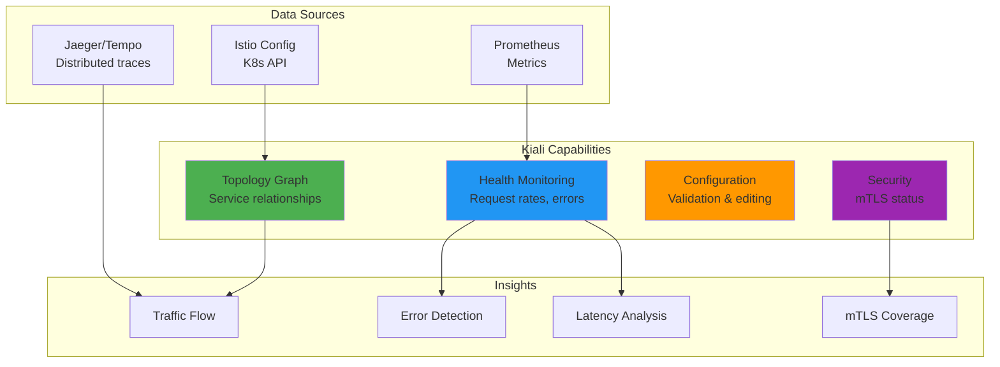
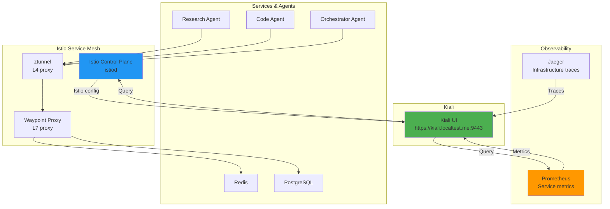

# Kiali: Service Mesh Observability Console

**Version**: 1.0
**Last Updated**: 2025-11-12
**Status**: Production Ready
**Audience**: Platform Engineers, SRE, Developers

Complete guide to Kiali for Istio service mesh visualization, traffic analysis, and configuration validation in the Kagenti platform.

---

## Table of Contents

- [Overview](#overview)
- [What is Kiali?](#what-is-kiali)
- [Why Use Kiali?](#why-use-kiali)
- [Architecture](#architecture)
- [Installation](#installation)
- [Kagenti Integration](#kagenti-integration)
- [Topology Visualization](#topology-visualization)
- [Traffic Analysis](#traffic-analysis)
- [Configuration Validation](#configuration-validation)
- [Security Features](#security-features)
- [Troubleshooting](#troubleshooting)
- [Alternatives](#alternatives)
- [Next Steps](#next-steps)
- [References](#references)

---

## Overview

**Purpose**: Provide comprehensive visualization and management console for Istio service mesh in Kubernetes.

**What You Get**:
- ✅ Interactive service topology graph with real-time traffic flow
- ✅ Health status monitoring for services and workloads
- ✅ Istio configuration validation (VirtualService, DestinationRule, Gateway)
- ✅ Request metrics and tracing integration
- ✅ Service-to-service communication analysis
- ✅ mTLS security status visualization
- ✅ Multi-cluster mesh support
- ✅ Traffic shifting and canary deployment visualization

**Key Benefit**: Kiali provides a **single pane of glass** for understanding your service mesh - what services exist, how they communicate, and whether they're healthy.

**Source**: Based on [Kiali Documentation](https://kiali.io/docs/)

---

## What is Kiali?

**Kiali** is an observability console for Istio service mesh, providing visibility into the structure and behavior of your microservices architecture.

### Key Features



**Key Characteristics**:
1. **Istio-Native**: Deep integration with Istio control plane
2. **Real-Time**: Live traffic visualization via Prometheus metrics
3. **Configuration-Aware**: Validates Istio resources for correctness
4. **Multi-Cluster**: Supports federated service mesh viewing
5. **Security-Focused**: Highlights mTLS status and security gaps

**Source**: [Kiali Overview](https://kiali.io/docs/)

---

## Why Use Kiali?

### Without Kiali

**Limited service mesh visibility**:
```
kubectl get pods shows:
- research-agent-xxx
- code-agent-xxx
- redis-xxx
- postgres-xxx

But how do they communicate?
❓ Which services talk to each other?
❓ Is traffic encrypted (mTLS)?
❓ Are there errors or latency spikes?
❓ Is the VirtualService configuration correct?
```

**Manual debugging**:
- Kubectl describe for each service
- Grep Istio logs for errors
- Manually validate YAML configurations
- No visual representation of traffic flow

---

### With Kiali

**Complete service mesh visibility**:
```
Kiali Topology View:

research-agent ──(HTTP/2, mTLS ✅)──> code-agent
      │                                    │
      │ (Redis query)                     │ (PostgreSQL query)
      ↓                                    ↓
    redis ✅                          postgres ✅
      (100 req/s, 0% errors)            (50 req/s, 0% errors)

Health Status:
- research-agent: ✅ Healthy (200ms p95 latency)
- code-agent: ⚠️  Warning (500ms p95 latency)
- redis: ✅ Healthy
- postgres: ✅ Healthy

mTLS Status:
- ✅ All connections use mTLS STRICT mode
```

**Benefits**:
- ✅ Visual service topology graph
- ✅ Real-time traffic metrics
- ✅ Health monitoring and alerting
- ✅ mTLS security verification
- ✅ Configuration validation
- ✅ Trace integration (Jaeger/Tempo)
- ✅ Traffic shifting visualization

**Source**: [Why Kiali?](https://kiali.io/docs/)

---

## Architecture

### Kiali in Kagenti Platform

Kiali integrates with Istio and Prometheus for real-time service mesh visualization:



**Data Sources**:
1. **Kubernetes API**: Service, Pod, Deployment info
2. **Istio API**: VirtualService, DestinationRule, Gateway config
3. **Prometheus**: Request rates, error rates, latency (RED metrics)
4. **Jaeger**: Distributed trace IDs for request drill-down

**Source**: [Kiali Architecture](https://kiali.io/docs/)

---

## Installation

### Kiali via Helm Chart

Kiali is deployed in Kagenti using pre-rendered Helm chart (v2.4.0):

**File**: `components/02-observability/kiali/kiali-rendered.yaml`

**Deployment Details**:
- **Namespace**: `kiali-system`
- **Version**: v2.4.0
- **Image**: `quay.io/kiali/kiali:v2.4.0`
- **Auth**: Anonymous (no authentication by default)
- **Access**: HTTPRoute via `https://kiali.localtest.me:9443`

**Deploy**:
```bash
# Deploy Kiali
kubectl apply -k components/02-observability/kiali/

# Verify deployment
kubectl get pods -n kiali-system

# Expected:
# NAME                     READY   STATUS    RESTARTS   AGE
# kiali-7d4b5d7d9c-xxxxx   1/1     Running   0          1m
```

**Source**: [Kiali Installation Guide](https://kiali.io/docs/installation/installation-guide/)

---

### Access Kiali UI

Kiali UI is accessible via HTTPRoute:

```bash
# Local Kind deployment
open https://kiali.localtest.me:9443

# Port-forward for direct access
kubectl port-forward -n kiali-system svc/kiali 20001:20001
open http://localhost:20001
```

**Default credentials**: None (anonymous auth enabled)

**Production**: Enable OAuth via Keycloak (see [Keycloak Integration](../03-authentication/keycloak.md))

---

## Kagenti Integration

### Current Kiali Deployment

Kiali is deployed with the following configuration:

**Configuration** (`components/02-observability/kiali/kiali-rendered.yaml`):
```yaml
auth:
  strategy: anonymous  # No authentication (development)

deployment:
  cluster_wide_access: true  # Access all namespaces
  namespace: kiali-system
  replicas: 1

external_services:
  prometheus:
    url: http://prometheus.observability:9090  # Metrics source

  tracing:
    enabled: true
    namespace_selector: true
    url: http://jaeger.observability:16686  # Trace backend

  istio:
    config_map_name: istio
    istio_identity_domain: cluster.local
    istio_sidecar_annotation: sidecar.istio.io/status
    url_service_version: http://istiod.istio-system:15014/version

server:
  web_root: /
  port: 20001
```

**Verify Integration**:
```bash
# Check Kiali can reach Prometheus
kubectl exec -n kiali-system deploy/kiali -- \
  curl -s http://prometheus.observability:9090/api/v1/query?query=up | jq .

# Check Kiali can reach Istio
kubectl exec -n kiali-system deploy/kiali -- \
  curl -s http://istiod.istio-system:15014/version
```

---

## Topology Visualization

### Service Graph View

Kiali's signature feature is the **interactive topology graph**:

**Access**:
```bash
open https://kiali.localtest.me:9443
# Click "Graph" in left sidebar
```

**Graph Types**:

1. **Workload Graph** (default):
   - Shows individual Deployments/StatefulSets
   - Most detailed view
   - Best for debugging specific workload issues

2. **App Graph**:
   - Groups workloads by `app` label
   - Simplified view for multi-version deployments
   - Shows traffic split between versions

3. **Versioned App Graph**:
   - Shows app versions separately
   - Useful for canary deployments
   - Displays traffic percentage per version

4. **Service Graph**:
   - Shows Kubernetes Services
   - High-level overview
   - Hides deployment details

**Example**:
```
Kagenti Platform (versioned app graph):

kagenti-ui (v1.0) ──(90%)──> research-agent (v1.0)
                  └─(10%)──> research-agent (v1.1)  # Canary

research-agent ───> redis
               └──> code-agent ───> postgres
```

---

### Traffic Animation

Real-time traffic visualization:

**Features**:
- **Circle Animation**: HTTP requests flowing between services
  - Green circles: Successful requests (2xx, 3xx)
  - Red diamonds: Failed requests (4xx, 5xx)
  - Circle density: Request volume
  - Animation speed: Response time (slower = higher latency)

- **TCP Traffic**: Offset circles for non-HTTP protocols

**Enable Traffic Animation**:
```
Graph View → Display → Traffic Animation → Enable
```

**Use Cases**:
- Identify hot paths (high traffic routes)
- Spot error spikes (red diamonds)
- Detect latency issues (slow animations)

**Source**: [Kiali Topology Features](https://kiali.io/docs/features/topology/)

---

### Health Indicators

Color-coded health status on nodes:

| Color | Status | Meaning |
|-------|--------|---------|
| **Green** | Healthy | Request success rate >95% |
| **Orange** | Degraded | Request success rate 90-95% or high latency |
| **Red** | Failure | Request success rate <90% or service down |
| **Gray** | No Traffic | No requests in time window |

**Health Metrics**:
- Request rate (req/s)
- Error rate (%)
- P50, P95, P99 latency

**Click on Node** → See detailed metrics:
```
research-agent (Healthy ✅)
- Request Rate: 100 req/s
- Error Rate: 0.5%
- P95 Latency: 120ms
- mTLS: Enabled ✅
```

---

## Traffic Analysis

### Request Metrics

View detailed traffic metrics per service:

**Access**:
```
Graph → Select Service → Side Panel → Traffic Tab
```

**Metrics**:
- **Inbound Traffic**:
  - Requests per second (grouped by source)
  - Success rate by HTTP status code
  - Latency percentiles (P50, P95, P99)

- **Outbound Traffic**:
  - Requests per second (grouped by destination)
  - Success rate to downstream services
  - Response time breakdown

**Example**:
```
research-agent Inbound Traffic:
- kagenti-ui → research-agent: 80 req/s (100% success)
- orchestrator → research-agent: 20 req/s (98% success)

research-agent Outbound Traffic:
- research-agent → redis: 50 req/s (100% success, 10ms p95)
- research-agent → code-agent: 30 req/s (95% success, 200ms p95)
```

---

### Tracing Integration

Link from Kiali graph to distributed traces:

**Enable Tracing**:
```yaml
# Kiali config (already configured in Kagenti)
external_services:
  tracing:
    enabled: true
    url: http://jaeger.observability:16686
```

**Use Traces**:
1. Click on edge (connection between two services)
2. Click **"Show Traces"** in side panel
3. Kiali opens Jaeger UI with filtered traces for that connection
4. View span details, latency breakdown, errors

**Example Flow**:
```
Kiali Graph: research-agent → code-agent (200ms p95)
  ↓ Click "Show Traces"
Jaeger UI: All traces for this service pair
  ↓ Select slow trace (500ms)
Trace Detail:
  └─ research-agent span: 100ms
     └─ code-agent span: 400ms  ← Slow!
        └─ postgres query: 350ms  ← Root cause
```

**Source**: [Kiali Tracing Integration](https://kiali.io/docs/features/tracing/)

---

## Configuration Validation

### Istio Config Validation

Kiali validates Istio resources for common mistakes:

**Access**:
```
Kiali UI → Istio Config → Select Resource Type
```

**Validated Resources**:
- VirtualService
- DestinationRule
- Gateway
- ServiceEntry
- PeerAuthentication
- AuthorizationPolicy

**Validation Examples**:

1. **VirtualService Route Conflict**:
   ```yaml
   # ❌ Invalid: Multiple routes match same prefix
   spec:
     http:
     - match:
       - uri:
           prefix: /api/
       route:
       - destination:
           host: service-v1
     - match:
       - uri:
           prefix: /api/  # ❌ Conflict!
       route:
       - destination:
           host: service-v2
   ```

   **Kiali Error**:
   ```
   ⚠️ Multiple routes match the same request
   Fix: Use more specific match conditions or route weights
   ```

2. **DestinationRule Subset Not Found**:
   ```yaml
   # ❌ Invalid: Subset "v2" not defined
   spec:
     trafficPolicy:
       loadBalancer:
         consistentHash:
           httpHeaderName: user-id
     subsets:
     - name: v1
       labels:
         version: v1
     # Missing v2 subset!
   ```

   **Kiali Error**:
   ```
   ❌ Referenced subset "v2" not found in DestinationRule
   ```

**Source**: [Kiali Configuration Validation](https://kiali.io/docs/features/istio-configuration/)

---

### Configuration Editing

Edit Istio resources directly from Kiali UI:

**Steps**:
1. Navigate to **Istio Config** → Select resource
2. Click **YAML tab**
3. Click **Edit** button
4. Modify YAML
5. Click **Save**

**Validation**:
- Kiali validates changes before applying
- Shows errors/warnings inline
- Prevents invalid configurations

**Best Practice**: Use GitOps (ArgoCD) for production changes, Kiali for debugging/testing.

---

## Security Features

### mTLS Status Visualization

Kiali shows mTLS encryption status for service-to-service communication:

**Graph View**:
- **Lock icon** on edges: mTLS enabled
- **Broken lock icon**: mTLS disabled or permissive
- **No icon**: Unknown (no traffic observed)

**Check mTLS Status**:
```
Graph View → Display → Security → Show Security
```

**Example**:
```
research-agent ──🔒──> code-agent  (mTLS STRICT ✅)
code-agent ──🔒──> postgres        (mTLS STRICT ✅)
kagenti-ui ──❌──> external-api    (No mTLS, external service)
```

**Verify STRICT Mode**:
```
Kiali → Istio Config → PeerAuthentication
```

**Kagenti Configuration**:
```yaml
# components/02-service-mesh/istio-ambient-mode/peer-authentication.yaml
apiVersion: security.istio.io/v1beta1
kind: PeerAuthentication
metadata:
  name: default
  namespace: istio-system
spec:
  mtls:
    mode: STRICT  # All mesh traffic must use mTLS
```

**Source**: [Kiali Security Features](https://kiali.io/docs/features/security/)

---

### Security Policies

View and validate security policies:

**Access**:
```
Kiali → Istio Config → AuthorizationPolicy
```

**Example**:
```yaml
apiVersion: security.istio.io/v1beta1
kind: AuthorizationPolicy
metadata:
  name: allow-research-agent
  namespace: team1
spec:
  selector:
    matchLabels:
      app: code-agent
  action: ALLOW
  rules:
  - from:
    - source:
        principals: ["cluster.local/ns/team1/sa/research-agent"]
    to:
    - operation:
        methods: ["POST"]
        paths: ["/api/analyze"]
```

**Kiali Validation**:
- ✅ Verifies selector matches existing workloads
- ✅ Checks principal format is correct
- ⚠️  Warns if policy is too permissive
- ❌ Errors if policy syntax is invalid

---

## Troubleshooting

### Issue: Kiali Shows "No Graph Data"

**Symptoms**: Graph view is empty or shows "No graph data available"

**Diagnosis**:
```bash
# 1. Check Kiali can reach Prometheus
kubectl exec -n kiali-system deploy/kiali -- \
  curl -s http://prometheus.observability:9090/-/healthy

# 2. Check Prometheus has Istio metrics
kubectl port-forward -n observability svc/prometheus 9090:9090
# Visit: http://localhost:9090/graph
# Query: istio_requests_total

# 3. Check services have Istio sidecars or ztunnel labels
kubectl get pods -n team1 -o jsonpath='{.items[*].metadata.labels}' | grep istio
```

**Fix**:
```bash
# If Prometheus is unreachable, check service
kubectl get svc -n observability prometheus

# If metrics are missing, check Istio mesh labels
kubectl label namespace team1 istio.io/dataplane-mode=ambient

# Restart Kiali to refresh
kubectl rollout restart deployment/kiali -n kiali-system
```

---

### Issue: Services Not Showing in Graph

**Symptoms**: Some services don't appear in topology graph

**Diagnosis**:
```bash
# Check namespace is in Istio mesh
kubectl get namespace team1 -o yaml | grep istio

# Check pods have Istio labels
kubectl get pods -n team1 --show-labels
```

**Fix**:
```bash
# Add namespace to mesh (ambient mode)
kubectl label namespace team1 istio.io/dataplane-mode=ambient

# Or enable sidecar injection
kubectl label namespace team1 istio-injection=enabled

# Restart pods to pick up labels
kubectl rollout restart deployment/research-agent -n team1
```

---

### Issue: "Unable to fetch Istio config"

**Symptoms**: Kiali shows error when accessing Istio Config page

**Diagnosis**:
```bash
# Check Kiali has RBAC permissions
kubectl get clusterrole kiali -o yaml | grep -A 5 "rules:"

# Check Istio control plane is accessible
kubectl exec -n kiali-system deploy/kiali -- \
  curl -s http://istiod.istio-system:15014/debug/configz
```

**Fix**:
```bash
# If RBAC missing, verify Kiali deployment
kubectl get clusterrole kiali
kubectl get clusterrolebinding kiali

# Reinstall Kiali if needed
kubectl apply -k components/02-observability/kiali/
```

---

## Alternatives

### Alternative 1: Grafana Dashboards

**Process**:
- Use Grafana dashboards for service mesh metrics
- Istio dashboards show request rates, latencies, errors

**Pros**:
- ✅ Familiar interface (if already using Grafana)
- ✅ Integrated with other monitoring
- ✅ Customizable dashboards

**Cons**:
- ❌ No interactive topology graph
- ❌ No Istio config validation
- ❌ No mTLS visualization
- ❌ No integrated trace links

**When to Use**: Already have extensive Grafana setup, don't need topology

**Source**: [Grafana Istio Dashboards](https://grafana.com/grafana/dashboards/istio/)

---

### Alternative 2: Istio Dashboard (istiod)

**Process**:
- Access Istio control plane dashboard
- View service mesh configuration via istiod debug endpoints

**Pros**:
- ✅ No additional deployment needed
- ✅ Direct access to Istio internals
- ✅ Lightweight

**Cons**:
- ❌ No visual topology
- ❌ CLI/JSON only (no UI)
- ❌ Not user-friendly
- ❌ No health monitoring

**When to Use**: Debugging Istio control plane issues, not for general observability

**Source**: [Istio Debug Endpoints](https://istio.io/latest/docs/ops/diagnostic-tools/controlz/)

---

### Alternative 3: Linkerd Viz

**Process**:
- Use Linkerd instead of Istio
- Linkerd Viz provides topology and metrics

**Pros**:
- ✅ Lighter weight than Istio
- ✅ Built-in visualization (no separate install)
- ✅ Simple architecture

**Cons**:
- ❌ Requires switching service mesh (Linkerd instead of Istio)
- ❌ Fewer features than Istio+Kiali
- ❌ Less mature ecosystem

**When to Use**: Simpler service mesh needs, don't need Istio's advanced features

**Source**: [Linkerd Viz](https://linkerd.io/2/features/dashboard/)

---

### Alternative 4: Jaeger Service Graph

**Process**:
- Use Jaeger's service dependency graph
- Based on trace data

**Pros**:
- ✅ Already deployed (Jaeger for tracing)
- ✅ Shows actual request paths
- ✅ No additional component

**Cons**:
- ❌ Limited to traced requests (sampling)
- ❌ No real-time metrics
- ❌ No Istio config validation
- ❌ No mTLS status

**When to Use**: Need simple service dependency graph without metrics

**Source**: [Jaeger Service Dependencies](https://www.jaegertracing.io/docs/latest/features/)

---

## Next Steps

### For Development

1. **Access Kiali UI**:
   ```bash
   open https://kiali.localtest.me:9443
   ```

2. **Explore Service Graph**:
   - View topology of Kagenti agents
   - Check mTLS status
   - Identify traffic patterns

3. **Validate Istio Config**:
   - Navigate to Istio Config
   - Review VirtualServices and DestinationRules
   - Fix any validation warnings

### For Production

1. **Enable Authentication**:
   - Configure OAuth2 via Keycloak
   - See [OAuth2-Proxy Guide](../03-authentication/oauth2-proxy.md) *(coming soon)*

2. **Configure Alerting**:
   - Set up Prometheus alerts for service health
   - Integrate with PagerDuty/Slack

3. **Multi-Cluster Support**:
   - Configure Kiali for federated mesh viewing
   - See [Kiali Multi-Cluster](https://kiali.io/docs/features/multi-cluster/)

### Learn More

- [Istio Service Mesh](../02-service-mesh/istio.md) - Istio ambient mode configuration
- [Grafana Dashboards](./grafana.md) - Metrics visualization
- [Distributed Tracing](./distributed-tracing.md) - Tempo + Phoenix tracing
- [Prometheus Metrics](./prometheus.md) - Service metrics collection

---

## References

### Official Documentation

- **Kiali**: [kiali.io](https://kiali.io/)
- **Kiali Documentation**: [kiali.io/docs](https://kiali.io/docs/)
- **Kiali Features**: [kiali.io/docs/features](https://kiali.io/docs/features/)
- **Kiali Installation**: [kiali.io/docs/installation](https://kiali.io/docs/installation/installation-guide/)

### Integration Guides

- **Topology**: [kiali.io/docs/features/topology](https://kiali.io/docs/features/topology/)
- **Traffic Analysis**: [kiali.io/docs/features/traffic](https://kiali.io/docs/features/traffic-management/)
- **Configuration Validation**: [kiali.io/docs/features/istio-configuration](https://kiali.io/docs/features/istio-configuration/)
- **Security**: [kiali.io/docs/features/security](https://kiali.io/docs/features/security/)

### Istio Documentation

- **Istio**: [istio.io](https://istio.io/)
- **Istio Ambient Mode**: [istio.io/latest/docs/ambient](https://istio.io/latest/docs/ambient/)

### Internal Documentation

- **Main README**: [../../README.md](../../README.md)
- **Quick Start Guide**: [../00-getting-started/quick-start.md](../00-getting-started/quick-start.md)
- **Istio Service Mesh**: [../02-service-mesh/istio.md](../02-service-mesh/istio.md)
- **Grafana Dashboards**: [./grafana.md](./grafana.md)

### Repository

- **GitHub**: [Ladas/kagenti-demo-deployment](https://github.com/Ladas/kagenti-demo-deployment)
- **Kiali Configuration**: `components/02-observability/kiali/`
- **HTTPRoute**: `components/02-observability/kiali/httproute.yaml`

---

**Last Updated**: 2025-11-12
**Document Version**: 1.0
**Maintained By**: Platform Engineering Team
**License**: Apache 2.0
