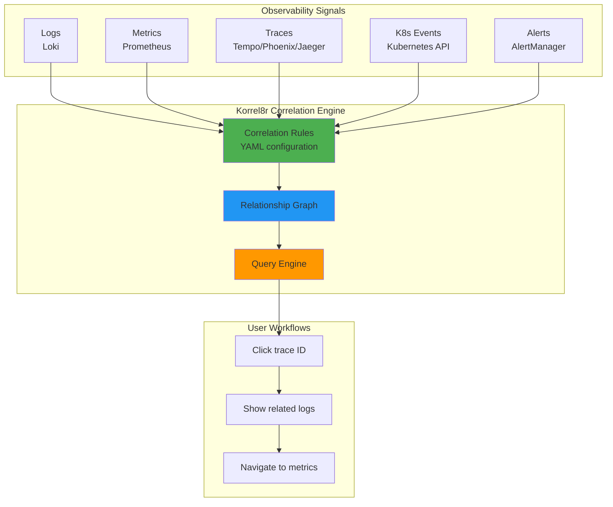
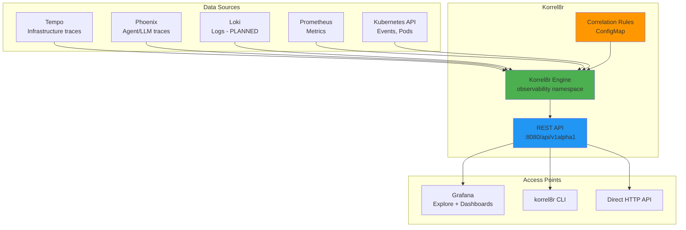

# Korrel8r: Observability Signal Correlation Engine

**Version**: 1.0
**Last Updated**: 2025-11-12
**Status**: Planned Deployment
**Audience**: Platform Engineers, SRE, Developers

Complete guide to Korrel8r for correlating logs, metrics, traces, and Kubernetes events across the Kagenti platform observability stack.

---

## Table of Contents

- [Overview](#overview)
- [What is Korrel8r?](#what-is-korrel8r)
- [Why Use Korrel8r?](#why-use-korrel8r)
- [Architecture](#architecture)
- [Core Concepts](#core-concepts)
- [Kagenti Integration Plan](#kagenti-integration-plan)
- [Correlation Rules](#correlation-rules)
- [Query Capabilities](#query-capabilities)
- [Use Cases](#use-cases)
- [Deployment](#deployment)
- [Configuration](#configuration)
- [Troubleshooting](#troubleshooting)
- [Alternatives](#alternatives)
- [Next Steps](#next-steps)
- [References](#references)

---

## Overview

**Purpose**: Provide intelligent correlation between observability signals (logs, metrics, traces, Kubernetes events) to accelerate troubleshooting and root cause analysis.

**What You Get**:
- ✅ Click trace → see related logs
- ✅ Click log entry → see related traces
- ✅ Click metric spike → see related traces and logs
- ✅ Click Kubernetes event → see affected traces
- ✅ Graph-based correlation queries
- ✅ Rule-based relationship discovery
- ✅ Support for multiple backends (Tempo, Loki, Prometheus, Jaeger)
- ✅ OpenTelemetry-compatible

**Key Benefit**: Korrel8r **eliminates manual signal correlation** by automatically discovering and navigating relationships between logs, traces, metrics, and Kubernetes resources.

**Status in Kagenti**: **Planned deployment** (Phase 4 of observability roadmap). See [TODO_TRACING.md](../../TODO_TRACING.md) for implementation plan.

**Source**: Based on [Korrel8r Documentation](https://korrel8r.github.io/korrel8r/)

---

## What is Korrel8r?

**Korrel8r** is an open-source correlation engine that navigates relationships between cluster resources and observability signals across different data models, query languages, and storage systems.

### Key Characteristics



**Supported Domains**:
1. **Kubernetes Resources**: Pods, Deployments, Services, Namespaces
2. **Traces**: Tempo, Jaeger, Phoenix (OpenTelemetry-compatible)
3. **Logs**: Loki, Elasticsearch
4. **Metrics**: Prometheus, Thanos
5. **Alerts**: Prometheus AlertManager
6. **Network Flows**: Network observability data

**Source**: [Korrel8r Overview](https://korrel8r.github.io/korrel8r/)

---

## Why Use Korrel8r?

### Without Korrel8r

**Manual signal correlation**:
```
User reports: "Agent is slow!"

1. Check logs (Loki):
   - Search for agent pod name
   - Find error log with timestamp
   - Extract trace ID manually (if present)

2. Check traces (Tempo/Phoenix):
   - Copy trace ID from logs
   - Search in trace UI
   - Find slow span

3. Check metrics (Prometheus):
   - Determine time range from trace
   - Query Prometheus for CPU/memory metrics
   - Correlate manually with trace timing

4. Check Kubernetes events:
   - kubectl describe pod
   - Look for events around failure time
   - Correlate with logs/traces

Total time: 15-30 minutes of manual correlation ⏱️
```

---

### With Korrel8r

**Automated signal correlation**:
```
User reports: "Agent is slow!"

1. Find slow trace in Phoenix/Tempo

2. Click trace ID → Korrel8r shows:
   ├─ Related Logs (Loki):
   │  └─ "ERROR: LLM timeout after 30s" (timestamp matches span)
   │
   ├─ Related Metrics (Prometheus):
   │  └─ "container_cpu_usage high (95%)" (spike during trace)
   │
   └─ Related K8s Events:
      └─ "Pod OOMKilled 2 minutes before trace" (root cause!)

Total time: 1-2 minutes with full context ⚡
```

**Benefits**:
- ✅ **10x faster troubleshooting** - instant correlation across signals
- ✅ **No manual correlation** - Korrel8r finds relationships automatically
- ✅ **Complete context** - see all related signals in one view
- ✅ **Root cause discovery** - correlation rules reveal hidden dependencies
- ✅ **Reduced MTTR** - faster incident resolution

**Source**: [Why Korrel8r](https://korrel8r.github.io/korrel8r/)

---

## Architecture

### Korrel8r in Kagenti Platform (Planned)



**Workflow**:
1. **User starts in Grafana Explore** (viewing trace or log)
2. **Clicks "Related Signals" button** (Grafana data link)
3. **Grafana calls Korrel8r API** with trace/log ID
4. **Korrel8r queries all backends** (Tempo, Loki, Prometheus, K8s)
5. **Korrel8r returns correlated signals** based on rules
6. **Grafana displays results** in unified view

**Source**: [Korrel8r Architecture](https://korrel8r.github.io/korrel8r/)

---

## Core Concepts

### 1. Correlation Objects

Korrel8r operates on **correlation objects** - identifiable entities that can be correlated:

**Examples**:
- `trace:span` - A distributed trace span (Tempo/Jaeger/Phoenix)
- `log:entry` - A log entry (Loki)
- `metric:sample` - A metric data point (Prometheus)
- `k8s:pod` - A Kubernetes Pod
- `alert:firing` - An active alert

**Object Format**:
```
{domain}:{class}:{identifier}

Examples:
trace:span:abc123def456789  # Trace ID
log:entry:{pod="research-agent",level="error"}  # LogQL query
k8s:pod:team1/research-agent-xxx  # Namespace/Pod name
metric:sample:container_cpu_usage{pod="research-agent"}  # PromQL
```

---

### 2. Correlation Rules

Rules define **how objects relate** to each other:

**Rule Structure**:
```yaml
apiVersion: korrel8r.openshift.io/v1alpha1
kind: CorrelationRule
metadata:
  name: trace-to-logs
spec:
  # Start from trace span
  start: trace:span

  # Navigate to logs
  goal: log:entry

  # Correlation logic
  query: |
    # Find logs with matching trace_id attribute
    {trace_id="{{.traceID}}"} |= "{{.spanID}}"
```

**Common Rules**:
- **Trace → Logs**: Match trace_id in log attributes
- **Logs → Trace**: Extract trace_id from log entry
- **Trace → Metrics**: Match pod label and time range
- **K8s Pod → Logs**: Match pod name in logs
- **Alert → Trace**: Match service and time window

**Source**: [Korrel8r Rules](https://korrel8r.github.io/korrel8r/)

---

### 3. Graph Queries

Korrel8r builds a **relationship graph** and supports traversal queries:

**Query Types**:

1. **Neighbors Query**:
   ```
   Find all signals directly related to trace:span:abc123

   Result:
   - log:entry (10 matching logs)
   - metric:sample (3 matching metrics)
   - k8s:pod (1 matching pod)
   ```

2. **Goal Query**:
   ```
   Given trace:span:abc123, find all related k8s:pod objects

   Result:
   - k8s:pod:team1/research-agent-xxx
   ```

3. **Path Query**:
   ```
   Find path from trace:span:abc123 to alert:firing:high-cpu

   Result:
   trace:span → log:entry → metric:sample → alert:firing
   ```

---

## Kagenti Integration Plan

### Phase 4: Korrel8r Deployment (Planned)

**Status**: Not yet deployed. Documented as planned deployment.

**Prerequisites**:
1. ✅ Tempo deployed (infrastructure traces)
2. ✅ Phoenix deployed (agent/LLM traces)
3. ✅ Prometheus deployed (metrics)
4. ⏳ **Loki deployment** (log aggregation - Phase 3)
5. ⏳ **Trace ID propagation** in all services (Phase 2)
6. ⏳ **Log structured format** with trace_id field (Phase 3)

**Deployment Plan** (from [TODO_TRACING.md](../../TODO_TRACING.md)):

```yaml
# Phase 4: Deploy Korrel8r
apiVersion: apps/v1
kind: Deployment
metadata:
  name: korrel8r
  namespace: observability
spec:
  replicas: 1
  selector:
    matchLabels:
      app: korrel8r
  template:
    metadata:
      labels:
        app: korrel8r
    spec:
      containers:
      - name: korrel8r
        image: quay.io/korrel8r/korrel8r:latest
        ports:
        - containerPort: 8080
          name: http
        env:
        # Tempo configuration
        - name: KORREL8R_TEMPO_URL
          value: "http://tempo.observability:3200"

        # Loki configuration
        - name: KORREL8R_LOKI_URL
          value: "http://loki.observability:3100"

        # Prometheus configuration
        - name: KORREL8R_PROMETHEUS_URL
          value: "http://prometheus.observability:9090"

        # Phoenix configuration
        - name: KORREL8R_PHOENIX_URL
          value: "http://phoenix.observability:6006"

        volumeMounts:
        - name: rules
          mountPath: /etc/korrel8r/rules
      volumes:
      - name: rules
        configMap:
          name: korrel8r-rules
```

**Access**:
```bash
# Via HTTPRoute (HTTPS)
open https://korrel8r.localtest.me:9443

# Via port-forward (HTTP)
kubectl port-forward -n observability svc/korrel8r 8080:8080
open http://localhost:8080
```

---

## Correlation Rules

### Trace → Logs Correlation

**Rule**: Find logs for a given trace ID

```yaml
apiVersion: korrel8r.openshift.io/v1alpha1
kind: CorrelationRule
metadata:
  name: trace-to-logs
  namespace: observability
spec:
  start: trace:span
  goal: log:entry
  query: |
    # Loki LogQL query
    {namespace="{{.namespace}}"}
    | json
    | trace_id="{{.traceID}}"
    | line_format "{{.timestamp}} {{.level}} {{.message}}"
```

**Example**:
```
Input: trace:span:abc123def456
Query Loki: {namespace="team1"} | json | trace_id="abc123def456"
Output:
  - log:entry: "2025-11-12T10:00:00Z ERROR LLM timeout"
  - log:entry: "2025-11-12T10:00:01Z WARN Retrying request"
```

---

### Logs → Trace Correlation

**Rule**: Find trace for a given log entry

```yaml
apiVersion: korrel8r.openshift.io/v1alpha1
kind: CorrelationRule
metadata:
  name: logs-to-trace
  namespace: observability
spec:
  start: log:entry
  goal: trace:span
  query: |
    # Extract trace_id from log entry
    # Query Tempo by trace ID
    /api/traces/{{.trace_id}}
```

**Example**:
```
Input: log:entry with trace_id="abc123def456"
Query Tempo: /api/traces/abc123def456
Output:
  - trace:span: Full trace with all spans
```

---

### Trace → Metrics Correlation

**Rule**: Find metrics for pod generating a trace

```yaml
apiVersion: korrel8r.openshift.io/v1alpha1
kind: CorrelationRule
metadata:
  name: trace-to-metrics
  namespace: observability
spec:
  start: trace:span
  goal: metric:sample
  query: |
    # PromQL query for pod metrics during trace timeframe
    container_cpu_usage_seconds_total{
      namespace="{{.namespace}}",
      pod=~"{{.service}}.*"
    }[{{.duration}}]
```

**Example**:
```
Input: trace:span (namespace=team1, service=research-agent, time=10:00:00, duration=5s)
Query Prometheus:
  container_cpu_usage_seconds_total{
    namespace="team1",
    pod=~"research-agent.*"
  }[5s]
Output:
  - metric:sample: CPU usage 95% at 10:00:01 (spike!)
```

---

### Kubernetes Events → Traces

**Rule**: Find traces affected by Kubernetes event (e.g., OOMKill)

```yaml
apiVersion: korrel8r.openshift.io/v1alpha1
kind: CorrelationRule
metadata:
  name: k8s-event-to-traces
  namespace: observability
spec:
  start: k8s:event
  goal: trace:span
  query: |
    # Find traces for pod around event time
    # Query Tempo with pod label and time range
    resource.k8s.pod.name="{{.involvedObject.name}}" AND
    start >= {{.firstTimestamp}} AND
    end <= {{add .firstTimestamp "5m"}}
```

**Example**:
```
Input: k8s:event (OOMKilled, pod=research-agent-xxx, time=10:00:00)
Query Tempo:
  resource.k8s.pod.name="research-agent-xxx" AND
  start >= 2025-11-12T10:00:00Z AND
  end <= 2025-11-12T10:05:00Z
Output:
  - trace:span: Traces before OOMKill showing high memory usage
```

---

## Query Capabilities

### REST API

Korrel8r provides a REST API for correlation queries:

**Endpoint**: `GET /api/v1alpha1/graphs/neighbours`

**Example: Find related signals for a trace**:
```bash
curl -X POST http://korrel8r:8080/api/v1alpha1/graphs/neighbours \
  -H "Content-Type: application/json" \
  -d '{
    "start": {
      "domain": "trace",
      "class": "span",
      "id": "abc123def456"
    },
    "goals": ["log:entry", "metric:sample", "k8s:pod"]
  }'
```

**Response**:
```json
{
  "nodes": [
    {
      "domain": "trace",
      "class": "span",
      "id": "abc123def456"
    },
    {
      "domain": "log",
      "class": "entry",
      "id": "{pod=\"research-agent\",trace_id=\"abc123def456\"}"
    },
    {
      "domain": "metric",
      "class": "sample",
      "id": "container_cpu_usage{pod=\"research-agent\"}"
    }
  ],
  "edges": [
    {
      "source": "trace:span:abc123def456",
      "target": "log:entry:...",
      "rule": "trace-to-logs"
    }
  ]
}
```

---

### CLI Tool

Korrel8r CLI for ad-hoc correlation queries:

```bash
# Install korrel8r CLI
go install github.com/korrel8r/korrel8r/cmd/korrel8r@latest

# Find logs for trace
korrel8r neighbours \
  --start "trace:span:abc123def456" \
  --goal "log:entry"

# Find path from trace to alert
korrel8r path \
  --start "trace:span:abc123def456" \
  --goal "alert:firing:high-cpu"
```

---

## Use Cases

### Use Case 1: Debug Slow Agent Execution

**Scenario**: User reports slow research-agent response.

**Workflow**:
1. **Find slow trace** in Phoenix: `trace:span:abc123`
2. **Query Korrel8r** for related signals:
   ```
   korrel8r neighbours --start "trace:span:abc123"
   ```
3. **Korrel8r returns**:
   - **Logs**: "WARN: Redis connection timeout 5s"
   - **Metrics**: Redis latency spike (500ms p95)
   - **K8s Events**: Redis pod restarted 1 minute before trace

**Root Cause**: Redis restart caused connection timeouts, slowing agent.

---

### Use Case 2: Correlate Log Error to Trace

**Scenario**: Alert fires for ERROR log entry, need full trace context.

**Workflow**:
1. **Find error log** in Loki: `{level="ERROR"}`
2. **Extract trace_id** from log: `trace_id=def456`
3. **Query Korrel8r**:
   ```
   korrel8r neighbours --start "log:entry:{trace_id=\"def456\"}"
   ```
4. **Korrel8r returns**:
   - **Trace**: Full trace showing LLM timeout
   - **Metrics**: LLM service high latency (10s p99)

**Root Cause**: LLM service degradation caused agent errors.

---

### Use Case 3: Metric Spike Investigation

**Scenario**: CPU usage alert fires for code-agent.

**Workflow**:
1. **View CPU metric** in Grafana: spike at 10:05:00
2. **Query Korrel8r** for related traces during spike:
   ```
   korrel8r neighbours --start "metric:sample:container_cpu_usage{pod=\"code-agent\"}"
   ```
3. **Korrel8r returns**:
   - **Traces**: 10 concurrent agent executions
   - **Logs**: "INFO: Processing large codebase (10K files)"
   - **K8s Events**: No events (not an infrastructure issue)

**Root Cause**: Legitimate spike from processing large codebase.

---

## Deployment

### Deployment Manifest (Planned)

**File**: `components/02-observability/korrel8r/deployment.yaml`

```yaml
apiVersion: v1
kind: Service
metadata:
  name: korrel8r
  namespace: observability
spec:
  selector:
    app: korrel8r
  ports:
  - port: 8080
    targetPort: 8080
    name: http
---
apiVersion: apps/v1
kind: Deployment
metadata:
  name: korrel8r
  namespace: observability
spec:
  replicas: 1
  selector:
    matchLabels:
      app: korrel8r
  template:
    metadata:
      labels:
        app: korrel8r
    spec:
      containers:
      - name: korrel8r
        image: quay.io/korrel8r/korrel8r:latest
        ports:
        - containerPort: 8080
        args:
        - web
        - --config=/etc/korrel8r/config.yaml
        volumeMounts:
        - name: config
          mountPath: /etc/korrel8r
      volumes:
      - name: config
        configMap:
          name: korrel8r-config
```

---

### Configuration (Planned)

**File**: `components/02-observability/korrel8r/configmap.yaml`

```yaml
apiVersion: v1
kind: ConfigMap
metadata:
  name: korrel8r-config
  namespace: observability
data:
  config.yaml: |
    # Korrel8r configuration
    stores:
      # Tempo (infrastructure traces)
      tempo:
        domain: trace
        url: http://tempo.observability:3200
        type: tempo

      # Phoenix (agent/LLM traces)
      phoenix:
        domain: trace
        url: http://phoenix.observability:6006
        type: tempo  # Phoenix supports OTLP query API

      # Loki (logs)
      loki:
        domain: log
        url: http://loki.observability:3100
        type: loki

      # Prometheus (metrics)
      prometheus:
        domain: metric
        url: http://prometheus.observability:9090
        type: prometheus

      # Kubernetes API
      kubernetes:
        domain: k8s
        type: kubernetes

    # Correlation rules directory
    rules: /etc/korrel8r/rules/
```

---

## Configuration

### Grafana Integration (Planned)

Add data links in Grafana to enable "Related Signals" buttons:

**Tempo Datasource Data Links**:
```yaml
# grafana-datasources.yaml
apiVersion: v1
kind: ConfigMap
metadata:
  name: grafana-datasources
  namespace: observability
data:
  datasources.yaml: |
    datasources:
    - name: Tempo
      type: tempo
      url: http://tempo:3200
      jsonData:
        tracesToLogs:
          datasourceUid: loki
          # Use Korrel8r for correlation
          korrel8rUrl: http://korrel8r:8080
```

**Loki Datasource Data Links**:
```yaml
    - name: Loki
      type: loki
      url: http://loki:3100
      jsonData:
        derivedFields:
        - name: TraceID
          matcherRegex: "trace_id=(\\w+)"
          url: "http://korrel8r:8080/api/v1alpha1/graphs/neighbours?start=trace:span:$${__value.raw}"
```

---

## Troubleshooting

### Issue: Korrel8r Returns No Correlations

**Symptoms**: Query returns empty results even though signals exist.

**Diagnosis**:
```bash
# Check Korrel8r can reach backends
kubectl exec -n observability deploy/korrel8r -- \
  curl -s http://tempo.observability:3200/api/search

kubectl exec -n observability deploy/korrel8r -- \
  curl -s http://loki.observability:3100/loki/api/v1/labels

# Check correlation rules are loaded
kubectl exec -n observability deploy/korrel8r -- \
  curl -s http://localhost:8080/api/v1alpha1/rules
```

**Fix**:
```yaml
# Verify ConfigMap has correct backend URLs
kubectl get configmap korrel8r-config -n observability -o yaml

# Check correlation rules are present
kubectl get configmap korrel8r-rules -n observability
```

---

### Issue: Missing trace_id in Logs

**Symptoms**: Trace → Logs correlation returns no results.

**Root Cause**: Logs don't have `trace_id` field.

**Fix**: Ensure agents log trace ID:
```python
from opentelemetry import trace

# Get current trace ID
tracer = trace.get_tracer(__name__)
span = trace.get_current_span()
trace_id = span.get_span_context().trace_id

# Log with trace ID
logger.info("Agent execution started", extra={"trace_id": format(trace_id, '032x')})
```

---

## Alternatives

### Alternative 1: Manual Correlation (Grafana Explore)

**Process**:
- Use Grafana Explore to manually query logs/traces/metrics
- Copy trace IDs manually between queries

**Pros**:
- ✅ No additional deployment
- ✅ Familiar Grafana interface

**Cons**:
- ❌ Manual copy-paste of IDs
- ❌ No automated correlation
- ❌ Time-consuming

**When to Use**: Simple deployments with low troubleshooting volume

---

### Alternative 2: Custom Scripts

**Process**:
- Write Python/Bash scripts to query APIs and correlate signals
- Automate common correlation patterns

**Pros**:
- ✅ Fully customizable
- ✅ No additional infrastructure

**Cons**:
- ❌ Maintenance overhead
- ❌ No standardized correlation format
- ❌ Difficult to share/reuse

**When to Use**: Very specific correlation needs not covered by Korrel8r

---

### Alternative 3: Commercial APM (Datadog, New Relic)

**Process**:
- Use commercial APM with built-in correlation
- Automatic linking between logs, traces, metrics

**Pros**:
- ✅ Fully managed
- ✅ Advanced correlation features
- ✅ AI-powered insights

**Cons**:
- ❌ Expensive (per-host/per-GB pricing)
- ❌ Vendor lock-in
- ❌ Data sent to external service

**When to Use**: Budget available, don't want to manage correlation

---

## Next Steps

### For Development (When Deployed)

1. **Deploy Korrel8r** (Phase 4):
   ```bash
   kubectl apply -k components/02-observability/korrel8r/
   ```

2. **Configure correlation rules** for Kagenti agents
3. **Integrate with Grafana** data links
4. **Test correlation queries** via CLI

### Prerequisites (Before Deployment)

1. **Deploy Loki** for log aggregation (Phase 3)
2. **Add trace_id to all logs** (Phase 2-3)
3. **Verify OpenTelemetry instrumentation** in agents (Phase 1-2)

### Learn More

- [TODO_TRACING.md](../../TODO_TRACING.md) - Complete observability roadmap
- [Distributed Tracing](./distributed-tracing.md) - Tempo + Phoenix architecture
- [Loki Guide](./loki.md) - Log aggregation (planned)
- [Grafana Dashboards](./grafana.md) - Metrics and trace visualization

---

## References

### Official Documentation

- **Korrel8r**: [korrel8r.github.io/korrel8r](https://korrel8r.github.io/korrel8r/)
- **Korrel8r GitHub**: [github.com/korrel8r/korrel8r](https://github.com/korrel8r/korrel8r)
- **OpenShift Cluster Observability Operator**: [Red Hat Korrel8r Integration](https://docs.openshift.com/container-platform/latest/observability/cluster_observability_operator/cluster-observability-operator-overview.html)

### Integration Guides

- **Tempo**: [grafana.com/docs/tempo](https://grafana.com/docs/tempo/)
- **Loki**: [grafana.com/docs/loki](https://grafana.com/docs/loki/)
- **Prometheus**: [prometheus.io/docs](https://prometheus.io/docs/)

### Internal Documentation

- **Main README**: [../../README.md](../../README.md)
- **Quick Start Guide**: [../00-getting-started/quick-start.md](../00-getting-started/quick-start.md)
- **Distributed Tracing**: [./distributed-tracing.md](./distributed-tracing.md)
- **Phoenix**: [./phoenix.md](./phoenix.md)
- **Kiali**: [./kiali.md](./kiali.md)

### Repository

- **GitHub**: [Ladas/kagenti-demo-deployment](https://github.com/Ladas/kagenti-demo-deployment)
- **Korrel8r Configuration** (planned): `components/02-observability/korrel8r/`
- **Observability Roadmap**: `TODO_TRACING.md`

---

**Last Updated**: 2025-11-12
**Document Version**: 1.0
**Maintained By**: Platform Engineering Team
**License**: Apache 2.0
