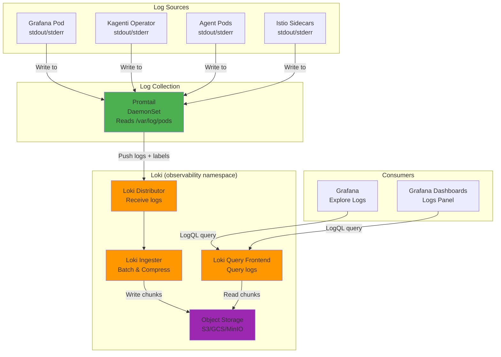

# Loki: Log Aggregation & Analysis

**Version**: 2.0
**Last Updated**: 2025-11-11
**Status**: Planned (Not Yet Deployed)
**Audience**: Platform Engineers, SREs, Developers

Complete guide to Grafana Loki log aggregation, LogQL queries, and integration with Grafana and Prometheus for the Kagenti platform.

---

## Table of Contents

- [Overview](#overview)
- [What is Loki?](#what-is-loki)
- [Architecture](#architecture)
- [Installation](#installation)
- [Configuration](#configuration)
- [Log Collection](#log-collection)
- [LogQL Queries](#logql-queries)
- [Integration with Grafana](#integration-with-grafana)
- [Correlation with Metrics & Traces](#correlation-with-metrics--traces)
- [Troubleshooting](#troubleshooting)
- [Alternatives](#alternatives)
- [Next Steps](#next-steps)
- [References](#references)

---

## Overview

**Purpose**: Provide centralized log aggregation and analysis for all Kubernetes workloads and applications with Prometheus-like simplicity.

**What You Get**:
- ✅ Centralized log storage for all pods
- ✅ LogQL query language (similar to PromQL)
- ✅ Automatic label extraction from Kubernetes metadata
- ✅ Native Grafana integration
- ✅ Log-to-trace and log-to-metric correlation
- ✅ Cost-effective storage (indexes only metadata, not content)
- ✅ Multi-tenancy support

**Key Benefit**: Loki provides Prometheus-style log aggregation—index labels, not content—resulting in dramatically lower storage costs and operational complexity compared to Elasticsearch.

**Source**: Based on [Grafana Loki Documentation](https://grafana.com/docs/loki/latest/)

---

## What is Loki?

**Grafana Loki** is a horizontally scalable, highly available log aggregation system inspired by Prometheus, designed by Grafana Labs.

### Core Concepts

| Concept | Description | Example |
|---------|-------------|---------|
| **Log Stream** | Sequence of logs with same labels | All logs from pod `grafana-abc` |
| **Label** | Metadata for indexing | `{namespace="observability", pod="grafana-abc"}` |
| **LogQL** | Query language (like PromQL for logs) | `{app="grafana"} \|= "error"` |
| **Promtail** | Log shipper (like Prometheus scraper) | Reads container logs, sends to Loki |
| **Chunk** | Compressed batch of log lines | 10 MB compressed logs |

**Source**: [Loki Concepts](https://grafana.com/docs/loki/latest/get-started/overview/)

### Why Loki?

**Without Loki**:
```
Log access:
- kubectl logs pod-name (ephemeral, lost on restart)
- Manual SSH to nodes
- No aggregation across pods
- No historical search
❌ Debugging distributed systems is painful
```

**With Loki**:
```
Centralized logs:
- Query logs from all pods in one place
- Search across time (30+ days retention)
- Correlate logs with metrics and traces
- Filter by labels (namespace, pod, container)
✅ Complete observability
```

**Loki vs Elasticsearch**:

| Aspect | Loki | Elasticsearch |
|--------|------|---------------|
| **Indexing** | Labels only (10-100 labels) | Full-text (every word) |
| **Storage Cost** | Low ($) | High ($$$) |
| **Query Speed** | Fast for label filters | Fast for full-text search |
| **Operational Complexity** | Low (single binary) | High (cluster management) |
| **Use Case** | Metrics-style log queries | Advanced text search |

**Source**: [Loki Overview](https://grafana.com/docs/loki/latest/get-started/overview/)

---

## Architecture

### Loki in Kagenti Platform



**Source**: [Loki Architecture](https://grafana.com/docs/loki/latest/get-started/architecture/)

### Component Roles

| Component | Type | Purpose | Deployment |
|-----------|------|---------|------------|
| **Promtail** | Log Shipper | Scrape logs from pods, add labels, push to Loki | DaemonSet (1 per node) |
| **Distributor** | Ingestion | Receive logs, validate, forward to ingesters | Deployment (2-3 replicas) |
| **Ingester** | Storage | Batch logs, compress, write to object storage | StatefulSet (3 replicas) |
| **Query Frontend** | Query | Handle queries, cache results | Deployment (2 replicas) |
| **Querier** | Query | Execute LogQL queries, read from storage | Deployment (2 replicas) |
| **Compactor** | Maintenance | Compact and delete old chunks | Deployment (1 replica) |

**Source**: [Loki Components](https://grafana.com/docs/loki/latest/get-started/components/)

---

## Installation

**Status**: Loki is **planned** for the Kagenti platform but not yet deployed.

### Deployment Plan

**Method**: Helm chart with ArgoCD GitOps

**Configuration**:
```yaml
# components/02-observability/loki/kustomization.yaml
apiVersion: kustomize.config.k8s.io/v1beta1
kind: Kustomization

helmCharts:
- name: loki
  repo: https://grafana.github.io/helm-charts
  version: 6.23.0
  releaseName: loki
  namespace: observability
  valuesInline:
    deploymentMode: SimpleScalable  # 3 targets: read, write, backend
    loki:
      auth_enabled: false
      commonConfig:
        replication_factor: 1  # Single replica for Kind
      storage:
        type: filesystem  # Use filesystem for Kind (S3 for prod)

    singleBinary:
      replicas: 1

    read:
      replicas: 1

    write:
      replicas: 1

    backend:
      replicas: 1
```

**Source**: [Loki Helm Chart](https://github.com/grafana/loki/tree/main/production/helm/loki)

---

### Install Promtail

**Purpose**: Collect logs from Kubernetes pods and ship to Loki

```yaml
# components/02-observability/promtail/kustomization.yaml
helmCharts:
- name: promtail
  repo: https://grafana.github.io/helm-charts
  version: 6.16.0
  releaseName: promtail
  namespace: observability
  valuesInline:
    config:
      clients:
      - url: http://loki.observability:3100/loki/api/v1/push

      positions:
        filename: /tmp/positions.yaml

      scrape_configs:
      # Scrape all pod logs
      - job_name: kubernetes-pods
        kubernetes_sd_configs:
        - role: pod

        relabel_configs:
        # Add namespace label
        - source_labels: [__meta_kubernetes_namespace]
          target_label: namespace

        # Add pod name label
        - source_labels: [__meta_kubernetes_pod_name]
          target_label: pod

        # Add container name label
        - source_labels: [__meta_kubernetes_pod_container_name]
          target_label: container

        # Add app label
        - source_labels: [__meta_kubernetes_pod_label_app]
          target_label: app
```

**Source**: [Promtail Configuration](https://grafana.com/docs/loki/latest/send-data/promtail/configuration/)

---

## Configuration

### Loki Configuration

**File**: `components/02-observability/loki/loki-config.yaml`

```yaml
auth_enabled: false

server:
  http_listen_port: 3100
  grpc_listen_port: 9096

common:
  path_prefix: /loki
  storage:
    filesystem:
      chunks_directory: /loki/chunks
      rules_directory: /loki/rules
  replication_factor: 1
  ring:
    kvstore:
      store: inmemory

schema_config:
  configs:
  - from: 2024-01-01
    store: tsdb
    object_store: filesystem
    schema: v13
    index:
      prefix: index_
      period: 24h

storage_config:
  tsdb_shipper:
    active_index_directory: /loki/tsdb-index
    cache_location: /loki/tsdb-cache

limits_config:
  retention_period: 30d  # Keep logs for 30 days
  ingestion_rate_mb: 10  # Max 10 MB/s per tenant
  ingestion_burst_size_mb: 20
  max_query_series: 500
  max_query_lookback: 30d
```

**Source**: [Loki Configuration Reference](https://grafana.com/docs/loki/latest/configure/)

---

### Label Extraction

Promtail automatically extracts labels from Kubernetes metadata:

```yaml
# Automatic labels from Kubernetes
{
  namespace="observability",
  pod="grafana-abc123",
  container="grafana",
  app="grafana",
  job="kubernetes-pods"
}
```

**Best Practice**: Keep labels low-cardinality (< 100 unique values per label)

**Source**: [Label Best Practices](https://grafana.com/docs/loki/latest/get-started/labels/)

---

## Log Collection

### How Promtail Works

1. **Discovery**: Kubernetes service discovery finds all pods
2. **Scraping**: Reads logs from `/var/log/pods/*/*/*`
3. **Labeling**: Adds Kubernetes metadata as labels
4. **Pushing**: Sends log batches to Loki distributor

**Log Path**:
```
Pod stdout/stderr
  → /var/log/pods/{namespace}_{pod-name}_{uid}/{container}/{log-file}
  → Promtail reads file
  → Adds labels {namespace, pod, container, app}
  → Pushes to Loki
```

**Source**: [How Promtail Works](https://grafana.com/docs/loki/latest/send-data/promtail/)

---

### Verify Log Collection

```bash
# Check Promtail pods (1 per node)
kubectl get pods -n observability -l app=promtail

# Check Promtail logs
kubectl logs -n observability -l app=promtail

# Expected: "level=info msg="Successfully pushed batch"

# Check Loki ingestion
kubectl port-forward svc/loki -n observability 3100:3100
curl http://localhost:3100/metrics | grep loki_distributor_lines_received_total
```

**Source**: [Promtail Troubleshooting](https://grafana.com/docs/loki/latest/send-data/promtail/troubleshooting/)

---

## LogQL Queries

### Basic Queries

**Select all logs from a pod**:
```logql
{pod="grafana-abc123"}
```

**Filter by namespace and app**:
```logql
{namespace="observability", app="grafana"}
```

**Search for "error" in logs**:
```logql
{app="grafana"} |= "error"
```

**Exclude "debug" logs**:
```logql
{app="grafana"} != "debug"
```

**Source**: [LogQL Basics](https://grafana.com/docs/loki/latest/query/)

---

### Advanced Filters

**Regex filter** (case-insensitive error):
```logql
{app="grafana"} |~ "(?i)error|exception"
```

**JSON parsing**:
```logql
{app="grafana"} | json | level="error"
```

**Logfmt parsing**:
```logql
{app="operator"} | logfmt | level="error", component="reconciler"
```

**Source**: [LogQL Filters](https://grafana.com/docs/loki/latest/query/log_queries/)

---

### Metrics from Logs

**Count log lines** (rate):
```logql
rate({app="grafana"}[5m])
```

**Count errors**:
```logql
sum(rate({app="grafana"} |= "error" [5m]))
```

**Bytes per second**:
```logql
sum(rate({app="grafana"} | bytes [5m])) by (pod)
```

**P95 latency from logs**:
```logql
quantile_over_time(0.95,
  {app="api"} | json | duration != "" | unwrap duration [5m]
)
```

**Source**: [LogQL Metric Queries](https://grafana.com/docs/loki/latest/query/metric_queries/)

---

## Integration with Grafana

### Loki Datasource

Loki will be configured as a datasource in Grafana:

```yaml
# components/02-observability/grafana/datasources-configmap.yaml
datasources:
  - name: Loki
    type: loki
    access: proxy
    url: http://loki.observability:3100
    editable: true
    jsonData:
      maxLines: 1000
```

**Source**: [Grafana Loki Datasource](https://grafana.com/docs/grafana/latest/datasources/loki/)

---

### Explore Logs in Grafana

```bash
# 1. Access Grafana
kubectl port-forward svc/grafana -n observability 3000:3000

# 2. Navigate to: Explore → Select Loki datasource

# 3. Query logs:
{namespace="observability", app="grafana"}

# 4. Filter with |= "error"

# 5. View logs in context (click log line → Show context)
```

**Source**: [Grafana Explore](https://grafana.com/docs/grafana/latest/explore/)

---

### Logs Panel in Dashboards

Add logs to Grafana dashboards:

```json
{
  "type": "logs",
  "title": "Grafana Error Logs",
  "targets": [
    {
      "expr": "{namespace=\"observability\", app=\"grafana\"} |= \"error\"",
      "refId": "A"
    }
  ],
  "options": {
    "showTime": true,
    "wrapLogMessage": true
  }
}
```

**Source**: [Logs Panel](https://grafana.com/docs/grafana/latest/panels-visualizations/visualizations/logs/)

---

## Correlation with Metrics & Traces

### Logs → Metrics

**Link from log to metric**:

1. Click on log line in Grafana
2. Click "Split" → Select Prometheus datasource
3. Query related metric:
   ```promql
   rate(http_requests_total{pod="<pod-name>"}[5m])
   ```

**Source**: [Correlate Logs and Metrics](https://grafana.com/docs/grafana/latest/explore/logs-integration/)

---

### Logs → Traces

**Link from log to trace via trace ID**:

Configure Loki to extract `trace_id` from logs:

```yaml
# Loki datasource configuration
jsonData:
  derivedFields:
  - name: TraceID
    matcherRegex: "trace_id=(\\w+)"
    url: "http://localhost:3000/explore?left=%5B%22now-1h%22,%22now%22,%22Tempo%22,%7B%22query%22:%22$${__value.raw}%22%7D%5D"
    datasourceUid: tempo
```

**Log format**:
```
{"level":"info","msg":"Request processed","trace_id":"abc123def456"}
```

**Result**: Click `abc123def456` in log → Opens trace in Tempo

**Source**: [Trace to Logs](https://grafana.com/docs/grafana/latest/datasources/tempo/#trace-to-logs)

---

### Traces → Logs

Configure Tempo to link to Loki:

```yaml
# Tempo datasource configuration (already configured in Grafana)
jsonData:
  tracesToLogsV2:
    datasourceUid: loki
    spanStartTimeShift: "-1h"
    spanEndTimeShift: "1h"
    filterByTraceID: true
    filterBySpanID: false
    tags:
    - key: "service.name"
      value: "app"
```

**Result**: Click "Logs for this span" in Tempo → Shows related logs

**Source**: [Distributed Tracing Guide](./distributed-tracing.md)

---

## Troubleshooting

### Issue: No Logs Appearing in Loki

**Symptoms**: Grafana shows "No logs found" for Loki queries

**Diagnosis**:
```bash
# Check Promtail is running
kubectl get pods -n observability -l app=promtail

# Check Promtail logs
kubectl logs -n observability -l app=promtail | tail -20

# Expected: "Successfully pushed batch"

# Check Loki is receiving logs
kubectl port-forward svc/loki -n observability 3100:3100
curl http://localhost:3100/metrics | grep loki_distributor_lines_received_total
```

**Common Causes**:
1. Promtail pods not running on all nodes
2. Promtail can't reach Loki service
3. Label mismatch in queries

**Fix**:
```bash
# Restart Promtail
kubectl rollout restart daemonset/promtail -n observability

# Verify Loki service
kubectl get svc loki -n observability

# Test Promtail → Loki connection
kubectl exec -n observability -it $(kubectl get pod -n observability -l app=promtail -o name | head -1) -- wget -qO- http://loki.observability:3100/ready
```

**Source**: [Loki Troubleshooting](https://grafana.com/docs/loki/latest/operations/troubleshooting/)

---

### Issue: High Cardinality Labels

**Symptoms**: Loki query performance degraded

**Diagnosis**:
```bash
# Check label cardinality
kubectl port-forward svc/loki -n observability 3100:3100
curl -s http://localhost:3100/loki/api/v1/label | jq
```

**Common Causes**:
- Using high-cardinality labels (e.g., trace_id, request_id)
- Too many unique label values

**Fix**:
```yaml
# Promtail relabel_configs: Drop high-cardinality labels
relabel_configs:
- source_labels: [__meta_kubernetes_pod_label_trace_id]
  action: labeldrop  # Don't index trace_id
```

**Best Practice**: Use labels for filtering, log content for search

**Source**: [Label Best Practices](https://grafana.com/docs/loki/latest/get-started/labels/bp-labels/)

---

## Alternatives

### Alternative 1: Elasticsearch + Fluentd/Fluent Bit

**Pros**:
- Full-text search (every word indexed)
- Advanced query DSL
- Mature ecosystem

**Cons**:
- Very expensive storage (10-100x Loki)
- Complex cluster management
- High resource usage (CPU, memory, disk)

**When to Use**: Need advanced full-text search or already invested in Elastic Stack.

**Source**: [Elasticsearch](https://www.elastic.co/elasticsearch)

---

### Alternative 2: Splunk

**Pros**:
- Enterprise features (compliance, RBAC)
- Advanced analytics
- Commercial support

**Cons**:
- Very expensive ($$$$$)
- Vendor lock-in
- License per GB ingested

**When to Use**: Large enterprises with budget for commercial logging.

**Source**: [Splunk](https://www.splunk.com/)

---

### Alternative 3: CloudWatch Logs (AWS)

**Pros**:
- Native AWS integration
- No infrastructure management
- Simple setup

**Cons**:
- Expensive at scale
- AWS-only (vendor lock-in)
- Limited query capabilities

**When to Use**: AWS-native deployments with low log volume.

**Source**: [AWS CloudWatch Logs](https://aws.amazon.com/cloudwatch/)

---

### Alternative 4: kubectl logs

**Pros**:
- Built-in (no installation)
- Simple for single pod debugging

**Cons**:
- Ephemeral (lost on pod restart)
- No aggregation across pods
- No historical search
- Manual process

**When to Use**: Quick debugging of running pods only.

---

## Next Steps

### For Development

1. **Deploy Loki and Promtail**:
   - Follow installation plan above
   - Deploy via ArgoCD GitOps
   - Verify log ingestion

2. **Explore Logs in Grafana**:
   ```bash
   kubectl port-forward svc/grafana -n observability 3000:3000
   # Navigate to: Explore → Loki → Query logs
   ```

3. **Correlate Logs with Traces**:
   - Configure `derivedFields` for trace_id extraction
   - Click trace ID in logs → Jump to Tempo trace

### For Production

1. **Configure Object Storage**:
   - Use S3/GCS/Azure Blob for long-term log storage
   - Enable compaction for cost efficiency
   - Review [Loki Storage](https://grafana.com/docs/loki/latest/operations/storage/)

2. **Set Up Retention Policies**:
   - Configure retention period (30-90 days)
   - Enable log deletion compactor
   - Review [Retention](https://grafana.com/docs/loki/latest/operations/storage/retention/)

3. **Optimize Label Strategy**:
   - Keep labels low-cardinality (< 100 unique values)
   - Use labels for filtering (namespace, app, environment)
   - Use log content for text search

4. **Enable Multi-Tenancy**:
   - Separate logs by team/environment
   - Configure tenant-specific retention
   - Review [Multi-Tenancy](https://grafana.com/docs/loki/latest/operations/multi-tenancy/)

---

## References

### Official Documentation

- **Grafana Loki**: [grafana.com/docs/loki/latest](https://grafana.com/docs/loki/latest/)
- **LogQL**: [grafana.com/docs/loki/latest/query](https://grafana.com/docs/loki/latest/query/)
- **Promtail**: [grafana.com/docs/loki/latest/send-data/promtail](https://grafana.com/docs/loki/latest/send-data/promtail/)
- **Loki Helm Chart**: [github.com/grafana/loki/tree/main/production/helm/loki](https://github.com/grafana/loki/tree/main/production/helm/loki)

### Best Practices

- **Label Best Practices**: [grafana.com/docs/loki/latest/get-started/labels/bp-labels](https://grafana.com/docs/loki/latest/get-started/labels/bp-labels/)
- **Performance Tuning**: [grafana.com/docs/loki/latest/operations/storage/retention](https://grafana.com/docs/loki/latest/operations/storage/retention/)
- **Promtail Best Practices**: [grafana.com/docs/loki/latest/send-data/promtail/best-practices](https://grafana.com/docs/loki/latest/send-data/promtail/best-practices/)

### Internal Documentation

- **Main README**: [../../README.md](../../README.md)
- **Quick Start Guide**: [../00-getting-started/quick-start.md](../00-getting-started/quick-start.md)
- **Grafana Dashboards**: [./grafana.md](./grafana.md)
- **Distributed Tracing**: [./distributed-tracing.md](./distributed-tracing.md)
- **Prometheus Metrics**: [./prometheus.md](./prometheus.md)

### Repository

- **GitHub**: [Ladas/kagenti-demo-deployment](https://github.com/Ladas/kagenti-demo-deployment)
- **Loki Components**: (To be added in `components/02-observability/loki/`)
- **Promtail Components**: (To be added in `components/02-observability/promtail/`)

---

**Last Updated**: 2025-11-11
**Document Version**: 2.0
**Maintained By**: Platform Engineering Team
**License**: Apache 2.0
