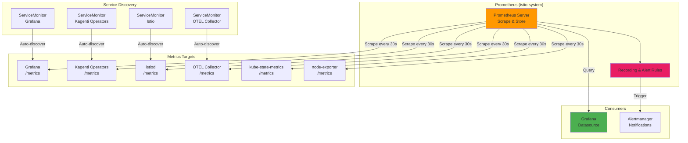

# Prometheus: Metrics Collection & Monitoring

**Version**: 2.0
**Last Updated**: 2025-11-11
**Status**: Production Ready
**Audience**: Platform Engineers, SREs, Developers

Complete guide to Prometheus metrics collection, ServiceMonitor configuration, recording/alert rules, and integration with Grafana for the Kagenti platform.

---

## Table of Contents

- [Overview](#overview)
- [What is Prometheus?](#what-is-prometheus)
- [Architecture](#architecture)
- [Installation](#installation)
- [ServiceMonitor Configuration](#servicemonitor-configuration)
- [Metrics Collection](#metrics-collection)
- [PromQL Queries](#promql-queries)
- [Recording Rules](#recording-rules)
- [Alert Rules](#alert-rules)
- [Integration with Grafana](#integration-with-grafana)
- [Troubleshooting](#troubleshooting)
- [Alternatives](#alternatives)
- [Next Steps](#next-steps)
- [References](#references)

---

## Overview

**Purpose**: Collect, store, and query time-series metrics from Kubernetes workloads and applications for monitoring and alerting.

**What You Get**:
- ✅ Automatic metrics collection from Kubernetes
- ✅ Application metrics via ServiceMonitor
- ✅ PromQL query language for powerful analytics
- ✅ Recording rules for pre-computed metrics
- ✅ Alert rules for proactive notifications
- ✅ Native Grafana integration
- ✅ Long-term metrics storage (15 days default)

**Key Benefit**: Prometheus provides a complete metrics solution with automatic service discovery, powerful querying, and alerting—all configured declaratively via Kubernetes CRDs.

**Source**: Based on [Prometheus Documentation](https://prometheus.io/docs/)

---

## What is Prometheus?

**Prometheus** is an open-source monitoring and alerting toolkit originally built at SoundCloud, now a CNCF graduated project.

### Core Concepts

| Concept | Description | Example |
|---------|-------------|---------|
| **Metric** | Timestamped measurement | `http_requests_total{method="GET"}` |
| **Label** | Key-value dimension | `{namespace="observability", pod="grafana-123"}` |
| **Scrape** | Pull metrics from target | Every 30s Prometheus fetches `/metrics` |
| **ServiceMonitor** | Kubernetes CRD for scrape config | Auto-discover pods with `app=grafana` label |
| **Recording Rule** | Pre-computed metric | Save CPU-intensive queries |
| **Alert Rule** | Condition triggering notification | CPU > 80% for 5 minutes |

**Source**: [Prometheus Concepts](https://prometheus.io/docs/concepts/)

### Why Prometheus?

**Without Prometheus**:
```
Metrics collection:
- Manual log parsing
- Custom scripts for each service
- No historical data
- No alerting
❌ No visibility into system health
```

**With Prometheus**:
```
Automatic collection:
- Auto-discover Kubernetes services
- Standardized /metrics endpoint
- 15 days historical data
- Alert on anomalies
✅ Complete observability
```

**Source**: [Why Prometheus?](https://prometheus.io/docs/introduction/overview/#what-is-prometheus)

---

## Architecture

### Prometheus in Kagenti Platform



**Source**: [Prometheus Architecture](https://prometheus.io/docs/introduction/overview/#architecture)

### Component Roles

| Component | Type | Purpose | Deployment |
|-----------|------|---------|------------|
| **Prometheus Server** | Core | Scrape targets, store metrics, evaluate rules | StatefulSet (1 replica) |
| **ServiceMonitor** | CRD | Declare which services to scrape | Per-service YAML |
| **kube-state-metrics** | Exporter | Kubernetes object metrics (pods, deployments) | Deployment (1 replica) |
| **node-exporter** | Exporter | Node-level metrics (CPU, memory, disk) | DaemonSet (1 per node) |
| **Alertmanager** | Alerting | Route alerts to notification channels | Deployment (1 replica) |

**Source**: [Prometheus Components](https://prometheus.io/docs/prometheus/latest/getting_started/)

---

## Installation

### Deployed by Istio

In Kagenti, Prometheus is **automatically deployed by Istio** in the `istio-system` namespace.

**Verify Installation**:
```bash
# Check Prometheus pod
kubectl get pods -n istio-system -l app=prometheus

# Expected output:
# NAME                          READY   STATUS
# prometheus-<hash>             2/2     Running

# Check Prometheus service
kubectl get svc -n istio-system prometheus

# Expected:
# NAME         TYPE        CLUSTER-IP     EXTERNAL-IP   PORT(S)    AGE
# prometheus   ClusterIP   10.96.123.45   <none>        9090/TCP   5d
```

**Source**: [Istio Prometheus Integration](https://istio.io/latest/docs/ops/integrations/prometheus/)

---

### Access Prometheus UI

```bash
# Port-forward to Prometheus
kubectl port-forward svc/prometheus -n istio-system 9090:9090

# Access: http://localhost:9090
# Navigate to: Status → Targets (see all scrape targets)
```

**Source**: [Prometheus Web UI](https://prometheus.io/docs/visualization/browser/)

---

## ServiceMonitor Configuration

### What is ServiceMonitor?

**ServiceMonitor** is a Kubernetes Custom Resource (CRD) from the Prometheus Operator that tells Prometheus which services to scrape for metrics.

**Benefits**:
- Declarative (GitOps-friendly)
- Automatic service discovery
- No manual Prometheus configuration
- Kubernetes-native

**Source**: [Prometheus Operator ServiceMonitor](https://prometheus-operator.dev/)

---

### Example: Grafana ServiceMonitor

**File**: `components/02-observability/grafana/servicemonitor.yaml`

```yaml
apiVersion: monitoring.coreos.com/v1
kind: ServiceMonitor
metadata:
  name: grafana
  namespace: observability
  labels:
    app: grafana
spec:
  selector:
    matchLabels:
      app: grafana  # Match Grafana service
  endpoints:
  - port: http  # Service port name
    interval: 30s  # Scrape every 30 seconds
    path: /metrics  # Metrics endpoint path
```

**Apply ServiceMonitor**:
```bash
kubectl apply -f components/02-observability/grafana/servicemonitor.yaml

# Verify ServiceMonitor created
kubectl get servicemonitor -n observability

# Check Prometheus targets
kubectl port-forward svc/prometheus -n istio-system 9090:9090
# Open http://localhost:9090/targets
# Look for "observability/grafana/0" target
```

**Source**: [ServiceMonitor API](https://prometheus-operator.dev/docs/api-reference/api/)

---

### Example: Kagenti Operator ServiceMonitor

**File**: `components/01-platform/operator/chart/templates/prometheus/monitor.yaml`

```yaml
apiVersion: monitoring.coreos.com/v1
kind: ServiceMonitor
metadata:
  name: kagenti-operator-metrics
  namespace: kagenti-system
spec:
  selector:
    matchLabels:
      control-plane: controller-manager
  endpoints:
  - port: https
    path: /metrics
    scheme: https  # Use HTTPS
    bearerTokenFile: /var/run/secrets/kubernetes.io/serviceaccount/token
    tlsConfig:
      insecureSkipVerify: true  # Dev mode (use cert-manager in prod)
```

**Source**: Internal operator configuration

---

## Metrics Collection

### Kubernetes Metrics

Prometheus automatically collects Kubernetes metrics via **kube-state-metrics** and **node-exporter**.

**kube-state-metrics** (cluster-wide):
```promql
# Pod count by namespace
kube_pod_status_phase{namespace="observability"}

# Deployment replicas
kube_deployment_spec_replicas{deployment="grafana"}

# PersistentVolume status
kube_persistentvolume_status_phase
```

**node-exporter** (per node):
```promql
# Node CPU usage
node_cpu_seconds_total

# Node memory
node_memory_MemAvailable_bytes

# Disk I/O
node_disk_io_time_seconds_total
```

**Source**: [kube-state-metrics](https://github.com/kubernetes/kube-state-metrics)

---

### Application Metrics

Applications expose metrics at `/metrics` endpoint in Prometheus format.

**Example**: Grafana metrics

```bash
# View raw metrics
kubectl exec -n observability deploy/grafana -- curl http://localhost:3000/metrics

# Sample metrics:
# grafana_alerting_active_configurations 2
# grafana_api_dashboard_get_count_total 150
# grafana_database_queries_total{status="success"} 1234
```

**Metric Types**:

| Type | Description | Example |
|------|-------------|---------|
| **Counter** | Monotonically increasing | `http_requests_total` |
| **Gauge** | Can go up or down | `memory_usage_bytes` |
| **Histogram** | Distribution of values | `http_request_duration_seconds` |
| **Summary** | Like histogram with quantiles | `rpc_duration_seconds` |

**Source**: [Prometheus Metric Types](https://prometheus.io/docs/concepts/metric_types/)

---

## PromQL Queries

### Basic Queries

**Select all metrics for a service**:
```promql
{job="grafana"}
```

**Filter by label**:
```promql
http_requests_total{namespace="observability", status="200"}
```

**Range query** (last 5 minutes):
```promql
http_requests_total[5m]
```

**Source**: [PromQL Basics](https://prometheus.io/docs/prometheus/latest/querying/basics/)

---

### Rate and Aggregation

**Request rate** (requests per second):
```promql
rate(http_requests_total[5m])
```

**Sum across all pods**:
```promql
sum(rate(http_requests_total[5m])) by (namespace)
```

**Average CPU usage**:
```promql
avg(rate(container_cpu_usage_seconds_total[5m])) by (namespace)
```

**Source**: [PromQL Functions](https://prometheus.io/docs/prometheus/latest/querying/functions/)

---

### Advanced Queries

**95th percentile latency**:
```promql
histogram_quantile(0.95, rate(http_request_duration_seconds_bucket[5m]))
```

**Error rate**:
```promql
sum(rate(http_requests_total{status=~"5.."}[5m]))
/
sum(rate(http_requests_total[5m]))
```

**Memory usage percentage**:
```promql
(container_memory_usage_bytes / container_spec_memory_limit_bytes) * 100
```

**Source**: [PromQL Examples](https://prometheus.io/docs/prometheus/latest/querying/examples/)

---

## Recording Rules

### What are Recording Rules?

**Recording rules** pre-compute expensive queries and save results as new metrics.

**Benefits**:
- Faster dashboard loading
- Reduce query load on Prometheus
- Simplify complex queries

**Source**: [Prometheus Recording Rules](https://prometheus.io/docs/prometheus/latest/configuration/recording_rules/)

---

### Example Recording Rules

**File**: `components/02-observability/prometheus/recording-rules.yaml`

```yaml
apiVersion: v1
kind: ConfigMap
metadata:
  name: prometheus-recording-rules
  namespace: istio-system
data:
  recording-rules.yml: |
    groups:
      - name: kagenti_recording_rules
        interval: 30s
        rules:
          # Pre-compute namespace CPU usage
          - record: namespace:container_cpu_usage:sum_rate
            expr: |
              sum(rate(container_cpu_usage_seconds_total[5m])) by (namespace)

          # Pre-compute namespace memory usage
          - record: namespace:container_memory_usage:sum
            expr: |
              sum(container_memory_usage_bytes) by (namespace)

          # Pre-compute HTTP error rate
          - record: job:http_requests_errors:rate5m
            expr: |
              sum(rate(http_requests_total{status=~"5.."}[5m])) by (job)
              /
              sum(rate(http_requests_total[5m])) by (job)
```

**Usage**:
```promql
# Instead of:
sum(rate(container_cpu_usage_seconds_total[5m])) by (namespace)

# Use pre-computed:
namespace:container_cpu_usage:sum_rate
```

**Source**: [Recording Rule Best Practices](https://prometheus.io/docs/practices/rules/)

---

## Alert Rules

### What are Alert Rules?

**Alert rules** evaluate PromQL expressions and trigger alerts when conditions are met.

**Source**: [Prometheus Alerting](https://prometheus.io/docs/prometheus/latest/configuration/alerting_rules/)

---

### Example Alert Rules

**File**: `components/02-observability/prometheus/alert-rules.yaml`

```yaml
apiVersion: v1
kind: ConfigMap
metadata:
  name: prometheus-alert-rules
  namespace: istio-system
data:
  alert-rules.yml: |
    groups:
      - name: kagenti_alerts
        interval: 1m
        rules:
          # High CPU usage
          - alert: HighCPUUsage
            expr: |
              (sum(rate(container_cpu_usage_seconds_total{namespace="kagenti-system"}[5m])) by (pod)
              /
              sum(container_spec_cpu_quota{namespace="kagenti-system"}) by (pod)) > 0.8
            for: 5m
            labels:
              severity: warning
            annotations:
              summary: "High CPU usage on pod {{ $labels.pod }}"
              description: "Pod {{ $labels.pod }} CPU usage is {{ $value }}% for 5 minutes"

          # Pod crash looping
          - alert: PodCrashLooping
            expr: |
              rate(kube_pod_container_status_restarts_total[15m]) > 0
            for: 5m
            labels:
              severity: critical
            annotations:
              summary: "Pod {{ $labels.pod }} crash looping"
              description: "Pod {{ $labels.pod }} has restarted {{ $value }} times in last 15 minutes"

          # High memory usage
          - alert: HighMemoryUsage
            expr: |
              (container_memory_usage_bytes{namespace="observability"}
              /
              container_spec_memory_limit_bytes{namespace="observability"}) > 0.9
            for: 10m
            labels:
              severity: warning
            annotations:
              summary: "High memory usage on {{ $labels.pod }}"
              description: "Pod {{ $labels.pod }} memory usage is {{ $value }}%"

          # Service down
          - alert: ServiceDown
            expr: |
              up{job="grafana"} == 0
            for: 2m
            labels:
              severity: critical
            annotations:
              summary: "Service {{ $labels.job }} is down"
              description: "Service {{ $labels.job }} has been down for 2 minutes"
```

**Source**: [Alerting Rule Examples](https://samber.github.io/awesome-prometheus-alerts/)

---

### Alertmanager Integration

Prometheus sends alerts to **Alertmanager**, which handles routing and notifications.

```yaml
# Alertmanager configuration
apiVersion: v1
kind: ConfigMap
metadata:
  name: alertmanager-config
  namespace: istio-system
data:
  alertmanager.yml: |
    global:
      resolve_timeout: 5m

    route:
      group_by: ['alertname', 'namespace']
      group_wait: 10s
      group_interval: 10s
      repeat_interval: 12h
      receiver: 'slack-notifications'

    receivers:
    - name: 'slack-notifications'
      slack_configs:
      - api_url: 'https://hooks.slack.com/services/YOUR/WEBHOOK/URL'
        channel: '#alerts'
        text: '{{ range .Alerts }}{{ .Annotations.summary }}{{ end }}'
```

**Source**: [Alertmanager Configuration](https://prometheus.io/docs/alerting/latest/configuration/)

---

## Integration with Grafana

Prometheus is configured as the **default datasource** in Grafana.

**Configuration**: Already set in `grafana-datasources` ConfigMap

```yaml
datasources:
  - name: Prometheus
    type: prometheus
    access: proxy
    url: http://prometheus.istio-system:9090
    isDefault: true
    editable: true
```

**Query in Grafana**:
1. Create new dashboard panel
2. Select datasource: Prometheus
3. Enter PromQL query:
   ```promql
   rate(http_requests_total[5m])
   ```
4. Visualize as time series, gauge, or table

**Source**: [Grafana Prometheus Datasource](https://grafana.com/docs/grafana/latest/datasources/prometheus/)

---

## Troubleshooting

### Issue: Prometheus Not Scraping Target

**Symptoms**: Target shows as "DOWN" in Prometheus UI

**Diagnosis**:
```bash
# Check Prometheus targets
kubectl port-forward svc/prometheus -n istio-system 9090:9090
# Open http://localhost:9090/targets

# Check if ServiceMonitor exists
kubectl get servicemonitor -A

# Check if service has correct labels
kubectl get svc -n observability grafana -o yaml | grep -A5 labels
```

**Common Causes**:
1. ServiceMonitor label selector doesn't match service
2. Service port name mismatch
3. Metrics endpoint not exposed

**Fix**:
```bash
# Verify ServiceMonitor selector matches service labels
kubectl get servicemonitor grafana -n observability -o yaml | grep -A5 selector
kubectl get svc grafana -n observability -o yaml | grep -A5 labels

# Test metrics endpoint manually
kubectl exec -n observability deploy/grafana -- curl http://localhost:3000/metrics
```

**Source**: [Prometheus Troubleshooting](https://prometheus.io/docs/prometheus/latest/querying/basics/#time-series-selectors)

---

### Issue: High Memory Usage

**Symptoms**: Prometheus pod OOMKilled or high memory consumption

**Diagnosis**:
```bash
# Check Prometheus memory usage
kubectl top pod -n istio-system -l app=prometheus

# Check retention settings
kubectl get prometheus -n istio-system -o yaml | grep retention
```

**Common Causes**:
1. Too many metrics stored
2. Long retention period (>15 days)
3. High cardinality labels

**Fix**:
```yaml
# Reduce retention period
apiVersion: monitoring.coreos.com/v1
kind: Prometheus
metadata:
  name: prometheus
  namespace: istio-system
spec:
  retention: 7d  # Reduce from 15d to 7d
  retentionSize: 10GB  # Limit storage size
```

**Source**: [Prometheus Storage](https://prometheus.io/docs/prometheus/latest/storage/)

---

### Issue: Missing Metrics

**Symptoms**: Expected metrics not appearing in Prometheus

**Diagnosis**:
```bash
# Check if target is being scraped
kubectl port-forward svc/prometheus -n istio-system 9090:9090
# Open http://localhost:9090/targets → look for your service

# Check ServiceMonitor
kubectl describe servicemonitor <name> -n <namespace>

# Check metrics endpoint
kubectl exec -n <namespace> deploy/<name> -- curl http://localhost:<port>/metrics
```

**Common Causes**:
1. ServiceMonitor not created
2. Metrics endpoint returns 404
3. Application not exposing metrics

**Fix**:
```bash
# Create ServiceMonitor
kubectl apply -f servicemonitor.yaml

# Verify metrics endpoint in application
# Add Prometheus client library to expose /metrics
```

**Source**: [Instrumenting Applications](https://prometheus.io/docs/instrumenting/clientlibs/)

---

## Alternatives

### Alternative 1: Datadog Agent

**Pros**:
- SaaS (fully managed)
- Advanced analytics and APM
- Great UI and alerting

**Cons**:
- Expensive ($$$)
- Vendor lock-in
- Data sent externally

**When to Use**: Enterprises with budget for managed observability.

**Source**: [Datadog](https://www.datadoghq.com/)

---

### Alternative 2: InfluxDB

**Pros**:
- Optimized for time-series data
- Fast ingestion and querying
- SQL-like query language (InfluxQL)

**Cons**:
- Not Kubernetes-native
- Separate ecosystem (no Prometheus Operator)
- Requires Telegraf for collection

**When to Use**: IoT or high-throughput time-series workloads.

**Source**: [InfluxDB](https://www.influxdata.com/)

---

### Alternative 3: VictoriaMetrics

**Pros**:
- Prometheus-compatible (drop-in replacement)
- Better performance and compression
- Lower resource usage

**Cons**:
- Smaller community than Prometheus
- Some features not 100% compatible
- Less mature

**When to Use**: High-scale Prometheus deployments needing better performance.

**Source**: [VictoriaMetrics](https://victoriametrics.com/)

---

### Alternative 4: No Metrics (Logs Only)

**Pros**:
- Simpler (just logs)
- Lower resource usage

**Cons**:
- No historical trends
- No aggregation
- No alerting on metrics
- Reactive instead of proactive

**When to Use**: Very simple applications with minimal monitoring needs.

---

## Next Steps

### For Development

1. **Explore Prometheus UI**:
   ```bash
   kubectl port-forward svc/prometheus -n istio-system 9090:9090
   # Open http://localhost:9090
   # Navigate to: Graph → Enter PromQL query
   ```

2. **Create ServiceMonitor for Your App**:
   - Expose `/metrics` endpoint in your application
   - Create ServiceMonitor YAML
   - Verify target in Prometheus

3. **Query Metrics in Grafana**:
   - Create dashboard panel
   - Use Prometheus datasource
   - Visualize your application metrics

### For Production

1. **Configure Retention**:
   - Set appropriate retention period (7-15 days)
   - Enable remote storage for long-term retention
   - Review [Remote Storage](https://prometheus.io/docs/prometheus/latest/storage/#remote-storage-integrations)

2. **Set Up Recording Rules**:
   - Identify expensive queries in dashboards
   - Create recording rules to pre-compute
   - Reduce dashboard load time

3. **Configure Alerting**:
   - Define SLO-based alerts (99.9% uptime, <5s latency)
   - Set up Alertmanager with notification channels
   - Review [Alerting Best Practices](https://prometheus.io/docs/practices/alerting/)

4. **Enable High Availability**:
   - Deploy 2+ Prometheus replicas
   - Use Thanos for global view and long-term storage
   - Review [Prometheus HA](https://prometheus.io/docs/introduction/faq/#can-prometheus-be-made-highly-available)

---

## References

### Official Documentation

- **Prometheus**: [prometheus.io/docs](https://prometheus.io/docs/)
- **PromQL**: [prometheus.io/docs/prometheus/latest/querying/basics](https://prometheus.io/docs/prometheus/latest/querying/basics/)
- **Alerting**: [prometheus.io/docs/alerting/latest](https://prometheus.io/docs/alerting/latest/)
- **Recording Rules**: [prometheus.io/docs/prometheus/latest/configuration/recording_rules](https://prometheus.io/docs/prometheus/latest/configuration/recording_rules/)
- **Prometheus Operator**: [github.com/prometheus-operator/prometheus-operator](https://github.com/prometheus-operator/prometheus-operator)

### Best Practices

- **Recording Rules**: [prometheus.io/docs/practices/rules](https://prometheus.io/docs/practices/rules/)
- **Alerting**: [prometheus.io/docs/practices/alerting](https://prometheus.io/docs/practices/alerting/)
- **Naming**: [prometheus.io/docs/practices/naming](https://prometheus.io/docs/practices/naming/)
- **Instrumentation**: [prometheus.io/docs/practices/instrumentation](https://prometheus.io/docs/practices/instrumentation/)

### Tools & Libraries

- **kube-state-metrics**: [github.com/kubernetes/kube-state-metrics](https://github.com/kubernetes/kube-state-metrics)
- **node-exporter**: [github.com/prometheus/node_exporter](https://github.com/prometheus/node_exporter)
- **Awesome Prometheus Alerts**: [awesome-prometheus-alerts.grep.to](https://awesome-prometheus-alerts.grep.to/)

### Internal Documentation

- **Main README**: [../../README.md](../../README.md)
- **Quick Start Guide**: [../00-getting-started/quick-start.md](../00-getting-started/quick-start.md)
- **Grafana Dashboards**: [./grafana.md](./grafana.md)
- **Distributed Tracing**: [./distributed-tracing.md](./distributed-tracing.md)
- **Istio Service Mesh**: [../02-service-mesh/istio.md](../02-service-mesh/istio.md)

### Repository

- **GitHub**: [Ladas/kagenti-demo-deployment](https://github.com/Ladas/kagenti-demo-deployment)
- **Prometheus Components**: (Deployed by Istio in `istio-system` namespace)
- **ServiceMonitor Examples**: [components/01-platform/operator/chart/templates/prometheus/](../../components/01-platform/operator/chart/templates/prometheus/)

---

**Last Updated**: 2025-11-11
**Document Version**: 2.0
**Maintained By**: Platform Engineering Team
**License**: Apache 2.0
