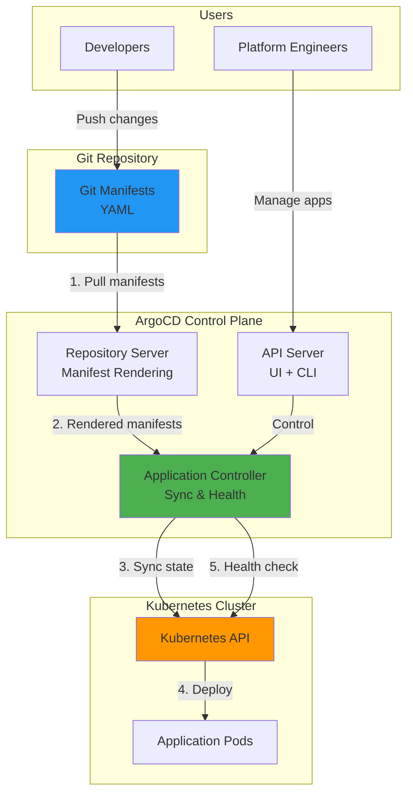
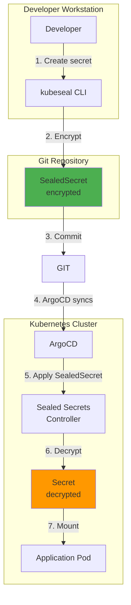

# GitOps Workflows: Best Practices for Continuous Deployment

**Version**: 1.0
**Last Updated**: 2025-11-13
**Status**: Production Ready
**Audience**: Platform Engineers, DevOps Engineers, SRE

Comprehensive guide to GitOps workflows and best practices for the Kagenti platform, covering App-of-Apps patterns, ApplicationSets migration, multi-environment deployments, and operational procedures.

---

## Table of Contents

- [Overview](#overview)
- [What is GitOps?](#what-is-gitops)
- [ArgoCD App-of-Apps Pattern](#argocd-app-of-apps-pattern)
- [ApplicationSets Migration](#applicationsets-migration)
- [Multi-Environment Strategy](#multi-environment-strategy)
- [Sync Waves and Ordering](#sync-waves-and-ordering)
- [Secret Management in GitOps](#secret-management-in-gitops)
- [Rollback Strategies](#rollback-strategies)
- [Operational Procedures](#operational-procedures)
- [Best Practices](#best-practices)
- [Troubleshooting](#troubleshooting)
- [Alternatives](#alternatives)
- [Next Steps](#next-steps)
- [References](#references)

---

## Overview

**Purpose**: Establish GitOps workflows and best practices for managing the Kagenti platform declaratively with ArgoCD.

**What You Get**:
- ✅ GitOps fundamentals and principles
- ✅ App-of-Apps pattern for hierarchical application management
- ✅ ApplicationSets for multi-environment deployments
- ✅ Sync waves for ordered deployments
- ✅ Secret management strategies (Sealed Secrets, External Secrets)
- ✅ Rollback and disaster recovery procedures
- ✅ Operational best practices and troubleshooting

**Key Principle**: **Git is the single source of truth**. All platform configuration lives in Git, and the cluster state converges to match Git automatically via ArgoCD.

**Source**: Based on [OpenGitOps Principles](https://opengitops.dev/), [ArgoCD Best Practices](https://argo-cd.readthedocs.io/en/stable/user-guide/best_practices/)

---

## What is GitOps?

### The Four Principles

**1. Declarative**
- ✅ System desired state expressed declaratively (YAML manifests)
- ✅ No imperative commands (no `kubectl apply`, no manual edits)

**2. Versioned and Immutable**
- ✅ Desired state stored in Git (version controlled)
- ✅ Complete audit trail via Git history

**3. Pulled Automatically**
- ✅ Software agents (ArgoCD) pull desired state from Git
- ✅ No push-based deployments (no CI/CD pushing to cluster)

**4. Continuously Reconciled**
- ✅ Software agents continuously observe and reconcile state
- ✅ Drift detection and auto-correction

**Source**: [OpenGitOps Principles](https://opengitops.dev/)

---

### GitOps vs Traditional CI/CD

| Aspect | Traditional CI/CD | GitOps |
|--------|------------------|--------|
| **Deployment Method** | Push (CI pushes to cluster) | Pull (ArgoCD pulls from Git) |
| **Source of Truth** | CI pipeline state | Git repository |
| **State Drift** | Not detected | Detected and corrected |
| **Rollback** | Re-run old pipeline | Git revert |
| **Audit Trail** | CI logs | Git history |
| **Security** | CI needs cluster credentials | ArgoCD runs in-cluster (no external credentials) |
| **Declarative** | Imperative scripts | Declarative YAML |

**Source**: [GitOps vs Traditional CI/CD](https://www.weave.works/blog/gitops-vs-traditional-cicd)

---

### ArgoCD Architecture



**Components**:
- **Repository Server**: Clones Git repos, renders manifests (Helm, Kustomize, plain YAML)
- **Application Controller**: Watches cluster state, syncs to Git desired state
- **API Server**: Provides UI, CLI, and webhook endpoints
- **Redis**: Caching layer for repository and cluster state

**Source**: [ArgoCD Architecture](https://argo-cd.readthedocs.io/en/stable/operator-manual/architecture/)

---

## ArgoCD App-of-Apps Pattern

### Concept

**App-of-Apps**: A single ArgoCD Application that deploys other ArgoCD Applications.

**Why?**:
- ✅ Single entry point for entire platform
- ✅ Hierarchical organization (infra → platform → apps)
- ✅ Ordered deployments via sync waves
- ✅ Easy disaster recovery (redeploy root app)

**Structure**:
```
kagenti-apps (root app)
├── infrastructure (wave 0)
│   ├── gateway-api
│   ├── cert-manager
│   ├── istio-base
│   ├── istiod
│   └── istio-config
├── platform (wave 5-15)
│   ├── keycloak (wave 5)
│   ├── kagenti-operator (wave 10)
│   └── kagenti-ui (wave 15)
├── observability (wave 20)
│   ├── grafana
│   ├── tempo
│   └── phoenix
└── agents (wave 25)
    ├── research-agent
    ├── code-agent
    └── orchestrator-agent
```

**Source**: [ArgoCD App-of-Apps](https://argo-cd.readthedocs.io/en/stable/operator-manual/cluster-bootstrapping/)

---

### Root Application Manifest

**File**: `argocd/apps/kagenti-apps.yaml`

```yaml
apiVersion: argoproj.io/v1alpha1
kind: Application
metadata:
  name: kagenti-apps
  namespace: argocd
  finalizers:
  - resources-finalizer.argocd.argoproj.io  # Cascade delete
spec:
  project: default
  source:
    repoURL: https://github.com/Ladas/kagenti-demo-deployment
    targetRevision: main
    path: argocd/apps  # Directory containing child apps
  destination:
    server: https://kubernetes.default.svc
    namespace: argocd
  syncPolicy:
    automated:
      prune: true      # Delete resources not in Git
      selfHeal: true   # Auto-correct drift
    syncOptions:
    - CreateNamespace=true
```

**Bootstrap**:
```bash
# Deploy root app
kubectl apply -f argocd/apps/kagenti-apps.yaml -n argocd

# Watch apps deploy
argocd app list
argocd app get kagenti-apps
```

---

### Child Application Manifest

**File**: `argocd/apps/infrastructure/gateway-api.yaml`

```yaml
apiVersion: argoproj.io/v1alpha1
kind: Application
metadata:
  name: gateway-api
  namespace: argocd
  annotations:
    argocd.argoproj.io/sync-wave: "0"  # Deploy first
spec:
  project: default
  source:
    repoURL: https://github.com/Ladas/kagenti-demo-deployment
    targetRevision: main
    path: components/00-infrastructure/gateway-api/overlays/kind-local
  destination:
    server: https://kubernetes.default.svc
    namespace: gateway-system
  syncPolicy:
    automated:
      prune: true
      selfHeal: true
    syncOptions:
    - CreateNamespace=true
    retry:
      limit: 5
      backoff:
        duration: 5s
        factor: 2
        maxDuration: 3m
```

**Source**: [ArgoCD Application Spec](https://argo-cd.readthedocs.io/en/stable/user-guide/application-specification/)

---

## ApplicationSets Migration

### Why ApplicationSets?

**Current State**: Individual Application manifests per app per environment (N apps × M envs = N×M manifests)

**Target State**: Single ApplicationSet generates applications dynamically

**Benefits**:
- ✅ **DRY** (Don't Repeat Yourself) - Define pattern once, apply to all apps
- ✅ **Scalability** - Easy to add new environments or apps
- ✅ **Consistency** - All apps use same deployment pattern
- ✅ **Reduced Maintenance** - Update one ApplicationSet, not 50+ Applications

**Source**: [ArgoCD ApplicationSets](https://argo-cd.readthedocs.io/en/stable/operator-manual/applicationset/)

---

### ApplicationSet Generators

**1. List Generator** - Explicit list of apps/environments

```yaml
apiVersion: argoproj.io/v1alpha1
kind: ApplicationSet
metadata:
  name: infrastructure-apps
  namespace: argocd
spec:
  generators:
  - list:
      elements:
      - name: gateway-api
        namespace: gateway-system
        syncWave: "0"
      - name: cert-manager
        namespace: cert-manager
        syncWave: "0"
      - name: istio-base
        namespace: istio-system
        syncWave: "0"
  template:
    metadata:
      name: '{{name}}'
      annotations:
        argocd.argoproj.io/sync-wave: '{{syncWave}}'
    spec:
      project: default
      source:
        repoURL: https://github.com/Ladas/kagenti-demo-deployment
        targetRevision: main
        path: 'components/00-infrastructure/{{name}}/overlays/kind-local'
      destination:
        server: https://kubernetes.default.svc
        namespace: '{{namespace}}'
      syncPolicy:
        automated:
          prune: true
          selfHeal: true
```

**Source**: [List Generator](https://argo-cd.readthedocs.io/en/stable/operator-manual/applicationset/Generators-List/)

---

**2. Git Directory Generator** - Auto-discover apps from Git directory structure

```yaml
apiVersion: argoproj.io/v1alpha1
kind: ApplicationSet
metadata:
  name: infrastructure-apps
  namespace: argocd
spec:
  generators:
  - git:
      repoURL: https://github.com/Ladas/kagenti-demo-deployment
      revision: main
      directories:
      - path: components/00-infrastructure/*
  template:
    metadata:
      name: '{{path.basename}}'
    spec:
      project: default
      source:
        repoURL: https://github.com/Ladas/kagenti-demo-deployment
        targetRevision: main
        path: '{{path}}/overlays/kind-local'
      destination:
        server: https://kubernetes.default.svc
      syncPolicy:
        automated:
          prune: true
          selfHeal: true
```

**Source**: [Git Directory Generator](https://argo-cd.readthedocs.io/en/stable/operator-manual/applicationset/Generators-Git/)

---

**3. Matrix Generator** - Combine multiple generators (apps × environments)

```yaml
apiVersion: argoproj.io/v1alpha1
kind: ApplicationSet
metadata:
  name: platform-apps
  namespace: argocd
spec:
  generators:
  - matrix:
      generators:
      # Generator 1: List of apps
      - list:
          elements:
          - name: keycloak
            namespace: keycloak
          - name: grafana
            namespace: observability
      # Generator 2: List of environments
      - list:
          elements:
          - env: kind-local
            cluster: https://kubernetes.default.svc
          - env: openshift-prod
            cluster: https://openshift-prod.example.com
  template:
    metadata:
      name: '{{name}}-{{env}}'
    spec:
      project: default
      source:
        repoURL: https://github.com/Ladas/kagenti-demo-deployment
        targetRevision: main
        path: 'components/01-platform/{{name}}/overlays/{{env}}'
      destination:
        server: '{{cluster}}'
        namespace: '{{namespace}}'
      syncPolicy:
        automated:
          prune: true
          selfHeal: true
```

**Source**: [Matrix Generator](https://argo-cd.readthedocs.io/en/stable/operator-manual/applicationset/Generators-Matrix/)

---

### Migration Strategy

**Phase 1: Proof of Concept** (Week 1)
```bash
# Create ApplicationSet for infrastructure apps
cat <<EOF | kubectl apply -f -
apiVersion: argoproj.io/v1alpha1
kind: ApplicationSet
metadata:
  name: infrastructure-apps
  namespace: argocd
spec:
  generators:
  - list:
      elements:
      - name: gateway-api
      - name: cert-manager
  template:
    # ... (template from above)
EOF

# Verify apps created
argocd app list | grep gateway-api
argocd app list | grep cert-manager
```

**Phase 2: Migrate Category** (Week 2-3)
- Migrate all infrastructure apps (wave 0)
- Migrate all platform apps (wave 5-15)
- Migrate all observability apps (wave 20)

**Phase 3: Multi-Environment** (Week 4)
- Add Matrix generator for kind-local + openshift-prod
- Test environment-specific overlays

**Phase 4: Complete Migration** (Week 5)
- Replace all individual Applications with ApplicationSets
- Delete old Application manifests from Git

**Source**: [ApplicationSet Migration Guide](https://argo-cd.readthedocs.io/en/stable/operator-manual/applicationset/Migration/)

---

## Multi-Environment Strategy

### Kustomize Overlays

**Structure**:
```
components/00-infrastructure/gateway-api/
├── base/                          # Common base configuration
│   ├── kustomization.yaml
│   ├── namespace.yaml
│   └── crd.yaml
├── overlays/
│   ├── kind-local/                # Kind development environment
│   │   ├── kustomization.yaml
│   │   └── patches/
│   │       └── resources.yaml     # Lower resources for dev
│   ├── openshift-local/           # OpenShift CRC (local testing)
│   │   ├── kustomization.yaml
│   │   └── patches/
│   │       └── security.yaml      # OpenShift SCCs
│   ├── openshift-stage/           # OpenShift staging
│   │   ├── kustomization.yaml
│   │   └── patches/
│   │       └── replicas.yaml      # Medium HA (2 replicas)
│   └── openshift-prod/            # OpenShift production
│       ├── kustomization.yaml
│       └── patches/
│           ├── replicas.yaml      # High HA (3 replicas)
│           ├── resources.yaml     # Production resources
│           └── monitoring.yaml    # Production monitoring
```

**Base Kustomization** (`base/kustomization.yaml`):
```yaml
apiVersion: kustomize.config.k8s.io/v1beta1
kind: Kustomization

resources:
- namespace.yaml
- https://github.com/kubernetes-sigs/gateway-api/releases/download/v1.0.0/standard-install.yaml

commonLabels:
  app.kubernetes.io/name: gateway-api
  app.kubernetes.io/component: networking
```

**Kind Overlay** (`overlays/kind-local/kustomization.yaml`):
```yaml
apiVersion: kustomize.config.k8s.io/v1beta1
kind: Kustomization

bases:
- ../../base

patches:
- path: patches/resources.yaml
  target:
    kind: Deployment
```

**Kind Resource Patch** (`overlays/kind-local/patches/resources.yaml`):
```yaml
# Lower resources for local development
apiVersion: apps/v1
kind: Deployment
metadata:
  name: gateway-api-controller
spec:
  template:
    spec:
      containers:
      - name: manager
        resources:
          requests:
            cpu: 100m
            memory: 128Mi
          limits:
            cpu: 500m
            memory: 512Mi
```

**Source**: [Kustomize Documentation](https://kustomize.io/)

---

### Environment-Specific ApplicationSet

```yaml
apiVersion: argoproj.io/v1alpha1
kind: ApplicationSet
metadata:
  name: infrastructure-apps
  namespace: argocd
spec:
  generators:
  - matrix:
      generators:
      # Apps
      - list:
          elements:
          - name: gateway-api
          - name: cert-manager
          - name: istio-base
      # Environments
      - list:
          elements:
          - env: kind-local
            cluster: https://kubernetes.default.svc
          - env: openshift-prod
            cluster: https://api.openshift-prod.example.com:6443
  template:
    metadata:
      name: '{{name}}-{{env}}'
    spec:
      project: default
      source:
        repoURL: https://github.com/Ladas/kagenti-demo-deployment
        targetRevision: main
        path: 'components/00-infrastructure/{{name}}/overlays/{{env}}'
      destination:
        server: '{{cluster}}'
      syncPolicy:
        automated:
          prune: true
          selfHeal: true
```

---

## Sync Waves and Ordering

### Why Sync Waves?

**Problem**: Applications have dependencies (e.g., Istio must deploy before apps using Istio)

**Solution**: Sync waves ensure ordered deployment

**How It Works**:
- Wave 0 deploys first, then wave 1, then wave 2, etc.
- ArgoCD waits for all apps in wave N to be healthy before starting wave N+1

**Source**: [ArgoCD Sync Waves](https://argo-cd.readthedocs.io/en/stable/user-guide/sync-waves/)

---

### Kagenti Platform Sync Waves

```
Wave 0: Infrastructure Layer
├── gateway-api (CRD for ingress)
├── cert-manager (TLS certificates)
├── istio-base (Istio CRDs)
├── istiod (Istio control plane)
└── istio-config (Gateway, mTLS policies)
    ↓ (wait for all to be healthy)

Wave 5: Authentication Layer
└── keycloak (SSO provider)
    ↓

Wave 10: Operators Layer
└── kagenti-operator (Agent CRDs and controller)
    ↓

Wave 15: Platform Services Layer
└── kagenti-ui (Platform UI)
    ↓

Wave 20: Observability Layer
├── grafana (Dashboards)
├── prometheus (Metrics)
├── tempo (Distributed tracing)
└── phoenix (LLM observability)
    ↓

Wave 25: Application Layer
├── research-agent
├── code-agent
└── orchestrator-agent
```

**Configuration**:
```yaml
apiVersion: argoproj.io/v1alpha1
kind: Application
metadata:
  name: gateway-api
  annotations:
    argocd.argoproj.io/sync-wave: "0"  # Deploy first
spec:
  # ...
```

---

### Sync Wave Best Practices

**1. Use Increments of 5**
- Wave 0, 5, 10, 15, 20, 25, ...
- Allows inserting new waves between existing (e.g., wave 3 between 0 and 5)

**2. Group by Dependency Layer**
- Don't mix infrastructure and apps in same wave
- Keep blast radius small (fewer apps per wave)

**3. Test Wave Ordering**
```bash
# Sync all apps in order
argocd app sync -l argocd.argoproj.io/instance=kagenti-apps --async

# Watch deployment order
argocd app list | sort -k 3  # Sort by sync wave
```

**4. Negative Waves for Pre-Requisites**
- Wave -1: Namespaces, ClusterRoles
- Wave 0: CRDs, Operators

**Source**: [Sync Wave Best Practices](https://argo-cd.readthedocs.io/en/stable/user-guide/sync-waves/#best-practices)

---

## Secret Management in GitOps

### The Challenge

**Problem**: Secrets can't be stored in Git plaintext

**Solutions**:
1. **Sealed Secrets** - Encrypt secrets client-side, decrypt in-cluster
2. **External Secrets Operator** - Fetch secrets from external vault (Vault, AWS Secrets Manager)
3. **ArgoCD Vault Plugin** - ArgoCD fetches secrets from Vault during sync

**Source**: [GitOps Secret Management](https://www.weave.works/blog/managing-secrets-in-git-repos)

---

### Sealed Secrets Workflow



**Usage**:
```bash
# Create SealedSecret from literal
kubectl create secret generic db-password \
  --from-literal=password=secret123 \
  --dry-run=client -o yaml | \
  kubeseal -o yaml > sealed-db-password.yaml

# Commit to Git (encrypted, safe)
git add sealed-db-password.yaml
git commit -m "Add database password (encrypted)"
git push

# ArgoCD syncs, controller decrypts
argocd app sync keycloak
kubectl get secret db-password -n keycloak  # Exists
```

**Source**: [Sealed Secrets Guide](../08-security/secrets-management.md#sealed-secrets)

---

### External Secrets Operator Workflow

```yaml
# ExternalSecret references Vault secret
apiVersion: external-secrets.io/v1beta1
kind: ExternalSecret
metadata:
  name: db-credentials
  namespace: keycloak
spec:
  refreshInterval: 1h  # Sync from Vault every hour
  secretStoreRef:
    name: vault-backend
    kind: SecretStore
  target:
    name: db-credentials  # Name of Kubernetes Secret to create
  data:
  - secretKey: password
    remoteRef:
      key: keycloak/db  # Path in Vault
      property: password
```

**Workflow**:
1. Developer creates secret in Vault (outside Git)
2. ExternalSecret manifest committed to Git (only reference, not secret value)
3. ArgoCD syncs ExternalSecret to cluster
4. External Secrets Operator fetches secret from Vault
5. Operator creates Kubernetes Secret with fetched value

**Source**: [External Secrets Guide](../08-security/secrets-management.md#external-secrets-operator)

---

## Rollback Strategies

### Git-Based Rollback

**Scenario**: Deployment introduced bug, need to rollback quickly

**Method 1: Git Revert** (Recommended)
```bash
# Revert last commit
git revert HEAD
git push

# ArgoCD automatically syncs reverted state
argocd app sync platform
```

**Method 2: Revert to Specific Commit**
```bash
# Find commit to rollback to
git log --oneline

# Revert to specific commit
git revert abc123..HEAD
git push

# Or use ArgoCD targetRevision
argocd app set platform --revision abc123
argocd app sync platform
```

**Method 3: ArgoCD History Rollback**
```bash
# List deployment history
argocd app history platform

# Rollback to revision
argocd app rollback platform 5  # Rollback to revision 5
```

**Source**: [ArgoCD Rollback](https://argo-cd.readthedocs.io/en/stable/user-guide/commands/argocd_app_rollback/)

---

### Application-Level Rollback

**Scenario**: Single application needs rollback, not entire platform

```bash
# Rollback single app
argocd app rollback keycloak 3

# Or use Git
cd components/01-platform/keycloak
git revert HEAD
git push

# Sync only keycloak app
argocd app sync keycloak
```

---

### Emergency Rollback (Cluster-Wide)

**Scenario**: Critical platform failure, need immediate rollback

```bash
# 1. Identify last known good Git commit
git log --oneline | head -10

# 2. Set all apps to that revision
argocd app set -l argocd.argoproj.io/instance=kagenti-apps \
  --revision abc123

# 3. Force sync all apps
argocd app sync -l argocd.argoproj.io/instance=kagenti-apps \
  --force --prune

# 4. Watch recovery
argocd app list
```

**Source**: [ArgoCD Disaster Recovery](https://argo-cd.readthedocs.io/en/stable/operator-manual/disaster_recovery/)

---

## Operational Procedures

### Daily Operations

#### Check Application Health

```bash
# List all apps with health status
argocd app list

# Get detailed app status
argocd app get infrastructure

# Check sync status
argocd app get infrastructure -o json | jq '.status.sync.status'
```

**Expected Output**:
```
NAME             CLUSTER                         NAMESPACE        PROJECT  STATUS  HEALTH   SYNCPOLICY  CONDITIONS
gateway-api      https://kubernetes.default.svc  gateway-system   default  Synced  Healthy  Auto        <none>
cert-manager     https://kubernetes.default.svc  cert-manager     default  Synced  Healthy  Auto        <none>
istio-base       https://kubernetes.default.svc  istio-system     default  Synced  Healthy  Auto        <none>
```

---

#### Sync Application Manually

```bash
# Sync single app
argocd app sync keycloak

# Sync with prune (delete resources not in Git)
argocd app sync keycloak --prune

# Force sync (ignore sync windows)
argocd app sync keycloak --force

# Dry-run (preview changes)
argocd app sync keycloak --dry-run
```

---

#### View Application Diff

```bash
# Show diff between Git and cluster
argocd app diff infrastructure

# Example output:
# ===== apps/Deployment gateway-api-controller gateway-system =====
# 6c6
# <   replicas: 1
# ---
# >   replicas: 2
```

---

### Drift Detection and Correction

**Scenario**: Someone manually edited cluster state (`kubectl edit`)

```bash
# Check for drift
argocd app diff infrastructure

# Auto-heal if enabled
# (ArgoCD automatically corrects drift)

# Manual correction
argocd app sync infrastructure --force
```

**Enable Auto-Heal**:
```yaml
spec:
  syncPolicy:
    automated:
      selfHeal: true  # Automatically correct drift
```

**Source**: [ArgoCD Self-Healing](https://argo-cd.readthedocs.io/en/stable/user-guide/auto_sync/#automatic-self-healing)

---

### Pause Automatic Sync

**Scenario**: Need to make manual changes temporarily

```bash
# Disable auto-sync
argocd app set infrastructure --sync-policy none

# Make manual changes
kubectl edit deployment -n istio-system istiod

# Re-enable auto-sync
argocd app set infrastructure --sync-policy automated
```

---

## Best Practices

### 1. Git Repository Structure

**✅ Recommended Structure**:
```
repo/
├── argocd/
│   ├── apps/                      # ArgoCD Applications
│   │   ├── kagenti-apps.yaml     # Root app
│   │   └── infrastructure/
│   │       ├── gateway-api.yaml
│   │       └── cert-manager.yaml
│   └── appsets/                   # ApplicationSets
│       ├── infrastructure.yaml
│       └── platform.yaml
├── components/                    # Kubernetes manifests
│   ├── 00-infrastructure/
│   │   ├── gateway-api/
│   │   │   ├── base/
│   │   │   └── overlays/
│   │   │       ├── kind-local/
│   │   │       └── openshift-prod/
│   │   └── cert-manager/
│   │       ├── base/
│   │       └── overlays/
│   └── 01-platform/
│       └── keycloak/
└── docs/                          # Documentation
```

**Source**: [ArgoCD Best Practices](https://argo-cd.readthedocs.io/en/stable/user-guide/best_practices/)

---

### 2. One App Per Logical Component

**✅ Good**:
- `gateway-api` (single app)
- `cert-manager` (single app)
- `istio-base` (single app)

**❌ Avoid**:
- `infrastructure` (monolithic app with all infra)

**Why**: Smaller apps = easier rollback, clearer dependencies

---

### 3. Use Sync Waves for Dependencies

**✅ Good**:
```yaml
# cert-manager deploys before apps that use certificates
metadata:
  annotations:
    argocd.argoproj.io/sync-wave: "0"
```

**❌ Avoid**:
```yaml
# All apps in wave 0 (no ordering)
```

---

### 4. Enable Auto-Sync and Self-Heal

**✅ Recommended for Production**:
```yaml
spec:
  syncPolicy:
    automated:
      prune: true       # Delete resources not in Git
      selfHeal: true    # Automatically correct drift
```

**⚠️ Use with Caution**:
- `prune: true` can delete manually-created resources
- Test in dev environment first

**Source**: [ArgoCD Auto-Sync](https://argo-cd.readthedocs.io/en/stable/user-guide/auto_sync/)

---

### 5. Use Health Checks

**✅ Custom Health Checks** for CRDs:
```yaml
# argocd-cm ConfigMap
data:
  resource.customizations: |
    kagenti.io/Agent:
      health.lua: |
        hs = {}
        if obj.status ~= nil then
          if obj.status.phase == "Running" then
            hs.status = "Healthy"
            hs.message = "Agent is running"
            return hs
          end
        end
        hs.status = "Progressing"
        hs.message = "Waiting for agent to start"
        return hs
```

**Source**: [ArgoCD Custom Health Checks](https://argo-cd.readthedocs.io/en/stable/operator-manual/health/)

---

### 6. Use Projects for Multi-Tenancy

**Scenario**: Multiple teams sharing ArgoCD

```yaml
apiVersion: argoproj.io/v1alpha1
kind: AppProject
metadata:
  name: team1
  namespace: argocd
spec:
  description: Team 1 applications
  sourceRepos:
  - https://github.com/Ladas/kagenti-demo-deployment
  destinations:
  - namespace: team1
    server: https://kubernetes.default.svc
  clusterResourceWhitelist:
  - group: ''
    kind: Namespace
  namespaceResourceWhitelist:
  - group: 'apps'
    kind: Deployment
  - group: ''
    kind: Service
```

**Source**: [ArgoCD Projects](https://argo-cd.readthedocs.io/en/stable/user-guide/projects/)

---

### 7. Tag Git Commits for Releases

```bash
# Tag release
git tag -a v1.0.0 -m "Production release 1.0.0"
git push origin v1.0.0

# Deploy tagged release
argocd app set platform --revision v1.0.0
argocd app sync platform
```

**Benefits**:
- ✅ Clear release history
- ✅ Easy rollback to named releases
- ✅ Audit trail (what was deployed when)

---

### 8. Monitor ArgoCD Metrics

**ArgoCD Metrics**:
```bash
# Port-forward to metrics endpoint
kubectl port-forward -n argocd svc/argocd-metrics 8082:8082

# Query Prometheus metrics
curl http://localhost:8082/metrics | grep argocd_app_health_status
```

**Key Metrics**:
- `argocd_app_health_status` - Application health
- `argocd_app_sync_status` - Sync status
- `argocd_app_sync_total` - Sync count

**Grafana Dashboard**: [ArgoCD Dashboard](https://github.com/argoproj/argo-cd/blob/master/examples/dashboard.json)

**Source**: [ArgoCD Metrics](https://argo-cd.readthedocs.io/en/stable/operator-manual/metrics/)

---

## Troubleshooting

### Issue: Application Stuck in "Progressing"

**Symptoms**: App shows "Progressing" indefinitely

**Diagnosis**:
```bash
# Check app status
argocd app get infrastructure

# Check resource conditions
argocd app get infrastructure -o yaml | grep -A 10 conditions

# Common causes:
# - Pod pending (insufficient resources)
# - Image pull error
# - Readiness probe failing
```

**Fix**:
```bash
# Check pod status
kubectl get pods -n istio-system

# Check events
kubectl get events -n istio-system --sort-by='.lastTimestamp'

# Force sync
argocd app sync infrastructure --force
```

**Source**: [ArgoCD Health Assessment](https://argo-cd.readthedocs.io/en/stable/user-guide/health/)

---

### Issue: Application OutOfSync

**Symptoms**: App shows "OutOfSync" status

**Diagnosis**:
```bash
# Check diff
argocd app diff infrastructure

# Example:
# ===== apps/Deployment istiod istio-system =====
# 10c10
# <   image: docker.io/istio/pilot:1.19.0
# ---
# >   image: docker.io/istio/pilot:1.18.0
```

**Fix**:

1. **If Git is correct**:
```bash
# Sync to Git state
argocd app sync infrastructure --prune
```

2. **If cluster is correct**:
```bash
# Update Git to match cluster
kubectl get deployment istiod -n istio-system -o yaml > istiod.yaml
# Edit istiod.yaml, commit to Git
```

**Source**: [ArgoCD Sync Status](https://argo-cd.readthedocs.io/en/stable/user-guide/sync-options/)

---

### Issue: Sync Fails with "already exists"

**Symptoms**: Sync fails with "resource already exists"

**Diagnosis**:
```bash
# Check error
argocd app get infrastructure

# Error:
# The Deployment "istiod" is invalid: metadata.name: duplicate resource
```

**Root Cause**: Resource was manually created, not managed by ArgoCD

**Fix**:

1. **Import existing resource**:
```bash
# ArgoCD will adopt existing resource
argocd app sync infrastructure --force
```

2. **Or delete manually-created resource**:
```bash
kubectl delete deployment istiod -n istio-system
argocd app sync infrastructure
```

**Source**: [ArgoCD Resource Tracking](https://argo-cd.readthedocs.io/en/stable/user-guide/resource_tracking/)

---

### Issue: Secret Decryption Failed

**Symptoms**: SealedSecret exists but no Secret created

**Diagnosis**:
```bash
# Check SealedSecret controller logs
kubectl logs -n kube-system deployment/sealed-secrets-controller

# Error:
# "cannot unseal: no key could decrypt secret"
```

**Root Cause**: SealedSecret encrypted with different controller key

**Fix**:
```bash
# Re-encrypt with current controller key
kubectl create secret generic db-password \
  --from-literal=password=secret123 \
  --dry-run=client -o yaml | \
  kubeseal -o yaml > sealed-db-password.yaml

# Replace in Git
git add sealed-db-password.yaml
git commit -m "Re-encrypt secret with current key"
git push
```

**Source**: [Sealed Secrets Troubleshooting](../08-security/secrets-management.md#troubleshooting)

---

## Alternatives

### Alternative 1: Flux CD

**Process**:
- Install Flux controllers in cluster
- Configure GitRepository and Kustomization CRDs
- Flux watches Git, applies changes

**Pros**:
- ✅ GitOps-native (pull-based, like ArgoCD)
- ✅ Lightweight (fewer components than ArgoCD)
- ✅ Helm and Kustomize support
- ✅ Image automation (update image tags in Git)

**Cons**:
- ❌ No UI (CLI-only)
- ❌ Less mature than ArgoCD
- ❌ Smaller community

**When to Use**: Prefer CLI over UI, need image automation, smaller footprint desired

**Source**: [Flux CD Documentation](https://fluxcd.io/flux/)

---

### Alternative 2: Jenkins X

**Process**:
- Install Jenkins X operator
- Define pipelines in `.lighthouse/` directory
- Lighthouse handles PR automation

**Pros**:
- ✅ GitOps-first approach
- ✅ Preview environments for PRs
- ✅ ChatOps integration
- ✅ Jenkins ecosystem

**Cons**:
- ❌ More opinionated than ArgoCD/Flux
- ❌ Complex setup
- ❌ Requires Lighthouse and Tekton

**When to Use**: Need preview environments, Jenkins expertise, opinionated pipelines

**Source**: [Jenkins X Documentation](https://jenkins-x.io/v3/)

---

### Alternative 3: Spinnaker

**Process**:
- Deploy Spinnaker (Halyard or Operator)
- Configure pipelines in UI
- Pipelines deploy to Kubernetes

**Pros**:
- ✅ Multi-cloud support (AWS, GCP, Azure, Kubernetes)
- ✅ Powerful pipeline DSL
- ✅ Canary deployments built-in
- ✅ Mature (Netflix-originated)

**Cons**:
- ❌ Complex architecture (many microservices)
- ❌ Heavy resource usage
- ❌ Not GitOps-native (pipelines stored in Spinnaker)

**When to Use**: Multi-cloud deployments, canary deployments required, Netflix-style pipelines

**Source**: [Spinnaker Documentation](https://spinnaker.io/docs/)

---

## Next Steps

### For Development

1. **Test ApplicationSets**:
   ```bash
   # Create List generator ApplicationSet
   kubectl apply -f argocd/appsets/infrastructure.yaml

   # Verify apps created
   argocd app list | grep infrastructure
   ```

2. **Add New Application**:
   ```yaml
   # argocd/apps/new-app.yaml
   apiVersion: argoproj.io/v1alpha1
   kind: Application
   metadata:
     name: new-app
     annotations:
       argocd.argoproj.io/sync-wave: "20"
   spec:
     # ... (spec)
   ```

3. **Test Rollback**:
   ```bash
   # Deploy change
   git commit -m "Update config"
   git push

   # Rollback
   git revert HEAD
   git push
   ```

### For Production

1. **Migrate to ApplicationSets**:
   ```bash
   # Phase 1: Create ApplicationSet for infrastructure
   # Phase 2: Create ApplicationSet for platform
   # Phase 3: Delete individual Application manifests
   ```

2. **Enable Monitoring**:
   ```bash
   # Add ArgoCD Grafana dashboard
   # Set up alerts for OutOfSync apps
   ```

3. **Document Procedures**:
   - Rollback procedures
   - Disaster recovery plan
   - Sync wave ordering rationale

### Learn More

- [ArgoCD Documentation](../01-infrastructure/argocd.md)
- [Tekton Pipelines](./tekton.md)
- [Secret Management](../08-security/secrets-management.md)
- [Troubleshooting Guide](../10-operations/troubleshooting.md)

---

## References

### Official Documentation

- **OpenGitOps**: [opengitops.dev](https://opengitops.dev/)
- **ArgoCD**: [argo-cd.readthedocs.io](https://argo-cd.readthedocs.io/)
- **ApplicationSets**: [argo-cd.readthedocs.io/applicationset](https://argo-cd.readthedocs.io/en/stable/operator-manual/applicationset/)
- **Kustomize**: [kustomize.io](https://kustomize.io/)
- **Sealed Secrets**: [github.com/bitnami-labs/sealed-secrets](https://github.com/bitnami-labs/sealed-secrets)

### Community Resources

- **Awesome ArgoCD**: [github.com/terrytangyuan/awesome-argo](https://github.com/terrytangyuan/awesome-argo)
- **GitOps Working Group**: [github.com/open-gitops/project](https://github.com/open-gitops/project)
- **Weave GitOps Blog**: [weave.works/blog/category/gitops](https://www.weave.works/blog/category/gitops/)

### Internal Documentation

- **Main README**: [../../README.md](../../README.md)
- **Architecture Overview**: [../00-getting-started/architecture-overview.md](../00-getting-started/architecture-overview.md)
- **ArgoCD Guide**: [../01-infrastructure/argocd.md](../01-infrastructure/argocd.md)
- **Secret Management**: [../08-security/secrets-management.md](../08-security/secrets-management.md)

### Repository

- **GitHub**: [Ladas/kagenti-demo-deployment](https://github.com/Ladas/kagenti-demo-deployment)
- **ArgoCD Apps**: `argocd/apps/`
- **Components**: `components/`

---

**Last Updated**: 2025-11-13
**Document Version**: 1.0
**Maintained By**: Platform Engineering Team
**License**: Apache 2.0
