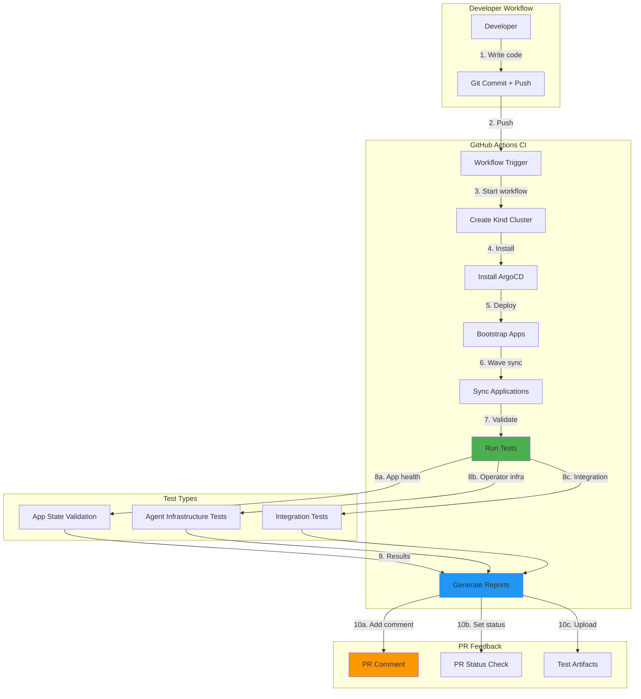
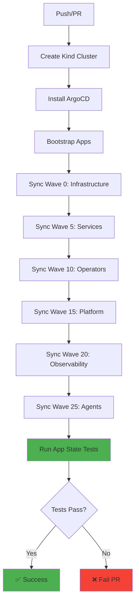
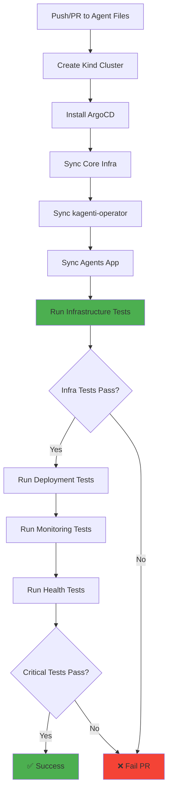

# Tekton Pipelines: Cloud-Native CI/CD for Kubernetes

**Version**: 1.0
**Last Updated**: 2025-11-13
**Status**: Production Ready
**Audience**: Platform Engineers, DevOps Engineers, Developers

Comprehensive guide to Tekton Pipelines for cloud-native CI/CD on Kubernetes, covering installation, configuration, GitHub Actions integration, and best practices for the Kagenti platform.

---

## Table of Contents

- [Overview](#overview)
- [What is Tekton?](#what-is-tekton)
- [Architecture](#architecture)
- [Installation](#installation)
- [GitHub Actions Integration](#github-actions-integration)
- [CI/CD Workflows](#cicd-workflows)
- [Test Automation](#test-automation)
- [Pipeline Configuration](#pipeline-configuration)
- [Best Practices](#best-practices)
- [Troubleshooting](#troubleshooting)
- [Alternatives](#alternatives)
- [Next Steps](#next-steps)
- [References](#references)

---

## Overview

**Purpose**: Provide cloud-native CI/CD capabilities using Tekton Pipelines and GitHub Actions for the Kagenti AI Agent Platform.

**What You Get**:
- ✅ Kubernetes-native CI/CD with Tekton Pipelines
- ✅ GitHub Actions workflows for automated testing
- ✅ App state validation (ArgoCD health checks)
- ✅ Agent integration tests (operator infrastructure)
- ✅ Automated PR comments with test results
- ✅ Test artifact retention and reporting
- ✅ Multi-environment testing strategy

**Key Principle**: **Test what matters in CI, defer what requires manual intervention**. Infrastructure tests validate operator readiness without requiring full agent images, while comprehensive local testing validates end-to-end functionality.

**Source**: Based on [Tekton Documentation](https://tekton.dev/docs/), [GitHub Actions Documentation](https://docs.github.com/en/actions)

---

## What is Tekton?

### Concept

Tekton is a **cloud-native CI/CD framework** for Kubernetes that provides:

1. **Cloud-Native Architecture** - Pipelines run as Kubernetes pods
2. **Reusable Components** - Tasks, Pipelines, and Triggers as Kubernetes CRDs
3. **GitOps-Friendly** - Pipeline definitions stored as YAML in Git
4. **Vendor-Neutral** - Not tied to any specific CI vendor (Jenkins, GitLab, etc.)
5. **Event-Driven** - Triggers respond to Git webhooks, image updates, etc.

**How It Works**:
```
GitHub Push → EventListener → TriggerBinding → TaskRun → Pod (build/test) → Results
```

**Source**: [Tekton Concepts](https://tekton.dev/docs/concepts/)

---

### Why We Use GitHub Actions (Not Tekton)

**Current Choice**: GitHub Actions for CI/CD

**Reasons**:
- ✅ **Simpler Setup** - No in-cluster infrastructure required
- ✅ **Free for Public Repos** - GitHub provides hosted runners
- ✅ **Rich Ecosystem** - Pre-built actions for common tasks
- ✅ **PR Integration** - Native GitHub PR comments and status checks
- ✅ **Matrix Testing** - Easy to test multiple Kubernetes versions

**When to Use Tekton**:
- Production deployments requiring in-cluster CI/CD
- Multi-cloud deployments (not tied to GitHub)
- Air-gapped environments
- Complex multi-stage pipelines requiring k8s-native features

**Source**: [GitHub Actions vs Tekton Comparison](https://docs.github.com/en/actions)

---

### Deployment Methods

| Method | Environment | Why |
|--------|-------------|-----|
| **GitHub Actions** | Kind (dev), Public repos | Free hosted runners, simple setup |
| **Tekton Operator** | OpenShift (prod) | Kubernetes-native, OLM lifecycle management |
| **Tekton Upstream Helm** | Kind (self-hosted runners) | Full control, air-gapped deployments |

**Current Implementation**: GitHub Actions workflows in `.github/workflows/`

**Source**: [Tekton Installation](https://tekton.dev/docs/installation/)

---

## Architecture

### GitHub Actions + ArgoCD GitOps Flow



**Flow Explanation**:
1. Developer pushes code to GitHub
2. GitHub Actions workflow triggers (push or PR)
3. Workflow creates ephemeral Kind cluster
4. ArgoCD installed and configured
5. Applications bootstrapped (App-of-Apps pattern)
6. Applications synced in wave order (0 → 25)
7. Tests run against deployed applications
8. Test results collected and aggregated
9. PR comment added with test summary
10. Test artifacts uploaded for retention

**Source**: [GitHub Actions Workflow Syntax](https://docs.github.com/en/actions/using-workflows/workflow-syntax-for-github-actions)

---

## Installation

### Method 1: GitHub Actions (Current)

**No installation required** - GitHub Actions workflows run on GitHub-hosted runners.

**Prerequisites**:
- GitHub repository
- `.github/workflows/` directory with workflow YAML files
- GitHub Actions enabled on repository

**Verification**:
```bash
# Check workflows exist
ls -la .github/workflows/

# Expected files:
# - app-state-validation.yml
# - agent-integration-tests.yml
```

**Source**: [GitHub Actions Quickstart](https://docs.github.com/en/actions/quickstart)

---

### Method 2: Tekton Operator (OpenShift)

**For production OpenShift deployments with OLM**.

**Prerequisites**:
- OpenShift cluster with OLM
- Cluster admin permissions

**Installation via OLM**:

```bash
# Create namespace
kubectl create namespace tekton-pipelines

# Create Subscription
cat <<EOF | kubectl apply -f -
apiVersion: operators.coreos.com/v1alpha1
kind: Subscription
metadata:
  name: openshift-pipelines-operator
  namespace: openshift-operators
spec:
  channel: latest
  name: openshift-pipelines-operator-rh
  source: redhat-operators
  sourceNamespace: openshift-marketplace
EOF

# Verify installation
kubectl get csv -n openshift-operators | grep openshift-pipelines
kubectl get pods -n openshift-pipelines

# Expected:
# NAME                                          READY   STATUS
# tekton-pipelines-controller-xxx              1/1     Running
# tekton-pipelines-webhook-xxx                 1/1     Running
# tekton-triggers-controller-xxx               1/1     Running
```

**Source**: [OpenShift Pipelines Installation](https://docs.openshift.com/pipelines/latest/install_config/installing-pipelines.html)

---

### Method 3: Tekton Upstream (Kubernetes)

**For self-hosted Kubernetes deployments**.

**Installation via YAML**:

```bash
# Install Tekton Pipelines
kubectl apply --filename https://storage.googleapis.com/tekton-releases/pipeline/latest/release.yaml

# Install Tekton Triggers (for webhooks)
kubectl apply --filename https://storage.googleapis.com/tekton-releases/triggers/latest/release.yaml

# Install Tekton Dashboard (optional)
kubectl apply --filename https://storage.googleapis.com/tekton-releases/dashboard/latest/release.yaml

# Verify installation
kubectl get pods -n tekton-pipelines

# Expected:
# tekton-pipelines-controller-xxx    1/1     Running
# tekton-pipelines-webhook-xxx       1/1     Running
# tekton-triggers-controller-xxx     1/1     Running
```

**Source**: [Tekton Installation](https://tekton.dev/docs/installation/)

---

## GitHub Actions Integration

### Current Workflows

The Kagenti platform uses **GitHub Actions** for CI/CD with two primary workflows:

1. **App State Validation** - Validates ArgoCD application health
2. **Agent Integration Tests** - Validates agent operator infrastructure

**Source**: [CI/CD Testing Strategy](../CI_CD_TESTING.md)

---

### Workflow 1: App State Validation

**File**: `.github/workflows/app-state-validation.yml`

**Purpose**: Ensure all ArgoCD applications are synced and healthy.

**Triggers**:
```yaml
on:
  push:
    branches:
      - main
      - argocd-gitops-dev
  pull_request:
    branches:
      - main
      - argocd-gitops-dev
  workflow_dispatch:
    inputs:
      cluster_mode:
        description: 'Cluster mode (kind or existing)'
        required: false
        default: 'kind'
      exclude_apps:
        description: 'Comma-separated apps to exclude'
        required: false
      only_critical:
        description: 'Only test critical apps'
        type: boolean
        required: false
        default: false
```

**What It Tests**:
- ✅ All ArgoCD applications exist
- ✅ All applications are synced
- ✅ All applications are healthy
- ✅ No pods in CrashLoopBackOff

**Test Execution**:
```yaml
- name: Run app state validation
  run: |
    pytest tests/validation/test_app_state.py -v \
      --html=report.html \
      --self-contained-html \
      --json-report \
      --json-report-file=report.json
```

**Duration**: ~30 minutes (includes cluster creation and app sync)

**Outputs**:
- PR comment with test summary
- HTML/JSON test reports as artifacts
- PR status check (pass/fail)

**Source**: [test_app_state.py](../tests/validation/test_app_state.py)

---

### Workflow 2: Agent Integration Tests

**File**: `.github/workflows/agent-integration-tests.yml`

**Purpose**: Validate agent operator infrastructure is ready to manage agents.

**Triggers**:
```yaml
on:
  push:
    branches:
      - main
      - argocd-gitops-dev
    paths:
      - 'components/05-agents/**'
      - 'tests/integration/test_agents.py'
  pull_request:
    paths:
      - 'components/05-agents/**'
      - 'tests/integration/test_agents.py'
  workflow_dispatch:
    inputs:
      cluster_mode:
        description: 'Cluster mode (kind or existing)'
        default: 'kind'
      load_images:
        description: 'Load agent images'
        type: boolean
        default: false
```

**What It Tests**:
- ✅ Agent CRDs installed (agents, agentbuilds, agentcards)
- ✅ Kubernetes API accessible for agent resources
- ✅ kagenti-operator webhook operational
- ✅ RBAC permissions configured correctly
- ⏭️ Agent deployment (skipped - requires images)
- ⏭️ Agent health (skipped - requires images)

**Test Breakdown**:
```python
# RUNS IN CI (Infrastructure tests)
TestAgentOperatorInfrastructure::test_agent_crd_installed           ✅
TestAgentOperatorInfrastructure::test_agentbuild_crd_installed      ✅
TestAgentOperatorInfrastructure::test_agentcard_crd_installed       ✅
TestAgentOperatorInfrastructure::test_can_list_agents               ✅
TestAgentOperatorInfrastructure::test_can_list_agentbuilds          ✅
TestAgentOperatorInfrastructure::test_can_list_agentcards           ✅
TestAgentOperatorInfrastructure::test_kagenti_operator_webhook_accessible  ✅
TestAgentOperatorInfrastructure::test_kagenti_operator_rbac_configured     ✅

# SKIPPED IN CI (Requires agent images)
TestAgentDeployment::test_research_agent_healthy                    ⏭️
TestAgentDeployment::test_code_agent_healthy                        ⏭️
TestAgentDeployment::test_orchestrator_agent_healthy                ⏭️
```

**Duration**: ~25 minutes

**Source**: [test_agents.py](../tests/integration/test_agents.py)

---

### PR Comment Examples

**App State Validation Success**:
```markdown
## 🟢 ArgoCD App State Validation ✅ PASSED

**Test Results:**
- Total Tests: 15
- Passed: ✅ 15
- Failed: ❌ 0

**Cluster Mode:** kind
**Excluded Apps:** None
**Only Critical:** false

📊 [View detailed report](...)
```

**Agent Integration Tests Success**:
```markdown
## 🟢 Agent Integration Tests ✅ PASSED

### Infrastructure Tests (Critical)
- Total: 8
- Passed: ✅ 8
- Failed: ❌ 0

### Test Coverage
- ✅ **Agent CRDs** - All 3 CRDs validated
- ✅ **API Access** - Cluster API accessibility
- ✅ **Operator Webhook** - Validation webhook operational
- ✅ **RBAC** - Operator permissions configured

### Notes
- 📦 Agent deployment tests skipped in CI (images not built)
- 🔬 Infrastructure tests validate operator readiness
- 🎯 Local testing with images: `pytest tests/integration/test_agents.py -v`

📊 [View detailed report](...)
```

---

## CI/CD Workflows

### Test Execution Flow

#### App State Validation Flow



**Sync Waves**:
- **Wave 0**: Gateway API, cert-manager, Istio (infrastructure)
- **Wave 5**: Keycloak (authentication)
- **Wave 10**: kagenti-operator (CRD management)
- **Wave 15**: Kagenti UI (platform services)
- **Wave 20**: Grafana, Tempo, Phoenix (observability)
- **Wave 25**: Research agent, code agent, orchestrator (AI agents)

**Source**: [ArgoCD Sync Waves](https://argo-cd.readthedocs.io/en/stable/user-guide/sync-waves/)

---

#### Agent Integration Tests Flow



---

## Test Automation

### Test Structure

**Location**: `tests/`

```
tests/
├── validation/                    # ArgoCD application validation
│   ├── test_app_state.py         # App sync and health tests
│   └── README.md                  # Validation test docs
├── integration/                   # Integration tests
│   ├── test_agents.py             # Agent operator infrastructure tests
│   ├── test_infrastructure.py    # (Future) Infrastructure tests
│   ├── test_platform.py          # (Future) Platform tests
│   └── test_observability.py     # (Future) Observability tests
└── README.md                      # Test suite documentation
```

---

### App State Validation Tests

**File**: `tests/validation/test_app_state.py`

**Test Classes**:
```python
class TestArgoApplications:
    """Test ArgoCD application state."""

    def test_all_applications_exist(self, argocd_apps):
        """Verify all expected applications exist."""
        assert len(argocd_apps) > 0

    def test_all_applications_synced(self, argocd_apps):
        """Verify all applications are synced."""
        for app in argocd_apps:
            assert app['sync_status'] == 'Synced'

    def test_all_applications_healthy(self, argocd_apps):
        """Verify all applications are healthy."""
        for app in argocd_apps:
            assert app['health_status'] == 'Healthy'

    def test_no_pods_in_crashloop(self, k8s_client):
        """Verify no pods are in CrashLoopBackOff state."""
        pods = k8s_client.list_pod_for_all_namespaces()
        crashloop_pods = [
            pod for pod in pods.items
            if pod.status.container_statuses
            and any(
                cs.state.waiting
                and cs.state.waiting.reason == 'CrashLoopBackOff'
                for cs in pod.status.container_statuses
            )
        ]
        assert len(crashloop_pods) == 0
```

**Run Locally**:
```bash
# All apps
pytest tests/validation/test_app_state.py -v

# Only critical apps
pytest tests/validation/test_app_state.py -v --only-critical

# Exclude specific apps
pytest tests/validation/test_app_state.py -v --exclude-app=agents,observability

# With HTML report
pytest tests/validation/test_app_state.py -v \
  --html=report.html \
  --self-contained-html
```

**Source**: [pytest Documentation](https://docs.pytest.org/)

---

### Agent Infrastructure Tests

**File**: `tests/integration/test_agents.py`

**Test Classes**:
```python
class TestAgentOperatorInfrastructure:
    """Test agent operator infrastructure is ready."""

    def test_agent_crd_installed(self, k8s_client):
        """Verify Agent CRD is installed."""
        crds = k8s_client.list_custom_resource_definition()
        agent_crd = [
            crd for crd in crds.items
            if crd.metadata.name == 'agents.kagenti.io'
        ]
        assert len(agent_crd) == 1

    def test_can_list_agents(self, k8s_api):
        """Verify we can list Agent resources via K8s API."""
        agents = k8s_api.list_namespaced_custom_object(
            group='kagenti.io',
            version='v1alpha1',
            namespace='team1',
            plural='agents'
        )
        assert 'items' in agents

    def test_kagenti_operator_webhook_accessible(self, k8s_client):
        """Verify kagenti-operator webhook is accessible."""
        webhooks = k8s_client.read_validating_webhook_configuration(
            'kagenti-operator-validating-webhook-configuration'
        )
        assert webhooks is not None
```

**Run Locally**:
```bash
# All agent tests (with images loaded)
pytest tests/integration/test_agents.py -v

# Only infrastructure tests (like CI)
pytest tests/integration/test_agents.py::TestAgentOperatorInfrastructure -v

# Only deployment tests
pytest tests/integration/test_agents.py::TestAgentDeployment -v
```

---

## Pipeline Configuration

### Manual Workflow Dispatch

Both workflows support manual triggering via GitHub Actions UI.

**App State Validation Parameters**:
- `cluster_mode`: `kind` (default) or `existing`
- `exclude_apps`: Comma-separated apps to exclude (e.g., `agents,observability`)
- `only_critical`: Boolean to only test critical apps

**Agent Integration Tests Parameters**:
- `cluster_mode`: `kind` (default) or `existing`
- `load_images`: Boolean to load agent images (for future use)

**How to Trigger**:
1. Go to repository → Actions tab
2. Select workflow (App State Validation or Agent Integration Tests)
3. Click "Run workflow" button
4. Fill in parameters
5. Click "Run workflow" green button

**Source**: [GitHub Actions Manual Triggers](https://docs.github.com/en/actions/using-workflows/manually-running-a-workflow)

---

### Test Artifacts

All workflows upload test results as GitHub Actions artifacts:

**App State Validation Artifacts**:
- `validation-results/report.html` - HTML test report
- `validation-results/report.json` - JSON test results

**Agent Integration Tests Artifacts**:
- `agent-test-results/agent-infrastructure-report.html`
- `agent-test-results/agent-infrastructure-report.json`
- `agent-test-results/agent-deployment-report.html` (if run)

**Retention**: 30 days

**Access Artifacts**:
1. Go to GitHub Actions run
2. Scroll to bottom of run page
3. Click on artifact name to download ZIP
4. Extract and open HTML report in browser

**Source**: [GitHub Actions Artifacts](https://docs.github.com/en/actions/using-workflows/storing-workflow-data-as-artifacts)

---

## Best Practices

### 1. Test What You Can in CI

**✅ Good Practices**:
- Test operator infrastructure (doesn't require images)
- Test CRD installation (doesn't require images)
- Test API accessibility (doesn't require images)
- Test RBAC permissions (doesn't require images)

**❌ Avoid in CI**:
- Tests requiring agent images (can't build in CI without Kagenti repo)
- Tests requiring external dependencies (database, API keys)
- Long-running integration tests (> 30 minutes)

**Reasoning**: CI should validate infrastructure readiness, not end-to-end functionality. Full integration tests should run locally with all dependencies available.

**Source**: [CI/CD Best Practices](https://docs.github.com/en/actions/guides/about-continuous-integration)

---

### 2. Fail Fast

**Critical Infrastructure Tests**:
```yaml
- name: Run critical tests
  run: |
    pytest tests/integration/test_agents.py::TestAgentOperatorInfrastructure -v
  # This MUST pass for PR to merge
```

**Non-Critical Tests**:
```yaml
- name: Run deployment tests
  continue-on-error: true
  run: |
    pytest tests/integration/test_agents.py::TestAgentDeployment -v
  # Can fail without blocking PR
```

---

### 3. Clear Feedback

**PR Comments**:
- ✅ Show exactly what passed/failed
- ✅ Provide links to detailed test reports
- ✅ Explain why tests were skipped
- ✅ Suggest next steps for failures

**Example**:
```markdown
### Notes
- 📦 Agent deployment tests skipped in CI (images not built)
- 🔬 Infrastructure tests validate operator readiness
- 🎯 Local testing with images: `pytest tests/integration/test_agents.py -v`
```

---

### 4. Efficient Execution

**Parallel Test Execution**:
```yaml
strategy:
  matrix:
    test-suite:
      - infrastructure
      - platform
      - observability
jobs:
  test:
    runs-on: ubuntu-latest
    steps:
      - run: pytest tests/integration/test_${{ matrix.test-suite }}.py -v
```

**Skip Unnecessary Apps**:
```yaml
- name: Run app state validation (critical only)
  run: |
    pytest tests/validation/test_app_state.py -v --only-critical
```

**Timeout to Prevent Hanging**:
```yaml
jobs:
  test:
    timeout-minutes: 30
```

---

### 5. Reproducible Locally

**Always ensure CI tests can be reproduced locally**:

```bash
# Use same cluster setup as CI
./scripts/kind/00-cleanup.sh
./scripts/kind/01-create-cluster.sh
./scripts/kind/02-install-argocd.sh
./scripts/kind/03-bootstrap-apps.sh

# Sync apps in same wave order as CI
argocd app sync gateway-api cert-manager istio-base istiod istio-config \
  --port-forward --port-forward-namespace argocd --grpc-web

argocd app sync kagenti-operator \
  --port-forward --port-forward-namespace argocd --grpc-web

# Run tests
pytest tests/integration/test_agents.py::TestAgentOperatorInfrastructure -v
```

**Source**: [GitHub Actions Local Testing](https://github.com/nektos/act)

---

## Troubleshooting

### Issue: Workflow Fails to Create Kind Cluster

**Symptoms**: GitHub Actions workflow fails during Kind cluster creation.

**Diagnosis**:
```yaml
# Check workflow logs
- name: Create Kind cluster
  run: |
    kind create cluster --config=kind-config.yaml --wait=5m

# Common errors:
# - "failed to create cluster: command failed"
# - "timed out waiting for cluster to be ready"
```

**Fix**:

1. **Increase Timeout**:
```yaml
- name: Create Kind cluster
  run: |
    kind create cluster --config=kind-config.yaml --wait=10m
```

2. **Check Kind Configuration**:
```yaml
# kind-config.yaml
kind: Cluster
apiVersion: kind.x-k8s.io/v1alpha4
nodes:
- role: control-plane
  kubeadmConfigPatches:
  - |
    kind: InitConfiguration
    nodeRegistration:
      kubeletExtraArgs:
        node-labels: "ingress-ready=true"
```

**Source**: [Kind Troubleshooting](https://kind.sigs.k8s.io/docs/user/quick-start/#troubleshooting)

---

### Issue: ArgoCD Apps Stuck in Progressing

**Symptoms**: App state validation tests fail because apps never reach "Healthy" state.

**Diagnosis**:
```bash
# Check app status
argocd app get app-name --port-forward

# Check pod status
kubectl get pods -n namespace

# Common issues:
# - Pods pending (insufficient resources)
# - Pods CrashLoopBackOff (image pull errors, config errors)
# - Sync waves not ordered correctly
```

**Fix**:

1. **Check Resource Limits** (Kind has limited resources):
```yaml
# Lower resource requests for dev
resources:
  requests:
    cpu: 100m
    memory: 256Mi
```

2. **Check Sync Wave Order**:
```yaml
metadata:
  annotations:
    argocd.argoproj.io/sync-wave: "0"  # Infrastructure first
```

3. **Manually Sync Apps**:
```bash
# Sync stuck app
argocd app sync app-name --port-forward --force
```

**Source**: [ArgoCD Troubleshooting](https://argo-cd.readthedocs.io/en/stable/user-guide/app-health/)

---

### Issue: Test Artifacts Not Uploading

**Symptoms**: Test reports not available as artifacts after workflow completes.

**Diagnosis**:
```yaml
# Check upload step in workflow
- name: Upload test results
  uses: actions/upload-artifact@v3
  with:
    name: validation-results
    path: |
      report.html
      report.json
  if: always()  # Upload even if tests failed
```

**Fix**:

1. **Ensure Files Exist**:
```bash
# Check test generates files
pytest tests/validation/test_app_state.py -v \
  --html=report.html \
  --self-contained-html

ls -la report.html  # Should exist
```

2. **Use Correct Path**:
```yaml
- name: Upload test results
  uses: actions/upload-artifact@v3
  with:
    name: validation-results
    path: |
      ./report.html  # Relative to working directory
```

**Source**: [GitHub Actions Upload Artifact](https://github.com/actions/upload-artifact)

---

### Issue: PR Comments Not Appearing

**Symptoms**: Workflow completes but no PR comment added.

**Diagnosis**:
```yaml
# Check PR comment step
- name: Comment PR
  uses: actions/github-script@v6
  with:
    script: |
      github.rest.issues.createComment({
        owner: context.repo.owner,
        repo: context.repo.repo,
        issue_number: context.issue.number,
        body: 'Test results...'
      })
```

**Fix**:

1. **Check Permissions**:
```yaml
permissions:
  pull-requests: write  # Required to comment on PRs
  contents: read
```

2. **Check PR Context**:
```yaml
- name: Comment PR
  if: github.event_name == 'pull_request'  # Only on PRs
```

**Source**: [GitHub Actions Permissions](https://docs.github.com/en/actions/using-jobs/assigning-permissions-to-jobs)

---

## Alternatives

### Alternative 1: Tekton Pipelines (In-Cluster)

**Process**:
- Install Tekton Pipelines in Kubernetes cluster
- Define Tasks, Pipelines, and Triggers as CRDs
- Use EventListener to respond to Git webhooks

**Pros**:
- ✅ Kubernetes-native (runs as pods)
- ✅ No dependency on external CI vendors
- ✅ Reusable pipeline components
- ✅ Works in air-gapped environments

**Cons**:
- ❌ More complex setup than GitHub Actions
- ❌ Requires in-cluster infrastructure
- ❌ No free hosted runners (need self-hosted)
- ❌ Steeper learning curve

**When to Use**: Production deployments requiring in-cluster CI/CD, multi-cloud environments, air-gapped deployments

**Source**: [Tekton Documentation](https://tekton.dev/docs/)

---

### Alternative 2: GitLab CI/CD

**Process**:
- Define `.gitlab-ci.yml` with pipeline stages
- Use GitLab-hosted or self-hosted runners
- Integrate with Kubernetes via kubeconfig

**Pros**:
- ✅ Integrated with GitLab (no separate CI tool)
- ✅ Free hosted runners
- ✅ Built-in container registry
- ✅ Powerful pipeline syntax

**Cons**:
- ❌ Tied to GitLab (not vendor-neutral)
- ❌ Migration required if using GitHub
- ❌ Less mature Kubernetes integration than Tekton

**When to Use**: Using GitLab for source control, need integrated CI/CD + container registry

**Source**: [GitLab CI/CD Documentation](https://docs.gitlab.com/ee/ci/)

---

### Alternative 3: Jenkins X

**Process**:
- Install Jenkins X operator in Kubernetes
- Use Lighthouse for ChatOps
- Define pipelines as YAML in `.lighthouse/` directory

**Pros**:
- ✅ Kubernetes-native CI/CD
- ✅ GitOps-first approach
- ✅ Preview environments for PRs
- ✅ ChatOps integration

**Cons**:
- ❌ More opinionated than Tekton
- ❌ Complex setup
- ❌ Smaller community than Jenkins

**When to Use**: Need preview environments, GitOps-first CI/CD, existing Jenkins expertise

**Source**: [Jenkins X Documentation](https://jenkins-x.io/v3/)

---

### Alternative 4: Argo Workflows

**Process**:
- Install Argo Workflows in Kubernetes
- Define workflows as CRDs (DAG-based)
- Trigger via Argo Events or REST API

**Pros**:
- ✅ Kubernetes-native workflows
- ✅ DAG-based execution (complex dependencies)
- ✅ Integrates with ArgoCD (same ecosystem)
- ✅ Good for data pipelines

**Cons**:
- ❌ Not specifically designed for CI/CD
- ❌ No native Git integration (need Argo Events)
- ❌ Less mature than Tekton for CI/CD

**When to Use**: Complex workflow orchestration, data pipelines, ML pipelines

**Source**: [Argo Workflows Documentation](https://argoproj.github.io/argo-workflows/)

---

## Next Steps

### For Development

1. **Run Tests Locally**:
   ```bash
   # App state validation
   pytest tests/validation/test_app_state.py -v

   # Agent infrastructure tests
   pytest tests/integration/test_agents.py::TestAgentOperatorInfrastructure -v
   ```

2. **Add New Tests**:
   ```python
   # tests/integration/test_new_feature.py
   class TestNewFeature:
       def test_feature_works(self, k8s_client):
           assert True
   ```

3. **Update Workflows**:
   ```yaml
   # .github/workflows/new-feature-tests.yml
   - name: Run new feature tests
     run: |
       pytest tests/integration/test_new_feature.py -v
   ```

### For Production

1. **Deploy Tekton Operator** (OpenShift):
   ```bash
   # Install via OLM
   kubectl apply -f components/05-ci-cd/tekton/subscription.yaml
   ```

2. **Create Tekton Pipelines**:
   ```yaml
   # components/05-ci-cd/tekton/pipelines/agent-build.yaml
   apiVersion: tekton.dev/v1beta1
   kind: Pipeline
   metadata:
     name: agent-build-pipeline
   spec:
     tasks:
     - name: build-image
       taskRef:
         name: buildah
   ```

3. **Set Up Triggers**:
   ```yaml
   # components/05-ci-cd/tekton/triggers/github-webhook.yaml
   apiVersion: triggers.tekton.dev/v1beta1
   kind: EventListener
   metadata:
     name: github-listener
   ```

### Learn More

- [App State Validation Tests](../tests/validation/test_app_state.py)
- [Agent Integration Tests](../tests/integration/test_agents.py)
- [CI/CD Testing Strategy](../CI_CD_TESTING.md)
- [ArgoCD GitOps Guide](../01-infrastructure/argocd.md)

---

## References

### Official Documentation

- **Tekton Pipelines**: [tekton.dev/docs/pipelines](https://tekton.dev/docs/pipelines/)
- **GitHub Actions**: [docs.github.com/en/actions](https://docs.github.com/en/actions)
- **OpenShift Pipelines**: [docs.openshift.com/pipelines](https://docs.openshift.com/pipelines/latest/install_config/installing-pipelines.html)
- **pytest Documentation**: [docs.pytest.org](https://docs.pytest.org/)
- **Kind Documentation**: [kind.sigs.k8s.io](https://kind.sigs.k8s.io/)

### Community Resources

- **Tekton Catalog**: [hub.tekton.dev](https://hub.tekton.dev/) - Pre-built Tasks
- **GitHub Actions Marketplace**: [github.com/marketplace/actions](https://github.com/marketplace/actions) - Pre-built actions
- **Awesome Tekton**: [github.com/tektoncd/awesome-tekton](https://github.com/tektoncd/awesome-tekton) - Curated Tekton resources

### Internal Documentation

- **Main README**: [../../README.md](../../README.md)
- **Architecture Overview**: [../00-getting-started/architecture-overview.md](../00-getting-started/architecture-overview.md)
- **ArgoCD GitOps**: [../01-infrastructure/argocd.md](../01-infrastructure/argocd.md)
- **CI/CD Testing Strategy**: [../CI_CD_TESTING.md](../CI_CD_TESTING.md)

### Repository

- **GitHub**: [Ladas/kagenti-demo-deployment](https://github.com/Ladas/kagenti-demo-deployment)
- **Workflows**: `.github/workflows/`
- **Tests**: `tests/`

---

**Last Updated**: 2025-11-13
**Document Version**: 1.0
**Maintained By**: Platform Engineering Team
**License**: Apache 2.0
