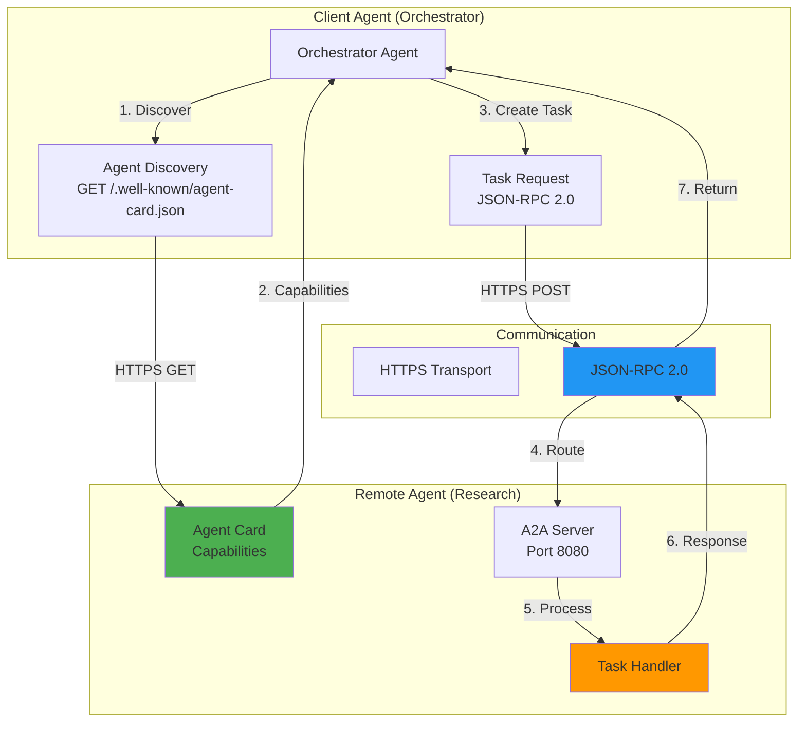
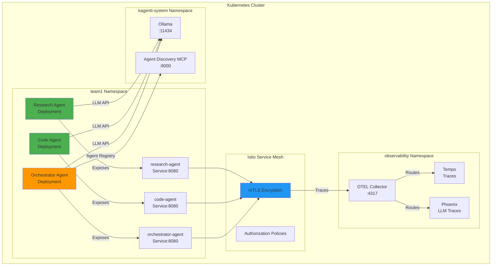
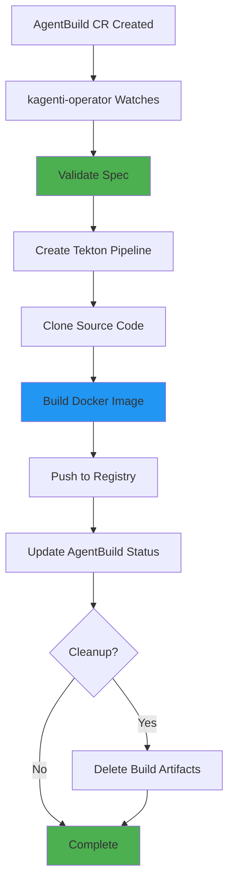
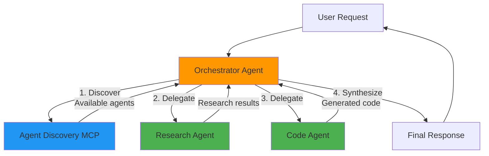

# AI Agents: Deployment and Management on Kagenti Platform

**Version**: 1.0
**Last Updated**: 2025-11-13
**Status**: Production Ready
**Audience**: AI Engineers, Platform Engineers, Developers

Comprehensive guide to deploying and managing AI agents on the Kagenti platform using the Agent2Agent (A2A) protocol, covering local development with Kind, production builds with Tekton, and agent orchestration patterns.

---

## Table of Contents

- [Overview](#overview)
- [What is A2A Protocol?](#what-is-a2a-protocol)
- [Agent Architecture](#agent-architecture)
- [Prerequisites](#prerequisites)
- [Local Development (Kind)](#local-development-kind)
- [Production Deployment](#production-deployment)
- [Agent Configuration](#agent-configuration)
- [Agent Cards](#agent-cards)
- [Multi-Agent Orchestration](#multi-agent-orchestration)
- [Monitoring and Observability](#monitoring-and-observability)
- [Security](#security)
- [Troubleshooting](#troubleshooting)
- [Best Practices](#best-practices)
- [Alternatives](#alternatives)
- [Next Steps](#next-steps)
- [References](#references)

---

## Overview

**Purpose**: Deploy and manage AI agents on the Kagenti platform using the Agent2Agent (A2A) protocol for agent-to-agent communication.

**What You Get**:
- ✅ A2A protocol-based agent deployment
- ✅ Local development with Kind clusters
- ✅ Production CI/CD with Tekton Pipelines
- ✅ Agent discovery via Agent Cards
- ✅ Multi-agent orchestration patterns
- ✅ Full observability (traces, metrics, logs)
- ✅ Service mesh security (mTLS, RBAC)
- ✅ LLM integration (Ollama, OpenAI)

**Key Principle**: **Agents communicate via A2A protocol over HTTPS with JSON-RPC 2.0**, enabling secure, standardized agent-to-agent collaboration across different frameworks and vendors.

**Source**: Based on [A2A Protocol Specification](https://github.com/a2aproject/A2A), [Agent2Agent Protocol](https://a2aprotocol.ai/), [Kagenti Platform](https://github.com/kagenti/kagenti)

---

## What is A2A Protocol?

### Concept

The **Agent2Agent (A2A) protocol** is an open communication standard for AI agents, enabling secure, scalable agent collaboration.

**Launched**: April 2025 by Google and partners (now Linux Foundation project)

**Key Features**:
1. **Capability Discovery** - Agents advertise capabilities via Agent Cards (JSON)
2. **Task Management** - Task-oriented communication with lifecycle management
3. **Security** - OAuth 2.0, OpenID Connect, API keys
4. **Transport** - HTTPS with JSON-RPC 2.0 format
5. **Interoperability** - Cross-framework, cross-vendor agent communication

**Source**: [A2A Protocol Announcement](https://developers.googleblog.com/en/a2a-a-new-era-of-agent-interoperability/), [GitHub Repository](https://github.com/a2aproject/A2A)

---

### A2A vs MCP

| Aspect | A2A Protocol | MCP (Model Context Protocol) |
|--------|--------------|------------------------------|
| **Purpose** | Agent-to-agent communication | Application-to-service communication |
| **Focus** | Multi-agent collaboration | Context sharing with external services |
| **Communication** | Agent ↔ Agent | Application ↔ External Service |
| **Use Case** | Orchestrator delegates to specialist agents | Application accesses databases, APIs, file systems |
| **Relationship** | **Complementary** - agents can use MCP to access services |

**Example**:
- **A2A**: Orchestrator agent communicates with research agent to gather information
- **MCP**: Research agent uses MCP to access web search service or database

**Source**: [MCP Specification](https://modelcontextprotocol.io/), [A2A and MCP Comparison](https://dev.to/czmilo/2025-complete-guide-agent2agent-a2a-protocol-the-new-standard-for-ai-agent-collaboration-1pph)

---

### A2A Communication Flow



**Flow Explanation**:
1. **Discovery**: Orchestrator fetches Agent Card from `/.well-known/agent-card.json`
2. **Capabilities**: Research agent advertises "web research" capability
3. **Task Creation**: Orchestrator creates task with research query
4. **Transport**: HTTPS with JSON-RPC 2.0 payload
5. **Processing**: Research agent executes task
6. **Response**: Returns results via JSON-RPC
7. **Return**: Orchestrator receives task completion

**Source**: [A2A Protocol Spec](https://a2aprotocol.ai/protocol-spec)

---

## Agent Architecture

### Kagenti Platform Agents

The platform includes three specialized agents:

**1. Research Agent** (`research-agent`)
- **Purpose**: Web research and information gathering
- **Port**: 8080 (A2A)
- **LLM**: Ollama (llama2)
- **Capabilities**: Web search, document analysis, fact-checking

**2. Code Agent** (`code-agent`)
- **Purpose**: Code generation and analysis
- **Port**: 8080 (A2A)
- **LLM**: Ollama (codellama)
- **Capabilities**: Code generation, refactoring, debugging

**3. Orchestrator Agent** (`orchestrator-agent`)
- **Purpose**: Multi-agent workflow orchestration
- **Port**: 8080 (A2A)
- **LLM**: Ollama (llama2)
- **Capabilities**: Task delegation, agent coordination
- **MCP**: Connects to agent-discovery-mcp for agent registry

**Source**: [components/03-applications/agents/](../../components/03-applications/agents/)

---

### Agent Deployment Architecture



**Components**:
- **Agents**: Deployed as Kubernetes Deployments with Services
- **Istio**: Provides mTLS, traffic management, observability
- **OTEL**: Collects traces and routes to Tempo/Phoenix
- **Ollama**: Provides local LLM inference
- **MCP**: Agent discovery and registry

**Source**: [components/03-applications/agents/README.md](../../components/03-applications/agents/README.md)

---

## Prerequisites

### Required Tools

| Tool | Version | Purpose | Install Link |
|------|---------|---------|--------------|
| **Docker** | 20.10+ | Build agent images | [docker.com/get-docker](https://docs.docker.com/get-docker/) |
| **kubectl** | 1.28+ | Kubernetes CLI | [kubernetes.io/docs/tasks/tools](https://kubernetes.io/docs/tasks/tools/) |
| **Kind** | 0.20+ | Local Kubernetes cluster | [kind.sigs.k8s.io](https://kind.sigs.k8s.io/docs/user/quick-start/) |
| **ArgoCD CLI** | 2.9+ | GitOps deployment | [argo-cd.readthedocs.io](https://argo-cd.readthedocs.io/en/stable/cli_installation/) |
| **Python** | 3.10+ | Agent development | [python.org/downloads](https://www.python.org/downloads/) |

**Source**: [Quick Start Prerequisites](../00-getting-started/quick-start.md#prerequisites)

---

### Agent Source Code

Agents are built from source code in the `agent-examples-local` repository (adjacent to deployment repo):

```bash
# Clone agent source
cd /path/to/your/workspace
git clone https://github.com/Ladas/agent-examples-local.git

# Expected structure:
agent-examples-local/
├── a2a/
│   ├── research-agent/
│   │   ├── Dockerfile
│   │   ├── agent.py
│   │   └── requirements.txt
│   ├── code-agent/
│   │   ├── Dockerfile
│   │   ├── agent.py
│   │   └── requirements.txt
│   └── orchestrator-agent/
│       ├── Dockerfile
│       ├── agent.py
│       └── requirements.txt
```

**Note**: Agent source directory must be at `$AGENT_SOURCE_DIR` (default: `../agent-examples-local`)

**Source**: [scripts/kind/04-load-agent-images.sh](../../scripts/kind/04-load-agent-images.sh)

---

## Local Development (Kind)

### Quick Start

For local Kind development, use the automated build/load script:

```bash
# Navigate to deployment repo
cd /path/to/kagenti-demo-deployment

# Build agent images from source + load into Kind cluster
./scripts/kind/04-load-agent-images.sh build

# OR load pre-built images (skip build)
./scripts/kind/04-load-agent-images.sh load
```

**What it does**:
1. Builds Docker images from `agent-examples-local/a2a/*-agent/`
2. Tags images as `localhost:5000/*-agent:v0.0.15`
3. Loads images into Kind cluster nodes using `kind load docker-image`

**Source**: [scripts/kind/04-load-agent-images.sh](../../scripts/kind/04-load-agent-images.sh)

---

### Build Agent Images

**Build all agents**:
```bash
# Set version tag
export VERSION=v0.0.15

# Build all agents
./scripts/kind/04-load-agent-images.sh build

# Expected output:
# Building research-agent...
# [+] Building 45.2s (12/12) FINISHED
# Built: localhost:5000/research-agent:v0.0.15
#
# Building code-agent...
# [+] Building 43.8s (12/12) FINISHED
# Built: localhost:5000/code-agent:v0.0.15
#
# Building orchestrator-agent...
# [+] Building 47.1s (12/12) FINISHED
# Built: localhost:5000/orchestrator-agent:v0.0.15
```

**Build single agent**:
```bash
# Navigate to agent source
cd ../agent-examples-local/a2a/research-agent

# Build image
docker build -t localhost:5000/research-agent:v0.0.15 .

# Load into Kind
kind load docker-image localhost:5000/research-agent:v0.0.15 --name kagenti
```

---

### Deploy Agents via ArgoCD

After building/loading images, sync agents via ArgoCD:

```bash
# Sync agents application
argocd app sync agents --port-forward --port-forward-namespace argocd --grpc-web

# Expected output:
# TIMESTAMP            GROUP   KIND        NAMESPACE  NAME                STATUS    HEALTH        HOOK  MESSAGE
# 2025-11-13T10:30:00  apps    Deployment  team1      research-agent      Synced    Progressing         deployment.apps/research-agent configured
# 2025-11-13T10:30:01  v1      Service     team1      research-agent      Synced    Healthy             service/research-agent unchanged
# 2025-11-13T10:30:02  apps    Deployment  team1      code-agent          Synced    Progressing         deployment.apps/code-agent configured
# 2025-11-13T10:30:03  v1      Service     team1      code-agent          Synced    Healthy             service/code-agent unchanged
# 2025-11-13T10:30:04  apps    Deployment  team1      orchestrator-agent  Synced    Progressing         deployment.apps/orchestrator-agent configured
# 2025-11-13T10:30:05  v1      Service     team1      orchestrator-agent  Synced    Healthy             service/orchestrator-agent unchanged
```

**Verify deployment**:
```bash
# Check pods
kubectl get pods -n team1

# Expected:
# NAME                                  READY   STATUS    RESTARTS   AGE
# research-agent-7b5d9f8c4d-xj2k9       2/2     Running   0          2m
# code-agent-6c8d7e9b5a-9k3m1           2/2     Running   0          2m
# orchestrator-agent-5a7b6c8d4e-2n5p8   2/2     Running   0          2m

# Check services
kubectl get svc -n team1

# Expected:
# NAME                 TYPE        CLUSTER-IP      EXTERNAL-IP   PORT(S)    AGE
# research-agent       ClusterIP   10.96.123.45    <none>        8080/TCP   2m
# code-agent           ClusterIP   10.96.234.56    <none>        8080/TCP   2m
# orchestrator-agent   ClusterIP   10.96.345.67    <none>        8080/TCP   2m
```

**Source**: [ArgoCD Sync](../01-infrastructure/argocd.md#manual-sync)

---

### Test Agent Communication

**Test Agent Card discovery**:
```bash
# Get Agent Card from research-agent
kubectl exec -n team1 deploy/research-agent -c agent -- \
  curl -s http://localhost:8080/.well-known/agent-card.json | jq .

# Expected:
# {
#   "name": "research-agent",
#   "version": "v0.0.15",
#   "description": "Specialized agent for web research and information gathering",
#   "capabilities": [
#     {
#       "name": "web_research",
#       "description": "Search the web and analyze information"
#     },
#     {
#       "name": "document_analysis",
#       "description": "Analyze documents and extract insights"
#     }
#   ],
#   "endpoint": "http://research-agent.team1.svc.cluster.local:8080",
#   "protocol": "a2a"
# }
```

**Test A2A task request**:
```bash
# Send A2A task request to research-agent
kubectl exec -n team1 deploy/orchestrator-agent -c agent -- \
  curl -s -X POST http://research-agent.team1.svc.cluster.local:8080/a2a/task \
    -H "Content-Type: application/json" \
    -d '{
      "jsonrpc": "2.0",
      "method": "createTask",
      "params": {
        "task": {
          "description": "Search for Kubernetes best practices",
          "input": "What are the top 5 Kubernetes security best practices?"
        }
      },
      "id": 1
    }' | jq .

# Expected:
# {
#   "jsonrpc": "2.0",
#   "result": {
#     "taskId": "task-abc123",
#     "status": "completed",
#     "output": {
#       "answer": "Top 5 Kubernetes security best practices:\n1. Enable RBAC...\n2. Use Network Policies...\n..."
#     }
#   },
#   "id": 1
# }
```

**Source**: [A2A Protocol Spec - Task Management](https://a2aprotocol.ai/protocol-spec#task-management)

---

### Update Agent Version

To update agent versions:

**1. Build new images**:
```bash
# Build with new version
VERSION=v0.0.16 ./scripts/kind/04-load-agent-images.sh build
```

**2. Update Kustomization**:
```yaml
# components/03-applications/agents/kustomization.yaml
images:
  - name: localhost:5000/research-agent
    newTag: v0.0.16  # Changed from v0.0.15
  - name: localhost:5000/code-agent
    newTag: v0.0.16
  - name: localhost:5000/orchestrator-agent
    newTag: v0.0.16
```

**3. Commit and sync**:
```bash
# Commit version update
git add components/03-applications/agents/kustomization.yaml
git commit -m "Update agents to v0.0.16"
git push

# Sync via ArgoCD
argocd app sync agents --port-forward --port-forward-namespace argocd --grpc-web
```

**Source**: [components/03-applications/agents/kustomization.yaml](../../components/03-applications/agents/kustomization.yaml)

---

## Production Deployment

### AgentBuild CRD

For production deployments, use the `kagenti-operator` with `AgentBuild` CRD to automate builds via Tekton Pipelines:

**AgentBuild CR Example**:
```yaml
apiVersion: agent.kagenti.dev/v1alpha1
kind: AgentBuild
metadata:
  name: research-agent-build
  namespace: team1
  labels:
    app: research-agent
    build-type: tekton
spec:
  # Source repository configuration
  source:
    sourceRepository: "github.com/your-org/agents.git"
    sourceRevision: "main"
    sourceSubfolder: "a2a/research-agent"
    sourceCredentials:
      name: github-token-secret

  # Tekton pipeline configuration
  pipeline:
    namespace: kagenti-system
    parameters:
    - name: SOURCE_REPO_SECRET
      value: github-token-secret

  # Build output configuration
  buildOutput:
    image: "research-agent"
    imageTag: "v0.0.15"
    imageRegistry: "registry.container-registry.svc.cluster.local:5000"

  # Cleanup after build (optional)
  cleanupAfterBuild: true

  # Development mode (uses internal registry, simplified build)
  mode: dev
```

**Source**: [components/03-applications/agents/agent-builds/](../../components/03-applications/agents/agent-builds/)

---

### Create AgentBuild

**1. Create GitHub token secret** (if accessing private repo):
```bash
# Create secret with GitHub personal access token
kubectl create secret generic github-token-secret \
  --from-literal=username=YOUR_GITHUB_USERNAME \
  --from-literal=password=YOUR_GITHUB_TOKEN \
  -n team1
```

**2. Apply AgentBuild CR**:
```bash
# Apply CR
kubectl apply -f components/03-applications/agents/agent-builds/research-agent-build.yaml

# Expected:
# agentbuild.agent.kagenti.dev/research-agent-build created
```

**3. Monitor build**:
```bash
# Watch AgentBuild status
kubectl get agentbuild research-agent-build -n team1 -w

# Expected:
# NAME                    STATUS    IMAGE             TAG      AGE
# research-agent-build    Pending   research-agent    v0.0.15  5s
# research-agent-build    Building  research-agent    v0.0.15  10s
# research-agent-build    Complete  research-agent    v0.0.15  2m

# Check Tekton PipelineRun
kubectl get pipelineruns -n kagenti-system

# Expected:
# NAME                              SUCCEEDED   REASON      STARTTIME   COMPLETIONTIME
# research-agent-build-run-abc123   True        Succeeded   2m          30s
```

**Source**: [Tekton Pipelines Guide](../05-ci-cd/tekton.md)

---

### AgentBuild Lifecycle



**Lifecycle Steps**:
1. **Create**: User applies AgentBuild CR
2. **Watch**: kagenti-operator watches for new AgentBuilds
3. **Validate**: Operator validates spec (source repo, credentials, registry)
4. **Pipeline**: Creates Tekton Pipeline with build tasks
5. **Clone**: Pipeline clones source repository
6. **Build**: Builds Docker image from Dockerfile
7. **Push**: Pushes image to registry
8. **Status**: Updates AgentBuild CR status
9. **Cleanup**: Optionally deletes build artifacts
10. **Complete**: Build marked as complete

**Source**: [kagenti-operator](../../components/01-platform/kagenti-operator/)

---

## Agent Configuration

### Environment Variables

Agents are configured via environment variables in deployment manifests:

**Research Agent Configuration**:
```yaml
env:
  # A2A protocol configuration
  - name: A2A_HOST
    value: "0.0.0.0"  # Listen on all interfaces
  - name: A2A_PORT
    value: "8080"  # A2A protocol port

  # LLM configuration
  - name: llm_api_base
    value: "http://ollama.kagenti-system.svc.cluster.local:11434/v1"  # Ollama endpoint

  # OpenTelemetry configuration
  - name: OTEL_EXPORTER_OTLP_ENDPOINT
    value: "http://otel-collector.observability.svc.cluster.local:4317"  # OTEL Collector
  - name: OTEL_SERVICE_NAME
    value: "research-agent"  # Service name for traces

  # Optional: Agent-specific configuration
  - name: MAX_SEARCH_RESULTS
    value: "10"
  - name: TIMEOUT_SECONDS
    value: "30"
```

**Source**: [components/03-applications/agents/research-agent.yaml](../../components/03-applications/agents/research-agent.yaml)

---

### Orchestrator Agent Configuration

The orchestrator agent has additional configuration for MCP (Model Context Protocol):

```yaml
env:
  # A2A protocol
  - name: A2A_HOST
    value: "0.0.0.0"
  - name: A2A_PORT
    value: "8080"

  # MCP configuration (agent discovery)
  - name: MCP_URL
    value: "http://agent-discovery-mcp.team1.svc.cluster.local:8000/mcp"

  # LLM configuration
  - name: llm_api_base
    value: "http://ollama.kagenti-system.svc.cluster.local:11434/v1"

  # OpenTelemetry
  - name: OTEL_EXPORTER_OTLP_ENDPOINT
    value: "http://otel-collector.observability.svc.cluster.local:4317"
  - name: OTEL_SERVICE_NAME
    value: "orchestrator-agent"
```

**MCP Integration**: Orchestrator uses MCP to discover available agents and their capabilities via agent-discovery-mcp service.

**Source**: [components/03-applications/agents/orchestrator-agent.yaml](../../components/03-applications/agents/orchestrator-agent.yaml)

---

### Resource Limits

Agent resource requests and limits:

```yaml
resources:
  requests:
    cpu: 100m       # Minimum CPU
    memory: 256Mi   # Minimum memory
  limits:
    cpu: 1000m      # Maximum CPU (1 core)
    memory: 1Gi     # Maximum memory
```

**Tuning Guidelines**:
- **Development (Kind)**: Use lower limits to fit multiple agents on limited resources
- **Production**: Increase based on workload (complex reasoning requires more CPU/memory)
- **LLM inference**: If running local models in agent pods, increase memory significantly

**Source**: [Kubernetes Resources](../01-infrastructure/kubernetes.md#resource-management)

---

## Agent Cards

### What is an Agent Card?

An **Agent Card** is a JSON document that describes an agent's capabilities, enabling discovery in the A2A protocol.

**Location**: `/.well-known/agent-card.json` (standard endpoint)

**Purpose**:
- Advertise agent capabilities
- Enable automatic discovery
- Describe API endpoints
- Specify protocol version

**Source**: [A2A Protocol Spec - Agent Cards](https://a2aprotocol.ai/protocol-spec#agent-cards)

---

### Agent Card Structure

**Research Agent Card Example**:
```json
{
  "name": "research-agent",
  "version": "v0.0.15",
  "description": "Specialized agent for web research and information gathering",
  "capabilities": [
    {
      "name": "web_research",
      "description": "Search the web and analyze information",
      "inputSchema": {
        "type": "object",
        "properties": {
          "query": {
            "type": "string",
            "description": "The search query"
          },
          "maxResults": {
            "type": "integer",
            "description": "Maximum number of results to return",
            "default": 10
          }
        },
        "required": ["query"]
      },
      "outputSchema": {
        "type": "object",
        "properties": {
          "results": {
            "type": "array",
            "items": {
              "type": "object",
              "properties": {
                "title": {"type": "string"},
                "url": {"type": "string"},
                "snippet": {"type": "string"}
              }
            }
          }
        }
      }
    },
    {
      "name": "document_analysis",
      "description": "Analyze documents and extract insights",
      "inputSchema": {
        "type": "object",
        "properties": {
          "documentUrl": {
            "type": "string",
            "description": "URL of the document to analyze"
          }
        },
        "required": ["documentUrl"]
      }
    }
  ],
  "endpoint": "http://research-agent.team1.svc.cluster.local:8080",
  "protocol": "a2a",
  "protocolVersion": "1.0",
  "authentication": {
    "type": "none"
  },
  "contact": {
    "email": "team@example.com",
    "url": "https://github.com/your-org/agents"
  }
}
```

**Source**: [A2A Agent Card Specification](https://github.com/a2aproject/A2A/blob/main/spec/agent-card.md)

---

### Implementing Agent Cards

**Python Flask Example**:
```python
from flask import Flask, jsonify

app = Flask(__name__)

# Agent Card endpoint (A2A standard)
@app.route('/.well-known/agent-card.json', methods=['GET'])
def agent_card():
    card = {
        "name": "research-agent",
        "version": "v0.0.15",
        "description": "Specialized agent for web research",
        "capabilities": [
            {
                "name": "web_research",
                "description": "Search the web and analyze information",
                "inputSchema": {
                    "type": "object",
                    "properties": {
                        "query": {"type": "string"}
                    },
                    "required": ["query"]
                }
            }
        ],
        "endpoint": "http://research-agent.team1.svc.cluster.local:8080",
        "protocol": "a2a",
        "protocolVersion": "1.0"
    }
    return jsonify(card)

# A2A task endpoint
@app.route('/a2a/task', methods=['POST'])
def create_task():
    # Handle A2A task request (JSON-RPC 2.0)
    pass

if __name__ == '__main__':
    app.run(host='0.0.0.0', port=8080)
```

**Verification**:
```bash
# Test Agent Card endpoint
curl http://research-agent.team1.svc.cluster.local:8080/.well-known/agent-card.json | jq .
```

---

## Multi-Agent Orchestration

### Orchestration Pattern

The orchestrator agent coordinates multiple specialist agents to complete complex tasks:



**Orchestration Flow**:
1. **User Request**: "Build a web scraper for Kubernetes docs"
2. **Discover**: Orchestrator queries MCP for available agents
3. **Delegate (Research)**: Orchestrator asks research-agent to find Kubernetes doc structure
4. **Delegate (Code)**: Orchestrator asks code-agent to generate scraper code
5. **Synthesize**: Orchestrator combines results and returns to user

**Source**: [Multi-Agent Systems with A2A](https://dev.to/czmilo/2025-complete-guide-agent2agent-a2a-protocol-the-new-standard-for-ai-agent-collaboration-1pph)

---

### Agent Discovery via MCP

The orchestrator uses **Model Context Protocol (MCP)** to discover agents dynamically:

**MCP Agent Registry**:
```python
# Orchestrator discovers agents via MCP
import requests

# Query agent-discovery-mcp
response = requests.get('http://agent-discovery-mcp.team1.svc.cluster.local:8000/mcp/agents')
agents = response.json()

# Example response:
# {
#   "agents": [
#     {
#       "name": "research-agent",
#       "endpoint": "http://research-agent.team1.svc.cluster.local:8080",
#       "capabilities": ["web_research", "document_analysis"]
#     },
#     {
#       "name": "code-agent",
#       "endpoint": "http://code-agent.team1.svc.cluster.local:8080",
#       "capabilities": ["code_generation", "code_analysis"]
#     }
#   ]
# }

# Find agent with specific capability
research_agent = next(
    agent for agent in agents['agents']
    if 'web_research' in agent['capabilities']
)

# Fetch Agent Card
card_response = requests.get(f"{research_agent['endpoint']}/.well-known/agent-card.json")
agent_card = card_response.json()
```

**Source**: [MCP Specification](https://modelcontextprotocol.io/)

---

### Task Delegation Example

**Orchestrator delegates task to research-agent**:
```python
import requests
import json

# Create A2A task request (JSON-RPC 2.0)
task_request = {
    "jsonrpc": "2.0",
    "method": "createTask",
    "params": {
        "task": {
            "description": "Research Kubernetes security best practices",
            "input": {
                "query": "What are the top 5 Kubernetes security best practices in 2025?"
            }
        }
    },
    "id": 1
}

# Send to research-agent
response = requests.post(
    'http://research-agent.team1.svc.cluster.local:8080/a2a/task',
    headers={'Content-Type': 'application/json'},
    data=json.dumps(task_request)
)

# Parse response
result = response.json()
if 'result' in result:
    task_output = result['result']['output']
    print(f"Research results: {task_output}")
```

**Source**: [A2A Protocol - JSON-RPC 2.0](https://a2aprotocol.ai/protocol-spec#json-rpc)

---

## Monitoring and Observability

### OpenTelemetry Instrumentation

All agents send traces to the OTEL Collector for observability:

**Python OpenTelemetry Setup**:
```python
from opentelemetry import trace
from opentelemetry.exporter.otlp.proto.grpc.trace_exporter import OTLPSpanExporter
from opentelemetry.sdk.trace import TracerProvider
from opentelemetry.sdk.trace.export import BatchSpanProcessor
from opentelemetry.sdk.resources import Resource
import os

# Create resource with service name
resource = Resource(attributes={
    "service.name": os.getenv("OTEL_SERVICE_NAME", "research-agent"),
    "service.version": "v0.0.15",
    "deployment.environment": "kind-local"
})

# Configure tracer provider
provider = TracerProvider(resource=resource)
trace.set_tracer_provider(provider)

# Configure OTLP exporter
otlp_exporter = OTLPSpanExporter(
    endpoint=os.getenv("OTEL_EXPORTER_OTLP_ENDPOINT", "http://otel-collector.observability.svc.cluster.local:4317"),
    insecure=True
)

# Add batch span processor
provider.add_span_processor(BatchSpanProcessor(otlp_exporter))

# Get tracer
tracer = trace.get_tracer(__name__)

# Instrument agent operations
with tracer.start_as_current_span("web_research") as span:
    span.set_attribute("query", "Kubernetes security")
    # ... perform research ...
    span.set_attribute("results_count", 10)
```

**Source**: [Distributed Tracing Guide](../04-observability/distributed-tracing.md), [GenAI Semantic Conventions](../04-observability/genai-semantic-conventions.md)

---

### Viewing Agent Traces

**Tempo (General Traces)**:
```bash
# Port-forward Grafana
kubectl port-forward -n observability svc/grafana 3000:80

# Open Grafana
# http://localhost:3000

# Navigate to Explore → Tempo datasource
# Query: {service.name="research-agent"}
```

**Phoenix (LLM Traces)**:
```bash
# Port-forward Phoenix
kubectl port-forward -n observability svc/phoenix 6006:6006

# Open Phoenix
# http://localhost:6006

# View LLM traces with token usage, latency, cost
```

**Source**: [Phoenix Guide](../04-observability/phoenix.md), [Grafana Guide](../04-observability/grafana.md)

---

### Agent Metrics

Agents expose Prometheus metrics on `/metrics` endpoint:

**Key Metrics**:
```
# Task count by status
agent_tasks_total{status="completed"} 150
agent_tasks_total{status="failed"} 5

# Task duration
agent_task_duration_seconds_bucket{le="1.0"} 120
agent_task_duration_seconds_bucket{le="5.0"} 140
agent_task_duration_seconds_bucket{le="+Inf"} 155

# LLM token usage
agent_llm_tokens_total{type="input"} 5000
agent_llm_tokens_total{type="output"} 3000

# A2A requests
agent_a2a_requests_total{method="createTask"} 155
agent_a2a_requests_total{method="getTask"} 50
```

**View in Grafana**:
```bash
# Port-forward Grafana
kubectl port-forward -n observability svc/grafana 3000:80

# Query in Explore
# rate(agent_tasks_total[5m])
```

**Source**: [Prometheus Metrics Guide](../04-observability/prometheus.md)

---

## Security

### Service Mesh mTLS

All agent-to-agent communication is encrypted with Istio mTLS:

**Check mTLS status**:
```bash
# Verify mTLS enabled
istioctl authn tls-check -n team1 research-agent.team1.svc.cluster.local

# Expected:
# HOST:PORT                                          STATUS     SERVER     CLIENT     AUTHN POLICY     DESTINATION RULE
# research-agent.team1.svc.cluster.local:8080       OK         mTLS       mTLS       default/         -
```

**PeerAuthentication Policy**:
```yaml
apiVersion: security.istio.io/v1
kind: PeerAuthentication
metadata:
  name: default
  namespace: team1
spec:
  mtls:
    mode: STRICT  # Require mTLS for all traffic
```

**Source**: [Istio mTLS Guide](../02-service-mesh/istio.md#mtls-configuration), [Encryption Guide](../08-security/encryption.md)

---

### Authorization Policies

Control which agents can communicate:

**Allow orchestrator → research-agent**:
```yaml
apiVersion: security.istio.io/v1
kind: AuthorizationPolicy
metadata:
  name: allow-orchestrator-to-research
  namespace: team1
spec:
  selector:
    matchLabels:
      app: research-agent
  action: ALLOW
  rules:
  - from:
    - source:
        principals: ["cluster.local/ns/team1/sa/orchestrator-sa"]
    to:
    - operation:
        methods: ["GET", "POST"]
        paths: ["/a2a/*", "/.well-known/agent-card.json"]
```

**Deny all by default**:
```yaml
apiVersion: security.istio.io/v1
kind: AuthorizationPolicy
metadata:
  name: deny-all
  namespace: team1
spec:
  action: DENY
  rules:
  - from:
    - source:
        notNamespaces: ["team1"]
```

**Source**: [Istio Authorization Policies](https://istio.io/latest/docs/reference/config/security/authorization-policy/)

---

### Network Policies

Restrict network access at Layer 4:

**Allow agent-to-agent communication**:
```yaml
apiVersion: networking.k8s.io/v1
kind: NetworkPolicy
metadata:
  name: allow-agent-communication
  namespace: team1
spec:
  podSelector:
    matchLabels:
      ai.openshift.io/agent.class: "a2a"
  policyTypes:
  - Ingress
  - Egress
  ingress:
  - from:
    - podSelector:
        matchLabels:
          ai.openshift.io/agent.class: "a2a"
    ports:
    - protocol: TCP
      port: 8080
  egress:
  - to:
    - podSelector:
        matchLabels:
          ai.openshift.io/agent.class: "a2a"
    ports:
    - protocol: TCP
      port: 8080
  - to:  # Allow Ollama access
    - namespaceSelector:
        matchLabels:
          kubernetes.io/metadata.name: kagenti-system
    ports:
    - protocol: TCP
      port: 11434
```

**Source**: [Network Policies Guide](../08-security/network-policies.md)

---

## Troubleshooting

### Issue: ImagePullBackOff

**Symptoms**: Pods show `ImagePullBackOff` status.

**Diagnosis**:
```bash
# Check pod events
kubectl describe pod -n team1 research-agent-xxx

# Error:
# Failed to pull image "localhost:5000/research-agent:v0.0.15": rpc error: code = Unknown desc = Error response from daemon: pull access denied for localhost:5000/research-agent, repository does not exist or may require 'docker login'
```

**Root Cause**: Images not loaded into Kind cluster.

**Fix**:
```bash
# Load images into Kind
./scripts/kind/04-load-agent-images.sh load

# Sync agents
argocd app sync agents --port-forward --port-forward-namespace argocd --grpc-web

# Restart pods
kubectl rollout restart deploy -n team1
```

**Source**: [components/03-applications/agents/README.md#troubleshooting](../../components/03-applications/agents/README.md#troubleshooting)

---

### Issue: Agents Not Responding

**Symptoms**: Agent pods running but not accessible via A2A.

**Diagnosis**:
```bash
# Check sidecar injection (should show 2/2 containers)
kubectl get pods -n team1

# Expected: 2/2 (agent + istio-proxy)
# Actual: 1/1 (no sidecar)

# Check namespace label
kubectl get namespace team1 --show-labels | grep istio-injection

# Expected: istio-injection=enabled
```

**Root Cause**: Missing Istio sidecar injection.

**Fix**:
```bash
# Enable sidecar injection on namespace
kubectl label namespace team1 istio-injection=enabled --overwrite

# Restart pods to inject sidecar
kubectl rollout restart deploy -n team1

# Verify sidecar injected
kubectl get pods -n team1

# Expected:
# NAME                                  READY   STATUS    RESTARTS   AGE
# research-agent-xxx                    2/2     Running   0          1m
```

**Source**: [Istio Sidecar Injection](../02-service-mesh/istio.md#sidecar-injection)

---

### Issue: Agent Card Not Found

**Symptoms**: Orchestrator cannot discover agents.

**Diagnosis**:
```bash
# Test Agent Card endpoint
kubectl exec -n team1 deploy/research-agent -c agent -- \
  curl -s http://localhost:8080/.well-known/agent-card.json

# Error:
# 404 Not Found
```

**Root Cause**: Agent Card endpoint not implemented.

**Fix**:
```python
# Add Agent Card endpoint to agent.py
from flask import Flask, jsonify

app = Flask(__name__)

@app.route('/.well-known/agent-card.json', methods=['GET'])
def agent_card():
    return jsonify({
        "name": "research-agent",
        "version": "v0.0.15",
        "description": "Specialized agent for web research",
        "capabilities": [...],
        "endpoint": "http://research-agent.team1.svc.cluster.local:8080",
        "protocol": "a2a"
    })
```

**Rebuild and deploy**:
```bash
# Rebuild image
VERSION=v0.0.16 ./scripts/kind/04-load-agent-images.sh build

# Update version in kustomization.yaml
# Sync via ArgoCD
argocd app sync agents
```

---

### Issue: Build Failures (AgentBuild)

**Symptoms**: Docker build fails with missing dependencies.

**Diagnosis**:
```bash
# Check AgentBuild status
kubectl get agentbuild research-agent-build -n team1

# STATUS: Failed

# Check PipelineRun logs
kubectl get pipelineruns -n kagenti-system
kubectl logs -n kagenti-system pipelinerun/research-agent-build-run-xxx

# Error:
# Step build failed: ERROR: Could not find requirements.txt
```

**Root Cause**: Agent source code missing required files.

**Fix**:
```bash
# Verify agent source directory
ls -la $AGENT_SOURCE_DIR/a2a/research-agent/

# Required files:
#   - Dockerfile
#   - agent.py
#   - requirements.txt

# If missing, add files and commit to Git
cd $AGENT_SOURCE_DIR/a2a/research-agent/
cat > requirements.txt <<EOF
flask==2.3.0
opentelemetry-api==1.20.0
opentelemetry-sdk==1.20.0
opentelemetry-exporter-otlp==1.20.0
EOF

git add requirements.txt
git commit -m "Add requirements.txt"
git push

# Re-trigger AgentBuild
kubectl delete agentbuild research-agent-build -n team1
kubectl apply -f components/03-applications/agents/agent-builds/research-agent-build.yaml
```

---

## Best Practices

### 1. Use Agent Cards for Discovery

**✅ Good**: Implement Agent Cards for all agents
```python
@app.route('/.well-known/agent-card.json', methods=['GET'])
def agent_card():
    return jsonify({
        "name": "research-agent",
        "capabilities": [
            {"name": "web_research", "description": "..."}
        ]
    })
```

**❌ Avoid**: Hard-coding agent endpoints
```python
# Hard-coded endpoint (breaks when agent moves)
RESEARCH_AGENT = "http://10.96.123.45:8080"
```

**Why**: Agent Cards enable dynamic discovery and service relocation.

**Source**: [A2A Protocol Best Practices](https://a2aprotocol.ai/best-practices)

---

### 2. Implement OpenTelemetry Tracing

**✅ Good**: Instrument all agent operations
```python
with tracer.start_as_current_span("web_research") as span:
    span.set_attribute("query", query)
    span.set_attribute("llm.model", "llama2")
    results = search_web(query)
    span.set_attribute("results_count", len(results))
```

**❌ Avoid**: No observability
```python
# No tracing (debugging is impossible)
results = search_web(query)
```

**Why**: Traces enable debugging multi-agent workflows and performance optimization.

**Source**: [GenAI Semantic Conventions](../04-observability/genai-semantic-conventions.md)

---

### 3. Use JSON-RPC 2.0 for A2A

**✅ Good**: Follow A2A JSON-RPC 2.0 spec
```json
{
  "jsonrpc": "2.0",
  "method": "createTask",
  "params": {
    "task": {
      "description": "Research query",
      "input": {"query": "Kubernetes"}
    }
  },
  "id": 1
}
```

**❌ Avoid**: Custom protocols
```json
// Custom format (not A2A compatible)
{
  "action": "research",
  "data": {"q": "Kubernetes"}
}
```

**Why**: JSON-RPC 2.0 enables interoperability with other A2A agents.

**Source**: [JSON-RPC 2.0 Specification](https://www.jsonrpc.org/specification)

---

### 4. Secure Agent Communication

**✅ Good**: Use Istio mTLS + Authorization Policies
```yaml
apiVersion: security.istio.io/v1
kind: AuthorizationPolicy
metadata:
  name: allow-orchestrator
spec:
  action: ALLOW
  rules:
  - from:
    - source:
        principals: ["cluster.local/ns/team1/sa/orchestrator-sa"]
```

**❌ Avoid**: Unauthenticated A2A
```yaml
# No authorization (any agent can call any agent)
```

**Why**: mTLS prevents eavesdropping, authorization prevents unauthorized access.

**Source**: [Istio Security](../02-service-mesh/istio.md#security)

---

### 5. Version Agent Images

**✅ Good**: Use semantic versioning
```yaml
images:
  - name: localhost:5000/research-agent
    newTag: v0.0.15  # Explicit version
```

**❌ Avoid**: Latest tag
```yaml
images:
  - name: localhost:5000/research-agent
    newTag: latest  # Unpredictable
```

**Why**: Explicit versions enable controlled rollouts and easy rollbacks.

**Source**: [GitOps Workflows](../05-ci-cd/gitops-workflows.md#image-versioning)

---

## Alternatives

### Alternative 1: CrewAI

**Process**:
- Define agents with specific roles and goals
- Create tasks and assign to agents
- Use CrewAI orchestration framework

**Pros**:
- ✅ Python-native framework
- ✅ Built-in orchestration patterns
- ✅ Simple task delegation
- ✅ Good documentation

**Cons**:
- ❌ Not A2A protocol compliant
- ❌ Vendor-specific (CrewAI framework)
- ❌ Limited cross-framework interoperability

**When to Use**: Python-only environment, rapid prototyping, don't need A2A interoperability

**Source**: [CrewAI Documentation](https://docs.crewai.com/)

---

### Alternative 2: LangGraph

**Process**:
- Define agent graph with nodes and edges
- Implement state management
- Use LangChain tools for agent actions

**Pros**:
- ✅ LangChain ecosystem integration
- ✅ Powerful state management
- ✅ Visual graph editor
- ✅ Streaming support

**Cons**:
- ❌ Not A2A protocol compliant
- ❌ Steeper learning curve
- ❌ Requires LangChain knowledge

**When to Use**: LangChain ecosystem, complex state management, need visual workflow editor

**Source**: [LangGraph Documentation](https://langchain-ai.github.io/langgraph/)

---

### Alternative 3: AutoGen

**Process**:
- Define conversable agents
- Enable group chat for multi-agent collaboration
- Use function calling for tool integration

**Pros**:
- ✅ Microsoft-backed
- ✅ Strong multi-agent conversation support
- ✅ Good GPT integration
- ✅ Active development

**Cons**:
- ❌ Not A2A protocol compliant
- ❌ Primarily designed for GPT models
- ❌ Limited cross-vendor support

**When to Use**: Microsoft ecosystem, GPT-based agents, conversational workflows

**Source**: [AutoGen Documentation](https://microsoft.github.io/autogen/)

---

### Alternative 4: Semantic Kernel

**Process**:
- Define skills (functions) for agents
- Use planner to orchestrate skills
- Integrate with Azure OpenAI or other LLMs

**Pros**:
- ✅ Microsoft-backed
- ✅ Multi-language support (C#, Python)
- ✅ Enterprise-ready
- ✅ Good Azure integration

**Cons**:
- ❌ Not A2A protocol compliant
- ❌ More complex architecture
- ❌ Heavy dependency on Microsoft stack

**When to Use**: Enterprise deployments, Azure ecosystem, need multi-language support

**Source**: [Semantic Kernel Documentation](https://learn.microsoft.com/en-us/semantic-kernel/)

---

## Next Steps

### For Development

1. **Build First Agent**:
   ```bash
   # Clone agent source
   git clone https://github.com/Ladas/agent-examples-local.git

   # Build and load
   ./scripts/kind/04-load-agent-images.sh build

   # Deploy
   argocd app sync agents
   ```

2. **Implement Agent Card**:
   ```python
   # Add to agent.py
   @app.route('/.well-known/agent-card.json', methods=['GET'])
   def agent_card():
       return jsonify({...})
   ```

3. **Add OpenTelemetry**:
   ```python
   # Instrument agent operations
   with tracer.start_as_current_span("operation"):
       # ... agent logic ...
   ```

### For Production

1. **Set Up AgentBuild CR**:
   ```bash
   # Create GitHub secret
   kubectl create secret generic github-token-secret ...

   # Apply AgentBuild
   kubectl apply -f agent-builds/research-agent-build.yaml
   ```

2. **Enable mTLS**:
   ```yaml
   # Apply PeerAuthentication
   kubectl apply -f - <<EOF
   apiVersion: security.istio.io/v1
   kind: PeerAuthentication
   metadata:
     name: default
     namespace: team1
   spec:
     mtls:
       mode: STRICT
   EOF
   ```

3. **Configure Authorization**:
   ```yaml
   # Apply AuthorizationPolicy
   kubectl apply -f authorization-policies/
   ```

### Learn More

- [Tekton Pipelines (CI/CD)](../05-ci-cd/tekton.md)
- [GitOps Workflows](../05-ci-cd/gitops-workflows.md)
- [Distributed Tracing](../04-observability/distributed-tracing.md)
- [Phoenix LLM Observability](../04-observability/phoenix.md)
- [Istio Service Mesh](../02-service-mesh/istio.md)

---

## References

### Official Documentation

- **A2A Protocol**: [a2aprotocol.ai](https://a2aprotocol.ai/)
- **A2A GitHub**: [github.com/a2aproject/A2A](https://github.com/a2aproject/A2A)
- **Google A2A Announcement**: [developers.googleblog.com/a2a](https://developers.googleblog.com/en/a2a-a-new-era-of-agent-interoperability/)
- **Model Context Protocol (MCP)**: [modelcontextprotocol.io](https://modelcontextprotocol.io/)
- **JSON-RPC 2.0**: [jsonrpc.org/specification](https://www.jsonrpc.org/specification)
- **OpenTelemetry**: [opentelemetry.io](https://opentelemetry.io/docs/)

### Community Resources

- **A2A Protocol Guide**: [DEV Community - A2A Complete Guide](https://dev.to/czmilo/2025-complete-guide-agent2agent-a2a-protocol-the-new-standard-for-ai-agent-collaboration-1pph)
- **IBM A2A Overview**: [ibm.com/think/topics/agent2agent-protocol](https://www.ibm.com/think/topics/agent2agent-protocol)
- **Microsoft A2A Blog**: [microsoft.com/multi-agent-apps-a2a](https://www.microsoft.com/en-us/microsoft-cloud/blog/2025/05/07/empowering-multi-agent-apps-with-the-open-agent2agent-a2a-protocol/)
- **AWS A2A Article**: [aws.amazon.com/blogs/opensource/inter-agent-communication-on-a2a](https://aws.amazon.com/blogs/opensource/open-protocols-for-agent-interoperability-part-4-inter-agent-communication-on-a2a/)

### Internal Documentation

- **Main README**: [../../README.md](../../README.md)
- **Architecture Overview**: [../00-getting-started/architecture-overview.md](../00-getting-started/architecture-overview.md)
- **Quick Start**: [../00-getting-started/quick-start.md](../00-getting-started/quick-start.md)
- **Agents Source**: [components/03-applications/agents/](../../components/03-applications/agents/)

### Repository

- **GitHub**: [Ladas/kagenti-demo-deployment](https://github.com/Ladas/kagenti-demo-deployment)
- **Agent Source**: [Ladas/agent-examples-local](https://github.com/Ladas/agent-examples-local)
- **Components**: `components/03-applications/agents/`

---

**Last Updated**: 2025-11-13
**Document Version**: 1.0
**Maintained By**: Platform Engineering Team
**License**: Apache 2.0
