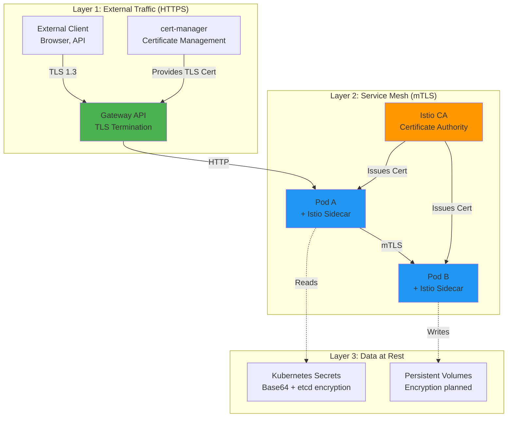
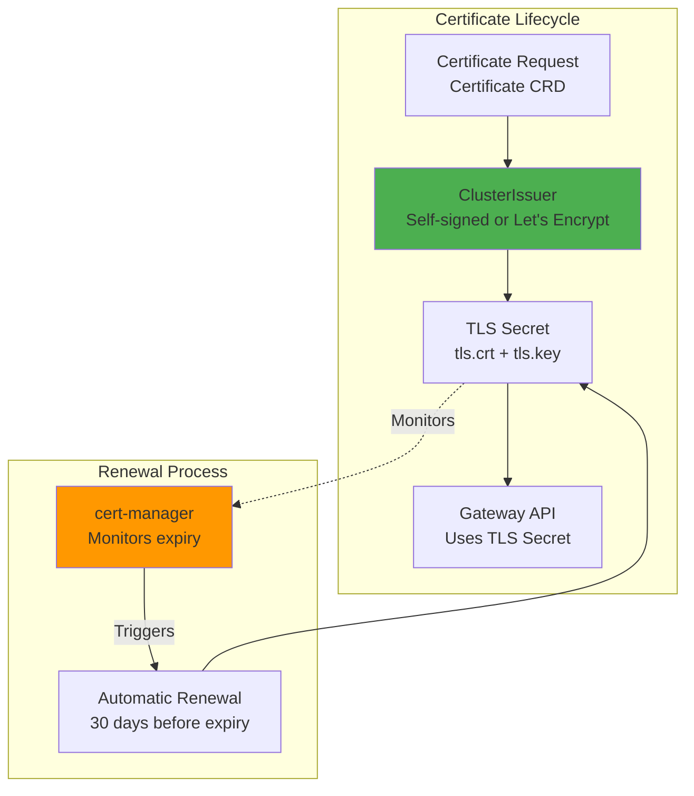

# Encryption: Data Protection at Rest and in Transit

**Version**: 1.0
**Last Updated**: 2025-11-12
**Status**: Production Ready
**Audience**: Platform Engineers, Security Engineers, SRE

Complete guide to encryption in the Kagenti platform, covering TLS for external traffic, Istio mTLS for service-to-service communication, and data-at-rest encryption strategies.

---

## Table of Contents

- [Overview](#overview)
- [Encryption Layers](#encryption-layers)
- [External Traffic Encryption](#external-traffic-encryption)
- [Service-to-Service Encryption](#service-to-service-encryption)
- [Data-at-Rest Encryption](#data-at-rest-encryption)
- [Certificate Management](#certificate-management)
- [Security Best Practices](#security-best-practices)
- [Troubleshooting](#troubleshooting)
- [Alternatives](#alternatives)
- [Next Steps](#next-steps)
- [References](#references)

---

## Overview

**Purpose**: Ensure all data is encrypted in transit and at rest across the Kagenti platform to meet security and compliance requirements.

**What You Get**:
- ✅ TLS 1.3 for external HTTPS traffic
- ✅ Istio mTLS STRICT mode for all pod-to-pod communication
- ✅ Automatic certificate generation and rotation
- ✅ Encrypted secrets in Kubernetes
- ✅ Data-at-rest encryption for persistent volumes (planned)
- ✅ No application-level TLS configuration needed

**Key Principle**: **Encryption by default**. All network traffic is encrypted transparently via Istio service mesh, and all external access uses HTTPS with automatic HTTP→HTTPS redirect.

**Source**: Based on [Istio Security](https://istio.io/latest/docs/concepts/security/), [cert-manager Documentation](https://cert-manager.io/docs/)

---

## Encryption Layers

The Kagenti platform implements a multi-layer encryption strategy:



**Encryption Coverage**:
1. **External Traffic**: TLS 1.3 via Gateway API + cert-manager
2. **Internal Traffic**: mTLS via Istio service mesh (STRICT mode)
3. **Secrets**: Base64 + etcd encryption (planned: Sealed Secrets, Vault)
4. **Persistent Data**: Planned (encryption-at-rest for PVs)

**Source**: [Kagenti Architecture Overview](../00-getting-started/architecture-overview.md#security-architecture)

---

## External Traffic Encryption

### HTTPS Termination at Gateway

All external traffic uses HTTPS with TLS termination at the Gateway API level:

```yaml
# Gateway with TLS termination
apiVersion: gateway.networking.k8s.io/v1
kind: Gateway
metadata:
  name: external-gateway
  namespace: default
spec:
  gatewayClassName: istio
  listeners:
  # HTTP listener - redirects to HTTPS
  - name: http
    port: 80
    protocol: HTTP

  # HTTPS listener with TLS termination
  - name: https
    hostname: "*.localtest.me"
    port: 443
    protocol: HTTPS
    tls:
      mode: Terminate        # Gateway terminates TLS
      certificateRefs:
      - name: wildcard-tls   # Certificate from cert-manager
        kind: Secret
```

**How It Works**:
1. Client connects to `https://grafana.localtest.me:9443`
2. Gateway terminates TLS using certificate from cert-manager
3. Gateway forwards decrypted HTTP traffic to OAuth2-Proxy/service
4. Service responds via HTTP to Gateway
5. Gateway encrypts response and sends to client

**Benefits**:
- ✅ Centralized TLS management
- ✅ Single point for certificate rotation
- ✅ Automatic HTTP→HTTPS redirect
- ✅ Support for modern TLS ciphers (TLS 1.3)

**Source**: [Gateway API TLS Guide](https://gateway-api.sigs.k8s.io/guides/tls/)

---

### HTTP to HTTPS Redirect

All HTTP traffic is automatically redirected to HTTPS:

```yaml
# HTTPRoute for redirect
apiVersion: gateway.networking.k8s.io/v1
kind: HTTPRoute
metadata:
  name: http-redirect
  namespace: default
spec:
  parentRefs:
  - name: external-gateway
    sectionName: http  # HTTP listener
  rules:
  - filters:
    - type: RequestRedirect
      requestRedirect:
        scheme: https
        statusCode: 301  # Permanent redirect
```

**Example**:
```bash
# HTTP request automatically redirects to HTTPS
curl -v http://grafana.localtest.me:8080

# Response:
# HTTP/1.1 301 Moved Permanently
# Location: https://grafana.localtest.me:9443
```

**Source**: [Gateway API HTTPRoute](https://gateway-api.sigs.k8s.io/api-types/httproute/)

---

## Service-to-Service Encryption

### Istio mTLS STRICT Mode

**ALL pod-to-pod traffic is encrypted** via Istio mTLS in STRICT mode:

```
Application A → Istio Sidecar A → mTLS (TLS 1.3) → Istio Sidecar B → Application B
              (localhost HTTP)    (encrypted)           (localhost HTTP)
```

**How It Works**:
1. Application speaks HTTP to localhost (Istio sidecar in same pod)
2. Istio sidecar intercepts outbound traffic
3. Sidecar establishes mTLS connection to destination sidecar
4. Destination sidecar decrypts and forwards to application via localhost

**No Application Changes Needed**: Applications continue using HTTP, Istio handles encryption transparently.

**Source**: [Istio mTLS Guide](../02-service-mesh/istio.md#mtls-configuration)

---

### PeerAuthentication Policy

Enforce mTLS STRICT mode for all services:

```yaml
# Global mTLS STRICT policy
apiVersion: security.istio.io/v1beta1
kind: PeerAuthentication
metadata:
  name: default
  namespace: istio-system
spec:
  mtls:
    mode: STRICT  # Require mTLS for all connections
```

**Verification**:
```bash
# Check mTLS status for a pod
kubectl exec -n team1 deploy/research-agent -c istio-proxy -- \
  pilot-agent request GET config_dump | jq '.configs[] | select(."@type" == "type.googleapis.com/envoy.admin.v3.ClustersConfigDump") | .dynamic_active_clusters[] | select(.cluster.transport_socket.name == "envoy.transport_sockets.tls")'

# Expected: All clusters show TLS transport socket
```

**Source**: [Istio PeerAuthentication](https://istio.io/latest/docs/reference/config/security/peer_authentication/)

---

### Certificate Rotation

Istio automatically rotates mTLS certificates:

```yaml
# Istio CA configuration (default values)
istio:
  pilot:
    env:
      # Certificate lifetime
      CERT_TTL: 24h
      # Certificate rotation trigger (before expiry)
      CERT_GRACE_PERIOD_RATIO: 0.5  # Rotate at 50% lifetime (12h)
```

**Rotation Timeline**:
- Certificate lifetime: 24 hours
- Rotation trigger: 12 hours (50% of lifetime)
- Old certificate valid for: Additional 12 hours during rotation

**No Downtime**: Rotation happens seamlessly without service interruption.

**Source**: [Istio Certificate Management](https://istio.io/latest/docs/tasks/security/cert-management/plugin-ca-cert/)

---

### Verifying mTLS

Check mTLS status between services:

```bash
# Method 1: Check Kiali (visual)
open https://kiali.localtest.me:9443

# Look for padlock icons on service graph edges
# Green padlock = mTLS enabled
```

```bash
# Method 2: CLI verification
istioctl authn tls-check -n team1 research-agent.team1.svc.cluster.local

# Expected output:
# HOST:PORT                                   STATUS     SERVER     CLIENT
# research-agent.team1.svc.cluster.local:80   OK         STRICT     ISTIO_MUTUAL
```

**Source**: [Istio mTLS Verification](https://istio.io/latest/docs/tasks/security/authentication/authn-policy/#verify-mutual-tls-configuration)

---

## Data-at-Rest Encryption

### Kubernetes Secrets Encryption

**Current State**: Secrets are base64-encoded (NOT encrypted) in etcd by default.

**Planned Enhancement**: Enable etcd encryption at rest.

#### Enable etcd Encryption (Kubernetes)

**File**: `/etc/kubernetes/encryption-config.yaml`

```yaml
apiVersion: apiserver.config.k8s.io/v1
kind: EncryptionConfiguration
resources:
- resources:
  - secrets
  providers:
  - aescbc:
      keys:
      - name: key1
        secret: <BASE64_ENCODED_32_BYTE_KEY>
  - identity: {}  # Fallback (unencrypted)
```

**Enable encryption**:
```bash
# Generate 32-byte encryption key
head -c 32 /dev/urandom | base64

# Update kube-apiserver manifest
sudo vi /etc/kubernetes/manifests/kube-apiserver.yaml

# Add flag:
--encryption-provider-config=/etc/kubernetes/encryption-config.yaml

# Wait for API server to restart
kubectl get pods -n kube-system | grep kube-apiserver
```

**Verify encryption**:
```bash
# Create test secret
kubectl create secret generic test-secret --from-literal=key=value -n default

# Check if encrypted in etcd
ETCDCTL_API=3 etcdctl get /registry/secrets/default/test-secret

# Expected: Binary data (encrypted), NOT plain text
```

**Source**: [Kubernetes Secrets Encryption](https://kubernetes.io/docs/tasks/administer-cluster/encrypt-data/)

---

### Sealed Secrets (Planned)

**Purpose**: Encrypt secrets in Git safely.

**Architecture**:

```mermaid
graph LR
    DEV[Developer] -->|1. Create Secret| SECRET[secret.yaml]
    SECRET -->|2. Encrypt| KUBESEAL[kubeseal CLI]
    KUBESEAL -->|3. Sealed Secret| SEALED[sealed-secret.yaml]
    SEALED -->|4. Commit to Git| GIT[Git Repository]
    GIT -->|5. ArgoCD Sync| K8S[Kubernetes]
    K8S -->|6. Decrypt| CONTROLLER[Sealed Secrets Controller]
    CONTROLLER -->|7. Create| FINAL[Secret Object]

    style KUBESEAL fill:#4caf50
    style CONTROLLER fill:#2196f3
```


**Installation**:
```bash
# Install Sealed Secrets controller
kubectl apply -f https://github.com/bitnami-labs/sealed-secrets/releases/download/v0.24.0/controller.yaml

# Install kubeseal CLI
brew install kubeseal
```

**Usage**:
```bash
# Encrypt secret
kubectl create secret generic my-secret \
  --from-literal=password=secret123 \
  --dry-run=client -o yaml | \
  kubeseal -o yaml > sealed-secret.yaml

# Commit to Git (safe!)
git add sealed-secret.yaml
git commit -m "Add encrypted secret"
git push

# ArgoCD deploys SealedSecret
# Controller automatically creates Secret
```

**Source**: [Sealed Secrets GitHub](https://github.com/bitnami-labs/sealed-secrets)

---

### Persistent Volume Encryption (Planned)

**Purpose**: Encrypt data at rest in persistent volumes.

**Options**:

#### Option 1: StorageClass with Encryption

```yaml
apiVersion: storage.k8s.io/v1
kind: StorageClass
metadata:
  name: encrypted-storage
provisioner: kubernetes.io/aws-ebs  # Or other CSI driver
parameters:
  type: gp3
  encrypted: "true"
  kmsKeyId: arn:aws:kms:us-east-1:123456789:key/xxx
```

#### Option 2: LUKS Encryption (Linux)

```bash
# Create encrypted volume
cryptsetup luksFormat /dev/sdb

# Open encrypted volume
cryptsetup luksOpen /dev/sdb encrypted-vol

# Format and mount
mkfs.ext4 /dev/mapper/encrypted-vol
mount /dev/mapper/encrypted-vol /mnt/encrypted
```

**Source**: [Kubernetes Storage Classes](https://kubernetes.io/docs/concepts/storage/storage-classes/)

---

## Certificate Management

### cert-manager for TLS Certificates

cert-manager automates TLS certificate issuance and renewal:



**ClusterIssuer for Development**:
```yaml
apiVersion: cert-manager.io/v1
kind: ClusterIssuer
metadata:
  name: selfsigned-issuer
spec:
  selfSigned: {}
```

**Certificate Request**:
```yaml
apiVersion: cert-manager.io/v1
kind: Certificate
metadata:
  name: wildcard-localtest-me
  namespace: default
spec:
  secretName: wildcard-tls
  issuerRef:
    name: selfsigned-issuer
    kind: ClusterIssuer
  dnsNames:
  - "*.localtest.me"
  - "localtest.me"
```

**Automatic Renewal**:
- Certificate lifetime: 90 days
- Renewal trigger: 30 days before expiry
- Automatic secret update (no manual intervention)

**Source**: [cert-manager Guide](../01-infrastructure/cert-manager.md)

---

### Let's Encrypt for Production

**ClusterIssuer for Production**:
```yaml
apiVersion: cert-manager.io/v1
kind: ClusterIssuer
metadata:
  name: letsencrypt-prod
spec:
  acme:
    server: https://acme-v02.api.letsencrypt.org/directory
    email: platform@example.com
    privateKeySecretRef:
      name: letsencrypt-prod
    solvers:
    # HTTP-01 challenge
    - http01:
        ingress:
          class: istio

    # Or DNS-01 challenge (for wildcards)
    - dns01:
        cloudflare:
          email: platform@example.com
          apiTokenSecretRef:
            name: cloudflare-api-token
            key: api-token
```

**Certificate with Let's Encrypt**:
```yaml
apiVersion: cert-manager.io/v1
kind: Certificate
metadata:
  name: production-tls
  namespace: default
spec:
  secretName: production-tls
  issuerRef:
    name: letsencrypt-prod
    kind: ClusterIssuer
  dnsNames:
  - "kagenti.example.com"
  - "grafana.example.com"
  - "keycloak.example.com"
```

**Source**: [cert-manager ACME Guide](https://cert-manager.io/docs/configuration/acme/)

---

## Security Best Practices

### TLS Configuration

**Gateway API TLS Settings**:
```yaml
apiVersion: gateway.networking.k8s.io/v1
kind: Gateway
metadata:
  name: secure-gateway
spec:
  listeners:
  - name: https
    port: 443
    protocol: HTTPS
    tls:
      mode: Terminate
      certificateRefs:
      - name: tls-cert
      # Recommended TLS settings
      options:
        networking.istio.io/tls-min-protocol-version: "1.3"
        networking.istio.io/tls-ciphersuites: "ECDHE-RSA-AES128-GCM-SHA256,ECDHE-RSA-AES256-GCM-SHA384"
```

**Disable Weak Ciphers**:
```yaml
# Istio ConfigMap
apiVersion: v1
kind: ConfigMap
metadata:
  name: istio
  namespace: istio-system
data:
  mesh: |
    # Disable TLS 1.0 and 1.1
    defaultConfig:
      gatewayTopology:
        proxyProtocol: {}
      meshMTLS:
        minProtocolVersion: TLSV1_3  # Only allow TLS 1.3
```

**Source**: [Istio Security Best Practices](https://istio.io/latest/docs/ops/best-practices/security/)

---

### Secret Management

**Best Practices**:
1. ✅ **Never commit plaintext secrets to Git**
2. ✅ **Use Sealed Secrets or External Secrets Operator**
3. ✅ **Enable etcd encryption for Secrets**
4. ✅ **Rotate secrets regularly** (at least every 90 days)
5. ✅ **Limit secret access via RBAC**
6. ✅ **Audit secret access** via Kubernetes audit logs

**RBAC for Secrets**:
```yaml
# Limit secret access to specific ServiceAccounts
apiVersion: rbac.authorization.k8s.io/v1
kind: Role
metadata:
  name: secret-reader
  namespace: team1
rules:
- apiGroups: [""]
  resources: ["secrets"]
  verbs: ["get", "list"]
  resourceNames: ["allowed-secret-1", "allowed-secret-2"]  # Specific secrets only
```

**Source**: [Kubernetes Secrets Best Practices](https://kubernetes.io/docs/concepts/security/secrets-good-practices/)

---

## Troubleshooting

### Issue: Certificate Not Trusted

**Symptoms**: Browser shows "Your connection is not private" or "NET::ERR_CERT_AUTHORITY_INVALID"

**Diagnosis**:
```bash
# Check certificate details
openssl s_client -connect grafana.localtest.me:9443 -servername grafana.localtest.me < /dev/null

# Look for:
# - Issuer (should match expected CA)
# - Validity dates
# - Subject Alternative Names (SANs)
```

**Fix for Development (Self-Signed)**:
```bash
# Trust self-signed certificate (macOS)
kubectl get secret wildcard-tls -n default -o jsonpath='{.data.tls\.crt}' | base64 -d > /tmp/cert.crt
sudo security add-trusted-cert -d -r trustRoot -k /Library/Keychains/System.keychain /tmp/cert.crt

# Trust self-signed certificate (Linux)
sudo cp /tmp/cert.crt /usr/local/share/ca-certificates/
sudo update-ca-certificates
```

**Fix for Production (Let's Encrypt)**:
```bash
# Check certificate status
kubectl describe certificate production-tls -n default

# Check cert-manager logs
kubectl logs -n cert-manager deploy/cert-manager

# Common issues:
# - DNS not propagating (wait 5-10 minutes)
# - Rate limit hit (use staging for testing)
# - Firewall blocking HTTP-01 challenge (port 80)
```

---

### Issue: mTLS Not Working

**Symptoms**: Service-to-service communication failing with TLS errors.

**Diagnosis**:
```bash
# Check PeerAuthentication policy
kubectl get peerauthentication -A

# Check Istio sidecar injection
kubectl get pods -n team1 -o jsonpath='{range .items[*]}{.metadata.name}{"\t"}{.spec.containers[*].name}{"\n"}{end}'

# Expected: Each pod has "istio-proxy" container
```

**Fix**:
```bash
# Ensure namespace has sidecar injection enabled
kubectl label namespace team1 istio-injection=enabled --overwrite

# Restart pods to inject sidecars
kubectl rollout restart deployment -n team1

# Verify mTLS status
istioctl authn tls-check -n team1 research-agent.team1.svc.cluster.local
```

---

### Issue: Certificate Renewal Failed

**Symptoms**: Certificate expired, Gateway shows TLS errors.

**Diagnosis**:
```bash
# Check certificate status
kubectl describe certificate wildcard-localtest-me -n default

# Check cert-manager logs
kubectl logs -n cert-manager deploy/cert-manager | grep -i error

# Common errors:
# - "acme: error code 429: Rate limit exceeded"
# - "Timeout waiting for cert to be issued"
```

**Fix**:
```bash
# Force certificate renewal
kubectl delete secret wildcard-tls -n default
kubectl annotate certificate wildcard-localtest-me -n default \
  cert-manager.io/issue-temporary-certificate=true

# Wait for renewal
kubectl wait --for=condition=Ready certificate/wildcard-localtest-me -n default --timeout=120s

# Verify new certificate
kubectl get certificate wildcard-localtest-me -n default
```

---

## Alternatives

### Alternative 1: Application-Level TLS

**Process**:
- Each application configures its own TLS certificates
- No service mesh required

**Pros**:
- ✅ Direct control over TLS configuration
- ✅ No proxy overhead

**Cons**:
- ❌ Every application needs TLS configuration
- ❌ Manual certificate distribution
- ❌ Difficult to enforce consistent security policies
- ❌ Higher operational burden

**When to Use**: Small deployments with few services, no compliance requirements

---

### Alternative 2: Linkerd Service Mesh

**Process**:
- Use Linkerd instead of Istio for mTLS

**Pros**:
- ✅ Lighter weight than Istio
- ✅ Automatic mTLS
- ✅ Simpler configuration

**Cons**:
- ❌ Less feature-rich than Istio
- ❌ No Gateway API support (uses Ingress)
- ❌ Smaller ecosystem

**When to Use**: Simpler deployments, performance-critical applications

**Source**: [Linkerd Documentation](https://linkerd.io/2/overview/)

---

### Alternative 3: Consul Service Mesh

**Process**:
- Use HashiCorp Consul for service mesh and mTLS

**Pros**:
- ✅ Multi-platform (Kubernetes + VMs)
- ✅ Built-in service discovery
- ✅ Vault integration for secrets

**Cons**:
- ❌ More complex architecture
- ❌ Commercial features behind paywall
- ❌ Steeper learning curve

**When to Use**: Multi-cloud, hybrid deployments with VMs

**Source**: [Consul Service Mesh](https://www.consul.io/docs/connect)

---

## Next Steps

### For Development

1. **Test mTLS enforcement**:
   ```bash
   # Try connecting without mTLS (should fail)
   kubectl run test-pod --image=curlimages/curl --rm -it -- \
     curl http://research-agent.team1.svc.cluster.local
   ```

2. **Monitor certificate expiry**:
   ```bash
   # Add Prometheus alert for expiring certificates
   # Alert when cert expires in < 30 days
   ```

3. **Add certificate rotation monitoring**:
   ```bash
   # Monitor Istio certificate rotation events
   kubectl logs -n istio-system deploy/istiod | grep -i certificate
   ```

### For Production

1. **Enable etcd encryption**:
   - Follow Kubernetes etcd encryption guide
   - Encrypt all Secrets at rest

2. **Deploy Sealed Secrets**:
   - Install Sealed Secrets controller
   - Encrypt all secrets before committing to Git

3. **Configure Let's Encrypt**:
   - Set up DNS provider (Cloudflare, Route53, etc.)
   - Create ClusterIssuer for Let's Encrypt production
   - Update Certificate resources

4. **Enable Persistent Volume Encryption**:
   - Configure StorageClass with encryption
   - Migrate existing PVs to encrypted storage

### Learn More

- [Istio Service Mesh Guide](../02-service-mesh/istio.md) - mTLS configuration
- [cert-manager Guide](../01-infrastructure/cert-manager.md) - Certificate management
- [Gateway API Guide](../01-infrastructure/gateway-api.md) - TLS termination
- [Secrets Management Guide](./secrets-management.md) - Secret handling *(coming soon)*

---

## References

### Official Documentation

- **Istio Security**: [istio.io/latest/docs/concepts/security](https://istio.io/latest/docs/concepts/security/)
- **Istio mTLS**: [istio.io/latest/docs/tasks/security/authentication/authn-policy](https://istio.io/latest/docs/tasks/security/authentication/authn-policy/)
- **cert-manager**: [cert-manager.io/docs](https://cert-manager.io/docs/)
- **Kubernetes Secrets**: [kubernetes.io/docs/concepts/configuration/secret](https://kubernetes.io/docs/concepts/configuration/secret/)
- **Gateway API TLS**: [gateway-api.sigs.k8s.io/guides/tls](https://gateway-api.sigs.k8s.io/guides/tls/)

### Tools and Projects

- **Sealed Secrets**: [github.com/bitnami-labs/sealed-secrets](https://github.com/bitnami-labs/sealed-secrets)
- **External Secrets Operator**: [external-secrets.io](https://external-secrets.io/)
- **Let's Encrypt**: [letsencrypt.org](https://letsencrypt.org/)

### Internal Documentation

- **Main README**: [../../README.md](../../README.md)
- **Architecture Overview**: [../00-getting-started/architecture-overview.md](../00-getting-started/architecture-overview.md)
- **Istio Service Mesh**: [../02-service-mesh/istio.md](../02-service-mesh/istio.md)
- **cert-manager**: [../01-infrastructure/cert-manager.md](../01-infrastructure/cert-manager.md)
- **Gateway API**: [../01-infrastructure/gateway-api.md](../01-infrastructure/gateway-api.md)

### Repository

- **GitHub**: [Ladas/kagenti-demo-deployment](https://github.com/Ladas/kagenti-demo-deployment)
- **Istio Configuration**: `components/00-infrastructure/istio/`
- **Gateway Configuration**: `components/01-platform/gateway/`
- **TLS Certificates**: `components/01-platform/tls/`

---

**Last Updated**: 2025-11-12
**Document Version**: 1.0
**Maintained By**: Platform Engineering Team
**License**: Apache 2.0
