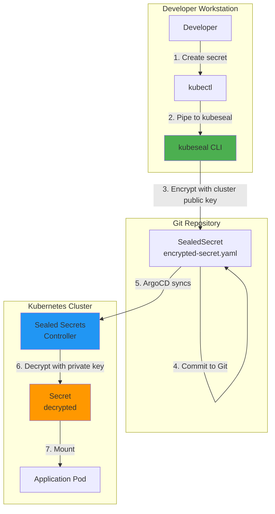
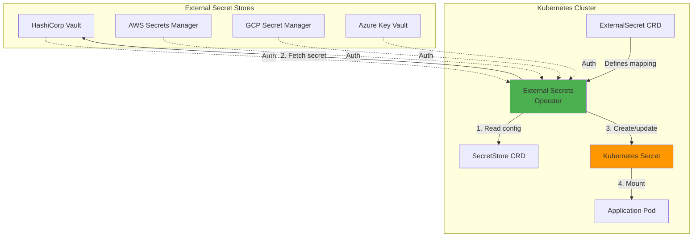
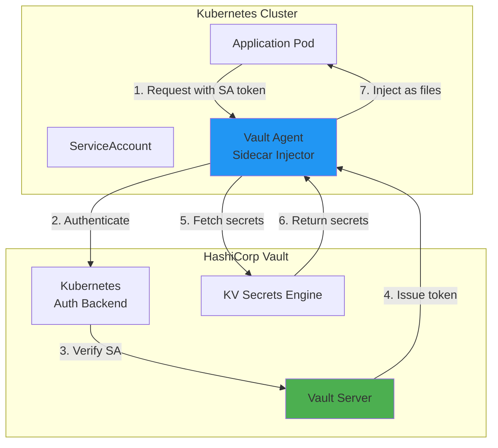

# Secrets Management: Secure Handling of Sensitive Data

**Version**: 1.0
**Last Updated**: 2025-11-12
**Status**: Production Ready
**Audience**: Platform Engineers, Security Engineers, DevOps Engineers

Complete guide to secrets management in the Kagenti platform, covering Kubernetes Secrets, Sealed Secrets for GitOps, External Secrets Operator, HashiCorp Vault integration, and best practices for handling sensitive data.

---

## Table of Contents

- [Overview](#overview)
- [Current State: Kubernetes Secrets](#current-state-kubernetes-secrets)
- [GitOps Challenge: Secrets in Git](#gitops-challenge-secrets-in-git)
- [Sealed Secrets](#sealed-secrets)
- [External Secrets Operator](#external-secrets-operator)
- [HashiCorp Vault Integration](#hashicorp-vault-integration)
- [Secret Rotation](#secret-rotation)
- [RBAC for Secrets](#rbac-for-secrets)
- [Best Practices](#best-practices)
- [Troubleshooting](#troubleshooting)
- [Alternatives](#alternatives)
- [Next Steps](#next-steps)
- [References](#references)

---

## Overview

**Purpose**: Provide secure, auditable, and GitOps-compatible secret management for the Kagenti platform across all environments.

**What You Get**:
- ✅ Understanding of Kubernetes Secrets limitations
- ✅ GitOps-compatible secret encryption (Sealed Secrets)
- ✅ External secret management (Vault, cloud providers)
- ✅ Automated secret rotation strategies
- ✅ RBAC and access control for secrets
- ✅ Audit logging for secret access
- ✅ Migration paths from current state to production-ready

**Key Principle**: **Secrets should never exist in plaintext in Git**, and should be encrypted at rest in etcd. All secret access should be auditable and follow the principle of least privilege.

**Source**: Based on [Kubernetes Secrets Best Practices](https://kubernetes.io/docs/concepts/security/secrets-good-practices/), [Sealed Secrets](https://github.com/bitnami-labs/sealed-secrets), [External Secrets Operator](https://external-secrets.io/)

---

## Current State: Kubernetes Secrets

### How Kubernetes Secrets Work

Kubernetes Secrets are API objects that store sensitive data (passwords, tokens, keys):

```yaml
apiVersion: v1
kind: Secret
metadata:
  name: database-credentials
  namespace: team1
type: Opaque
data:
  username: YWRtaW4=      # base64("admin")
  password: cGFzc3dvcmQ=  # base64("password")
```

**How Secrets are Stored**:
1. API request creates Secret object
2. kube-apiserver stores in etcd
3. **By default**: Secrets are base64-encoded (NOT encrypted) in etcd
4. **With encryption**: Secrets can be encrypted at rest in etcd

**Source**: [Kubernetes Secrets](https://kubernetes.io/docs/concepts/configuration/secret/)

---

### Limitations of Kubernetes Secrets

**Security Gaps**:

| Issue | Impact | Mitigation |
|-------|--------|------------|
| **Base64 encoding ≠ encryption** | Anyone with etcd access can decode secrets | Enable etcd encryption |
| **Secrets visible in YAML** | `kubectl get secret -o yaml` shows base64 data | RBAC restrictions |
| **No audit trail** | Can't track who accessed secrets | Enable Kubernetes audit logging |
| **No expiration** | Secrets never expire unless manually rotated | Implement rotation policy |
| **Can't store in Git safely** | Plaintext secrets in Git = security breach | Use Sealed Secrets or External Secrets |

**Source**: [Kubernetes Security Best Practices](https://kubernetes.io/docs/concepts/security/secrets-good-practices/)

---

### Enable etcd Encryption at Rest

**Current State**: ❌ Secrets are base64-encoded in etcd (NOT encrypted)

**Target State**: ✅ Secrets encrypted at rest with AES-CBC

**Implementation**:

#### 1. Generate Encryption Key

```bash
# Generate 32-byte encryption key
head -c 32 /dev/urandom | base64
# Example output: wKvM3xJ2Qy8xZr5LmNq9P1tS7vB4cD6fH8jK0lM2nO3=
```

#### 2. Create Encryption Configuration

**File**: `/etc/kubernetes/encryption-config.yaml`

```yaml
apiVersion: apiserver.config.k8s.io/v1
kind: EncryptionConfiguration
resources:
- resources:
  - secrets
  providers:
  # Primary encryption provider (new secrets)
  - aescbc:
      keys:
      - name: key1
        secret: wKvM3xJ2Qy8xZr5LmNq9P1tS7vB4cD6fH8jK0lM2nO3=

  # Fallback (for existing unencrypted secrets during migration)
  - identity: {}
```

**Encryption Providers**:
- **aescbc**: AES-CBC encryption (recommended)
- **aes-gcm**: AES-GCM encryption (higher security, Kubernetes 1.24+)
- **secretbox**: XSalsa20 and Poly1305 (alternative)
- **identity**: No encryption (fallback for migration)

#### 3. Update kube-apiserver

**For kubeadm clusters**:

```bash
# Edit kube-apiserver manifest
sudo vi /etc/kubernetes/manifests/kube-apiserver.yaml

# Add encryption provider flag
spec:
  containers:
  - command:
    - kube-apiserver
    - --encryption-provider-config=/etc/kubernetes/encryption-config.yaml
    volumeMounts:
    - name: encryption-config
      mountPath: /etc/kubernetes/encryption-config.yaml
      readOnly: true
  volumes:
  - name: encryption-config
    hostPath:
      path: /etc/kubernetes/encryption-config.yaml
      type: File
```

**For Kind clusters**:

```yaml
# kind-config.yaml
kind: Cluster
apiVersion: kind.x-k8s.io/v1alpha4
nodes:
- role: control-plane
  kubeadmConfigPatches:
  - |
    kind: ClusterConfiguration
    apiServer:
      extraArgs:
        encryption-provider-config: /etc/kubernetes/encryption-config.yaml
      extraVolumes:
      - name: encryption-config
        hostPath: /etc/kubernetes/encryption-config.yaml
        mountPath: /etc/kubernetes/encryption-config.yaml
        readOnly: true
        pathType: File
```

#### 4. Restart API Server

```bash
# API server automatically restarts when manifest changes
# Wait for restart
kubectl get pods -n kube-system | grep kube-apiserver

# Should show: Running (1-2 restarts)
```

#### 5. Encrypt Existing Secrets

```bash
# Encrypt all existing secrets (re-write to etcd)
kubectl get secrets --all-namespaces -o json | kubectl replace -f -

# Verify encryption in etcd
ETCDCTL_API=3 etcdctl get /registry/secrets/default/test-secret

# Expected: Binary encrypted data (NOT base64 text)
```

**Verification**:

```bash
# Create test secret
kubectl create secret generic test-secret \
  --from-literal=password=secret123 \
  -n default

# Check etcd storage
ETCDCTL_API=3 etcdctl get /registry/secrets/default/test-secret

# Before encryption: "data:\n  password: c2VjcmV0MTIz\n"
# After encryption: Binary data starting with "k8s:enc:aescbc:v1:key1:..."
```

**Source**: [Kubernetes Encryption at Rest](https://kubernetes.io/docs/tasks/administer-cluster/encrypt-data/)

---

## GitOps Challenge: Secrets in Git

### The Problem

GitOps requires all configuration in Git, but secrets can't be stored in plaintext:

```
❌ BAD: Plaintext secret in Git
---
apiVersion: v1
kind: Secret
metadata:
  name: db-password
data:
  password: cGFzc3dvcmQ=  # base64("password") - easily decoded!
```

**Why This is Dangerous**:
- 🔴 Anyone with Git access can decode base64
- 🔴 Secrets visible in commit history forever
- 🔴 Accidental exposure via public repos
- 🔴 Audit trail only shows commits, not secret access

**Source**: [GitOps Security Best Practices](https://www.weave.works/blog/gitops-security-best-practices)

---

### The Solution: Encrypted Secrets in Git

**Two Approaches**:

1. **Sealed Secrets** - Encrypt secrets client-side, decrypt in-cluster
2. **External Secrets Operator** - Reference secrets from external vault (Vault, AWS Secrets Manager, etc.)

**Comparison**:

| Feature | Sealed Secrets | External Secrets Operator |
|---------|----------------|---------------------------|
| **Storage** | Encrypted in Git | External vault (Vault, cloud) |
| **Complexity** | Low | Medium-High |
| **Rotation** | Manual re-encryption | Automatic (from vault) |
| **Audit** | Git commits | Vault audit logs |
| **Offline access** | Yes (encrypted copy in Git) | No (requires vault connectivity) |
| **Cost** | Free | May require vault infrastructure |

---

## Sealed Secrets

### Architecture



**How It Works**:
1. Sealed Secrets controller creates a public/private key pair in cluster
2. Developer encrypts secret with public key (via `kubeseal` CLI)
3. Encrypted `SealedSecret` is safe to commit to Git
4. Controller decrypts `SealedSecret` with private key, creates `Secret`
5. Only the cluster with the private key can decrypt

**Source**: [Sealed Secrets GitHub](https://github.com/bitnami-labs/sealed-secrets)

---

### Installation

#### 1. Install Sealed Secrets Controller

```bash
# Install controller (creates private key in cluster)
kubectl apply -f https://github.com/bitnami-labs/sealed-secrets/releases/download/v0.24.0/controller.yaml

# Verify installation
kubectl get pods -n kube-system | grep sealed-secrets-controller
# Expected: sealed-secrets-controller-xxx   1/1   Running
```

#### 2. Install kubeseal CLI

```bash
# macOS
brew install kubeseal

# Linux
wget https://github.com/bitnami-labs/sealed-secrets/releases/download/v0.24.0/kubeseal-0.24.0-linux-amd64.tar.gz
tar xfz kubeseal-0.24.0-linux-amd64.tar.gz
sudo install -m 755 kubeseal /usr/local/bin/kubeseal

# Verify
kubeseal --version
# Expected: v0.24.0
```

**Source**: [Sealed Secrets Installation](https://github.com/bitnami-labs/sealed-secrets#installation)

---

### Usage

#### Create Sealed Secret

```bash
# Method 1: From literal values
kubectl create secret generic db-credentials \
  --from-literal=username=admin \
  --from-literal=password=secret123 \
  --dry-run=client -o yaml | \
  kubeseal -o yaml > sealed-db-credentials.yaml

# Method 2: From existing secret
kubectl get secret existing-secret -n team1 -o yaml | \
  kubeseal -o yaml > sealed-existing-secret.yaml

# Method 3: From file
kubectl create secret generic tls-cert \
  --from-file=tls.crt=cert.pem \
  --from-file=tls.key=key.pem \
  --dry-run=client -o yaml | \
  kubeseal -o yaml > sealed-tls-cert.yaml
```

**Generated SealedSecret**:

```yaml
apiVersion: bitnami.com/v1alpha1
kind: SealedSecret
metadata:
  name: db-credentials
  namespace: team1
spec:
  encryptedData:
    username: AgBm5Qz... (encrypted blob)
    password: AgC9kX... (encrypted blob)
  template:
    metadata:
      name: db-credentials
      namespace: team1
    type: Opaque
```

**Safe to Commit**:

```bash
# Add to Git
git add sealed-db-credentials.yaml
git commit -m "Add database credentials (encrypted)"
git push

# ArgoCD will sync and controller will decrypt
```

---

#### Scopes: Control Where Secrets Can Be Used

Sealed Secrets support three scopes to control where secrets can be decrypted:

**1. Strict Scope (Default)** - Namespace + Name specific

```bash
# Can only be decrypted in specific namespace with specific name
kubeseal --scope strict < secret.yaml > sealed-secret.yaml
```

```yaml
# Sealed secret tied to namespace + name
kind: SealedSecret
metadata:
  name: db-credentials
  namespace: team1  # Can only be used in team1 namespace
```

**2. Namespace-wide Scope** - Any name, specific namespace

```bash
# Can be decrypted in any secret name within namespace
kubeseal --scope namespace-wide < secret.yaml > sealed-secret.yaml
```

**3. Cluster-wide Scope** - Any namespace, any name

```bash
# Can be decrypted anywhere in cluster (use with caution!)
kubeseal --scope cluster-wide < secret.yaml > sealed-secret.yaml
```

**Best Practice**: Use strict scope (default) for production, namespace-wide for development.

---

#### Update Sealed Secret

```bash
# Create new version with updated value
kubectl create secret generic db-credentials \
  --from-literal=username=admin \
  --from-literal=password=newpassword123 \
  --dry-run=client -o yaml | \
  kubeseal -o yaml > sealed-db-credentials.yaml

# Commit and push
git add sealed-db-credentials.yaml
git commit -m "Rotate database password"
git push

# ArgoCD syncs, controller decrypts new version
```

---

### Backup and Restore Private Key

**⚠️ CRITICAL**: The controller's private key is required to decrypt all SealedSecrets. If you lose it, you lose access to all secrets.

#### Backup Private Key

```bash
# Export sealing key (private key)
kubectl get secret -n kube-system \
  -l sealedsecrets.bitnami.com/sealed-secrets-key=active \
  -o yaml > sealed-secrets-master.key

# Store in secure location (NOT in Git!)
# Options:
# - Vault (HashiCorp Vault)
# - Cloud secret manager (AWS Secrets Manager, GCP Secret Manager)
# - Offline encrypted backup
```

#### Restore Private Key (Disaster Recovery)

```bash
# Restore from backup
kubectl apply -f sealed-secrets-master.key

# Restart controller to use restored key
kubectl rollout restart deployment -n kube-system sealed-secrets-controller

# Verify
kubectl logs -n kube-system deployment/sealed-secrets-controller
# Expected: "controller version: v0.24.0"
```

**Source**: [Sealed Secrets Backup](https://github.com/bitnami-labs/sealed-secrets#how-to-backup-sealed-secrets)

---

## External Secrets Operator

### Architecture



**How It Works**:
1. `SecretStore` defines connection to external vault (Vault, AWS, GCP, Azure)
2. `ExternalSecret` defines which secrets to fetch and how to map them
3. External Secrets Operator fetches secrets from vault
4. Operator creates/updates Kubernetes `Secret` with fetched data
5. Secrets automatically refresh when vault values change

**Source**: [External Secrets Operator](https://external-secrets.io/)

---

### Installation

```bash
# Add Helm repository
helm repo add external-secrets https://charts.external-secrets.io
helm repo update

# Install operator
helm install external-secrets \
  external-secrets/external-secrets \
  -n external-secrets-system \
  --create-namespace

# Verify installation
kubectl get pods -n external-secrets-system
# Expected: external-secrets-xxx   1/1   Running
```

**Source**: [External Secrets Installation](https://external-secrets.io/latest/introduction/getting-started/)

---

### Example: HashiCorp Vault

#### 1. Configure SecretStore

```yaml
apiVersion: external-secrets.io/v1beta1
kind: SecretStore
metadata:
  name: vault-backend
  namespace: team1
spec:
  provider:
    vault:
      server: "https://vault.example.com"
      path: "secret"
      version: "v2"
      auth:
        # Kubernetes authentication
        kubernetes:
          mountPath: "kubernetes"
          role: "team1-role"
          serviceAccountRef:
            name: external-secrets-sa
```

#### 2. Create ExternalSecret

```yaml
apiVersion: external-secrets.io/v1beta1
kind: ExternalSecret
metadata:
  name: database-credentials
  namespace: team1
spec:
  refreshInterval: 1h  # Sync from Vault every hour
  secretStoreRef:
    name: vault-backend
    kind: SecretStore
  target:
    name: db-credentials  # Name of Kubernetes Secret to create
    creationPolicy: Owner
  data:
  - secretKey: username  # Key in Kubernetes Secret
    remoteRef:
      key: database/prod  # Path in Vault
      property: username   # Field in Vault secret
  - secretKey: password
    remoteRef:
      key: database/prod
      property: password
```

#### 3. Operator Creates Secret

```yaml
# Kubernetes Secret created automatically by operator
apiVersion: v1
kind: Secret
metadata:
  name: db-credentials
  namespace: team1
  ownerReferences:
  - apiVersion: external-secrets.io/v1beta1
    kind: ExternalSecret
    name: database-credentials
type: Opaque
data:
  username: YWRtaW4=      # Fetched from Vault
  password: cGFzc3dvcmQ=  # Fetched from Vault
```

**Source**: [External Secrets Vault Provider](https://external-secrets.io/latest/provider/hashicorp-vault/)

---

### Example: AWS Secrets Manager

```yaml
apiVersion: external-secrets.io/v1beta1
kind: SecretStore
metadata:
  name: aws-secrets
  namespace: team1
spec:
  provider:
    aws:
      service: SecretsManager
      region: us-east-1
      auth:
        jwt:
          serviceAccountRef:
            name: external-secrets-sa
---
apiVersion: external-secrets.io/v1beta1
kind: ExternalSecret
metadata:
  name: api-keys
  namespace: team1
spec:
  refreshInterval: 1h
  secretStoreRef:
    name: aws-secrets
    kind: SecretStore
  target:
    name: api-keys
  data:
  - secretKey: openai-api-key
    remoteRef:
      key: prod/openai  # ARN or name in AWS Secrets Manager
```

**Source**: [External Secrets AWS Provider](https://external-secrets.io/latest/provider/aws-secrets-manager/)

---

## HashiCorp Vault Integration

### Vault Architecture for Kubernetes



**Deployment Options**:
1. **External Vault** - Vault cluster outside Kubernetes
2. **Vault in Kubernetes** - Vault deployed in cluster
3. **Vault Agent Injector** - Sidecar pattern for secret injection

---

### Vault Deployment (In-Cluster)

```bash
# Add Vault Helm repository
helm repo add hashicorp https://helm.releases.hashicorp.com
helm repo update

# Install Vault in dev mode (for testing)
helm install vault hashicorp/vault \
  --set "server.dev.enabled=true" \
  --set "injector.enabled=true" \
  -n vault \
  --create-namespace

# Production mode (HA with Raft storage)
helm install vault hashicorp/vault \
  --set "server.ha.enabled=true" \
  --set "server.ha.raft.enabled=true" \
  --set "server.ha.replicas=3" \
  --set "injector.enabled=true" \
  -n vault \
  --create-namespace
```

**Source**: [Vault Kubernetes Installation](https://developer.hashicorp.com/vault/docs/platform/k8s/helm)

---

### Configure Kubernetes Auth

```bash
# Enable Kubernetes auth method
kubectl exec -n vault vault-0 -- vault auth enable kubernetes

# Configure Kubernetes auth
kubectl exec -n vault vault-0 -- vault write auth/kubernetes/config \
  kubernetes_host="https://$KUBERNETES_PORT_443_TCP_ADDR:443"

# Create policy for team1 namespace
kubectl exec -n vault vault-0 -- vault policy write team1-policy - <<EOF
path "secret/data/team1/*" {
  capabilities = ["read", "list"]
}
EOF

# Create role for team1
kubectl exec -n vault vault-0 -- vault write auth/kubernetes/role/team1-role \
  bound_service_account_names=default \
  bound_service_account_namespaces=team1 \
  policies=team1-policy \
  ttl=24h
```

---

### Vault Agent Injector Pattern

**Annotations-based secret injection**:

```yaml
apiVersion: apps/v1
kind: Deployment
metadata:
  name: research-agent
  namespace: team1
spec:
  template:
    metadata:
      annotations:
        # Enable Vault injection
        vault.hashicorp.com/agent-inject: "true"
        vault.hashicorp.com/role: "team1-role"

        # Inject secret as file
        vault.hashicorp.com/agent-inject-secret-db-creds: "secret/data/team1/database"
        vault.hashicorp.com/agent-inject-template-db-creds: |
          {{- with secret "secret/data/team1/database" -}}
          export DB_USER="{{ .Data.data.username }}"
          export DB_PASS="{{ .Data.data.password }}"
          {{- end }}
    spec:
      containers:
      - name: agent
        image: research-agent:latest
        command:
        - /bin/sh
        - -c
        - |
          # Source injected secrets
          source /vault/secrets/db-creds
          # Start application
          python app.py
```

**How It Works**:
1. Vault Agent Injector webhook intercepts pod creation
2. Injects Vault Agent sidecar container
3. Sidecar authenticates with Vault using ServiceAccount token
4. Sidecar fetches secrets and writes to shared volume (`/vault/secrets/`)
5. Application reads secrets from files

**Source**: [Vault Agent Injector](https://developer.hashicorp.com/vault/docs/platform/k8s/injector)

---

## Secret Rotation

### Why Rotate Secrets?

**Security Benefits**:
- 🔐 Limits exposure window if secret is compromised
- 🔐 Reduces risk of credential reuse attacks
- 🔐 Compliance requirement (SOC 2, PCI-DSS, HIPAA)

**Rotation Frequency** (Industry Best Practices):
- **Critical secrets** (admin passwords, root CA keys): 30 days
- **Service credentials** (database passwords, API keys): 90 days
- **Application tokens**: 180 days
- **TLS certificates**: 90 days (Let's Encrypt default)

**Source**: [NIST SP 800-57](https://csrc.nist.gov/publications/detail/sp/800-57-part-1/rev-5/final)

---

### Manual Secret Rotation

```bash
#!/bin/bash
# rotate-keycloak-client-secret.sh

NAMESPACE="oauth2-proxy"
SECRET_NAME="keycloak-client-secret"
KEYCLOAK_NS="keycloak"
CLIENT_ID="kubernetes-dashboard"

# 1. Generate new secret
NEW_SECRET=$(openssl rand -base64 32)

# 2. Update Keycloak client
kubectl exec -n $KEYCLOAK_NS deploy/keycloak -- \
  /opt/keycloak/bin/kcadm.sh config credentials \
  --server http://localhost:8080 \
  --realm master \
  --user admin \
  --password admin

kubectl exec -n $KEYCLOAK_NS deploy/keycloak -- \
  /opt/keycloak/bin/kcadm.sh update clients/$CLIENT_ID \
  -r kubernetes \
  -s "secret=$NEW_SECRET"

# 3. Update Kubernetes Secret
kubectl create secret generic $SECRET_NAME \
  --from-literal=client-secret=$NEW_SECRET \
  -n $NAMESPACE \
  --dry-run=client -o yaml | kubectl apply -f -

# 4. Restart dependent services
kubectl rollout restart deployment -n $NAMESPACE

echo "Secret rotated successfully"
```

---

### Automated Rotation with CronJob

```yaml
apiVersion: batch/v1
kind: CronJob
metadata:
  name: rotate-keycloak-secrets
  namespace: keycloak
spec:
  schedule: "0 0 1 */3 *"  # Every 3 months, 1st day at midnight
  jobTemplate:
    spec:
      template:
        spec:
          serviceAccountName: secret-rotator
          containers:
          - name: rotator
            image: bitnami/kubectl:latest
            command:
            - /bin/bash
            - -c
            - |
              #!/bin/bash
              set -e

              # Rotate all client secrets
              for CLIENT in kubernetes-dashboard grafana kiali; do
                echo "Rotating $CLIENT secret..."

                # Generate new secret
                NEW_SECRET=$(openssl rand -base64 32)

                # Update Keycloak (via API or kcadm)
                # ... (client update logic)

                # Update Kubernetes Secret
                kubectl create secret generic ${CLIENT}-client-secret \
                  --from-literal=client-secret=$NEW_SECRET \
                  -n oauth2-proxy \
                  --dry-run=client -o yaml | kubectl apply -f -

                # Restart OAuth2-Proxy
                kubectl rollout restart deployment oauth2-proxy-${CLIENT} -n oauth2-proxy
              done

              echo "All secrets rotated"
          restartPolicy: OnFailure
---
# RBAC for CronJob
apiVersion: v1
kind: ServiceAccount
metadata:
  name: secret-rotator
  namespace: keycloak
---
apiVersion: rbac.authorization.k8s.io/v1
kind: Role
metadata:
  name: secret-rotator
  namespace: oauth2-proxy
rules:
- apiGroups: [""]
  resources: ["secrets"]
  verbs: ["get", "create", "update", "patch"]
- apiGroups: ["apps"]
  resources: ["deployments"]
  verbs: ["get", "patch"]
---
apiVersion: rbac.authorization.k8s.io/v1
kind: RoleBinding
metadata:
  name: secret-rotator
  namespace: oauth2-proxy
subjects:
- kind: ServiceAccount
  name: secret-rotator
  namespace: keycloak
roleRef:
  kind: Role
  name: secret-rotator
  apiGroup: rbac.authorization.k8s.io
```

---

### Rotation with External Secrets Operator

**Automatic rotation** when vault value changes:

```yaml
apiVersion: external-secrets.io/v1beta1
kind: ExternalSecret
metadata:
  name: database-credentials
  namespace: team1
spec:
  refreshInterval: 1h  # Check vault every hour
  secretStoreRef:
    name: vault-backend
  target:
    name: db-credentials
    creationPolicy: Owner
    template:
      metadata:
        annotations:
          # Trigger pod restart when secret changes
          reloader.stakater.com/match: "true"
  data:
  - secretKey: password
    remoteRef:
      key: database/prod
      property: password
```

**With Reloader** (automatic pod restart):

```bash
# Install Reloader
kubectl apply -f https://raw.githubusercontent.com/stakater/Reloader/master/deployments/kubernetes/reloader.yaml

# Annotate deployment to watch secret
kubectl patch deployment research-agent -n team1 -p \
  '{"spec":{"template":{"metadata":{"annotations":{"reloader.stakater.com/search":"true"}}}}}'
```

**How It Works**:
1. External Secrets Operator fetches from Vault every hour
2. If vault value changed, operator updates Kubernetes Secret
3. Reloader detects Secret change
4. Reloader triggers rolling restart of pods using that Secret

**Source**: [Reloader GitHub](https://github.com/stakater/Reloader)

---

## RBAC for Secrets

### Principle of Least Privilege

**Best Practice**: Only grant secret access to ServiceAccounts that need it.

#### Example: Restrict Secret Access

```yaml
# ServiceAccount for research-agent
apiVersion: v1
kind: ServiceAccount
metadata:
  name: research-agent-sa
  namespace: team1
---
# Role: Read only specific secrets
apiVersion: rbac.authorization.k8s.io/v1
kind: Role
metadata:
  name: research-agent-secrets
  namespace: team1
rules:
- apiGroups: [""]
  resources: ["secrets"]
  verbs: ["get"]
  resourceNames:
  - "openai-api-key"      # Only this secret
  - "research-db-creds"   # And this one
  # NOT all secrets in namespace
---
# Bind role to ServiceAccount
apiVersion: rbac.authorization.k8s.io/v1
kind: RoleBinding
metadata:
  name: research-agent-secrets
  namespace: team1
subjects:
- kind: ServiceAccount
  name: research-agent-sa
  namespace: team1
roleRef:
  kind: Role
  name: research-agent-secrets
  apiGroup: rbac.authorization.k8s.io
---
# Use ServiceAccount in Deployment
apiVersion: apps/v1
kind: Deployment
metadata:
  name: research-agent
  namespace: team1
spec:
  template:
    spec:
      serviceAccountName: research-agent-sa  # Use restricted SA
      containers:
      - name: agent
        image: research-agent:latest
```

---

### Audit Secret Access

**Enable Kubernetes audit logging** to track secret access:

```yaml
# /etc/kubernetes/audit-policy.yaml
apiVersion: audit.k8s.io/v1
kind: Policy
rules:
# Log all requests to secrets
- level: RequestResponse
  resources:
  - group: ""
    resources: ["secrets"]
  omitStages:
  - RequestReceived

# Log secret access attempts (even denied)
- level: Metadata
  verbs: ["get", "list", "watch"]
  resources:
  - group: ""
    resources: ["secrets"]
```

**Query audit logs**:

```bash
# Find who accessed secrets in team1 namespace
kubectl logs -n kube-system kube-apiserver-xxx | \
  jq 'select(.objectRef.resource=="secrets" and .objectRef.namespace=="team1")'

# Example output:
# {
#   "user": "system:serviceaccount:team1:research-agent-sa",
#   "verb": "get",
#   "objectRef": {
#     "resource": "secrets",
#     "namespace": "team1",
#     "name": "openai-api-key"
#   },
#   "responseStatus": { "code": 200 }
# }
```

**Source**: [Kubernetes Auditing](https://kubernetes.io/docs/tasks/debug/debug-cluster/audit/)

---

## Best Practices

### 1. Never Commit Plaintext Secrets to Git

**❌ BAD**:
```yaml
# ❌ Never do this!
apiVersion: v1
kind: Secret
metadata:
  name: api-key
data:
  key: c3VwZXJzZWNyZXQ=  # base64 is NOT encryption!
```

**✅ GOOD** (Sealed Secret):
```yaml
# ✅ Encrypted, safe to commit
apiVersion: bitnami.com/v1alpha1
kind: SealedSecret
metadata:
  name: api-key
spec:
  encryptedData:
    key: AgBm5Qz8kX3... (encrypted blob)
```

---

### 2. Enable etcd Encryption

**❌ Current State**: Secrets are base64 in etcd (easily decoded)

**✅ Target State**: Secrets encrypted with AES-CBC in etcd

```yaml
# /etc/kubernetes/encryption-config.yaml
resources:
- resources: [secrets]
  providers:
  - aescbc:
      keys:
      - name: key1
        secret: <32-byte-base64-key>
```

---

### 3. Rotate Secrets Regularly

**Rotation Schedule**:
- Critical secrets (admin passwords): **30 days**
- Service credentials (API keys): **90 days**
- TLS certificates: **90 days** (automated via cert-manager)

**Automated Rotation**:
- CronJob for scheduled rotation
- External Secrets Operator for vault-backed rotation
- Reloader for automatic pod restarts

---

### 4. Use RBAC to Limit Access

**Principle**: Only grant secret access to ServiceAccounts that need it.

```yaml
# ✅ Specific secret access
rules:
- apiGroups: [""]
  resources: ["secrets"]
  verbs: ["get"]
  resourceNames: ["allowed-secret-1", "allowed-secret-2"]

# ❌ Broad secret access
rules:
- apiGroups: [""]
  resources: ["secrets"]
  verbs: ["get", "list"]  # Can read all secrets!
```

---

### 5. Audit Secret Access

**Enable audit logging** for all secret operations:

```yaml
# Log all secret access
- level: RequestResponse
  resources:
  - group: ""
    resources: ["secrets"]
```

**Monitor for suspicious activity**:
- Secrets accessed by unexpected ServiceAccounts
- Bulk secret reads (`kubectl get secrets --all-namespaces`)
- Secret access from outside cluster

---

### 6. Separate Secrets by Environment

**❌ BAD**: Single secret for all environments

```yaml
# ❌ Shared secret across dev/stage/prod
apiVersion: v1
kind: Secret
metadata:
  name: database  # Same secret everywhere
data:
  password: cGFzc3dvcmQ=  # Same password for all envs!
```

**✅ GOOD**: Environment-specific secrets

```yaml
# ✅ Different secrets per environment
# dev/secrets.yaml
apiVersion: v1
kind: Secret
metadata:
  name: database
  namespace: team1-dev
data:
  password: ZGV2cGFzc3dvcmQ=  # Dev password

# prod/secrets.yaml
apiVersion: v1
kind: Secret
metadata:
  name: database
  namespace: team1-prod
data:
  password: cHJvZHBhc3N3b3Jk  # Different prod password
```

---

### 7. Use Strong Encryption for Sealed Secrets

**Recommendation**: Use RSA-4096 for Sealed Secrets controller

```bash
# Generate strong keypair (during initial setup)
openssl req -x509 -days 365 -nodes -newkey rsa:4096 \
  -keyout sealed-secrets.key \
  -out sealed-secrets.crt \
  -subj "/CN=sealed-secret/O=sealed-secret"

# Create secret with keypair
kubectl create secret tls sealed-secrets-key \
  --cert=sealed-secrets.crt \
  --key=sealed-secrets.key \
  -n kube-system \
  --dry-run=client -o yaml | \
  kubectl label -f - \
  sealedsecrets.bitnami.com/sealed-secrets-key=active \
  --local --dry-run=client -o yaml | \
  kubectl apply -f -
```

---

### 8. Backup Sealed Secrets Private Key

**⚠️ CRITICAL**: Losing the private key means losing access to all secrets!

```bash
# Backup private key
kubectl get secret -n kube-system \
  -l sealedsecrets.bitnami.com/sealed-secrets-key=active \
  -o yaml > sealed-secrets-master.key

# Store in secure vault
# - HashiCorp Vault
# - AWS Secrets Manager
# - Offline encrypted backup (NOT in Git!)
```

---

### 9. Use External Secrets for Production

**For production environments**, prefer External Secrets Operator:

**Benefits**:
- ✅ Centralized secret management (Vault, AWS, GCP, Azure)
- ✅ Automatic rotation when vault values change
- ✅ Audit trail in vault
- ✅ Secret versioning and rollback
- ✅ Compliance-friendly (SOC 2, HIPAA)

**Trade-off**: Requires vault infrastructure and connectivity

---

### 10. Avoid Secrets in Environment Variables

**❌ LESS SECURE**: Environment variables (visible in process list)

```yaml
# ❌ Secrets visible in `kubectl exec pod -- env`
env:
- name: DB_PASSWORD
  valueFrom:
    secretKeyRef:
      name: db-credentials
      key: password
```

**✅ MORE SECURE**: Mounted as files (not in process list)

```yaml
# ✅ Secrets only in files
volumeMounts:
- name: secrets
  mountPath: /secrets
  readOnly: true
volumes:
- name: secrets
  secret:
    secretName: db-credentials
    defaultMode: 0400  # Read-only for owner
```

**Application reads**:

```python
# Read from file instead of environment
with open('/secrets/password', 'r') as f:
    db_password = f.read().strip()
```

---

## Troubleshooting

### Issue: SealedSecret Not Creating Secret

**Symptoms**: SealedSecret created, but no corresponding Secret

**Diagnosis**:

```bash
# Check SealedSecret status
kubectl get sealedsecret db-credentials -n team1 -o yaml

# Check controller logs
kubectl logs -n kube-system deployment/sealed-secrets-controller

# Common errors:
# - "cannot unseal: no key could decrypt secret"
# - "failed to decrypt secret"
```

**Possible Causes**:

1. **Wrong Scope**: SealedSecret created for different namespace

```bash
# Fix: Re-encrypt with correct namespace
kubectl create secret generic db-credentials \
  --from-literal=password=secret123 \
  --namespace=team1 \
  --dry-run=client -o yaml | \
  kubeseal --namespace=team1 -o yaml > sealed-secret.yaml
```

2. **Controller Key Changed**: Private key rotated/lost

```bash
# Restore old key from backup
kubectl apply -f sealed-secrets-master.key

# Restart controller
kubectl rollout restart deployment -n kube-system sealed-secrets-controller
```

3. **Certificate Expired**

```bash
# Check certificate expiry
kubectl get secret -n kube-system \
  -l sealedsecrets.bitnami.com/sealed-secrets-key=active \
  -o jsonpath='{.items[0].data.tls\.crt}' | base64 -d | openssl x509 -noout -dates

# Generate new keypair if expired (see Best Practices #7)
```

---

### Issue: ExternalSecret Stuck in "SecretSyncedError"

**Symptoms**: ExternalSecret exists, but Secret not created

**Diagnosis**:

```bash
# Check ExternalSecret status
kubectl get externalsecret db-credentials -n team1 -o yaml

# Example error:
# status:
#   conditions:
#   - message: "secret data key not found: password"
#     reason: SecretSyncedError
```

**Possible Causes**:

1. **Secret Doesn't Exist in Vault**

```bash
# Verify secret exists in Vault
vault kv get secret/team1/database

# Create if missing
vault kv put secret/team1/database username=admin password=secret123
```

2. **Wrong Path or Property**

```yaml
# ❌ Wrong property name
data:
- secretKey: password
  remoteRef:
    key: database/prod
    property: pass  # Should be "password"
```

3. **Authentication Failed**

```bash
# Check SecretStore auth
kubectl get secretstore vault-backend -n team1 -o yaml

# Check operator logs
kubectl logs -n external-secrets-system deployment/external-secrets

# Common errors:
# - "permission denied"
# - "invalid service account token"
```

**Fix**:

```bash
# Re-configure Vault auth
kubectl exec -n vault vault-0 -- vault write auth/kubernetes/role/team1-role \
  bound_service_account_names=external-secrets-sa \
  bound_service_account_namespaces=team1 \
  policies=team1-policy
```

---

### Issue: Secret Rotation Not Triggering Pod Restart

**Symptoms**: Secret updated, but pods still using old values

**Diagnosis**:

```bash
# Check if Reloader is installed
kubectl get deployment reloader -n reloader

# Check pod annotations
kubectl get deployment research-agent -n team1 -o yaml | grep reloader

# Expected:
#   reloader.stakater.com/search: "true"
```

**Fix**:

```bash
# Install Reloader
kubectl apply -f https://raw.githubusercontent.com/stakater/Reloader/master/deployments/kubernetes/reloader.yaml

# Annotate deployment
kubectl patch deployment research-agent -n team1 -p \
  '{"spec":{"template":{"metadata":{"annotations":{"reloader.stakater.com/search":"true"}}}}}'

# Manual restart if needed
kubectl rollout restart deployment research-agent -n team1
```

---

## Alternatives

### Alternative 1: Native Kubernetes Secrets (No Encryption)

**Process**:
- Use Kubernetes Secrets with base64 encoding
- Store secrets in Git (base64-encoded)

**Pros**:
- ✅ Simple, no additional tools
- ✅ Built-in to Kubernetes

**Cons**:
- ❌ Base64 is NOT encryption (easily decoded)
- ❌ Secrets visible in Git history
- ❌ No audit trail for secret access
- ❌ No automatic rotation

**When to Use**: Small non-production environments, no compliance requirements

---

### Alternative 2: Git-Crypt

**Process**:
- Use git-crypt to encrypt files in Git repository
- Decrypt during deployment

**Pros**:
- ✅ Transparent encryption in Git
- ✅ No additional Kubernetes components

**Cons**:
- ❌ Requires git-crypt installation
- ❌ Manual key distribution
- ❌ Difficult to rotate encryption keys
- ❌ Not Kubernetes-native

**When to Use**: Teams already using git-crypt, simple GitOps workflows

**Source**: [git-crypt GitHub](https://github.com/AGWA/git-crypt)

---

### Alternative 3: Mozilla SOPS

**Process**:
- Encrypt secrets with SOPS (Secrets OPerationS)
- Integrate with age, PGP, or cloud KMS

**Pros**:
- ✅ Multi-provider (age, PGP, AWS KMS, GCP KMS, Azure Key Vault)
- ✅ GitOps-friendly
- ✅ Fine-grained encryption (encrypt values, not keys)

**Cons**:
- ❌ Requires SOPS CLI in CI/CD pipeline
- ❌ Additional complexity vs Sealed Secrets
- ❌ Manual decryption step

**When to Use**: Multi-cloud environments, need for cloud KMS integration

**Source**: [SOPS GitHub](https://github.com/mozilla/sops)

**Example**:

```bash
# Encrypt with AWS KMS
sops --encrypt --kms arn:aws:kms:us-east-1:123456789:key/xxx secret.yaml > secret.enc.yaml

# Decrypt during deployment
sops --decrypt secret.enc.yaml | kubectl apply -f -
```

---

### Alternative 4: Cloud Provider Secret Managers

**Process**:
- Store secrets in cloud provider (AWS Secrets Manager, GCP Secret Manager, Azure Key Vault)
- Use External Secrets Operator or native CSI driver

**Pros**:
- ✅ Fully managed service
- ✅ Automatic rotation (AWS Secrets Manager)
- ✅ Audit logging built-in
- ✅ Compliance certifications

**Cons**:
- ❌ Vendor lock-in
- ❌ Cost (per secret stored)
- ❌ Requires cloud connectivity

**When to Use**: Cloud-native deployments, compliance requirements, managed services preferred

**Comparison**:

| Provider | Service | Pricing | Rotation | Audit |
|----------|---------|---------|----------|-------|
| **AWS** | Secrets Manager | $0.40/secret/month + $0.05/10k API calls | Automatic | CloudTrail |
| **GCP** | Secret Manager | $0.06/secret/month + $0.03/10k accesses | Manual | Cloud Audit Logs |
| **Azure** | Key Vault | $0.03/10k operations | Manual | Azure Monitor |

---

## Next Steps

### For Development

1. **Enable etcd encryption**:
   ```bash
   # Generate encryption key
   head -c 32 /dev/urandom | base64

   # Create encryption config
   # Update kube-apiserver
   # Encrypt existing secrets
   ```

2. **Install Sealed Secrets**:
   ```bash
   kubectl apply -f https://github.com/bitnami-labs/sealed-secrets/releases/download/v0.24.0/controller.yaml
   brew install kubeseal
   ```

3. **Migrate secrets to SealedSecrets**:
   ```bash
   # For each secret:
   kubectl get secret my-secret -o yaml | \
     kubeseal -o yaml > sealed-my-secret.yaml

   # Commit to Git
   git add sealed-my-secret.yaml
   git commit -m "Migrate to SealedSecret"
   ```

### For Production

1. **Deploy External Secrets Operator**:
   ```bash
   helm install external-secrets \
     external-secrets/external-secrets \
     -n external-secrets-system \
     --create-namespace
   ```

2. **Deploy HashiCorp Vault**:
   ```bash
   helm install vault hashicorp/vault \
     --set "server.ha.enabled=true" \
     --set "server.ha.raft.enabled=true" \
     -n vault \
     --create-namespace
   ```

3. **Configure Secret Rotation**:
   ```bash
   # Create CronJob for rotation
   kubectl apply -f secret-rotation-cronjob.yaml

   # Install Reloader for automatic pod restarts
   kubectl apply -f https://raw.githubusercontent.com/stakater/Reloader/master/deployments/kubernetes/reloader.yaml
   ```

4. **Enable Audit Logging**:
   ```yaml
   # /etc/kubernetes/audit-policy.yaml
   - level: RequestResponse
     resources:
     - group: ""
       resources: ["secrets"]
   ```

### Learn More

- [Encryption Guide](./encryption.md) - TLS and mTLS encryption
- [Security Roadmap](./security-roadmap.md) - Strategic security enhancements
- [RBAC Guide](../03-authentication/rbac.md) - Access control *(coming soon)*
- [Network Policies](./network-policies.md) - Network security *(coming soon)*

---

## References

### Official Documentation

- **Kubernetes Secrets**: [kubernetes.io/docs/concepts/configuration/secret](https://kubernetes.io/docs/concepts/configuration/secret/)
- **Kubernetes Secrets Best Practices**: [kubernetes.io/docs/concepts/security/secrets-good-practices](https://kubernetes.io/docs/concepts/security/secrets-good-practices/)
- **Kubernetes Encryption at Rest**: [kubernetes.io/docs/tasks/administer-cluster/encrypt-data](https://kubernetes.io/docs/tasks/administer-cluster/encrypt-data/)
- **Sealed Secrets**: [github.com/bitnami-labs/sealed-secrets](https://github.com/bitnami-labs/sealed-secrets)
- **External Secrets Operator**: [external-secrets.io](https://external-secrets.io/)
- **HashiCorp Vault**: [developer.hashicorp.com/vault](https://developer.hashicorp.com/vault)

### Tools and Projects

- **Sealed Secrets**: [github.com/bitnami-labs/sealed-secrets](https://github.com/bitnami-labs/sealed-secrets)
- **External Secrets**: [github.com/external-secrets/external-secrets](https://github.com/external-secrets/external-secrets)
- **Reloader**: [github.com/stakater/Reloader](https://github.com/stakater/Reloader)
- **Mozilla SOPS**: [github.com/mozilla/sops](https://github.com/mozilla/sops)
- **git-crypt**: [github.com/AGWA/git-crypt](https://github.com/AGWA/git-crypt)

### Internal Documentation

- **Main README**: [../../README.md](../../README.md)
- **Architecture Overview**: [../00-getting-started/architecture-overview.md](../00-getting-started/architecture-overview.md)
- **Encryption Guide**: [./encryption.md](./encryption.md)
- **Security Roadmap**: [./security-roadmap.md](./security-roadmap.md)
- **Keycloak SSO**: [../03-authentication/keycloak.md](../03-authentication/keycloak.md)

### Security Standards

- **NIST SP 800-57**: [csrc.nist.gov/publications/detail/sp/800-57-part-1/rev-5/final](https://csrc.nist.gov/publications/detail/sp/800-57-part-1/rev-5/final)
- **CIS Kubernetes Benchmark**: [cisecurity.org/benchmark/kubernetes](https://www.cisecurity.org/benchmark/kubernetes)

### Repository

- **GitHub**: [Ladas/kagenti-demo-deployment](https://github.com/Ladas/kagenti-demo-deployment)
- **Security Configuration**: `components/08-security/`

---

**Last Updated**: 2025-11-12
**Document Version**: 1.0
**Maintained By**: Platform Engineering Team
**License**: Apache 2.0
