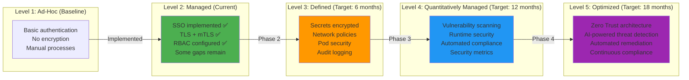

# Security Roadmap: Current State and Future Enhancements

**Version**: 1.0
**Last Updated**: 2025-11-12
**Status**: Production Ready
**Audience**: Platform Engineers, Security Engineers, Management

Complete security roadmap for the Kagenti platform, documenting current security posture and planned enhancements across encryption, authentication, authorization, secrets management, and compliance.

---

## Table of Contents

- [Overview](#overview)
- [Current Security Posture](#current-security-posture)
- [Security Maturity Model](#security-maturity-model)
- [Phase 1: Foundation (Current)](#phase-1-foundation-current)
- [Phase 2: Hardening (Short-term)](#phase-2-hardening-short-term)
- [Phase 3: Advanced Security (Medium-term)](#phase-3-advanced-security-medium-term)
- [Phase 4: Compliance & Audit (Long-term)](#phase-4-compliance--audit-long-term)
- [Risk Assessment](#risk-assessment)
- [Security Testing Plan](#security-testing-plan)
- [Compliance Requirements](#compliance-requirements)
- [Next Steps](#next-steps)
- [References](#references)

---

## Overview

**Purpose**: Provide a clear roadmap for evolving the Kagenti platform's security posture from development-ready to production-hardened, compliant infrastructure.

**What You Get**:
- ✅ Current security state assessment
- ✅ Prioritized enhancement roadmap
- ✅ Risk analysis and mitigation strategies
- ✅ Compliance mapping (SOC 2, GDPR, HIPAA)
- ✅ Implementation timelines and effort estimates
- ✅ Security testing and validation procedures

**Key Principle**: **Security-first architecture** with defense-in-depth approach, balancing security, usability, and operational overhead.

**Source**: Based on [NIST Cybersecurity Framework](https://www.nist.gov/cyberframework), [CIS Kubernetes Benchmark](https://www.cisecurity.org/benchmark/kubernetes)

---

## Current Security Posture

### Security Controls Implemented ✅

**Encryption (Layer 1-2)**:
- ✅ **TLS 1.3 for external traffic** (Gateway API + cert-manager)
- ✅ **Automatic HTTP→HTTPS redirect** (HTTPRoute filters)
- ✅ **Istio mTLS STRICT mode** for all pod-to-pod communication
- ✅ **Automatic certificate rotation** (Istio CA every 12 hours)

**Authentication (Layer 3)**:
- ✅ **Keycloak SSO** with OIDC/OAuth2
- ✅ **Dual-realm architecture** (kubernetes + kagenti realms)
- ✅ **OAuth2-Proxy** for services without native auth
- ✅ **Session management** with encrypted cookies

**Authorization (Layer 4)**:
- ✅ **Kubernetes RBAC** for API access control
- ✅ **Istio AuthorizationPolicy** for service mesh security
- ✅ **Keycloak groups/roles** for user permissions
- ✅ **Namespace isolation** (team1, team2 namespaces)

**Infrastructure Security (Layer 5)**:
- ✅ **Service mesh isolation** (Istio ambient mode)
- ✅ **Gateway API** for ingress control
- ✅ **MetalLB LoadBalancer** with IP restrictions

**Source**: [Kagenti Architecture Overview](../00-getting-started/architecture-overview.md#security-architecture)

---

### Security Gaps 🔴

**Critical Gaps**:
1. ❌ **No secrets encryption at rest** (Kubernetes Secrets are base64-encoded, NOT encrypted)
2. ❌ **No secret rotation policy** (secrets never expire)
3. ❌ **No network policies** (all pods can talk to each other within namespace)
4. ❌ **No pod security standards** enforced (pods can run as root)
5. ❌ **No audit logging** (no visibility into who accessed what)

**High Priority Gaps**:
6. ⚠️ **Self-signed certificates** in development (not trusted by browsers)
7. ⚠️ **No vulnerability scanning** of container images
8. ⚠️ **No runtime security** (no detection of malicious behavior)
9. ⚠️ **No secrets in Git** policy enforcement (developers could commit secrets)
10. ⚠️ **No disaster recovery** plan for security incidents

**Medium Priority Gaps**:
11. ⚠️ **No multi-factor authentication** (MFA) for Keycloak
12. ⚠️ **No rate limiting** on API endpoints
13. ⚠️ **No DDoS protection** for external services
14. ⚠️ **No data classification** (no differentiation between sensitive/public data)
15. ⚠️ **No encryption for persistent volumes** (data-at-rest in PVs)

---

## Security Maturity Model



**Current State**: **Level 2 (Managed)** - Strong foundation, but critical gaps remain

**Target State**: **Level 4 (Quantitatively Managed)** within 12 months

**Source**: [NIST Cybersecurity Framework](https://www.nist.gov/cyberframework)

---

## Phase 1: Foundation (Current)

### Implemented Features ✅

**Timeline**: Completed (Current State)

#### 1.1: TLS/mTLS Encryption ✅
- Gateway API TLS termination with cert-manager
- Istio mTLS STRICT mode for service mesh
- Automatic certificate rotation

**Status**: ✅ **COMPLETE**

**Source**: [Encryption Guide](./encryption.md)

---

#### 1.2: SSO Authentication ✅
- Keycloak OIDC/OAuth2 provider
- Dual-realm architecture (kubernetes + kagenti)
- OAuth2-Proxy for service-level authentication

**Status**: ✅ **COMPLETE**

**Source**: [Keycloak Guide](../03-authentication/keycloak.md)

---

#### 1.3: RBAC Authorization ✅
- Kubernetes RBAC for API access
- Istio AuthorizationPolicy for service mesh
- Keycloak groups/roles

**Status**: ✅ **COMPLETE**

**Source**: [Architecture Overview](../00-getting-started/architecture-overview.md#authorization)

---

## Phase 2: Hardening (Short-term)

### Timeline: 3-6 months
### Effort: 2-3 person-months

#### 2.1: Secrets Encryption at Rest

**Problem**: Kubernetes Secrets are base64-encoded (NOT encrypted) in etcd by default.

**Solution**: Enable etcd encryption + Sealed Secrets for Git

**Implementation**:

1. **Enable etcd Encryption** (Kubernetes):
   ```yaml
   # /etc/kubernetes/encryption-config.yaml
   apiVersion: apiserver.config.k8s.io/v1
   kind: EncryptionConfiguration
   resources:
   - resources:
     - secrets
     providers:
     - aescbc:
         keys:
         - name: key1
           secret: <BASE64_ENCODED_32_BYTE_KEY>
     - identity: {}  # Fallback
   ```

2. **Deploy Sealed Secrets**:
   ```bash
   kubectl apply -f https://github.com/bitnami-labs/sealed-secrets/releases/download/v0.24.0/controller.yaml
   ```

3. **Migrate Existing Secrets**:
   ```bash
   # For each secret, encrypt and replace
   kubectl get secret my-secret -o yaml | kubeseal -o yaml > sealed-secret.yaml
   kubectl delete secret my-secret
   kubectl apply -f sealed-secret.yaml
   ```

**Validation**:
```bash
# Verify secrets are encrypted in etcd
ETCDCTL_API=3 etcdctl get /registry/secrets/default/test-secret
# Expected: Binary data (encrypted)
```

**Priority**: 🔴 **CRITICAL**
**Effort**: 2 weeks
**Risk Mitigation**: Prevents secret exposure if etcd backup is compromised

**Source**: [Sealed Secrets GitHub](https://github.com/bitnami-labs/sealed-secrets)

---

#### 2.2: Network Policies

**Problem**: All pods within a namespace can communicate freely.

**Solution**: Implement NetworkPolicies with default-deny

**Implementation**:

1. **Default Deny All**:
   ```yaml
   apiVersion: networking.k8s.io/v1
   kind: NetworkPolicy
   metadata:
     name: default-deny-all
     namespace: team1
   spec:
     podSelector: {}
     policyTypes:
     - Ingress
     - Egress
   ```

2. **Allow Specific Traffic**:
   ```yaml
   apiVersion: networking.k8s.io/v1
   kind: NetworkPolicy
   metadata:
     name: research-agent-policy
     namespace: team1
   spec:
     podSelector:
       matchLabels:
         app: research-agent
     policyTypes:
     - Ingress
     - Egress
     ingress:
     - from:
       - podSelector:
           matchLabels:
             app: orchestrator-agent
     egress:
     - to:
       - namespaceSelector:
           matchLabels:
             name: keycloak
       ports:
       - protocol: TCP
         port: 8080
     - to:
       - namespaceSelector:
           matchLabels:
             name: observability
       ports:
       - protocol: TCP
         port: 4317  # OTLP
   ```

**Priority**: 🔴 **CRITICAL**
**Effort**: 3 weeks
**Risk Mitigation**: Limits lateral movement in case of pod compromise

**Source**: [Kubernetes Network Policies](https://kubernetes.io/docs/concepts/services-networking/network-policies/)

---

#### 2.3: Pod Security Standards

**Problem**: Pods can run as root, use privileged containers, mount host paths.

**Solution**: Enforce Pod Security Standards (restricted mode)

**Implementation**:

1. **Enable Pod Security Admission** (Kubernetes 1.25+):
   ```yaml
   apiVersion: v1
   kind: Namespace
   metadata:
     name: team1
     labels:
       pod-security.kubernetes.io/enforce: restricted
       pod-security.kubernetes.io/audit: restricted
       pod-security.kubernetes.io/warn: restricted
   ```

2. **Update Pod Specs**:
   ```yaml
   apiVersion: v1
   kind: Pod
   metadata:
     name: research-agent
   spec:
     securityContext:
       runAsNonRoot: true
       runAsUser: 1000
       fsGroup: 1000
       seccompProfile:
         type: RuntimeDefault
     containers:
     - name: agent
       securityContext:
         allowPrivilegeEscalation: false
         capabilities:
           drop:
           - ALL
         readOnlyRootFilesystem: true
   ```

**Priority**: 🔴 **CRITICAL**
**Effort**: 4 weeks (update all deployments)
**Risk Mitigation**: Prevents container breakout attacks

**Source**: [Kubernetes Pod Security Standards](https://kubernetes.io/docs/concepts/security/pod-security-standards/)

---

#### 2.4: Audit Logging

**Problem**: No visibility into API access, security events, or suspicious activity.

**Solution**: Enable Kubernetes audit logging + centralized logging

**Implementation**:

1. **Enable Audit Logging**:
   ```yaml
   # /etc/kubernetes/audit-policy.yaml
   apiVersion: audit.k8s.io/v1
   kind: Policy
   rules:
   # Log all requests to secrets
   - level: RequestResponse
     resources:
     - group: ""
       resources: ["secrets"]

   # Log all authentication events
   - level: Metadata
     omitStages:
     - RequestReceived
     userGroups:
     - system:authenticated

   # Log all RBAC changes
   - level: RequestResponse
     verbs: ["create", "update", "patch", "delete"]
     resources:
     - group: "rbac.authorization.k8s.io"
   ```

2. **Ship Logs to Loki**:
   ```yaml
   # Promtail DaemonSet to collect audit logs
   apiVersion: apps/v1
   kind: DaemonSet
   metadata:
     name: promtail-audit
   spec:
     template:
       spec:
         containers:
         - name: promtail
           args:
           - -config.file=/etc/promtail/promtail.yaml
           volumeMounts:
           - name: audit-logs
             mountPath: /var/log/kubernetes/audit
         volumes:
         - name: audit-logs
           hostPath:
             path: /var/log/kubernetes/audit
   ```

**Priority**: 🟠 **HIGH**
**Effort**: 2 weeks
**Risk Mitigation**: Enables detection and investigation of security incidents

**Source**: [Kubernetes Auditing](https://kubernetes.io/docs/tasks/debug/debug-cluster/audit/)

---

#### 2.5: Secret Rotation Policy

**Problem**: Secrets never expire, increasing risk if compromised.

**Solution**: Implement automated secret rotation

**Implementation**:

1. **Keycloak Client Secret Rotation**:
   ```bash
   #!/bin/bash
   # Rotate Keycloak client secrets every 90 days

   # Generate new secret
   NEW_SECRET=$(openssl rand -base64 32)

   # Update Keycloak client
   kubectl exec -n keycloak deploy/keycloak -- \
     /opt/keycloak/bin/kcadm.sh update clients/$CLIENT_ID \
     -r kubernetes \
     -s "secret=$NEW_SECRET"

   # Update Kubernetes secret
   kubectl create secret generic keycloak-client-secret \
     --from-literal=client-secret=$NEW_SECRET \
     -n oauth2-proxy \
     --dry-run=client -o yaml | kubectl apply -f -

   # Restart OAuth2-Proxy pods
   kubectl rollout restart deployment -n oauth2-proxy
   ```

2. **Automate with CronJob**:
   ```yaml
   apiVersion: batch/v1
   kind: CronJob
   metadata:
     name: secret-rotation
   spec:
     schedule: "0 0 1 */3 *"  # Every 3 months
     jobTemplate:
       spec:
         template:
           spec:
             containers:
             - name: rotate
               image: bitnami/kubectl
               command: ["/rotate-secrets.sh"]
   ```

**Priority**: 🟠 **HIGH**
**Effort**: 3 weeks
**Risk Mitigation**: Limits impact of compromised secrets

**Source**: [CIS Benchmark Secret Rotation](https://www.cisecurity.org/benchmark/kubernetes)

---

## Phase 3: Advanced Security (Medium-term)

### Timeline: 6-12 months
### Effort: 4-6 person-months

#### 3.1: Container Image Scanning

**Solution**: Integrate Trivy for vulnerability scanning

**Implementation**:
```yaml
# Tekton Pipeline with Trivy scan
apiVersion: tekton.dev/v1
kind: Pipeline
metadata:
  name: agent-build-scan
spec:
  tasks:
  - name: build-image
    taskRef:
      name: kaniko

  - name: scan-image
    runAfter: [build-image]
    taskRef:
      name: trivy-scan
    params:
    - name: IMAGE
      value: $(tasks.build-image.results.IMAGE_URL)
    - name: SEVERITY
      value: "CRITICAL,HIGH"
```

**Priority**: 🟠 **HIGH**
**Effort**: 2 weeks

**Source**: [Trivy GitHub](https://github.com/aquasecurity/trivy)

---

#### 3.2: Runtime Security (Falco)

**Solution**: Deploy Falco for runtime threat detection

**Implementation**:
```yaml
# Falco DaemonSet
apiVersion: apps/v1
kind: DaemonSet
metadata:
  name: falco
spec:
  template:
    spec:
      containers:
      - name: falco
        image: falcosecurity/falco:latest
        securityContext:
          privileged: true
```

**Detects**:
- Shells spawned in containers
- Unexpected network connections
- File modifications in /etc
- Privilege escalation attempts

**Priority**: 🟡 **MEDIUM**
**Effort**: 3 weeks

**Source**: [Falco Documentation](https://falco.org/docs/)

---

#### 3.3: Multi-Factor Authentication (MFA)

**Solution**: Enable MFA in Keycloak

**Implementation**:
```yaml
# Keycloak realm configuration
{
  "realm": "kubernetes",
  "otpPolicyType": "totp",
  "otpPolicyAlgorithm": "HmacSHA1",
  "otpPolicyDigits": 6,
  "otpPolicyPeriod": 30,
  "requiredActions": ["CONFIGURE_TOTP"]
}
```

**Priority**: 🟡 **MEDIUM**
**Effort**: 1 week

**Source**: [Keycloak MFA](https://www.keycloak.org/docs/latest/server_admin/#otp-policies)

---

#### 3.4: Rate Limiting

**Solution**: Implement rate limiting via Istio EnvoyFilter

**Implementation**:
```yaml
apiVersion: networking.istio.io/v1alpha3
kind: EnvoyFilter
metadata:
  name: ratelimit
spec:
  configPatches:
  - applyTo: HTTP_FILTER
    match:
      context: GATEWAY
    patch:
      operation: INSERT_BEFORE
      value:
        name: envoy.filters.http.local_ratelimit
        typed_config:
          "@type": type.googleapis.com/envoy.extensions.filters.http.local_ratelimit.v3.LocalRateLimit
          stat_prefix: http_local_rate_limiter
          token_bucket:
            max_tokens: 100
            tokens_per_fill: 100
            fill_interval: 1s
```

**Priority**: 🟡 **MEDIUM**
**Effort**: 2 weeks

**Source**: [Istio Rate Limiting](https://istio.io/latest/docs/tasks/policy-enforcement/rate-limit/)

---

## Phase 4: Compliance & Audit (Long-term)

### Timeline: 12-18 months
### Effort**: 6-12 person-months

#### 4.1: SOC 2 Compliance

**Requirements**:
- ✅ Encryption at rest and in transit
- ✅ Access control (RBAC)
- ✅ Audit logging
- ⏳ Automated compliance scanning
- ⏳ Incident response plan
- ⏳ Annual penetration testing

**Tools**:
- **Compliance-as-Code**: Open Policy Agent (OPA)
- **Continuous Compliance**: Kyverno policies
- **Audit Reporting**: Automated report generation

**Effort**: 6 months
**Source**: [SOC 2 Requirements](https://www.aicpa.org/soc)

---

#### 4.2: GDPR Compliance

**Requirements**:
- ✅ Data encryption
- ⏳ Data classification (PII identification)
- ⏳ Right to erasure (data deletion)
- ⏳ Data portability
- ⏳ Consent management

**Implementation**:
- Label PII-containing pods/services
- Implement data retention policies
- Create data export APIs

**Effort**: 4 months
**Source**: [GDPR Requirements](https://gdpr.eu/)

---

#### 4.3: HIPAA Compliance (if handling health data)

**Requirements**:
- ✅ Encryption (PHI protected)
- ✅ Access control
- ✅ Audit logging
- ⏳ Business Associate Agreements (BAAs)
- ⏳ Disaster recovery (< 24h RTO)
- ⏳ Annual risk assessments

**Effort**: 8 months
**Source**: [HIPAA Security Rule](https://www.hhs.gov/hipaa/for-professionals/security/)

---

## Risk Assessment

### Critical Risks 🔴

| Risk | Likelihood | Impact | Mitigation | Timeline |
|------|------------|--------|------------|----------|
| **Secrets exposed in etcd backup** | High | Critical | Enable etcd encryption | Phase 2 (3 months) |
| **Lateral movement after pod compromise** | Medium | High | Implement NetworkPolicies | Phase 2 (4 months) |
| **Container breakout** | Low | Critical | Enforce Pod Security Standards | Phase 2 (4 months) |
| **No visibility into security events** | High | High | Enable audit logging | Phase 2 (2 months) |

### High Risks 🟠

| Risk | Likelihood | Impact | Mitigation | Timeline |
|------|------------|--------|------------|----------|
| **Vulnerable container images** | High | Medium | Deploy Trivy scanning | Phase 3 (8 months) |
| **Runtime attacks** | Medium | High | Deploy Falco | Phase 3 (9 months) |
| **Brute force attacks** | Medium | Medium | Implement MFA + rate limiting | Phase 3 (10 months) |

---

## Security Testing Plan

### Automated Testing

**Daily**:
- ✅ Container image scanning (Trivy)
- ✅ Secret scanning in Git (git-secrets)
- ✅ Compliance policy checks (OPA/Kyverno)

**Weekly**:
- ⏳ Vulnerability scanning of running pods
- ⏳ Network policy verification
- ⏳ Certificate expiry checks

**Monthly**:
- ⏳ Penetration testing (automated)
- ⏳ Security audit report generation

**Quarterly**:
- ⏳ Manual penetration testing
- ⏳ Compliance audit (SOC 2, GDPR)
- ⏳ Security training for team

---

### Manual Testing

**Pre-Production**:
```bash
# Test network policies
kubectl run test-pod --image=busybox --rm -it -- sh
wget http://research-agent.team1  # Should fail

# Test pod security
kubectl run privileged-pod --image=busybox --privileged=true  # Should fail

# Test mTLS
istioctl authn tls-check  # All services should show STRICT

# Test secret encryption
ETCDCTL_API=3 etcdctl get /registry/secrets/default/test  # Should be encrypted
```

---

## Compliance Requirements

### Compliance Matrix

| Control | SOC 2 | GDPR | HIPAA | Current State | Target Phase |
|---------|-------|------|-------|---------------|--------------|
| **Encryption at rest** | Required | Required | Required | ⏳ Partial | Phase 2 |
| **Encryption in transit** | Required | Required | Required | ✅ Complete | Phase 1 |
| **Access control** | Required | Required | Required | ✅ Complete | Phase 1 |
| **Audit logging** | Required | Required | Required | ❌ Missing | Phase 2 |
| **MFA** | Recommended | Required | Required | ❌ Missing | Phase 3 |
| **Vulnerability scanning** | Required | Recommended | Required | ❌ Missing | Phase 3 |
| **Incident response** | Required | Required | Required | ❌ Missing | Phase 4 |
| **Annual pen testing** | Required | Recommended | Required | ❌ Missing | Phase 4 |

---

## Next Steps

### Immediate Actions (Next 30 Days)

1. **Enable etcd encryption** (Week 1-2)
2. **Deploy Sealed Secrets** (Week 2-3)
3. **Create NetworkPolicy templates** (Week 3-4)

### Short-term (3 months)

1. **Implement NetworkPolicies** for all namespaces
2. **Enforce Pod Security Standards**
3. **Enable audit logging**
4. **Create secret rotation CronJobs**

### Medium-term (6-12 months)

1. **Deploy Trivy for image scanning**
2. **Deploy Falco for runtime security**
3. **Implement MFA in Keycloak**
4. **Add rate limiting**

### Long-term (12-18 months)

1. **Achieve SOC 2 compliance**
2. **Implement GDPR compliance** (if EU users)
3. **Annual penetration testing**
4. **Automated compliance reporting**

---

## References

### Security Standards

- **NIST Cybersecurity Framework**: [nist.gov/cyberframework](https://www.nist.gov/cyberframework)
- **CIS Kubernetes Benchmark**: [cisecurity.org/benchmark/kubernetes](https://www.cisecurity.org/benchmark/kubernetes)
- **OWASP Top 10**: [owasp.org/www-project-top-ten](https://owasp.org/www-project-top-ten/)

### Compliance

- **SOC 2**: [aicpa.org/soc](https://www.aicpa.org/soc)
- **GDPR**: [gdpr.eu](https://gdpr.eu/)
- **HIPAA**: [hhs.gov/hipaa](https://www.hhs.gov/hipaa/)

### Tools

- **Sealed Secrets**: [github.com/bitnami-labs/sealed-secrets](https://github.com/bitnami-labs/sealed-secrets)
- **Trivy**: [github.com/aquasecurity/trivy](https://github.com/aquasecurity/trivy)
- **Falco**: [falco.org](https://falco.org/)
- **OPA**: [openpolicyagent.org](https://www.openpolicyagent.org/)

### Internal Documentation

- **Main README**: [../../README.md](../../README.md)
- **Architecture Overview**: [../00-getting-started/architecture-overview.md](../00-getting-started/architecture-overview.md)
- **Encryption Guide**: [./encryption.md](./encryption.md)
- **Secrets Management**: [./secrets-management.md](./secrets-management.md) *(coming soon)*

### Repository

- **GitHub**: [Ladas/kagenti-demo-deployment](https://github.com/Ladas/kagenti-demo-deployment)
- **Security Configuration**: `components/08-security/`

---

**Last Updated**: 2025-11-12
**Document Version**: 1.0
**Maintained By**: Platform Engineering Team
**License**: Apache 2.0
