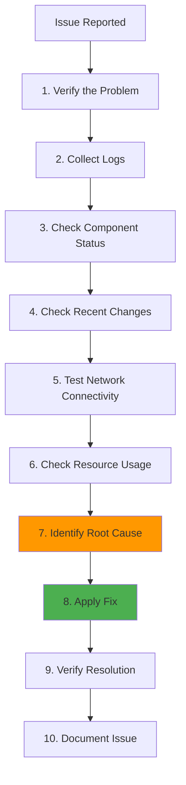

# Troubleshooting: Platform-Wide Issue Resolution

**Version**: 1.0
**Last Updated**: 2025-11-12
**Status**: Production Ready
**Audience**: SRE, Platform Engineers, DevOps Engineers

Comprehensive troubleshooting guide for the Kagenti AI Agent Platform, covering common issues across all components with diagnosis commands, root cause analysis, and resolution steps.

---

## Table of Contents

- [Overview](#overview)
- [General Troubleshooting Workflow](#general-troubleshooting-workflow)
- [Infrastructure Issues](#infrastructure-issues)
- [Platform Components](#platform-components)
- [Observability Stack](#observability-stack)
- [Security Components](#security-components)
- [Network and Connectivity](#network-and-connectivity)
- [Performance Issues](#performance-issues)
- [Data Persistence](#data-persistence)
- [Emergency Procedures](#emergency-procedures)
- [Diagnostic Tools](#diagnostic-tools)
- [References](#references)

---

## Overview

**Purpose**: Provide systematic troubleshooting procedures for all Kagenti platform components.

**What You Get**:
- ✅ General troubleshooting workflow
- ✅ Component-specific issue resolution
- ✅ Common error patterns and fixes
- ✅ Diagnostic commands and tools
- ✅ Emergency recovery procedures
- ✅ Performance optimization guides

**Key Principle**: **Systematic diagnosis before action**. Always gather logs, check status, and understand root cause before making changes.

**Source**: Based on [Kubernetes Troubleshooting](https://kubernetes.io/docs/tasks/debug/), [Istio Troubleshooting](https://istio.io/latest/docs/ops/diagnostic-tools/)

---

## General Troubleshooting Workflow

### Step-by-Step Diagnosis



### 1. Verify the Problem

**Ask**:
- What is the expected behavior?
- What is the actual behavior?
- When did it start?
- Has anything changed recently?

```bash
# Get overall cluster health
kubectl get nodes
kubectl get pods --all-namespaces | grep -v Running

# Check recent events
kubectl get events --all-namespaces --sort-by='.lastTimestamp' | tail -20
```

---

### 2. Collect Logs

**Pod logs**:

```bash
# Current logs
kubectl logs -n team1 deploy/research-agent

# Previous container logs (if crashed)
kubectl logs -n team1 deploy/research-agent --previous

# All containers in pod
kubectl logs -n team1 deploy/research-agent --all-containers

# Follow logs in real-time
kubectl logs -n team1 deploy/research-agent -f

# Last 100 lines
kubectl logs -n team1 deploy/research-agent --tail=100
```

**Istio sidecar logs**:

```bash
# Envoy proxy logs
kubectl logs -n team1 deploy/research-agent -c istio-proxy

# Pilot agent logs
kubectl logs -n istio-system deploy/istiod
```

---

### 3. Check Component Status

```bash
# Pod status
kubectl get pod -n team1 research-agent-xxx -o yaml

# Deployment status
kubectl describe deploy -n team1 research-agent

# Check conditions
kubectl get pod research-agent-xxx -o jsonpath='{.status.conditions[*].message}'

# Check resource quotas
kubectl describe quota -n team1
```

---

### 4. Check Recent Changes

```bash
# Recent deployments
kubectl rollout history deploy/research-agent -n team1

# Recent ConfigMap/Secret changes
kubectl get cm,secret -n team1 -o jsonpath='{range .items[*]}{.metadata.name}{"\t"}{.metadata.resourceVersion}{"\n"}{end}'

# ArgoCD sync status
argocd app get team1-agents

# Git commits (if GitOps)
git log --oneline --since="24 hours ago"
```

---

### 5. Test Network Connectivity

```bash
# DNS resolution
kubectl run -it --rm debug --image=busybox --restart=Never -- nslookup kubernetes.default

# Service connectivity
kubectl run -it --rm debug --image=curlimages/curl --restart=Never -- \
  curl http://service-name.namespace.svc.cluster.local

# External connectivity
kubectl run -it --rm debug --image=curlimages/curl --restart=Never -- \
  curl https://www.google.com
```

---

### 6. Check Resource Usage

```bash
# Node resources
kubectl top nodes

# Pod resources
kubectl top pods -n team1

# Resource requests vs limits
kubectl describe pod -n team1 research-agent-xxx | grep -A 5 "Requests\|Limits"
```

---

## Infrastructure Issues

### Issue: Pods Stuck in Pending

**Symptoms**: Pod shows `Pending` state indefinitely.

**Diagnosis**:

```bash
# Check pod events
kubectl describe pod -n team1 research-agent-xxx

# Common errors:
# - "Insufficient cpu"
# - "Insufficient memory"
# - "No nodes match pod topology spread constraints"
```

**Root Causes**:

1. **Insufficient Resources**:

```bash
# Check node capacity
kubectl describe nodes | grep -A 5 "Allocated resources"

# Expected: CPU/Memory available > pod requests
```

**Fix**:

```bash
# Option 1: Add more nodes (production)
# Option 2: Reduce pod resource requests (dev)
kubectl patch deploy research-agent -n team1 -p '{
  "spec": {
    "template": {
      "spec": {
        "containers": [{
          "name": "agent",
          "resources": {
            "requests": {
              "cpu": "100m",
              "memory": "256Mi"
            }
          }
        }]
      }
    }
  }
}'
```

2. **PersistentVolumeClaim Pending**:

```bash
# Check PVC status
kubectl get pvc -n team1

# Check StorageClass
kubectl get storageclass

# Expected: Available storage class with provisioner
```

**Fix**:

```bash
# For Kind: Install local-path provisioner
kubectl apply -f https://raw.githubusercontent.com/rancher/local-path-provisioner/master/deploy/local-path-storage.yaml
```

---

### Issue: Pods in CrashLoopBackOff

**Symptoms**: Pod repeatedly crashes and restarts.

**Diagnosis**:

```bash
# Check logs from crashed container
kubectl logs -n team1 research-agent-xxx --previous

# Check exit code
kubectl get pod -n team1 research-agent-xxx -o jsonpath='{.status.containerStatuses[0].lastState.terminated.exitCode}'

# Common exit codes:
# - 137: OOM killed
# - 143: SIGTERM (graceful shutdown)
# - 1: Application error
```

**Root Causes**:

1. **Out of Memory (OOM)**:

```bash
# Check memory limits
kubectl describe pod -n team1 research-agent-xxx | grep -i memory

# Check for OOM kills
kubectl describe pod -n team1 research-agent-xxx | grep -i oom
```

**Fix**:

```bash
# Increase memory limit
kubectl patch deploy research-agent -n team1 -p '{
  "spec": {
    "template": {
      "spec": {
        "containers": [{
          "name": "agent",
          "resources": {
            "limits": {
              "memory": "1Gi"
            }
          }
        }]
      }
    }
  }
}'
```

2. **Application Error**:

```bash
# Check application logs for errors
kubectl logs -n team1 research-agent-xxx --previous | grep -i error

# Common errors:
# - "connection refused" (database not ready)
# - "permission denied" (RBAC/SecurityContext)
# - "import error" (missing dependencies)
```

**Fix** (depends on error):

```bash
# Wait for dependencies (database, Keycloak, etc.)
# Check init containers or readiness probes

# For import errors, rebuild image with dependencies
```

---

### Issue: ImagePullBackOff

**Symptoms**: Pod cannot pull container image.

**Diagnosis**:

```bash
# Check image pull error
kubectl describe pod -n team1 research-agent-xxx | grep -A 5 "Failed"

# Common errors:
# - "manifest unknown" (image doesn't exist)
# - "unauthorized" (auth required)
# - "pull rate limit exceeded" (Docker Hub limit)
```

**Fix**:

1. **Image doesn't exist**:

```bash
# Verify image exists
docker pull ghcr.io/kagenti/research-agent:latest

# If using local registry:
kind load docker-image research-agent:v0.0.1 --name kagenti
```

2. **Authentication required**:

```bash
# Create image pull secret
kubectl create secret docker-registry ghcr-secret \
  --docker-server=ghcr.io \
  --docker-username=USERNAME \
  --docker-password=TOKEN \
  -n team1

# Patch ServiceAccount
kubectl patch serviceaccount default -n team1 -p '{
  "imagePullSecrets": [{"name": "ghcr-secret"}]
}'
```

---

## Platform Components

### Keycloak Issues

#### Issue: Keycloak Realm Import Failed

**Symptoms**: `keycloak-realm-import` job failed.

**Diagnosis**:

```bash
# Check job status
kubectl get job -n keycloak keycloak-realm-import

# Check job logs
kubectl logs -n keycloak job/keycloak-realm-import

# Common errors:
# - "Realm already exists"
# - "Invalid JSON"
# - "Connection refused" (Keycloak not ready)
```

**Fix**:

```bash
# Delete and re-run job
kubectl delete job -n keycloak keycloak-realm-import

# Wait for Keycloak to be ready
kubectl wait --for=condition=available deploy/keycloak -n keycloak --timeout=120s

# Re-apply job
kubectl apply -f components/01-platform/keycloak/jobs/realm-import.yaml
```

#### Issue: OAuth2-Proxy 401 Unauthorized

**Symptoms**: Users get "401 Unauthorized" when accessing Grafana/Kiali.

**Diagnosis**:

```bash
# Check OAuth2-Proxy logs
kubectl logs -n oauth2-proxy deploy/oauth2-proxy-grafana | grep -i error

# Common errors:
# - "invalid client credentials"
# - "invalid_grant"
# - "token endpoint not reachable"
```

**Fix**:

1. **Client credentials mismatch**:

```bash
# Verify client secret matches
kubectl get secret keycloak-client-secret -n oauth2-proxy -o jsonpath='{.data.client-secret}' | base64 -d

# Re-sync secret from Keycloak config job
kubectl delete job -n keycloak keycloak-config
kubectl apply -f components/01-platform/keycloak/jobs/config.yaml
```

2. **Keycloak not reachable**:

```bash
# Test connectivity from OAuth2-Proxy pod
kubectl exec -n oauth2-proxy deploy/oauth2-proxy-grafana -- \
  curl -I http://keycloak.keycloak.svc.cluster.local:8080

# Check NetworkPolicy (if enabled)
kubectl get networkpolicy -n oauth2-proxy
kubectl get networkpolicy -n keycloak
```

---

### ArgoCD Issues

#### Issue: Application OutOfSync

**Symptoms**: ArgoCD shows application as "OutOfSync".

**Diagnosis**:

```bash
# Check diff
argocd app diff infrastructure

# Check sync status
argocd app get infrastructure

# Common causes:
# - Manual kubectl apply (drift)
# - Git branch mismatch
# - Kustomize build error
```

**Fix**:

```bash
# Option 1: Sync from Git (if Git is source of truth)
argocd app sync infrastructure --prune

# Option 2: Update Git to match cluster (if manual change was intentional)
# Edit manifests in Git, commit, push
```

#### Issue: Application Stuck in Progressing

**Symptoms**: ArgoCD shows "Progressing" indefinitely.

**Diagnosis**:

```bash
# Check resource health
argocd app get infrastructure --show-operation

# Check pod status
kubectl get pods -n namespace | grep -v Running

# Common causes:
# - Deployment rollout stuck
# - PVC pending
# - Image pull error
```

**Fix**:

```bash
# Force refresh
argocd app refresh infrastructure

# If deployment stuck, check events
kubectl describe deploy -n namespace deployment-name
```

---

## Observability Stack

### Prometheus Issues

#### Issue: No Metrics Scraped

**Symptoms**: Prometheus shows "0 up" targets.

**Diagnosis**:

```bash
# Check ServiceMonitor
kubectl get servicemonitor -n observability

# Check Prometheus operator logs
kubectl logs -n observability deploy/prometheus-operator

# Check Prometheus targets
# Open Prometheus UI: http://localhost:9090/targets
kubectl port-forward -n observability svc/prometheus 9090:9090
```

**Fix**:

1. **ServiceMonitor selector mismatch**:

```yaml
# Prometheus ServiceMonitorSelector
kubectl get prometheus -n observability -o yaml | grep -A 5 serviceMonitorSelector

# ServiceMonitor labels
kubectl get servicemonitor -n observability grafana -o yaml | grep -A 5 labels

# Ensure labels match
```

2. **Metrics endpoint not exposing**:

```bash
# Test metrics endpoint
kubectl exec -n observability deploy/grafana -- \
  curl http://localhost:3000/metrics

# Expected: Prometheus metrics format
```

#### Issue: High Cardinality Metrics

**Symptoms**: Prometheus using excessive memory/storage.

**Diagnosis**:

```bash
# Check series count
kubectl exec -n observability prometheus-xxx -- \
  curl http://localhost:9090/api/v1/status/tsdb | jq '.data.seriesCountByMetricName'

# Check top cardinality metrics
```

**Fix**:

```yaml
# Add metric relabeling to drop high-cardinality labels
apiVersion: monitoring.coreos.com/v1
kind: ServiceMonitor
metadata:
  name: grafana
spec:
  endpoints:
  - port: web
    metricRelabelings:
    - action: labeldrop
      regex: instance|pod  # Drop high-cardinality labels
```

---

### Grafana Issues

#### Issue: Datasource Connection Failed

**Symptoms**: Grafana cannot connect to Prometheus/Tempo.

**Diagnosis**:

```bash
# Check Grafana datasource config
kubectl get cm -n observability grafana-datasources -o yaml

# Test connectivity from Grafana pod
kubectl exec -n observability deploy/grafana -- \
  curl http://prometheus.observability.svc.cluster.local:9090/-/healthy
```

**Fix**:

```bash
# Verify service names match datasource config
kubectl get svc -n observability

# If using FQDN, ensure DNS works
kubectl exec -n observability deploy/grafana -- \
  nslookup prometheus.observability.svc.cluster.local
```

---

### Tempo/Tracing Issues

#### Issue: No Traces Appearing

**Symptoms**: No traces in Tempo/Phoenix UI.

**Diagnosis**:

```bash
# Check OTEL Collector logs
kubectl logs -n observability deploy/otel-collector | grep -i error

# Check trace ingestion endpoint
kubectl exec -n team1 deploy/research-agent -- \
  curl -I http://otel-collector.observability.svc.cluster.local:4317

# Check if spans are being generated
kubectl logs -n team1 deploy/research-agent | grep -i span
```

**Fix**:

1. **OTEL Collector not receiving**:

```bash
# Check OTEL Collector receivers config
kubectl get cm -n observability otel-collector-config -o yaml | grep -A 10 receivers

# Ensure OTLP receiver enabled on port 4317
```

2. **Application not instrumented**:

```python
# Verify OpenTelemetry instrumentation in application
from opentelemetry import trace
from opentelemetry.exporter.otlp.proto.grpc.trace_exporter import OTLPSpanExporter
from opentelemetry.sdk.trace import TracerProvider
from opentelemetry.sdk.trace.export import BatchSpanProcessor

# Set up tracing
provider = TracerProvider()
processor = BatchSpanProcessor(OTLPSpanExporter(
    endpoint="http://otel-collector.observability.svc.cluster.local:4317",
    insecure=True
))
provider.add_span_processor(processor)
trace.set_tracer_provider(provider)
```

---

## Security Components

### Certificate Issues

#### Issue: Certificate Expired

**Symptoms**: HTTPS services return certificate errors.

**Diagnosis**:

```bash
# Check certificate expiry
kubectl get certificate -n default wildcard-localtest-me -o yaml | grep -A 5 status

# Check cert-manager logs
kubectl logs -n cert-manager deploy/cert-manager
```

**Fix**:

```bash
# Force renewal
kubectl delete secret -n default wildcard-tls

# Wait for cert-manager to recreate
kubectl wait --for=condition=Ready certificate/wildcard-localtest-me -n default --timeout=120s
```

#### Issue: mTLS Connection Failed

**Symptoms**: Services cannot communicate, TLS errors in logs.

**Diagnosis**:

```bash
# Check mTLS status
istioctl authn tls-check -n team1 research-agent.team1.svc.cluster.local

# Check PeerAuthentication policy
kubectl get peerauthentication -A
```

**Fix**:

```bash
# Restart pods to refresh certificates
kubectl rollout restart deploy -n team1

# Check Istio CA health
kubectl logs -n istio-system deploy/istiod | grep -i certificate
```

---

### Secret Issues

#### Issue: SealedSecret Not Decrypting

**Symptoms**: SealedSecret exists, but no Secret created.

**Diagnosis**:

```bash
# Check SealedSecret status
kubectl describe sealedsecret -n team1 db-credentials

# Check Sealed Secrets controller logs
kubectl logs -n kube-system deployment/sealed-secrets-controller
```

**Fix**:

```bash
# Re-encrypt with current controller key
kubectl get secret original-secret -o yaml | \
  kubeseal -o yaml > sealed-secret.yaml

# Apply re-encrypted secret
kubectl apply -f sealed-secret.yaml
```

---

## Network and Connectivity

### NetworkPolicy Issues

#### Issue: Pods Cannot Communicate

**Symptoms**: Connection refused/timeout between pods.

**Diagnosis**:

```bash
# Check NetworkPolicies
kubectl get networkpolicy -n team1

# Test connectivity
kubectl exec -n team1 deploy/research-agent -- \
  nc -zv postgresql.team1.svc.cluster.local 5432
```

**Fix**:

```bash
# Temporarily disable NetworkPolicy for testing
kubectl delete networkpolicy --all -n team1

# If connectivity works, fix NetworkPolicy rules
# Re-apply with correct ingress/egress rules
```

#### Issue: DNS Resolution Failed

**Symptoms**: Pods cannot resolve service names.

**Diagnosis**:

```bash
# Test DNS
kubectl exec -n team1 deploy/research-agent -- \
  nslookup kubernetes.default.svc.cluster.local

# Check CoreDNS status
kubectl get pods -n kube-system -l k8s-app=kube-dns
```

**Fix**:

```bash
# Restart CoreDNS
kubectl rollout restart deploy/coredns -n kube-system

# Check NetworkPolicy allows DNS
kubectl get networkpolicy -n team1 allow-dns -o yaml
```

---

### Istio Issues

#### Issue: Sidecar Injection Failed

**Symptoms**: Pod has no istio-proxy container.

**Diagnosis**:

```bash
# Check namespace label
kubectl get namespace team1 --show-labels | grep istio-injection

# Check pod annotations
kubectl get pod -n team1 research-agent-xxx -o yaml | grep -A 5 annotations
```

**Fix**:

```bash
# Enable sidecar injection on namespace
kubectl label namespace team1 istio-injection=enabled --overwrite

# Restart pods
kubectl rollout restart deploy -n team1
```

#### Issue: 503 Service Unavailable (Istio)

**Symptoms**: Requests fail with 503 from Envoy.

**Diagnosis**:

```bash
# Check Envoy logs
kubectl logs -n team1 research-agent-xxx -c istio-proxy | grep "503\|upstream connect error"

# Common causes:
# - No healthy upstream (all pods down)
# - mTLS mismatch
# - Circuit breaker triggered
```

**Fix**:

```bash
# Check upstream pod health
kubectl get pods -n team1 -l app=target-service

# Check DestinationRule outlier detection
kubectl get destinationrule -A

# Reset circuit breaker
kubectl delete pod -n team1 -l app=source-service
```

---

## Performance Issues

### High CPU Usage

**Diagnosis**:

```bash
# Check CPU usage
kubectl top pods -n team1

# Check CPU limits
kubectl describe pod -n team1 research-agent-xxx | grep -A 5 Limits
```

**Fix**:

```bash
# Increase CPU limits
kubectl patch deploy research-agent -n team1 -p '{
  "spec": {
    "template": {
      "spec": {
        "containers": [{
          "name": "agent",
          "resources": {
            "limits": {
              "cpu": "2"
            }
          }
        }]
      }
    }
  }
}'

# Or scale horizontally
kubectl scale deploy research-agent -n team1 --replicas=3
```

---

### Slow Response Times

**Diagnosis**:

```bash
# Check Grafana dashboards for latency
# Open Grafana: http://grafana.localtest.me:9443

# Check traces in Tempo/Phoenix
# Identify slow spans

# Check database connection pool
kubectl exec -n team1 deploy/orchestrator-agent -- \
  curl http://localhost:8080/metrics | grep db_connections
```

**Fix**:

```bash
# Increase database connection pool
# Update application config

# Add caching layer (Redis)
# Deploy Redis and update application to use cache

# Optimize database queries
# Add indexes, optimize SQL
```

---

## Data Persistence

### PersistentVolumeClaim Issues

#### Issue: PVC Pending

**Symptoms**: PVC shows `Pending` status.

**Diagnosis**:

```bash
# Check PVC events
kubectl describe pvc -n keycloak postgresql-data

# Check StorageClass
kubectl get storageclass
```

**Fix**:

```bash
# For Kind: Use local-path storage class
kubectl patch pvc postgresql-data -n keycloak -p '{
  "spec": {
    "storageClassName": "standard"
  }
}'
```

---

## Emergency Procedures

### Complete Platform Restart

**When**: After catastrophic failure, hardware reboot.

```bash
# 1. Check cluster is up
kubectl get nodes

# 2. Restart critical components in order
kubectl rollout restart deploy -n kube-system coredns
kubectl rollout restart deploy -n istio-system istiod
kubectl rollout restart deploy -n cert-manager cert-manager

# 3. Wait for infrastructure
kubectl wait --for=condition=available deploy --all -n istio-system --timeout=300s

# 4. Restart platform components
kubectl rollout restart deploy -n keycloak
kubectl rollout restart deploy -n observability
kubectl rollout restart deploy -n team1

# 5. Verify all pods running
kubectl get pods --all-namespaces | grep -v Running
```

---

### Rollback Failed Deployment

```bash
# Check rollout history
kubectl rollout history deploy/research-agent -n team1

# Rollback to previous version
kubectl rollout undo deploy/research-agent -n team1

# Rollback to specific revision
kubectl rollout undo deploy/research-agent -n team1 --to-revision=2

# Verify rollback
kubectl rollout status deploy/research-agent -n team1
```

---

## Diagnostic Tools

### Essential kubectl Commands

```bash
# Cluster info
kubectl cluster-info
kubectl get nodes
kubectl get componentstatuses

# All resources in namespace
kubectl get all -n team1

# Resource usage
kubectl top nodes
kubectl top pods -n team1

# Events (cluster-wide)
kubectl get events --all-namespaces --sort-by='.lastTimestamp'

# Describe everything
kubectl describe nodes
kubectl describe pods -n team1
```

---

### Istio Diagnostic Tools

```bash
# Check Istio installation
istioctl version
istioctl verify-install

# Check proxy configuration
istioctl proxy-config clusters -n team1 research-agent-xxx
istioctl proxy-config routes -n team1 research-agent-xxx
istioctl proxy-config listeners -n team1 research-agent-xxx

# Check mTLS status
istioctl authn tls-check -n team1 research-agent.team1.svc.cluster.local

# Analyze mesh configuration
istioctl analyze -A
```

---

### Debugging Pods

```bash
# Shell into running pod
kubectl exec -it -n team1 research-agent-xxx -- /bin/bash

# Run ephemeral debug container
kubectl debug -it -n team1 research-agent-xxx --image=busybox --target=agent

# Copy files from pod
kubectl cp team1/research-agent-xxx:/tmp/debug.log ./debug.log

# Port forward to pod
kubectl port-forward -n team1 research-agent-xxx 8080:8080
```

---

### Log Aggregation

```bash
# Stern: Multi-pod log tailing
stern -n team1 research-agent

# Kubetail: Tail multiple pods
kubetail -n team1 -l app=research-agent

# Grep across all pods
kubectl logs -n team1 -l app=research-agent --all-containers | grep ERROR
```

---

## References

### Official Documentation

- **Kubernetes Troubleshooting**: [kubernetes.io/docs/tasks/debug](https://kubernetes.io/docs/tasks/debug/)
- **Istio Diagnostic Tools**: [istio.io/latest/docs/ops/diagnostic-tools](https://istio.io/latest/docs/ops/diagnostic-tools/)
- **Prometheus Troubleshooting**: [prometheus.io/docs/prometheus/latest/troubleshooting](https://prometheus.io/docs/prometheus/latest/troubleshooting/)

### Tools

- **stern**: [github.com/stern/stern](https://github.com/stern/stern)
- **kubetail**: [github.com/johanhaleby/kubetail](https://github.com/johanhaleby/kubetail)
- **kubectl-debug**: [github.com/aylei/kubectl-debug](https://github.com/aylei/kubectl-debug)

### Internal Documentation

- **Architecture Overview**: [../00-getting-started/architecture-overview.md](../00-getting-started/architecture-overview.md)
- **Encryption Guide**: [../08-security/encryption.md](../08-security/encryption.md)
- **Network Policies**: [../08-security/network-policies.md](../08-security/network-policies.md)
- **Secrets Management**: [../08-security/secrets-management.md](../08-security/secrets-management.md)

---

**Last Updated**: 2025-11-12
**Document Version**: 1.0
**Maintained By**: Platform Engineering Team
**License**: Apache 2.0
