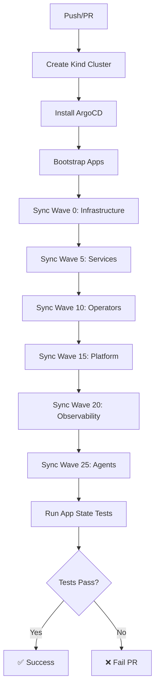
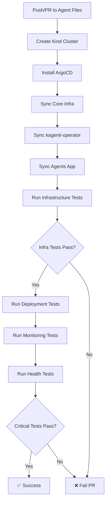

# CI/CD Testing Strategy

**Last Updated**: 2025-11-11

This document describes the automated testing strategy in GitHub Actions for the Kagenti platform.

---

## Overview

The platform uses a **layered testing approach** with multiple GitHub Actions workflows that validate different aspects of the system:

1. **App State Validation** - Validates ArgoCD application health
2. **Agent Integration Tests** - Validates agent operator infrastructure
3. *(Future)* Infrastructure Tests - Validates core infrastructure components
4. *(Future)* E2E Tests - End-to-end user workflows

---

## Workflows

### 1. App State Validation

**File**: `.github/workflows/app-state-validation.yml`

**Purpose**: Ensure all ArgoCD applications are synced and healthy.

**Triggers**:
- Push to `main` or `argocd-gitops-dev`
- Pull requests to `main` or `argocd-gitops-dev`
- Manual dispatch

**What it tests**:
- All ArgoCD applications exist
- All applications are synced
- All applications are healthy
- No pods in CrashLoopBackOff

**Test File**: `tests/validation/test_app_state.py`

**Duration**: ~30 minutes

**Key Features**:
- Creates Kind cluster automatically
- Syncs all applications in wave order
- Uploads HTML/JSON test reports
- Comments on PRs with results
- Fails PR if critical apps are unhealthy

---

### 2. Agent Integration Tests

**File**: `.github/workflows/agent-integration-tests.yml`

**Purpose**: Validate agent operator infrastructure is ready to manage agents.

**Triggers**:
- Push to `main` or `argocd-gitops-dev` (agent files changed)
- Pull requests (agent files changed)
- Manual dispatch

**What it tests**:
- ✅ Agent CRDs (agents, agentbuilds, agentcards)
- ✅ Kubernetes API accessibility for agent resources
- ✅ kagenti-operator webhook operational
- ✅ RBAC permissions configured correctly
- ⏭️ Agent deployment (skipped - images not built in CI)
- ⏭️ Agent health (skipped - requires images)

**Test File**: `tests/integration/test_agents.py`

**Duration**: ~25 minutes

**Test Breakdown**:

```python
# RUNS IN CI (Infrastructure tests)
TestAgentOperatorInfrastructure::test_agent_crd_installed           ✅
TestAgentOperatorInfrastructure::test_agentbuild_crd_installed      ✅
TestAgentOperatorInfrastructure::test_agentcard_crd_installed       ✅
TestAgentOperatorInfrastructure::test_can_list_agents               ✅
TestAgentOperatorInfrastructure::test_can_list_agentbuilds          ✅
TestAgentOperatorInfrastructure::test_can_list_agentcards           ✅
TestAgentOperatorInfrastructure::test_kagenti_operator_webhook_accessible  ✅
TestAgentOperatorInfrastructure::test_kagenti_operator_rbac_configured     ✅

# SKIPPED IN CI (Requires agent images)
TestAgentDeployment::test_research_agent_healthy                    ⏭️
TestAgentDeployment::test_code_agent_healthy                        ⏭️
TestAgentDeployment::test_orchestrator_agent_healthy                ⏭️
```

**Key Features**:
- Focuses on **operator readiness**, not agent runtime
- Tests what can be validated without building images
- Uploads test reports as artifacts
- Comments on PRs with infrastructure test results
- Only fails if critical infrastructure tests fail

**Why Skip Agent Deployment Tests in CI?**

Agent images need to be built from the main Kagenti repository and loaded into Kind. In CI:
- Images aren't built (would require Kagenti repo code)
- Loading images into Kind cluster adds significant time
- Infrastructure tests provide sufficient validation

For full agent testing (including deployment), run locally:
```bash
pytest tests/integration/test_agents.py -v
```

---

## Test Execution Flow

### App State Validation Flow



### Agent Integration Tests Flow



---

## Local Testing

### Using the Test Runner Script

The repository provides a comprehensive test runner script at `tests/integration/run_tests.sh`:

```bash
# Run all tests (excludes slow tests)
./tests/integration/run_tests.sh

# Run only critical tests (quick smoke test)
./tests/integration/run_tests.sh --fast

# Run all tests including slow tests
./tests/integration/run_tests.sh --slow

# Run tests in parallel (requires pytest-xdist)
./tests/integration/run_tests.sh --parallel

# Generate HTML report
./tests/integration/run_tests.sh --html

# Run specific test category
./tests/integration/run_tests.sh --category infrastructure
./tests/integration/run_tests.sh --category observability
./tests/integration/run_tests.sh --category platform
./tests/integration/run_tests.sh --category agents

# Get help
./tests/integration/run_tests.sh --help
```

### Run All Agent Tests Locally

```bash
# Full agent test suite (with images loaded)
pytest tests/integration/test_agents.py -v

# Only infrastructure tests (like CI)
pytest tests/integration/test_agents.py::TestAgentOperatorInfrastructure -v

# Only deployment tests
pytest tests/integration/test_agents.py::TestAgentDeployment -v

# With HTML report
pytest tests/integration/test_agents.py -v --html=report.html --self-contained-html
```

### Run App State Validation Locally

```bash
# All apps
pytest tests/validation/test_app_state.py -v

# Only critical apps
pytest tests/validation/test_app_state.py -v --only-critical

# Exclude specific apps
pytest tests/validation/test_app_state.py -v --exclude-app=agents,observability
```

---

## Manual Workflow Dispatch

Both workflows support manual triggering via GitHub Actions UI.

### App State Validation

**Parameters**:
- `cluster_mode`: `kind` (default) or `existing`
- `exclude_apps`: Comma-separated apps to exclude
- `only_critical`: Boolean to only test critical apps

### Agent Integration Tests

**Parameters**:
- `cluster_mode`: `kind` (default) or `existing`
- `load_images`: Boolean to load agent images (for future use)

---

## PR Comments

Both workflows automatically comment on pull requests with test results.

### Example App State Comment

```markdown
## 🟢 ArgoCD App State Validation ✅ PASSED

**Test Results:**
- Total Tests: 15
- Passed: ✅ 15
- Failed: ❌ 0

**Cluster Mode:** kind
**Excluded Apps:** None
**Only Critical:** false

📊 [View detailed report](...)
```

### Example Agent Integration Comment

```markdown
## 🟢 Agent Integration Tests ✅ PASSED

### Infrastructure Tests (Critical)
- Total: 8
- Passed: ✅ 8
- Failed: ❌ 0

### Test Coverage
- ✅ **Agent CRDs** - All 3 CRDs validated
- ✅ **API Access** - Cluster API accessibility
- ✅ **Operator Webhook** - Validation webhook operational
- ✅ **RBAC** - Operator permissions configured

### Notes
- 📦 Agent deployment tests skipped in CI (images not built)
- 🔬 Infrastructure tests validate operator readiness
- 🎯 Local testing with images: `pytest tests/integration/test_agents.py -v`

📊 [View detailed report](...)
```

---

## Test Artifacts

All workflows upload test results as GitHub Actions artifacts:

**App State Validation**:
- `validation-results/report.html` - HTML test report
- `validation-results/report.json` - JSON test results

**Agent Integration Tests**:
- `agent-test-results/agent-infrastructure-report.html`
- `agent-test-results/agent-infrastructure-report.json`
- `agent-test-results/agent-deployment-report.html` (if run)
- `agent-test-results/monitoring-agent-report.html` (if run)

Artifacts are retained for **30 days**.

---

## Adding New Tests

### 1. Add Integration Test

Create a new test in `tests/integration/test_agents.py`:

```python
class TestNewFeature:
    """Test new agent feature."""

    def test_feature_works(self, k8s_client):
        """Verify new feature is working."""
        # Test implementation
        assert True
```

### 2. Update Workflow (if needed)

If your test requires specific setup, update `.github/workflows/agent-integration-tests.yml`:

```yaml
- name: Run new feature tests
  run: |
    pytest tests/integration/test_agents.py::TestNewFeature \
      -v \
      --html=new-feature-report.html
```

### 3. Document in TODO_TESTS.md

Update the testing roadmap in `TODO_TESTS.md`:

```markdown
| 2.X | Test new feature | HIGH | 🟢 Complete | Platform | Week X |
```

---

## Debugging Failed CI Tests

### 1. View Test Reports

1. Go to GitHub Actions run
2. Click on failed job
3. Scroll to "Upload test results" section
4. Download artifacts
5. Open HTML report in browser

### 2. Reproduce Locally

```bash
# Use same cluster setup as CI
./scripts/kind/00-cleanup.sh
./scripts/kind/01-create-cluster.sh
./scripts/kind/02-install-argocd.sh
./scripts/kind/03-bootstrap-apps.sh

# Sync apps in same wave order
argocd app sync gateway-api cert-manager istio-base istiod istio-config \
  --port-forward --port-forward-namespace argocd --grpc-web

argocd app sync kagenti-operator \
  --port-forward --port-forward-namespace argocd --grpc-web

# Run tests
pytest tests/integration/test_agents.py::TestAgentOperatorInfrastructure -v
```

### 3. Check Logs

```bash
# Check operator logs
kubectl logs -n kagenti-system deployment/kagenti-operator-controller-manager

# Check ArgoCD application status
argocd app get agents --port-forward --port-forward-namespace argocd --grpc-web

# Check CRD status
kubectl get crd | grep agent
```

---

## CI/CD Best Practices

### 1. Test What You Can

- ✅ Test operator infrastructure (doesn't require images)
- ✅ Test CRD installation (doesn't require images)
- ✅ Test API accessibility (doesn't require images)
- ⏭️ Skip tests that require agent images (can't build in CI)

### 2. Fail Fast

- Critical infrastructure tests **must pass** for PR to merge
- Non-critical tests can be `continue-on-error: true`

### 3. Clear Feedback

- PR comments show exactly what passed/failed
- Test reports available as downloadable artifacts
- Summary page shows test breakdown

### 4. Efficient Execution

- Parallel test execution where possible
- Skip unnecessary apps in automated runs
- 30-minute timeout to prevent hanging

---

## Future Enhancements

### Phase 1: Current State ✅
- ✅ App state validation workflow
- ✅ Agent infrastructure tests workflow
- ✅ PR comments with results
- ✅ Test artifacts upload

### Phase 2: Next Steps
- 🔄 Add infrastructure tests workflow (`test_infrastructure.py`)
- 🔄 Add platform tests workflow (`test_platform.py`)
- 🔄 Add observability tests workflow (`test_observability.py`)
- 🔄 Combine all workflows into test matrix

### Phase 3: Advanced Testing
- ⏭️ E2E workflow tests (agent conversations, UI interactions)
- ⏭️ Performance tests with k6
- ⏭️ Chaos engineering tests
- ⏭️ Security scanning (RBAC, secrets, vulnerabilities)

### Phase 4: Production Readiness
- ⏭️ Multi-cluster testing
- ⏭️ Upgrade testing
- ⏭️ Disaster recovery testing
- ⏭️ Compliance testing (SOC2, PCI-DSS)

---

## Related Documentation

- **[TODO_TESTS.md](../TODO_TESTS.md)** - Comprehensive testing roadmap
- **[CLAUDE.md](../CLAUDE.md)** - TDD workflow and GitOps best practices
- **[tests/README.md](../tests/README.md)** - Test suite documentation

---

**Status**: 🟢 **PRODUCTION READY**

The CI/CD testing infrastructure validates critical platform components automatically on every push and pull request, ensuring confidence in changes before they reach production.
