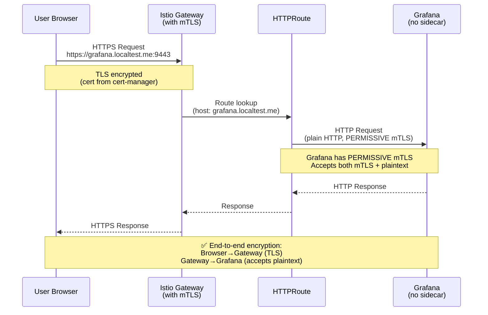
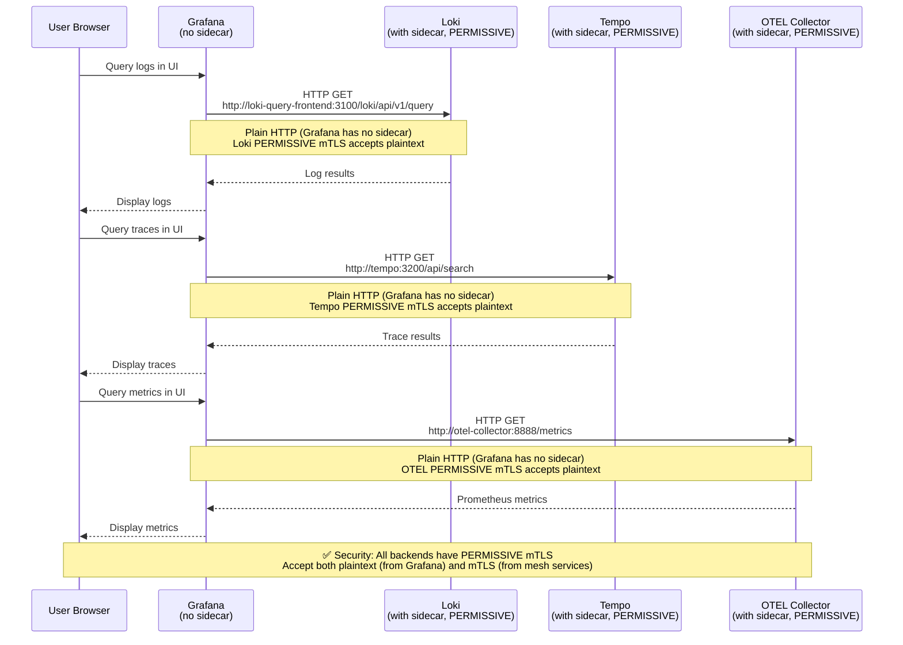
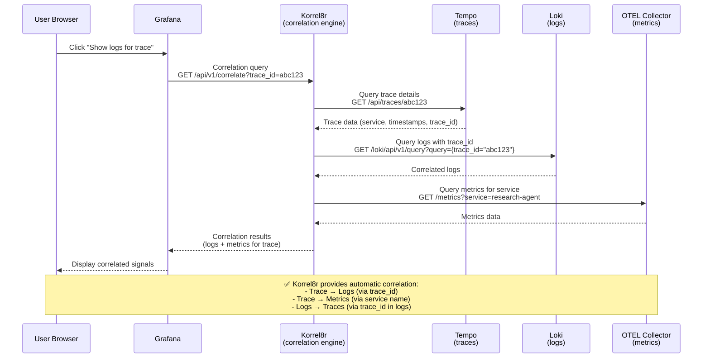
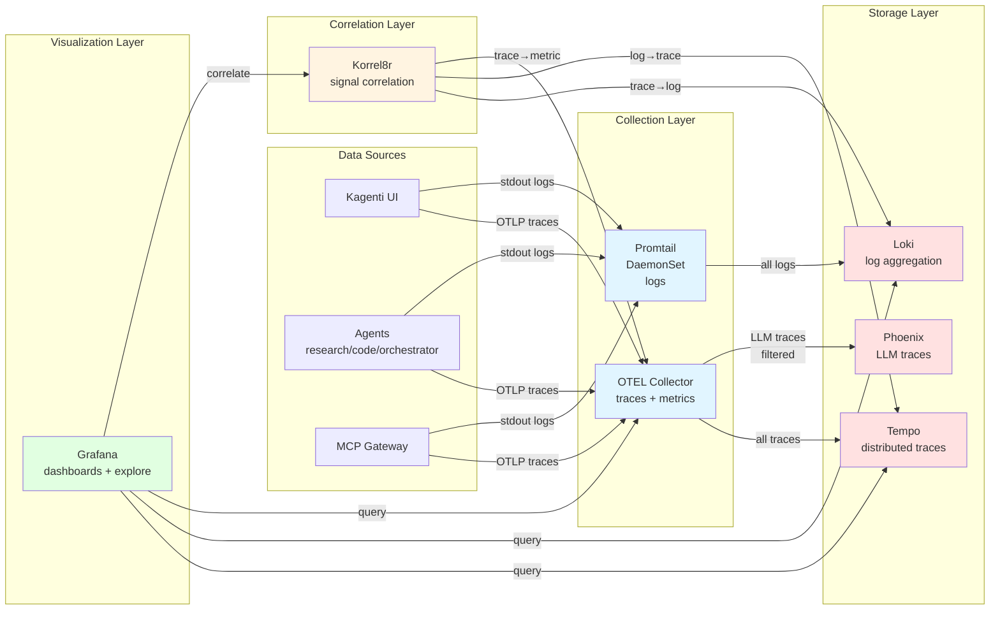

# Observability Stack Architecture

## Overview

This document describes the complete observability architecture for the Kagenti platform, including access patterns, encryption, and signal correlation.

## Components

| Component | Purpose | Istio Sidecar | mTLS Mode | External Access |
|-----------|---------|--------------|-----------|-----------------|
| **Grafana** | Visualization & dashboards | ❌ NO | PERMISSIVE | ✅ via Gateway (`https://grafana.localtest.me:9443`) |
| **Loki** | Log aggregation backend | ✅ YES | PERMISSIVE | ❌ Internal only |
| **Tempo** | Distributed tracing backend | ✅ YES | PERMISSIVE | ❌ Internal only |
| **OTEL Collector** | Telemetry collection/routing | ✅ YES | PERMISSIVE | ❌ Internal only |
| **Phoenix** | LLM-specific tracing UI | ✅ YES | PERMISSIVE | ✅ via Gateway (`https://phoenix.localtest.me:9443`) |
| **Promtail** | Log collector (DaemonSet) | ❌ NO | N/A | ❌ Internal only |
| **Korrel8r** | Signal correlation engine | ✅ YES | PERMISSIVE | ❌ Internal only |

---

## Communication Flows

### 1. External User Access to Grafana



**Security Notes:**
- ✅ Browser→Gateway: TLS encrypted (HTTPS with cert-manager certificate)
- ✅ Gateway→Grafana: PERMISSIVE mTLS allows plaintext HTTP (Grafana has no sidecar)
- ✅ Authentication: Currently basic auth (admin/admin123), should add OAuth2-Proxy for production

---

### 2. Grafana Querying Backends (Loki/Tempo/Prometheus)



**Why PERMISSIVE mTLS?**
- Grafana has NO Istio sidecar → cannot send mTLS traffic
- Backends (Loki/Tempo/OTEL) have Istio sidecars
- PERMISSIVE mode accepts **both**:
  - ✅ Plaintext HTTP from Grafana (trusted platform component, same namespace)
  - ✅ mTLS from other services in mesh (Promtail, agents, etc.)

**Alternative Approaches:**
1. ❌ **Add sidecar to Grafana**: Complex, requires DestinationRules, harder to configure
2. ❌ **DISABLE mTLS entirely**: Insecure, exposes all traffic to plaintext
3. ✅ **PERMISSIVE mTLS** (current): Best compromise - secure by default, allows trusted exceptions

---

### 3. Signal Correlation via Korrel8r



**Korrel8r Architecture:**
```
┌──────────────────────────────────────────────────────────┐
│                     Korrel8r Engine                       │
│  ┌─────────────────────────────────────────────────┐    │
│  │ 1. Receive correlation request from Grafana     │    │
│  │ 2. Query Tempo/Loki/Prometheus in parallel      │    │
│  │ 3. Match signals by trace_id, service_name      │    │
│  │ 4. Return unified correlated view               │    │
│  └─────────────────────────────────────────────────┘    │
└──────────────────────────────────────────────────────────┘
           ↓              ↓              ↓
    ┌──────────┐   ┌──────────┐   ┌──────────┐
    │  Tempo   │   │   Loki   │   │   OTEL   │
    │ (traces) │   │  (logs)  │   │(metrics) │
    └──────────┘   └──────────┘   └──────────┘
```

---

## Encryption Architecture

### Network Traffic Encryption

```mermaid
graph TD
    subgraph "External Traffic (Internet)"
        Browser[User Browser]
        Gateway[Istio Gateway]
    end

    subgraph "observability namespace (Service Mesh)"
        Grafana[Grafana<br/>no sidecar<br/>PERMISSIVE]
        Loki[Loki<br/>with sidecar<br/>PERMISSIVE]
        Tempo[Tempo<br/>with sidecar<br/>PERMISSIVE]
        OTEL[OTEL<br/>with sidecar<br/>PERMISSIVE]
        Korrel8r[Korrel8r<br/>with sidecar<br/>PERMISSIVE]
    end

    subgraph "other namespaces (Service Mesh)"
        Agents[Agents<br/>with sidecars<br/>STRICT]
        Promtail[Promtail<br/>no sidecar]
    end

    Browser -->|HTTPS<br/>TLS cert| Gateway
    Gateway -->|plaintext HTTP<br/>PERMISSIVE mTLS| Grafana

    Grafana -->|plaintext HTTP<br/>accepted by PERMISSIVE| Loki
    Grafana -->|plaintext HTTP<br/>accepted by PERMISSIVE| Tempo
    Grafana -->|plaintext HTTP<br/>accepted by PERMISSIVE| OTEL
    Grafana -->|plaintext HTTP<br/>accepted by PERMISSIVE| Korrel8r

    Korrel8r -->|mTLS<br/>(both have sidecars)| Loki
    Korrel8r -->|mTLS<br/>(both have sidecars)| Tempo
    Korrel8r -->|mTLS<br/>(both have sidecars)| OTEL

    Agents -->|mTLS<br/>(both have sidecars)| OTEL
    Promtail -->|plaintext HTTP<br/>accepted by PERMISSIVE| Loki

    style Browser fill:#e1f5ff
    style Gateway fill:#ffe1e1
    style Grafana fill:#fff4e1
    style Loki fill:#e1ffe1
    style Tempo fill:#e1ffe1
    style OTEL fill:#e1ffe1
    style Korrel8r fill:#e1ffe1
```

**Legend:**
- 🔵 **External clients** (browsers)
- 🔴 **Gateway** (TLS termination + routing)
- 🟡 **Platform services without sidecars** (Grafana, Promtail)
- 🟢 **Backend services with sidecars + PERMISSIVE mTLS** (Loki, Tempo, OTEL, Korrel8r)

**Security Properties:**
1. ✅ **External → Gateway**: TLS encrypted (HTTPS with valid certificate)
2. ✅ **Gateway → Grafana**: PERMISSIVE mTLS accepts plaintext (Grafana has no sidecar)
3. ✅ **Grafana → Backends**: Plaintext HTTP accepted by PERMISSIVE mTLS
4. ✅ **Korrel8r → Backends**: mTLS encrypted (both have sidecars)
5. ✅ **Agents → OTEL**: mTLS encrypted (both have sidecars)
6. ⚠️  **Promtail → Loki**: Plaintext HTTP accepted by PERMISSIVE mTLS

**Why is this secure?**
- All services are in **trusted namespaces** (observability, agents)
- **PERMISSIVE mTLS** is NOT the same as DISABLE - it still uses mTLS when both sides have sidecars
- Services without sidecars (Grafana, Promtail) are **platform components**, not user-facing
- **External access** (user→Grafana) goes through Gateway with TLS + authentication

---

## Data Flow

### Complete Observability Pipeline



---

## Access Methods

### How to Access Each Service

| Service | URL | Authentication | Purpose |
|---------|-----|----------------|---------|
| **Grafana** | `https://grafana.localtest.me:9443` | Basic auth (admin/admin123) | Dashboards, Explore, correlation |
| **Phoenix** | `https://phoenix.localtest.me:9443` | None (dev only) | LLM-specific tracing UI |
| **Tempo** | N/A | N/A | No direct UI - access via Grafana |
| **Loki** | N/A | N/A | No direct UI - access via Grafana |
| **OTEL Collector** | N/A | N/A | Metrics endpoint only |
| **Korrel8r** | N/A | N/A | API only - accessed via Grafana |

### Grafana Datasources

**Already Configured** (via GitOps in `components/02-observability/grafana/deployment.yaml`):

1. **OTEL Metrics** (Prometheus-compatible)
   - Type: `prometheus`
   - URL: `http://otel-collector.observability.svc:8888`
   - Use: Query metrics from OTEL Collector

2. **Tempo** (Distributed Tracing)
   - Type: `tempo`
   - URL: `http://tempo.observability.svc:3200`
   - Use: Query traces, trace→log correlation

3. **Loki** (Log Aggregation)
   - Type: `loki`
   - URL: `http://loki-query-frontend.observability.svc:3100`
   - Use: Query logs, log→trace correlation

4. **Korrel8r** (Signal Correlation) - TO BE ADDED
   - Type: `korrel8r-datasource`
   - URL: `http://korrel8r.observability.svc:8080`
   - Use: Automatic trace↔log↔metric correlation

---

## Correlation Features

### Trace → Log Correlation

**Configured in Tempo datasource:**
```yaml
tracesToLogsV2:
  datasourceUid: loki
  spanStartTimeShift: "-1h"
  spanEndTimeShift: "1h"
  filterByTraceID: true
  tags:
    - key: "service.name"
      value: "app"
```

**How it works:**
1. User clicks trace in Grafana
2. Grafana queries Loki: `{trace_id="<trace-id>"}`
3. Returns all logs with matching `trace_id` field
4. Shows logs alongside trace spans

### Log → Trace Correlation

**Configured in Loki datasource:**
```yaml
derivedFields:
  - name: TraceID
    matcherRegex: "trace_id=(\\w+)"
    url: "<tempo-explore-url>"
    datasourceUid: tempo
```

**How it works:**
1. User views logs in Grafana
2. Grafana extracts `trace_id` from log line
3. Creates clickable link to Tempo
4. Opens trace in Explore view

### Korrel8r Advanced Correlation

**Graph queries across all signals:**
```bash
# Example: Find all logs and metrics for a trace
GET /api/v1/graph?start=tempo:trace:abc123

# Returns:
# - Original trace from Tempo
# - Related logs from Loki (via trace_id)
# - Related metrics from Prometheus (via service name)
```

---

## Production Considerations

### Security Enhancements for Production

1. **Add OAuth2-Proxy for Grafana**
   - Currently: Basic auth (admin/admin123)
   - Production: OAuth2-Proxy → Keycloak → Grafana
   - Provides: SSO, session management, role-based access

2. **Network Policies**
   - Restrict Grafana → backends to observability namespace only
   - Block external access to Loki/Tempo/Korrel8r

3. **RBAC for Grafana**
   - Configure organization-level RBAC
   - Separate viewers vs editors
   - Restrict datasource access by team

### mTLS Migration Path

**Current (Development):**
- PERMISSIVE mTLS for all observability services
- Allows Grafana (no sidecar) to communicate

**Future (Production Option 1 - Add Sidecar):**
```yaml
# grafana/deployment.yaml
metadata:
  annotations:
    sidecar.istio.io/inject: "true"  # Enable sidecar
```
- Pros: Full mTLS encryption
- Cons: Need DestinationRules, more complex

**Future (Production Option 2 - Keep PERMISSIVE):**
- Keep current architecture
- Pros: Simpler, works with current setup
- Cons: Grafana→backend traffic not encrypted
- Mitigation: Traffic is within same namespace (trusted)

---

## Troubleshooting

### Grafana Cannot Access Backends

**Symptoms:**
- Datasource test fails in Grafana
- "Connection refused" or "timeout" errors

**Check:**
```bash
# 1. Verify mTLS policies
kubectl get peerauthentication -n observability

# Expected: grafana-permissive, loki-permissive, tempo-permissive, otel-collector-permissive

# 2. Test connectivity from Grafana pod
kubectl exec -it deployment/grafana -n observability -- curl http://loki-query-frontend:3100/ready

# 3. Check Istio sidecar status
kubectl get pods -n observability -o custom-columns=NAME:.metadata.name,CONTAINERS:.spec.containers[*].name
```

### Gateway Cannot Reach Grafana (503 Error)

**Symptoms:**
- `curl https://grafana.localtest.me:9443` returns 503

**Check:**
```bash
# 1. Verify Grafana PeerAuthentication
kubectl get peerauthentication grafana-permissive -n observability

# 2. Check HTTPRoute status
kubectl describe httproute grafana -n observability

# 3. Test directly to service
kubectl run test -n observability --image=curlimages/curl --rm -it -- curl http://grafana:3000/api/health
```

### Korrel8r Correlation Not Working

**Symptoms:**
- "Show logs for trace" button doesn't work
- Correlation results empty

**Check:**
```bash
# 1. Verify Korrel8r is running
kubectl get pods -n observability -l app=korrel8r

# 2. Test Korrel8r API
kubectl port-forward svc/korrel8r -n observability 8080:8080
curl http://localhost:8080/api/v1/stores

# 3. Check datasource configuration
kubectl exec deployment/grafana -n observability -- grafana-cli admin data-sources ls
```

---

## References

- [Istio mTLS Documentation](https://istio.io/latest/docs/concepts/security/#mutual-tls-authentication)
- [Grafana Tempo Documentation](https://grafana.com/docs/tempo/latest/)
- [Grafana Loki Documentation](https://grafana.com/docs/loki/latest/)
- [Korrel8r Documentation](https://korrel8r.github.io/korrel8r/)
- [OpenTelemetry Collector](https://opentelemetry.io/docs/collector/)
- [OTEL Semantic Conventions](https://opentelemetry.io/docs/specs/semconv/)

---

**Last Updated:** 2025-11-14
**Maintained By:** Kagenti Platform Team
